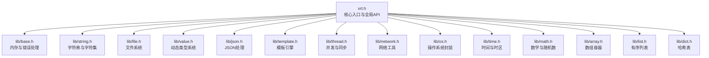
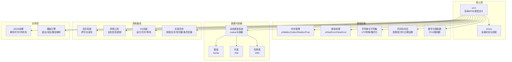
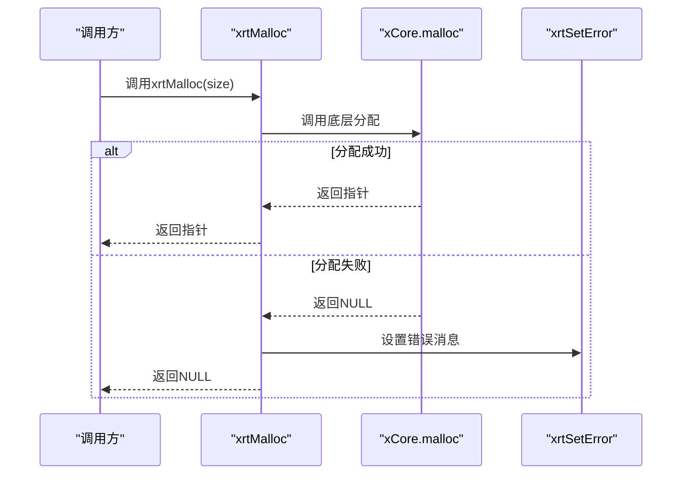
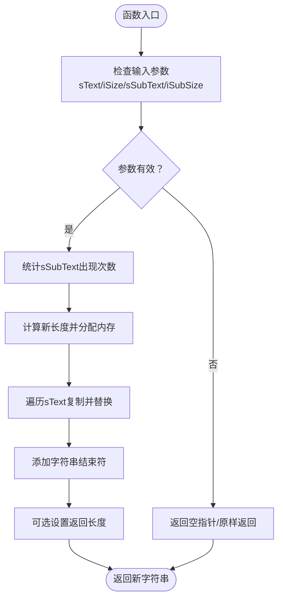
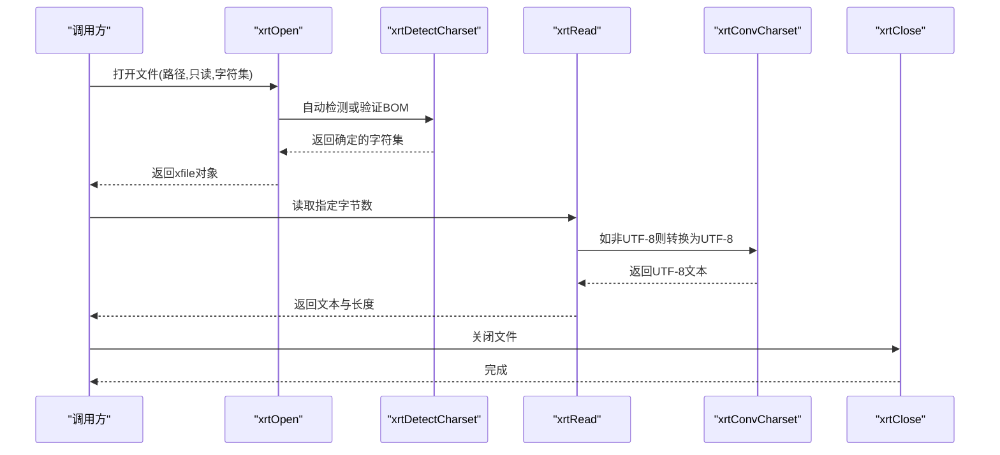
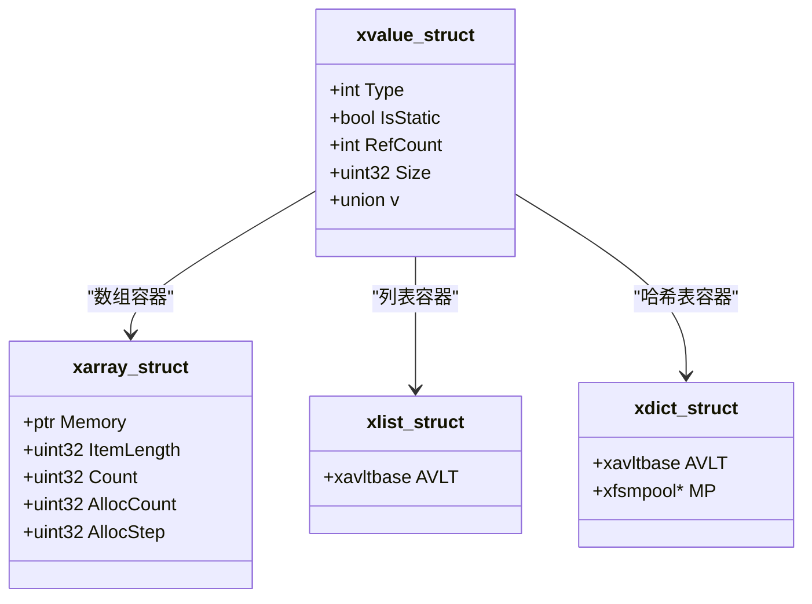
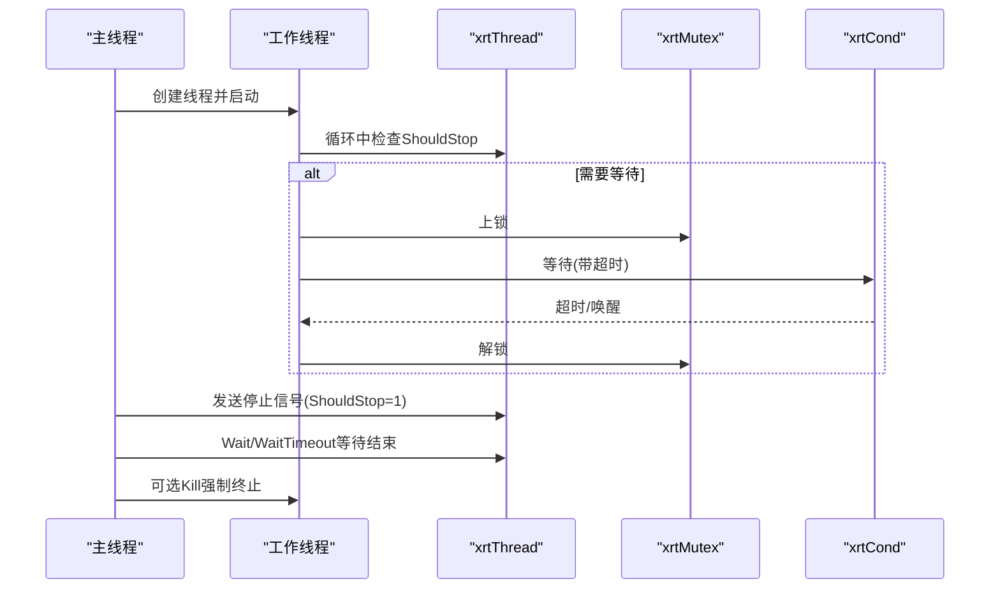
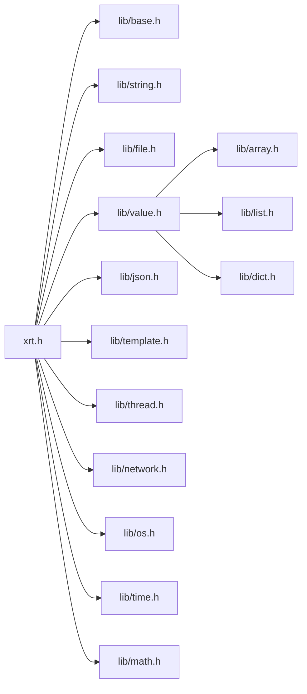

# API参考手册

<cite>
**本文档引用的文件**
- [xrt.h](file://xrt.h)
- [base.h](file://lib/base.h)
- [string.h](file://lib/string.h)
- [file.h](file://lib/file.h)
- [json.h](file://lib/json.h)
- [template.h](file://lib/template.h)
- [value.h](file://lib/value.h)
- [array.h](file://lib/array.h)
- [list.h](file://lib/list.h)
- [dict.h](file://lib/dict.h)
- [thread.h](file://lib/thread.h)
- [network.h](file://lib/network.h)
- [math.h](file://lib/math.h)
- [os.h](file://lib/os.h)
- [time.h](file://lib/time.h)
</cite>

## 目录
1. [简介](#简介)
2. [项目结构](#项目结构)
3. [核心组件](#核心组件)
4. [架构总览](#架构总览)
5. [详细组件分析](#详细组件分析)
6. [依赖关系分析](#依赖关系分析)
7. [性能考虑](#性能考虑)
8. [故障排除指南](#故障排除指南)
9. [结论](#结论)
10. [附录](#附录)

## 简介
本手册面向XRT库的使用者与维护者，提供完整的API参考文档。内容涵盖基础内存管理、错误处理、字符集转换、字符串操作、文件操作、动态类型系统、JSON处理、模板引擎以及并发与网络等模块。每个API均包含函数签名、参数说明、返回值定义、使用示例与最佳实践，并提供API索引与交叉引用以便快速定位。

## 项目结构
XRT采用模块化设计，核心入口位于顶层头文件，各功能模块以独立头文件形式提供API声明与实现。主要模块包括：
- 基础模块：内存管理、错误处理、全局状态
- 字符串与字符集：UTF编码转换、字符串处理
- 文件系统：跨平台文件读写、目录操作
- 动态类型系统：统一的xvalue类型与容器
- JSON处理：高性能解析与打印
- 模板引擎：轻量级模板语法与渲染
- 并发与同步：线程、互斥体、信号量、条件变量
- 网络与OS：主机信息、进程启动、系统调用封装
- 时间与时区：高精度计时、日期时间运算

图表来源
- [xrt.h](file://xrt.h#L1-L2740)
- [base.h](file://lib/base.h#L1-L132)
- [string.h](file://lib/string.h#L1-L800)
- [file.h](file://lib/file.h#L1-L800)
- [value.h](file://lib/value.h#L1-L800)
- [json.h](file://lib/json.h#L1-L800)
- [template.h](file://lib/template.h#L1-L800)
- [thread.h](file://lib/thread.h#L1-L749)
- [network.h](file://lib/network.h#L1-L214)
- [os.h](file://lib/os.h#L1-L90)
- [time.h](file://lib/time.h#L1-L800)
- [math.h](file://lib/math.h#L1-L175)
- [array.h](file://lib/array.h#L1-L180)
- [list.h](file://lib/list.h#L1-L188)
- [dict.h](file://lib/dict.h#L1-L204)

章节来源
- [xrt.h](file://xrt.h#L1-L2740)

## 核心组件

### 基础模块（内存管理与错误处理）
- 内存管理
  - xrtMalloc(size_t): 分配内存；失败时设置错误
  - xrtCalloc(size_t,size_t): 分配并清零
  - xrtRealloc(ptr,size_t): 重新分配
  - xrtFree(ptr): 释放内存（空指针与全局空指针安全）
  - xrtTempMemory(size_t): 临时内存（环形缓存，线程不安全）
  - xrtFreeTempMemory(): 释放所有临时内存
- 错误处理
  - xrtSetError(str,bool)/xrtSetErrorU16()/xrtSetErrorU32(): 设置错误消息（可选释放）
  - xrtClearError(): 清除错误
  - 全局错误回调：xCore.OnError

使用示例
- 分配并释放内存
  - 使用xrtMalloc分配，失败时通过xrtSetError记录；最终使用xrtFree释放
- 临时内存
  - 使用xrtTempMemory进行短生命周期对象分配，周期性调用xrtFreeTempMemory清理

最佳实践
- 所有返回动态内存的API在失败时返回空指针或全局空指针，调用方应始终检查返回值
- 临时内存适合短期使用，避免长期持有导致内存泄漏
- 错误消息由xCore统一管理，可通过xCore.OnError订阅

章节来源
- [base.h](file://lib/base.h#L1-L132)
- [xrt.h](file://xrt.h#L189-L236)

### 字符串与字符集
- 字符串复制与比较
  - xrtCopyStr/16/32/内存：复制字符串或内存
  - xrtStrComp：大小写敏感/不敏感比较
- 大小写与裁剪
  - xrtLCase/xrtUCase：大小写转换（支持UTF-8多字节）
  - xrtLTrim/xrtRTrim/xrtTrim：裁剪空白或指定字符
- 搜索与过滤
  - xrtFindStr/xrtInStr：搜索子串（支持大小写）
  - xrtCheckStr：检查是否包含指定字符集合（UTF-8多字节）
  - xrtFilterStr：过滤字符
- 模式匹配与替换
  - xrtStrLike：通配符匹配（*、?、大小写选项）
  - xrtReplace：替换子串
- 分割与随机
  - xrtSplit：按分隔符分割（返回数组需释放）
  - xrtRandStr：生成随机字符串
- 编解码与格式化
  - xrtHexEncode/Decode：HEX编解码
  - xrtBase64Encode/Decode：Base64编解码
  - xrtIntFormat/xrtNumFormat：整数/浮点格式化
  - xrtStrSim：字符串相似度（编辑距离）
  - xrtStrApprox：字符串约等于（基于配置）
- 字符集转换
  - xrtUTF8to16/32、xrtUTF16/32互转、xrtConvCharset
  - xrtIsUTF8、xrtDetectCharset、xrtGetCharSize

使用示例
- 文本编码转换
  - 使用xrtUTF8to16将UTF-8文本转换为UTF-16
- 字符串格式化
  - 使用xrtFormat进行格式化输出，注意返回值需释放

最佳实践
- 裁剪与过滤操作支持UTF-8多字节字符，避免在字节边界截断
- 通配符匹配与相似度计算适用于文本检索场景
- 编解码函数返回值需使用xrtFree释放

章节来源
- [string.h](file://lib/string.h#L1-L800)
- [xrt.h](file://xrt.h#L239-L428)

### 文件系统
- 文件对象与打开
  - xfile结构：跨平台文件句柄封装
  - xrtOpen：打开文件（支持只读、自动/手动字符集）
  - xrtClose：关闭文件
- 游标与状态
  - xrtSeek/xrtTell/xrtGetEOF/xrtEOF/xrtSetEOF：游标与文件状态
- 读写操作
  - xrtRead/xrtWrite：文本读写（自动字符集转换）
  - xrtGet/xrtPut：二进制读写
  - xrtFileAppend/xrtFileWriteAll：便捷写入
  - xrtFileReadAll/xrtFileGetAll：读取全部内容
- 文件与目录
  - xrtPathExists/xrtFileExists/xrtDirExists：存在性检查
  - xrtFileGetSize/xrtFileSetSize：尺寸
  - xrtFileGetAttr/xrtFileSetAttr：属性
  - xrtFileGetAccessTime/xrtFileGetChangeTime：时间戳
  - xrtFileCopy/xrtFileMove/xrtFileDelete：文件操作
  - xrtDirScan/xrtDirCreate/xrtDirCreateAll/xrtDirCopy/xrtDirMove/xrtDirDelete：目录操作

使用示例
- 读取文本文件（自动字符集检测）
  - 使用xrtOpen打开文件，设置iCharset为XRT_CP_AUTO；使用xrtRead读取，完成后xrtClose
- 写入二进制文件
  - 使用xrtFilePutAll一次性写入

最佳实践
- 手动指定字符集时，注意BOM处理与编码一致性
- 读写前检查文件大小，避免读取过大文件导致内存压力
- 目录操作建议先检查存在性，再进行创建或删除

章节来源
- [file.h](file://lib/file.h#L1-L800)
- [xrt.h](file://xrt.h#L649-L770)

### 动态类型系统
- 值类型与创建
  - xvalue：统一值类型，支持null、bool、int、float、text、time、point、func、array、list、coll、table、class、custom
  - xvoCreateNull/Bool/Int/Float/Text/Time/Point/Func/Array/List/Coll/Table/Class/Custom
- 引用计数与生命周期
  - xvoAddRef/xvoUnref：引用计数管理
- 读取与转换
  - xvoGetBool/Int/Float/Text/Time/Point/Func/Array/List/Coll/Table/Class/Custom
- 容器操作
  - 数组：xvoArrayGetValue/Append/Insert/Set/Merge/Swap/Remove/Count/Alloc/Sort
  - 列表：xvoListGetValue/Set/Merge/Exists/Count/Walk
  - 哈希表：xvoTableGetValue/Set/Merge/Exists/Count/Walk

使用示例
- 创建数组并添加元素
  - 使用xvoCreateArray创建数组，使用xvoArrayAppendValue追加xvalue；注意bColloc参数决定是否转移所有权
- 表达式求值
  - 使用xvalue统一承载各种数据类型，配合xvoGetText等函数进行格式化输出

最佳实践
- 引用计数避免重复拷贝，但需确保成对的AddRef/Unref
- 容器内部存储的xvalue在删除时会自动Unref，避免内存泄漏

章节来源
- [value.h](file://lib/value.h#L1-L800)
- [array.h](file://lib/array.h#L1-L180)
- [list.h](file://lib/list.h#L1-L188)
- [dict.h](file://lib/dict.h#L1-L204)

### JSON处理
- 解析与打印
  - SAX风格解析：xrtJsonParse（内部使用json_parse_t）
  - 打印接口：xrtJsonPrintStart/xrtJsonPrintValue/xrtJsonPrintFinish
  - 字符串信息：xrtJsonGetStringInfo/xrtJsonUpdateStringInfo
- 内存池
  - json_mem_t/json_mem_mgr_t/json_mem_node_t：块内存管理，提升小JSON解析性能
- 配置与宏
  - JSON_PARSE_*系列宏：控制解析行为（注释、逗号、空键、特殊字符、十六进制、特殊数字、单值、完成字符）
  - JSON_PRINT_*系列宏：控制打印行为（UTF-16支持、初始容量、增长步长、深度、大小增长）

使用示例
- 解析JSON字符串
  - 使用xrtJsonParse解析，结合回调处理事件流
- 生成格式化JSON
  - 使用xrtJsonPrintStart创建打印句柄，逐项调用xrtJsonPrintValue，最后xrtJsonPrintFinish获取结果

最佳实践
- 大量小对象解析时启用块内存池，减少碎片化
- 打印时合理设置item_total/plus_size，避免频繁扩容

章节来源
- [json.h](file://lib/json.h#L1-L800)
- [xrt.h](file://xrt.h#L196-L289)

### 模板引擎
- 语法与特性
  - 变量：{$var}、{=sub}、{*arr:*sub}
  - 控制：{#if}/{#elseif}/{#else}/{#end}、{#for}/{#end}、{#foreach}/{#end}
  - 脚本：{#script:lang}...{#end}
  - 子模板：{#define}...{#end}、{=name}
  - include：{#include:file}
- 词法分析
  - xteLexer：将模板文本解析为Token列表
  - XTE_TokenItem：包含类型、参数、引用位置等
- 路径解析
  - xteResolvePath：支持a.b.c、arr[0]、obj["key"]等路径访问

使用示例
- 解析模板并生成Token列表
  - 调用xteLexer，处理错误码与行号信息，随后进行渲染

最佳实践
- 子模板不可嵌套，define语句块内不支持define
- 脚本块不解析转义符，遇到{#end}结束

章节来源
- [template.h](file://lib/template.h#L1-L800)
- [xrt.h](file://xrt.h#L196-L289)

### 并发与同步
- 线程
  - xrtThreadCreate/Destroy/Wait/WaitTimeout/Stop/ShouldStop/Kill/Suspend/Resume/GetState/GetExitCode/GetCurrentId/Yield
- 互斥体
  - xrtMutexCreate/Destroy/Init/Unit/Lock/TryLock/Unlock
- 信号量
  - xrtSemCreate/Destroy/Init/Unit/Wait/TryWait/WaitTimeout/Post/PostMultiple
- 条件变量
  - xrtCondCreate/Destroy/Init/Unit/Wait/WaitTimeout/Signal/Broadcast

使用示例
- 创建线程并等待
  - 使用xrtThreadCreate创建线程，线程函数中定期检查xrtThreadShouldStop以响应停止信号

最佳实践
- Windows与POSIX平台差异：挂起/恢复在POSIX不直接支持
- 信号量PostMultiple在POSIX循环调用post

章节来源
- [thread.h](file://lib/thread.h#L1-L749)
- [xrt.h](file://xrt.h#L771-L847)

### 网络与OS
- 主机信息
  - xrtGetLocalIP/xrtGetLocalRawIP/xrtGetLocalMAC/xrtGetLocalName
- 进程与系统
  - xrtRun：运行程序（跨平台）
  - xrtStart：打开文件（Windows使用ShellExecute，Linux使用xdg-open）
  - xrtChain：运行并等待结束（返回退出码）

使用示例
- 获取本机IP
  - 调用xrtGetLocalIP，返回字符串需释放

最佳实践
- Linux下使用getaddrinfo优先于gethostbyname（TCC环境例外）
- 网络设备查询需具备相应权限

章节来源
- [network.h](file://lib/network.h#L1-L214)
- [os.h](file://lib/os.h#L1-L90)
- [xrt.h](file://xrt.h#L291-L301)

### 时间与时区
- 高精度计时与休眠
  - xrtTimer：高精度计时（秒）
  - xrtSleep：毫秒级休眠
- 日期与时间运算
  - xrtNow/xrtDate/xrtTime：当前时间
  - xrtNowStr/xrtDateStr/xrtTimeStr/xrtTimeToStr：格式化输出
  - xrtTimeSerial/xrtDateSerial/xrtDateTimeSerial：构建时间
  - xrtDecodeSerial：解码时间
  - xrtDateAdd/xrtDateDiff：时间单位累加与差值
  - xrtQuarter/xrtWeekOfYear/xrtWeekOfMonth：季度与周数
  - xrtFirstDayOfMonth/xrtLastDayOfMonth/xrtFirstDayOfYear/xrtLastDayOfYear：边界日期
  - xrtIsSameDay/xrtIsSameMonth/xrtIsSameYear：相等性判断
  - xrtTimeInRange/xrtTimeRangeOverlap：区间判断
  - xrtToUnixTime/xrtFromUnixTime：Unix时间戳互转
  - xrtNowUTC/xrtTimezoneOffset：UTC与时区偏移

使用示例
- 计算两个时间的差值（以小时为单位）
  - 使用xrtDateDiff(interval=HOUR, t1, t2)

最佳实践
- 跨平台使用QueryPerformanceCounter（Windows）或clock_gettime（Linux）保证精度
- 时区转换建议统一使用UTC存储，显示时转换

章节来源
- [time.h](file://lib/time.h#L1-L800)
- [xrt.h](file://xrt.h#L456-L646)

### 数学与随机数
- 随机数（PCG）
  - xrtRandSeed：初始化状态
  - xrtRand32Ex/xrtRand64Ex/xrtRandRangeEx：线程安全版本
  - xrtRand32/xrtRand64/xrtRandRange：全局状态版本
- 约等于
  - xrtIntApprox/xrtNumApprox：整数/浮点约等于（支持差值与百分比两种模式）

使用示例
- 生成1-100范围内的随机数
  - 调用xrtRandRange(1, 100)

最佳实践
- 多线程场景使用Ex版本API，避免共享状态竞争
- 约等于阈值通过全局配置控制

章节来源
- [math.h](file://lib/math.h#L1-L175)
- [xrt.h](file://xrt.h#L304-L340)

## 架构总览

图表来源
- [xrt.h](file://xrt.h#L1-L2740)
- [base.h](file://lib/base.h#L1-L132)
- [string.h](file://lib/string.h#L1-L800)
- [file.h](file://lib/file.h#L1-L800)
- [value.h](file://lib/value.h#L1-L800)
- [array.h](file://lib/array.h#L1-L180)
- [list.h](file://lib/list.h#L1-L188)
- [dict.h](file://lib/dict.h#L1-L204)
- [thread.h](file://lib/thread.h#L1-L749)
- [network.h](file://lib/network.h#L1-L214)
- [os.h](file://lib/os.h#L1-L90)
- [time.h](file://lib/time.h#L1-L800)
- [math.h](file://lib/math.h#L1-L175)
- [json.h](file://lib/json.h#L1-L800)
- [template.h](file://lib/template.h#L1-L800)

## 详细组件分析

### 基础API序列图（内存分配与释放）

图表来源
- [base.h](file://lib/base.h#L4-L13)
- [xrt.h](file://xrt.h#L211-L221)

### 字符串替换流程图

图表来源
- [string.h](file://lib/string.h#L732-L771)

### 文件读取序列图（自动字符集检测）

图表来源
- [file.h](file://lib/file.h#L16-L277)
- [file.h](file://lib/file.h#L475-L558)

### 动态类型系统类图

图表来源
- [value.h](file://lib/value.h#L1-L800)
- [array.h](file://lib/array.h#L1-L180)
- [list.h](file://lib/list.h#L1-L188)
- [dict.h](file://lib/dict.h#L1-L204)

### 并发同步序列图（线程等待与停止）

图表来源
- [thread.h](file://lib/thread.h#L36-L290)
- [xrt.h](file://xrt.h#L771-L847)

## 依赖关系分析

图表来源
- [xrt.h](file://xrt.h#L1-L2740)
- [base.h](file://lib/base.h#L1-L132)
- [string.h](file://lib/string.h#L1-L800)
- [file.h](file://lib/file.h#L1-L800)
- [value.h](file://lib/value.h#L1-L800)
- [json.h](file://lib/json.h#L1-L800)
- [template.h](file://lib/template.h#L1-L800)
- [thread.h](file://lib/thread.h#L1-L749)
- [network.h](file://lib/network.h#L1-L214)
- [os.h](file://lib/os.h#L1-L90)
- [time.h](file://lib/time.h#L1-L800)
- [math.h](file://lib/math.h#L1-L175)
- [array.h](file://lib/array.h#L1-L180)
- [list.h](file://lib/list.h#L1-L188)
- [dict.h](file://lib/dict.h#L1-L204)

## 性能考虑
- 内存管理
  - 优先使用xrtTempMemory进行短期对象分配，减少频繁分配/释放带来的碎片
  - 对大量小对象使用块内存池（JSON模块）降低分配成本
- 字符串与字符集
  - 避免在UTF-8多字节边界进行裁剪；使用提供的UTF感知函数
  - 批量格式化使用xrtFormat，注意返回值释放
- 文件系统
  - 大文件读取建议分块读取，避免一次性分配过大内存
  - 自动字符集检测会读取文件头部进行推断，建议在已知编码时手动指定
- 动态类型系统
  - 引用计数避免重复拷贝，但需成对AddRef/Unref
  - 容器内部元素在删除时自动Unref，减少泄漏风险
- 并发
  - 多线程场景使用Ex版本随机数API，避免共享状态竞争
  - 信号量PostMultiple在POSIX平台循环调用，注意性能影响
- 时间与时区
  - 高频计时使用xrtTimer，避免多次系统调用
  - 时区转换统一使用UTC存储，减少重复转换

## 故障排除指南
- 内存相关
  - xrtMalloc失败：检查系统可用内存；确认xCore.OnError回调是否被设置
  - 临时内存泄漏：确保周期性调用xrtFreeTempMemory
- 字符串与字符集
  - 编码转换失败：检查输入编码与BOM；使用xrtDetectCharset辅助判断
  - 裁剪/过滤异常：确认输入为UTF-8且未在多字节边界截断
- 文件系统
  - 打开失败：检查路径与权限；Windows下确认CreateFileW返回值
  - BOM错误：手动指定编码并确保BOM一致
- 动态类型系统
  - 引用计数异常：检查AddRef/Unref配对；避免重复释放
- JSON处理
  - 解析错误：查看JSON_ERROR_PRINT_ENABLE与错误描述；调整JSON_PARSE_*宏
  - 打印失败：检查item_total/plus_size配置，避免频繁扩容
- 模板引擎
  - 语法错误：检查XTE_ERROR_DESC与错误行号；确认子模板未嵌套
- 并发
  - 线程挂起：POSIX平台不支持挂起/恢复，改用条件变量
  - 信号量阻塞：检查Wait/WaitTimeout参数与平台差异
- 网络与OS
  - 主机信息获取失败：检查gethostname/getaddrinfo/ioctl调用返回值
  - 进程启动失败：确认命令路径与权限

章节来源
- [base.h](file://lib/base.h#L88-L132)
- [string.h](file://lib/string.h#L1-L800)
- [file.h](file://lib/file.h#L1-L800)
- [json.h](file://lib/json.h#L1-L800)
- [template.h](file://lib/template.h#L1-L800)
- [thread.h](file://lib/thread.h#L1-L749)
- [network.h](file://lib/network.h#L1-L214)
- [os.h](file://lib/os.h#L1-L90)

## 结论
XRT提供了跨平台、模块化的C库API，覆盖内存管理、字符串处理、文件系统、动态类型、JSON、模板、并发与网络等关键领域。通过统一的错误处理机制与跨平台抽象，开发者可以在Windows与Linux环境下一致地使用这些API。建议在实际项目中遵循本文档的最佳实践，充分利用块内存池、引用计数与高精度计时等特性，以获得更好的性能与可靠性。

## 附录

### API索引与交叉引用
- 基础模块
  - 内存：xrtMalloc/xrtCalloc/xrtRealloc/xrtFree/xrtTempMemory/xrtFreeTempMemory
  - 错误：xrtSetError/xrtSetErrorU16/xrtSetErrorU32/xrtClearError
- 字符串与字符集
  - 复制/比较：xrtCopyStr/xrtStrComp
  - 大小写/裁剪：xrtLCase/xrtUCase/xrtLTrim/xrtRTrim/xrtTrim
  - 搜索/过滤：xrtFindStr/xrtInStr/xrtCheckStr/xrtFilterStr
  - 匹配/替换/分割：xrtStrLike/xrtReplace/xrtSplit
  - 编解码/格式化：xrtHexEncode/xrtHexDecode/xrtBase64Encode/xrtBase64Decode/xrtIntFormat/xrtNumFormat/xrtStrSim/xrtStrApprox
  - 字符集：xrtUTF8to16/xrtUTF8to32/xrtUTF16to8/xrtUTF16to32/xrtUTF32to8/xrtUTF32to16/xrtUTF16LEtoBE/xrtUTF32LEtoBE/xrtConvCharset/xrtIsUTF8/xrtDetectCharset/xrtGetCharSize
- 文件系统
  - 打开/关闭/游标：xrtOpen/xrtClose/xrtSeek/xrtTell/xrtGetEOF/xrtEOF/xrtSetEOF
  - 读写：xrtRead/xrtWrite/xrtGet/xrtPut/xrtFileAppend/xrtFileWriteAll/xrtFileReadAll/xrtFileGetAll
  - 属性/时间/操作：xrtPathExists/xrtFileExists/xrtDirExists/xrtFileGetSize/xrtFileSetSize/xrtFileGetAttr/xrtFileSetAttr/xrtFileGetAccessTime/xrtFileGetChangeTime/xrtFileCopy/xrtFileMove/xrtFileDelete/xrtDirScan/xrtDirCreate/xrtDirCreateAll/xrtDirCopy/xrtDirMove/xrtDirDelete
- 动态类型系统
  - 值创建：xvoCreateNull/xvoCreateBool/xvoCreateInt/xvoCreateFloat/xvoCreateText/xvoCreateTime/xvoCreateTimeSerial/xvoCreatePoint/xvoCreateFunc/xvoCreateArray/xvoCreateList/xvoCreateColl/xvoCreateTable/xvoCreateClass/xvoCreateCustom
  - 值读取：xvoGetBool/xvoGetInt/xvoGetFloat/xvoGetText/xvoGetTime/xvoGetPoint/xvoGetFunc/xvoGetArray/xvoGetList/xvoGetColl/xvoGetTable/xvoGetClass/xvoGetCustom
  - 数组操作：xvoArrayGetValue/xvoArrayAppendValue/xvoArrayInsertValue/xvoArraySetValue/xvoArrayMerge/xvoArraySwap/xvoArrayRemove/xvoArrayItemCount/xvoArrayClear/xvoArrayAlloc/xvoArraySort
  - 列表操作：xvoListGetValue/xvoListSetValue/xvoListMerge/xvoListExists/xvoListCount/xvoListWalk
  - 哈希表操作：xvoTableGetValue/xvoTableSetValue/xvoTableMerge/xvoTableExists/xvoTableCount/xvoTableWalk
- JSON处理
  - 解析/打印：xrtJsonParse/xrtJsonPrintStart/xrtJsonPrintValue/xrtJsonPrintFinish
  - 字符串信息：xrtJsonGetStringInfo/xrtJsonUpdateStringInfo
  - 内存池：json_mem_t/json_mem_mgr_t/json_mem_node_t
- 模板引擎
  - 词法：xteLexer
  - 路径：xteResolvePath
  - 关键字：xteCreateIdentList/xteDestroyIdentList/xteAddIdentToList
- 并发与同步
  - 线程：xrtThreadCreate/xrtThreadDestroy/xrtThreadWait/xrtThreadWaitTimeout/xrtThreadStop/xrtThreadShouldStop/xrtThreadKill/xrtThreadSuspend/xrtThreadResume/xrtThreadGetState/xrtThreadGetExitCode/xrtThreadGetCurrentId/xrtThreadYield
  - 互斥体：xrtMutexCreate/xrtMutexDestroy/xrtMutexInit/xrtMutexUnit/xrtMutexLock/xrtMutexTryLock/xrtMutexUnlock
  - 信号量：xrtSemCreate/xrtSemDestroy/xrtSemInit/xrtSemUnit/xrtSemWait/xrtSemTryWait/xrtSemWaitTimeout/xrtSemPost/xrtSemPostMultiple
  - 条件变量：xrtCondCreate/xrtCondDestroy/xrtCondInit/xrtCondUnit/xrtCondWait/xrtCondWaitTimeout/xrtCondSignal/xrtCondBroadcast
- 网络与OS
  - 主机信息：xrtGetLocalIP/xrtGetLocalRawIP/xrtGetLocalMAC/xrtGetLocalName
  - 进程：xrtRun/xrtStart/xrtChain
- 时间与时区
  - 计时/休眠：xrtTimer/xrtSleep
  - 构建/解码：xrtTimeSerial/xrtDateSerial/xrtDateTimeSerial/xrtDecodeSerial
  - 格式化/区间：xrtNow/xrtDate/xrtTime/xrtNowStr/xrtDateStr/xrtTimeStr/xrtTimeToStr/xrtDateAdd/xrtDateDiff/xrtQuarter/xrtWeekOfYear/xrtWeekOfMonth/xrtFirstDayOfMonth/xrtLastDayOfMonth/xrtFirstDayOfYear/xrtLastDayOfYear/xrtIsSameDay/xrtIsSameMonth/xrtIsSameYear/xrtTimeInRange/xrtTimeRangeOverlap/xrtToUnixTime/xrtFromUnixTime/xrtNowUTC/xrtTimezoneOffset
- 数学与随机数
  - 随机数：xrtRandSeed/xrtRand32Ex/xrtRand64Ex/xrtRandRangeEx/xrtRand32/xrtRand64/xrtRandRange
  - 约等于：xrtIntApprox/xrtNumApprox