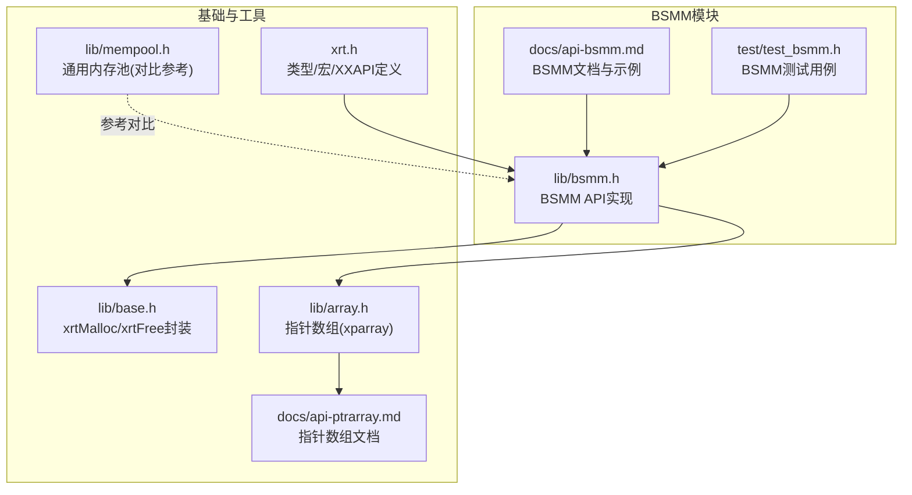
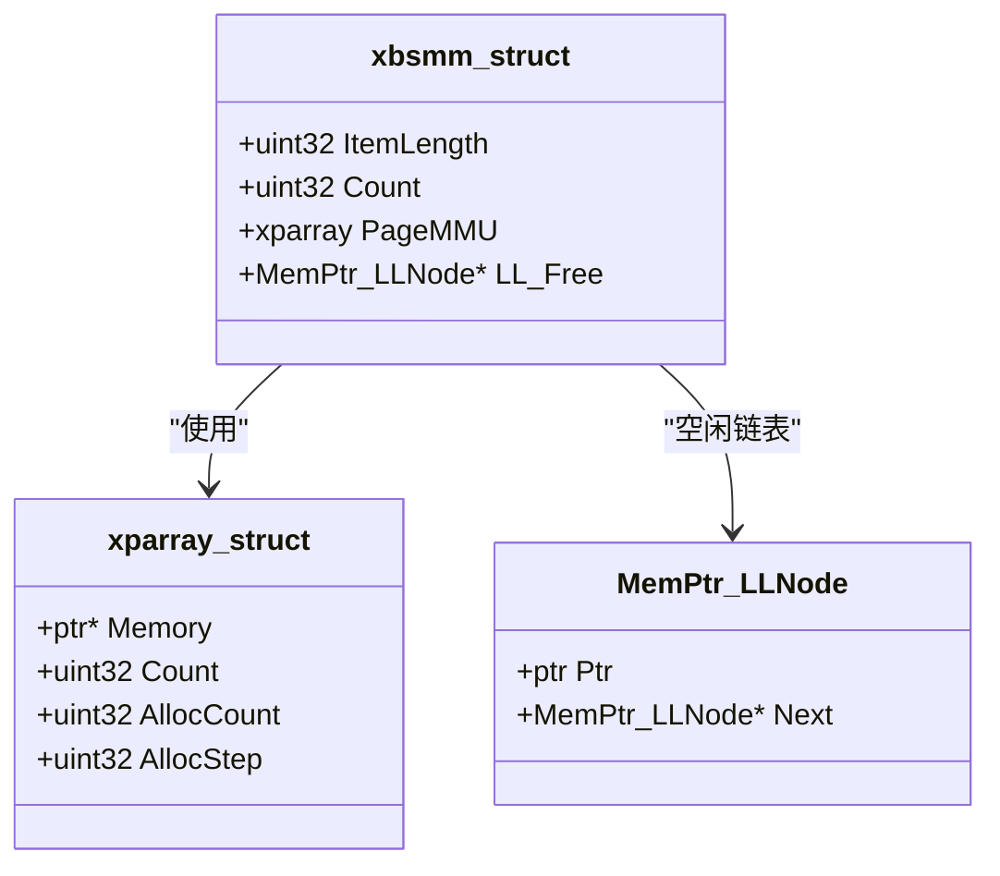
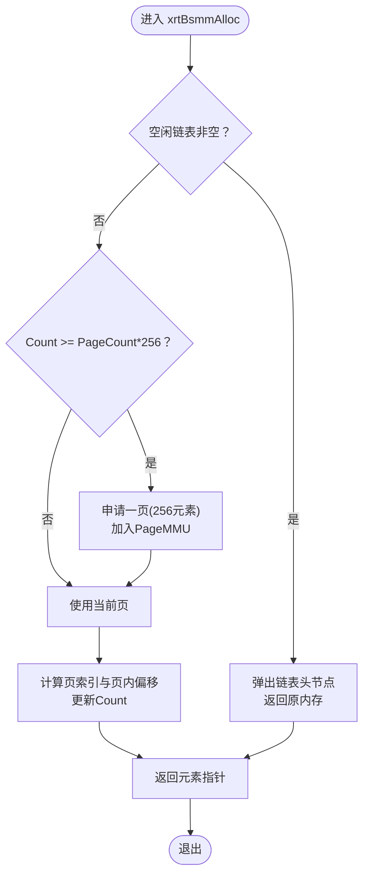
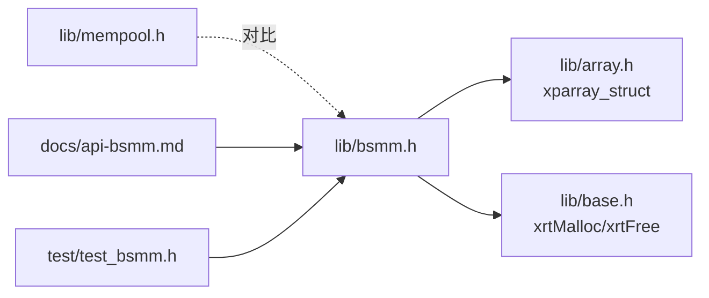

# BSMM块结构内存管理API

<cite>
**本文引用的文件**
- [lib/bsmm.h](file://lib/bsmm.h)
- [docs/api-bsmm.md](file://docs/api-bsmm.md)
- [test/test_bsmm.h](file://test/test_bsmm.h)
- [lib/base.h](file://lib/base.h)
- [lib/array.h](file://lib/array.h)
- [lib/mempool.h](file://lib/mempool.h)
- [docs/api-ptrarray.md](file://docs/api-ptrarray.md)
- [xrt.h](file://xrt.h)
</cite>

## 目录
1. [简介](#简介)
2. [项目结构](#项目结构)
3. [核心组件](#核心组件)
4. [架构总览](#架构总览)
5. [详细组件分析](#详细组件分析)
6. [依赖关系分析](#依赖关系分析)
7. [性能考量](#性能考量)
8. [故障排查指南](#故障排查指南)
9. [结论](#结论)
10. [附录](#附录)

## 简介
BSMM（Blocks Struct Memory Management）是面向“固定大小结构体”的高效内存管理器，专为频繁分配与释放的场景设计。其核心特性包括：
- 分页管理：每页容纳256个元素，按需增长
- 空闲复用：释放的内存进入链表，优先复用
- O(1)时间复杂度：分配与释放均为常数时间
- 无碎片：统一大小避免碎片

该库提供创建/销毁、初始化/清理、分配/释放等完整API，并配套典型使用场景（对象池、链表节点、树节点）示例。

## 项目结构
围绕BSMM的关键文件分布如下：
- 实现与API：lib/bsmm.h
- 文档与示例：docs/api-bsmm.md
- 单元测试：test/test_bsmm.h
- 基础内存封装：lib/base.h
- 指针数组（页管理器）：lib/array.h、docs/api-ptrarray.md
- 其他内存池对比参考：lib/mempool.h
- 类型与宏定义：xrt.h

图表来源
- [lib/bsmm.h](file://lib/bsmm.h#L1-L94)
- [docs/api-bsmm.md](file://docs/api-bsmm.md#L1-L666)
- [test/test_bsmm.h](file://test/test_bsmm.h#L1-L434)
- [lib/base.h](file://lib/base.h#L1-L132)
- [lib/array.h](file://lib/array.h#L1-L180)
- [docs/api-ptrarray.md](file://docs/api-ptrarray.md#L69-L663)
- [lib/mempool.h](file://lib/mempool.h#L1-L468)
- [xrt.h](file://xrt.h#L1065-L1106)

章节来源
- [lib/bsmm.h](file://lib/bsmm.h#L1-L94)
- [docs/api-bsmm.md](file://docs/api-bsmm.md#L1-L666)
- [test/test_bsmm.h](file://test/test_bsmm.h#L1-L434)
- [lib/base.h](file://lib/base.h#L1-L132)
- [lib/array.h](file://lib/array.h#L1-L180)
- [docs/api-ptrarray.md](file://docs/api-ptrarray.md#L69-L663)
- [lib/mempool.h](file://lib/mempool.h#L1-L468)
- [xrt.h](file://xrt.h#L1065-L1106)

## 核心组件
- xbsmm_struct：BSMM管理器主体，包含元素大小、计数、页管理器（指针数组）、空闲链表头指针
- MemPtr_LLNode：空闲指针单链表节点，用于复用已释放内存
- 关键API：
  - xrtBsmmCreate/xrtBsmmDestroy：创建/销毁管理器
  - xrtBsmmInit/xrtBsmmUnit：初始化/清理（用于内嵌结构体）
  - xrtBsmmAlloc/xrtBsmmFree：分配/释放
  - xrtBsmmGetPtr_Inline：按索引获取元素指针（内联）

章节来源
- [docs/api-bsmm.md](file://docs/api-bsmm.md#L64-L83)
- [lib/bsmm.h](file://lib/bsmm.h#L5-L91)
- [docs/api-bsmm.md](file://docs/api-bsmm.md#L343-L371)

## 架构总览
BSMM采用“页+空闲链表”的两级结构：
- 页管理：每页256个元素，使用指针数组（xparray）按需扩容
- 空闲复用：释放的内存以节点形式挂入单链表，分配时优先从链表取

图表来源
- [docs/api-bsmm.md](file://docs/api-bsmm.md#L64-L83)
- [docs/api-bsmm.md](file://docs/api-bsmm.md#L50-L60)
- [xrt.h](file://xrt.h#L1065-L1106)

## 详细组件分析

### 数据结构设计
- xbsmm_struct
  - ItemLength：每个元素字节数
  - Count：已分配元素总数（含已释放）
  - PageMMU：指针数组，存储每页基地址
  - LL_Free：空闲链表头指针
- MemPtr_LLNode
  - Ptr：指向已释放的元素内存
  - Next：下一个空闲节点
- 指针数组（xparray）
  - 作为页管理器，按256步长增长，存储页首地址

章节来源
- [docs/api-bsmm.md](file://docs/api-bsmm.md#L64-L83)
- [docs/api-bsmm.md](file://docs/api-bsmm.md#L50-L60)
- [xrt.h](file://xrt.h#L1065-L1106)
- [docs/api-ptrarray.md](file://docs/api-ptrarray.md#L69-L100)

### 管理器生命周期
- 创建与销毁
  - xrtBsmmCreate：分配管理器结构体并初始化
  - xrtBsmmDestroy：释放内部页与空闲链表，再释放管理器自身
- 初始化与清理
  - xrtBsmmInit：用于内嵌结构体的初始化
  - xrtBsmmUnit：释放内部页与空闲链表，保留结构体本身

章节来源
- [lib/bsmm.h](file://lib/bsmm.h#L5-L21)
- [lib/bsmm.h](file://lib/bsmm.h#L24-L49)

### 分配与释放流程
- 分配策略
  - 若空闲链表非空，直接从链表取节点并返回原内存
  - 否则检查当前页是否已满；若满则申请新页（256元素/页），否则从当前页取下一块
- 释放策略
  - 为空闲指针分配一个链表节点，将原指针挂入链表头部

图表来源
- [lib/bsmm.h](file://lib/bsmm.h#L52-L82)

章节来源
- [lib/bsmm.h](file://lib/bsmm.h#L52-L82)

### API接口详解
- xrtBsmmCreate
  - 参数：元素大小（字节）
  - 返回：管理器对象或NULL
  - 说明：需配合xrtBsmmDestroy释放
- xrtBsmmDestroy
  - 释放所有页与空闲链表，释放管理器自身
- xrtBsmmInit/xrtBsmmUnit
  - 用于内嵌结构体的初始化/清理
- xrtBsmmAlloc
  - 返回元素指针；失败返回NULL
- xrtBsmmFree
  - 将指针加入空闲链表，不立即释放
- xrtBsmmGetPtr_Inline
  - 按索引获取元素指针（内联版本，不推荐常规使用）

章节来源
- [docs/api-bsmm.md](file://docs/api-bsmm.md#L88-L155)
- [docs/api-bsmm.md](file://docs/api-bsmm.md#L158-L224)
- [docs/api-bsmm.md](file://docs/api-bsmm.md#L228-L341)
- [docs/api-bsmm.md](file://docs/api-bsmm.md#L343-L371)

### 典型使用场景

#### 对象池模式
- 适用于大量短生命周期对象的频繁创建/销毁
- 示例路径：[docs/api-bsmm.md](file://docs/api-bsmm.md#L376-L446)

#### 链表节点分配
- 为链表节点提供稳定、快速的内存分配
- 示例路径：[docs/api-bsmm.md](file://docs/api-bsmm.md#L450-L508)

#### 树节点分配
- 为二叉树节点提供高效分配与复用
- 示例路径：[docs/api-bsmm.md](file://docs/api-bsmm.md#L512-L567)

章节来源
- [docs/api-bsmm.md](file://docs/api-bsmm.md#L376-L567)

### 与其他内存管理器对比
- BSMM vs 数组：BSMM固定大小、无碎片、O(1)；数组支持顺序访问
- BSMM vs malloc/free：BSMM固定大小、空闲链表复用、无碎片；malloc依赖系统，可能碎片
- 适用场景：BSMM适合高频分配释放的固定大小对象；数组适合顺序访问；malloc适合通用场景

章节来源
- [docs/api-bsmm.md](file://docs/api-bsmm.md#L572-L583)

## 依赖关系分析
- BSMM依赖
  - 指针数组（xparray）作为页管理器
  - 基础内存封装（xrtMalloc/xrtFree）
- 间接依赖
  - 通用内存池（mempool）提供对比参考

图表来源
- [lib/bsmm.h](file://lib/bsmm.h#L1-L94)
- [lib/array.h](file://lib/array.h#L1-L180)
- [lib/base.h](file://lib/base.h#L1-L132)
- [lib/mempool.h](file://lib/mempool.h#L1-L468)
- [docs/api-bsmm.md](file://docs/api-bsmm.md#L1-L666)
- [test/test_bsmm.h](file://test/test_bsmm.h#L1-L434)

章节来源
- [lib/bsmm.h](file://lib/bsmm.h#L1-L94)
- [lib/array.h](file://lib/array.h#L1-L180)
- [lib/base.h](file://lib/base.h#L1-L132)
- [lib/mempool.h](file://lib/mempool.h#L1-L468)
- [docs/api-bsmm.md](file://docs/api-bsmm.md#L1-L666)
- [test/test_bsmm.h](file://test/test_bsmm.h#L1-L434)

## 性能考量
- 时间复杂度
  - 分配/释放均为O(1)，得益于空闲链表与页内顺序分配
- 空间效率
  - 无碎片，但存在少量元数据（链表节点、页管理器）
- 扩容策略
  - 按256元素/页增长，减少频繁系统调用
- 适用建议
  - 优先用于固定大小结构体的高频分配/释放场景
  - 避免与需要顺序遍历的集合混用（数组更合适）

[本节为通用性能讨论，不直接分析具体文件]

## 故障排查指南
- 分配失败
  - 检查管理器是否正确创建与销毁
  - 确认元素大小设置合理
- 悬挂指针
  - 释放后应避免继续使用原指针，必要时置空
- 内存泄漏
  - 确保最终调用xrtBsmmDestroy释放所有资源
- 索引访问
  - xrtBsmmGetPtr_Inline不推荐常规使用，仅用于特殊需求

章节来源
- [docs/api-bsmm.md](file://docs/api-bsmm.md#L599-L647)

## 结论
BSMM通过“256元素/页”的分页设计与空闲链表复用机制，实现了固定大小结构体的O(1)分配/释放与无碎片内存管理。其API简洁、使用直观，典型场景包括对象池、链表节点与树节点分配。结合测试用例与文档示例，可快速集成到高性能、低延迟的应用中。

[本节为总结性内容，不直接分析具体文件]

## 附录

### API一览与示例路径
- 创建/销毁：[docs/api-bsmm.md](file://docs/api-bsmm.md#L88-L155)
- 初始化/清理：[docs/api-bsmm.md](file://docs/api-bsmm.md#L158-L224)
- 分配/释放：[docs/api-bsmm.md](file://docs/api-bsmm.md#L228-L341)
- 按索引访问：[docs/api-bsmm.md](file://docs/api-bsmm.md#L343-L371)
- 对象池示例：[docs/api-bsmm.md](file://docs/api-bsmm.md#L376-L446)
- 链表节点示例：[docs/api-bsmm.md](file://docs/api-bsmm.md#L450-L508)
- 树节点示例：[docs/api-bsmm.md](file://docs/api-bsmm.md#L512-L567)
- 测试用例：[test/test_bsmm.h](file://test/test_bsmm.h#L12-L434)

### 关键实现路径
- 分配/释放实现：[lib/bsmm.h](file://lib/bsmm.h#L52-L91)
- 基础内存封装：[lib/base.h](file://lib/base.h#L5-L45)
- 指针数组定义与文档：[xrt.h](file://xrt.h#L1065-L1106)、[docs/api-ptrarray.md](file://docs/api-ptrarray.md#L69-L100)