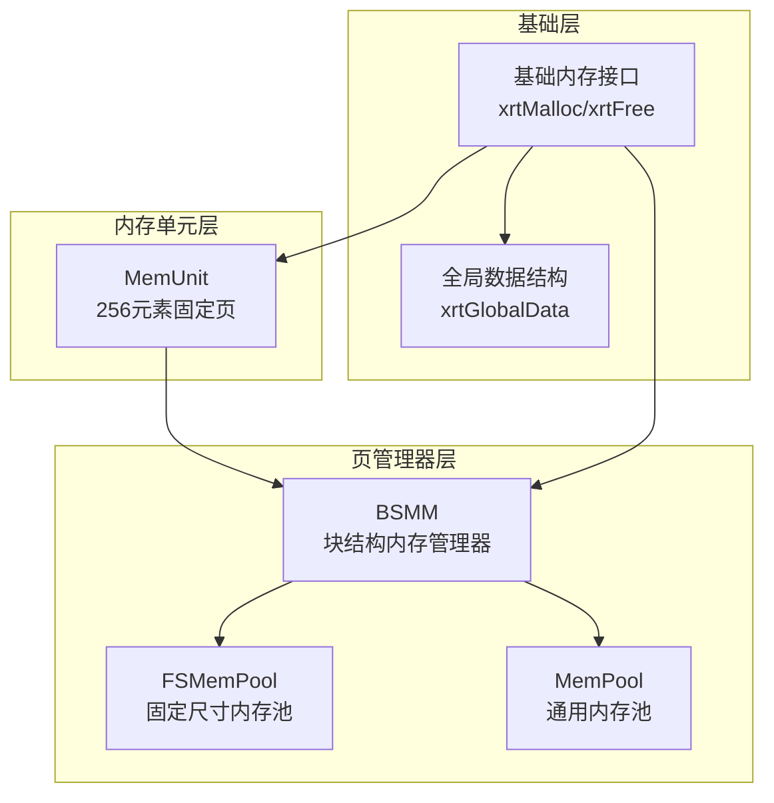
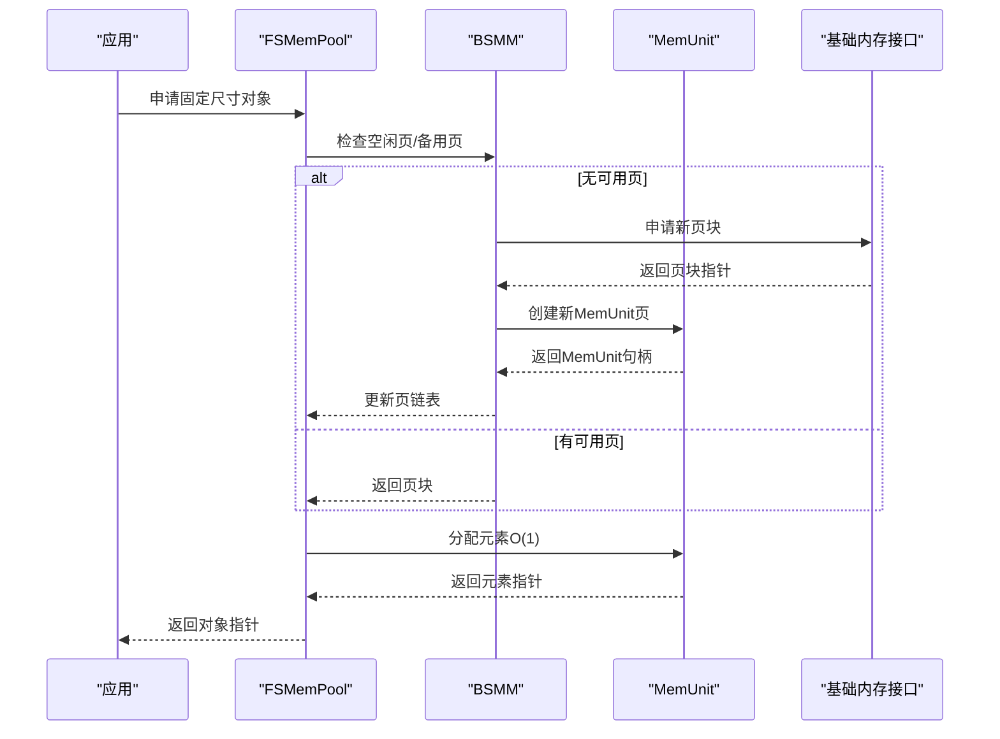
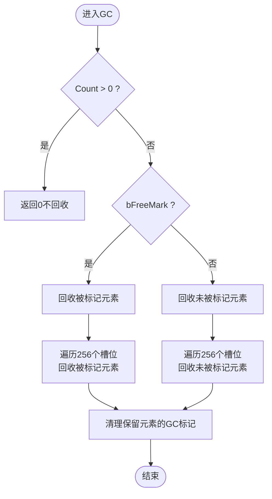
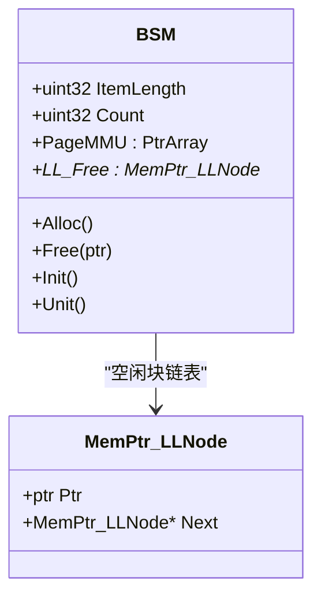
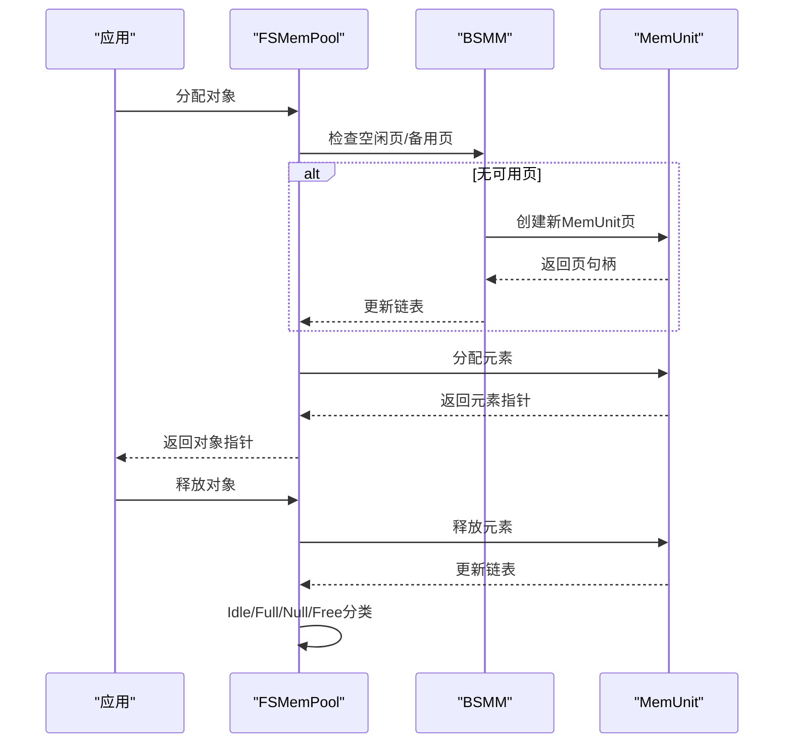
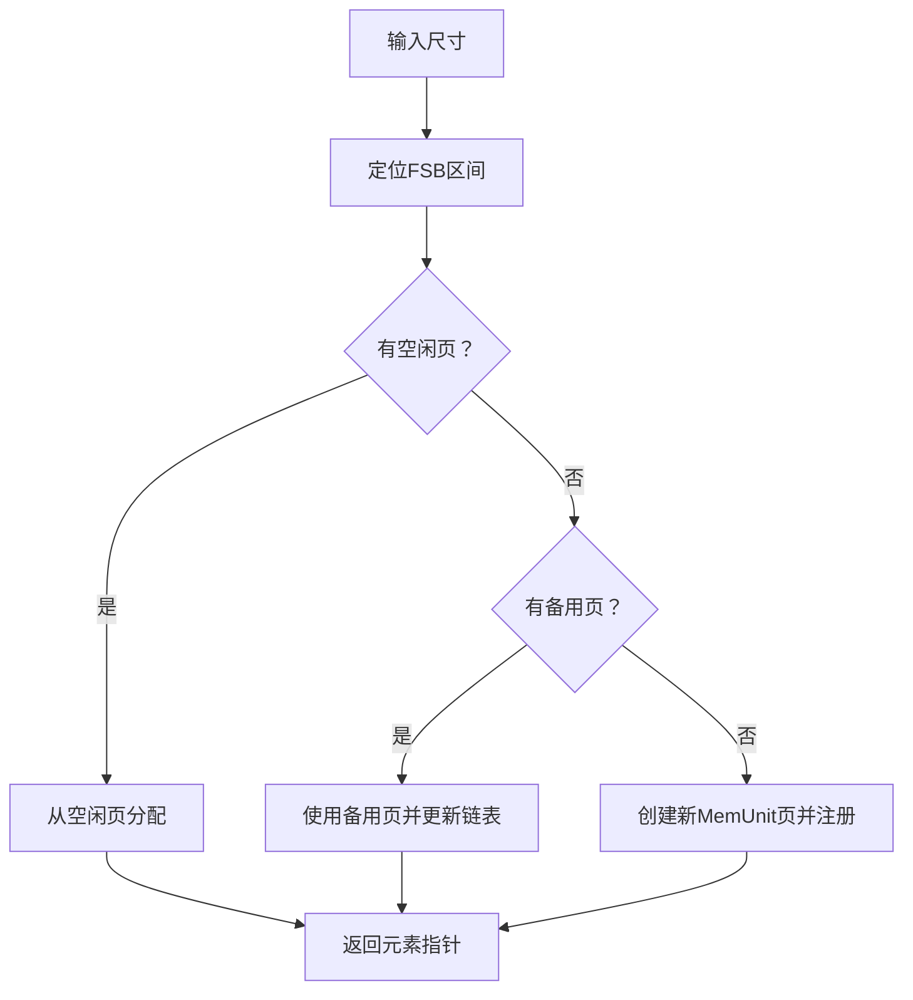
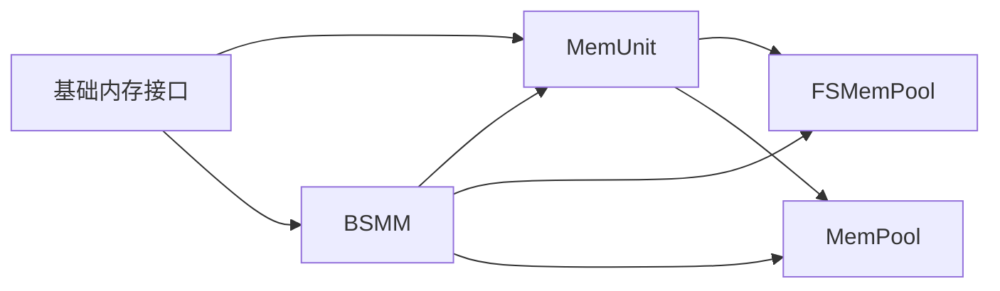

# 内存单元管理API

<cite>
**本文档引用的文件**
- [lib/memunit.h](file://lib/memunit.h)
- [docs/api-memunit.md](file://docs/api-memunit.md)
- [test/test_memunit.h](file://test/test_memunit.h)
- [lib/bsmm.h](file://lib/bsmm.h)
- [lib/mempool.h](file://lib/mempool.h)
- [lib/mempool_fs.h](file://lib/mempool_fs.h)
- [lib/base.h](file://lib/base.h)
- [xrt.h](file://xrt.h)
</cite>

## 目录
1. [简介](#简介)
2. [项目结构](#项目结构)
3. [核心组件](#核心组件)
4. [架构概览](#架构概览)
5. [详细组件分析](#详细组件分析)
6. [依赖关系分析](#依赖关系分析)
7. [性能考量](#性能考量)
8. [故障排查指南](#故障排查指南)
9. [结论](#结论)
10. [附录](#附录)

## 简介
本文件面向XRT库中的“内存单元管理”API，系统化阐述其256字节页管理机制、GC标记回收系统、批量回收优化策略，并覆盖内存单元的生命周期管理、引用计数机制、垃圾回收触发条件、分配策略、碎片处理、内存压力响应机制，以及与BSMM、FSMemPool等其他内存管理器的协同使用模式与集成方案。同时提供内存监控、性能调优与内存泄漏检测的实用方法。

## 项目结构
围绕内存单元管理API的关键文件与职责如下：
- lib/memunit.h：实现256元素固定页内存单元的创建、分配、释放与GC回收。
- docs/api-memunit.md：官方文档，包含常量定义、数据结构、API说明、使用场景与最佳实践。
- test/test_memunit.h：单元测试，验证创建、分配、释放、复用与边界行为。
- lib/bsmm.h：块结构内存管理器，作为更高层的容器，管理多个256元素页。
- lib/mempool.h：通用内存池，基于BSMM与MemUnit构建，支持可变尺寸对象的高效分配与回收。
- lib/mempool_fs.h：固定尺寸内存池，基于BSMM与MemUnit，管理固定大小对象。
- lib/base.h：基础内存接口封装（xrtMalloc/xrtFree等），为上层提供统一入口。
- xrt.h：类型定义、全局数据结构与平台宏，为内存管理API提供基础支撑。

图表来源
- [lib/memunit.h](file://lib/memunit.h#L1-L143)
- [lib/bsmm.h](file://lib/bsmm.h#L1-L94)
- [lib/mempool_fs.h](file://lib/mempool_fs.h#L1-L257)
- [lib/mempool.h](file://lib/mempool.h#L1-L468)
- [lib/base.h](file://lib/base.h#L1-L132)
- [xrt.h](file://xrt.h#L120-L193)

章节来源
- [lib/memunit.h](file://lib/memunit.h#L1-L143)
- [docs/api-memunit.md](file://docs/api-memunit.md#L1-L662)
- [lib/bsmm.h](file://lib/bsmm.h#L1-L94)
- [lib/mempool_fs.h](file://lib/mempool_fs.h#L1-L257)
- [lib/mempool.h](file://lib/mempool.h#L1-L468)
- [lib/base.h](file://lib/base.h#L1-L132)
- [xrt.h](file://xrt.h#L120-L193)

## 核心组件
- 内存单元（MemUnit）
  - 每页固定256个元素，每个元素前置4字节标志位，记录使用状态、GC标记与索引。
  - 提供创建、分配、释放、GC回收等能力；分配与释放均为O(1)。
- 块结构内存管理器（BSMM）
  - 以块为单位管理多个256元素页，支持空闲块链表与按需扩展。
- 固定尺寸内存池（FSMemPool）
  - 基于BSMM与MemUnit，管理固定大小对象，具备空闲/满载/备用/释放链表管理。
- 通用内存池（MemPool）
  - 基于FSB（固定尺寸区）与BSMM/MemUnit，支持可变尺寸对象的高效分配与回收。
- 基础内存接口（xrtMalloc/xrtFree）
  - 统一底层内存分配与释放入口，便于替换与监控。

章节来源
- [lib/memunit.h](file://lib/memunit.h#L1-L143)
- [docs/api-memunit.md](file://docs/api-memunit.md#L22-L52)
- [lib/bsmm.h](file://lib/bsmm.h#L1-L94)
- [lib/mempool_fs.h](file://lib/mempool_fs.h#L1-L257)
- [lib/mempool.h](file://lib/mempool.h#L1-L468)
- [lib/base.h](file://lib/base.h#L1-L132)

## 架构概览
MemUnit作为底层页管理单元，向上提供给BSMM、FSMemPool与MemPool使用。BSMM负责页的生命周期与空闲块管理；FSMemPool与MemPool在其基础上实现固定/可变尺寸对象的高效分配与回收，并内置GC回收流程。

图表来源
- [lib/mempool_fs.h](file://lib/mempool_fs.h#L52-L125)
- [lib/bsmm.h](file://lib/bsmm.h#L52-L82)
- [lib/memunit.h](file://lib/memunit.h#L22-L41)
- [lib/base.h](file://lib/base.h#L5-L45)

## 详细组件分析

### 内存单元（MemUnit）设计与实现
- 标志位布局
  - 使用32位ItemFlag，其中最高位表示使用状态，次高位表示GC标记，其余位表示元素索引。
  - 通过宏与位运算实现快速标记与清理。
- 环形空闲队列
  - FreeList[256]配合FreeCount与FreeOffset，实现O(1)复用，优先复用已释放槽位。
- 分配与释放
  - 分配：优先从FreeList复用；若无则新分配（索引=Count），上限256。
  - 释放：将索引写入FreeList尾部，更新Count与FreeCount；清零标志位。
- GC回收
  - 支持两种模式：回收被标记的元素或回收未被标记的元素。
  - 回收后自动清理保留元素的GC标记，保证下一轮GC正确性。
- 生命周期
  - 创建：传入用户数据长度，内部自动加4字节头。
  - 销毁：直接释放整个页内存，不调用析构函数。

图表来源
- [lib/memunit.h](file://lib/memunit.h#L88-L140)

章节来源
- [lib/memunit.h](file://lib/memunit.h#L1-L143)
- [docs/api-memunit.md](file://docs/api-memunit.md#L56-L130)
- [docs/api-memunit.md](file://docs/api-memunit.md#L357-L437)

### 块结构内存管理器（BSMM）
- 角色定位：管理多个256元素页块，维护空闲块链表与页数组。
- 分配策略：优先使用空闲块；若不足，则按需申请新页块并加入页数组。
- 释放策略：将释放的指针包装为节点，挂入空闲链表，实现延迟释放与复用。

图表来源
- [lib/bsmm.h](file://lib/bsmm.h#L1-L94)

章节来源
- [lib/bsmm.h](file://lib/bsmm.h#L1-L94)

### 固定尺寸内存池（FSMemPool）
- 基于BSMM与MemUnit，管理固定大小对象。
- 链表管理：空闲（Idle）、满载（Full）、备用（Null）、释放（Free）四类链表，实现高效复用与回收。
- 分配与释放：优先使用空闲页；满载页转入满载链表；清空页可转为备用或释放。
- GC回收：遍历空闲与满载链表，逐页执行MemUnit GC，并重新分类。

图表来源
- [lib/mempool_fs.h](file://lib/mempool_fs.h#L52-L221)
- [lib/mempool_fs.h](file://lib/mempool_fs.h#L224-L254)

章节来源
- [lib/mempool_fs.h](file://lib/mempool_fs.h#L1-L257)

### 通用内存池（MemPool）
- 基于FSB（固定尺寸区）与BSMM/MemUnit，支持可变尺寸对象。
- FSB采用二叉搜索树组织不同尺寸区间，按需选择合适尺寸的MemUnit页。
- 分配与释放：根据尺寸定位FSB区间，选择空闲页或创建新页；释放时恢复至相应链表。
- GC回收：递归遍历FSB树，对空闲与满载页执行MemUnit GC，并重新分类。

图表来源
- [lib/mempool.h](file://lib/mempool.h#L148-L261)
- [lib/mempool.h](file://lib/mempool.h#L387-L465)

章节来源
- [lib/mempool.h](file://lib/mempool.h#L1-L468)

### 引用计数与GC触发条件
- 引用计数机制
  - MemUnit本身不内置引用计数，而是通过GC标记位实现可达性跟踪。
  - 应用侧在GC周期开始前，对可达对象调用标记宏，随后调用GC回收未标记对象。
- 触发条件
  - 明确的GC周期：在业务逻辑中显式调用MemUnit GC或上层池GC。
  - 批量回收：上层池（FSMemPool/MemPool）在GC后重新分类链表，实现批量回收与页复用。

章节来源
- [docs/api-memunit.md](file://docs/api-memunit.md#L357-L437)
- [lib/mempool_fs.h](file://lib/mempool_fs.h#L224-L254)
- [lib/mempool.h](file://lib/mempool.h#L427-L465)

### 分配策略与碎片处理
- 分配策略
  - 优先复用：FreeList环形队列实现O(1)复用，减少碎片。
  - 边界保护：Count上限256，防止越界；FreeCount与FreeOffset确保环形队列正确性。
- 碎片处理
  - MemUnit内部无碎片；通过页粒度管理，避免细粒度碎片。
  - 上层池通过链表管理与备用页机制，降低跨页碎片影响。

章节来源
- [lib/memunit.h](file://lib/memunit.h#L22-L86)
- [lib/mempool_fs.h](file://lib/mempool_fs.h#L128-L177)
- [lib/mempool.h](file://lib/mempool.h#L264-L313)

### 内存压力响应机制
- 压力响应
  - 当空闲页不足时，按需创建新MemUnit页；当页清空时，可转为备用页或释放，避免频繁创建/销毁。
  - 大内存路径：MemPool/MemPool_FS对超尺寸对象走独立的大内存链表，减少对小对象池的影响。
- 批量回收优化
  - 上层池在GC后统一重新分类链表，减少后续分配的链表扫描成本。

章节来源
- [lib/mempool_fs.h](file://lib/mempool_fs.h#L82-L125)
- [lib/mempool.h](file://lib/mempool.h#L165-L233)
- [lib/mempool.h](file://lib/mempool.h#L264-L313)

### 与BSMM、FSMemPool等的协同使用
- 协同模式
  - BSMM负责页块管理与空闲块复用；MemUnit提供页内元素分配与GC；池层负责尺寸选择与链表管理。
- 集成要点
  - 通过Flag字段传递池层上下文，确保释放时能正确回溯到对应链表节点。
  - GC在池层统一调度，逐页执行MemUnit GC并重新分类。

章节来源
- [lib/bsmm.h](file://lib/bsmm.h#L1-L94)
- [lib/mempool_fs.h](file://lib/mempool_fs.h#L1-L257)
- [lib/mempool.h](file://lib/mempool.h#L1-L468)

## 依赖关系分析
- MemUnit依赖基础内存接口（xrtMalloc/xrtFree）进行页内存分配与销毁。
- BSM依赖BSMM的指针数组与链表结构管理页块。
- FSMemPool与MemPool依赖BSM与MemUnit，实现固定/可变尺寸对象的高效管理。
- GC回收在池层统一调度，逐页调用MemUnit GC。

图表来源
- [lib/base.h](file://lib/base.h#L5-L45)
- [lib/bsmm.h](file://lib/bsmm.h#L1-L94)
- [lib/mempool_fs.h](file://lib/mempool_fs.h#L1-L257)
- [lib/mempool.h](file://lib/mempool.h#L1-L468)

章节来源
- [lib/base.h](file://lib/base.h#L1-L132)
- [lib/memunit.h](file://lib/memunit.h#L1-L143)
- [lib/bsmm.h](file://lib/bsmm.h#L1-L94)
- [lib/mempool_fs.h](file://lib/mempool_fs.h#L1-L257)
- [lib/mempool.h](file://lib/mempool.h#L1-L468)

## 性能考量
- 时间复杂度
  - MemUnit分配/释放：O(1)，环形队列与直接索引访问。
  - GC：O(N)遍历256个槽位，但仅在Count==0时进行，避免频繁扫描。
- 空间复杂度
  - 每页固定开销：页头+256×(元素长度+4字节标志)。
  - 环形队列FreeList[256]与Count/FreeCount/FreeOffset等元数据开销较小。
- 批量回收优化
  - 池层在GC后统一重新分类链表，减少后续分配的链表扫描成本。
- 内存压力响应
  - 通过备用页与释放页机制，避免频繁创建/销毁页带来的抖动。

章节来源
- [docs/api-memunit.md](file://docs/api-memunit.md#L26-L33)
- [lib/mempool_fs.h](file://lib/mempool_fs.h#L128-L177)
- [lib/mempool.h](file://lib/mempool.h#L264-L313)

## 故障排查指南
- 常见问题
  - 分配失败：检查Count是否已达256上限；确认FreeCount与FreeOffset是否正确。
  - 释放失败：确认指针是否来自同一MemUnit页；检查ItemFlag的使用位是否置位。
  - GC无效：确认在Count==0时调用GC；检查bFreeMark参数与标记宏使用。
- 单元测试参考
  - 通过测试用例验证创建、分配、释放、复用与边界行为，定位问题范围。
- 错误上报
  - 基础接口提供错误设置与清理能力，便于调试与日志记录。

章节来源
- [test/test_memunit.h](file://test/test_memunit.h#L12-L253)
- [lib/memunit.h](file://lib/memunit.h#L22-L86)
- [lib/base.h](file://lib/base.h#L88-L132)

## 结论
MemUnit提供了高效的256元素固定页内存管理，结合BSMM、FSMemPool与MemPool，形成从页到池再到应用的完整内存管理栈。其O(1)分配/释放、环形空闲队列复用与GC标记回收机制，使得在高并发与高频分配场景下仍能保持稳定性能。通过池层的批量回收与压力响应机制，进一步优化了内存利用率与系统稳定性。

## 附录
- 内存监控与性能调优
  - 利用池层统计信息（空闲/满载/备用/释放页数量）评估内存使用效率。
  - 在GC前后记录Count变化，观察回收效果与压力响应表现。
- 内存泄漏检测
  - 在应用侧对可达对象进行GC标记，确保未被标记的对象被回收。
  - 对大内存路径（MemPool/MemPool_FS）单独监控，避免泄漏扩散。

章节来源
- [lib/mempool_fs.h](file://lib/mempool_fs.h#L224-L254)
- [lib/mempool.h](file://lib/mempool.h#L427-L465)
- [lib/base.h](file://lib/base.h#L88-L132)