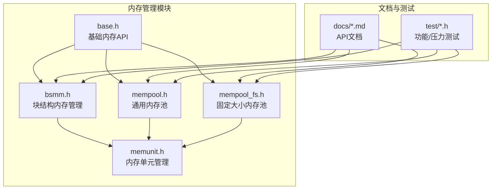
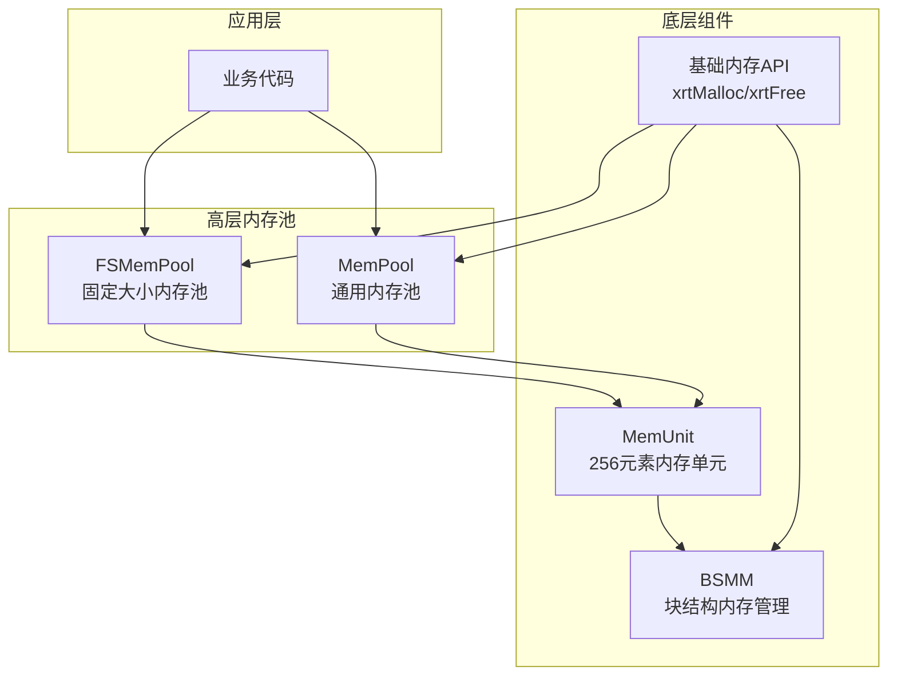
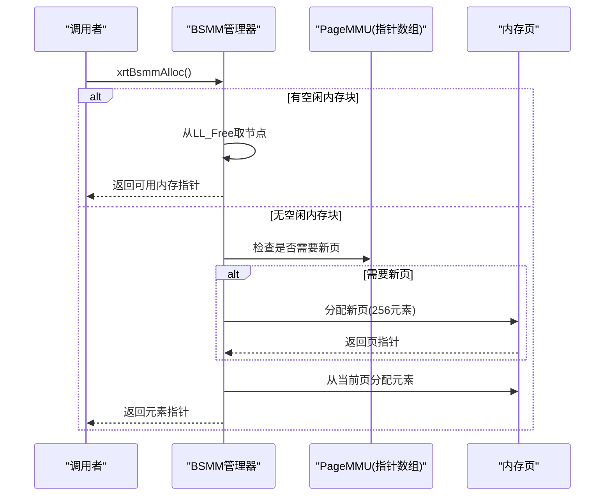
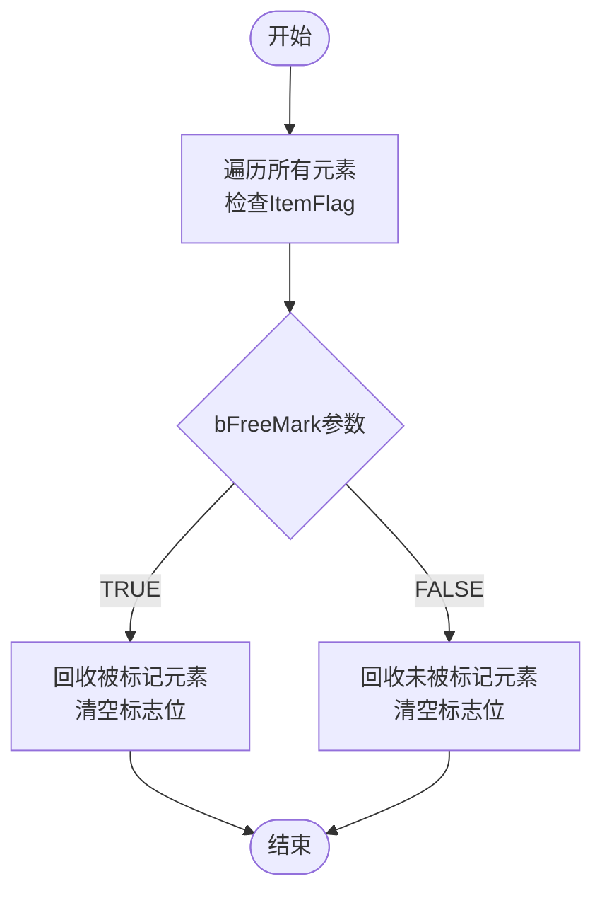
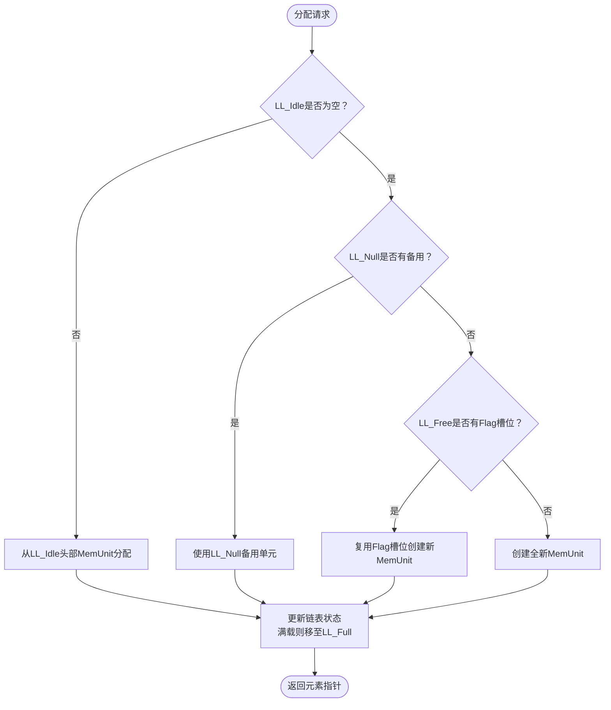
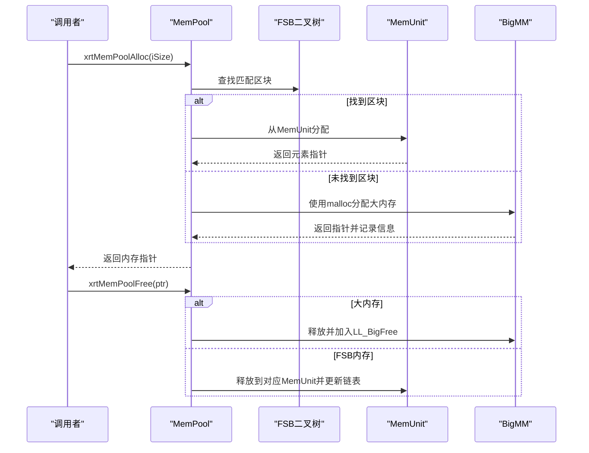
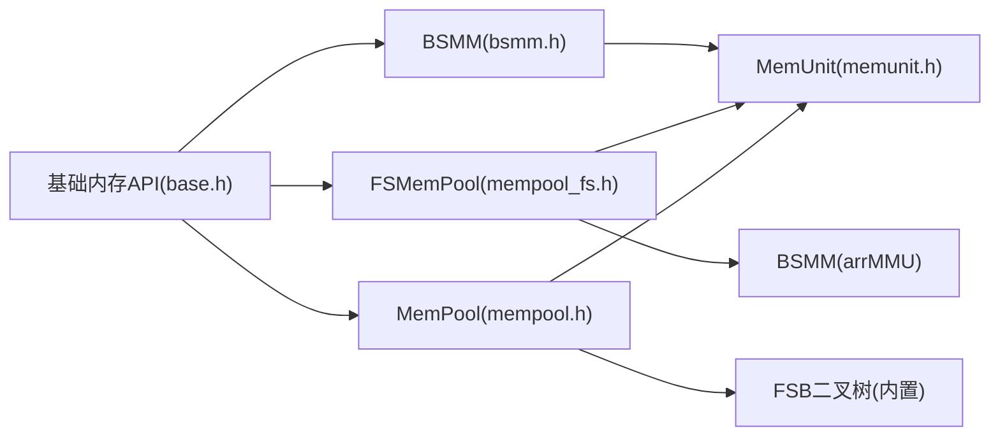

# 内存管理模块API

<cite>
**本文档引用的文件**
- [lib/bsmm.h](file://lib/bsmm.h)
- [lib/memunit.h](file://lib/memunit.h)
- [lib/mempool.h](file://lib/mempool.h)
- [lib/mempool_fs.h](file://lib/mempool_fs.h)
- [lib/base.h](file://lib/base.h)
- [docs/api-bsmm.md](file://docs/api-bsmm.md)
- [docs/api-memunit.md](file://docs/api-memunit.md)
- [docs/api-mempool.md](file://docs/api-mempool.md)
- [docs/api-mempool-fs.md](file://docs/api-mempool-fs.md)
- [test/test_bsmm.h](file://test/test_bsmm.h)
- [test/test_memunit.h](file://test/test_memunit.h)
- [test/test_mempool.h](file://test/test_mempool.h)
- [test/test_mempool_fs.h](file://test/test_mempool_fs.h)
</cite>

## 目录
1. [简介](#简介)
2. [项目结构](#项目结构)
3. [核心组件](#核心组件)
4. [架构概览](#架构概览)
5. [详细组件分析](#详细组件分析)
6. [依赖关系分析](#依赖关系分析)
7. [性能考虑](#性能考虑)
8. [故障排查指南](#故障排查指南)
9. [结论](#结论)
10. [附录](#附录)

## 简介
本文件系统化梳理XRT内存管理模块API，覆盖块结构内存管理（BSMM）、内存单元管理（MemUnit）、固定大小内存池（FSMemPool）与通用内存池（MemPool）四大核心组件。文档重点阐述：
- 各内存池的配置参数、性能特征与适用场景
- 内存碎片处理策略、批量回收优化与GC标记回收机制
- 与基础内存管理API的集成使用方法
- 内存使用监控、性能调优与故障排查指导

## 项目结构
内存管理模块位于lib目录，配套文档位于docs目录，测试用例位于test目录。核心文件组织如下：
- lib/bsmm.h：块结构内存管理（BSMM）
- lib/memunit.h：内存单元管理（MemUnit）
- lib/mempool.h：通用内存池（MemPool）
- lib/mempool_fs.h：固定大小内存池（FSMemPool）
- lib/base.h：基础内存API封装（xrtMalloc/xrtFree等）
- docs/*.md：各模块API文档
- test/*.h：各模块功能与压力测试

**图表来源**
- [lib/bsmm.h](file://lib/bsmm.h#L1-L94)
- [lib/memunit.h](file://lib/memunit.h#L1-L143)
- [lib/mempool.h](file://lib/mempool.h#L1-L468)
- [lib/mempool_fs.h](file://lib/mempool_fs.h#L1-L257)
- [lib/base.h](file://lib/base.h#L1-L132)

**章节来源**
- [lib/bsmm.h](file://lib/bsmm.h#L1-L94)
- [lib/memunit.h](file://lib/memunit.h#L1-L143)
- [lib/mempool.h](file://lib/mempool.h#L1-L468)
- [lib/mempool_fs.h](file://lib/mempool_fs.h#L1-L257)
- [lib/base.h](file://lib/base.h#L1-L132)

## 核心组件
本节概述四大内存管理组件的功能职责、关键数据结构与典型使用方式。

- 块结构内存管理（BSMM）
  - 为**固定大小结构体**提供高效内存池，支持按需分页（每页256个元素）、空闲链表复用、O(1)分配与释放、无碎片特性。
  - 关键API：xrtBsmmCreate、xrtBsmmDestroy、xrtBsmmAlloc、xrtBsmmFree、xrtBsmmInit、xrtBsmmUnit。
  - 适用场景：对象池、链表/树节点分配、高频创建销毁的固定大小对象。

- 内存单元管理（MemUnit）
  - 256元素固定页内存单元，作为FSMemPool与MemPool的底层组件；支持GC标记回收、环形空闲队列复用、O(1)分配/释放。
  - 关键API：xrtMemUnitCreate、xrtMemUnitAlloc、xrtMemUnitFree、xrtMemUnitGC、xrtMemUnitDestroy。
  - 适用场景：底层组件封装、需要精确控制256元素页的场景。

- 固定大小内存池（FSMemPool）
  - 基于MemUnit的高性能固定大小对象池，无容量上限；四链表管理（Idle/Full/Null/Free）避免临界状态抖动；支持GC。
  - 关键API：xrtFSMemPoolCreate、xrtFSMemPoolAlloc、xrtFSMemPoolFree、xrtFSMemPoolGC、xrtFSMemPoolInit/Unit。
  - 适用场景：消息/事件对象、链表节点、带GC的对象堆。

- 通用内存池（MemPool）
  - 支持可变大小内存分配；采用FSB二叉树快速定位合适MemUnit；超出范围的大内存走malloc路径；支持GC。
  - 关键API：xrtMemPoolCreate（支持iCustom=1/2预设）、xrtMemPoolAlloc、xrtMemPoolFree、xrtMemPoolGC。
  - 适用场景：多类型对象分配、JSON解析器、带GC的脚本引擎等。

**章节来源**
- [docs/api-bsmm.md](file://docs/api-bsmm.md#L1-L666)
- [docs/api-memunit.md](file://docs/api-memunit.md#L1-L662)
- [docs/api-mempool-fs.md](file://docs/api-mempool-fs.md#L1-L735)
- [docs/api-mempool.md](file://docs/api-mempool.md#L1-L996)

## 架构概览
下图展示内存池层次结构与依赖关系：

**图表来源**
- [lib/mempool_fs.h](file://lib/mempool_fs.h#L1-L257)
- [lib/mempool.h](file://lib/mempool.h#L1-L468)
- [lib/memunit.h](file://lib/memunit.h#L1-L143)
- [lib/bsmm.h](file://lib/bsmm.h#L1-L94)
- [lib/base.h](file://lib/base.h#L1-L132)

## 详细组件分析

### 块结构内存管理（BSMM）
- 设计要点
  - 分页管理：每页存储256个固定大小元素，按需分配新页。
  - 空闲复用：释放的内存通过单向链表管理，优先复用。
  - O(1)复杂度：分配与释放均为常数时间。
  - 无碎片：元素大小一致，天然避免碎片。
- 关键数据结构
  - MemPtr_LLNode：空闲指针链表节点。
  - xbsmm_struct：管理器结构，包含ItemLength、Count、PageMMU（指针数组）、LL_Free。
- API流程（分配）

**图表来源**
- [lib/bsmm.h](file://lib/bsmm.h#L51-L91)

- 适用场景与最佳实践
  - 适合频繁创建/销毁的固定大小对象（如游戏中的子弹、粒子、节点）。
  - 建议复用管理器实例，避免重复创建销毁带来的开销。
  - 释放后需置空指针，防止悬挂指针。

**章节来源**
- [lib/bsmm.h](file://lib/bsmm.h#L1-L94)
- [docs/api-bsmm.md](file://docs/api-bsmm.md#L21-L666)
- [test/test_bsmm.h](file://test/test_bsmm.h#L1-L434)

### 内存单元管理（MemUnit）
- 设计要点
  - 固定容量：每个单元最多256个元素。
  - 环形空闲队列：释放元素索引存储于环形队列，优先复用。
  - GC支持：通过标志位实现标记-清除回收。
  - 元数据头：每个元素前置4字节ItemFlag，记录使用状态、GC标记与索引。
- 关键数据结构
  - MMU_Value：元素头部标志结构。
  - xmemunit_struct：包含FreeList、ItemLength、Count、FreeCount、FreeOffset、Flag与Memory。
- GC回收流程

**图表来源**
- [lib/memunit.h](file://lib/memunit.h#L88-L142)

- 性能特征
  - 分配/释放：O(1)，无系统调用开销。
  - GC：遍历单元内256个槽位，时间复杂度O(k)。
  - 适用：对256元素页容量有明确需求的底层组件。

**章节来源**
- [lib/memunit.h](file://lib/memunit.h#L1-L143)
- [docs/api-memunit.md](file://docs/api-memunit.md#L21-L662)
- [test/test_memunit.h](file://test/test_memunit.h#L1-L253)

### 固定大小内存池（FSMemPool）
- 设计要点
  - 无容量上限：自动扩展，突破MemUnit的256限制。
  - 四链表管理：Idle（有空闲）、Full（已满）、Null（全空备用）、Free（已释放Flag槽位）。
  - 智能复用：空单元缓存避免临界状态频繁分配。
  - GC支持：遍历Idle/Full链表，逐个单元执行GC。
- 关键数据结构
  - MMU_LLNode：MemUnit链表节点，包含Flag、objMMU、Prev/Next。
  - xfsmempool_struct：包含ItemLength、arrMMU（BSMM）、LL_Idle/Full/Null/Free。
- 分配策略

**图表来源**
- [lib/mempool_fs.h](file://lib/mempool_fs.h#L51-L125)

- 适用场景
  - 高频对象分配（消息/事件）、链表节点池、带GC的对象管理。

**章节来源**
- [lib/mempool_fs.h](file://lib/mempool_fs.h#L1-L257)
- [docs/api-mempool-fs.md](file://docs/api-mempool-fs.md#L21-L735)
- [test/test_mempool_fs.h](file://test/test_mempool_fs.h#L1-L832)

### 通用内存池（MemPool）
- 设计要点
  - 可变大小：支持任意大小内存分配。
  - FSB二叉树：快速定位合适MemUnit区块，O(log n)查找。
  - 大内存兜底：超出FSB范围使用malloc，记录BigMM信息。
  - GC支持：对FSB与大内存分别执行GC。
- 关键数据结构
  - FSB_Item：固定大小区块，包含MinLength/MaxLength与四个链表。
  - MP_MemHead/MP_BigInfoLL：大内存头与信息链表。
  - xmempool_struct：包含FSB_Memory、FSB_RootNode、arrMMU（BSMM）、BigMM（BSMM）、LL_BigFree。
- 分配与释放流程

**图表来源**
- [lib/mempool.h](file://lib/mempool.h#L147-L385)

- 预设配置
  - iCustom=1：小内存方案（1-512字节，15个区块）
  - iCustom=2：大内存方案（1-4096字节，31个区块）

**章节来源**
- [lib/mempool.h](file://lib/mempool.h#L1-L468)
- [docs/api-mempool.md](file://docs/api-mempool.md#L21-L996)
- [test/test_mempool.h](file://test/test_mempool.h#L1-L187)

## 依赖关系分析
- 组件耦合
  - FSMemPool与MemPool均依赖MemUnit作为底层单元管理器。
  - MemPool与FSMemPool均使用BSMM管理MemUnit数组与大内存信息。
  - 基础内存API（xrtMalloc/xrtFree）贯穿所有组件，提供系统调用封装与错误处理。
- 外部依赖
  - 通用内存池在超出FSB范围时依赖系统malloc/free。
- 潜在循环依赖
  - 通过头文件分离与API边界清晰，未发现循环依赖风险。

**图表来源**
- [lib/base.h](file://lib/base.h#L1-L132)
- [lib/bsmm.h](file://lib/bsmm.h#L1-L94)
- [lib/mempool_fs.h](file://lib/mempool_fs.h#L1-L257)
- [lib/mempool.h](file://lib/mempool.h#L1-L468)
- [lib/memunit.h](file://lib/memunit.h#L1-L143)

**章节来源**
- [lib/base.h](file://lib/base.h#L1-L132)
- [lib/bsmm.h](file://lib/bsmm.h#L1-L94)
- [lib/mempool_fs.h](file://lib/mempool_fs.h#L1-L257)
- [lib/mempool.h](file://lib/mempool.h#L1-L468)
- [lib/memunit.h](file://lib/memunit.h#L1-L143)

## 性能考虑
- 分配复杂度
  - BSMM/FSMemPool/MemUnit：O(1)分配/释放（忽略系统调用）。
  - MemPool：O(log n)查找+O(1)分配。
- 内存碎片
  - BSMM/FSMemPool/MemUnit：固定大小，无碎片。
  - MemPool：FSB范围内无碎片；大内存使用malloc，可能产生外部碎片。
- 批量回收优化
  - FSMemPool/MemPool：GC遍历Idle/Full链表，逐单元执行回收，减少碎片与提升复用效率。
  - 建议：在业务低峰期执行GC，或批量标记后再统一回收。
- 临时内存
  - 基础API提供xrtTempMemory与xrtFreeTempMemory，适合短期临时使用，避免长期持有导致内存浪费。

**章节来源**
- [docs/api-bsmm.md](file://docs/api-bsmm.md#L572-L583)
- [docs/api-mempool-fs.md](file://docs/api-mempool-fs.md#L706-L717)
- [docs/api-mempool.md](file://docs/api-mempool.md#L612-L717)
- [lib/base.h](file://lib/base.h#L49-L84)

## 故障排查指南
- 常见问题与处理
  - 分配失败：检查内存池配置与容量限制（FSMemPool无上限，MemPool需确认iCustom范围）。
  - 跨池释放：FSMemPool/MemPool要求释放到创建时的同一池，否则触发错误或未定义行为。
  - 悬挂指针：释放后及时置空指针，避免后续误用。
  - GC误判：确保在bFreeMark=false模式下正确标记存活对象，避免误回收。
- 错误处理
  - 基础API提供xrtSetError与xrtClearError，便于定位分配/释放失败原因。
  - MemPool/FSMemPool在关键路径设置错误信息，建议结合日志定位问题。
- 监控与诊断
  - 通过测试用例观察状态变化（如arrMMU.Count、BigMM.Count、链表节点数量）。
  - 利用测试输出验证分配/释放/GC流程是否符合预期。

**章节来源**
- [lib/base.h](file://lib/base.h#L88-L132)
- [test/test_mempool_fs.h](file://test/test_mempool_fs.h#L784-L832)
- [test/test_mempool.h](file://test/test_mempool.h#L170-L187)
- [test/test_bsmm.h](file://test/test_bsmm.h#L402-L434)
- [test/test_memunit.h](file://test/test_memunit.h#L245-L253)

## 结论
XRT内存管理模块通过BSMM、MemUnit、FSMemPool与MemPool形成从底层单元到高层池化的完整体系：
- BSMM与MemUnit提供稳定高效的固定大小内存管理能力；
- FSMemPool突破256限制，适配高频对象池场景；
- MemPool支持可变大小分配与GC，满足复杂业务需求；
- 基础内存API统一错误处理与系统调用封装，保障稳定性与可维护性。

建议在实际工程中：
- 明确对象大小与生命周期，选择合适内存池；
- 合理规划GC周期，平衡吞吐与内存占用；
- 借助测试用例与监控手段持续优化性能。

## 附录

### API参考速查
- BSMM
  - 创建/销毁：xrtBsmmCreate、xrtBsmmDestroy、xrtBsmmInit、xrtBsmmUnit
  - 分配/释放：xrtBsmmAlloc、xrtBsmmFree
- MemUnit
  - 创建/销毁：xrtMemUnitCreate、xrtMemUnitDestroy
  - 分配/释放：xrtMemUnitAlloc、xrtMemUnitFree、xrtMemUnitFreeIdx
  - GC：xrtMemUnitGC、xrtMemUnitGC_Mark
- FSMemPool
  - 创建/销毁：xrtFSMemPoolCreate、xrtFSMemPoolDestroy、xrtFSMemPoolInit、xrtFSMemPoolUnit
  - 分配/释放：xrtFSMemPoolAlloc、xrtFSMemPoolFree
  - GC：xrtFSMemPoolGC、xrtFSMemPoolGC_Mark
- MemPool
  - 创建/销毁：xrtMemPoolCreate、xrtMemPoolDestroy、xrtMemPoolInit、xrtMemPoolUnit
  - 分配/释放：xrtMemPoolAlloc、xrtMemPoolFree
  - GC：xrtMemPoolGC、xrtMemPoolGC_Mark
- 基础内存API
  - 分配/释放：xrtMalloc、xrtCalloc、xrtRealloc、xrtFree
  - 临时内存：xrtTempMemory、xrtFreeTempMemory
  - 错误处理：xrtSetError、xrtClearError

**章节来源**
- [lib/bsmm.h](file://lib/bsmm.h#L5-L91)
- [lib/memunit.h](file://lib/memunit.h#L5-L190)
- [lib/mempool_fs.h](file://lib/mempool_fs.h#L128-L221)
- [lib/mempool.h](file://lib/mempool.h#L5-L120)
- [lib/base.h](file://lib/base.h#L4-L132)