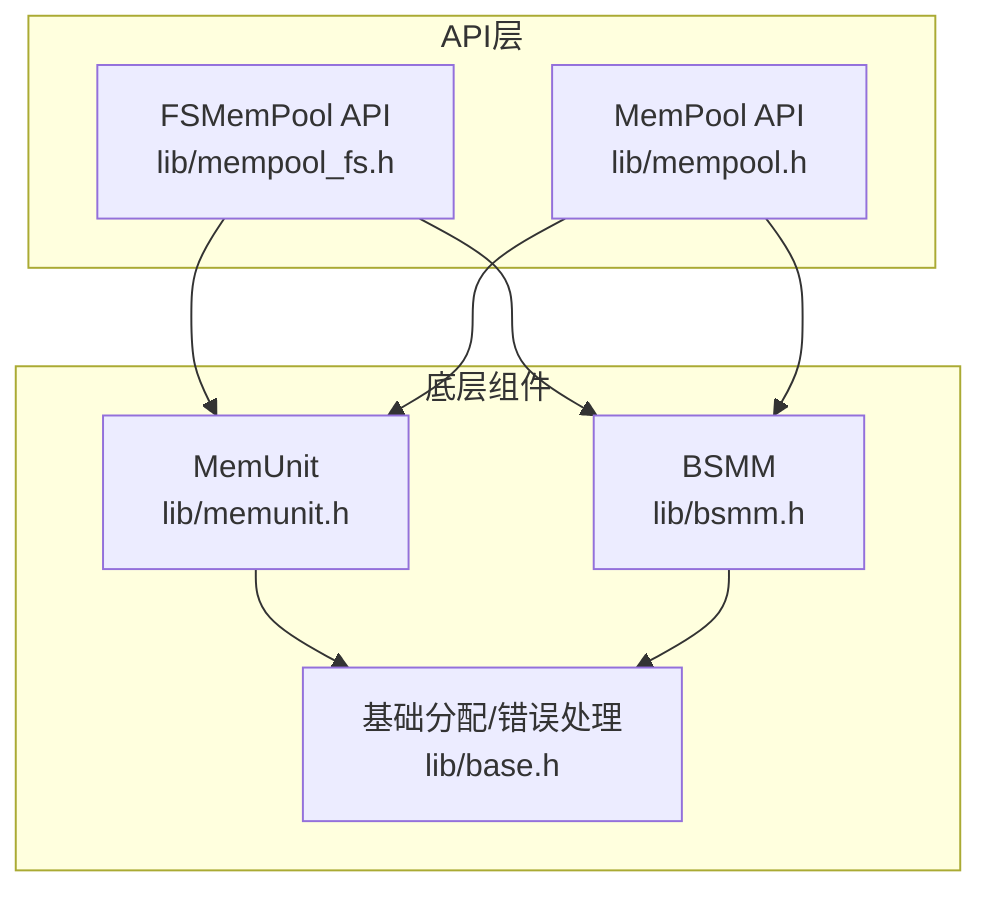
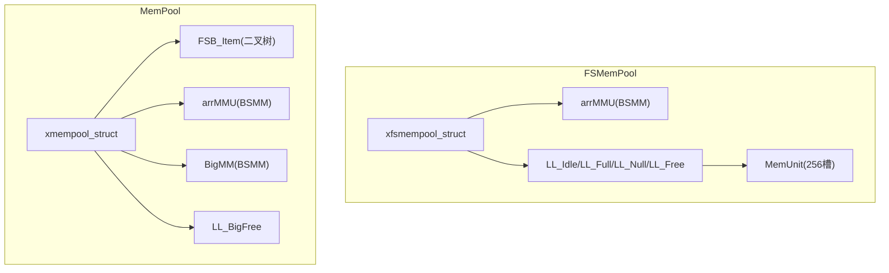
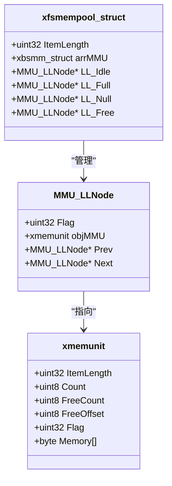
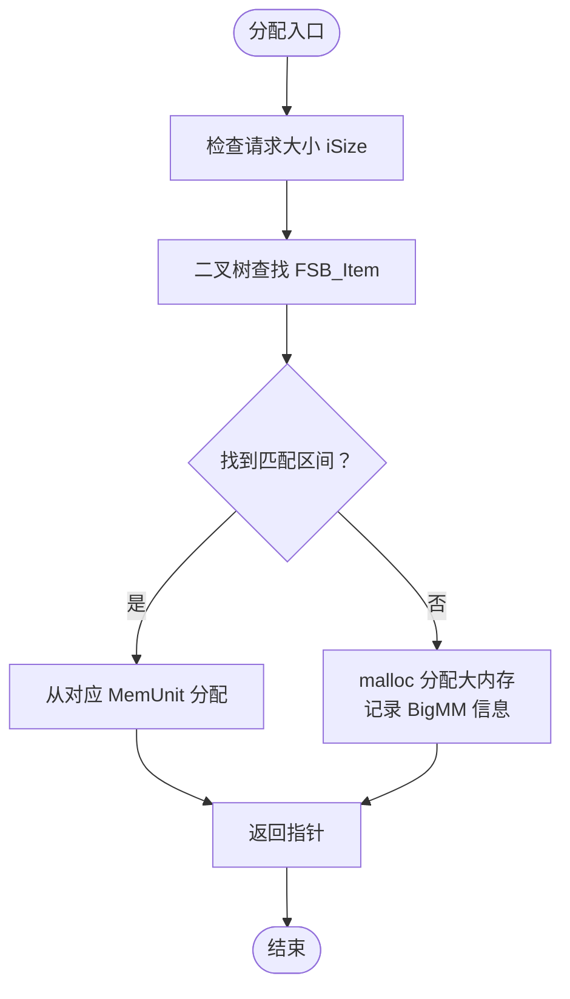
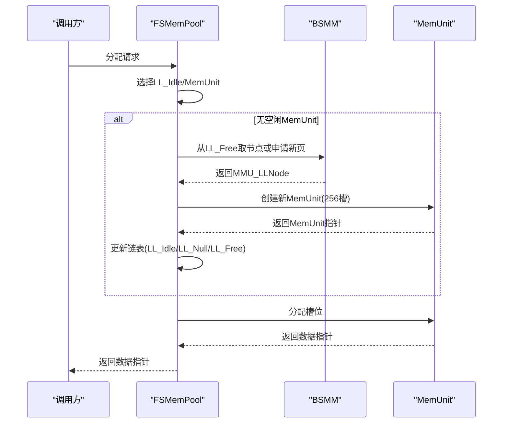
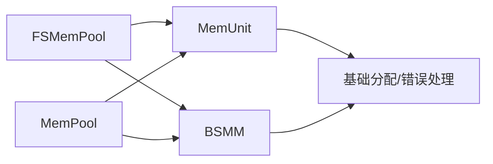

# 固定大小内存池API

<cite>
**本文档引用的文件**
- [lib/mempool.h](file://lib/mempool.h)
- [lib/mempool_fs.h](file://lib/mempool_fs.h)
- [lib/memunit.h](file://lib/memunit.h)
- [lib/bsmm.h](file://lib/bsmm.h)
- [lib/base.h](file://lib/base.h)
- [docs/api-mempool.md](file://docs/api-mempool.md)
- [docs/api-mempool-fs.md](file://docs/api-mempool-fs.md)
- [test/test_mempool.h](file://test/test_mempool.h)
- [test/test_mempool_fs.h](file://test/test_mempool_fs.h)
</cite>

## 目录
1. [简介](#简介)
2. [项目结构](#项目结构)
3. [核心组件](#核心组件)
4. [架构总览](#架构总览)
5. [详细组件分析](#详细组件分析)
6. [依赖关系分析](#依赖关系分析)
7. [性能考量](#性能考量)
8. [故障排查指南](#故障排查指南)
9. [结论](#结论)
10. [附录](#附录)

## 简介
本文件系统化梳理固定大小内存池（FSMemPool）API，围绕空闲/满载链表分组管理、智能分配策略、内存碎片优化、大小分级与分配算法、回收机制、初始化配置与动态调整、性能监控指标、高并发使用模式、内存压力处理与调优建议展开，并提供与通用内存池（MemPool）的对比分析、适用场景选择指导与故障排查方法。

## 项目结构
- 固定大小内存池API位于 lib/mempool_fs.h，核心实现位于 lib/mempool_fs.c（源码文件名以.h为主，具体实现通常在同名.c文件中）。
- 通用内存池API位于 lib/mempool.h，文档位于 docs/api-mempool.md。
- 底层支撑组件：
  - 内存单元管理（MemUnit）：lib/memunit.h
  - 块结构内存管理（BSMM）：lib/bsmm.h
  - 基础内存分配与错误处理：lib/base.h
- 测试用例：
  - 通用内存池测试：test/test_mempool.h
  - 固定大小内存池测试：test/test_mempool_fs.h

图表来源
- [lib/mempool_fs.h](file://lib/mempool_fs.h#L1-L257)
- [lib/mempool.h](file://lib/mempool.h#L1-L468)
- [lib/memunit.h](file://lib/memunit.h#L1-L143)
- [lib/bsmm.h](file://lib/bsmm.h#L1-L94)
- [lib/base.h](file://lib/base.h#L1-L132)

章节来源
- [lib/mempool_fs.h](file://lib/mempool_fs.h#L1-L257)
- [lib/mempool.h](file://lib/mempool.h#L1-L468)
- [lib/memunit.h](file://lib/memunit.h#L1-L143)
- [lib/bsmm.h](file://lib/bsmm.h#L1-L94)
- [lib/base.h](file://lib/base.h#L1-L132)

## 核心组件
- 固定大小内存池（FSMemPool）
  - 无限容量（无256限制），四链表管理（Idle/Full/Null/Free），O(1)分配，智能复用，GC支持。
  - 关键结构：xfsmempool_struct、MMU_LLNode、arrMMU（BSMM）、LL_Idle/LL_Full/LL_Null/LL_Free。
- 通用内存池（MemPool）
  - 可变大小，FSB二叉树快速查找，小/大内存两套预设，大内存兜底，GC支持。
  - 关键结构：xmempool_struct、FSB_Item、arrMMU（BSMM）、BigMM、LL_BigFree。
- 底层组件
  - MemUnit：256槽位内存单元，按需分配/释放，支持GC标记清除。
  - BSMM：块结构内存管理器，按页分配，空闲链表复用，支持扩容步长控制。
  - 基础分配与错误处理：统一的xrtMalloc/xrtFree与错误回调。

章节来源
- [docs/api-mempool-fs.md](file://docs/api-mempool-fs.md#L21-L735)
- [docs/api-mempool.md](file://docs/api-mempool.md#L22-L996)
- [lib/memunit.h](file://lib/memunit.h#L1-L143)
- [lib/bsmm.h](file://lib/bsmm.h#L1-L94)
- [lib/base.h](file://lib/base.h#L1-L132)

## 架构总览
FSMemPool通过四链表对MemUnit进行精细化管理，配合BSMM实现单元数组的动态扩展与复用；MemUnit内部采用256槽位数组与自由槽位列表，确保分配/释放的O(1)效率与零碎片特性。FSB二叉树（MemPool）则通过大小分级与二叉搜索实现可变大小的高效分配。

图表来源
- [lib/mempool_fs.h](file://lib/mempool_fs.h#L97-L123)
- [lib/mempool.h](file://lib/mempool.h#L142-L155)
- [lib/bsmm.h](file://lib/bsmm.h#L24-L49)
- [lib/memunit.h](file://lib/memunit.h#L5-L19)

## 详细组件分析

### 固定大小内存池（FSMemPool）API
- 创建/销毁/初始化
  - 创建：xrtFSMemPoolCreate(iItemLength)
  - 销毁：xrtFSMemPoolDestroy(objMM)
  - 初始化（栈上/嵌入式）：xrtFSMemPoolInit(objMM, iItemLength)，配合xrtFSMemPoolUnit
- 分配/释放
  - 分配：xrtFSMemPoolAlloc(objMM) → 从LL_Idle优先分配，必要时复用LL_Null或LL_Free槽位创建新单元
  - 释放：xrtFSMemPoolFree(objMM, ptr) → 通过ItemFlag定位所属MemUnit并释放槽位，必要时调整链表分类
- 回收（GC）
  - 标记：xrtFSMemPoolGC_Mark(ptr)
  - 回收：xrtFSMemPoolGC(objMM, bFreeMark) → 遍历LL_Idle/LL_Full，按标记回收并重新分类
- 四链表管理策略
  - LL_Idle：有空闲槽位的MemUnit，优先分配
  - LL_Full：已满载的MemUnit，不再分配
  - LL_Null：全空MemUnit（最多1个），避免临界状态抖动
  - LL_Free：已释放的Flag槽位，复用Flag避免冲突

图表来源
- [lib/mempool_fs.h](file://lib/mempool_fs.h#L97-L123)
- [lib/memunit.h](file://lib/memunit.h#L77-L94)

章节来源
- [lib/mempool_fs.h](file://lib/mempool_fs.h#L5-L257)
- [docs/api-mempool-fs.md](file://docs/api-mempool-fs.md#L126-L435)

### 通用内存池（MemPool）API
- 创建/销毁/初始化
  - 创建：xrtMemPoolCreate(iCustom) → iCustom=1小内存方案（4层树，1-512B），iCustom=2大内存方案（5层树，1-4096B）
  - 销毁：xrtMemPoolDestroy(objMP)
  - 初始化（栈上/嵌入式）：xrtMemPoolInit(objMP, iCustom)，配合xrtMemPoolUnit
- 分配/释放
  - 分配：xrtMemPoolAlloc(objMP, iSize) → 二叉树查找FSB_Item，从对应MemUnit分配；超出范围走大内存路径
  - 释放：xrtMemPoolFree(objMP, ptr) → 大内存路径释放并复用LL_BigFree；FSB路径释放到MemUnit并调整链表
- 回收（GC）
  - 标记：xrtMemPoolGC_Mark(ptr)
  - 回收：xrtMemPoolGC(objMP, bFreeMark) → 递归遍历FSB树与大内存链表，按标记回收并重分类
- FSB二叉树与大小分级
  - 通过二叉树快速定位适合的MemUnit大小区间，实现O(log n)查找+O(1)分配

图表来源
- [lib/mempool.h](file://lib/mempool.h#L147-L261)

章节来源
- [lib/mempool.h](file://lib/mempool.h#L35-L468)
- [docs/api-mempool.md](file://docs/api-mempool.md#L169-L546)

### 底层组件：MemUnit与BSMM
- MemUnit
  - 256槽位数组，按需分配/释放，支持GC标记清除；通过ItemFlag高位存储所属MemUnit索引与槽位索引
  - 分配：优先复用FreeList；释放：写回FreeList并更新计数
  - GC：按bFreeMark回收标记/非标记槽位
- BSMM
  - 按页（每页256槽）分配，空闲链表复用；当Count达到页上限时申请新页；支持AllocStep控制扩容步长
  - 用于管理MMU_LLNode数组，实现MemUnit链表节点的动态扩展

图表来源
- [lib/mempool_fs.h](file://lib/mempool_fs.h#L51-L125)
- [lib/bsmm.h](file://lib/bsmm.h#L51-L82)
- [lib/memunit.h](file://lib/memunit.h#L21-L41)

章节来源
- [lib/memunit.h](file://lib/memunit.h#L1-L143)
- [lib/bsmm.h](file://lib/bsmm.h#L1-L94)

## 依赖关系分析
- FSMemPool依赖
  - MemUnit：提供256槽位的高效分配/释放
  - BSMM：提供MemUnit链表节点的动态扩展与空闲复用
  - 基础分配：xrtMalloc/xrtFree与错误处理
- MemPool依赖
  - 与FSMemPool相同的底层组件，外加FSB二叉树结构与大内存兜底路径

图表来源
- [lib/mempool_fs.h](file://lib/mempool_fs.h#L1-L257)
- [lib/mempool.h](file://lib/mempool.h#L1-L468)
- [lib/memunit.h](file://lib/memunit.h#L1-L143)
- [lib/bsmm.h](file://lib/bsmm.h#L1-L94)
- [lib/base.h](file://lib/base.h#L1-L132)

章节来源
- [lib/mempool_fs.h](file://lib/mempool_fs.h#L1-L257)
- [lib/mempool.h](file://lib/mempool.h#L1-L468)
- [lib/memunit.h](file://lib/memunit.h#L1-L143)
- [lib/bsmm.h](file://lib/bsmm.h#L1-L94)
- [lib/base.h](file://lib/base.h#L1-L132)

## 性能考量
- 分配复杂度
  - FSMemPool：O(1)平均分配，四链表管理避免频繁创建/销毁单元
  - MemPool：O(log n)查找+O(1)分配，FSB二叉树快速定位
- 内存碎片
  - FSMemPool：零碎片（固定大小+256槽位）
  - MemPool：低碎片（FSB分级+大内存兜底）
- GC成本
  - 遍历LL_Idle/LL_Full或FSB树，按标记回收，减少碎片与悬挂指针
- 动态调整
  - BSMM AllocStep影响扩容频率与内存占用平衡
  - FSMemPool通过LL_Null/LL_Free实现“备用单元”与“Flag复用”，降低临界状态抖动

章节来源
- [docs/api-mempool-fs.md](file://docs/api-mempool-fs.md#L25-L31)
- [docs/api-mempool.md](file://docs/api-mempool.md#L26-L32)
- [lib/bsmm.h](file://lib/bsmm.h#L24-L30)

## 故障排查指南
- 常见问题与定位
  - 跨池释放：释放指针到错误池导致未定义行为
  - 重复释放：同一指针多次释放
  - 未标记回收：GC前未正确标记根对象，导致误回收
  - 内存泄漏：未释放或释放时机不当
- 错误处理与日志
  - 统一错误设置与回调：xrtSetError，便于定位失败原因
  - 测试用例中包含大量状态打印，可用于验证链表与单元状态
- 排查步骤
  - 核对ItemFlag高位与低位，确认归属单元与槽位
  - 检查LL_Idle/LL_Full/LL_Null/LL_Free状态变化
  - 观察arrMMU.Count与PageMMU.AllocCount变化
  - 使用GC_Mark标记根对象，执行GC验证回收效果

章节来源
- [lib/base.h](file://lib/base.h#L88-L132)
- [test/test_mempool_fs.h](file://test/test_mempool_fs.h#L105-L142)
- [test/test_mempool.h](file://test/test_mempool.h#L116-L154)

## 结论
FSMemPool通过四链表与256槽位MemUnit实现了固定大小对象的极致性能与零碎片；MemPool通过FSB二叉树与大内存兜底满足多尺寸需求。两者均支持GC，便于在高并发与长时间运行场景下维持稳定内存占用。选择建议：固定大小对象优先FSMemPool；多尺寸对象优先MemPool；需要GC与低碎片场景优先FSMemPool。

## 附录

### API参考与使用要点
- FSMemPool
  - 创建/销毁/初始化：参见文档与实现
  - 分配/释放：注意ItemLength不含头部4字节
  - GC：先标记根对象，再执行回收
- MemPool
  - iCustom=1/2预设，或自定义FSB二叉树
  - 大内存路径使用malloc并记录BigMM信息
  - GC递归遍历FSB树与大内存链表

章节来源
- [docs/api-mempool-fs.md](file://docs/api-mempool-fs.md#L126-L435)
- [docs/api-mempool.md](file://docs/api-mempool.md#L169-L546)