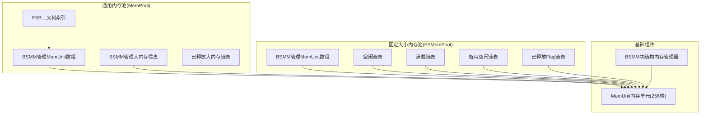
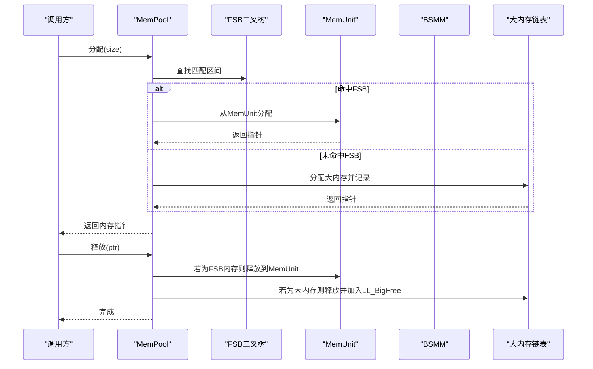
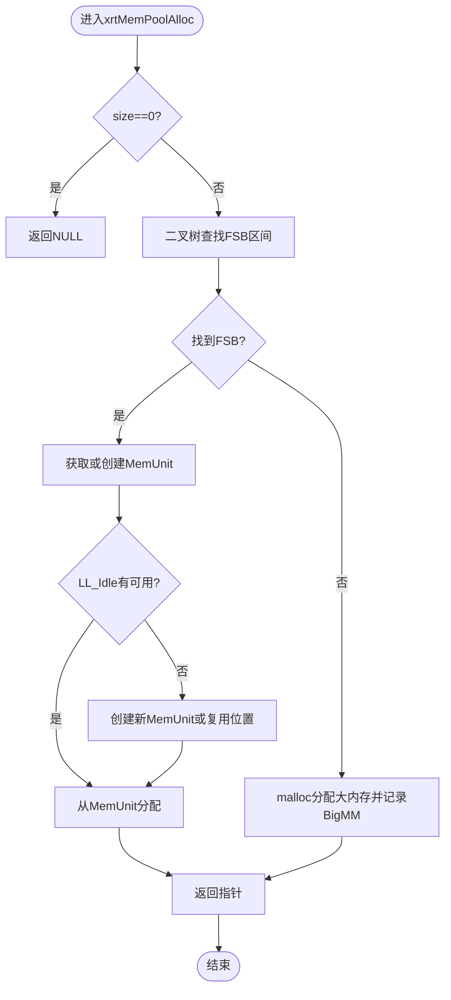
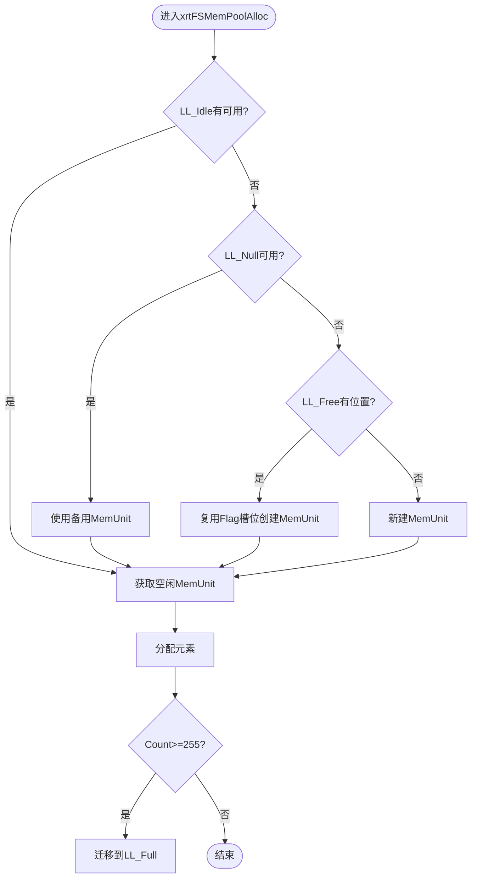
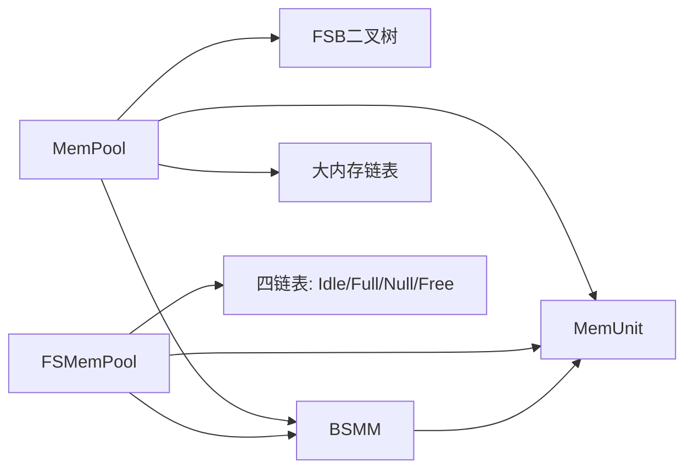

# 通用内存池API

<cite>
**本文档引用的文件**
- [lib/mempool.h](file://lib/mempool.h)
- [lib/mempool_fs.h](file://lib/mempool_fs.h)
- [lib/bsmm.h](file://lib/bsmm.h)
- [lib/memunit.h](file://lib/memunit.h)
- [docs/api-mempool.md](file://docs/api-mempool.md)
- [docs/api-mempool-fs.md](file://docs/api-mempool-fs.md)
- [docs/api-bsmm.md](file://docs/api-bsmm.md)
- [test/test_mempool.h](file://test/test_mempool.h)
- [test/test_mempool_fs.h](file://test/test_mempool_fs.h)
</cite>

## 目录
1. [简介](#简介)
2. [项目结构](#项目结构)
3. [核心组件](#核心组件)
4. [架构总览](#架构总览)
5. [详细组件分析](#详细组件分析)
6. [依赖关系分析](#依赖关系分析)
7. [性能考量](#性能考量)
8. [故障排查指南](#故障排查指南)
9. [结论](#结论)
10. [附录](#附录)

## 简介
本文件面向通用内存池API，系统化阐述二叉树索引FSB、多级分块管理、内存碎片优化策略、动态扩展机制、内存块合并算法、分配器选择策略、配置参数、性能特征、适用场景、监控方法、性能基准测试与容量规划指导，并给出与固定大小内存池的配合使用、内存压力处理、最佳实践与常见问题解决方案。

## 项目结构
- 通用内存池（MemPool）：支持可变大小内存分配，内置二叉树索引FSB，提供GC回收能力。
- 固定大小内存池（FSMemPool）：面向固定大小对象的高性能池化分配，支持无限容量扩展。
- 基础组件：
  - BSMM：块结构内存管理器，按页管理固定大小元素，支持空闲复用。
  - MemUnit：单个内存单元，承载256个固定大小槽位，支持标记-清除GC。
- 文档与测试：配套API文档与详尽的单元测试，覆盖分配、释放、GC、压力测试等场景。

图表来源
- [lib/mempool.h](file://lib/mempool.h#L35-L119)
- [lib/mempool_fs.h](file://lib/mempool_fs.h#L24-L49)
- [lib/bsmm.h](file://lib/bsmm.h#L24-L49)
- [lib/memunit.h](file://lib/memunit.h#L5-L19)

章节来源
- [lib/mempool.h](file://lib/mempool.h#L35-L119)
- [lib/mempool_fs.h](file://lib/mempool_fs.h#L24-L49)
- [lib/bsmm.h](file://lib/bsmm.h#L24-L49)
- [lib/memunit.h](file://lib/memunit.h#L5-L19)

## 核心组件
- 通用内存池（MemPool）
  - 二叉树索引FSB：按大小范围组织MemUnit，O(log n)快速定位。
  - 大内存兜底：超出FSB范围使用malloc，记录BigMM信息，支持GC。
  - 动态扩展：通过BSMM管理MemUnit数组，按需增长；FSB节点空闲/满载/备用/释放链表协同。
- 固定大小内存池（FSMemPool）
  - 四链表管理：Idle/Full/Null/Free，避免临界状态抖动，O(1)分配。
  - 无限容量：BSMM按页扩展，MemUnit按需创建，无256限制。
  - GC支持：标记-清除，回收未使用对象。
- 基础组件
  - BSMM：每页256个元素，空闲链表复用，O(1)分配/释放。
  - MemUnit：单个单元256槽，支持GC标记位，释放后复用槽位。

章节来源
- [lib/mempool.h](file://lib/mempool.h#L147-L261)
- [lib/mempool_fs.h](file://lib/mempool_fs.h#L51-L125)
- [lib/bsmm.h](file://lib/bsmm.h#L51-L82)
- [lib/memunit.h](file://lib/memunit.h#L21-L86)

## 架构总览
通用内存池采用“二叉树索引FSB + 多级分块管理”的组合架构：
- FSB二叉树：按大小范围划分MemUnit，快速定位目标区间。
- MemUnit：每个单元管理256个固定大小槽位，支持标记-清除GC。
- BSMM：统一管理MemUnit数组与内存页，支持空闲复用与动态扩展。
- 大内存兜底：超出FSB范围的请求走malloc路径，记录BigMM信息，便于GC回收。

图表来源
- [lib/mempool.h](file://lib/mempool.h#L147-L261)
- [lib/mempool.h](file://lib/mempool.h#L335-L385)

章节来源
- [lib/mempool.h](file://lib/mempool.h#L147-L261)
- [lib/mempool.h](file://lib/mempool.h#L335-L385)

## 详细组件分析

### 通用内存池（MemPool）组件
- 初始化与配置
  - 支持iCustom预设：1为小内存方案（4层树，1-512B），2为大内存方案（5层树，1-4096B）。
  - FSB数组与根节点初始化，MemUnit与BigMM的BSMM管理器初始化。
- 分配流程
  - 二叉树查找匹配区间，若命中FSB则从MemUnit分配；否则使用malloc并记录BigMM。
  - 空闲MemUnit优先分配，即将满载的MemUnit迁移到满载链表。
- 释放流程
  - 判断是否为大内存：若是则释放底层内存并加入LL_BigFree复用。
  - 若为FSB内存：释放到MemUnit，必要时将满载MemUnit迁回空闲或变为备用。
- GC回收
  - 遍历FSB树下所有MemUnit执行GC，回收未标记或已标记对象。
  - 大内存链表按标记位回收或清除标记。

图表来源
- [lib/mempool.h](file://lib/mempool.h#L147-L261)

章节来源
- [lib/mempool.h](file://lib/mempool.h#L35-L119)
- [lib/mempool.h](file://lib/mempool.h#L147-L261)
- [lib/mempool.h](file://lib/mempool.h#L335-L385)
- [lib/mempool.h](file://lib/mempool.h#L427-L465)

### 固定大小内存池（FSMemPool）组件
- 初始化与配置
  - 设置ItemLength，初始化arrMMU（BSMM），四链表均为空。
- 分配流程
  - 优先从LL_Idle分配；若为空则尝试LL_Null或复用LL_Free中的Flag槽位创建新MemUnit。
  - 分配后若MemUnit接近满载（Count>=255）则迁移到LL_Full。
- 释放流程
  - 通过指针前4字节的ItemFlag定位所属MemUnit与槽位，释放到FreeList。
  - 若MemUnit清空则进入LL_Null或LL_Free复用。
- GC回收
  - 遍历LL_Idle与LL_Full中的MemUnit执行GC，重新分类。

图表来源
- [lib/mempool_fs.h](file://lib/mempool_fs.h#L51-L125)

章节来源
- [lib/mempool_fs.h](file://lib/mempool_fs.h#L24-L49)
- [lib/mempool_fs.h](file://lib/mempool_fs.h#L51-L125)
- [lib/mempool_fs.h](file://lib/mempool_fs.h#L199-L221)
- [lib/mempool_fs.h](file://lib/mempool_fs.h#L224-L254)

### 基础组件：BSMM与MemUnit
- BSMM
  - 每页256个元素，按需分配新页；空闲链表优先复用，降低碎片。
  - 提供xrtBsmmAlloc/xrtBsmmFree，O(1)分配/释放。
- MemUnit
  - 单个单元256槽，支持GC标记位；释放后复用槽位，避免碎片。
  - 支持按索引释放与按指针释放两种方式。

章节来源
- [lib/bsmm.h](file://lib/bsmm.h#L24-L49)
- [lib/bsmm.h](file://lib/bsmm.h#L51-L82)
- [lib/memunit.h](file://lib/memunit.h#L5-L19)
- [lib/memunit.h](file://lib/memunit.h#L21-L86)
- [lib/memunit.h](file://lib/memunit.h#L88-L140)

## 依赖关系分析
- MemPool依赖
  - FSB二叉树索引：用于快速定位MemUnit区间。
  - BSMM：管理MemUnit数组与内存页，支持动态扩展。
  - MemUnit：承载256槽位，支持GC。
  - 大内存链表：超出FSB范围时使用malloc并记录。
- FSMemPool依赖
  - BSMM：管理MemUnit数组，支持无限容量扩展。
  - MemUnit：固定大小槽位，四链表协同避免抖动。
- 组件耦合
  - MemPool与FSMemPool共享MemUnit与BSMM，但控制策略不同：前者按大小范围索引，后者按固定大小池化。
  - GC接口统一，便于跨池管理。

图表来源
- [lib/mempool.h](file://lib/mempool.h#L35-L119)
- [lib/mempool_fs.h](file://lib/mempool_fs.h#L24-L49)
- [lib/bsmm.h](file://lib/bsmm.h#L24-L49)

章节来源
- [lib/mempool.h](file://lib/mempool.h#L35-L119)
- [lib/mempool_fs.h](file://lib/mempool_fs.h#L24-L49)
- [lib/bsmm.h](file://lib/bsmm.h#L24-L49)

## 性能考量
- 分配复杂度
  - MemPool：FSB查找O(log n)，MemUnit分配O(1)；大内存分配O(1)。
  - FSMemPool：四链表管理，分配O(1)；无限容量扩展，避免256限制。
- 内存碎片
  - MemPool：FSB区间内无碎片；大内存使用malloc，可能产生碎片，但通过GC回收降低影响。
  - FSMemPool：固定大小无碎片；MemUnit释放后复用槽位，避免碎片。
- 动态扩展
  - MemPool：FSB节点空闲/满载/备用/释放链表协同，避免频繁创建销毁。
  - FSMemPool：BSMM按页扩展，MemUnit按需创建，支持高并发场景。
- GC效率
  - MemPool：递归遍历FSB树下MemUnit，支持标记-清除；大内存链表按标记回收。
  - FSMemPool：遍历LL_Idle与LL_Full，重新分类，提升后续分配效率。

章节来源
- [lib/mempool.h](file://lib/mempool.h#L147-L261)
- [lib/mempool.h](file://lib/mempool.h#L427-L465)
- [lib/mempool_fs.h](file://lib/mempool_fs.h#L51-L125)
- [lib/mempool_fs.h](file://lib/mempool_fs.h#L224-L254)
- [lib/bsmm.h](file://lib/bsmm.h#L51-L82)
- [lib/memunit.h](file://lib/memunit.h#L88-L140)

## 故障排查指南
- 常见错误与处理
  - MMU不可为空：释放时若ItemFlag指向的MemUnit为空，记录错误并返回。
  - FSB查找失败：释放时若无法定位FSB区间，记录错误。
  - 内存池未正确销毁：MemPool需调用destroy释放所有资源；FSMemPool需调用unit或destroy。
- GC相关
  - 标记未清除：GC完成后标记会被清除，下次GC前需重新标记。
  - 回收策略：bFreeMark为true回收已标记对象，false回收未标记对象。
- 测试验证
  - 通过测试用例验证分配/释放/GC/压力测试，观察链表状态变化与计数器变化。

章节来源
- [lib/mempool.h](file://lib/mempool.h#L335-L385)
- [lib/mempool.h](file://lib/mempool.h#L427-L465)
- [lib/mempool_fs.h](file://lib/mempool_fs.h#L199-L221)
- [test/test_mempool.h](file://test/test_mempool.h#L25-L184)
- [test/test_mempool_fs.h](file://test/test_mempool_fs.h#L12-L800)

## 结论
通用内存池API通过二叉树索引FSB与多级分块管理，实现了可变大小内存的高效分配与回收；配合BSMM与MemUnit，既保证了低碎片特性，又提供了动态扩展能力。FSMemPool进一步强化了固定大小对象的高性能与无限容量扩展。结合GC机制与完善的测试体系，该API适用于高并发、低延迟的内存密集型场景。

## 附录

### 配置参数与预设
- MemPool
  - iCustom=1：小内存方案（4层树，1-512B，15个区块）
  - iCustom=2：大内存方案（5层树，1-4096B，31个区块）
- FSMemPool
  - ItemLength：每个元素的数据大小（不含头部4字节）

章节来源
- [lib/mempool.h](file://lib/mempool.h#L35-L119)
- [lib/mempool_fs.h](file://lib/mempool_fs.h#L24-L33)

### 适用场景
- MemPool：多尺寸对象分配、JSON解析器、带GC的脚本引擎等。
- FSMemPool：高频对象分配（如消息/事件）、链表/树节点池、需要GC的对象堆等。

章节来源
- [docs/api-mempool.md](file://docs/api-mempool.md#L613-L716)
- [docs/api-mempool-fs.md](file://docs/api-mempool-fs.md#L438-L598)

### 监控方法
- 观察链表状态：MemPool的FSB各MemUnit链表；FSMemPool的Idle/Full/Null/Free链表。
- 计数器：arrMMU.Count、BigMM.Count、MemUnit的Count/FreeCount/FreeOffset。
- 日志：错误信息与GC标记状态。

章节来源
- [test/test_mempool.h](file://test/test_mempool.h#L5-L20)
- [test/test_mempool_fs.h](file://test/test_mempool_fs.h#L105-L142)
- [test/test_mempool_fs.h](file://test/test_mempool_fs.h#L533-L582)

### 性能基准测试与容量规划
- 基准测试：参考FSMemPool的1000万次分配压力测试，评估吞吐与延迟。
- 容量规划：根据对象大小分布选择MemPool的iCustom预设；FSMemPool根据ItemLength与预期并发量估算MemUnit数量与页面数。

章节来源
- [test/test_mempool_fs.h](file://test/test_mempool_fs.h#L506-L526)

### 与固定大小内存池的配合使用
- 混合策略：大对象走MemPool，小对象走FSMemPool，最大化分配效率。
- GC协同：统一使用GC标记接口，确保跨池对象可达性分析一致。

章节来源
- [docs/api-mempool.md](file://docs/api-mempool.md#L465-L546)
- [docs/api-mempool-fs.md](file://docs/api-mempool-fs.md#L357-L429)

### 内存压力处理
- 降低碎片：优先使用FSMemPool；MemPool中合理设置iCustom，减少大内存分配。
- GC周期：定期执行GC，回收未使用对象；注意标记策略与清理时机。
- 扩展策略：BSMM按页扩展，MemUnit按需创建，避免一次性分配过多。

章节来源
- [lib/mempool.h](file://lib/mempool.h#L427-L465)
- [lib/mempool_fs.h](file://lib/mempool_fs.h#L224-L254)
- [lib/bsmm.h](file://lib/bsmm.h#L63-L81)

### 最佳实践
- 选择合适的内存管理器：固定大小对象优先FSMemPool；多尺寸对象优先MemPool。
- 避免跨池释放：确保释放到对应的内存池。
- 批量操作优化：预分配与批量释放，减少链表迁移与抖动。
- GC使用：明确标记策略，避免遗漏根集导致误回收。

章节来源
- [docs/api-mempool-fs.md](file://docs/api-mempool-fs.md#L602-L702)