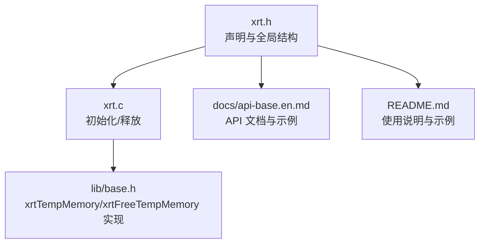
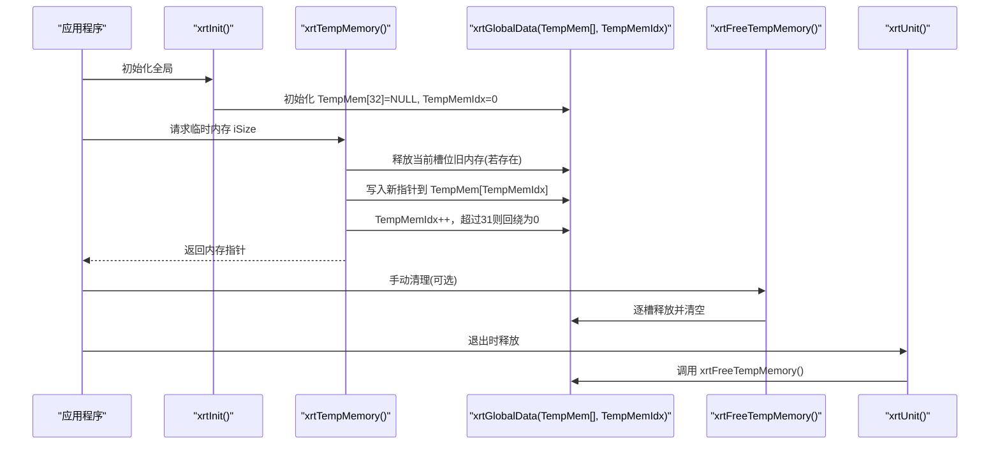
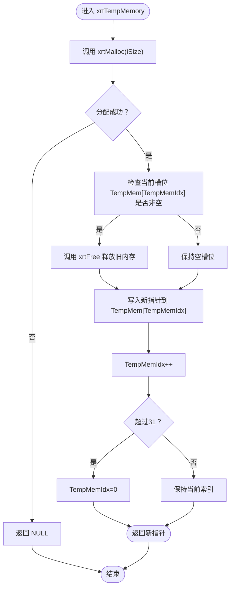

# 临时内存API

<cite>
**本文档引用的文件**
- [xrt.h](file://xrt.h)
- [xrt.c](file://xrt.c)
- [base.h](file://lib/base.h)
- [api-base.en.md](file://docs/api-base.en.md)
- [README.md](file://README.md)
</cite>

## 目录
1. [简介](#简介)
2. [项目结构](#项目结构)
3. [核心组件](#核心组件)
4. [架构总览](#架构总览)
5. [详细组件分析](#详细组件分析)
6. [依赖关系分析](#依赖关系分析)
7. [性能考量](#性能考量)
8. [故障排查指南](#故障排查指南)
9. [结论](#结论)
10. [附录](#附录)

## 简介
本文件系统性阐述 XRT 库中的临时内存 API：xrtTempMemory 与 xrtFreeTempMemory。重点解释其环形缓冲区机制、32 槽位设计原理、自动内存管理策略，以及生命周期、使用限制、适用场景与注意事项。同时提供最佳实践、性能优化建议与常见陷阱规避方法。

## 项目结构
围绕临时内存 API 的相关文件组织如下：
- 头文件声明与全局数据结构定义：xrt.h
- 初始化与释放逻辑：xrt.c
- 临时内存 API 实现：lib/base.h
- 文档与示例：docs/api-base.en.md、README.md

图表来源
- [xrt.h](file://xrt.h#L156-L184)
- [xrt.c](file://xrt.c#L88-L125)
- [base.h](file://lib/base.h#L49-L84)
- [api-base.en.md](file://docs/api-base.en.md#L470-L575)
- [README.md](file://README.md#L540-L549)

章节来源
- [xrt.h](file://xrt.h#L156-L184)
- [xrt.c](file://xrt.c#L88-L125)
- [base.h](file://lib/base.h#L49-L84)
- [api-base.en.md](file://docs/api-base.en.md#L470-L575)
- [README.md](file://README.md#L540-L549)

## 核心组件
- xrtTempMemory：申请临时内存（自动管理），内部通过环形缓冲区循环复用 32 个槽位。
- xrtFreeTempMemory：立即释放所有临时内存槽位，重置环形索引。
- 全局结构 xrtGlobalData：包含 TempMem[32] 与 TempMemIdx，用于保存 32 个临时指针及当前槽位索引。

关键行为与约束
- 无须手动释放：xrtTempMemory 返回的内存由库自动管理。
- 32 槽位环形复用：第 33 次调用会覆盖第 1 个槽位；若第 1 个槽位已被覆盖，将释放旧内存。
- 线程不安全：环形缓冲区与索引更新未加锁，不适合多线程并发使用。
- 仅适用于短期、小规模内存需求；不适合长期持有或跨调用传递返回。

章节来源
- [xrt.h](file://xrt.h#L156-L184)
- [base.h](file://lib/base.h#L49-L84)
- [api-base.en.md](file://docs/api-base.en.md#L470-L575)

## 架构总览
临时内存 API 的工作流由“初始化—分配—环形复用—释放”构成。初始化阶段建立 32 个空槽位与索引；每次分配时先释放旧槽位内存，再写入新指针并推进索引；xrtUnit 或 xrtFreeTempMemory 会清空全部槽位。

图表来源
- [xrt.c](file://xrt.c#L110-L114)
- [base.h](file://lib/base.h#L49-L84)
- [xrt.c](file://xrt.c#L191-L226)

章节来源
- [xrt.c](file://xrt.c#L110-L114)
- [base.h](file://lib/base.h#L49-L84)
- [xrt.c](file://xrt.c#L191-L226)

## 详细组件分析

### 组件：环形临时内存（32 槽位）
- 设计目标：降低频繁分配/释放带来的碎片与开销，同时避免长期持有导致的泄漏风险。
- 数据结构：TempMem[32] 存放指针，TempMemIdx 为当前写入槽位索引。
- 生命周期：
  - 分配：xrtTempMemory 会先释放当前槽位已有内存，再写入新指针，索引前进，超过上限回绕。
  - 清理：xrtFreeTempMemory 逐槽释放并清空；xrtUnit 在进程退出时调用该清理函数。
- 线程安全：非线程安全，多线程共享使用可能导致竞态与覆盖。

图表来源
- [base.h](file://lib/base.h#L49-L84)

章节来源
- [xrt.h](file://xrt.h#L156-L184)
- [base.h](file://lib/base.h#L49-L84)
- [xrt.c](file://xrt.c#L191-L226)

### 组件：xrtTempMemory（分配接口）
- 参数：请求字节数 iSize
- 返回：成功返回临时内存指针，失败返回 NULL
- 行为：内部委托 xrtMalloc 分配，随后进行环形槽位写入与索引推进
- 注意：不要将返回的指针长期持有或跨多次调用传递；避免在第 33 次调用后被覆盖

章节来源
- [base.h](file://lib/base.h#L49-L70)
- [api-base.en.md](file://docs/api-base.en.md#L470-L518)

### 组件：xrtFreeTempMemory（强制清理）
- 行为：遍历 32 个槽位，逐槽释放并清空，重置索引
- 触发时机：通常由 xrtUnit 在退出时自动调用；也可在需要立即回收时手动调用
- 适用场景：在高频临时分配且担心覆盖风险时，周期性清理可降低覆盖概率

章节来源
- [base.h](file://lib/base.h#L74-L84)
- [xrt.c](file://xrt.c#L215-L216)
- [api-base.en.md](file://docs/api-base.en.md#L539-L575)

### 组件：全局初始化与退出
- 初始化：xrtInit 会将 TempMem[32] 全部置空，TempMemIdx 置零
- 退出：xrtUnit 在引用计数归零时调用 xrtFreeTempMemory，确保彻底释放

章节来源
- [xrt.c](file://xrt.c#L88-L125)
- [xrt.c](file://xrt.c#L191-L226)

## 依赖关系分析
- xrtTempMemory 依赖 xrtMalloc/xrtFree 实现底层分配与释放
- xrtFreeTempMemory 依赖 xrtFree 实现统一释放
- xrtUnit 依赖 xrtFreeTempMemory 实现进程退出时的资源回收
- 全局结构 xrtGlobalData 位于 xrt.h，被 xrt.c 初始化，被 base.h 使用

图表来源
- [xrt.h](file://xrt.h#L156-L184)
- [xrt.c](file://xrt.c#L88-L125)
- [base.h](file://lib/base.h#L49-L84)

章节来源
- [xrt.h](file://xrt.h#L156-L184)
- [xrt.c](file://xrt.c#L88-L125)
- [base.h](file://lib/base.h#L49-L84)

## 性能考量
- 优势
  - 避免频繁系统调用：短生命周期小内存反复分配/释放时，减少系统调用次数
  - 降低碎片：集中释放（周期性或退出时）有利于内存整理
- 局限
  - 线程不安全：多线程共享使用会带来竞态与覆盖风险
  - 32 槽位容量有限：在极高频临时分配场景下仍可能覆盖
- 优化建议
  - 控制临时内存使用频率：每 N 次分配后手动调用 xrtFreeTempMemory，降低覆盖概率
  - 避免长期持有：不要将临时内存指针作为返回值或跨多次调用传递
  - 与常规内存配合：长期持有的数据使用 xrtMalloc/xrtCalloc + xrtFree 管理，临时中间态使用 xrtTempMemory

章节来源
- [api-base.en.md](file://docs/api-base.en.md#L539-L575)
- [README.md](file://README.md#L540-L549)

## 故障排查指南
- 常见问题
  - 返回指针被覆盖：在第 33 次分配后，第 1 个槽位会被覆盖；若仍持有旧指针，将指向已释放或被复用的内存
  - 多线程并发：多个线程同时调用 xrtTempMemory 可能互相覆盖彼此的槽位
  - 误以为需要手动释放：xrtTempMemory 返回的内存无需手动释放，但不当使用仍可能导致逻辑错误
- 排查步骤
  - 确认是否在第 33 次调用后继续使用旧指针
  - 检查是否在多线程环境下共享使用临时内存
  - 在高频分配场景中，增加周期性调用 xrtFreeTempMemory 的频率
- 修复建议
  - 立即使用临时内存：在分配后尽快使用并避免跨调用传递
  - 手动清理：在循环中每 32 次调用一次 xrtFreeTempMemory
  - 多线程隔离：为每个线程维护独立的临时内存使用策略或加锁保护

章节来源
- [api-base.en.md](file://docs/api-base.en.md#L520-L535)
- [api-base.en.md](file://docs/api-base.en.md#L539-L575)

## 结论
xrtTempMemory 与 xrtFreeTempMemory 提供了简单高效的环形临时内存管理方案，适合短期、小规模的中间态内存需求。通过 32 槽位环形复用与自动释放机制，显著降低了频繁分配/释放的成本与泄漏风险。但其线程不安全与容量限制决定了它并非通用内存池，应结合常规内存管理策略合理使用，并在高频场景中配合周期性清理与严格的使用约束。

## 附录

### 最佳实践清单
- 何时使用
  - 短生命周期、小规模的中间态内存
  - 函数内临时拼接、格式化、转换等一次性使用
- 如何避免覆盖
  - 分配后立即使用，避免跨调用传递返回
  - 高频场景中每 32 次分配后调用 xrtFreeTempMemory
- 与常规内存配合
  - 长期持有使用 xrtMalloc/xrtCalloc + xrtFree
  - 临时中间态使用 xrtTempMemory，避免混用造成逻辑混乱

章节来源
- [api-base.en.md](file://docs/api-base.en.md#L470-L575)
- [README.md](file://README.md#L540-L549)