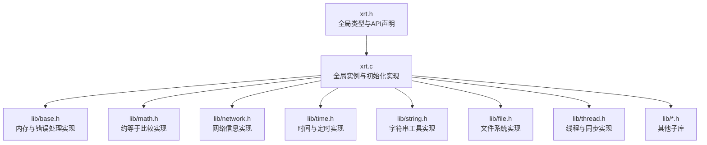
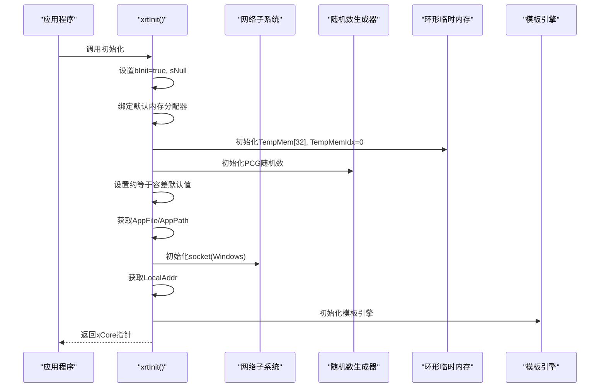
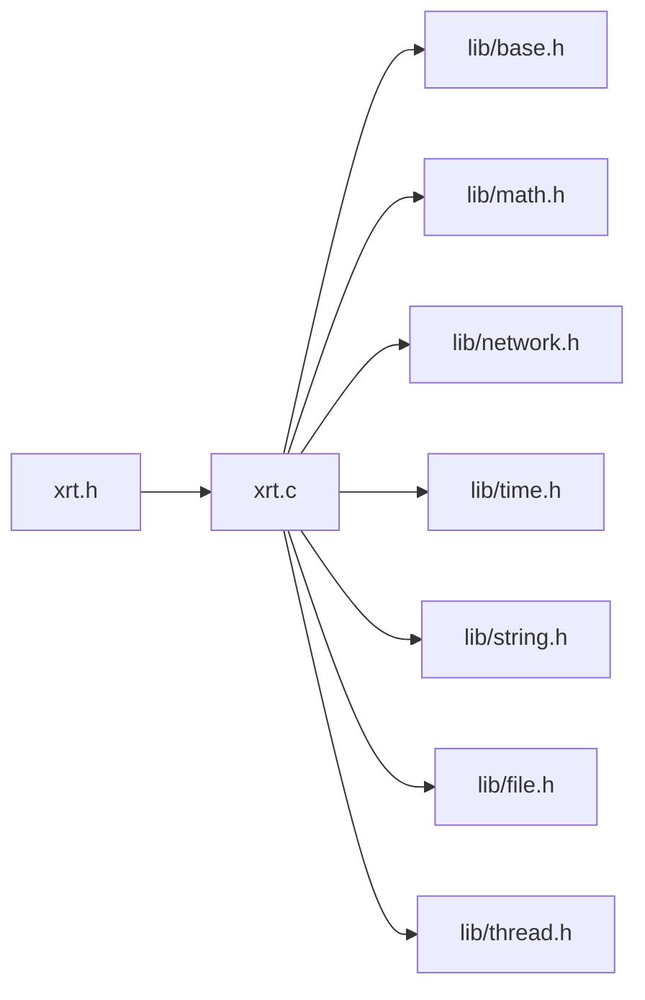

# 全局数据结构

<cite>
**本文档引用的文件**
- [xrt.h](file://xrt.h)
- [xrt.c](file://xrt.c)
- [base.h](file://lib/base.h)
- [test_base.h](file://test/test_base.h)
- [api-base.md](file://docs/api-base.md)
- [api-base.en.md](file://docs/api-base.en.md)
- [api-network.md](file://docs/api-network.md)
- [api-network.en.md](file://docs/api-network.en.md)
- [api-math.md](file://docs/api-math.md)
- [api-math.en.md](file://docs/api-math.en.md)
- [types.md](file://docs/types.md)
- [types.en.md](file://docs/types.en.md)
</cite>

## 目录
1. [简介](#简介)
2. [项目结构](#项目结构)
3. [核心组件](#核心组件)
4. [架构总览](#架构总览)
5. [详细组件分析](#详细组件分析)
6. [依赖关系分析](#依赖关系分析)
7. [性能考虑](#性能考虑)
8. [故障排查指南](#故障排查指南)
9. [结论](#结论)
10. [附录](#附录)

## 简介
本文件聚焦于XRT库的全局数据结构与全局实例，系统性阐述以下主题：
- xrtGlobalData结构体的完整定义、字段语义与使用方式
- xCore全局实例的初始化流程、配置项与运行时状态管理
- 应用程序信息获取、网络信息访问、临时返回值机制与内存分配器自定义
- 全局状态监控、调试技巧与性能调优建议

## 项目结构
XRT采用“头文件声明 + 单源文件实现 + 子库模块”的组织方式：
- 头文件集中声明全局数据结构、API与类型别名
- 单一实现文件负责全局实例初始化、清理与平台适配
- 子库模块（基础、字符串、时间、文件、网络、数学等）通过统一入口使用全局数据

图表来源
- [xrt.h](file://xrt.h#L122-L184)
- [xrt.c](file://xrt.c#L42-L84)

章节来源
- [xrt.h](file://xrt.h#L122-L184)
- [xrt.c](file://xrt.c#L42-L84)

## 核心组件
- 全局数据结构：xrtGlobalData
- 全局实例：xCore
- 初始化与清理：xrtInit() / xrtUnit()
- 内存管理：xrtMalloc / xrtCalloc / xrtRealloc / xrtFree
- 临时内存：xrtTempMemory / xrtFreeTempMemory
- 错误处理：xrtSetError / xrtClearError / OnError回调
- 约等于配置：整数/浮点/时间/字符串比较容差
- 应用信息：AppFile / AppPath
- 网络信息：LocalAddr（本机IP）

章节来源
- [xrt.h](file://xrt.h#L122-L184)
- [xrt.c](file://xrt.c#L88-L226)
- [base.h](file://lib/base.h#L4-L132)

## 架构总览
xCore作为全局唯一实例，贯穿所有子库。初始化时完成：
- 标记初始化状态
- 设置空字符串常量
- 绑定默认内存分配器
- 初始化环形临时内存槽位
- 初始化高精度时钟频率（Windows）
- 初始化PCG随机数生成器
- 设置约等于比较默认容差
- 获取应用文件路径与目录
- 初始化网络子系统（Windows）
- 获取本机IP（用于分布式ID等）
- 初始化模板引擎

图表来源
- [xrt.c](file://xrt.c#L88-L186)

章节来源
- [xrt.c](file://xrt.c#L88-L186)

## 详细组件分析

### xrtGlobalData 结构体详解
- 字段概览与职责
  - 初始化标记：bInit
  - 全局常量：sNull（空字符串常量）
  - 错误处理：LastError、__pri_FreeError、OnError回调
  - 高精度时钟（Windows）：Frequency
  - 本机IP：LocalAddr（用于XID生成）
  - 应用信息：AppFile、AppPath
  - 环形临时内存：TempMem[32]、TempMemIdx
  - 内存分配器：malloc/calloc/realloc/free
  - 随机数状态：rand32、rand64_low、rand64_high
  - 约等于比较配置：整数/浮点/时间/字符串容差与模式

- 线程安全性
  - 全局状态为线程不安全；建议在单线程或受控并发环境中使用
  - 临时内存环形槽位在单线程下可简化生命周期管理

- 使用建议
  - 在业务层封装对xCore的访问，避免直接跨模块滥用
  - 对于需要长期持有的内存，优先使用标准分配接口并显式释放
  - 临时短命数据可使用环形临时内存，减少频繁分配/释放

章节来源
- [xrt.h](file://xrt.h#L130-L181)
- [types.md](file://docs/types.md#L285-L328)
- [types.en.md](file://docs/types.en.md#L285-L328)

### xCore 全局实例
- 声明与定义
  - 声明：extern xrtGlobalData xCore
  - 定义：const int sNullValue = 0; xrtGlobalData xCore = { FALSE };
  - 引用计数：__xrt_RefCount，确保多次初始化/释放的安全性

- 生命周期管理
  - 初始化：xrtInit() 增加引用计数，若未初始化则执行完整初始化流程
  - 释放：xrtUnit() 减少引用计数，归零时清理资源并重置初始化标记
  - DLL自动管理：在Windows下通过DllMain在进程加载/卸载时自动调用

- 平台差异
  - Windows：初始化Winsock、查询高精度时钟频率、获取进程ID参与随机种子
  - Linux/macOS：读取/proc/self/exe获取程序路径，使用monotonic时钟

章节来源
- [xrt.h](file://xrt.h#L183-L192)
- [xrt.c](file://xrt.c#L42-L46)
- [xrt.c](file://xrt.c#L88-L226)
- [xrt.c](file://xrt.c#L230-L251)

### 应用程序信息获取
- AppFile：应用程序完整路径（UTF-8）
- AppPath：应用程序所在目录
- 获取方式
  - Windows：通过GetModuleFileNameW获取宽路径，再转换为UTF-8
  - Linux/macOS：通过readlink("/proc/self/exe")获取，失败时置为空常量

- 使用场景
  - 日志文件路径拼接
  - 配置文件搜索
  - 相对路径解析

章节来源
- [xrt.c](file://xrt.c#L150-L171)
- [test_base.h](file://test/test_base.h#L5-L10)

### 网络信息访问
- LocalAddr：本机IP地址（32位无符号整数，高字节在前）
- 获取方式：xrtInit()内部调用xrtGetLocalRawIP()并将结果保存到xCore.LocalAddr
- 使用场景：分布式ID生成、机器标识等

- 相关API
  - xrtGetLocalIP()：获取字符串格式IP
  - xrtGetLocalRawIP()：获取原始32位IP
  - xrtGetLocalMAC()：获取MAC地址
  - xrtGetLocalName()：获取主机名

章节来源
- [xrt.c](file://xrt.c#L179-L181)
- [api-network.md](file://docs/api-network.md#L67-L121)
- [api-network.en.md](file://docs/api-network.en.md#L24-L121)

### 临时返回值机制与环形临时内存
- 设计目标
  - 为多返回值场景提供统一的临时存储（字符串/整数/浮点）
  - 通过环形缓冲区简化短期内存生命周期管理

- 实现要点
  - 结构体中包含sRet/iRet/nRet等临时返回值槽位
  - 环形临时内存TempMem[32]与TempMemIdx配合使用
  - xrtTempMemory()在环形槽位中循环复用，超过32次后自动释放最旧内存
  - xrtFreeTempMemory()可一次性释放所有环形槽位

- 使用建议
  - 适合短期、临时的小对象
  - 避免长期持有环形内存，防止泄漏
  - 与标准内存分配配合使用，长期对象仍需显式释放

章节来源
- [types.md](file://docs/types.md#L285-L328)
- [types.en.md](file://docs/types.en.md#L285-L328)
- [base.h](file://lib/base.h#L49-L84)
- [api-base.md](file://docs/api-base.md#L470-L518)
- [api-base.en.md](file://docs/api-base.en.md#L470-L518)

### 内存分配器自定义
- 可替换字段
  - malloc/calloc/realloc/free：均指向函数指针
- 默认行为
  - 初始化时绑定系统标准分配器
- 使用方式
  - 在xrtInit()之后、业务逻辑之前设置xCore.malloc/calloc/realloc/free
  - 保证替换后的分配器与标准接口兼容

- 注意事项
  - 替换后所有通过XRT分配的内存均由新分配器管理
  - 必须与释放函数保持一致，避免跨池释放

章节来源
- [xrt.h](file://xrt.h#L160-L165)
- [xrt.c](file://xrt.c#L104-L109)
- [api-base.md](file://docs/api-base.md#L488-L497)
- [api-base.en.md](file://docs/api-base.en.md#L470-L518)

### 约等于比较配置与容差
- 配置项
  - 整数：iApproxIntMode（差值/百分比）、fApproxIntTol
  - 浮点：iApproxNumMode（差值/百分比）、fApproxNumTol
  - 时间：iApproxTimeTol（xtime单位）
  - 字符串：iApproxStrMode（通配符/相似度）、fApproxStrTol、bApproxStrCase
- 默认值
  - 整数百分比万分之一、浮点差值0.01、时间容差10秒、字符串相似度95%（区分大小写）
- 使用方式
  - 通过xCore全局配置，各库函数自动读取
  - 可在运行时调整以满足不同精度需求

章节来源
- [xrt.h](file://xrt.h#L171-L180)
- [xrt.c](file://xrt.c#L140-L149)
- [api-math.md](file://docs/api-math.md#L448-L500)
- [api-math.en.md](file://docs/api-math.en.md#L406-L500)

### 错误处理与回调
- 结构字段
  - LastError：最近一次错误消息
  - __pri_FreeError：是否需要释放LastError
  - OnError：错误回调函数指针
- 行为
  - xrtSetError()触发回调并更新LastError
  - xrtClearError()清理LastError并释放（如需要）
  - xrtFree()对NULL安全，避免重复释放

- 使用建议
  - 在业务层注册OnError回调以统一处理错误
  - 对动态构造的错误消息，使用TRUE标记让XRT负责释放
  - 对常量字符串错误，使用FALSE标记避免无谓释放

章节来源
- [xrt.h](file://xrt.h#L139-L142)
- [base.h](file://lib/base.h#L88-L132)
- [api-base.md](file://docs/api-base.md#L670-L708)
- [api-base.en.md](file://docs/api-base.en.md#L600-L624)

### 随机数与高精度时钟
- 随机数
  - 使用PCG生成器，提供32/64位随机数与范围随机数
  - 初始化时结合时间与进程/线程标识生成种子
- 高精度时钟（Windows）
  - 通过QueryPerformanceFrequency获取频率
  - 用于xrtTimer()等高精度计时

章节来源
- [xrt.h](file://xrt.h#L124-L129)
- [xrt.c](file://xrt.c#L126-L139)
- [xrt.c](file://xrt.c#L116-L124)

## 依赖关系分析
- 头文件与实现
  - xrt.h声明全局结构与API，xrt.c实现初始化与清理
- 子库依赖
  - 基础库：内存与错误处理
  - 数学库：约等于比较
  - 网络库：本地IP/MAC/主机名
  - 时间库：高精度计时
  - 字符串/文件/线程等库均通过xCore进行资源管理

图表来源
- [xrt.h](file://xrt.h#L54-L84)
- [xrt.c](file://xrt.c#L54-L83)

章节来源
- [xrt.h](file://xrt.h#L54-L84)
- [xrt.c](file://xrt.c#L54-L83)

## 性能考虑
- 内存分配
  - 使用xrtTempMemory()可减少频繁分配/释放的开销，但仅适用于短期对象
  - 长期对象请使用xrtMalloc/xrtCalloc并显式释放
- 约等于比较
  - 合理选择模式与容差，避免过度宽松导致误判或过度严格导致误判
  - 浮点比较建议优先使用差值模式，整数比较可按业务需求选择百分比模式
- 随机数
  - PCG生成器性能良好且线程安全，适合高并发场景
- 临时内存
  - 环形槽位容量有限，避免在热路径上大量创建临时对象
  - 如需长期持有，改用标准分配器

## 故障排查指南
- 初始化问题
  - 若xrtInit()返回NULL或后续API异常，确认是否正确调用xrtInit()
  - 检查引用计数与xrtUnit()调用次数是否匹配
- 内存泄漏
  - 确认长期对象是否通过xrtFree()释放
  - 避免将环形临时内存当作长期持有对象
- 错误处理
  - 注册OnError回调以便统一收集错误
  - 使用xrtClearError()清理历史错误，避免误判
- 网络信息
  - 多网卡环境下xrtGetLocalIP()可能返回非预期IP
  - 网络未连接时可能返回回环地址或失败

章节来源
- [xrt.c](file://xrt.c#L88-L226)
- [base.h](file://lib/base.h#L88-L132)
- [api-network.md](file://docs/api-network.md#L315-L376)

## 结论
xrtGlobalData与xCore构成了XRT库的运行时中枢，提供统一的内存、错误、随机数、网络与比较配置能力。通过合理的初始化与配置，可在多平台上获得一致的行为与良好的性能。建议在业务层以封装形式访问xCore，避免直接跨模块滥用，并遵循短期/长期内存分离的原则。

## 附录
- 常用API速查
  - 初始化/清理：xrtInit() / xrtUnit()
  - 内存：xrtMalloc / xrtCalloc / xrtRealloc / xrtFree
  - 临时内存：xrtTempMemory / xrtFreeTempMemory
  - 错误：xrtSetError / xrtClearError / OnError
  - 约等于：xrtIntApprox / xrtNumApprox / xrtTimeApprox
  - 网络：xrtGetLocalIP / xrtGetLocalRawIP / xrtGetLocalMAC / xrtGetLocalName