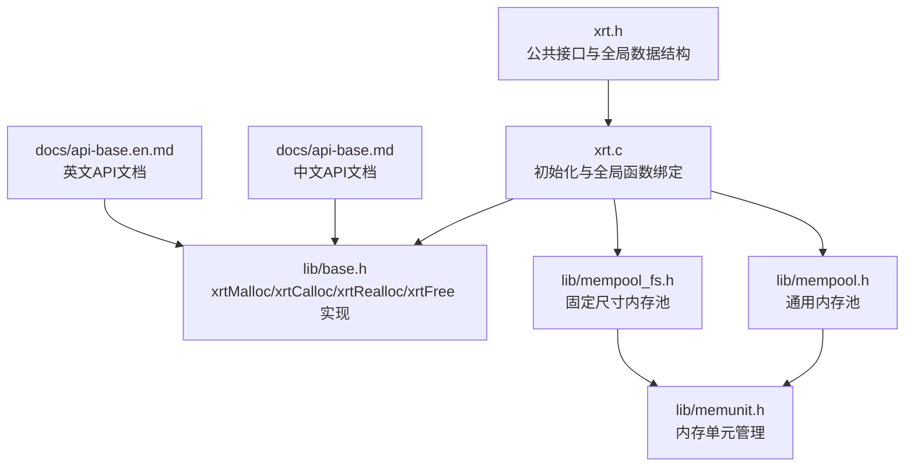
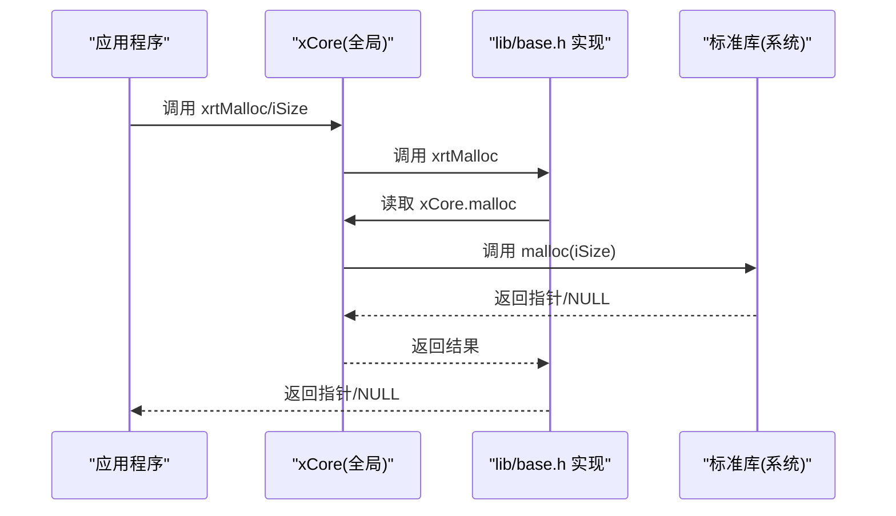
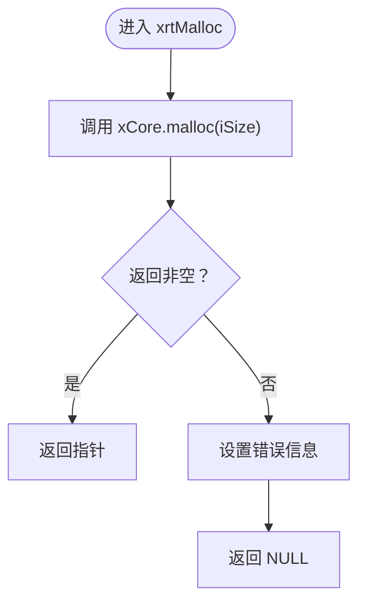
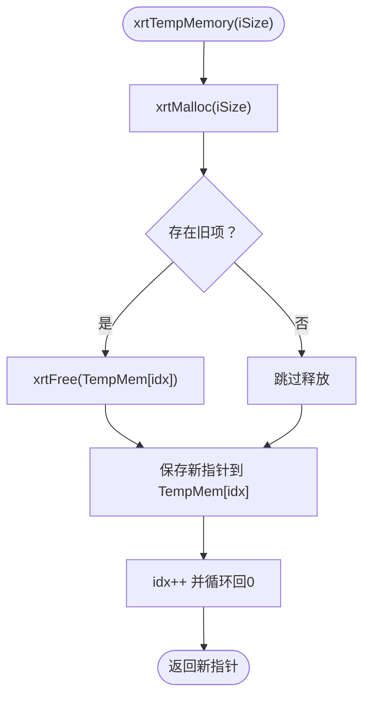
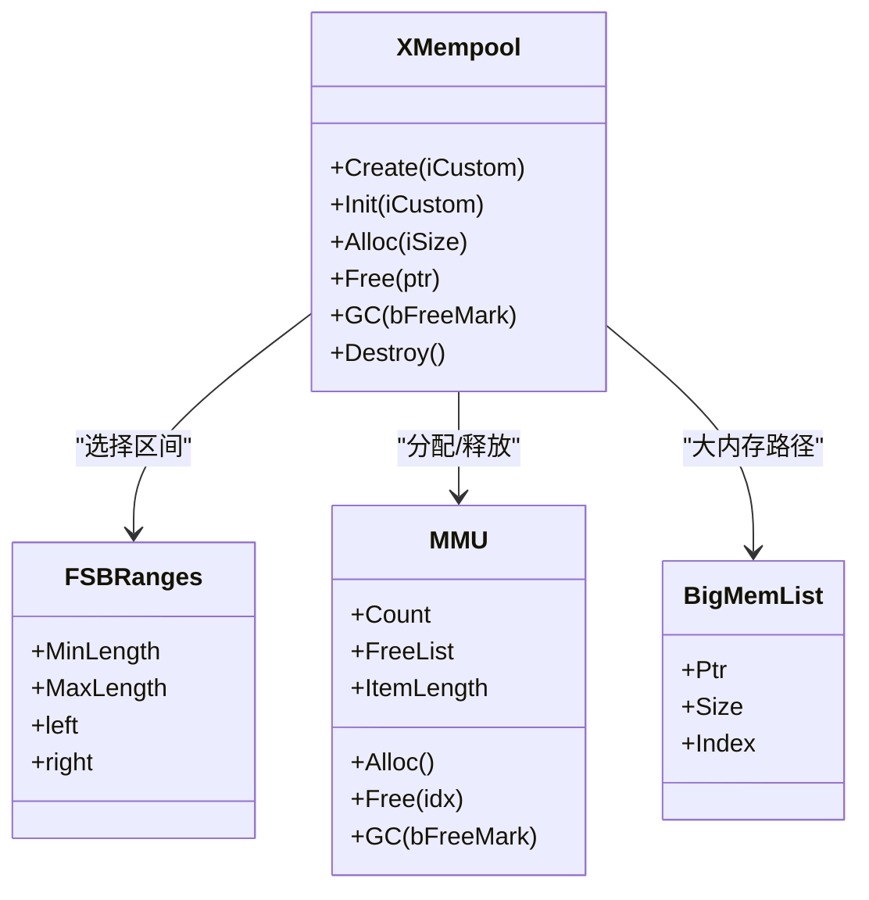
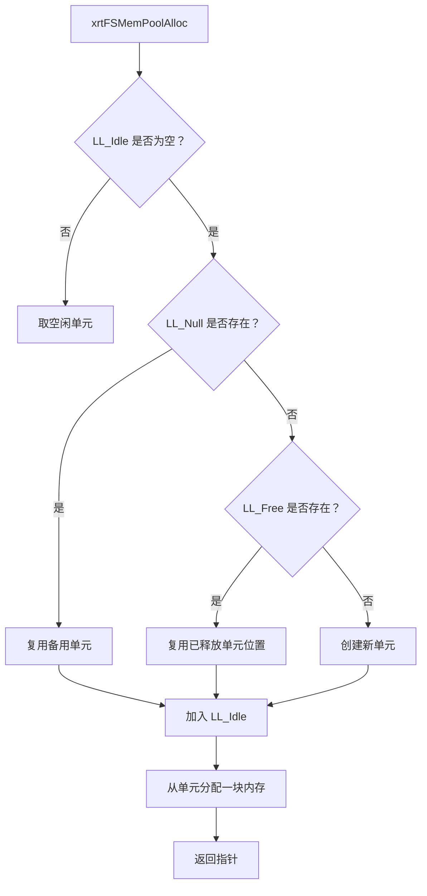
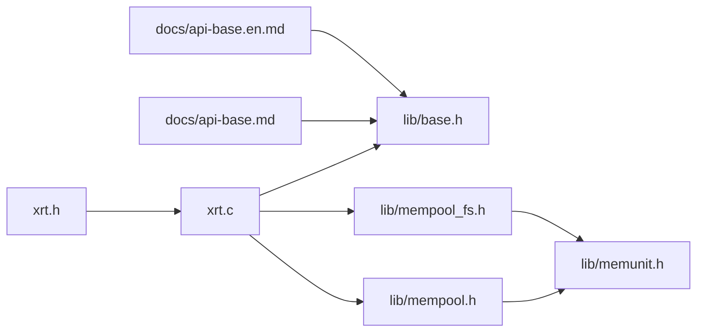

# 内存管理API

<cite>
**本文档引用的文件**
- [xrt.h](file://xrt.h)
- [xrt.c](file://xrt.c)
- [lib/base.h](file://lib/base.h)
- [lib/mempool.h](file://lib/mempool.h)
- [lib/mempool_fs.h](file://lib/mempool_fs.h)
- [lib/memunit.h](file://lib/memunit.h)
- [docs/api-base.md](file://docs/api-base.md)
- [docs/api-base.en.md](file://docs/api-base.en.md)
</cite>

## 目录
1. [简介](#简介)
2. [项目结构](#项目结构)
3. [核心组件](#核心组件)
4. [架构概览](#架构概览)
5. [详细组件分析](#详细组件分析)
6. [依赖关系分析](#依赖关系分析)
7. [性能考量](#性能考量)
8. [故障排查指南](#故障排查指南)
9. [结论](#结论)
10. [附录](#附录)

## 简介
本文件系统性梳理XRT库中的内存管理API，重点围绕以下核心函数展开：
- xrtMalloc：基础内存分配
- xrtCalloc：类内存（零填充）分配
- xrtRealloc：内存重新分配
- xrtFree：内存释放
- xrtTempMemory / xrtFreeTempMemory：临时内存管理
- 内存池API：xrtMemPoolCreate / xrtMemPoolAlloc / xrtMemPoolFree / xrtMemPoolGC
- 固定尺寸内存池API：xrtFSMemPoolCreate / xrtFSMemPoolAlloc / xrtFSMemPoolFree / xrtFSMemPoolGC

文档涵盖使用方法、参数说明、返回值处理、最佳实践、内存分配策略、性能考虑、错误处理与内存泄漏防护，并提供完整示例路径与安全编程实践指导。

## 项目结构
XRT内存管理API由公共头文件声明、基础实现与多个子模块组成：
- 公共接口与全局数据结构：xrt.h
- 初始化与全局函数绑定：xrt.c
- 基础内存分配实现：lib/base.h
- 通用内存池：lib/mempool.h
- 固定尺寸内存池：lib/mempool_fs.h
- 内存单元管理（内部使用）：lib/memunit.h
- 文档示例：docs/api-base.md / docs/api-base.en.md

**图表来源**
- [xrt.h](file://xrt.h#L160-L185)
- [xrt.c](file://xrt.c#L88-L186)
- [lib/base.h](file://lib/base.h#L4-L84)
- [lib/mempool.h](file://lib/mempool.h#L4-L145)
- [lib/mempool_fs.h](file://lib/mempool_fs.h#L4-L49)
- [lib/memunit.h](file://lib/memunit.h#L4-L19)

**章节来源**
- [xrt.h](file://xrt.h#L160-L185)
- [xrt.c](file://xrt.c#L88-L186)

## 核心组件
本节聚焦四大基础内存API及其行为特征与使用要点。

- xrtMalloc(size_t iSize)
  - 作用：向系统申请iSize字节内存
  - 返回：成功返回非空指针；失败设置错误并返回NULL
  - 释放：必须使用xrtFree释放
  - 特性：失败时记录错误信息，便于上层诊断

- xrtCalloc(size_t iNum, size_t iSize)
  - 作用：申请iNum*iSize字节内存，并将内存清零
  - 返回：成功返回非空指针；失败设置错误并返回NULL
  - 释放：必须使用xrtFree释放
  - 特性：适合数组或结构体初始化场景

- xrtRealloc(ptr pMem, size_t iSize)
  - 作用：调整已分配内存大小
  - 行为：
    - pMem为NULL且iSize>0：等价于xrtMalloc(iSize)
    - iSize==0：等价于xrtFree(pMem)
    - 成功返回新指针（可能不同于原指针），失败返回NULL且原内存保持不变
  - 释放：成功后的新指针仍需xrtFree释放
  - 特性：注意更新指针变量，防止悬挂指针

- xrtFree(ptr pmem)
  - 作用：释放内存
  - 行为：若pmem为NULL或等于全局空指针，则不做任何操作
  - 特性：可安全地对NULL调用；仅释放xrtMalloc/xrtCalloc/xrtRealloc分配的内存

- 临时内存管理
  - xrtTempMemory(size_t iSize)：短期使用，自动轮转释放
  - xrtFreeTempMemory()：一次性释放所有临时内存
  - 特性：线程不安全，适合短生命周期上下文

**章节来源**
- [lib/base.h](file://lib/base.h#L4-L84)
- [xrt.h](file://xrt.h#L211-L227)

## 架构概览
XRT内存管理采用“全局函数指针”机制，初始化时将xCore.malloc/calloc/realloc/free绑定到标准库函数。这使得：
- 上层API统一通过xCore.malloc等调用
- 便于未来替换为自定义分配器（例如自定义内存池）
- 保证跨平台一致性

**图表来源**
- [xrt.c](file://xrt.c#L104-L108)
- [lib/base.h](file://lib/base.h#L5-L13)

**章节来源**
- [xrt.c](file://xrt.c#L104-L108)
- [lib/base.h](file://lib/base.h#L5-L13)

## 详细组件分析

### 基础内存API实现与行为
- xrtMalloc
  - 失败时设置错误信息，便于后续诊断
  - 返回值必须使用xrtFree释放
- xrtCalloc
  - 保证内存清零，适合数组/结构体初始化
- xrtRealloc
  - 支持扩展/收缩；失败不改变原指针
  - 安全模式：先尝试realloc，成功再更新指针
- xrtFree
  - 对NULL安全；仅释放xrt系列分配的内存

**图表来源**
- [lib/base.h](file://lib/base.h#L5-L13)

**章节来源**
- [lib/base.h](file://lib/base.h#L4-L45)

### 临时内存管理
- xrtTempMemory：环形缓存短期内存，超过容量后自动释放最旧项
- xrtFreeTempMemory：清空所有临时内存
- 注意：线程不安全，适合单线程或局部上下文

**图表来源**
- [lib/base.h](file://lib/base.h#L49-L84)

**章节来源**
- [lib/base.h](file://lib/base.h#L49-L84)

### 通用内存池（可变尺寸）
- 创建与销毁：xrtMemPoolCreate / xrtMemPoolDestroy
- 初始化：xrtMemPoolInit（内置默认区间树，支持小/大内存两种策略）
- 分配：xrtMemPoolAlloc（优先FSB区间树+内存单元，超出范围走大内存链表）
- 释放：xrtMemPoolFree（区分大内存与FSB内存单元）
- GC：xrtMemPoolGC（按标记回收）

**图表来源**
- [lib/mempool.h](file://lib/mempool.h#L4-L145)
- [lib/mempool.h](file://lib/mempool.h#L147-L385)
- [lib/mempool.h](file://lib/mempool.h#L387-L465)

**章节来源**
- [lib/mempool.h](file://lib/mempool.h#L4-L145)
- [lib/mempool.h](file://lib/mempool.h#L147-L385)
- [lib/mempool.h](file://lib/mempool.h#L387-L465)

### 固定尺寸内存池（固定尺寸）
- 创建与销毁：xrtFSMemPoolCreate / xrtFSMemPoolDestroy
- 初始化：xrtFSMemPoolInit（设置ItemLength，初始化链表）
- 分配：xrtFSMemPoolAlloc（优先空闲单元，否则复用或新建）
- 释放：xrtFSMemPoolFree（回收到空闲列表或备用单元）
- GC：xrtFSMemPoolGC（遍历空闲/满载单元进行标记回收）

**图表来源**
- [lib/mempool_fs.h](file://lib/mempool_fs.h#L51-L125)

**章节来源**
- [lib/mempool_fs.h](file://lib/mempool_fs.h#L4-L49)
- [lib/mempool_fs.h](file://lib/mempool_fs.h#L51-L125)
- [lib/mempool_fs.h](file://lib/mempool_fs.h#L127-L221)
- [lib/mempool_fs.h](file://lib/mempool_fs.h#L223-L254)

### 内存单元管理（内部）
- xrtMemUnitCreate：创建内存单元，内部预留头部信息
- xrtMemUnitAlloc：从单元分配元素，支持复用已释放槽位
- xrtMemUnitFree / xrtMemUnitFreeIdx：释放指定索引或指针
- xrtMemUnitGC：按标记回收未使用元素

**章节来源**
- [lib/memunit.h](file://lib/memunit.h#L4-L19)
- [lib/memunit.h](file://lib/memunit.h#L21-L86)
- [lib/memunit.h](file://lib/memunit.h#L88-L140)

## 依赖关系分析
- 公共接口依赖：xrt.h声明全局函数指针与API
- 实现依赖：lib/base.h实现基础API；xrt.c在初始化时绑定标准库函数
- 内存池依赖：lib/mempool.h与lib/mempool_fs.h依赖lib/memunit.h进行单元管理
- 文档示例：docs/api-base.md / docs/api-base.en.md提供使用示例与最佳实践

**图表来源**
- [xrt.h](file://xrt.h#L160-L185)
- [xrt.c](file://xrt.c#L88-L186)
- [lib/base.h](file://lib/base.h#L4-L84)
- [lib/mempool.h](file://lib/mempool.h#L4-L145)
- [lib/mempool_fs.h](file://lib/mempool_fs.h#L4-L49)
- [lib/memunit.h](file://lib/memunit.h#L4-L19)
- [docs/api-base.md](file://docs/api-base.md#L889-L1009)
- [docs/api-base.en.md](file://docs/api-base.en.md#L889-L1009)

**章节来源**
- [xrt.h](file://xrt.h#L160-L185)
- [xrt.c](file://xrt.c#L88-L186)
- [lib/base.h](file://lib/base.h#L4-L84)
- [lib/mempool.h](file://lib/mempool.h#L4-L145)
- [lib/mempool_fs.h](file://lib/mempool_fs.h#L4-L49)
- [lib/memunit.h](file://lib/memunit.h#L4-L19)
- [docs/api-base.md](file://docs/api-base.md#L889-L1009)
- [docs/api-base.en.md](file://docs/api-base.en.md#L889-L1009)

## 性能考量
- 基础分配
  - xrtMalloc/xrtCalloc/xrtRealloc依赖系统分配器，性能受平台影响
  - 大量小对象频繁分配建议使用内存池（通用或固定尺寸）
- 通用内存池
  - 内置区间树（FSB）与内存单元（MMU）组合，减少碎片
  - 大内存路径使用独立链表，避免小内存池碎片化
  - GC按标记回收，降低内存占用峰值
- 固定尺寸内存池
  - 专为相同大小对象设计，分配/释放极快
  - 适合大量结构体或固定大小缓冲区
- 临时内存
  - 环形缓存减少频繁分配/释放成本
  - 适合短生命周期上下文，避免长期持有

[本节为通用性能讨论，不直接分析具体文件]

## 故障排查指南
- 常见问题
  - 未检查返回值导致空指针解引用
  - 释放后未置空，出现悬挂指针
  - 重复释放或释放非xrt分配内存
  - 内存池使用不当（释放到错误池/索引越界）
- 排查步骤
  - 检查xCore.LastError与OnError回调
  - 使用安全模式：realloc失败时保留原指针
  - 统一释放：xrtFreeTempMemory集中清理临时内存
  - 内存池：确认分配/释放路径一致，避免跨池释放
- 错误处理
  - xrtSetError设置错误信息，xrtClearError清除
  - OnError回调可在失败时输出日志

**章节来源**
- [lib/base.h](file://lib/base.h#L88-L129)
- [docs/api-base.md](file://docs/api-base.md#L926-L962)
- [docs/api-base.en.md](file://docs/api-base.en.md#L926-L962)

## 结论
XRT内存管理API提供了统一、安全且可扩展的内存分配与释放机制。基础API满足日常需求，内存池与固定尺寸内存池进一步优化高频分配场景。配合错误处理与临时内存管理，可有效降低内存泄漏风险并提升性能。建议在复杂场景中结合内存池与安全模式使用，确保健壮性与可维护性。

[本节为总结性内容，不直接分析具体文件]

## 附录

### 使用示例（示例路径）
- 基础分配与安全模式
  - 示例路径：docs/api-base.md 中“安全的内存操作”章节
  - 示例路径：docs/api-base.en.md 中“Safe Memory Operations”章节
- 内存管理策略
  - 示例路径：docs/api-base.md 中“内存管理策略”章节
  - 示例路径：docs/api-base.en.md 中“Memory Management Strategy”章节
- 错误处理
  - 示例路径：docs/api-base.md 中“错误处理”章节
  - 示例路径：docs/api-base.en.md 中“Error Handling”章节

**章节来源**
- [docs/api-base.md](file://docs/api-base.md#L889-L1009)
- [docs/api-base.en.md](file://docs/api-base.en.md#L889-L1009)

### 参数与返回值规范
- xrtMalloc(iSize)
  - iSize：请求字节数
  - 返回：成功非空指针；失败NULL
- xrtCalloc(iNum, iSize)
  - iNum/iSize：元素个数与大小
  - 返回：成功非空指针；失败NULL
- xrtRealloc(pMem, iSize)
  - pMem：原内存指针（可为NULL）
  - iSize：新大小（0等价于释放）
  - 返回：成功新指针；失败NULL（原内存不变）
- xrtFree(pmem)
  - pmem：待释放指针（可为NULL）

**章节来源**
- [lib/base.h](file://lib/base.h#L4-L45)
- [docs/api-base.md](file://docs/api-base.md#L363-L440)
- [docs/api-base.en.md](file://docs/api-base.en.md#L354-L440)

### 最佳实践清单
- 始终检查返回值，失败时设置错误并优雅退出
- 使用安全模式：realloc失败时保留原指针，避免悬挂
- 释放后置空，防止二次释放
- 临时内存优先使用xrtTempMemory，结束后调用xrtFreeTempMemory
- 大量小对象使用内存池，固定尺寸对象使用固定尺寸内存池
- 错误处理：注册OnError回调，必要时调用xrtClearError

**章节来源**
- [lib/base.h](file://lib/base.h#L88-L129)
- [docs/api-base.md](file://docs/api-base.md#L926-L1009)
- [docs/api-base.en.md](file://docs/api-base.en.md#L926-L1009)