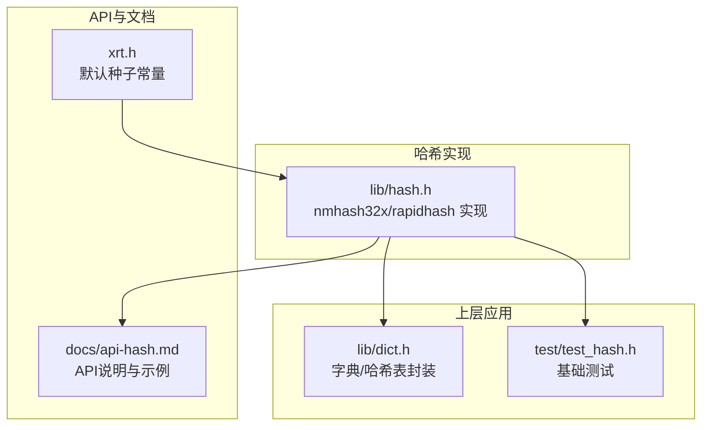
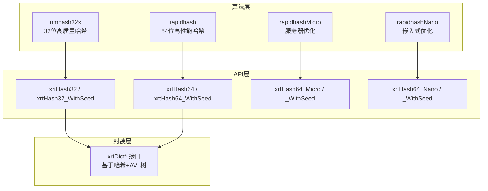
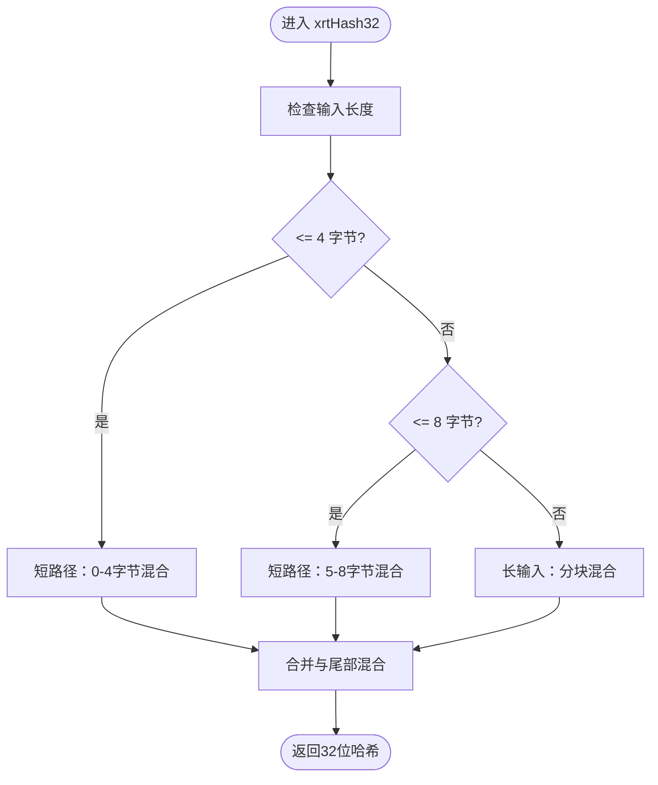
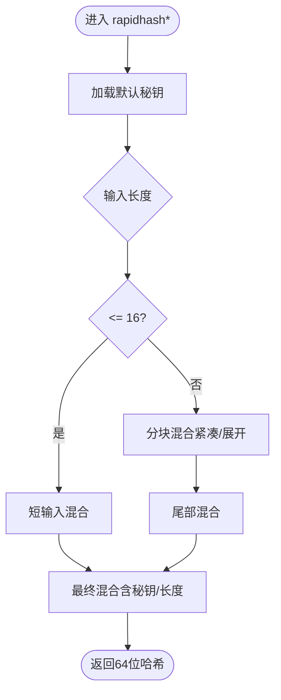
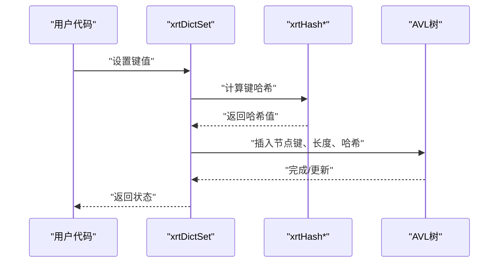
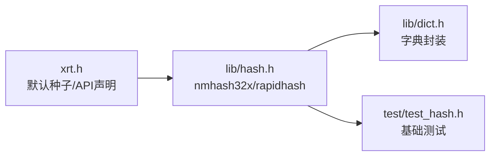

# 哈希算法API

<cite>
**本文引用的文件列表**
- [lib/hash.h](file://lib/hash.h)
- [docs/api-hash.md](file://docs/api-hash.md)
- [xrt.h](file://xrt.h)
- [lib/dict.h](file://lib/dict.h)
- [test/test_hash.h](file://test/test_hash.h)
</cite>

## 目录
1. [简介](#简介)
2. [项目结构](#项目结构)
3. [核心组件](#核心组件)
4. [架构总览](#架构总览)
5. [详细组件分析](#详细组件分析)
6. [依赖关系分析](#依赖关系分析)
7. [性能考量](#性能考量)
8. [故障排查指南](#故障排查指南)
9. [结论](#结论)
10. [附录](#附录)

## 简介
本文件系统性梳理仓库中的哈希算法API，覆盖32位与64位哈希函数、多种变体（标准、Micro、Nano）、种子机制、在字典/哈希表中的应用、性能对比与最佳实践。文档同时给出选择原则、冲突处理思路、负载因子管理建议以及常见问题排查方法，帮助开发者在不同场景下正确、高效地使用哈希能力。

## 项目结构
- 哈希算法实现位于 lib/hash.h，包含 nmhash32x（32位）与 rapidhash（64位）两大族系，支持SIMD加速与多变体。
- 文档位于 docs/api-hash.md，提供API说明、使用场景、性能对比与最佳实践。
- 常量定义（默认种子）位于 xrt.h。
- 字典/哈希表封装位于 lib/dict.h，演示了如何在实际数据结构中使用哈希。
- 测试位于 test/test_hash.h，验证基本功能。

图表来源
- [lib/hash.h](file://lib/hash.h#L594-L602)
- [docs/api-hash.md](file://docs/api-hash.md#L1-L643)
- [xrt.h](file://xrt.h#L938-L962)
- [lib/dict.h](file://lib/dict.h#L1-L204)
- [test/test_hash.h](file://test/test_hash.h#L1-L26)

章节来源
- [lib/hash.h](file://lib/hash.h#L594-L602)
- [docs/api-hash.md](file://docs/api-hash.md#L1-L643)
- [xrt.h](file://xrt.h#L938-L962)
- [lib/dict.h](file://lib/dict.h#L1-L204)
- [test/test_hash.h](file://test/test_hash.h#L1-L26)

## 核心组件
- 32位哈希：xrtHash32 与 xrtHash32_WithSeed，底层基于 nmhash32x，支持SIMD向量化与端序处理。
- 64位哈希：xrtHash64、xrtHash64_WithSeed；以及变体 xrtHash64_Micro/_Nano 及其带种子版本，分别针对HPC/服务器与嵌入式/移动端优化。
- 默认种子：HASH32_SEED（0）、HASH64_SEED（固定常量），用于稳定哈希与安全哈希两种场景。
- 字典/哈希表：lib/dict.h 展示了如何在字典中使用哈希进行键查找与比较。

章节来源
- [lib/hash.h](file://lib/hash.h#L594-L602)
- [lib/hash.h](file://lib/hash.h#L1205-L1231)
- [docs/api-hash.md](file://docs/api-hash.md#L45-L160)
- [xrt.h](file://xrt.h#L938-L962)
- [lib/dict.h](file://lib/dict.h#L1-L204)

## 架构总览
哈希API采用“算法实现 + 上层封装 + 应用集成”的分层设计：
- 算法层：nmhash32x（32位）与 rapidhash（64位）及其变体，内置SIMD与平台优化。
- API层：对外暴露统一的哈希函数接口，支持默认与自定义种子。
- 封装层：lib/dict.h 将哈希与AVL树结合，形成字典结构，体现哈希在实际数据结构中的应用。
- 文档与测试：docs/api-hash.md 提供使用指南与示例，test/test_hash.h 进行基础验证。

图表来源
- [lib/hash.h](file://lib/hash.h#L594-L602)
- [lib/hash.h](file://lib/hash.h#L1205-L1231)
- [lib/dict.h](file://lib/dict.h#L1-L204)

## 详细组件分析

### 32位哈希：nmhash32x
- 特点
  - 高质量32位哈希，支持SIMD加速（SSE2/AVX2/AVX512）。
  - 内置端序处理与向量化混合器，按输入长度选择路径（短输入直通、长输入分块）。
  - 提供种子机制，便于抗碰撞攻击与多实例隔离。
- 关键实现要点
  - 端序检测与读取：根据平台端序选择字节序转换或直接读取。
  - 向量化路径：根据编译器特性选择SSE2/AVX2/AVX512路径，提升吞吐。
  - 混合器：多轮乘加与位移混合，确保输出质量。
  - 短输入优化：0-4字节与5-8字节路径，避免不必要的分块。
  - 长输入路径：分块混合后合并，最终进行尾部混合与长度附加。
- API
  - xrtHash32(key, len)：使用默认种子。
  - xrtHash32_WithSeed(key, len, seed)：自定义种子。

图表来源
- [lib/hash.h](file://lib/hash.h#L544-L582)

章节来源
- [lib/hash.h](file://lib/hash.h#L196-L398)
- [lib/hash.h](file://lib/hash.h#L544-L582)
- [docs/api-hash.md](file://docs/api-hash.md#L62-L160)

### 64位哈希：rapidhash 及变体
- 特点
  - 基于 wyhash 优化，提供标准、Micro、Nano三种变体。
  - 标准版适合通用与大数据；Micro适合HPC/服务器（16-512B更快）；Nano适合嵌入式/移动端（<48B更快）。
  - 支持快速乘法与保护模式，兼顾速度与熵保持。
- 关键实现要点
  - 秘钥数组 rapid_secret：用于可预测地改变结果。
  - 读取函数：根据端序选择原生或字节序转换读取。
  - 主流程：按输入长度选择路径，短输入直接混合，长输入分块混合，最后混合秘钥与长度。
  - 变体差异：Micro/Nano减少循环展开与分块数量，牺牲大输入性能换取小输入性能。
- API
  - xrtHash64 / xrtHash64_WithSeed
  - xrtHash64_Micro / _WithSeed
  - xrtHash64_Nano / _WithSeed

图表来源
- [lib/hash.h](file://lib/hash.h#L868-L977)
- [lib/hash.h](file://lib/hash.h#L989-L1047)
- [lib/hash.h](file://lib/hash.h#L1059-L1106)

章节来源
- [lib/hash.h](file://lib/hash.h#L658-L763)
- [lib/hash.h](file://lib/hash.h#L838-L977)
- [lib/hash.h](file://lib/hash.h#L989-L1106)
- [docs/api-hash.md](file://docs/api-hash.md#L163-L347)

### 种子机制与安全考虑
- 默认种子
  - HASH32_SEED = 0；HASH64_SEED = 固定常量。
- 使用场景
  - 稳定哈希：序列化/缓存需要跨进程/跨机器一致的结果。
  - 安全哈希：对抗Hash-DoS，使用随机种子，服务启动时初始化。
- 最佳实践
  - 避免重复计算：缓存已计算的哈希值，减少CPU开销。
  - 多哈希：布隆过滤器等场景使用多个不同种子的哈希。

章节来源
- [docs/api-hash.md](file://docs/api-hash.md#L45-L160)
- [docs/api-hash.md](file://docs/api-hash.md#L540-L626)
- [xrt.h](file://xrt.h#L938-L962)

### 在字典/哈希表中的应用
- 字典封装
  - lib/dict.h 将哈希与AVL树结合，使用哈希值进行快速定位，再用键值比较解决冲突。
  - 平台相关：x86/x64使用64位哈希，i386使用32位哈希，保证性能与兼容性。
- 常见操作
  - 设置/获取/删除/存在性判断/遍历等，均依赖哈希键与比较过程。

图表来源
- [lib/dict.h](file://lib/dict.h#L70-L103)
- [lib/dict.h](file://lib/dict.h#L105-L133)

章节来源
- [lib/dict.h](file://lib/dict.h#L1-L204)

### 自定义哈希函数与冲突处理
- 自定义哈希
  - 通过 xrtHash32_WithSeed 或 xrtHash64_WithSeed 指定种子，实现多实例隔离或抗碰撞。
- 冲突处理
  - 字典层采用键值比较（memcmp/长度比较）解决哈希冲突，确保唯一性。
- 负载因子管理
  - 本仓库未提供动态扩容/缩容策略；如需管理负载因子，可在上层封装中加入阈值触发重建（建议做法）。

章节来源
- [lib/dict.h](file://lib/dict.h#L11-L25)
- [docs/api-hash.md](file://docs/api-hash.md#L540-L626)

## 依赖关系分析
- 头文件依赖
  - lib/hash.h 依赖平台内建/编译器内联函数与SIMD头文件，以实现端序与向量化。
  - xrt.h 提供默认种子常量与API声明。
  - lib/dict.h 依赖哈希API与AVL树实现。
- 外部依赖
  - 无外部第三方库依赖，纯C实现，跨平台兼容性良好。

图表来源
- [xrt.h](file://xrt.h#L938-L962)
- [lib/hash.h](file://lib/hash.h#L594-L602)
- [lib/dict.h](file://lib/dict.h#L1-L204)
- [test/test_hash.h](file://test/test_hash.h#L1-L26)

章节来源
- [xrt.h](file://xrt.h#L938-L962)
- [lib/hash.h](file://lib/hash.h#L594-L602)
- [lib/dict.h](file://lib/dict.h#L1-L204)
- [test/test_hash.h](file://test/test_hash.h#L1-L26)

## 性能考量
- 选择原则
  - 小数据（<48B）：优先 Nano；48B-512B：Micro；>512B：标准版。
  - 大数据（>1KB）：标准版更均衡。
- 性能对比（来自文档）
  - 标准版：通用、大数据量质量高。
  - Micro：HPC/服务器场景更快（16-512B）。
  - Nano：嵌入式/移动端更快（<48B）。
- 优化建议
  - 使用默认种子进行稳定哈希，避免频繁切换。
  - 抗碰撞攻击时使用随机种子，服务启动时初始化。
  - 缓存已计算哈希值，避免重复计算。

章节来源
- [docs/api-hash.md](file://docs/api-hash.md#L498-L536)
- [docs/api-hash.md](file://docs/api-hash.md#L540-L626)

## 故障排查指南
- 常见问题
  - 结果不一致：确认是否使用了相同的种子与输入长度。
  - 性能异常：检查输入大小与变体选择是否合理。
  - 内存问题：确保输入指针有效且长度正确。
- 建议步骤
  - 使用 test/test_hash.h 进行回归验证。
  - 在安全场景下初始化随机种子，避免固定种子导致的碰撞风险。
  - 对热点键缓存哈希值，减少重复计算。

章节来源
- [test/test_hash.h](file://test/test_hash.h#L1-L26)
- [docs/api-hash.md](file://docs/api-hash.md#L563-L591)

## 结论
该哈希API提供了高质量、高性能的32位与64位哈希实现，支持多种变体与种子机制，满足从嵌入式到HPC的广泛需求。配合字典封装，可直接构建高效的键值存储与查询系统。建议在实际工程中遵循“稳定哈希用默认种子、安全场景用随机种子、热点键缓存哈希”的最佳实践，并根据输入规模选择合适的变体以获得最优性能。

## 附录
- 使用示例与场景
  - 哈希表键查找、文件完整性校验、布隆过滤器、缓存键生成等，详见文档示例。
- 相关模块
  - 字典：api-dict.md
  - 动态类型：api-value.md

章节来源
- [docs/api-hash.md](file://docs/api-hash.md#L350-L494)