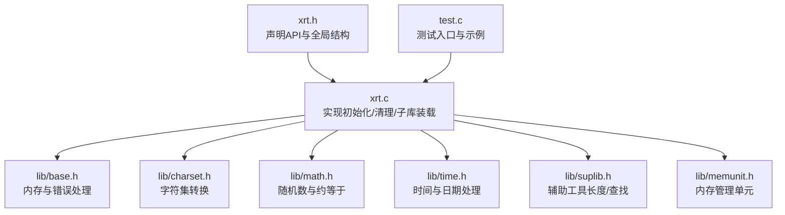
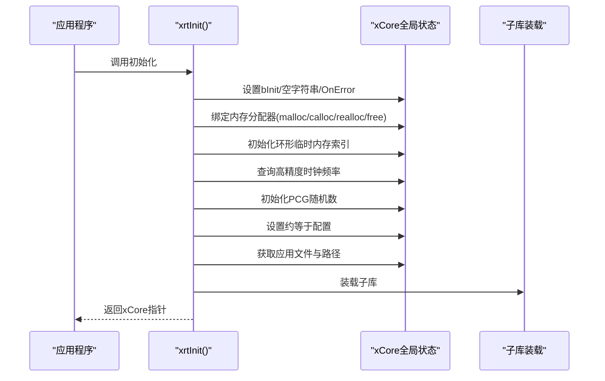
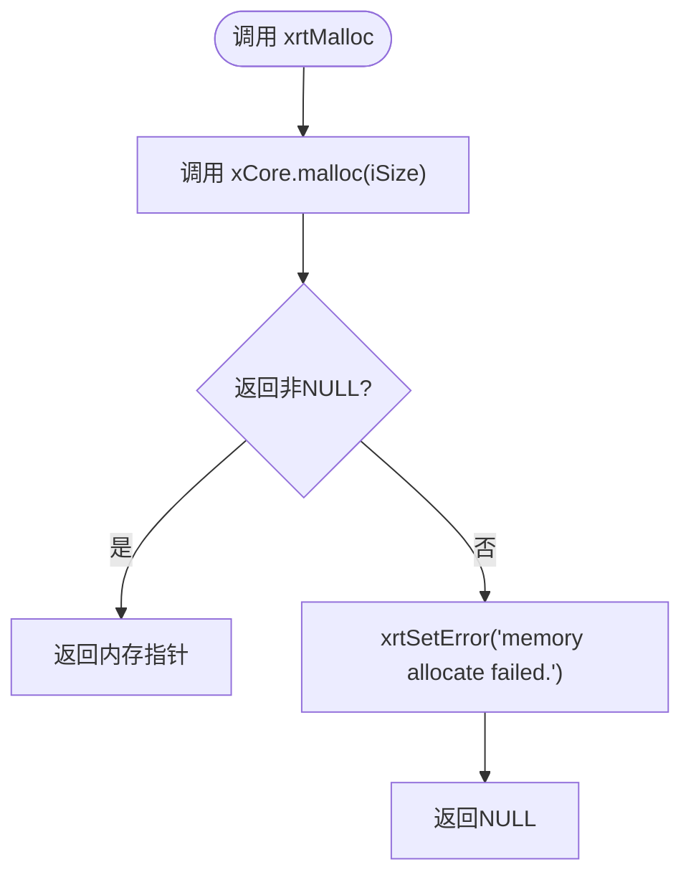
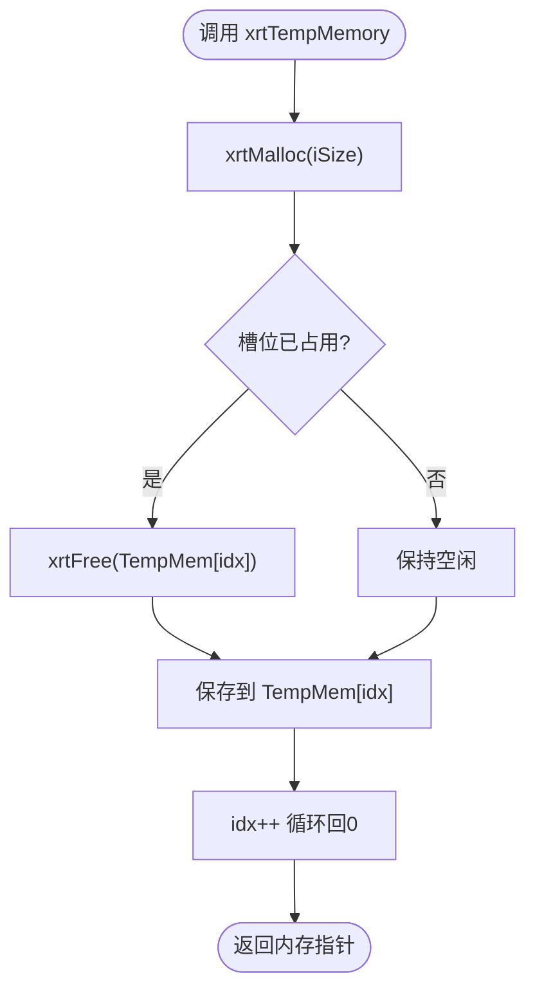
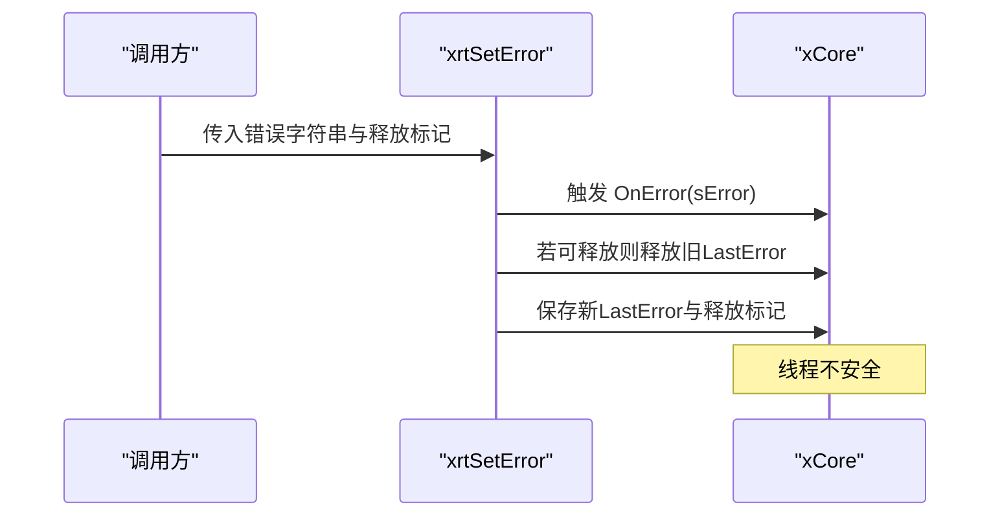
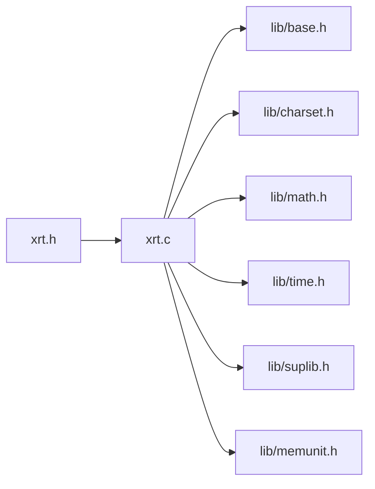

# 基础模块API

<cite>
**本文档引用的文件**
- [xrt.h](file://xrt.h)
- [xrt.c](file://xrt.c)
- [lib/base.h](file://lib/base.h)
- [lib/charset.h](file://lib/charset.h)
- [lib/math.h](file://lib/math.h)
- [lib/time.h](file://lib/time.h)
- [lib/suplib.h](file://lib/suplib.h)
- [lib/memunit.h](file://lib/memunit.h)
- [test.c](file://test.c)
</cite>

## 目录
1. [简介](#简介)
2. [项目结构](#项目结构)
3. [核心组件](#核心组件)
4. [架构总览](#架构总览)
5. [详细组件分析](#详细组件分析)
6. [依赖关系分析](#依赖关系分析)
7. [性能考虑](#性能考虑)
8. [故障排查指南](#故障排查指南)
9. [结论](#结论)
10. [附录](#附录)

## 简介
本文件面向XRT基础模块API，系统性梳理内存管理、临时内存、错误处理、字符集转换、数学运算、哈希算法、时间处理等核心能力。文档严格依据仓库源码进行分析，提供函数签名、参数说明、返回值、使用示例与注意事项，并给出全局数据结构xrtGlobalData的完整说明、库初始化与清理流程、最佳实践与常见错误处理模式。

## 项目结构
XRT采用“头文件声明 + 子库实现”的组织方式：
- 头文件集中声明所有API与全局数据结构
- 子库分别实现具体功能域（base、charset、math、time、hash等）
- 主入口负责初始化全局状态与子库装载

图表来源
- [xrt.h](file://xrt.h#L122-L184)
- [xrt.c](file://xrt.c#L42-L84)
- [lib/base.h](file://lib/base.h#L1-L132)
- [lib/charset.h](file://lib/charset.h#L1-L800)
- [lib/math.h](file://lib/math.h#L1-L175)
- [lib/time.h](file://lib/time.h#L1-L800)
- [lib/suplib.h](file://lib/suplib.h#L1-L55)
- [lib/memunit.h](file://lib/memunit.h#L1-L143)
- [test.c](file://test.c#L54-L179)

章节来源
- [xrt.h](file://xrt.h#L122-L184)
- [xrt.c](file://xrt.c#L42-L84)

## 核心组件
- 全局数据结构xrtGlobalData：封装初始化状态、错误信息、临时内存、内存分配器、随机数状态、约等于配置、应用路径等
- 基础API族：内存管理（xrtMalloc、xrtCalloc、xrtRealloc、xrtFree）、临时内存（xrtTempMemory、xrtFreeTempMemory）、错误处理（xrtSetError、xrtSetErrorU16、xrtSetErrorU32、xrtClearError）
- 字符集转换：UTF-8/16/32互转、字节序转换、任意编码转换、编码检测
- 数学运算：PCG随机数、整数/浮点/字符串约等于
- 时间处理：高精度计时、延时、日期/时间构建与解析、格式化/解析、时区转换、区间判断
- 辅助工具：内存查找、UTF-16/32长度计算
- 内存管理单元：固定容量内存块管理与GC

章节来源
- [xrt.h](file://xrt.h#L122-L184)
- [lib/base.h](file://lib/base.h#L1-L132)
- [lib/charset.h](file://lib/charset.h#L1-L800)
- [lib/math.h](file://lib/math.h#L1-L175)
- [lib/time.h](file://lib/time.h#L1-L800)
- [lib/suplib.h](file://lib/suplib.h#L1-L55)
- [lib/memunit.h](file://lib/memunit.h#L1-L143)

## 架构总览
基础模块围绕xCore全局状态展开，初始化时设置内存分配器、随机数种子、时钟频率、应用路径、本地IP、模板引擎等；清理时释放错误信息、临时内存、应用路径并执行平台清理。

图表来源
- [xrt.c](file://xrt.c#L87-L186)

章节来源
- [xrt.c](file://xrt.c#L87-L186)

## 详细组件分析

### 全局数据结构 xrtGlobalData
- 字段概览
  - 初始化标记、空字符串、错误回调与错误信息、高精度时钟频率、本机IP、应用文件与路径、环形临时内存数组与索引、内存分配器函数指针、PCG随机数状态、约等于配置（整数/浮点/时间/字符串）
- 线程安全性
  - 临时内存与错误信息为线程不安全；随机数提供线程安全版本API
- 生命周期
  - 由xrtInit初始化，xrtUnit在引用计数归零时释放

章节来源
- [xrt.h](file://xrt.h#L122-L184)
- [xrt.c](file://xrt.c#L87-L186)

### 内存管理 API
- xrtMalloc(size_t iSize)
  - 参数：请求字节数
  - 返回：非NULL指针或NULL（失败时设置LastError）
  - 注意：失败时调用xrtSetError
- xrtCalloc(size_t iNum, size_t iSize)
  - 参数：元素个数与大小
  - 返回：非NULL指针或NULL（失败时设置LastError）
- xrtRealloc(ptr pMem, size_t iSize)
  - 参数：旧内存指针与新大小
  - 返回：新内存指针或NULL（失败时设置LastError）
- xrtFree(ptr pmem)
  - 参数：待释放指针（可为NULL或空指针常量）
  - 行为：若非空且非空指针常量则调用free

图表来源
- [lib/base.h](file://lib/base.h#L4-L13)

章节来源
- [lib/base.h](file://lib/base.h#L4-L45)

### 临时内存 API
- xrtTempMemory(size_t iSize)
  - 行为：申请内存并放入环形缓冲槽，若槽位已有内存则先释放；索引循环前进
  - 注意：线程不安全；适合短生命周期临时对象
- xrtFreeTempMemory()
  - 行为：清空环形缓冲槽并重置索引

图表来源
- [lib/base.h](file://lib/base.h#L49-L84)

章节来源
- [lib/base.h](file://lib/base.h#L49-L84)

### 错误处理 API
- xrtSetError(str sError, bool bFree)
  - 行为：触发OnError回调；若之前有可释放错误信息则先释放；保存新错误并标记是否可释放
- xrtSetErrorU16(u16str sError, size_t iSize, bool bFree)
  - 行为：UTF-16转UTF-8后调用xrtSetError
- xrtSetErrorU32(u32str sError, size_t iSize, bool bFree)
  - 行为：UTF-32转UTF-8后调用xrtSetError
- xrtClearError()
  - 行为：若可释放则释放LastError，重置为空指针常量

图表来源
- [lib/base.h](file://lib/base.h#L88-L129)

章节来源
- [lib/base.h](file://lib/base.h#L88-L129)

### 字符集转换 API
- UTF8↔UTF16/UTF32互转、UTF16/UTF32字节序转换、任意编码转换、编码检测、字符宽度查询
- 关键行为
  - 输入为NULL或长度为0时，返回空指针常量或0长度结果
  - 转换后数据需使用xrtFree释放
  - Windows平台支持Win32转换路径，其他平台限制为UTF系列互转
- 使用建议
  - 大量转换场景建议复用临时内存或自管缓冲
  - 对未知编码先用xrtDetectCharset探测

章节来源
- [lib/charset.h](file://lib/charset.h#L18-L710)

### 数学运算 API
- PCG随机数
  - xrtRandSeed、xrtRand32Ex、xrtRand64Ex、xrtRandRangeEx（线程安全）
  - xrtRand32、xrtRand64、xrtRandRange（使用全局状态，线程不安全）
- 约等于
  - xrtIntApprox、xrtNumApprox：基于xCore配置的整数/浮点近似比较
  - 字符串约等于：支持通配符与相似度两种模式

章节来源
- [lib/math.h](file://lib/math.h#L43-L175)
- [xrt.h](file://xrt.h#L306-L340)

### 时间处理 API
- 高精度计时与延时：xrtTimer、xrtSleep
- 日期/时间构建与解析：xrtDateSerial、xrtTimeSerial、xrtDateTimeSerial、xrtDecodeSerial
- 格式化/解析：xrtTimeToStr、xrtTimeFormat、xrtTimeParse、xrtNowStr、xrtDateStr、xrtTimeStr
- 时间运算：xrtDateAdd、xrtDateDiff、季度/周数/当年第几日、区间判断
- 时区：xrtNowUTC、xrtTimezoneOffset、xrtUTCToLocal、xrtLocalToUTC、Unix时间戳互转

章节来源
- [lib/time.h](file://lib/time.h#L4-L800)
- [xrt.h](file://xrt.h#L456-L646)

### 辅助工具 API
- 内存查找：memmem（Windows）
- 字符串长度：u16len、u32len

章节来源
- [lib/suplib.h](file://lib/suplib.h#L4-L55)

### 内存管理单元 API
- xrtMemUnitCreate：创建固定容量内存单元（内部自动扩展4字节用于标识）
- xrtMemUnitAlloc：分配元素（优先复用已释放槽位）
- xrtMemUnitFree/FreeIdx：释放元素并加入空闲列表
- xrtMemUnitGC：进行一轮GC回收（按标记策略回收）

章节来源
- [lib/memunit.h](file://lib/memunit.h#L4-L143)

## 依赖关系分析
- 头文件与实现
  - xrt.h声明全局结构与API；xrt.c实现初始化/清理/子库装载
  - 子库各自实现对应功能域API
- 耦合与内聚
  - 基础API直接依赖xCore；字符集/时间/数学等子库内部相互独立
  - 错误处理统一走xCore.OnError与LastError
- 外部依赖
  - Windows平台：WinSock、IPHLPAPI、ShellAPI等
  - 其他平台：POSIX线程/网络/IO接口

图表来源
- [xrt.h](file://xrt.h#L122-L184)
- [xrt.c](file://xrt.c#L42-L84)

章节来源
- [xrt.h](file://xrt.h#L122-L184)
- [xrt.c](file://xrt.c#L42-L84)

## 性能考虑
- 内存管理
  - xrtMalloc/Calloc/Realloc直连系统分配器，避免额外封装开销
  - 临时内存采用环形槽位，减少频繁分配/释放的抖动
- 随机数
  - 提供Ex版本线程安全API，普通版本使用全局状态以获得更高性能
- 时间处理
  - Windows下优先使用QueryPerformanceCounter，否则回退到clock_gettime
- 字符集转换
  - 内置UTF8/16/32互转与字节序转换，避免跨平台转换库依赖

## 故障排查指南
- 内存分配失败
  - 现象：xrtMalloc/Calloc/Realloc返回NULL
  - 处理：调用xrtSetError查看LastError；检查系统可用内存
- 错误信息未释放
  - 现象：LastError持续累积
  - 处理：确保调用xrtClearError或使用带bFree的错误设置API
- 临时内存泄漏
  - 现象：长时间运行后内存增长
  - 处理：在合适时机调用xrtFreeTempMemory；避免长期持有临时内存
- 字符集转换异常
  - 现象：返回空指针或乱码
  - 处理：确认输入编码；使用xrtDetectCharset探测；Windows平台可尝试Win32转换路径
- 时间解析错误
  - 现象：xrtStrToTime返回0或异常
  - 处理：检查输入格式是否符合支持格式；必要时使用xrtTimeParse

章节来源
- [lib/base.h](file://lib/base.h#L88-L129)
- [lib/charset.h](file://lib/charset.h#L488-L710)
- [lib/time.h](file://lib/time.h#L530-L560)

## 结论
XRT基础模块以xCore为核心，提供统一的内存、错误、字符集、数学、时间等基础能力。其设计强调简洁与高性能，同时通过全局配置与回调机制保证易用性与可扩展性。遵循本文档的最佳实践与注意事项，可在多平台环境下稳定地使用这些API。

## 附录

### 初始化与清理流程
- 初始化
  - 设置bInit、绑定内存分配器、初始化临时内存、查询高精度时钟、初始化随机数、设置约等于配置、获取应用路径与本地IP、装载子库
- 清理
  - 引用计数减一，归零时释放LastError、临时内存、应用路径，执行平台清理

章节来源
- [xrt.c](file://xrt.c#L87-L226)

### 使用示例与注意事项（路径引用）
- 初始化与错误回调注册
  - 示例路径：[test.c](file://test.c#L62-L66)
- 基础API使用（内存/错误）
  - 示例路径：[lib/base.h](file://lib/base.h#L4-L129)
- 字符集转换
  - 示例路径：[lib/charset.h](file://lib/charset.h#L18-L710)
- 数学运算（随机数/约等于）
  - 示例路径：[lib/math.h](file://lib/math.h#L43-L175)
- 时间处理
  - 示例路径：[lib/time.h](file://lib/time.h#L4-L800)
- 临时内存
  - 示例路径：[lib/base.h](file://lib/base.h#L49-L84)
- 内存管理单元
  - 示例路径：[lib/memunit.h](file://lib/memunit.h#L4-L143)