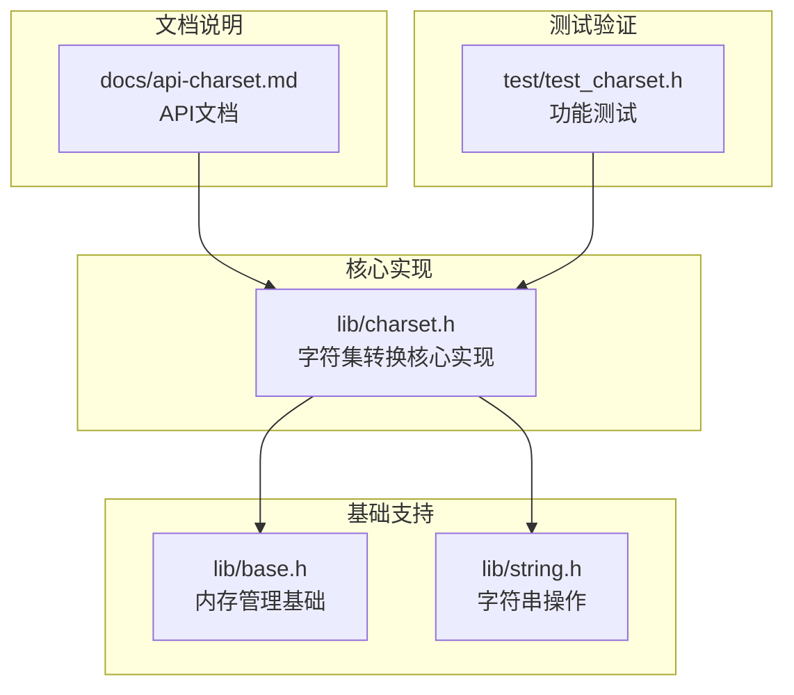
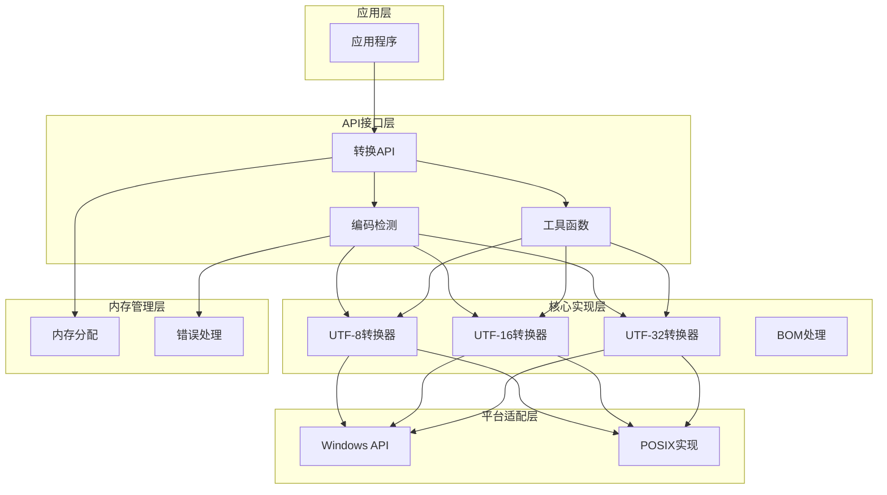
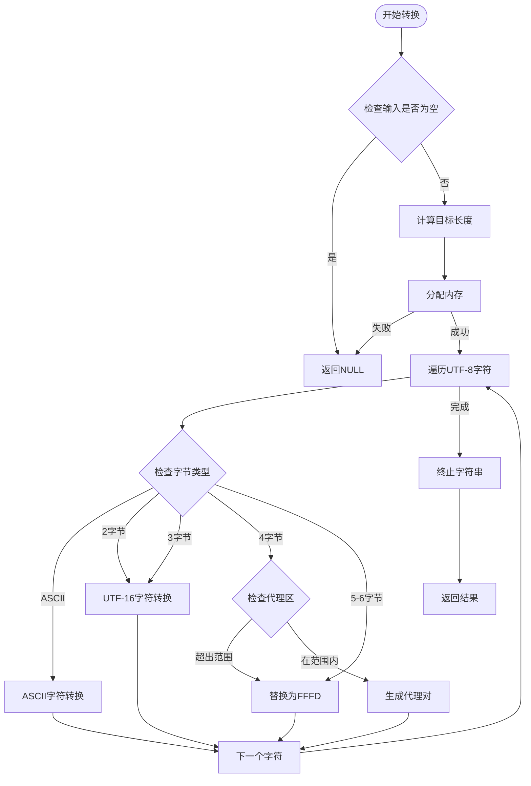
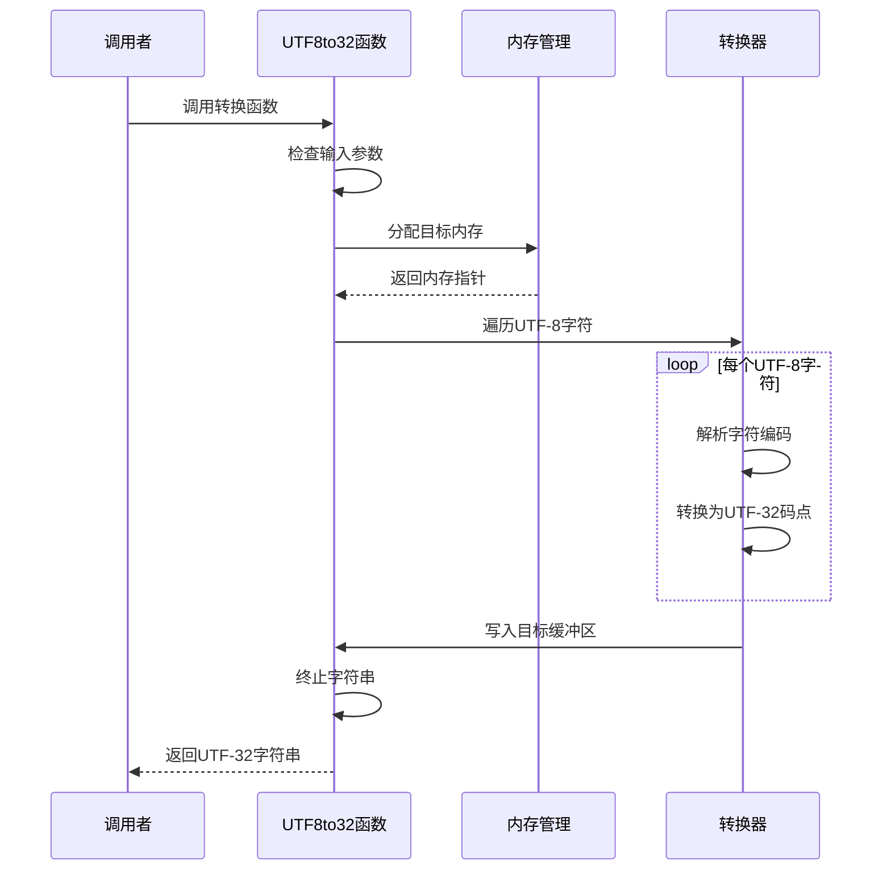
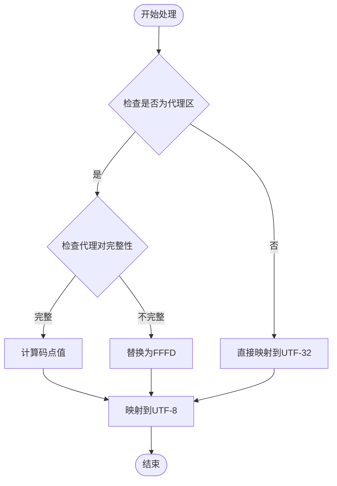
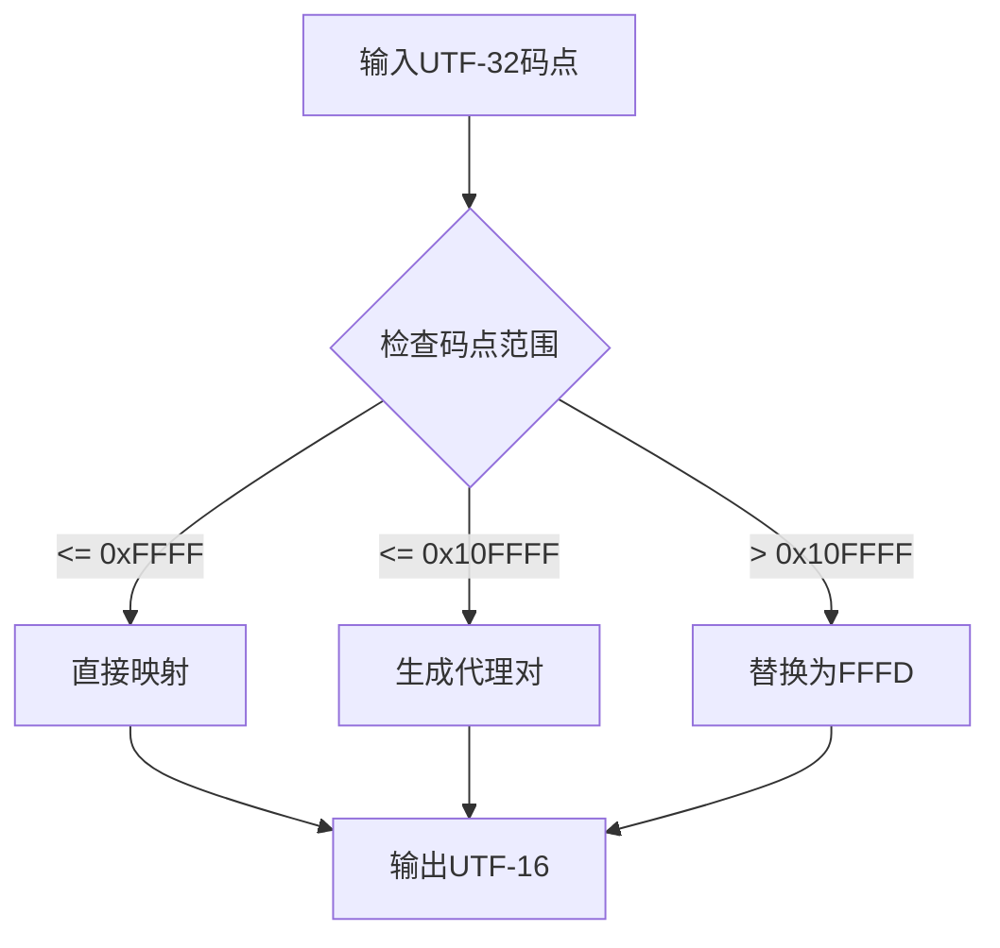
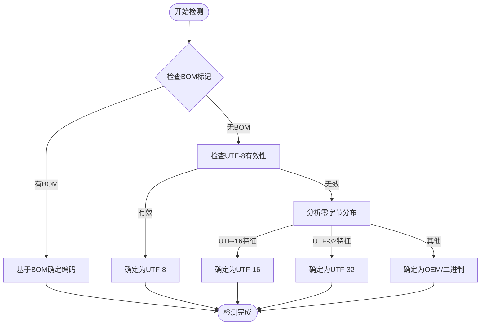
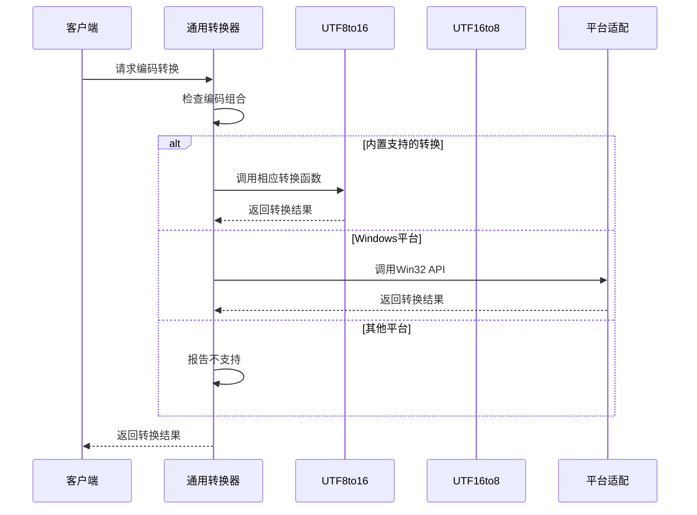
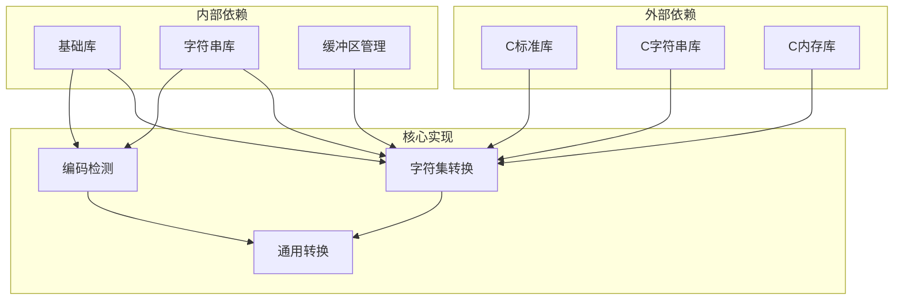
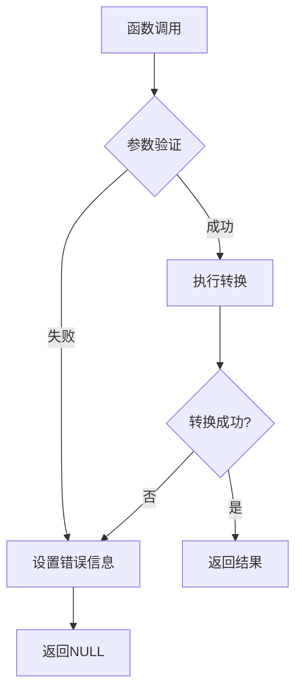

# 字符集转换API

<cite>
**本文档引用的文件**
- [lib/charset.h](file://lib/charset.h)
- [docs/api-charset.md](file://docs/api-charset.md)
- [test/test_charset.h](file://test/test_charset.h)
- [lib/base.h](file://lib/base.h)
- [lib/string.h](file://lib/string.h)
</cite>

## 目录
1. [简介](#简介)
2. [项目结构](#项目结构)
3. [核心组件](#核心组件)
4. [架构概览](#架构概览)
5. [详细组件分析](#详细组件分析)
6. [依赖关系分析](#依赖关系分析)
7. [性能考虑](#性能考虑)
8. [故障排除指南](#故障排除指南)
9. [结论](#结论)
10. [附录](#附录)

## 简介

字符集转换API是xrt库中专门处理UTF-8、UTF-16、UTF-32之间相互转换的核心模块。该API提供了完整的字符编码转换功能，包括单向转换、双向转换、编码检测、字节序转换以及通用编码转换接口。该模块支持跨平台使用，在Windows平台上还集成了Win32 API进行更广泛的字符集支持。

## 项目结构

字符集转换功能主要分布在以下文件中：



**图表来源**
- [lib/charset.h](file://lib/charset.h#L1-L908)
- [docs/api-charset.md](file://docs/api-charset.md#L1-L1122)
- [test/test_charset.h](file://test/test_charset.h#L1-L101)

**章节来源**
- [lib/charset.h](file://lib/charset.h#L1-L908)
- [docs/api-charset.md](file://docs/api-charset.md#L1-L1122)

## 核心组件

字符集转换API包含以下核心组件：

### 1. 基础数据类型定义

```c
// 字符集代码页常量
#define XRT_CP_AUTO         -2      // 自动识别字符集
#define XRT_CP_BINARY       -1      // 二进制文件
#define XRT_CP_OEM          0       // 本机OEM字符集
#define XRT_CP_UTF8         65001   // UTF-8
#define XRT_CP_UTF16        1200    // UTF-16 (小端序)
#define XRT_CP_UTF16_BE     1201    // UTF-16 (大端序)
#define XRT_CP_UTF32        65005   // UTF-32 (小端序)
#define XRT_CP_UTF32_BE     65006   // UTF-32 (大端序)

// BOM标记
#define XRT_CP_BOM          0x40000000  // 带BOM标记
#define XRT_MASK_BOM        0xBFFFFFFF  // BOM掩码
```

### 2. 转换函数族

API提供六组基础转换函数：
- UTF-8 ↔ UTF-16
- UTF-8 ↔ UTF-32  
- UTF-16 ↔ UTF-32
- 字节序转换（UTF-16/UTF-32）
- 通用编码转换（支持所有内置编码）

**章节来源**
- [lib/charset.h](file://lib/charset.h#L18-L444)
- [docs/api-charset.md](file://docs/api-charset.md#L20-L50)

## 架构概览

字符集转换API采用分层架构设计：



**图表来源**
- [lib/charset.h](file://lib/charset.h#L488-L710)
- [lib/base.h](file://lib/base.h#L5-L132)

## 详细组件分析

### UTF-8转换器

UTF-8转换器负责UTF-8与其他编码之间的转换，支持完整的Unicode范围处理。

#### UTF-8到UTF-16转换



**图表来源**
- [lib/charset.h](file://lib/charset.h#L18-L103)

#### UTF-8到UTF-32转换

UTF-8到UTF-32转换相对简单，因为UTF-32可以表示所有Unicode字符：



**图表来源**
- [lib/charset.h](file://lib/charset.h#L107-L156)

**章节来源**
- [lib/charset.h](file://lib/charset.h#L18-L156)

### UTF-16转换器

UTF-16转换器专门处理UTF-16编码的转换，包括代理对的正确处理。

#### UTF-16代理对处理

UTF-16使用代理对来表示超出基本平面的字符：



**图表来源**
- [lib/charset.h](file://lib/charset.h#L248-L296)

**章节来源**
- [lib/charset.h](file://lib/charset.h#L160-L296)

### UTF-32转换器

UTF-32转换器提供最直接的Unicode码点处理：

#### UTF-32到UTF-16转换

UTF-32到UTF-16转换需要处理代理对生成：



**图表来源**
- [lib/charset.h](file://lib/charset.h#L392-L444)

**章节来源**
- [lib/charset.h](file://lib/charset.h#L300-L444)

### 编码检测系统

编码检测系统提供智能的编码识别能力：



**图表来源**
- [lib/charset.h](file://lib/charset.h#L742-L890)

**章节来源**
- [lib/charset.h](file://lib/charset.h#L714-L890)

### 通用编码转换器

通用编码转换器提供灵活的编码转换接口：



**图表来源**
- [lib/charset.h](file://lib/charset.h#L488-L710)

**章节来源**
- [lib/charset.h](file://lib/charset.h#L488-L710)

## 依赖关系分析

字符集转换API的依赖关系如下：



**图表来源**
- [lib/charset.h](file://lib/charset.h#L1-L908)
- [lib/base.h](file://lib/base.h#L1-L132)

**章节来源**
- [lib/charset.h](file://lib/charset.h#L1-L908)
- [lib/base.h](file://lib/base.h#L1-L132)

## 性能考虑

### 内存管理优化

字符集转换API采用了多种内存管理策略：

1. **延迟分配**：只在确认转换必要时才分配内存
2. **批量处理**：支持一次性转换多个字符串
3. **原地转换**：某些转换支持原地操作以节省内存

### 算法复杂度

- **时间复杂度**：O(n)，其中n是输入字符数
- **空间复杂度**：O(n)，用于存储转换结果
- **内存峰值**：通常为输入大小的1-2倍

### 性能最佳实践

1. **避免重复转换**：缓存转换结果
2. **使用原地转换**：在可写内存上直接转换
3. **批量处理**：一次处理多个字符串
4. **合理使用缓冲区**：预估内存需求

**章节来源**
- [docs/api-charset.md](file://docs/api-charset.md#L946-L1031)

## 故障排除指南

### 常见问题及解决方案

#### 1. 内存泄漏问题

**症状**：程序运行一段时间后内存持续增长

**原因**：忘记调用`xrtFree`释放转换结果

**解决方案**：
```c
// ❌ 错误：忘记释放
u16str text = xrtUTF8to16(utf8_text, 0);
DisplayText(text); // 忘记释放

// ✅ 正确：及时释放
u16str text = xrtUTF8to16(utf8_text, 0);
DisplayText(text);
xrtFree(text);
```

#### 2. 字符数与字节数混淆

**症状**：转换结果不正确或崩溃

**原因**：UTF-8转换使用字节数，UTF-16/UTF-32转换使用字符数

**解决方案**：
```c
// UTF-8转换使用字节数
size_t byte_len = strlen(utf8_text);
u16str utf16_text = xrtUTF8to16(utf8_text, byte_len, NULL);

// UTF-16转换使用字符数
size_t char_len = u16len(utf16_text);
str utf8_text = xrtUTF16to8(utf16_text, char_len, NULL);
```

#### 3. 代理对错误处理

**症状**：特殊字符显示为替换字符

**原因**：UTF-16代理对不完整或超出支持范围

**解决方案**：检查输入数据的有效性

**章节来源**
- [docs/api-charset.md](file://docs/api-charset.md#L1035-L1105)

### 错误处理机制

字符集转换API提供了完善的错误处理机制：



**图表来源**
- [lib/base.h](file://lib/base.h#L88-L132)

**章节来源**
- [lib/base.h](file://lib/base.h#L88-L132)

## 结论

字符集转换API提供了完整、高效的多编码转换解决方案。其特点包括：

1. **完整性**：支持UTF-8、UTF-16、UTF-32之间的所有转换
2. **准确性**：正确处理Unicode代理对和边界情况
3. **效率性**：优化的算法和内存管理策略
4. **可靠性**：完善的错误处理和编码检测机制
5. **易用性**：清晰的API设计和丰富的使用示例

该API适用于各种应用场景，包括文件处理、网络通信、国际化软件开发等，为跨平台字符集处理提供了可靠的基础设施。

## 附录

### 使用示例

#### 1. 基本转换示例

```c
#include "xrt.h"

int main() {
    xrtInit();
    
    // UTF-8到UTF-16转换
    str utf8_text = "Hello 世界";
    u16str utf16_text = xrtUTF8to16(utf8_text, 0, NULL);
    
    if (utf16_text) {
        printf("转换成功\n");
        xrtFree(utf16_text);
    }
    
    xrtUnit();
    return 0;
}
```

#### 2. 编码检测示例

```c
// 检测文件编码
size_t file_size = 0;
ptr file_data = xrtFileGetAll("input.txt", &file_size);

if (file_data) {
    int charset = xrtDetectCharset(file_data, file_size, TRUE);
    printf("检测到编码: %d\n", charset);
    
    xrtFree(file_data);
}
```

#### 3. 通用转换示例

```c
// 任意编码转换
str input_text = "文本内容";
ptr result = xrtConvCharset(
    input_text, 
    0, 
    XRT_CP_OEM, 
    XRT_CP_UTF8, 
    NULL
);
```

**章节来源**
- [docs/api-charset.md](file://docs/api-charset.md#L75-L814)