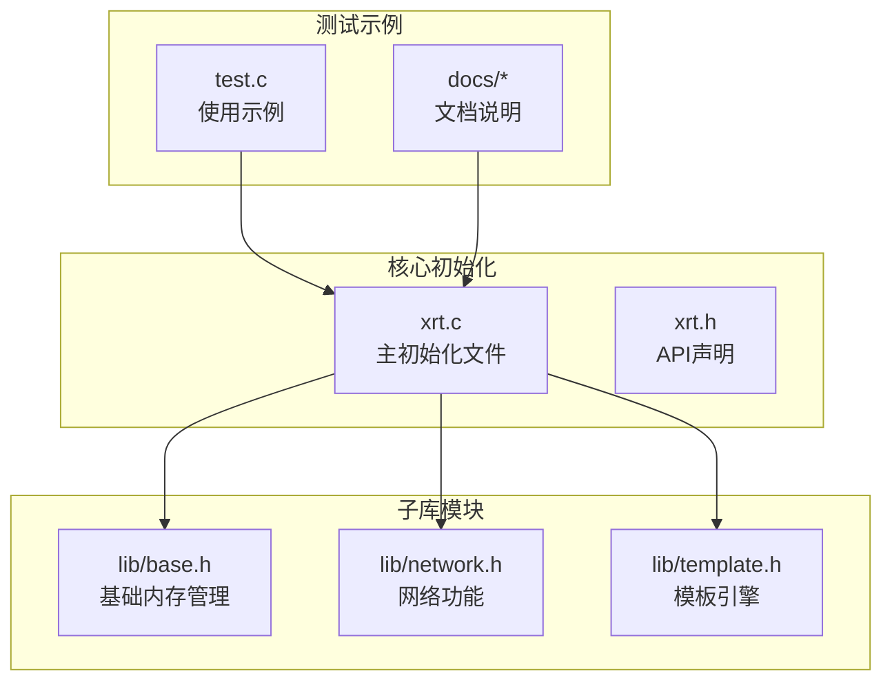
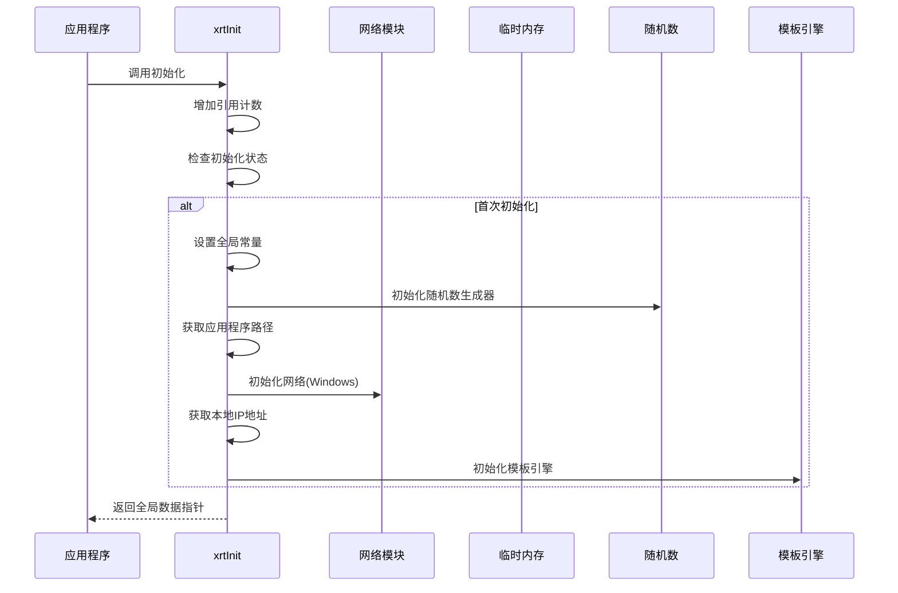
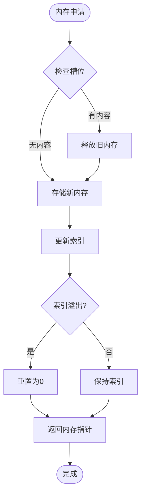
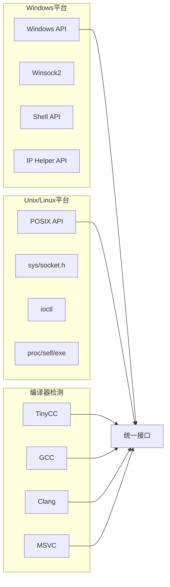
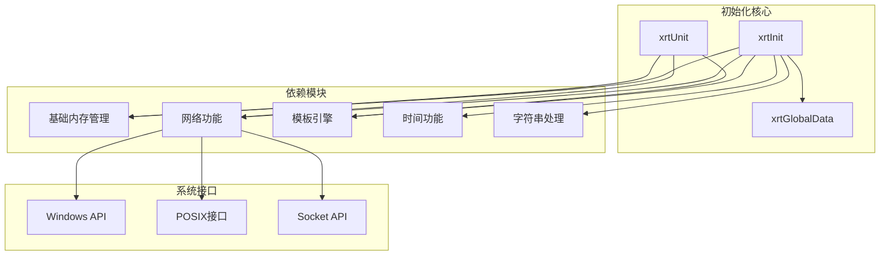
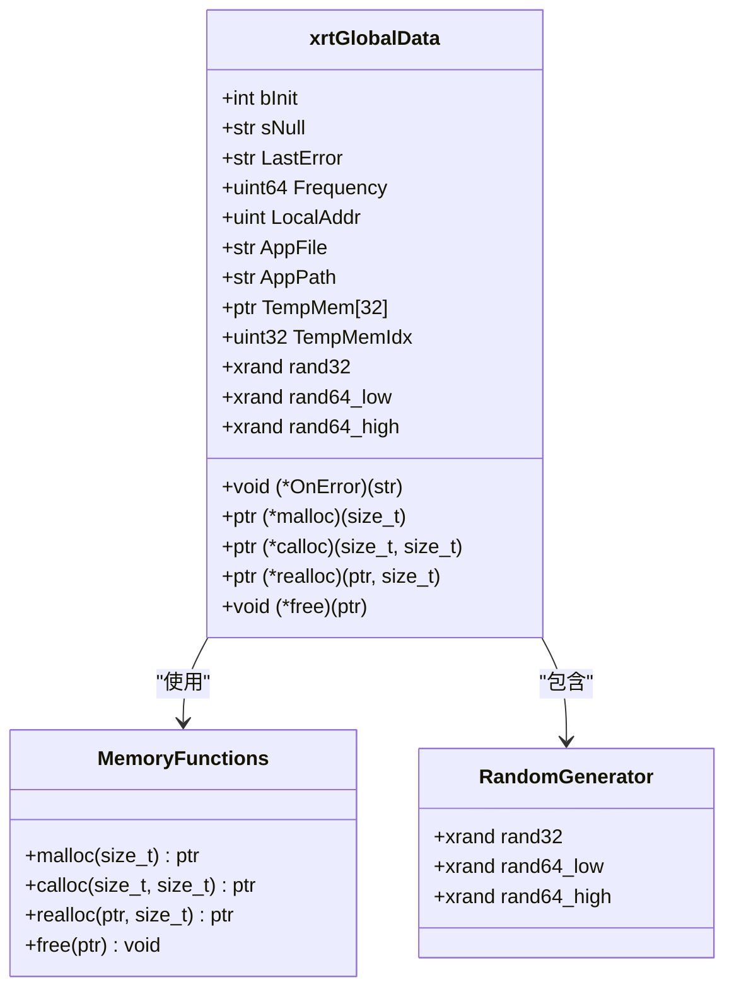

# 库初始化API

<cite>
**本文档引用的文件**
- [xrt.c](file://xrt.c)
- [xrt.h](file://xrt.h)
- [lib/base.h](file://lib/base.h)
- [lib/network.h](file://lib/network.h)
- [lib/template.h](file://lib/template.h)
- [test.c](file://test.c)
- [docs/README.en.md](file://docs/README.en.md)
- [docs/api-base.en.md](file://docs/api-base.en.md)
- [docs/api-network.en.md](file://docs/api-network.en.md)
- [平台判断.txt](file://平台判断.txt)
</cite>

## 目录
1. [简介](#简介)
2. [项目结构](#项目结构)
3. [核心组件](#核心组件)
4. [架构概览](#架构概览)
5. [详细组件分析](#详细组件分析)
6. [依赖关系分析](#依赖关系分析)
7. [性能考量](#性能考量)
8. [故障排除指南](#故障排除指南)
9. [结论](#结论)

## 简介
本文档详细说明XRT库的初始化API，重点分析`xrtInit`和`xrtUnit`函数的初始化流程、资源管理和清理机制。文档涵盖库启动时的系统检测、配置加载、网络初始化和平台适配过程，并提供多次初始化的安全性、错误处理、性能考虑和最佳实践指导。

## 项目结构
XRT库采用模块化设计，核心初始化逻辑集中在主源文件中，通过包含多个子库头文件实现功能扩展。



**图表来源**
- [xrt.c](file://xrt.c#L54-L84)
- [xrt.h](file://xrt.h#L188-L192)
- [lib/base.h](file://lib/base.h#L1-L132)
- [lib/network.h](file://lib/network.h#L1-L214)

**章节来源**
- [xrt.c](file://xrt.c#L54-L84)
- [xrt.h](file://xrt.h#L188-L192)

## 核心组件
XRT库初始化涉及以下关键组件：

### 全局数据结构
初始化过程中创建并配置全局数据结构，包含：
- 初始化状态标记
- 内存分配函数指针
- 环形临时内存管理
- 随机数生成器状态
- 约等于配置参数
- 应用程序信息

### 引用计数机制
实现线程不安全但有效的资源管理：
- 初始化时递增引用计数
- 释放时递减引用计数
- 计数归零时才真正清理资源

**章节来源**
- [xrt.h](file://xrt.h#L130-L181)
- [xrt.c](file://xrt.c#L44-L45)

## 架构概览
XRT库初始化采用分层架构，确保各功能模块的独立性和可维护性。



**图表来源**
- [xrt.c](file://xrt.c#L88-L186)
- [lib/network.h](file://lib/network.h#L40-L70)
- [lib/template.h](file://lib/template.h#L979-L989)

## 详细组件分析

### xrtInit 初始化流程

#### 初始化步骤详解
1. **引用计数管理**
   - 增加全局引用计数器
   - 检查是否已初始化，避免重复初始化

2. **全局数据配置**
   - 设置初始化标记为真
   - 初始化空值指针
   - 清空错误状态
   - 设置默认错误处理回调

3. **内存函数初始化**
   - 绑定标准C库内存分配函数
   - 设置内存释放策略

4. **环形临时内存系统**
   - 初始化32槽位环形缓冲区
   - 设置索引指针为0

5. **高精度时钟配置**
   - Windows平台查询性能计数器频率
   - 其他平台设置为0

6. **随机数生成器初始化**
   - 基于时间戳和进程ID生成种子
   - 初始化三个不同范围的随机数生成器

7. **约等于配置设置**
   - 整数比较容差：0.01%
   - 浮点数比较容差：0.01
   - 时间比较容差：10秒
   - 字符串相似度阈值：95%

8. **应用程序信息获取**
   - Windows：获取模块文件名和路径
   - Linux：通过/proc/self/exe获取路径

9. **网络子系统初始化**
   - Windows：初始化Winsock
   - 其他平台：跳过网络初始化

10. **本地IP地址获取**
    - 通过系统调用获取主机名
    - 解析IPv4地址

11. **模板引擎初始化**
    - 创建标识符列表
    - 注册内置关键字
    - 初始化表达式缓存

**章节来源**
- [xrt.c](file://xrt.c#L88-L186)
- [lib/network.h](file://lib/network.h#L40-L70)
- [lib/template.h](file://lib/template.h#L979-L1046)

### xrtUnit 资源清理机制

#### 清理流程分析
1. **引用计数递减**
   - 检查引用计数是否大于0
   - 递减计数器

2. **条件清理检查**
   - 当计数归零且已初始化时执行清理
   - 避免重复清理

3. **模板引擎清理**
   - 释放表达式AST缓存
   - 清空标识符列表

4. **应用程序信息释放**
   - 释放应用文件路径
   - 释放应用目录路径

5. **错误状态清理**
   - 释放动态分配的错误消息
   - 重置错误标记

6. **临时内存管理**
   - 释放所有环形缓冲区中的内存
   - 重置索引指针

7. **初始化状态重置**
   - 设置初始化标记为假

8. **网络资源清理**
   - Windows：调用WSACleanup
   - 其他平台：跳过清理

**章节来源**
- [xrt.c](file://xrt.c#L191-L226)

### 环形临时内存管理系统

#### 设计原理
环形临时内存采用32槽位环形缓冲区设计：



**图表来源**
- [lib/base.h](file://lib/base.h#L50-L84)

#### 性能特点
- **循环使用**：33次调用后自动释放最旧内存
- **线程不安全**：适合单线程环境
- **高效管理**：避免频繁的内存分配和释放
- **容量限制**：最多同时持有32个临时对象

**章节来源**
- [lib/base.h](file://lib/base.h#L50-L84)

### 平台适配机制

#### 多平台支持
XRT库通过预处理器指令实现跨平台兼容：



**图表来源**
- [xrt.c](file://xrt.c#L8-L38)
- [平台判断.txt](file://平台判断.txt#L4-L38)

#### 网络功能平台差异
| 功能 | Windows实现 | Unix/Linux实现 |
|------|-------------|----------------|
| 主机名获取 | GetModuleFileNameW | readlink(/proc/self/exe) |
| IP地址解析 | gethostbyname | gethostbyname |
| MAC地址获取 | GetAdaptersInfo | ioctl(SIOCGIFHWADDR) |
| 网络设备枚举 | GetAdaptersInfo | SIOCGIFCONF |

**章节来源**
- [lib/network.h](file://lib/network.h#L40-L139)

## 依赖关系分析

### 模块依赖图
XRT库的初始化过程涉及多个模块间的依赖关系：



**图表来源**
- [xrt.c](file://xrt.c#L54-L84)
- [lib/network.h](file://lib/network.h#L1-L214)

### 依赖注入机制
初始化过程中采用函数指针实现依赖注入：



**图表来源**
- [xrt.h](file://xrt.h#L130-L181)

**章节来源**
- [xrt.c](file://xrt.c#L54-L84)
- [xrt.h](file://xrt.h#L130-L181)

## 性能考量

### 初始化性能优化
1. **延迟初始化策略**
   - 按需初始化各功能模块
   - 避免不必要的系统调用

2. **内存管理效率**
   - 环形临时内存减少碎片
   - 批量释放机制提高效率

3. **平台特定优化**
   - Windows使用高性能计数器
   - Unix平台最小化系统调用

### 内存使用模式
- **全局数据**：一次性分配，生命周期贯穿整个程序
- **临时内存**：循环复用，限制最大并发数
- **动态分配**：按需分配，及时释放

### 最佳实践建议
1. **初始化时机**
   - 程序启动时调用`xrtInit`
   - 确保在使用任何XRT功能之前

2. **清理时机**
   - 程序退出前调用`xrtUnit`
   - 避免在库仍在使用时提前清理

3. **线程安全**
   - 初始化和清理应在单线程环境中进行
   - 避免多线程同时调用初始化函数

## 故障排除指南

### 常见问题诊断

#### 初始化失败
**症状**：`xrtInit`返回NULL或功能异常
**可能原因**：
- 内存分配失败
- 网络初始化失败
- 平台API调用失败

**解决方案**：
1. 检查系统可用内存
2. 验证网络连接状态
3. 确认平台支持性

#### 资源泄漏
**症状**：程序运行时间越长内存占用越大
**可能原因**：
- 忘记调用`xrtUnit`
- 使用了需要手动释放的内存函数
- 临时内存使用不当

**解决方案**：
1. 确保每次初始化都有对应的清理调用
2. 使用正确的内存管理函数
3. 避免长期持有临时内存

#### 平台兼容性问题
**症状**：在某些平台上功能异常
**可能原因**：
- 平台宏定义不正确
- 系统API版本不兼容
- 编译器差异

**解决方案**：
1. 检查平台判断宏
2. 验证系统API可用性
3. 使用兼容性编译选项

### 调试技巧
1. **启用错误回调**
   ```c
   void OnError(str sError) {
       printf("错误: %s\n", sError);
   }
   xCore->OnError = OnError;
   ```

2. **检查初始化状态**
   ```c
   if (xCore->bInit) {
       printf("库已初始化\n");
   }
   ```

3. **监控内存使用**
   - 使用临时内存时注意循环复用
   - 定期检查内存分配状态

**章节来源**
- [test.c](file://test.c#L47-L50)
- [docs/api-base.en.md](file://docs/api-base.en.md#L891-L930)

## 结论
XRT库的初始化API设计体现了现代C库的最佳实践，通过模块化架构、平台适配和资源管理实现了高效的跨平台支持。关键特性包括：

1. **健壮的初始化流程**：完整的系统检测和配置加载
2. **灵活的资源管理**：引用计数机制确保资源正确释放
3. **高效的内存系统**：环形临时内存提升性能
4. **完善的错误处理**：详细的错误报告和恢复机制
5. **跨平台兼容性**：统一的API接口支持多平台部署

建议开发者遵循本文档的最佳实践，在实际项目中充分利用这些特性，确保应用程序的稳定性和性能表现。