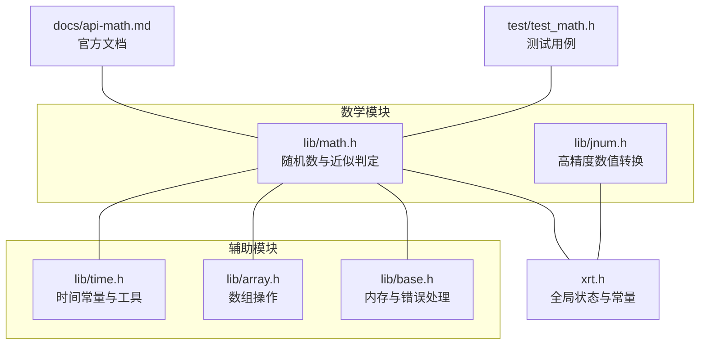
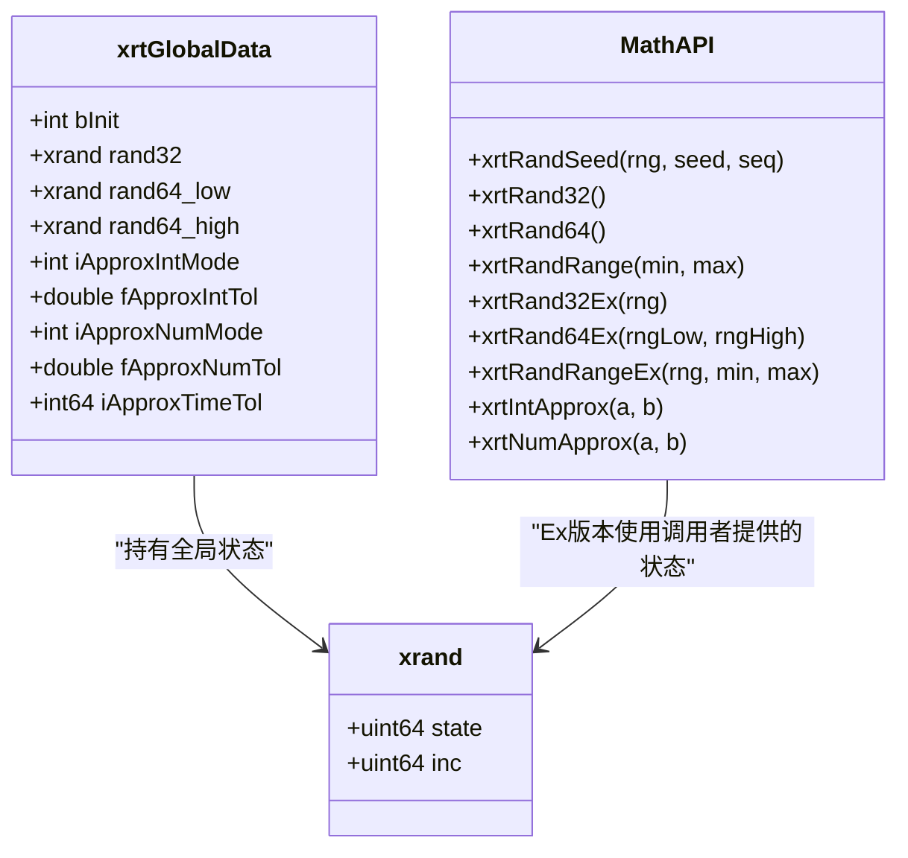
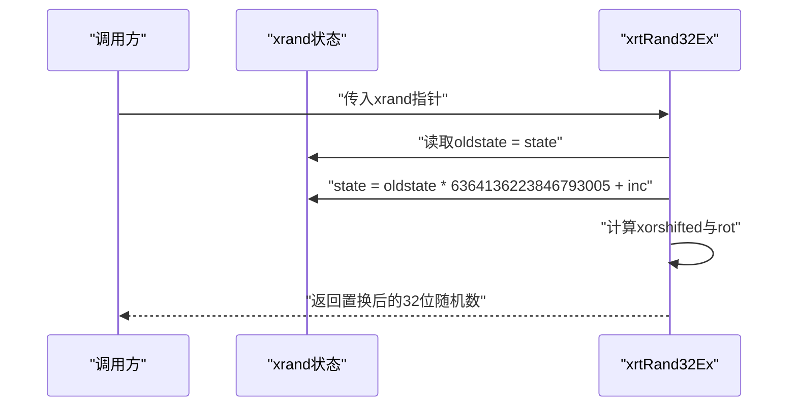
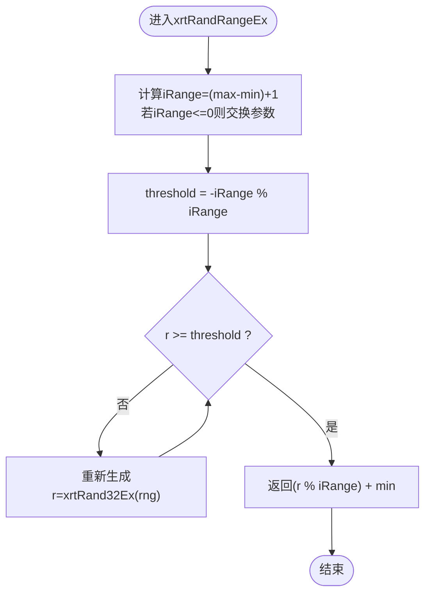
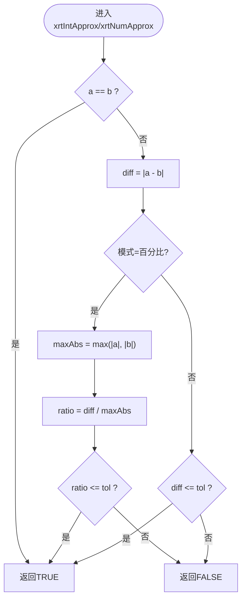
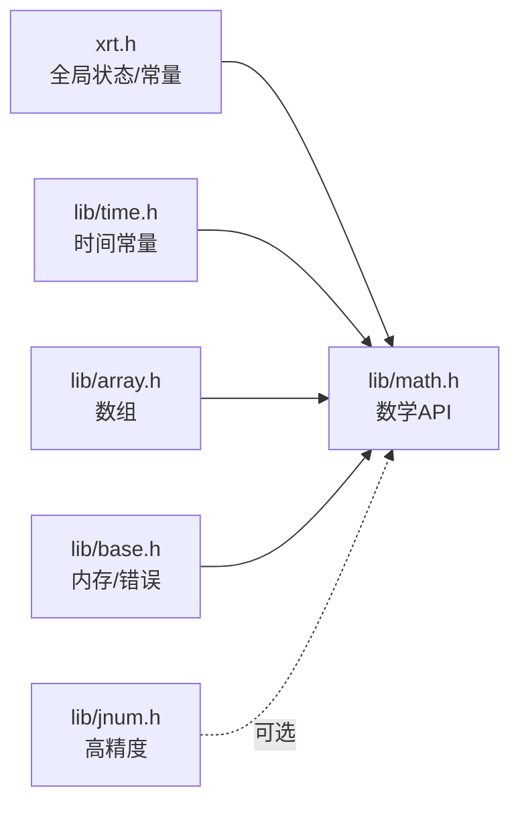

# 数学运算API

<cite>
**本文引用的文件**
- [lib/math.h](file://lib/math.h)
- [docs/api-math.md](file://docs/api-math.md)
- [test/test_math.h](file://test/test_math.h)
- [lib/jnum.h](file://lib/jnum.h)
- [lib/array.h](file://lib/array.h)
- [lib/base.h](file://lib/base.h)
- [lib/time.h](file://lib/time.h)
- [xrt.h](file://xrt.h)
- [docs/api-time.en.md](file://docs/api-time.en.md)
</cite>

## 目录
1. [简介](#简介)
2. [项目结构](#项目结构)
3. [核心组件](#核心组件)
4. [架构总览](#架构总览)
5. [详细组件分析](#详细组件分析)
6. [依赖关系分析](#依赖关系分析)
7. [性能考量](#性能考量)
8. [故障排查指南](#故障排查指南)
9. [结论](#结论)
10. [附录](#附录)

## 简介
本文件系统化梳理数学运算API，覆盖随机数生成、数值比较与近似判定、高精度数值处理能力，并结合仓库中的时间、数组与基础内存接口，给出多线程安全性、数值稳定性与性能优化建议。文档同时提供面向实际场景的使用示例路径，帮助快速落地。

## 项目结构
数学运算API主要位于数学库头文件与配套文档中；测试用例位于测试模块；高精度数值转换能力位于jnum模块；时间与数组等辅助能力位于各自模块；全局状态与常量定义位于公共头文件。

图表来源
- [lib/math.h](file://lib/math.h#L1-L175)
- [docs/api-math.md](file://docs/api-math.md#L1-L1237)
- [test/test_math.h](file://test/test_math.h#L1-L145)
- [lib/jnum.h](file://lib/jnum.h#L1-L200)
- [lib/array.h](file://lib/array.h#L1-L180)
- [lib/base.h](file://lib/base.h#L1-L132)
- [lib/time.h](file://lib/time.h#L1-L200)
- [xrt.h](file://xrt.h#L120-L185)

章节来源
- [lib/math.h](file://lib/math.h#L1-L175)
- [docs/api-math.md](file://docs/api-math.md#L1-L1237)
- [test/test_math.h](file://test/test_math.h#L1-L145)
- [lib/jnum.h](file://lib/jnum.h#L1-L200)
- [lib/array.h](file://lib/array.h#L1-L180)
- [lib/base.h](file://lib/base.h#L1-L132)
- [lib/time.h](file://lib/time.h#L1-L200)
- [xrt.h](file://xrt.h#L120-L185)

## 核心组件
- 随机数生成器（PCG）
  - 线程安全Ex版本：xrtRand32Ex、xrtRand64Ex、xrtRandRangeEx
  - 线程不安全普通版本：xrtRand32、xrtRand64、xrtRandRange
  - 种子与序列：xrtRandSeed
  - 状态结构：xrand
- 近似比较
  - 整数近似：xrtIntApprox
  - 浮点近似：xrtNumApprox
  - 配置项：容差模式（差值/百分比）、容差阈值
- 高精度数值
  - jnum模块提供高精度浮点分解与转换工具，支持大范围与高精度场景
- 辅助能力
  - 数组：数组创建、插入、排序、随机采样等
  - 内存：统一内存分配与错误处理
  - 时间：时间单位常量与时间近似比较

章节来源
- [lib/math.h](file://lib/math.h#L44-L175)
- [docs/api-math.md](file://docs/api-math.md#L27-L528)
- [lib/jnum.h](file://lib/jnum.h#L1-L200)
- [lib/array.h](file://lib/array.h#L1-L180)
- [lib/base.h](file://lib/base.h#L1-L132)
- [lib/time.h](file://lib/time.h#L1-L200)
- [xrt.h](file://xrt.h#L120-L185)

## 架构总览
数学模块围绕“全局状态+线程安全Ex版本”的设计，既保证高性能（普通版本），又提供多线程安全（Ex版本）。近似比较通过全局配置实现一致的容差策略。高精度数值转换作为底层支撑，服务于需要高精度的数值场景。

图表来源
- [xrt.h](file://xrt.h#L120-L185)
- [lib/math.h](file://lib/math.h#L44-L175)

章节来源
- [xrt.h](file://xrt.h#L120-L185)
- [lib/math.h](file://lib/math.h#L44-L175)

## 详细组件分析

### 随机数生成器（PCG）
- 设计要点
  - 状态结构xrand包含state与inc，分别控制状态演进与序列差异
  - 普通版本直接使用全局状态，性能优先但线程不安全
  - Ex版本由调用者管理状态，适合多线程或需要可重现性的场景
  - 提供32位、64位与范围生成，范围生成采用无偏采样策略
- 关键流程（Ex版本生成32位随机数）

图表来源
- [lib/math.h](file://lib/math.h#L59-L66)

- 关键流程（范围生成无偏采样）

图表来源
- [lib/math.h](file://lib/math.h#L81-L101)

- 种子设置与可重现性
  - 通过xrtRandSeed(seed, seq)初始化状态，相同seed与seq产生相同序列
  - 建议在测试与调试场景固定seed，在生产环境使用更高熵的seed

- 多线程安全
  - 普通版本共享全局状态，需外部同步
  - Ex版本每个线程维护独立xrand实例，天然线程安全

章节来源
- [lib/math.h](file://lib/math.h#L44-L125)
- [docs/api-math.md](file://docs/api-math.md#L66-L405)
- [test/test_math.h](file://test/test_math.h#L9-L71)

### 近似比较（整数与浮点）
- 配置与模式
  - 模式常量：差值模式与百分比模式
  - 容差阈值：整数与浮点分别配置
- 计算逻辑
  - 百分比模式：以两数绝对值最大者为基准计算比例
  - 差值模式：直接比较差值绝对值
- 时间近似
  - 时间容差以xtime单位配置，配合时间常量使用

图表来源
- [lib/math.h](file://lib/math.h#L129-L175)
- [xrt.h](file://xrt.h#L306-L307)
- [docs/api-math.md](file://docs/api-math.md#L409-L527)

章节来源
- [lib/math.h](file://lib/math.h#L129-L175)
- [xrt.h](file://xrt.h#L306-L307)
- [docs/api-math.md](file://docs/api-math.md#L409-L527)
- [test/test_math.h](file://test/test_math.h#L76-L145)

### 高精度数值（jnum）
- 能力概述
  - 提供DIY浮点分解、128位乘法、快速除法与格式化工具
  - 支持大范围与高精度的数值转换与计算
- 典型用途
  - 需要避免双精度误差累积的科学计算
  - 大整数与高精度字符串转换

章节来源
- [lib/jnum.h](file://lib/jnum.h#L1-L200)
- [lib/jnum.h](file://lib/jnum.h#L851-L1647)

### 数组与随机采样（辅助能力）
- 数组操作
  - 创建、销毁、扩容、插入、删除、交换、排序
- 随机采样
  - 基于Fisher-Yates洗牌的随机采样流程
  - 通过xrtRandRangeEx实现均匀采样

章节来源
- [lib/array.h](file://lib/array.h#L1-L180)
- [docs/api-math.md](file://docs/api-math.md#L699-L750)

### 内存与错误处理（辅助能力）
- 统一内存接口：xrtMalloc、xrtCalloc、xrtRealloc、xrtFree
- 临时内存：环形缓存，简化短期对象释放
- 错误处理：xrtSetError、xrtClearError

章节来源
- [lib/base.h](file://lib/base.h#L1-L132)

### 时间与容差（辅助能力）
- 时间单位常量：分钟、小时、天等
- 时间近似：容差以xtime单位配置

章节来源
- [lib/time.h](file://lib/time.h#L1-L200)
- [docs/api-time.en.md](file://docs/api-time.en.md#L31-L43)
- [docs/api-math.md](file://docs/api-math.md#L1223-L1237)

## 依赖关系分析
- 数学API依赖全局状态与常量定义
- 近似比较依赖全局容差配置
- 随机采样依赖数组与随机数API
- 高精度数值转换独立于数学API，可按需引入

图表来源
- [xrt.h](file://xrt.h#L120-L185)
- [lib/math.h](file://lib/math.h#L1-L175)
- [lib/time.h](file://lib/time.h#L1-L200)
- [lib/array.h](file://lib/array.h#L1-L180)
- [lib/base.h](file://lib/base.h#L1-L132)
- [lib/jnum.h](file://lib/jnum.h#L1-L200)

章节来源
- [xrt.h](file://xrt.h#L120-L185)
- [lib/math.h](file://lib/math.h#L1-L175)
- [lib/time.h](file://lib/time.h#L1-L200)
- [lib/array.h](file://lib/array.h#L1-L180)
- [lib/base.h](file://lib/base.h#L1-L132)
- [lib/jnum.h](file://lib/jnum.h#L1-L200)

## 性能考量
- 优先级与线程安全
  - 普通版本xrtRand32/xrtRand64/xrtRandRange性能更优，但线程不安全
  - 多线程或需要可重现性时使用Ex版本，成本为额外状态管理
- 无偏采样
  - 范围生成采用拒绝采样策略，平均轮数较少，满足大多数场景
- 内存与临时内存
  - 使用临时内存减少频繁分配开销，注意其线程不安全特性
- 高精度数值
  - 在需要避免精度损失的场景启用jnum，注意其计算复杂度高于标准浮点

章节来源
- [docs/api-math.md](file://docs/api-math.md#L266-L270)
- [lib/base.h](file://lib/base.h#L49-L84)
- [lib/jnum.h](file://lib/jnum.h#L1-L200)

## 故障排查指南
- 随机数不一致
  - 检查是否混用普通版本与Ex版本
  - 确认是否正确设置种子与序列
- 多线程冲突
  - 将普通版本替换为Ex版本，确保每个线程拥有独立xrand实例
- 近似比较误判
  - 核对容差模式与阈值配置
  - 注意百分比模式下分母为零的边界情况（两数均为0时返回TRUE）
- 时间容差异常
  - 确认容差单位与时间常量一致

章节来源
- [lib/math.h](file://lib/math.h#L129-L175)
- [test/test_math.h](file://test/test_math.h#L76-L145)
- [docs/api-math.md](file://docs/api-math.md#L409-L527)

## 结论
该数学运算API以PCG为核心，兼顾性能与可重现性；通过Ex版本实现多线程安全；近似比较提供灵活的容差策略；高精度数值转换为复杂场景提供支撑。结合数组、内存与时间模块，可构建从随机采样到统计分析的完整能力体系。

## 附录
- 使用示例（路径）
  - 随机数组生成：[docs/api-math.md](file://docs/api-math.md#L533-L561)
  - 随机字符串生成：[docs/api-math.md](file://docs/api-math.md#L565-L603)
  - 数组随机打乱：[docs/api-math.md](file://docs/api-math.md#L607-L647)
  - 概率事件：[docs/api-math.md](file://docs/api-math.md#L651-L695)
  - 随机采样：[docs/api-math.md](file://docs/api-math.md#L699-L750)
  - 随机延迟：[docs/api-math.md](file://docs/api-math.md#L754-L779)
  - UUID/GUID生成：[docs/api-math.md](file://docs/api-math.md#L783-L800)
- 测试用例（路径）
  - 数学库测试：[test/test_math.h](file://test/test_math.h#L5-L71)
  - 近似比较测试：[test/test_math.h](file://test/test_math.h#L76-L145)