# 时间处理API

<cite>
**本文档引用的文件**
- [lib/time.h](file://lib/time.h)
- [docs/api-time.md](file://docs/api-time.md)
- [test/test_time.h](file://test/test_time.h)
- [xrt.h](file://xrt.h)
- [docs/api-time.en.md](file://docs/api-time.en.md)
</cite>

## 目录
1. [简介](#简介)
2. [项目结构](#项目结构)
3. [核心组件](#核心组件)
4. [架构概览](#架构概览)
5. [详细组件分析](#详细组件分析)
6. [依赖关系分析](#依赖关系分析)
7. [性能考虑](#性能考虑)
8. [故障排查指南](#故障排查指南)
9. [结论](#结论)
10. [附录](#附录)

## 简介
本文件系统性梳理了时间处理API，涵盖高精度时间测量、时区处理、日期计算、时间格式化与解析、相对时间描述、Unix时间戳互转、周边界与季度计算等能力。文档基于仓库中的时间库实现与官方文档，提供跨平台差异说明、性能特性与精度限制，并给出定时任务、性能测量、日志时间戳、数据过期管理等典型应用场景的实践建议。

## 项目结构
时间处理API位于库文件与文档两处：
- 实现层：lib/time.h 提供全部时间函数的具体实现，包括高精度计时、日期时间构建与解析、格式化与解析、时区转换、相对时间描述、边界计算等。
- 文档层：docs/api-time.md 与 docs/api-time.en.md 提供API说明、常量定义、使用示例与最佳实践。
- 测试层：test/test_time.h 展示了大量函数的实际使用与验证逻辑。
- 类型与全局：xrt.h 定义了时间戳基础类型 xtime（int64），并在全局结构体中维护高精度计时频率等关键状态。

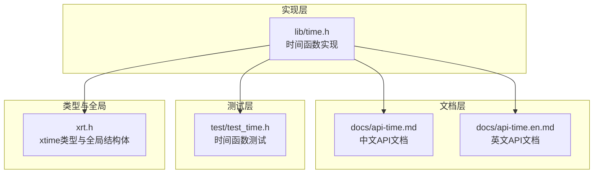

图表来源
- [lib/time.h](file://lib/time.h#L1-L1403)
- [docs/api-time.md](file://docs/api-time.md#L1-L2706)
- [docs/api-time.en.md](file://docs/api-time.en.md#L1-L2706)
- [test/test_time.h](file://test/test_time.h#L1-L272)
- [xrt.h](file://xrt.h#L90-L184)

章节来源
- [lib/time.h](file://lib/time.h#L1-L1403)
- [docs/api-time.md](file://docs/api-time.md#L1-L2706)
- [test/test_time.h](file://test/test_time.h#L1-L272)
- [xrt.h](file://xrt.h#L90-L184)

## 核心组件
- 高精度计时与延时
  - xrtTimer：跨平台高精度计时（Windows使用QueryPerformanceCounter，其他平台使用clock_gettime(CLOCK_MONOTONIC)）。
  - xrtSleep：毫秒级延时（Windows使用Sleep，其他平台使用usleep）。
- 时间获取与格式化
  - xrtNow/xrtDate/xrtTime：获取当前日期时间/日期/时间（线程安全）。
  - xrtNowStr/xrtDateStr/xrtTimeStr：获取格式化的当前时间字符串（需xrtFree释放）。
  - xrtTimeToStr：将时间戳按预设格式输出。
- 时间构建与解码
  - xrtDateSerial/xrtTimeSerial/xrtDateTimeSerial：构建时间戳。
  - xrtDecodeSerial/xrtYear/xrtMonth/xrtDay/xrtHour/xrtMinute/xrtSecond/xrtWeekday/xrtDayOfYear：从时间戳解码各字段。
- 时间计算与比较
  - xrtDateAdd：按年/月/日/时/分/秒/星期/季度累加。
  - xrtDateDiff：计算时间差（不支持星期）。
  - xrtIsSameDay/xrtIsSameMonth/xrtIsSameYear/xrtTimeInRange/xrtTimeRangeOverlap：区间判断。
  - xrtTimeApprox：时间“约等于”比较（基于容差）。
- 格式化与解析
  - xrtTimeFormat：自定义格式化（支持年、月、日、时、分、秒、AM/PM、星期、季度等占位符）。
  - xrtTimeParse：自定义解析（支持冗余前缀自动跳过、锚点定位、智能识别常见模式）。
  - xrtStrToTime：智能解析常见格式（YYYY-MM-DD、YYYYMMDD、HH:MM:SS等）。
- 时区与UTC
  - xrtNowUTC：获取UTC时间。
  - xrtTimezoneOffset：获取本地时区偏移（秒）。
  - xrtUTCToLocal/xrtLocalToUTC：UTC与本地时间互转。
- 边界与周期
  - xrtQuarter：获取季度。
  - xrtDatePart/xrtTimePart：分离日期与时间部分。
  - xrtFirstDayOfMonth/xrtLastDayOfMonth/xrtFirstDayOfYear/xrtLastDayOfYear：月份/年份边界。
  - xrtFirstDayOfWeek/xrtLastDayOfWeek/xrtWeekOfYear/xrtWeekOfMonth：周边界与周数。
  - xrtWeekday/xrtDayOfYear：星期与年内第几天。
- Unix时间戳互转
  - xrtToUnixTime/xrtFromUnixTime：与Unix时间戳互转。

章节来源
- [lib/time.h](file://lib/time.h#L1-L1403)
- [docs/api-time.md](file://docs/api-time.md#L1-L2706)
- [xrt.h](file://xrt.h#L90-L184)

## 架构概览
时间API采用统一的内部时间表示（xtime为int64秒），通过平台适配层实现高精度计时与线程安全的时间获取；通过常量与辅助函数实现日期计算与格式化；通过独立的格式化/解析模块支持灵活的输入输出。

```mermaid
graph TB
subgraph "时间表示层"
XTIME["xtime(int64)<br/>统一时间戳"]
end
subgraph "平台适配层"
TIMER["xrtTimer<br/>高精度计时"]
SLEEP["xrtSleep<br/>毫秒延时"]
NOW["xrtNow/xrtDate/xrtTime<br/>当前时间获取"]
UTC["xrtNowUTC<br/>UTC时间"]
TZ["xrtTimezoneOffset<br/>时区偏移"]
end
subgraph "日期计算层"
BUILD["构建: DateSerial/TimeSerial/DateTimeSerial"]
DECODE["解码: DecodeSerial/Year/Month/Day/Hour/Minute/Second/Weekday/DayOfYear"]
CALC["计算: DateAdd/DateDiff/Approx"]
BOUND["边界: First/Last DayOfWeek/Month/Year<br/>WeekOfYear/WeekOfMonth/Quarter"]
end
subgraph "格式化与解析层"
STRFMT["xrtTimeToStr"]
CUSTOMFMT["xrtTimeFormat"]
CUSTOMPARSE["xrtTimeParse"]
SMARTPARSE["xrtStrToTime"]
end
subgraph "互转层"
UNIX["xrtToUnixTime/xrtFromUnixTime"]
CONV["xrtUTCToLocal/xrtLocalToUTC"]
end
XTIME --> TIMER
XTIME --> SLEEP
XTIME --> NOW
XTIME --> UTC
XTIME --> TZ
XTIME --> BUILD
XTIME --> DECODE
XTIME --> CALC
XTIME --> BOUND
XTIME --> STRFMT
XTIME --> CUSTOMFMT
XTIME --> CUSTOMPARSE
XTIME --> SMARTPARSE
XTIME --> UNIX
XTIME --> CONV
```

图表来源
- [lib/time.h](file://lib/time.h#L1-L1403)
- [xrt.h](file://xrt.h#L90-L184)

## 详细组件分析

### 高精度计时与延时
- xrtTimer
  - 功能：返回单调递增的高精度时间（秒，浮点）。
  - 平台差异：Windows使用QueryPerformanceCounter并结合频率；其他平台使用clock_gettime(CLOCK_MONOTONIC)。
  - 适用场景：性能测量、任务调度间隔计算。
- xrtSleep
  - 功能：毫秒级阻塞延时。
  - 平台差异：Windows使用Sleep；其他平台使用usleep。

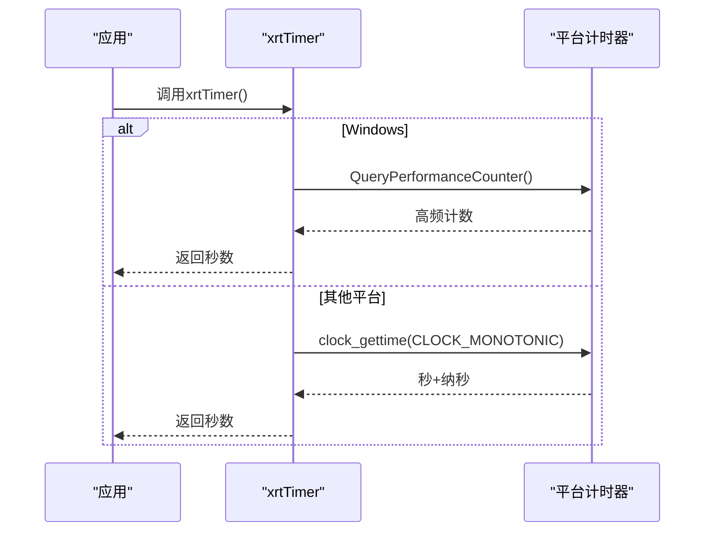

图表来源
- [lib/time.h](file://lib/time.h#L5-L22)

章节来源
- [lib/time.h](file://lib/time.h#L5-L36)

### 时间获取与格式化
- xrtNow/xrtDate/xrtTime
  - 线程安全：使用本地化安全函数（localtime_s/gmtime_s或localtime_r/gmtime_r）。
  - 返回值：xtime（int64）。
- xrtNowStr/xrtDateStr/xrtTimeStr
  - 返回格式化字符串，需调用xrtFree释放。
- xrtTimeToStr
  - 支持三种预设格式：日期时间、日期、时间。

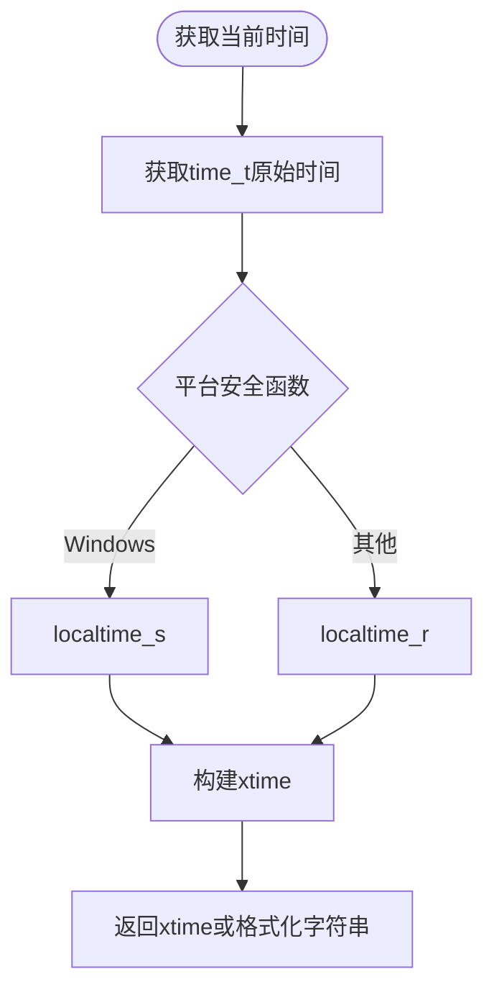

图表来源
- [lib/time.h](file://lib/time.h#L364-L449)

章节来源
- [lib/time.h](file://lib/time.h#L364-L449)

### 时间构建与解码
- 构建
  - xrtDateSerial：构建日期时间戳（支持公元前）。
  - xrtTimeSerial：构建当日秒数。
  - xrtDateTimeSerial：组合日期与时间。
- 解码
  - xrtDecodeSerial：一次性解码年、月、日、时、分、秒、星期、年内第几天。
  - xrtYear/xrtMonth/xrtDay/xrtHour/xrtMinute/xrtSecond/xrtWeekday/xrtDayOfYear：单项提取。

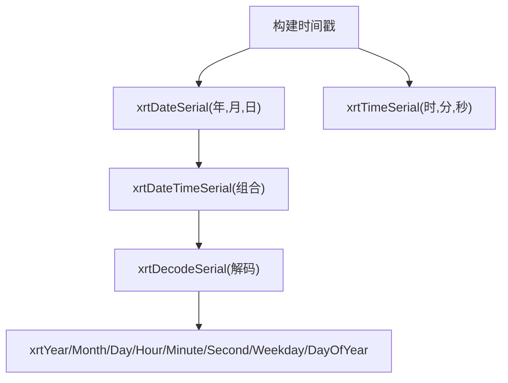

图表来源
- [lib/time.h](file://lib/time.h#L92-L140)
- [lib/time.h](file://lib/time.h#L296-L359)

章节来源
- [lib/time.h](file://lib/time.h#L92-L140)
- [lib/time.h](file://lib/time.h#L296-L359)

### 时间计算与比较
- xrtDateAdd：支持年、月、日、时、分、秒、星期、季度累加；月/年累加考虑闰年与月末边界。
- xrtDateDiff：计算时间差（不支持星期）。
- 区间判断：xrtIsSameDay/IsSameMonth/IsSameYear、xrtTimeInRange、xrtTimeRangeOverlap。
- 约等于：xrtTimeApprox，基于全局容差配置（xCore.iApproxTimeTol）。

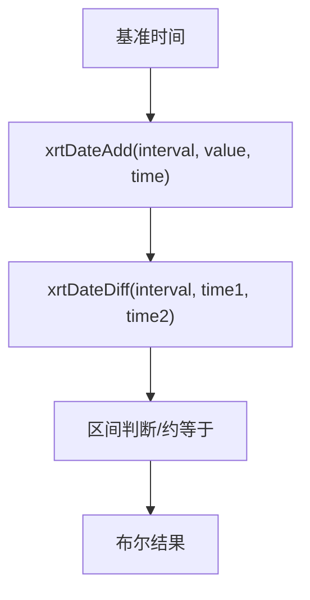

图表来源
- [lib/time.h](file://lib/time.h#L478-L560)
- [lib/time.h](file://lib/time.h#L598-L637)
- [lib/time.h](file://lib/time.h#L1395-L1401)

章节来源
- [lib/time.h](file://lib/time.h#L478-L560)
- [lib/time.h](file://lib/time.h#L598-L637)
- [lib/time.h](file://lib/time.h#L1395-L1401)

### 格式化与解析
- xrtTimeToStr：预设格式输出。
- xrtTimeFormat：自定义格式化，支持年、月、日、时、分、秒、AM/PM、星期、季度等占位符；mm上下文自动区分月份与分钟。
- xrtTimeParse：自定义解析，支持冗余前缀自动跳过、锚点定位、智能识别常见模式。
- xrtStrToTime：智能解析常见格式（YYYY-MM-DD、YYYYMMDD、HH:MM:SS等）。

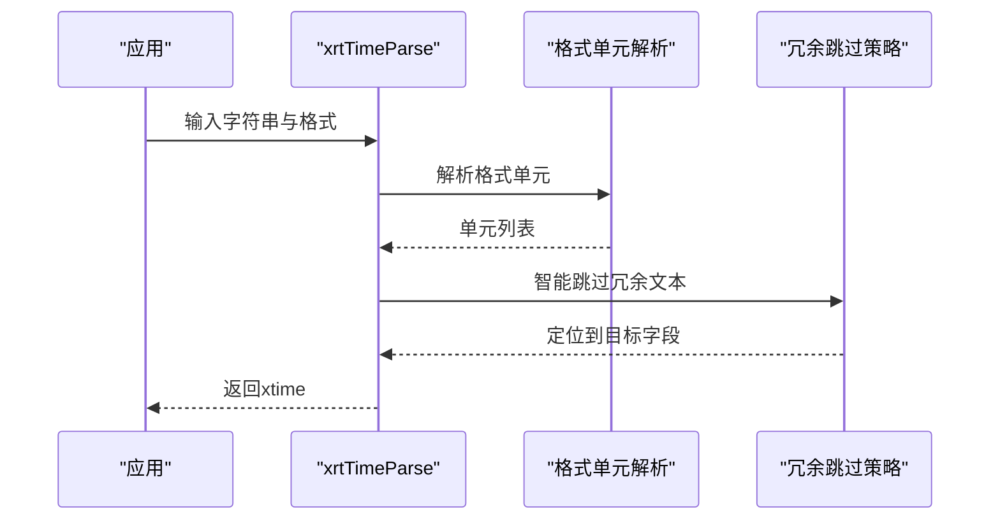

图表来源
- [lib/time.h](file://lib/time.h#L1197-L1390)

章节来源
- [lib/time.h](file://lib/time.h#L559-L645)
- [lib/time.h](file://lib/time.h#L1197-L1390)

### 时区与UTC
- xrtNowUTC：获取UTC时间。
- xrtTimezoneOffset：计算本地时区偏移（秒）。
- xrtUTCToLocal/xrtLocalToUTC：UTC与本地时间互转。

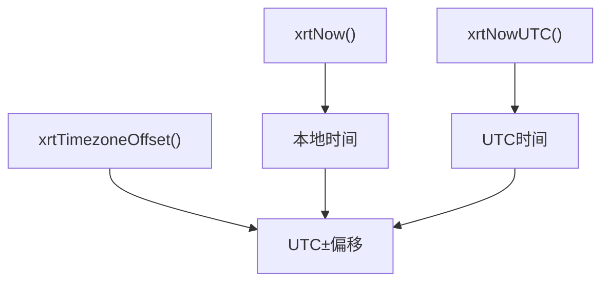

图表来源
- [lib/time.h](file://lib/time.h#L747-L814)

章节来源
- [lib/time.h](file://lib/time.h#L747-L814)

### 边界与周期
- 季度：xrtQuarter。
- 日期/时间部分：xrtDatePart/xrtTimePart。
- 月份/年份边界：xrtFirstDayOfMonth/xrtLastDayOfMonth/xrtFirstDayOfYear/xrtLastDayOfYear。
- 周边界与周数：xrtFirstDayOfWeek/xrtLastDayOfWeek/xrtWeekOfYear/xrtWeekOfMonth。
- 星期与年内第几天：xrtWeekday/xrtDayOfYear。

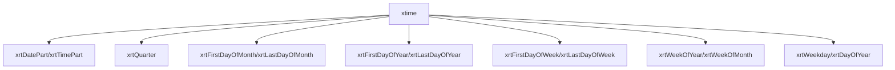

图表来源
- [lib/time.h](file://lib/time.h#L657-L742)

章节来源
- [lib/time.h](file://lib/time.h#L657-L742)

### Unix时间戳互转
- xrtToUnixTime：将xtime转换为Unix时间戳。
- xrtFromUnixTime：将Unix时间戳转换为xtime。

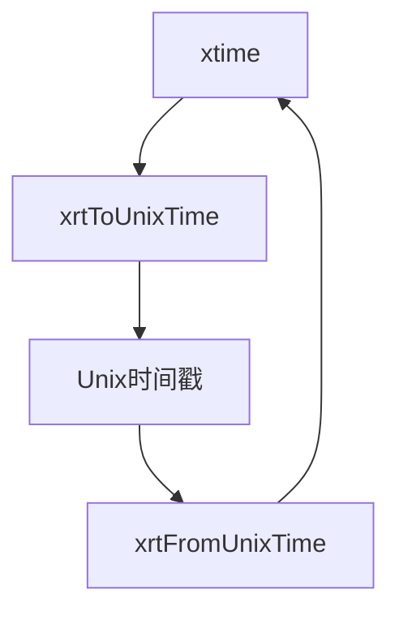

图表来源
- [lib/time.h](file://lib/time.h#L642-L653)

章节来源
- [lib/time.h](file://lib/time.h#L642-L653)

## 依赖关系分析
- 类型与全局
  - xtime：统一时间戳类型（int64）。
  - xCore：全局状态，包含高精度计时频率（Windows）、约等于容差等。
- 平台差异
  - Windows：QueryPerformanceCounter、Sleep、localtime_s/gmtime_s。
  - 其他平台：clock_gettime(CLOCK_MONOTONIC)、usleep、localtime_r/gmtime_r。
- 内部依赖
  - 日期计算依赖闰年判断与每月天数表。
  - 格式化/解析依赖内部格式单元解析与跳过策略。

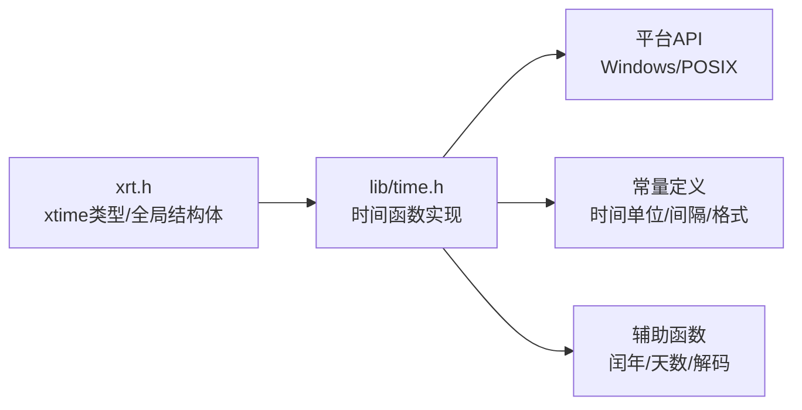

图表来源
- [xrt.h](file://xrt.h#L90-L184)
- [lib/time.h](file://lib/time.h#L1-L1403)

章节来源
- [xrt.h](file://xrt.h#L90-L184)
- [lib/time.h](file://lib/time.h#L1-L1403)

## 性能考虑
- 高精度计时
  - Windows：QueryPerformanceCounter提供高分辨率计数，结合Frequency进行换算，避免频繁系统调用。
  - POSIX：clock_gettime(CLOCK_MONOTONIC)提供单调时间，不受系统时间调整影响。
- 延时精度
  - xrtSleep在Windows使用Sleep，在POSIX使用usleep，精度受限于系统调度与实现。
- 格式化/解析
  - 自定义格式化/解析通过内部单元解析与跳过策略实现，复杂度与格式长度线性相关；建议尽量复用预设格式以减少解析开销。
- 内存管理
  - 所有返回字符串均需调用xrtFree释放，避免内存泄漏；临时内存池可用于批量释放。

[本节为通用性能讨论，不直接分析具体文件]

## 故障排查指南
- 常见问题
  - 字符串解析失败：检查格式与输入是否匹配；利用冗余前缀自动跳过与锚点定位功能。
  - 时区转换异常：确认xrtTimezoneOffset返回值；确保本地与UTC获取路径正确。
  - 闰年/月末边界：使用xrtDaysInMonth与xrtDateAdd进行边界测试。
  - 相对时间显示：检查xrtTimeApprox容差配置（xCore.iApproxTimeTol）。
- 调试建议
  - 使用测试用例中的断言与打印输出验证各函数行为。
  - 对性能敏感场景，优先使用xrtTimer进行采样，避免printf等I/O干扰。

章节来源
- [test/test_time.h](file://test/test_time.h#L1-L272)
- [lib/time.h](file://lib/time.h#L819-L838)

## 结论
该时间处理API提供了跨平台、线程安全、功能完备的时间处理能力，覆盖高精度计时、日期计算、格式化与解析、时区转换、边界与周期计算、Unix时间戳互转等核心需求。通过统一的xtime表示与平台适配层，开发者可在不同平台上获得一致的行为与良好的性能表现。建议在实际应用中结合测试用例与性能采样，合理选择格式化策略与容差配置，以满足业务需求。

[本节为总结性内容，不直接分析具体文件]

## 附录

### 常量与枚举参考
- 时间单位常量
  - XRT_TIME_MINUTE/XRT_TIME_HOUR/XRT_TIME_DAY/XRT_TIME_YEAR/XRT_TIME_LEAPYEAR/XRT_TIME_400YEAR/XRT_TIME_19700101
- 时间间隔常量
  - XRT_TIME_INTERVAL_YEAR/MONTH/DAY/HOUR/MINUTE/SECOND/WEEKDAY/QUARTER
- 时间格式常量
  - XRT_TIME_FORMAT_DATETIME/DATE/TIME

章节来源
- [docs/api-time.md](file://docs/api-time.md#L31-L65)

### 典型应用场景
- 定时任务
  - 使用xrtTimer进行任务周期控制，配合xrtSleep实现毫秒级延时。
- 性能测量
  - 在关键路径前后调用xrtTimer，计算差值评估耗时。
- 日志时间戳
  - 使用xrtNowStr或xrtTimeToStr输出带格式的时间戳，结合xrtTimeFormat自定义格式。
- 数据过期管理
  - 使用xrtDateAdd添加过期时间，用xrtDateDiff计算剩余时间，用xrtTimeInRange判断是否在有效期内。

章节来源
- [docs/api-time.md](file://docs/api-time.md#L171-L247)
- [docs/api-time.md](file://docs/api-time.md#L559-L645)
- [docs/api-time.md](file://docs/api-time.md#L651-L778)