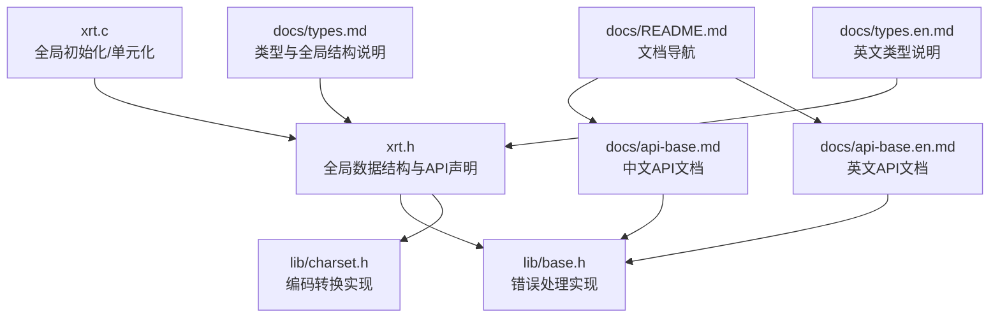
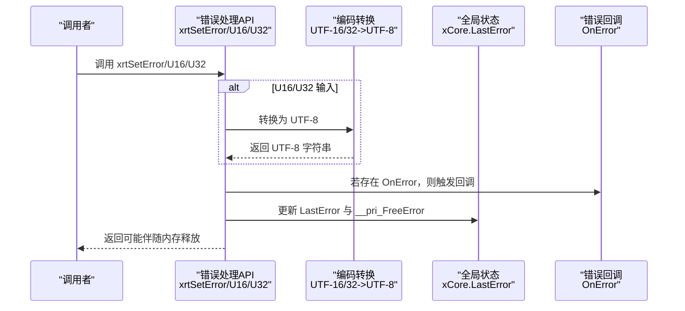
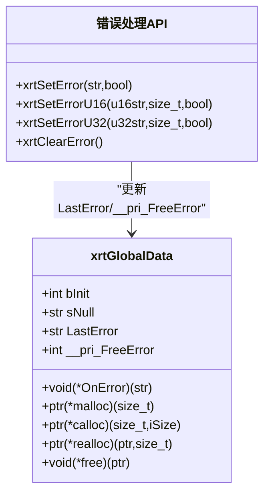
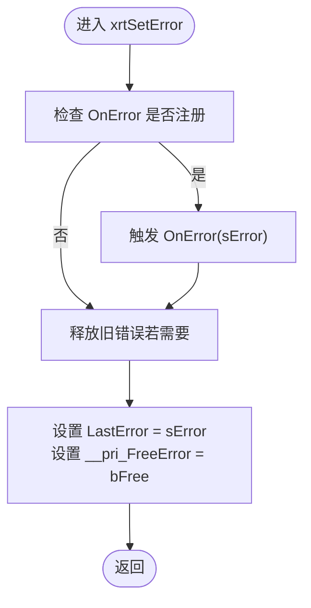
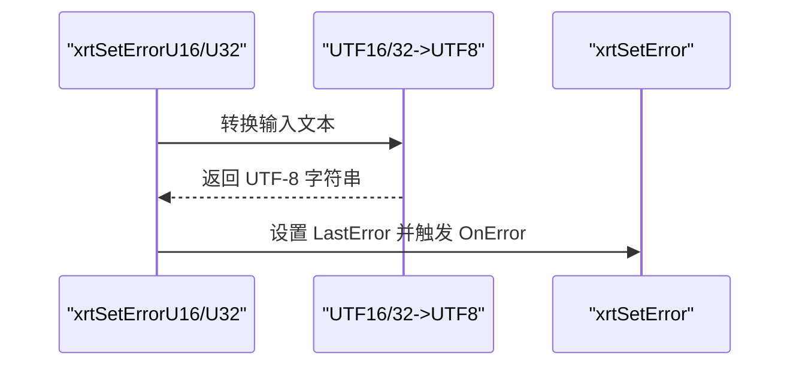
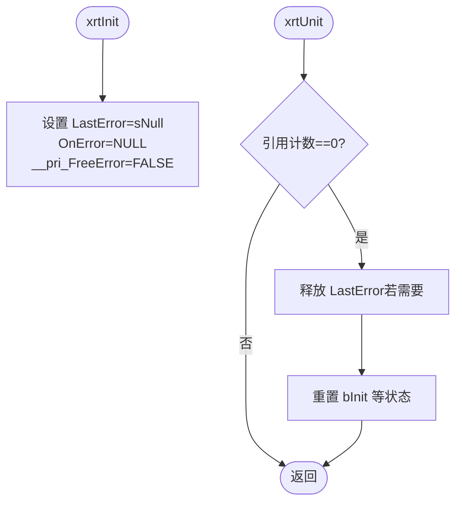
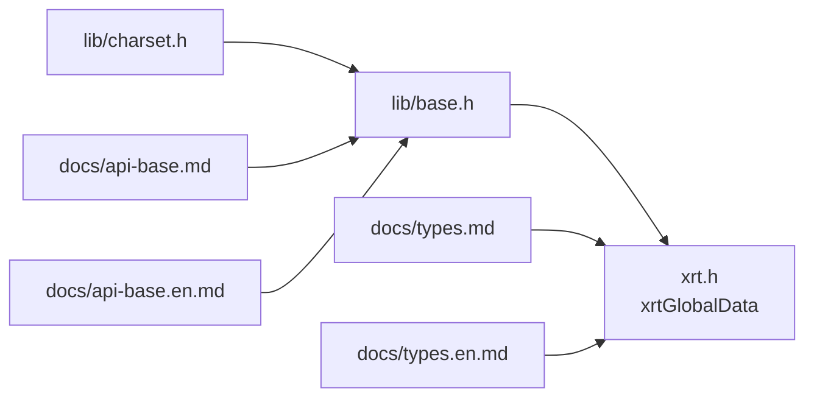

# 错误处理API

<cite>
**本文档引用的文件**
- [xrt.h](file://xrt.h)
- [xrt.c](file://xrt.c)
- [lib/base.h](file://lib/base.h)
- [lib/charset.h](file://lib/charset.h)
- [docs/api-base.md](file://docs/api-base.md)
- [docs/api-base.en.md](file://docs/api-base.en.md)
- [docs/types.md](file://docs/types.md)
- [docs/types.en.md](file://docs/types.en.md)
- [docs/README.md](file://docs/README.md)
</cite>

## 目录
1. [简介](#简介)
2. [项目结构](#项目结构)
3. [核心组件](#核心组件)
4. [架构总览](#架构总览)
5. [详细组件分析](#详细组件分析)
6. [依赖关系分析](#依赖关系分析)
7. [性能考量](#性能考量)
8. [故障排查指南](#故障排查指南)
9. [结论](#结论)
10. [附录](#附录)

## 简介
本文件系统性阐述 XRT 错误处理 API，重点覆盖以下函数：
- xrtSetError：设置错误信息（UTF-8）
- xrtSetErrorU16：设置错误信息（UTF-16），内部自动转换为 UTF-8
- xrtSetErrorU32：设置错误信息（UTF-32），内部自动转换为 UTF-8
- xrtClearError：清除错误信息

同时深入解释：
- 错误信息的设置与生命周期管理
- 编码转换（UTF-8/UTF-16/UTF-32）流程与注意事项
- 错误回调机制 OnError 的触发时机与使用方式
- 全局错误状态管理（LastError、__pri_FreeError）
- 错误处理最佳实践（错误传播、错误恢复、调试信息记录与日志集成）
- 常见错误场景与解决方案

## 项目结构
XRT 的错误处理能力由以下关键文件构成：
- 头文件与全局数据结构定义：xrt.h
- 全局初始化与单元化：xrt.c
- 错误处理与编码转换实现：lib/base.h、lib/charset.h
- 文档与示例：docs/api-base.md、docs/api-base.en.md、docs/types.md、docs/types.en.md、docs/README.md

**图表来源**
- [xrt.h](file://xrt.h#L120-L185)
- [xrt.c](file://xrt.c#L87-L186)
- [lib/base.h](file://lib/base.h#L88-L132)
- [lib/charset.h](file://lib/charset.h#L18-L200)
- [docs/api-base.md](file://docs/api-base.md#L600-L693)
- [docs/api-base.en.md](file://docs/api-base.en.md#L600-L699)
- [docs/types.md](file://docs/types.md#L285-L328)
- [docs/types.en.md](file://docs/types.en.md#L285-L323)
- [docs/README.md](file://docs/README.md#L1-L200)

**章节来源**
- [xrt.h](file://xrt.h#L120-L185)
- [xrt.c](file://xrt.c#L87-L186)
- [docs/README.md](file://docs/README.md#L1-L200)

## 核心组件
- 全局数据结构 xrtGlobalData：包含 LastError、__pri_FreeError、OnError 等字段，用于维护全局错误状态与回调。
- 错误处理函数族：xrtSetError、xrtSetErrorU16、xrtSetErrorU32、xrtClearError。
- 编码转换函数族：xrtUTF8to16、xrtUTF16to8、xrtUTF8to32、xrtUTF32to8 等，支撑 UTF-16/UTF-32 到 UTF-8 的转换。
- 初始化与单元化：xrtInit 初始化全局状态；xrtUnit 在引用计数归零时释放资源。

**章节来源**
- [xrt.h](file://xrt.h#L120-L185)
- [lib/base.h](file://lib/base.h#L88-L132)
- [lib/charset.h](file://lib/charset.h#L18-L200)
- [xrt.c](file://xrt.c#L87-L226)

## 架构总览
错误处理的整体架构围绕“全局状态 + 回调 + 编码转换”展开。调用者通过错误处理函数设置错误，库内部可选择触发 OnError 回调，并将错误信息统一保存在 LastError 中，配合 __pri_FreeError 控制内存释放策略。

**图表来源**
- [lib/base.h](file://lib/base.h#L88-L132)
- [lib/charset.h](file://lib/charset.h#L18-L200)
- [xrt.h](file://xrt.h#L120-L185)

## 详细组件分析

### 组件A：全局错误状态管理
- LastError：保存最近一次错误信息的字符串指针。
- __pri_FreeError：布尔标记，指示 LastError 是否需要由库释放。
- OnError：错误回调函数指针，当设置错误时可被触发。
- 生命周期：xrtInit 初始化；xrtUnit 在引用计数归零时释放 LastError（若需要）。

**图表来源**
- [xrt.h](file://xrt.h#L120-L185)
- [lib/base.h](file://lib/base.h#L88-L132)

**章节来源**
- [xrt.h](file://xrt.h#L120-L185)
- [xrt.c](file://xrt.c#L87-L226)

### 组件B：错误设置与回调机制
- xrtSetError：直接设置 LastError，并根据 bFree 标记决定是否释放旧错误；随后触发 OnError（若已注册）。
- xrtSetErrorU16/U32：先将输入的 UTF-16/UTF-32 文本转换为 UTF-8，再调用 xrtSetError。
- xrtClearError：释放 LastError（若需要）并重置为 sNull。

**图表来源**
- [lib/base.h](file://lib/base.h#L88-L132)

**章节来源**
- [lib/base.h](file://lib/base.h#L88-L132)
- [docs/api-base.md](file://docs/api-base.md#L600-L693)
- [docs/api-base.en.md](file://docs/api-base.en.md#L600-L699)

### 组件C：编码转换与错误设置
- UTF-16/UTF-32 到 UTF-8 的转换由 lib/charset.h 提供的函数完成，例如 xrtUTF16to8、xrtUTF32to8。
- xrtSetErrorU16/U32 在转换后调用 xrtSetError，并传入 bFree 以控制内存释放。

**图表来源**
- [lib/base.h](file://lib/base.h#L102-L117)
- [lib/charset.h](file://lib/charset.h#L160-L200)

**章节来源**
- [lib/base.h](file://lib/base.h#L102-L117)
- [lib/charset.h](file://lib/charset.h#L160-L200)

### 组件D：初始化与单元化对错误状态的影响
- xrtInit：初始化 xCore，设置 LastError 为 sNull，OnError 为空，__pri_FreeError 为 FALSE。
- xrtUnit：当引用计数归零时，释放 LastError（若需要），并清理其他资源。

**图表来源**
- [xrt.c](file://xrt.c#L87-L226)

**章节来源**
- [xrt.c](file://xrt.c#L87-L226)

## 依赖关系分析
- 错误处理 API 依赖全局数据结构 xrtGlobalData。
- xrtSetErrorU16/U32 依赖编码转换函数（xrtUTF16to8、xrtUTF32to8）。
- 文档层提供使用示例与最佳实践，指导 OnError 回调与错误信息管理。

**图表来源**
- [lib/base.h](file://lib/base.h#L88-L132)
- [lib/charset.h](file://lib/charset.h#L18-L200)
- [xrt.h](file://xrt.h#L120-L185)
- [docs/api-base.md](file://docs/api-base.md#L600-L693)
- [docs/api-base.en.md](file://docs/api-base.en.md#L600-L699)
- [docs/types.md](file://docs/types.md#L285-L328)
- [docs/types.en.md](file://docs/types.en.md#L285-L323)

**章节来源**
- [lib/base.h](file://lib/base.h#L88-L132)
- [lib/charset.h](file://lib/charset.h#L18-L200)
- [xrt.h](file://xrt.h#L120-L185)
- [docs/api-base.md](file://docs/api-base.md#L600-L693)
- [docs/api-base.en.md](file://docs/api-base.en.md#L600-L699)
- [docs/types.md](file://docs/types.md#L285-L328)
- [docs/types.en.md](file://docs/types.en.md#L285-L323)

## 性能考量
- 回调触发成本：每次设置错误都会触发 OnError（若已注册），在高频错误场景下应避免在回调中执行阻塞或昂贵操作。
- 编码转换成本：xrtSetErrorU16/U32 会进行 UTF-16/UTF-32 到 UTF-8 的转换，对于长文本或频繁调用应考虑缓存或预转换策略。
- 内存释放策略：__pri_FreeError 为 TRUE 时，库会在下次设置错误或清除错误时释放旧错误字符串，减少调用方负担但增加额外释放成本。

[本节为通用建议，不直接分析具体文件]

## 故障排查指南
- 回调未触发
  - 检查是否在调用前设置了 xCore.OnError。
  - 确认 OnError 指针非空且有效。
- 错误信息显示异常（乱码）
  - 确认输入文本编码正确；使用 xrtSetErrorU16/U32 时，确保源文本为 UTF-16/UTF-32。
  - 检查转换后的 UTF-8 是否包含非法序列。
- 内存泄漏或重复释放
  - 对于 bFree=TRUE 的动态字符串，确保只由库释放一次；避免调用方再次释放。
  - 使用 xrtClearError 清理 LastError，防止悬挂引用。
- 多线程环境下的问题
  - 全局错误状态为线程不安全，建议在单线程上下文中使用，或自行加锁保护。

**章节来源**
- [lib/base.h](file://lib/base.h#L88-L132)
- [docs/types.md](file://docs/types.md#L670-L725)
- [docs/types.en.md](file://docs/types.en.md#L670-L725)

## 结论
XRT 的错误处理 API 通过全局状态与回调机制实现了简洁而强大的错误管理能力。结合编码转换函数，能够统一处理 UTF-8/UTF-16/UTF-32 的错误信息。遵循本文档的最佳实践，可在保证线程安全的前提下高效地传播、恢复与记录错误信息。

[本节为总结性内容，不直接分析具体文件]

## 附录

### API 使用要点与示例路径
- 设置 UTF-8 错误信息：参考示例路径
  - [docs/api-base.md 示例](file://docs/api-base.md#L600-L624)
  - [docs/api-base.en.md 示例](file://docs/api-base.en.md#L600-L624)
- 设置 UTF-16 错误信息：参考示例路径
  - [docs/api-base.md 示例](file://docs/api-base.md#L645-L663)
  - [docs/api-base.en.md 示例](file://docs/api-base.en.md#L645-L663)
- 设置 UTF-32 错误信息：参考示例路径
  - [docs/api-base.md 示例](file://docs/api-base.md#L667-L683)
  - [docs/api-base.en.md 示例](file://docs/api-base.en.md#L667-L683)
- 清除错误信息：参考示例路径
  - [docs/api-base.md 示例](file://docs/api-base.md#L686-L699)
  - [docs/api-base.en.md 示例](file://docs/api-base.en.md#L686-L699)

### 错误处理最佳实践清单
- 明确错误来源：在每个可能失败的函数中设置明确的错误信息。
- 选择合适的编码：优先使用 UTF-8；需要跨平台或系统接口时使用 xrtSetErrorU16/U32。
- 使用回调进行集中处理：通过 OnError 实现统一的日志记录、告警或上报。
- 正确管理内存：对动态字符串设置 bFree=TRUE，避免重复释放。
- 错误传播：在调用链中保持错误状态，必要时包装为更高层的错误信息。
- 错误恢复：在捕获错误后及时调用 xrtClearError，避免污染后续调用。
- 调试与日志：在 OnError 中输出时间戳、调用栈片段（如可用）与上下文信息。

**章节来源**
- [docs/api-base.md](file://docs/api-base.md#L600-L693)
- [docs/api-base.en.md](file://docs/api-base.en.md#L600-L699)
- [docs/types.md](file://docs/types.md#L670-L725)
- [docs/types.en.md](file://docs/types.en.md#L670-L725)