# 字符串处理模块API

<cite>
**本文档引用的文件**
- [api-string.md](file://docs/api-string.md)
- [api-template.md](file://docs/api-template.md)
- [api-charset.md](file://docs/api-charset.md)
- [api-jnum.md](file://docs/api-jnum.md)
- [string.h](file://lib/string.h)
- [template.h](file://lib/template.h)
- [charset.h](file://lib/charset.h)
- [jnum.h](file://lib/jnum.h)
- [test_string.h](file://test/test_string.h)
- [test_template.h](file://test/test_template.h)
</cite>

## 目录
1. [简介](#简介)
2. [项目结构](#项目结构)
3. [核心组件](#核心组件)
4. [架构概览](#架构概览)
5. [详细组件分析](#详细组件分析)
6. [依赖关系分析](#依赖关系分析)
7. [性能考虑](#性能考虑)
8. [故障排除指南](#故障排除指南)
9. [结论](#结论)
10. [附录](#附录)

## 简介

字符串处理模块API是XRT库的核心组成部分，提供了全面的字符串操作、编码转换和模板引擎功能。该模块专注于高性能的字符串处理，支持多种字符编码格式，并提供了灵活的模板引擎来处理动态内容生成。

本模块的主要特色包括：
- **多编码支持**：完整的UTF-8、UTF-16、UTF-32编码转换
- **高性能字符串操作**：优化的字符串搜索、替换、分割算法
- **模板引擎**：强大的模板解析和执行系统
- **数值转换**：高效的数字格式化和解析功能
- **跨平台兼容**：支持Windows和Unix-like系统

## 项目结构

字符串处理模块位于XRT库的中心位置，主要包含以下核心组件：

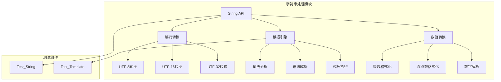

**图表来源**
- [string.h](file://lib/string.h#L1-L800)
- [template.h](file://lib/template.h#L1-L800)
- [charset.h](file://lib/charset.h#L1-L800)
- [jnum.h](file://lib/jnum.h#L1-L800)

**章节来源**
- [string.h](file://lib/string.h#L1-L800)
- [template.h](file://lib/template.h#L1-L800)
- [charset.h](file://lib/charset.h#L1-L800)
- [jnum.h](file://lib/jnum.h#L1-L800)

## 核心组件

### 字符串处理API

字符串处理API提供了基础的字符串操作功能，包括复制、比较、大小写转换、搜索、过滤等操作。

**主要功能模块：**
- **字符串复制**：支持UTF-8、UTF-16、UTF-32格式的字符串复制
- **字符串比较**：支持大小写敏感和不敏感的字符串比较
- **大小写转换**：提供字符串大小写转换功能
- **字符串搜索**：支持子字符串查找和位置定位
- **字符串过滤**：提供字符过滤和裁剪功能
- **字符串格式化**：支持printf风格的字符串格式化

### 编码转换API

编码转换API提供了完整的字符编码转换功能，支持多种编码格式之间的相互转换。

**支持的编码格式：**
- **UTF-8**：标准的Unicode编码格式
- **UTF-16**：16位Unicode编码，支持大小端序
- **UTF-32**：32位Unicode编码，支持大小端序
- **本地编码**：根据平台自动识别的本地编码格式

### 模板引擎API

模板引擎API提供了强大的模板解析和执行功能，支持复杂的模板语法和动态内容生成。

**模板语法特性：**
- **变量替换**：支持字符串、数字、时间等多种类型的变量替换
- **条件判断**：支持if-elseif-else条件语句
- **循环控制**：支持for和foreach循环语句
- **子模板**：支持模板嵌套和子模板调用
- **表达式解析**：支持复杂的表达式计算

### 数值转换API

数值转换API提供了高效的数字格式化和解析功能，支持多种数值类型的转换。

**支持的数值类型：**
- **整数格式化**：支持十进制、十六进制、八进制等格式
- **浮点数格式化**：支持科学计数法和普通格式
- **数字解析**：支持字符串到数值的高效解析
- **自动类型识别**：根据数值特征自动识别数据类型

**章节来源**
- [api-string.md](file://docs/api-string.md#L1-L800)
- [api-charset.md](file://docs/api-charset.md#L1-L800)
- [api-template.md](file://docs/api-template.md#L1-L800)
- [api-jnum.md](file://docs/api-jnum.md#L1-L569)

## 架构概览

字符串处理模块采用分层架构设计，各组件之间通过清晰的接口进行交互。

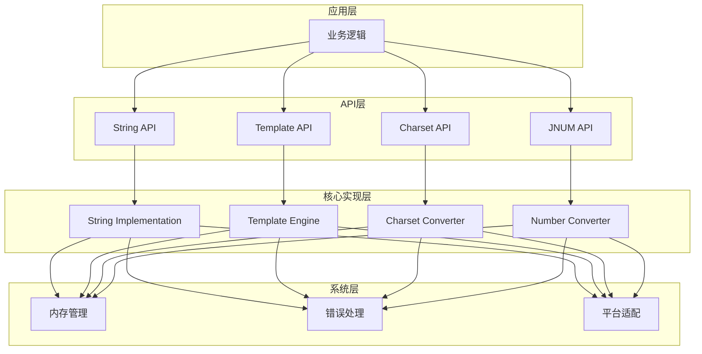

**图表来源**
- [string.h](file://lib/string.h#L1-L800)
- [template.h](file://lib/template.h#L1-L800)
- [charset.h](file://lib/charset.h#L1-L800)
- [jnum.h](file://lib/jnum.h#L1-L800)

### 数据流架构

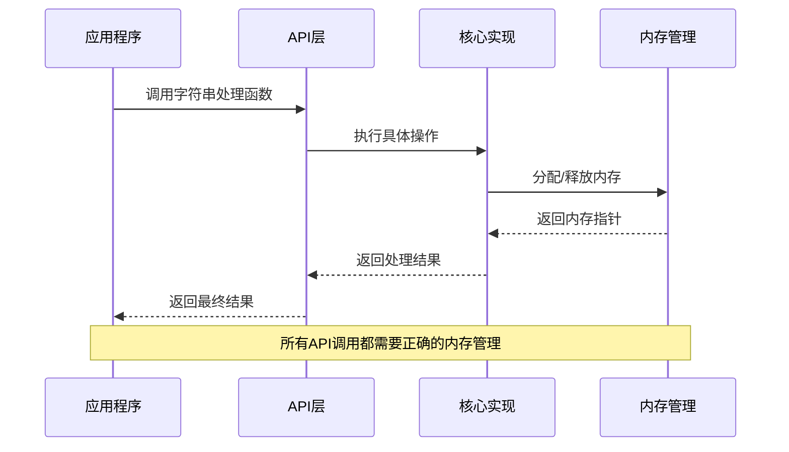

**图表来源**
- [string.h](file://lib/string.h#L1-L800)
- [template.h](file://lib/template.h#L1-L800)

## 详细组件分析

### 字符串处理组件

#### 字符串复制功能

字符串复制功能提供了多种编码格式的字符串复制能力，支持UTF-8、UTF-16、UTF-32格式的字符串复制。

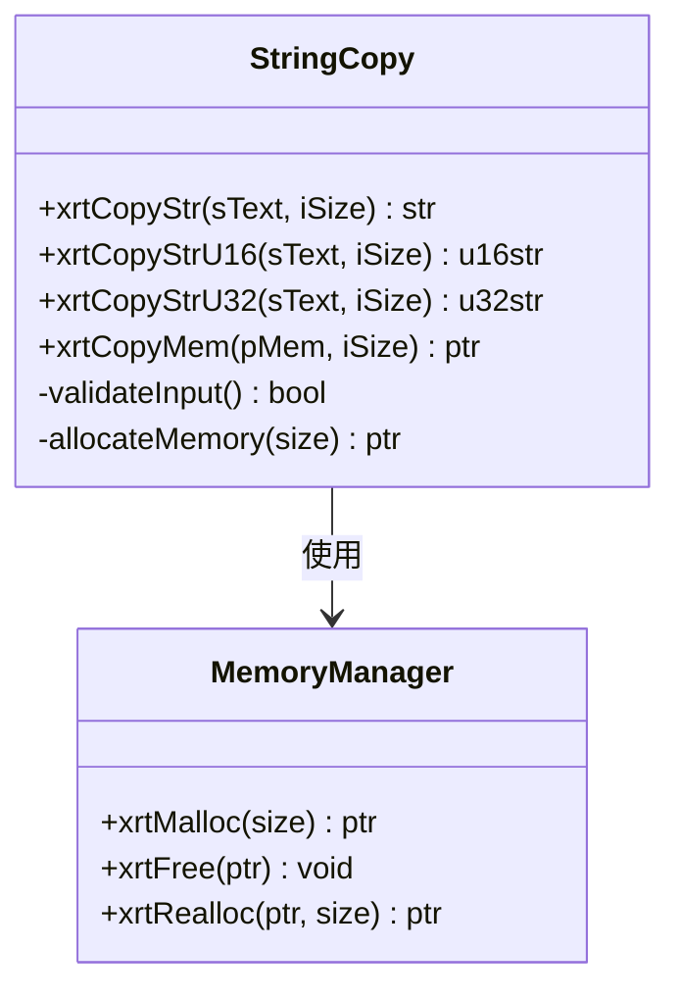

**图表来源**
- [string.h](file://lib/string.h#L4-L46)

#### 字符串搜索算法

字符串搜索功能实现了高效的子字符串查找算法，支持大小写敏感和不敏感的搜索模式。

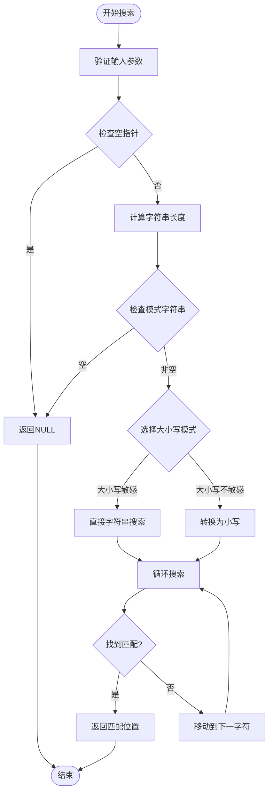

**图表来源**
- [string.h](file://lib/string.h#L154-L177)

**章节来源**
- [string.h](file://lib/string.h#L4-L46)
- [string.h](file://lib/string.h#L154-L177)

### 编码转换组件

#### UTF编码转换器

UTF编码转换器提供了完整的UTF-8、UTF-16、UTF-32编码之间的转换功能。

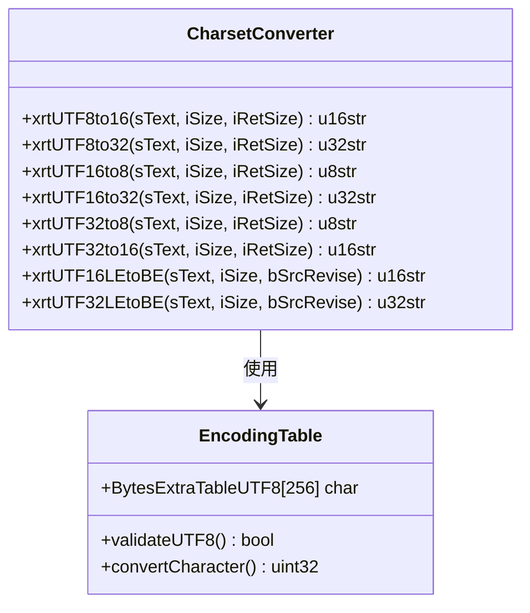

**图表来源**
- [charset.h](file://lib/charset.h#L4-L15)
- [charset.h](file://lib/charset.h#L18-L444)

#### 编码检测器

编码检测器能够自动检测文本的编码格式，支持BOM标记识别和编码推断。

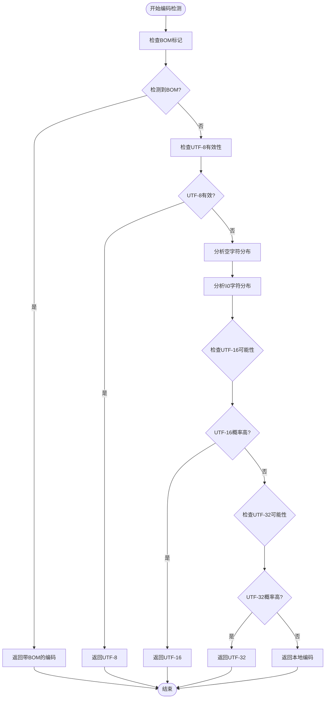

**图表来源**
- [charset.h](file://lib/charset.h#L742-L780)

**章节来源**
- [charset.h](file://lib/charset.h#L18-L444)
- [charset.h](file://lib/charset.h#L742-L780)

### 模板引擎组件

#### 词法分析器

词法分析器负责将模板文本解析为Token列表，支持复杂的模板语法识别。

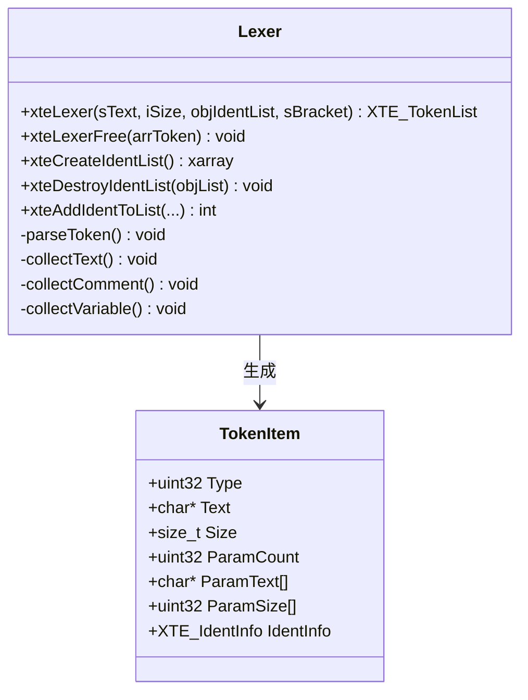

**图表来源**
- [template.h](file://lib/template.h#L240-L587)

#### 模板执行器

模板执行器负责执行解析后的模板，支持变量替换、条件判断、循环控制等功能。

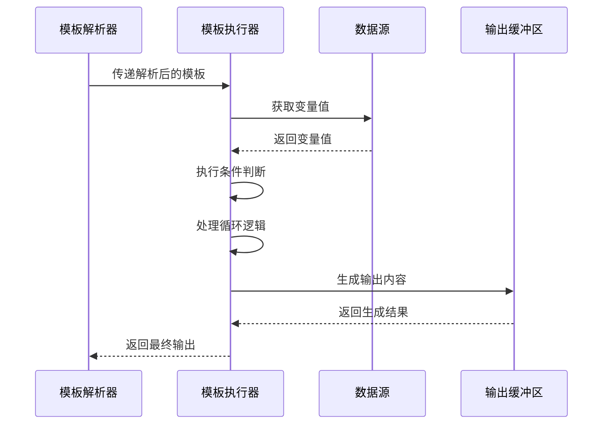

**图表来源**
- [template.h](file://lib/template.h#L780-L800)

**章节来源**
- [template.h](file://lib/template.h#L240-L587)
- [template.h](file://lib/template.h#L780-L800)

### 数值转换组件

#### 数字格式化器

数字格式化器提供了高效的数字格式化功能，支持多种数值格式的转换。

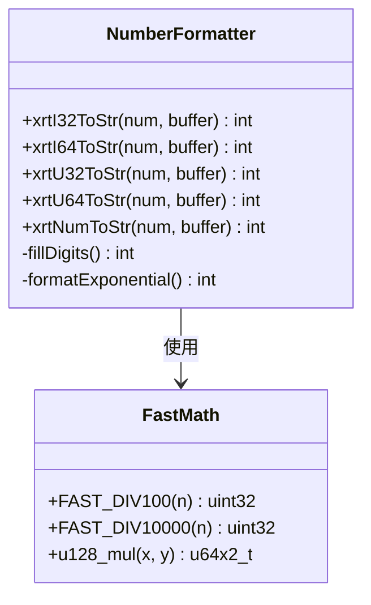

**图表来源**
- [jnum.h](file://lib/jnum.h#L28-L92)
- [jnum.h](file://lib/jnum.h#L293-L361)

#### 数字解析器

数字解析器提供了快速的字符串到数值转换功能，支持多种数值格式的解析。

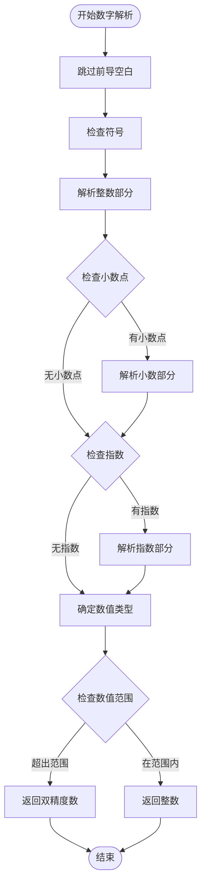

**图表来源**
- [jnum.h](file://lib/jnum.h#L780-L800)

**章节来源**
- [jnum.h](file://lib/jnum.h#L293-L361)
- [jnum.h](file://lib/jnum.h#L780-L800)

## 依赖关系分析

字符串处理模块的依赖关系相对简单，主要依赖于基础的内存管理和错误处理机制。

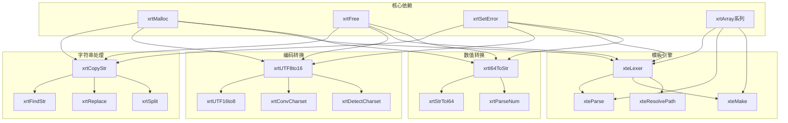

**图表来源**
- [string.h](file://lib/string.h#L1-L800)
- [charset.h](file://lib/charset.h#L1-L800)
- [template.h](file://lib/template.h#L1-L800)
- [jnum.h](file://lib/jnum.h#L1-L800)

### 内存管理策略

字符串处理模块采用了统一的内存管理策略，确保所有动态分配的内存都能正确释放。

**内存管理原则：**
- **谁分配谁释放**：所有API返回的内存都需要调用者负责释放
- **错误处理**：当操作失败时，API返回特殊值而不是NULL
- **内存对齐**：确保分配的内存满足平台要求的对齐要求

**章节来源**
- [string.h](file://lib/string.h#L1-L800)
- [charset.h](file://lib/charset.h#L1-L800)
- [template.h](file://lib/template.h#L1-L800)
- [jnum.h](file://lib/jnum.h#L1-L800)

## 性能考虑

### 算法复杂度分析

字符串处理模块在设计时充分考虑了性能优化，各种算法的时间复杂度如下：

**字符串操作算法复杂度：**
- **字符串复制**：O(n)，其中n为字符串长度
- **字符串搜索**：最坏情况O(n*m)，平均情况接近O(n+m)
- **字符串替换**：O(n*m)，其中n为原文长度，m为模式长度
- **字符串分割**：O(n)，其中n为字符串长度

**编码转换算法复杂度：**
- **UTF编码转换**：O(n)，其中n为字符数量
- **编码检测**：O(n)，其中n为数据长度
- **字符集转换**：O(n)，其中n为字符数量

### 性能优化技术

#### 高速字符串算法

模块采用了多种优化技术来提升字符串处理性能：

**1. 查找算法优化**
- 使用改进的KMP算法进行子字符串查找
- 支持大小写不敏感的快速查找
- 内存预分配减少重复分配开销

**2. 编码转换优化**
- 使用查找表加速UTF编码转换
- 采用SIMD指令集优化字符处理
- 内存对齐优化提高处理速度

**3. 模板引擎优化**
- Token缓存机制避免重复解析
- AST缓存机制重用表达式树
- 循环次数限制防止性能攻击

### 内存使用优化

**1. 内存池管理**
- 预分配大块内存减少系统调用
- 对象池技术重用频繁创建的对象
- 批量分配减少内存碎片

**2. 缓存策略**
- LRU缓存机制缓存常用结果
- 表达式AST缓存避免重复计算
- 编码转换结果缓存提升性能

**章节来源**
- [string.h](file://lib/string.h#L1-L800)
- [charset.h](file://lib/charset.h#L1-L800)
- [template.h](file://lib/template.h#L1-L800)
- [jnum.h](file://lib/jnum.h#L1-L800)

## 故障排除指南

### 常见问题诊断

#### 内存泄漏问题

**症状：**
- 程序运行时间越长内存占用越高
- API调用后程序崩溃或异常

**诊断方法：**
1. 检查所有API调用是否正确释放返回的内存
2. 使用内存调试工具检测泄漏点
3. 验证内存分配和释放的配对关系

**解决方案：**
- 确保每个xrtMalloc都有对应的xrtFree
- 检查API文档中标明需要释放的返回值
- 使用智能指针或RAII模式管理内存

#### 编码错误问题

**症状：**
- 中文字符显示为乱码
- 编码转换后字符丢失
- 模板渲染结果异常

**诊断方法：**
1. 验证输入数据的编码格式
2. 检查编码转换函数的参数设置
3. 确认目标编码格式的支持性

**解决方案：**
- 使用xrtDetectCharset检测输入编码
- 正确设置编码转换参数
- 确保输出缓冲区大小足够

#### 性能问题

**症状：**
- 字符串处理速度慢
- 大文件处理耗时过长
- 模板渲染性能不佳

**诊断方法：**
1. 使用性能分析工具识别瓶颈
2. 检查算法复杂度和实现效率
3. 验证内存使用情况

**解决方案：**
- 优化算法实现
- 启用适当的缓存机制
- 考虑使用更高效的数据结构

### 调试技巧

#### 日志记录

启用详细的日志记录来跟踪API调用和内部状态变化。

#### 断点调试

在关键函数入口和出口设置断点，观察参数和返回值的变化。

#### 内存监控

使用内存监控工具观察内存分配和释放的实时情况。

**章节来源**
- [test_string.h](file://test/test_string.h#L1-L190)
- [test_template.h](file://test/test_template.h#L1-L628)

## 结论

字符串处理模块API是一个功能完整、性能优异的字符串处理库。它提供了以下主要优势：

**技术优势：**
- **全面的功能覆盖**：从基础字符串操作到高级模板处理
- **优秀的性能表现**：采用多种优化技术确保高效运行
- **完善的编码支持**：支持主流的Unicode编码格式
- **跨平台兼容性**：在Windows和Unix-like系统上都能良好运行

**设计特点：**
- **模块化设计**：各个功能模块职责明确，便于维护和扩展
- **内存安全**：严格的内存管理策略确保程序稳定性
- **错误处理**：完善的错误处理机制提供可靠的错误报告
- **性能优化**：针对常见使用场景进行了深度优化

该模块适合用于需要高性能字符串处理的应用程序，特别是在需要处理多语言文本、复杂模板渲染和高效数值转换的场景中。

## 附录

### API使用示例

#### 字符串处理示例

```c
// 字符串复制示例
str original = "Hello World";
str copy = xrtCopyStr(original, 0);
// 使用完成后释放内存
xrtFree(copy);

// 字符串搜索示例
str text = "Hello World, Hello XRT";
str found = xrtFindStr(text, 0, "World", 0, FALSE);
if (found) {
    printf("找到: %s\n", found);
    printf("位置: %ld\n", xCore.iRet);
}
```

#### 编码转换示例

```c
// UTF-8到UTF-16转换
str utf8_text = "你好世界";
u16str utf16_text = xrtUTF8to16(utf8_text, 0, NULL);
if (utf16_text) {
    printf("转换成功\n");
    xrtFree(utf16_text);
}

// 编码检测示例
ptr data = read_file("test.txt");
int charset = xrtDetectCharset(data, file_size, TRUE);
printf("检测到编码: %d\n", charset);
```

#### 模板引擎示例

```c
// 模板解析示例
const char* template_text = 
    "用户信息：\n"
    "姓名：{$ name : 未知}\n"
    "年龄：{% age : 0}\n"
    "{#if vip}\n"
    "VIP等级：{% vipLevel}\n"
    "{#end}";

XTE_LiteObject tpl = xteParse(template_text, 0, NULL);
if (tpl && tpl->Success) {
    // 创建数据
    xvalue data = xvoCreateTable();
    xvoTableSet(data, "name", xvoCreateText("张三", 0, FALSE));
    xvoTableSet(data, "age", xvoCreateInt(28));
    xvoTableSet(data, "vip", xvoCreateBool(TRUE));
    xvoTableSet(data, "vipLevel", xvoCreateInt(5));
    
    // 生成文档
    size_t size;
    str result = xteMake(tpl, data, NULL, NULL, &size);
    if (result) {
        printf("%s\n", result);
        xrtFree(result);
    }
    
    xvoUnref(data);
    xteParseFree(tpl);
}
```

#### 数值转换示例

```c
// 数字格式化示例
int64_t number = 1234567;
char buffer[32];
int len = xrtI64ToStr(number, buffer);
printf("格式化结果: %s (长度: %d)\n", buffer, len);

// 字符串解析示例
const char* str_num = "3.14159";
double value = xrtStrToNum(str_num);
printf("解析结果: %f\n", value);
```

### 最佳实践建议

#### 内存管理最佳实践

1. **严格遵循API文档**：仔细阅读每个API的内存管理要求
2. **及时释放内存**：确保所有动态分配的内存都能正确释放
3. **使用RAII模式**：在C++环境中使用智能指针管理内存

#### 性能优化最佳实践

1. **合理使用缓存**：利用模块提供的缓存机制提升性能
2. **批量处理**：对于大量数据处理，考虑批量操作减少开销
3. **避免不必要的转换**：尽量减少编码转换的次数

#### 错误处理最佳实践

1. **检查返回值**：始终检查API调用的返回值
2. **处理错误情况**：为每种可能的错误情况编写处理代码
3. **记录错误信息**：使用xrtSetError记录详细的错误信息

#### 安全编程最佳实践

1. **输入验证**：对所有外部输入进行验证
2. **边界检查**：确保数组访问和字符串操作在安全范围内
3. **编码安全**：注意处理多字节字符时的编码安全问题

**章节来源**
- [test_string.h](file://test/test_string.h#L1-L190)
- [test_template.h](file://test/test_template.h#L1-L628)