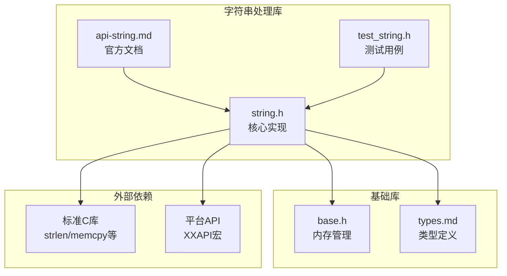
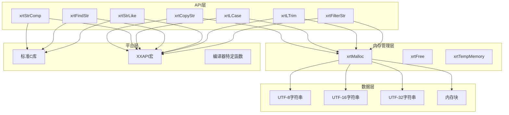
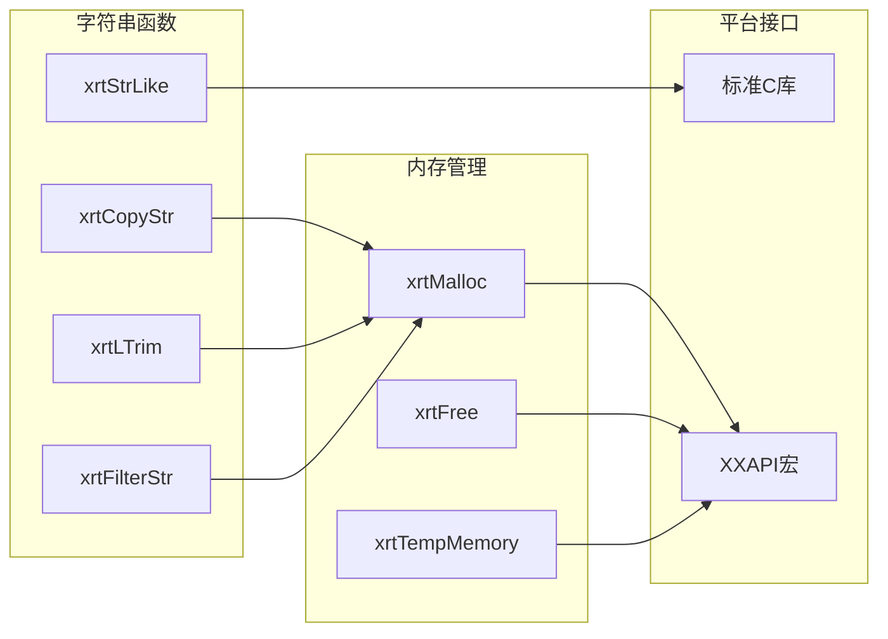
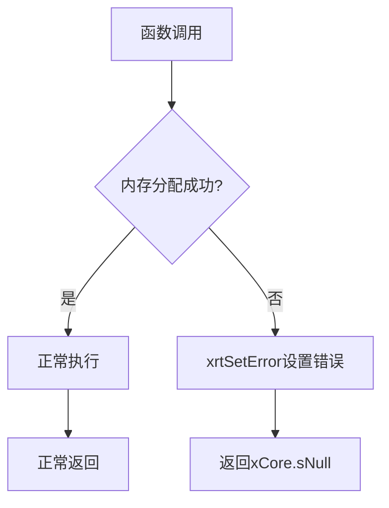

# 字符串操作API

<cite>
**本文引用的文件**
- [lib/string.h](file://lib/string.h)
- [docs/api-string.md](file://docs/api-string.md)
- [test/test_string.h](file://test/test_string.h)
- [lib/base.h](file://lib/base.h)
- [docs/types.md](file://docs/types.md)
</cite>

## 目录
1. [简介](#简介)
2. [项目结构](#项目结构)
3. [核心组件](#核心组件)
4. [架构概览](#架构概览)
5. [详细组件分析](#详细组件分析)
6. [依赖关系分析](#依赖关系分析)
7. [性能考虑](#性能考虑)
8. [故障排除指南](#故障排除指南)
9. [结论](#结论)
10. [附录](#附录)

## 简介
本文档系统性地介绍了XRT库中的字符串操作API，涵盖字符串复制、比较、大小写转换、搜索、通配符匹配、裁剪、过滤等核心功能。文档详细说明了每个函数的参数含义、返回值、内存管理规则、使用示例和注意事项，并特别强调了UTF-8/UTF-16/UTF-32编码支持、性能优化建议和常见错误处理方法。

## 项目结构
XRT字符串处理库位于lib目录下的string.h文件中，配合完整的API文档和测试用例，形成了完整的功能体系：



**图表来源**
- [lib/string.h](file://lib/string.h#L1-L1552)
- [docs/api-string.md](file://docs/api-string.md#L1-L200)
- [lib/base.h](file://lib/base.h#L1-L132)

**章节来源**
- [lib/string.h](file://lib/string.h#L1-L1552)
- [docs/api-string.md](file://docs/api-string.md#L1-L200)

## 核心组件
XRT字符串处理库提供了全面的字符串操作能力，主要分为以下几大类：

### 字符串复制与内存管理
- **xrtCopyStr**: 复制UTF-8字符串，返回新分配的字符串副本
- **xrtCopyStrU16**: 复制UTF-16字符串，支持宽字符处理
- **xrtCopyStrU32**: 复制UTF-32字符串，处理32位字符集
- **xrtCopyMem**: 复制任意内存块，用于通用数据复制

### 字符串比较与搜索
- **xrtStrComp**: 字符串比较，支持大小写敏感/不敏感选项
- **xrtFindStr**: 查找子字符串，返回首次匹配位置
- **xrtInStr**: 查找子字符串位置，返回1基索引
- **xrtCheckStr**: 检查字符串是否包含指定字符集合

### 大小写转换
- **xrtLCase**: 转换为小写，支持UTF-8多字节字符
- **xrtUCase**: 转换为大写，保持字符完整性

### 通配符匹配
- **xrtStrLike**: 通配符模式匹配，支持*和?通配符

### 字符串裁剪与过滤
- **xrtLTrim**: 左侧裁剪，移除指定字符
- **xrtRTrim**: 右侧裁剪，移除指定字符  
- **xrtTrim**: 两侧裁剪，移除指定字符
- **xrtFilterStr**: 过滤字符，移除指定字符集合

**章节来源**
- [lib/string.h](file://lib/string.h#L5-L776)
- [docs/api-string.md](file://docs/api-string.md#L59-L782)

## 架构概览
XRT字符串处理库采用模块化设计，每个函数都是独立的功能单元，通过统一的内存管理机制进行资源控制：



**图表来源**
- [lib/string.h](file://lib/string.h#L1-L1552)
- [lib/base.h](file://lib/base.h#L1-L132)

## 详细组件分析

### 字符串复制系列

#### xrtCopyStr - UTF-8字符串复制
该函数提供线程安全的UTF-8字符串复制功能：

**函数签名与参数**
```c
XXAPI str xrtCopyStr(str sText, size_t iSize)
```

**参数说明**：
- `sText`: 源UTF-8字符串指针
- `iSize`: 源字符串长度（字节），0表示自动计算

**返回值**：
- 成功：新分配的字符串副本
- 失败：返回xCore.sNull

**内存管理**：
- 需要使用xrtFree释放返回的内存
- 返回字符串自动添加'\0'终止符

**实现特点**：
- 线程安全的内存分配
- 自动长度检测
- 异常情况下的安全返回

#### xrtCopyStrU16 - UTF-16字符串复制
支持宽字符集的字符串复制：

**关键特性**：
- 处理UTF-16编码字符
- 字符数而非字节数的长度计算
- 宽字符完整性保证

#### xrtCopyStrU32 - UTF-32字符串复制
处理32位字符集的完整复制：

**适用场景**：
- 处理Unicode代理对
- 支持超大码点范围
- 确保字符边界完整性

#### xrtCopyMem - 通用内存复制
提供任意内存块的安全复制：

**使用场景**：
- 非字符串的二进制数据复制
- 结构体数据的深拷贝
- 缓冲区数据的完整复制

**章节来源**
- [lib/string.h](file://lib/string.h#L5-L46)
- [docs/api-string.md](file://docs/api-string.md#L59-L165)

### 字符串比较与搜索

#### xrtStrComp - 字符串比较
提供灵活的字符串比较功能：

**函数原型**：
```c
XXAPI int xrtStrComp(str s1, str s2, size_t iSize, bool bCase)
```

**参数详解**：
- `s1/s2`: 待比较的两个字符串
- `iSize`: 比较长度（0表示比较到字符串结束）
- `bCase`: 大小写处理标志

**返回值语义**：
- `0`: 两个字符串相等
- `<0`: s1小于s2
- `>0`: s1大于s2

**平台兼容性**：
- Windows平台使用stricmp/strnicmp
- POSIX系统使用strcasecmp/strncasecmp

#### xrtFindStr - 子字符串查找
查找子字符串并返回首次匹配位置：

**实现策略**：
- 支持大小写敏感/不敏感查找
- 使用memmem进行高效内存搜索
- 自动处理UTF-8字符边界

**返回值**：
- 找到：返回子字符串在原字符串中的位置指针
- 未找到：返回NULL

#### xrtInStr - 子字符串位置查找
返回子字符串的1基索引位置：

**与xrtFindStr的区别**：
- 返回位置索引而非指针
- 便于数值处理和界面显示

#### xrtCheckStr - 字符集合检查
检查字符串是否包含指定字符集合：

**算法特点**：
- 支持UTF-8多字节字符的完整匹配
- 自动跳过字符边界
- 高效的字符集查找算法

**章节来源**
- [lib/string.h](file://lib/string.h#L51-L273)
- [docs/api-string.md](file://docs/api-string.md#L215-L480)

### 大小写转换

#### xrtLCase - 小写转换
将字符串转换为小写形式：

**函数原型**：
```c
XXAPI str xrtLCase(str sText, size_t iSize, bool bSrcRevise)
```

**参数说明**：
- `bSrcRevise`: 是否就地修改源字符串
  - TRUE：直接修改源字符串，无需额外内存
  - FALSE：创建新的字符串副本

**UTF-8处理**：
- 自动识别UTF-8字符边界
- 跳过多字节字符的后续字节
- 仅转换ASCII范围内的字母字符

**内存管理**：
- bSrcRevise=TRUE：返回源指针，无需释放
- bSrcRevise=FALSE：返回新分配的字符串，需要xrtFree释放

#### xrtUCase - 大写转换
与xrtLCase对应的全大写转换函数：

**实现一致性**：
- 完全相同的UTF-8处理逻辑
- 相同的内存管理规则
- 支持相同的字符集范围

**章节来源**
- [lib/string.h](file://lib/string.h#L83-L150)
- [docs/api-string.md](file://docs/api-string.md#L274-L358)

### 通配符匹配

#### xrtStrLike - 通配符模式匹配
实现高效的通配符匹配算法：

**函数原型**：
```c
XXAPI bool xrtStrLike(str sText, size_t iTextSize, str sPattern, size_t iPatSize, bool bCase)
```

**通配符语法**：
- `*`: 匹配任意字符序列（包括空序列）
- `?`: 匹配单个UTF-8字符（支持多字节字符）

**算法特性**：
- 使用贪婪匹配算法
- 时间复杂度：O(n*m)最坏情况
- 空间复杂度：O(1)
- 支持回溯机制处理'*'通配符

**UTF-8支持**：
- '?'通配符匹配完整的UTF-8字符
- 自动处理字符边界检测
- 支持多字节字符的正确匹配

**边界条件处理**：
- 空模式只能匹配空字符串
- 空字符串只能被全'*'模式匹配
- 大小写转换仅对ASCII字母有效

**章节来源**
- [lib/string.h](file://lib/string.h#L1069-L1157)
- [docs/api-string.md](file://docs/api-string.md#L510-L622)

### 字符串裁剪与过滤

#### xrtLTrim - 左侧裁剪
移除字符串左侧的指定字符：

**函数原型**：
```c
XXAPI str xrtLTrim(str sText, size_t iSize, str sSubText, size_t iSubSize, bool bSrcRevise, size_t* iRetSize)
```

**默认字符集**：
- sSubText为NULL时，默认裁剪" \t\r\n"
- 支持自定义字符集

**UTF-8处理**：
- 正确识别多字节字符边界
- 不会截断UTF-8字符
- 保持字符完整性

**返回值**：
- 返回裁剪后的字符串指针
- iRetSize返回裁剪后的长度

#### xrtRTrim - 右侧裁剪
与xrtLTrim对应的右侧裁剪功能：

**特殊处理**：
- 需要向前查找UTF-8字符的起始位置
- 处理续字节字符的特殊情况
- 确保不会截断多字节字符

#### xrtTrim - 两侧裁剪
同时进行左右两侧的字符裁剪：

**实现优化**：
- 先处理左侧，再处理右侧
- 避免重复的字符集检查
- 提供更高效的批量裁剪

#### xrtFilterStr - 字符过滤
从字符串中移除指定的字符集合：

**过滤策略**：
- 支持UTF-8多字节字符的完整过滤
- 保持其他字符的相对位置
- 提供就地修改和新建副本两种模式

**内存管理**：
- bSrcRevise=TRUE：就地修改，可能减少内存分配
- bSrcRevise=FALSE：创建新字符串，保持源数据不变

**章节来源**
- [lib/string.h](file://lib/string.h#L278-L705)
- [docs/api-string.md](file://docs/api-string.md#L625-L800)

## 依赖关系分析

### 内存管理依赖
XRT字符串库与基础内存管理模块存在紧密依赖关系：



**图表来源**
- [lib/string.h](file://lib/string.h#L1-L1552)
- [lib/base.h](file://lib/base.h#L1-L132)

### 编码处理依赖
字符串处理函数依赖于底层的字符编码处理能力：

**UTF-8处理依赖**：
- 字符边界检测函数
- 多字节字符长度计算
- 字符编码转换支持

**平台兼容性**：
- 不同平台的字符串比较函数
- 条件编译处理平台差异
- 统一的API接口

**章节来源**
- [lib/string.h](file://lib/string.h#L1-L1552)
- [lib/base.h](file://lib/base.h#L1-L132)

## 性能考虑

### 内存分配优化
XRT库在字符串处理中采用了多种内存管理优化策略：

**临时内存机制**：
- xrtTempMemory提供快速的临时内存分配
- 支持最多32个临时对象的循环管理
- 自动清理过期的临时内存

**内存池技术**：
- 预分配策略减少频繁分配开销
- 批量内存操作提高效率
- 避免小对象分配的碎片化

### 算法性能优化

**字符串搜索优化**：
- memmem函数的高效实现
- 预处理模式字符串减少重复计算
- 剪枝策略避免不必要的比较

**通配符匹配优化**：
- 贪婪匹配算法的回溯优化
- 字符边界检测的快速路径
- 内存访问的局部性优化

### 编译时优化
XRT库利用编译器优化特性：

**内联函数**：
- 关键的字符处理函数内联
- 减少函数调用开销
- 提高热点代码执行效率

**条件编译**：
- 平台特定的优化路径
- 编译器特定的优化指令
- 功能开关的编译时确定

## 故障排除指南

### 常见错误类型

#### 内存分配失败
当xrtMalloc返回NULL时，系统会自动设置错误信息：

**错误处理流程**：


**图表来源**
- [lib/base.h](file://lib/base.h#L8-L12)

#### 参数验证错误
所有字符串函数都会进行参数验证：

**验证规则**：
- NULL指针检查
- 零长度处理
- 无效参数组合

**错误响应**：
- 返回xCore.sNull
- 设置相应的错误信息
- 不进行内存泄漏

### 调试技巧

#### 内存泄漏检测
使用以下模式检测内存泄漏：

**推荐的内存管理模式**：
```c
// 正确的内存管理
str result = xrtCopyStr(original, 0);
// 使用result...
xrtFree(result);  // 确保释放
```

#### 调试输出
在开发环境中启用详细的调试信息：

**错误信息格式**：
- 标准化的错误消息格式
- 自动化的错误回调处理
- 支持多语言错误信息

**章节来源**
- [lib/base.h](file://lib/base.h#L88-L129)
- [docs/types.md](file://docs/types.md#L670-L725)

## 结论
XRT字符串处理库提供了全面而高效的字符串操作能力，具有以下显著特点：

**功能完整性**：涵盖了从基本复制到高级匹配的所有常用字符串操作

**编码支持**：全面支持UTF-8、UTF-16、UTF-32等多种字符编码

**性能优化**：通过内存池、内联函数、算法优化等手段确保高性能

**易用性**：提供清晰的API设计和完善的错误处理机制

**可维护性**：模块化设计使得代码易于理解和扩展

对于需要高性能字符串处理的应用程序，XRT库是一个可靠的选择。建议开发者在使用时重点关注内存管理规则和UTF-8编码处理，以充分发挥库的优势。

## 附录

### 使用示例参考
完整的使用示例可以在测试文件中找到：

**基础操作示例**：
- 字符串复制和释放
- 大小写转换操作
- 字符串搜索和匹配
- 裁剪和过滤操作

**高级应用示例**：
- 通配符模式匹配
- 多字节字符处理
- 内存管理最佳实践

### API参考索引
- 字符串复制：xrtCopyStr, xrtCopyStrU16, xrtCopyStrU32, xrtCopyMem
- 字符串比较：xrtStrComp
- 大小写转换：xrtLCase, xrtUCase
- 字符串搜索：xrtFindStr, xrtInStr, xrtCheckStr
- 通配符匹配：xrtStrLike
- 字符串裁剪：xrtLTrim, xrtRTrim, xrtTrim
- 字符串过滤：xrtFilterStr

**章节来源**
- [test/test_string.h](file://test/test_string.h#L1-L190)
- [docs/api-string.md](file://docs/api-string.md#L1-L200)