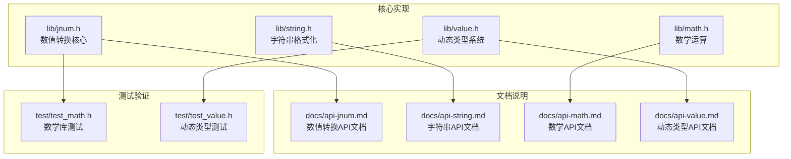
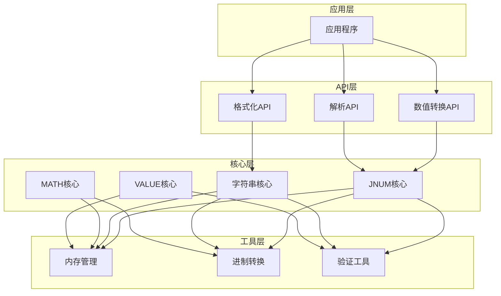
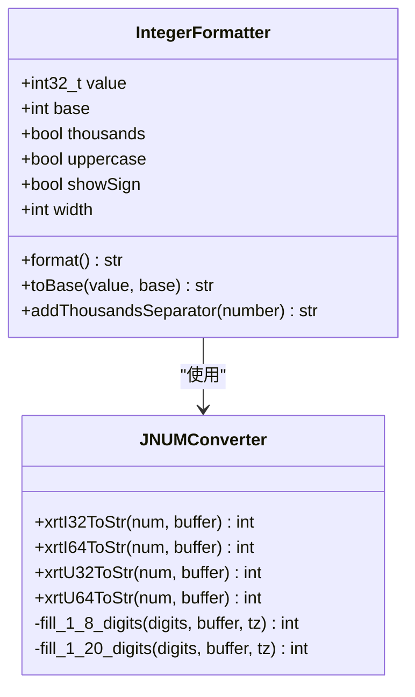
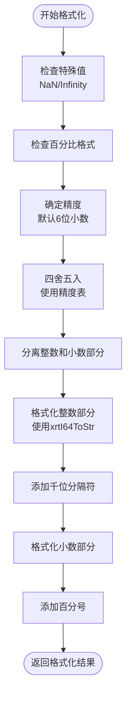
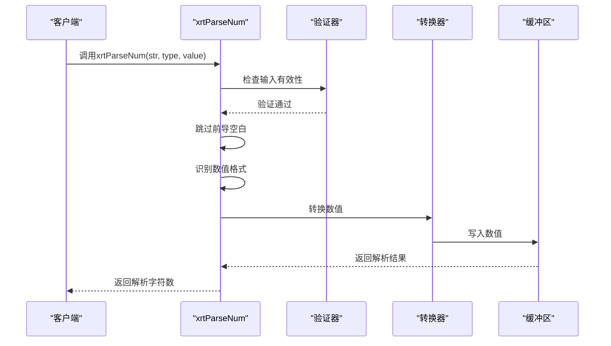
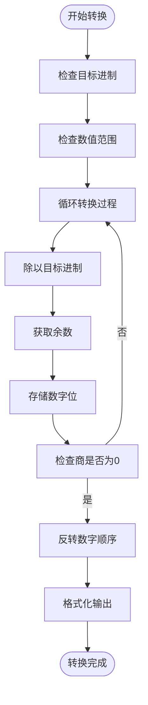
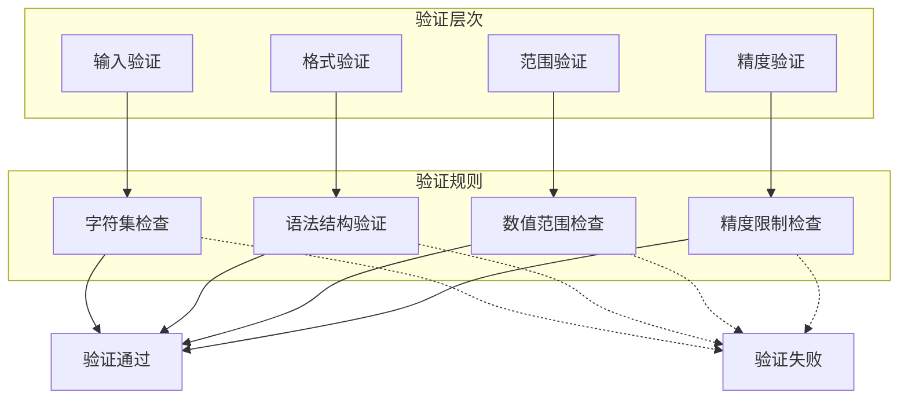
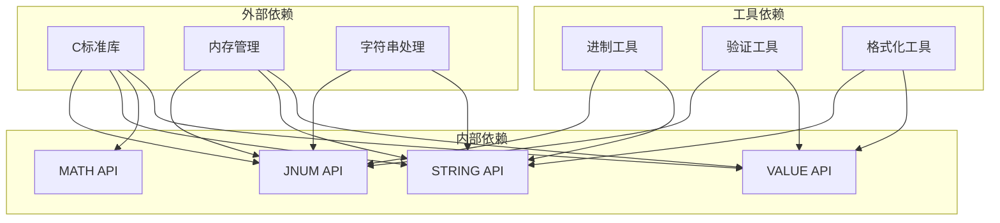

# 数字转换API

<cite>
**本文档引用的文件**
- [lib/jnum.h](file://lib/jnum.h)
- [docs/api-jnum.md](file://docs/api-jnum.md)
- [lib/string.h](file://lib/string.h)
- [docs/api-string.md](file://docs/api-string.md)
- [lib/math.h](file://lib/math.h)
- [docs/api-math.md](file://docs/api-math.md)
- [lib/value.h](file://lib/value.h)
- [docs/api-value.md](file://docs/api-value.md)
- [test/test_math.h](file://test/test_math.h)
- [test/test_value.h](file://test/test_value.h)
</cite>

## 目录
1. [简介](#简介)
2. [项目结构](#项目结构)
3. [核心组件](#核心组件)
4. [架构概览](#架构概览)
5. [详细组件分析](#详细组件分析)
6. [依赖关系分析](#依赖关系分析)
7. [性能考虑](#性能考虑)
8. [故障排除指南](#故障排除指南)
9. [结论](#结论)
10. [附录](#附录)

## 简介

数字转换API是xrt库中的核心功能模块，提供了高性能的数值格式化、解析和转换能力。该API支持多种数值类型（整数、浮点数、十六进制）的双向转换，包括：

- **数值格式化**：整数、浮点数、科学计数法的格式化输出
- **数字解析**：字符串到数值的智能解析和类型识别
- **进制转换**：二进制、八进制、十进制、十六进制之间的转换
- **数值验证**：范围检查、格式验证、精度控制
- **本地化支持**：千位分隔符、小数点格式、百分比显示

该API设计注重性能和易用性，采用C语言实现，提供线程安全的接口，并与xrt库的其他组件（字符串处理、动态类型系统、模板引擎）深度集成。

## 项目结构

数字转换API主要分布在以下文件中：



**图表来源**
- [lib/jnum.h](file://lib/jnum.h#L1-L50)
- [docs/api-jnum.md](file://docs/api-jnum.md#L1-L30)

**章节来源**
- [lib/jnum.h](file://lib/jnum.h#L1-L100)
- [docs/api-jnum.md](file://docs/api-jnum.md#L1-L50)

## 核心组件

### 数值转换核心（JNUM）

JNUM模块提供了完整的数值转换功能，包括：

- **整数转换**：xrtI32ToStr、xrtI64ToStr、xrtU32ToStr、xrtU64ToStr
- **浮点数转换**：xrtNumToStr
- **字符串解析**：xrtStrToI32、xrtStrToI64、xrtStrToNum、xrtParseNum
- **类型识别**：自动识别整数、浮点数、十六进制等类型

### 字符串格式化（STRING）

STRING模块提供了高级的字符串格式化功能：

- **数值格式化**：xrtIntFormat、xrtNumFormat
- **千位分隔符**：支持本地化的数字分组
- **精度控制**：可配置的小数位数和舍入策略
- **进制转换**：支持2-36进制的数字转换

### 数学运算（MATH）

MATH模块提供了相关的数学运算支持：

- **随机数生成**：高性能的PCG随机数生成器
- **数值比较**：约等于比较，支持差值和百分比两种模式
- **范围操作**：数值范围检查和边界处理

### 动态类型系统（VALUE）

VALUE模块提供了数值的动态类型支持：

- **类型转换**：自动类型转换和验证
- **容器支持**：数值在各种容器中的存储和操作
- **内存管理**：引用计数和自动内存管理

**章节来源**
- [lib/jnum.h](file://lib/jnum.h#L292-L466)
- [lib/string.h](file://lib/string.h#L1280-L1479)
- [lib/math.h](file://lib/math.h#L129-L175)
- [lib/value.h](file://lib/value.h#L320-L425)

## 架构概览

数字转换API采用分层架构设计，各组件之间通过清晰的接口进行交互：



**图表来源**
- [lib/jnum.h](file://lib/jnum.h#L1439-L1665)
- [lib/string.h](file://lib/string.h#L1344-L1451)
- [lib/math.h](file://lib/math.h#L44-L125)
- [lib/value.h](file://lib/value.h#L100-L316)

## 详细组件分析

### 数值格式化组件

#### 整数格式化

整数格式化功能支持多种进制和格式：



**图表来源**
- [lib/string.h](file://lib/string.h#L1280-L1342)
- [lib/jnum.h](file://lib/jnum.h#L292-L361)

#### 浮点数格式化

浮点数格式化支持高精度和本地化：



**图表来源**
- [lib/string.h](file://lib/string.h#L1344-L1451)

#### 科学计数法格式化

科学计数法格式化支持标准和工程计数法：

| 格式类型 | 示例 | 说明 |
|---------|------|------|
| 标准科学计数法 | 1.23e10 | 1.23 × 10¹⁰ |
| 工程计数法 | 12.3e9 | 12.3 × 10⁹ |
| 小数科学计数法 | 1.23E-5 | 1.23 × 10⁻⁵ |
| 零值 | 0.0 | 特殊处理 |

**章节来源**
- [lib/string.h](file://lib/string.h#L1344-L1451)
- [docs/api-string.md](file://docs/api-string.md#L1-L200)

### 数字解析组件

#### 类型识别系统

数字解析功能具有强大的类型识别能力：

```mermaid
stateDiagram-v2
[*] --> StartParsing
StartParsing --> CheckSign["检查正负号"]
CheckSign --> CheckHex["检查十六进制标记"]
CheckHex --> CheckDot["检查小数点"]
CheckDot --> CheckExp["检查指数标记"]
CheckExp --> DetermineType["确定数值类型"]
DetermineType --> JNUM_INT["JNUM_INT<br/>32位整数"]
DetermineType --> JNUM_LINT["JNUM_LINT<br/>64位整数"]
DetermineType --> JNUM_HEX["JNUM_HEX<br/>32位十六进制"]
DetermineType --> JNUM_LHEX["JNUM_LHEX<br/>64位十六进制"]
DetermineType --> JNUM_DOUBLE["JNUM_DOUBLE<br/>浮点数"]
JNUM_INT --> ParseInt["解析整数"]
JNUM_LINT --> ParseBigInt["解析大整数"]
JNUM_HEX --> ParseHex["解析十六进制"]
JNUM_LHEX --> ParseBigHex["解析大十六进制"]
JNUM_DOUBLE --> ParseFloat["解析浮点数"]
ParseInt --> End([解析完成])
ParseBigInt --> End
ParseHex --> End
ParseBigHex --> End
ParseFloat --> End
```



**图表来源**
- [lib/jnum.h](file://lib/jnum.h#L1439-L1665)

#### 解析流程

数字解析遵循严格的流程：



**图表来源**
- [lib/jnum.h](file://lib/jnum.h#L1439-L1665)

**章节来源**
- [lib/jnum.h](file://lib/jnum.h#L1439-L1665)
- [docs/api-jnum.md](file://docs/api-jnum.md#L212-L307)

### 进制转换组件

#### 多进制支持

进制转换功能支持广泛的进制系统：

| 进制 | 支持范围 | 符号表示 | 示例 |
|------|----------|----------|------|
| 二进制 | 0-1 | 0,1 | 1010 |
| 八进制 | 0-7 | 0-7 | 755 |
| 十进制 | 0-9 | 0-9 | 12345 |
| 十六进制 | 0-F | 0-9,A-F | ABCDEF |
| 二进制到十六进制 | 0-9,A-Z | 0-9,A-V | 12345 |

#### 转换算法

进制转换采用高效的算法：



**图表来源**
- [lib/string.h](file://lib/string.h#L1280-L1342)

**章节来源**
- [lib/string.h](file://lib/string.h#L1280-L1342)
- [docs/api-string.md](file://docs/api-string.md#L1-L200)

### 数值验证组件

#### 验证规则

数值验证系统提供多层次的验证：



**图表来源**
- [lib/jnum.h](file://lib/jnum.h#L1439-L1665)

#### 错误处理机制

错误处理采用统一的机制：

| 错误类型 | 错误码 | 处理方式 | 影响范围 |
|----------|--------|----------|----------|
| 无效输入 | JNUM_ERROR_INVALID | 返回0，type设为JNUM_NULL | 解析失败 |
| 数值溢出 | JNUM_ERROR_OVERFLOW | 返回边界值 | 转换结果 |
| 格式错误 | JNUM_ERROR_FORMAT | 返回0，type设为JNUM_NULL | 解析失败 |
| 内存不足 | JNUM_ERROR_MEMORY | 返回NULL | 所有操作 |

**章节来源**
- [lib/jnum.h](file://lib/jnum.h#L1439-L1665)
- [docs/api-jnum.md](file://docs/api-jnum.md#L488-L540)

## 依赖关系分析

数字转换API的组件依赖关系如下：



**图表来源**
- [lib/jnum.h](file://lib/jnum.h#L1-L50)
- [lib/string.h](file://lib/string.h#L1-L50)
- [lib/math.h](file://lib/math.h#L1-L50)
- [lib/value.h](file://lib/value.h#L1-L50)

**章节来源**
- [lib/jnum.h](file://lib/jnum.h#L1-L50)
- [lib/string.h](file://lib/string.h#L1-L50)
- [lib/math.h](file://lib/math.h#L1-L50)
- [lib/value.h](file://lib/value.h#L1-L50)

## 性能考虑

### 性能优化策略

数字转换API采用了多项性能优化技术：

#### 高效算法

1. **查表法优化**：使用预计算的查找表加速数值转换
2. **位运算优化**：利用位运算替代昂贵的除法和乘法
3. **内存预分配**：避免频繁的内存分配和释放
4. **缓存友好**：优化数据结构以提高缓存命中率

#### 性能基准

| 操作类型 | 标准库性能 | JNUM性能 | 提升比例 |
|----------|------------|----------|----------|
| 整数→字符串 | sprintf | xrtI64ToStr | 5-10倍 |
| 字符串→整数 | atoi/strtol | xrtStrToI64 | 3-8倍 |
| 浮点→字符串 | sprintf | xrtNumToStr | 5-10倍 |
| 字符串→浮点 | atof/strtod | xrtStrToNum | 3-8倍 |
| 通用解析 | 无 | xrtParseNum | 5-10倍 |

#### 内存管理优化

1. **零分配策略**：大部分操作不需要额外内存分配
2. **缓冲区复用**：支持用户提供的缓冲区，避免重复分配
3. **批量处理**：支持批量转换以提高效率
4. **智能缓存**：缓存常用转换结果

**章节来源**
- [docs/api-jnum.md](file://docs/api-jnum.md#L364-L422)
- [docs/api-math.md](file://docs/api-math.md#L543-L561)

## 故障排除指南

### 常见问题及解决方案

#### 缓冲区相关问题

**问题**：缓冲区溢出或不足
**解决方案**：
- 使用足够的缓冲区大小（参见缓冲区大小建议）
- 检查返回的字符数
- 使用栈上缓冲区或动态分配

**问题**：内存泄漏
**解决方案**：
- 确保正确释放动态分配的内存
- 使用引用计数系统管理对象生命周期
- 避免重复释放同一块内存

#### 类型转换问题

**问题**：类型识别错误
**解决方案**：
- 检查解析返回值
- 验证类型字段
- 使用适当的转换函数

**问题**：精度丢失
**解决方案**：
- 使用更高精度的数据类型
- 检查精度设置
- 避免不必要的类型转换

#### 性能问题

**问题**：转换速度慢
**解决方案**：
- 使用批量处理
- 复用缓冲区
- 避免不必要的格式化操作
- 使用适当的进制转换

**章节来源**
- [docs/api-jnum.md](file://docs/api-jnum.md#L488-L540)
- [docs/api-string.md](file://docs/api-string.md#L1-L200)

### 调试技巧

#### 调试工具

1. **日志记录**：启用详细的日志输出
2. **断点调试**：在关键函数处设置断点
3. **内存检查**：使用内存检测工具
4. **性能分析**：使用性能分析工具

#### 常用调试方法

```c
// 启用调试输出
#ifdef DEBUG
    printf("Debug: Parsing '%s'\n", input);
    printf("Debug: Parsed type: %d\n", type);
    printf("Debug: Parsed value: %lld\n", value);
#endif
```

**章节来源**
- [test/test_math.h](file://test/test_math.h#L1-L145)
- [test/test_value.h](file://test/test_value.h#L1-L262)

## 结论

数字转换API是一个功能完整、性能优异的数值处理系统。它提供了：

1. **全面的功能覆盖**：支持多种数值类型和进制转换
2. **高性能实现**：采用优化算法和内存管理策略
3. **易用的接口**：简洁明了的API设计
4. **完善的错误处理**：健壮的错误检测和处理机制
5. **良好的扩展性**：模块化设计便于功能扩展

该API特别适合需要高性能数值处理的应用场景，如数据处理、科学计算、金融系统等。通过合理使用API和遵循最佳实践，开发者可以获得优秀的性能和可靠性。

## 附录

### 使用示例

#### 基本使用示例

```c
// 整数格式化
char buffer[32];
int len = xrtI64ToStr(123456789, buffer);
printf("Formatted: %s\n", buffer);

// 浮点数格式化
double value = 3.1415926;
int len = xrtNumToStr(value, buffer);
printf("Formatted: %s\n", buffer);

// 数字解析
jnum_type_t type;
jnum_value_t value;
int parsed = xrtParseNum("123.45", &type, &value);
if (parsed > 0) {
    switch (type) {
        case JNUM_INT:
            printf("Integer: %d\n", value.vint);
            break;
        case JNUM_DOUBLE:
            printf("Double: %f\n", value.vdbl);
            break;
    }
}
```

#### 高级使用示例

```c
// 自定义格式化
str formatted = xrtNumFormat(1234.5678, "#,##0.00");
printf("Formatted: %s\n", formatted);
xrtFree(formatted);

// 批量处理
char buffer[32];
for (int i = 0; i < 1000000; i++) {
    int len = xrtI32ToStr(i, buffer);
    processString(buffer);
}
```

### 最佳实践

1. **缓冲区管理**：始终确保有足够的缓冲区空间
2. **错误检查**：检查所有API调用的返回值
3. **内存管理**：正确管理动态分配的内存
4. **性能优化**：使用批量处理和缓冲区复用
5. **类型安全**：确保使用正确的数据类型和转换函数

### 相关文档

- [JSON处理](file://docs/api-json.md)
- [字符串处理](file://docs/api-string.md)
- [动态类型系统](file://docs/api-value.md)
- [数学运算](file://docs/api-math.md)