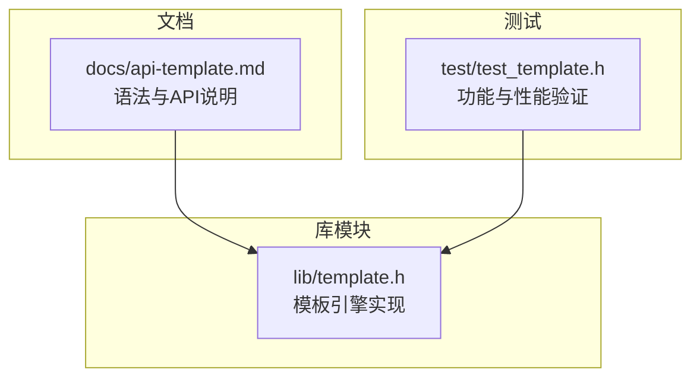
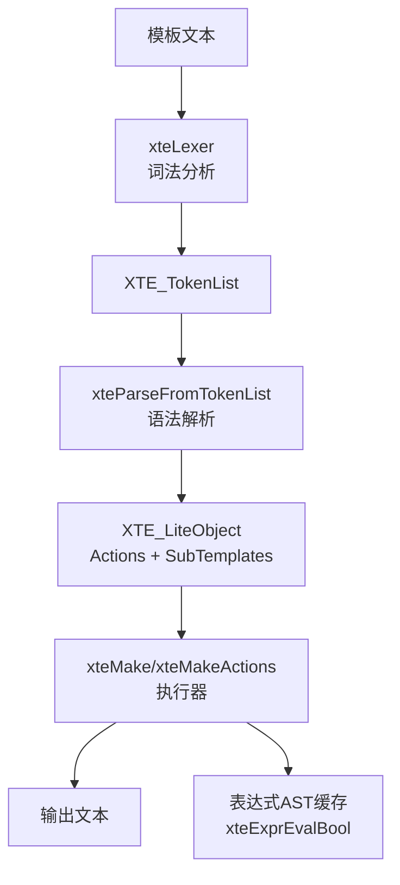
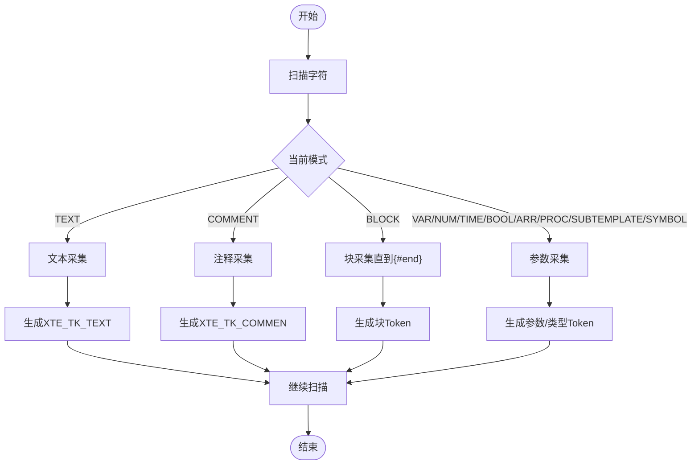
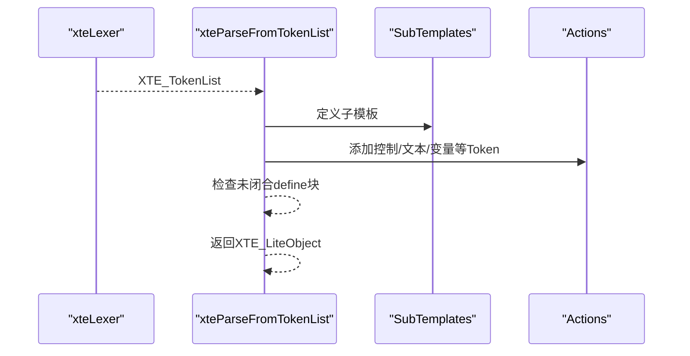
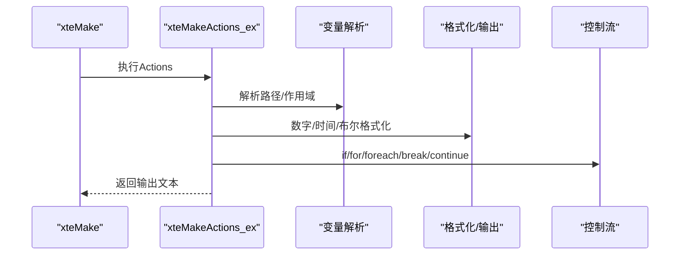
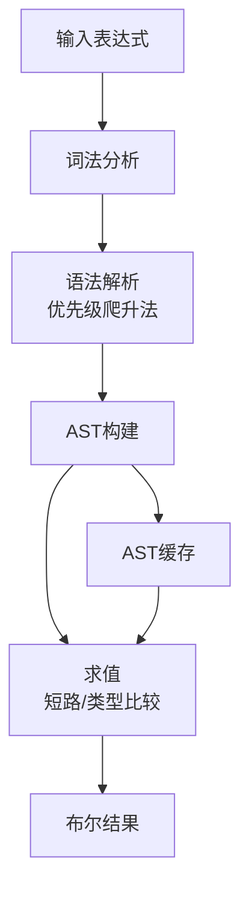
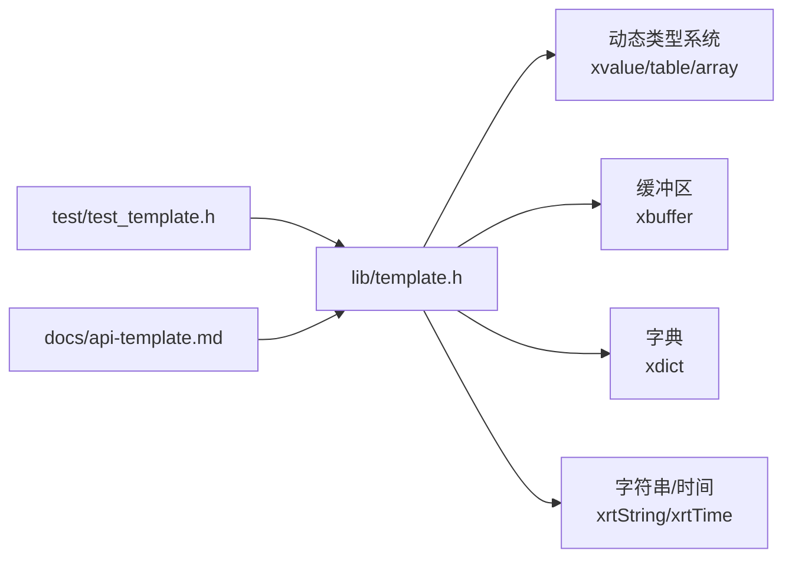

# 模板引擎API

<cite>
**本文档引用的文件**
- [lib/template.h](file://lib/template.h)
- [docs/api-template.md](file://docs/api-template.md)
- [test/test_template.h](file://test/test_template.h)
</cite>

## 目录
1. [简介](#简介)
2. [项目结构](#项目结构)
3. [核心组件](#核心组件)
4. [架构总览](#架构总览)
5. [详细组件分析](#详细组件分析)
6. [依赖关系分析](#依赖关系分析)
7. [性能考量](#性能考量)
8. [故障排查指南](#故障排查指南)
9. [结论](#结论)
10. [附录](#附录)

## 简介
本文件为模板引擎API的权威技术文档，面向使用者与开发者，系统阐述模板语法解析（变量替换、表达式求值、控制流）、模板编译执行、变量作用域管理、模板继承与嵌套、子模板调用、模板缓存机制等能力，并给出错误处理与调试方法、性能优化建议、内存管理策略与安全注意事项，以及丰富的实际应用示例。

## 项目结构
模板引擎位于库模块目录，核心实现集中在模板头文件中；配套文档与测试分别位于docs与test目录：
- 核心实现：lib/template.h（词法/语法/表达式解析、执行器、数据结构）
- 文档说明：docs/api-template.md（语法、API、最佳实践、性能提示）
- 测试用例：test/test_template.h（端到端功能验证）

图表来源
- [lib/template.h](file://lib/template.h#L1-L120)
- [docs/api-template.md](file://docs/api-template.md#L1-L50)
- [test/test_template.h](file://test/test_template.h#L1-L30)

章节来源
- [lib/template.h](file://lib/template.h#L1-L120)
- [docs/api-template.md](file://docs/api-template.md#L1-L50)
- [test/test_template.h](file://test/test_template.h#L1-L30)

## 核心组件
- 词法分析器：将模板文本切分为Token序列，支持转义、注释、多语句块、参数解析。
- 语法解析器：将Token列表转换为可执行的动作列表（Actions），支持define子模板、控制语句、include等。
- 执行器：按Actions逐条执行，支持变量解析、格式化输出、循环、条件、break/continue、子模板与include。
- 表达式解析器：支持布尔/数值/字符串/时间比较与逻辑运算，AST缓存提升重复表达式求值性能。
- 路径解析器：支持点号与方括号的嵌套访问，统一从当前作用域、根作用域、环境变量查找。
- 模板缓存：全局表达式AST缓存与模板对象缓存，减少重复解析成本。

章节来源
- [lib/template.h](file://lib/template.h#L240-L587)
- [lib/template.h](file://lib/template.h#L858-L968)
- [lib/template.h](file://lib/template.h#L1301-L2121)
- [lib/template.h](file://lib/template.h#L2125-L2987)
- [lib/template.h](file://lib/template.h#L603-L773)
- [docs/api-template.md](file://docs/api-template.md#L1160-L1292)

## 架构总览
模板引擎采用“词法→语法→执行”的分层设计，配合表达式AST缓存与模板对象复用，实现高性能与易用性兼顾。

图表来源
- [lib/template.h](file://lib/template.h#L240-L587)
- [lib/template.h](file://lib/template.h#L858-L968)
- [lib/template.h](file://lib/template.h#L1049-L1062)
- [lib/template.h](file://lib/template.h#L1301-L2121)
- [lib/template.h](file://lib/template.h#L2942-L2987)

## 详细组件分析

### 1) 词法分析器（xteLexer）
职责：扫描模板文本，识别模板起始/结束符号、注释、变量、数字、时间、布尔、数组、过程、子模板、控制语句等，构建Token列表。
- 支持转义：{{、\}、\:, \\等。
- 支持多语句块：{#xxx ...}，遇到{#end}才结束。
- 参数解析：以冒号分隔，自动trim空白，限制最大参数数量。
- 错误处理：统一返回结构体，包含错误码、错误描述、错误位置与参考位置。

图表来源
- [lib/template.h](file://lib/template.h#L240-L587)

章节来源
- [lib/template.h](file://lib/template.h#L240-L587)
- [docs/api-template.md](file://docs/api-template.md#L1351-L1361)

### 2) 语法解析器（xteParseFromTokenList）
职责：将Token列表转换为可执行的Actions与子模板字典，支持define块、if/elseif/else/for/foreach/break/continue等控制结构。
- define块：建立子模板字典，禁止嵌套define。
- 控制结构：解析配对的{#end}，支持嵌套。
- 错误检测：未闭合define块、参数数量不足/过多、未识别标识符等。

图表来源
- [lib/template.h](file://lib/template.h#L858-L968)

章节来源
- [lib/template.h](file://lib/template.h#L858-L968)
- [docs/api-template.md](file://docs/api-template.md#L1333-L1348)

### 3) 执行器（xteMake/xteMakeActions）
职责：按Actions顺序执行，支持变量/数字/时间/布尔/数组/过程/子模板/包含/控制流等。
- 变量解析：优先当前作用域，其次根作用域，最后环境变量。
- 数字格式化：支持千分位、小数位等格式。
- 时间格式化：支持自定义格式或默认格式。
- 布尔选择：根据逻辑值选择输出内容或子模板。
- 数组/表遍历：foreach支持数组与表，提供__index__、__value__、__key__等内置变量。
- 循环控制：break/continue即时生效，支持for计次循环与foreach迭代循环。
- include：从外部模板字典中加载并执行。
- 子模板：通过{= name}调用，支持参数传递。

图表来源
- [lib/template.h](file://lib/template.h#L1301-L2121)

章节来源
- [lib/template.h](file://lib/template.h#L1301-L2121)
- [docs/api-template.md](file://docs/api-template.md#L822-L1051)

### 4) 表达式解析器（xteExprParse/xteExprEval）
职责：解析布尔/数值/字符串/时间表达式，构建AST并求值；内置AST缓存，避免重复解析。
- 词法：支持数字、字符串、标识符、括号、比较运算符、逻辑运算符、布尔字面量。
- 语法：优先级爬升法，支持括号与一元not。
- 求值：短路求值（and/or），类型安全比较，null与集合类型处理。
- 缓存：全局字典缓存AST，生命周期内复用。

图表来源
- [lib/template.h](file://lib/template.h#L2125-L2987)

章节来源
- [lib/template.h](file://lib/template.h#L2125-L2987)
- [docs/api-template.md](file://docs/api-template.md#L1238-L1254)

### 5) 路径解析器（xteResolvePath）
职责：支持点号嵌套与数组索引访问，按优先级从当前作用域、根作用域、环境变量查找。
- 支持：a.b.c、arr[0]、obj["key"]、组合访问。
- 返回：xvalue或空值，便于上层统一处理。

章节来源
- [lib/template.h](file://lib/template.h#L603-L773)
- [docs/api-template.md](file://docs/api-template.md#L527-L592)

### 6) 模板对象与缓存
- XTE_LiteObject：包含Actions与SubTemplates，支持模板复用与include。
- 全局初始化：内置标识符注册、表达式AST缓存字典。
- 生命周期：xte_private_init自动初始化，xte_private_unit清理资源。

章节来源
- [lib/template.h](file://lib/template.h#L845-L1046)
- [lib/template.h](file://lib/template.h#L1049-L1062)

## 依赖关系分析
- 词法/语法/执行依赖动态类型系统（xvalue/table/array/list/time等）。
- 表达式解析依赖路径解析与动态类型系统。
- 执行器依赖路径解析、格式化工具与字典容器。
- 测试依赖模板引擎API与动态类型系统。

图表来源
- [lib/template.h](file://lib/template.h#L1-L120)
- [test/test_template.h](file://test/test_template.h#L1-L30)
- [docs/api-template.md](file://docs/api-template.md#L1-L50)

章节来源
- [lib/template.h](file://lib/template.h#L1-L120)
- [test/test_template.h](file://test/test_template.h#L1-L30)
- [docs/api-template.md](file://docs/api-template.md#L1-L50)

## 性能考量
- 重用模板对象：解析一次，多次生成，避免重复词法/语法开销。
- 表达式AST缓存：相同表达式仅解析一次，跨多次执行复用。
- 预编译模板：启动时加载常用模板，运行时直接生成。
- 循环次数限制：默认100,000次，防止无限循环与巨大循环带来的性能问题。
- 内存管理：输出文本与中间结构均需显式释放，避免泄漏。

章节来源
- [docs/api-template.md](file://docs/api-template.md#L1213-L1292)
- [lib/template.h](file://lib/template.h#L63-L65)
- [lib/template.h](file://lib/template.h#L1794-L1826)

## 故障排查指南
- 常见错误代码与含义：内存失败、Token列表添加失败、未识别符号、空符号、参数过多、语句未结束、未定义标识符、参数缺失、define嵌套、语法错误。
- 语法错误定位：解析返回结构体包含错误行号、列位置与参考位置，便于快速定位。
- 调试建议：开启详细日志、逐步缩小模板片段、验证数据结构键名与类型、检查转义与{#end}闭合。

章节来源
- [docs/api-template.md](file://docs/api-template.md#L1333-L1348)
- [lib/template.h](file://lib/template.h#L69-L92)

## 结论
该模板引擎以清晰的分层架构、完善的控制流与表达式支持、高效的AST缓存与模板复用机制，提供了从基础变量替换到复杂嵌套循环与条件判断的完整能力。配合严格的错误报告与性能提示，适合在高并发与大规模数据场景中稳定使用。

## 附录

### A. 模板语法要点
- 变量替换：{$name}、{%num:.2}、{&time:format}、{?cond:a:b}
- 控制流：{#if}/{#elseif}/{#else}/{#end}、{#for:start:end:step}、{#foreach:items}、{#break}/{#continue}
- 子模板：{#define:name}...{#end}、{=name}
- 包含：{#include:file}
- 注释：{!comment}

章节来源
- [docs/api-template.md](file://docs/api-template.md#L23-L251)
- [docs/api-template.md](file://docs/api-template.md#L822-L1051)

### B. API清单（节选）
- 词法分析：xteLexer、xteLexerFree
- 语法解析：xteParseFromTokenList、xteParse、xteParseFree
- 执行：xteMakeActions、xteMake
- 表达式：xteExprParse、xteExprEvalBool、xteExprFree
- 路径解析：xteResolvePath
- 数据结构：XTE_TokenList、XTE_LiteObject、XTE_IdentInfo、XTE_TokenItem

章节来源
- [docs/api-template.md](file://docs/api-template.md#L401-L820)
- [lib/template.h](file://lib/template.h#L240-L587)
- [lib/template.h](file://lib/template.h#L858-L968)
- [lib/template.h](file://lib/template.h#L1301-L2121)
- [lib/template.h](file://lib/template.h#L2125-L2987)
- [lib/template.h](file://lib/template.h#L603-L773)

### C. 实际应用示例（节选）
- HTML生成、邮件模板、代码生成、报表生成等典型场景。
- 测试用例覆盖：空格支持、路径解析、表达式求值、控制语句、break/continue、循环限制、缓存、未闭合检测、表迭代等。

章节来源
- [docs/api-template.md](file://docs/api-template.md#L1053-L1132)
- [test/test_template.h](file://test/test_template.h#L1-L628)