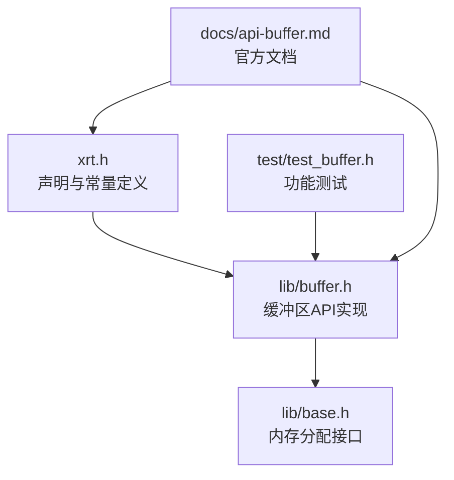
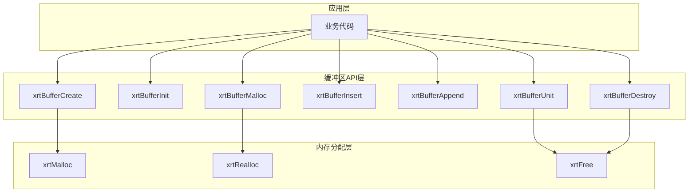
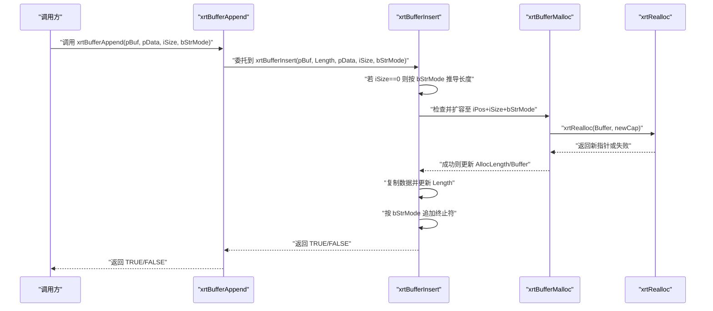
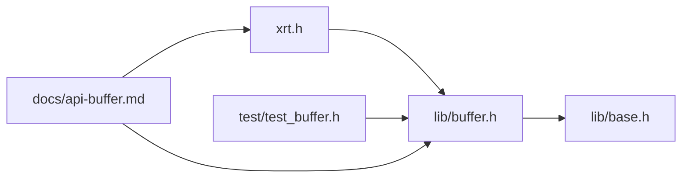

# 动态缓冲区API

<cite>
**本文引用的文件**
- [xrt.h](file://xrt.h)
- [lib/buffer.h](file://lib/buffer.h)
- [lib/base.h](file://lib/base.h)
- [test/test_buffer.h](file://test/test_buffer.h)
- [docs/api-buffer.md](file://docs/api-buffer.md)
</cite>

## 目录
1. [简介](#简介)
2. [项目结构](#项目结构)
3. [核心组件](#核心组件)
4. [架构概览](#架构概览)
5. [详细组件分析](#详细组件分析)
6. [依赖关系分析](#依赖关系分析)
7. [性能考虑](#性能考虑)
8. [故障排查指南](#故障排查指南)
9. [结论](#结论)
10. [附录](#附录)

## 简介
本文件系统性地梳理并解释动态缓冲区API，重点围绕 xbuffer 结构体及其相关函数，包括缓冲区的创建、销毁、初始化、内存管理，以及字符串模式常量（XBUF_BINARY、XBUF_ANSI、XBUF_UTF8、XBUF_UTF16、XBUF_UTF32）的使用方法。同时覆盖数据读写操作（如 xrtBufferAppend、xrtBufferInsert、xrtBufferMalloc 等）的参数、返回值与典型使用场景，并提供完整的使用示例与最佳实践建议。

## 项目结构
动态缓冲区API位于 xrt 主头文件中声明，具体实现位于 lib/buffer.h；基础内存分配接口在 lib/base.h 中；测试用例位于 test/test_buffer.h；官方文档位于 docs/api-buffer.md。

图表来源
- [xrt.h](file://xrt.h#L1009-L1052)
- [lib/buffer.h](file://lib/buffer.h#L1-L116)
- [lib/base.h](file://lib/base.h#L1-L132)
- [test/test_buffer.h](file://test/test_buffer.h#L1-L204)
- [docs/api-buffer.md](file://docs/api-buffer.md#L1-L672)

章节来源
- [xrt.h](file://xrt.h#L1009-L1052)
- [lib/buffer.h](file://lib/buffer.h#L1-L116)
- [lib/base.h](file://lib/base.h#L1-L132)
- [test/test_buffer.h](file://test/test_buffer.h#L1-L204)
- [docs/api-buffer.md](file://docs/api-buffer.md#L1-L672)

## 核心组件
- xbuffer 结构体：封装缓冲区指针、当前长度、已分配长度与扩容步长。
- 字符串模式常量：控制追加/插入时是否自动追加终止符及字节宽度。
- 关键API：
  - xrtBufferCreate/xrtBufferDestroy：创建/销毁缓冲区管理器。
  - xrtBufferInit/xrtBufferUnit：初始化/释放缓冲区内存。
  - xrtBufferMalloc：预分配或调整缓冲区内存大小。
  - xrtBufferInsert/xrtBufferAppend：中间插入/末尾追加数据，支持多种字符串模式。

章节来源
- [xrt.h](file://xrt.h#L1011-L1052)
- [lib/buffer.h](file://lib/buffer.h#L5-L116)

## 架构概览
动态缓冲区API采用“管理器 + 内存池”的设计：外部通过管理器函数进行生命周期与内存管理，内部通过基础内存分配接口进行实际的内存分配与回收。字符串模式常量统一了不同编码下的终止符策略，简化了多语言文本处理。

图表来源
- [lib/buffer.h](file://lib/buffer.h#L5-L116)
- [lib/base.h](file://lib/base.h#L5-L45)
- [xrt.h](file://xrt.h#L1009-L1052)

## 详细组件分析

### xbuffer 结构体
- 字段说明：
  - Buffer：指向实际数据存储区的指针，可直接读取。
  - Length：当前已写入的有效数据长度（字节）。
  - AllocLength：已分配的总内存大小（字节）。
  - AllocStep：扩容时的增量大小（默认 64KB）。
- 使用建议：
  - 直接访问 Buffer 以进行高效读取或二进制遍历。
  - 通过 Length 获取有效数据长度，避免误读尾部未初始化内存。

章节来源
- [xrt.h](file://xrt.h#L1021-L1027)

### 字符串模式常量
- XBUF_BINARY：二进制模式，不自动添加终止符。
- XBUF_ANSI/XBUF_UTF8：ANSI/UTF-8 字符串，追加 1 字节终止符。
- XBUF_UTF16：UTF-16 字符串，追加 2 字节终止符。
- XBUF_UTF32：UTF-32 字符串，追加 4 字节终止符。
- 注意：当 iSize 为 0 时，API 会根据字符串模式自动推导长度（基于源字符串长度函数）。

章节来源
- [xrt.h](file://xrt.h#L1011-L1016)
- [lib/buffer.h](file://lib/buffer.h#L75-L88)

### API 函数详解

#### xrtBufferCreate
- 功能：创建缓冲区管理器，返回 xbuffer 指针。
- 参数：iStep 预分配步长（0 使用默认值）。
- 返回：成功返回非空指针，失败返回空。
- 典型场景：需要独立管理的缓冲区对象，生命周期由调用者控制。

章节来源
- [lib/buffer.h](file://lib/buffer.h#L5-L12)
- [xrt.h](file://xrt.h#L1029)

#### xrtBufferDestroy
- 功能：销毁缓冲区管理器，释放其内部结构体与底层内存。
- 参数：pBuf 缓冲区指针。
- 行为：若 pBuf 非空，先 Unit 再 Free 结构体本身。
- 典型场景：结束使用后彻底释放资源。

章节来源
- [lib/buffer.h](file://lib/buffer.h#L14-L21)
- [xrt.h](file://xrt.h#L1032)

#### xrtBufferInit
- 功能：初始化已存在的 xbuffer_struct（适用于嵌入式结构体）。
- 参数：pBuf 指向结构体的指针，iStep 预分配步长。
- 行为：清零字段并设置 AllocStep。
- 典型场景：将缓冲区嵌入更大结构体中，避免额外堆分配。

章节来源
- [lib/buffer.h](file://lib/buffer.h#L23-L30)
- [xrt.h](file://xrt.h#L1035)

#### xrtBufferUnit
- 功能：释放缓冲区内存（不清空结构体），等价于 xrtBufferClear。
- 参数：pBuf 缓冲区指针。
- 行为：释放 Buffer，重置 Length 与 AllocLength。
- 典型场景：复用同一结构体但需要清空内容。

章节来源
- [lib/buffer.h](file://lib/buffer.h#L32-L38)
- [xrt.h](file://xrt.h#L1038)
- [xrt.h](file://xrt.h#L1050-L1051)

#### xrtBufferMalloc
- 功能：预分配或调整缓冲区内存大小。
- 参数：pBuf 缓冲区指针，iCount 目标内存大小（字节）。
- 返回：成功 TRUE，失败 FALSE。
- 行为：
  - iCount > AllocLength：按新大小扩容。
  - iCount < AllocLength：按新大小收缩（必要时裁剪数据）。
  - iCount == 0：清空缓冲区。
- 典型场景：批量写入前预估容量，减少多次扩容开销。

章节来源
- [lib/buffer.h](file://lib/buffer.h#L40-L72)
- [xrt.h](file://xrt.h#L1041-L1042)

#### xrtBufferInsert
- 功能：在指定位置插入数据，支持自动推导长度与字符串模式终止符。
- 参数：
  - pBuf：缓冲区指针
  - iPos：插入位置（字节偏移）
  - pData：待插入数据指针
  - iSize：数据长度（0 表示自动推导）
  - bStrMode：字符串模式（XBUF_*）
- 返回：成功 TRUE，失败 FALSE。
- 行为：
  - 自动扩容至 iPos + iSize + bStrMode。
  - 若 iSize 为 0，按 bStrMode 推导长度。
  - 在字符串模式下自动追加相应长度的终止符。
- 典型场景：在已有数据中间插入片段（如协议报文头、占位符替换）。

章节来源
- [lib/buffer.h](file://lib/buffer.h#L74-L107)
- [xrt.h](file://xrt.h#L1044-L1045)

#### xrtBufferAppend
- 功能：在缓冲区末尾追加数据，是 xrtBufferInsert 的特化。
- 参数：与 xrtBufferInsert 类似，但 iPos 固定为当前 Length。
- 返回：成功 TRUE，失败 FALSE。
- 典型场景：顺序拼接字符串、构建数据包、文件分块缓存。

章节来源
- [lib/buffer.h](file://lib/buffer.h#L108-L113)
- [xrt.h](file://xrt.h#L1047-L1048)

### API 调用序列图（以 xrtBufferAppend 为例）

图表来源
- [lib/buffer.h](file://lib/buffer.h#L108-L113)
- [lib/buffer.h](file://lib/buffer.h#L74-L107)
- [lib/buffer.h](file://lib/buffer.h#L40-L72)
- [lib/base.h](file://lib/base.h#L29-L37)

## 依赖关系分析
- xbuffer 结构体与常量定义集中在 xrt.h。
- API 实现位于 lib/buffer.h，内部依赖 lib/base.h 提供的内存分配接口。
- 测试用例 test/test_buffer.h 展示了常见使用流程与断言。
- 官方文档 docs/api-buffer.md 提供了更丰富的使用场景与最佳实践。

图表来源
- [xrt.h](file://xrt.h#L1009-L1052)
- [lib/buffer.h](file://lib/buffer.h#L1-L116)
- [lib/base.h](file://lib/base.h#L1-L132)
- [test/test_buffer.h](file://test/test_buffer.h#L1-L204)
- [docs/api-buffer.md](file://docs/api-buffer.md#L1-L672)

章节来源
- [xrt.h](file://xrt.h#L1009-L1052)
- [lib/buffer.h](file://lib/buffer.h#L1-L116)
- [lib/base.h](file://lib/base.h#L1-L132)
- [test/test_buffer.h](file://test/test_buffer.h#L1-L204)
- [docs/api-buffer.md](file://docs/api-buffer.md#L1-L672)

## 性能考虑
- 预分配策略：在已知数据总量时，优先使用 xrtBufferMalloc 预分配，减少多次扩容带来的拷贝成本。
- 字符串模式选择：仅在需要 C 风格字符串时启用终止符模式，避免不必要的字节填充。
- 内存裁剪：在收尾阶段使用 xrtBufferMalloc 将 AllocLength 调整到 Length + 终止符长度，降低内存占用。
- 嵌入式缓冲区：将 xbuffer_struct 嵌入业务结构体并通过 xrtBufferInit 初始化，避免额外堆分配与跨层指针传递。

章节来源
- [docs/api-buffer.md](file://docs/api-buffer.md#L554-L656)
- [lib/buffer.h](file://lib/buffer.h#L40-L72)

## 故障排查指南
- 内存分配失败：
  - 现象：xrtBufferMalloc 返回 FALSE 或 xrtRealloc 报错。
  - 排查：确认目标容量是否合理，系统可用内存是否充足。
  - 参考：基础内存分配接口的错误处理行为。
- 插入位置越界：
  - 现象：数据写入异常或崩溃。
  - 排查：确保 iPos 不超过当前 Length，且 iSize 合法。
- 字符串模式误用：
  - 现象：出现多余终止符或编码错误。
  - 排查：确认 bStrMode 与源数据编码一致，iSize 为 0 时由 API 自动推导长度。
- 资源泄漏：
  - 现象：程序运行时间越长内存占用越高。
  - 排查：确保每次使用后调用 xrtBufferUnit 或 xrtBufferDestroy，避免遗漏。

章节来源
- [lib/base.h](file://lib/base.h#L29-L37)
- [lib/buffer.h](file://lib/buffer.h#L40-L72)
- [test/test_buffer.h](file://test/test_buffer.h#L181-L201)

## 结论
动态缓冲区API提供了简洁高效的内存管理与数据读写能力，结合字符串模式常量可灵活适配二进制与多编码文本场景。通过合理的预分配、嵌入式结构与内存裁剪策略，可在保证易用性的同时获得良好的性能表现。官方文档与测试用例进一步验证了 API 的稳定性与实用性。

## 附录

### 使用示例路径
- 动态数据包构建：参见官方文档中的示例路径。
  - [docs/api-buffer.md](file://docs/api-buffer.md#L391-L438)
- 字符串拼接：参见官方文档中的示例路径。
  - [docs/api-buffer.md](file://docs/api-buffer.md#L440-L482)
- 文件内容缓存：参见官方文档中的示例路径。
  - [docs/api-buffer.md](file://docs/api-buffer.md#L486-L514)
- UTF-16 字符串缓冲区：参见官方文档中的示例路径。
  - [docs/api-buffer.md](file://docs/api-buffer.md#L518-L550)

### 测试用例参考
- 基本创建/销毁/追加/插入/网页生成/清空流程：参见测试文件路径。
  - [test/test_buffer.h](file://test/test_buffer.h#L5-L201)