# 字典和列表API

<cite>
**本文档引用的文件**
- [api-dict.md](file://docs/api-dict.md)
- [api-list.md](file://docs/api-list.md)
- [dict.h](file://lib/dict.h)
- [list.h](file://lib/list.h)
- [api-avltree.md](file://docs/api-avltree.md)
- [avltree.h](file://lib/avltree.h)
- [avltree_base.h](file://lib/avltree_base.h)
- [api-hash.md](file://docs/api-hash.md)
- [hash.h](file://lib/hash.h)
- [test_dict.h](file://test/test_dict.h)
- [test_list.h](file://test/test_list.h)
- [test_dict_iterator.h](file://test/test_dict_iterator.h)
- [test_list_iterator.h](file://test/test_list_iterator.h)
</cite>

## 目录
1. [简介](#简介)
2. [项目结构](#项目结构)
3. [核心组件](#核心组件)
4. [架构概览](#架构概览)
5. [详细组件分析](#详细组件分析)
6. [依赖关系分析](#依赖关系分析)
7. [性能考虑](#性能考虑)
8. [故障排除指南](#故障排除指南)
9. [结论](#结论)
10. [附录](#附录)

## 简介

本文档详细介绍了xrt库中的字典和列表API，这两个数据结构都是基于AVL树实现的高性能容器。字典（Dict）提供键值对存储功能，支持任意二进制键；列表（List）提供基于整数索引的有序存储，支持负索引和稀疏存储。

### 核心特性

- **AVL树实现**：保证O(log n)的查找、插入、删除性能
- **内存管理**：自动内存管理，支持内存池集成
- **类型安全**：支持任意数据类型存储
- **高效遍历**：提供多种遍历方式和迭代器支持
- **扩展性**：支持自定义比较函数和释放回调

## 项目结构

该项目采用模块化设计，主要包含以下核心模块：

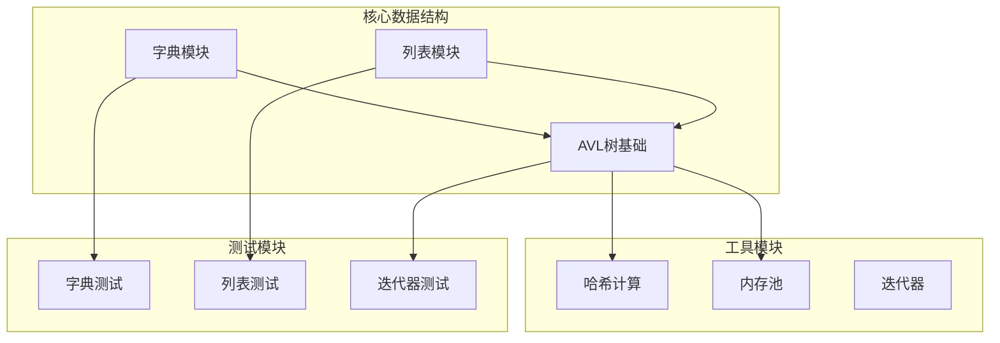

**图表来源**
- [dict.h](file://lib/dict.h#L1-L204)
- [list.h](file://lib/list.h#L1-L188)
- [avltree.h](file://lib/avltree.h#L1-L126)

**章节来源**
- [api-dict.md](file://docs/api-dict.md#L1-L100)
- [api-list.md](file://docs/api-list.md#L1-L100)

## 核心组件

### 字典（Dict）组件

字典是基于AVL树实现的键值对存储容器，支持任意二进制数据作为键。

#### 主要数据结构

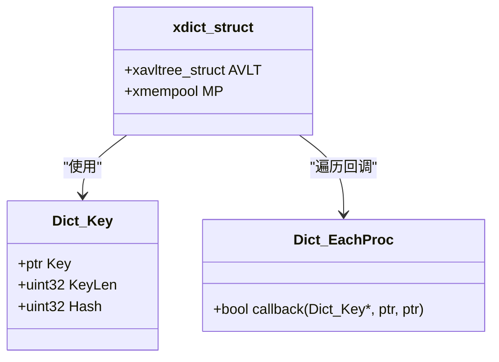

**图表来源**
- [dict.h](file://lib/dict.h#L5-L25)
- [dict.h](file://lib/dict.h#L81-L91)

#### 核心操作函数

| 函数名 | 功能描述 | 时间复杂度 |
|--------|----------|------------|
| xrtDictCreate | 创建字典 | O(1) |
| xrtDictSet | 设置键值对 | O(log n) |
| xrtDictGet | 获取值 | O(log n) |
| xrtDictRemove | 删除键值对 | O(log n) |
| xrtDictExists | 检查键存在 | O(log n) |
| xrtDictWalk | 遍历字典 | O(n) |

**章节来源**
- [api-dict.md](file://docs/api-dict.md#L150-L200)
- [dict.h](file://lib/dict.h#L29-L76)

### 列表（List）组件

列表是基于AVL树实现的整数索引存储容器，支持负索引和稀疏存储。

#### 主要数据结构

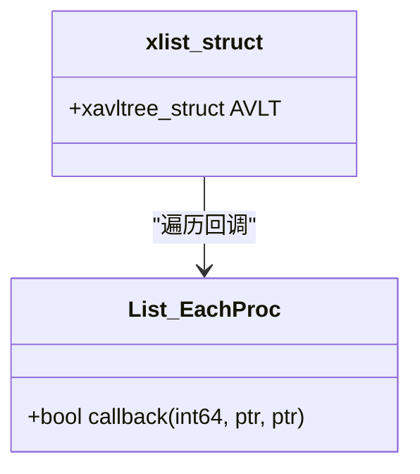

**图表来源**
- [list.h](file://lib/list.h#L61-L72)

#### 核心操作函数

| 函数名 | 功能描述 | 时间复杂度 |
|--------|----------|------------|
| xrtListCreate | 创建列表 | O(1) |
| xrtListSet | 设置元素 | O(log n) |
| xrtListGet | 获取元素 | O(log n) |
| xrtListRemove | 删除元素 | O(log n) |
| xrtListExists | 检查索引存在 | O(log n) |
| xrtListWalk | 遍历列表 | O(n) |

**章节来源**
- [api-list.md](file://docs/api-list.md#L112-L170)
- [list.h](file://lib/list.h#L18-L64)

## 架构概览

### AVL树基础架构

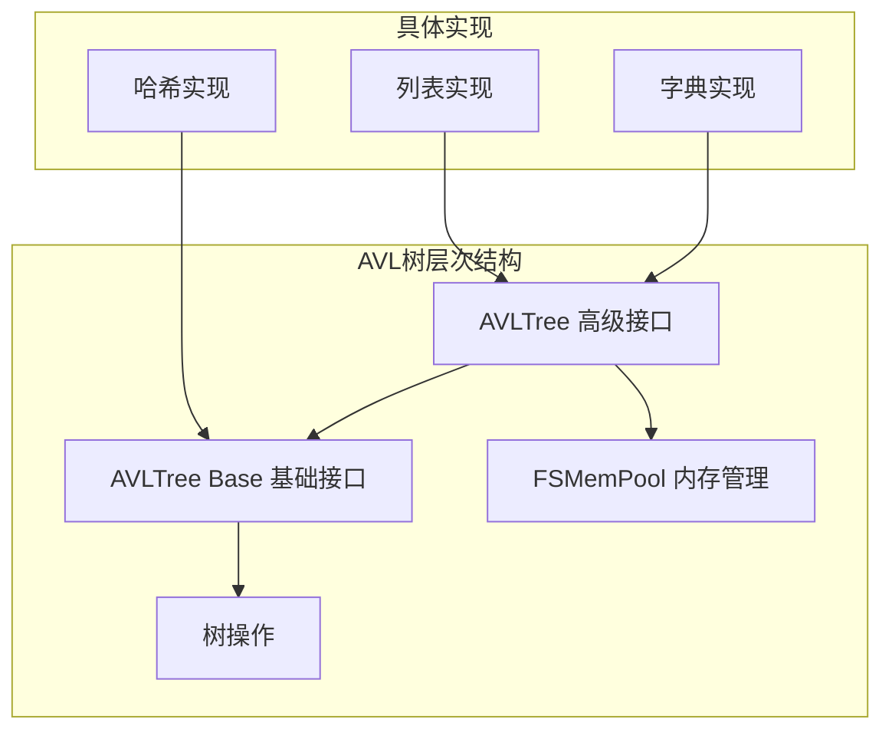

**图表来源**
- [api-avltree.md](file://docs/api-avltree.md#L34-L47)
- [avltree.h](file://lib/avltree.h#L24-L32)

### 哈希系统架构

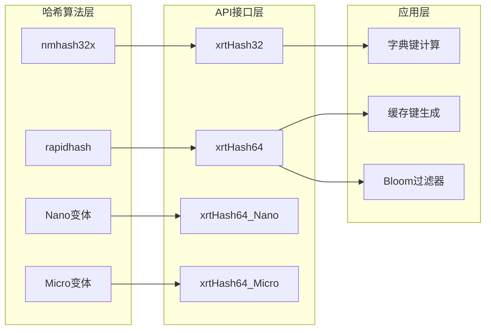

**图表来源**
- [api-hash.md](file://docs/api-hash.md#L21-L42)
- [hash.h](file://lib/hash.h#L5-L19)

**章节来源**
- [api-avltree.md](file://docs/api-avltree.md#L1-L80)
- [api-hash.md](file://docs/api-hash.md#L1-L60)

## 详细组件分析

### 字典API详细分析

#### 键值操作详解

字典提供了丰富的键值操作API，支持多种数据类型的存储：

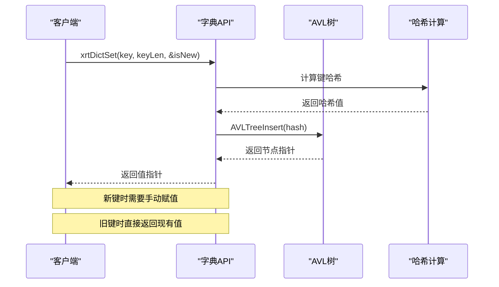

**图表来源**
- [dict.h](file://lib/dict.h#L71-L76)
- [dict.h](file://lib/dict.h#L106-L111)

#### 内存管理机制

字典采用智能内存管理模式：

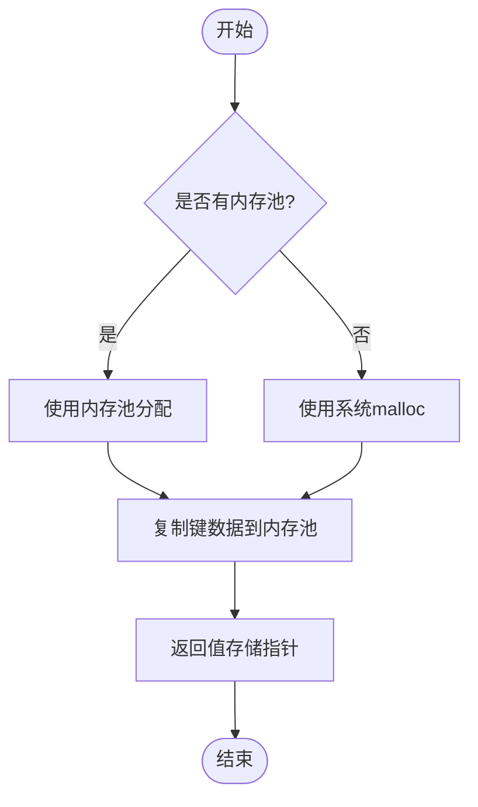

**图表来源**
- [dict.h](file://lib/dict.h#L49-L56)

**章节来源**
- [api-dict.md](file://docs/api-dict.md#L279-L336)
- [dict.h](file://lib/dict.h#L49-L68)

### 列表API详细分析

#### 稀疏存储特性

列表的独特优势在于稀疏存储能力：

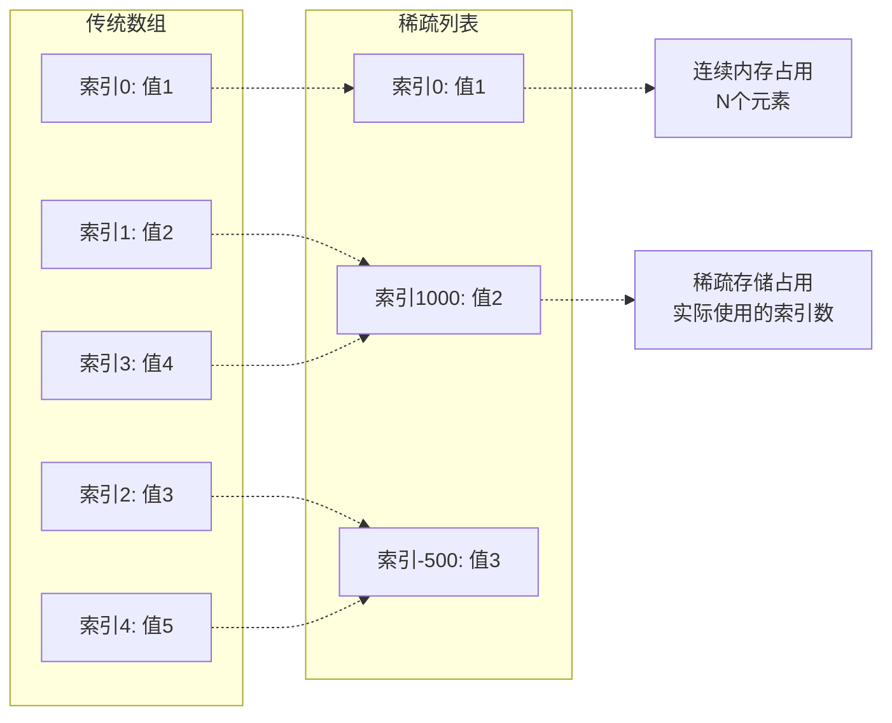

**图表来源**
- [api-list.md](file://docs/api-list.md#L49-L58)

#### 负索引支持

列表支持负索引，提供更灵活的访问方式：

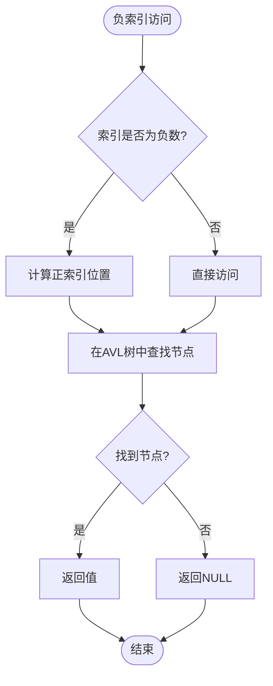

**图表来源**
- [list.h](file://lib/list.h#L94-L102)

**章节来源**
- [api-list.md](file://docs/api-list.md#L232-L291)
- [list.h](file://lib/list.h#L49-L102)

### 遍历和迭代器机制

#### 遍历算法

两种数据结构都支持高效的中序遍历：

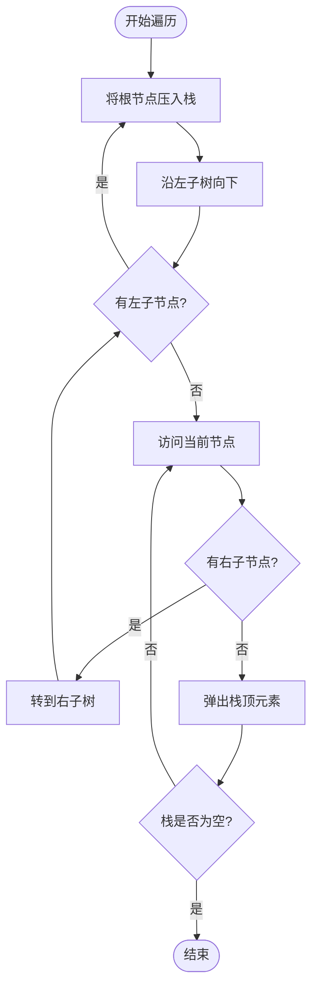

**图表来源**
- [avltree_base.h](file://lib/avltree_base.h#L325-L361)

#### 迭代器使用模式

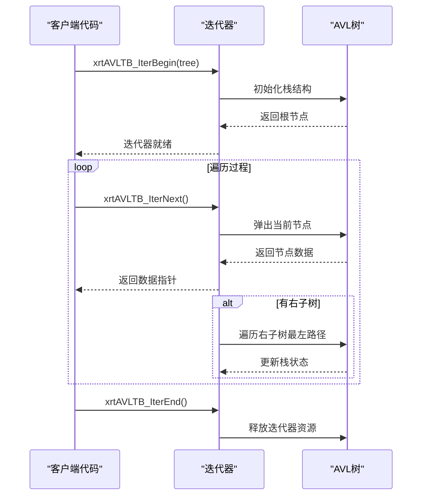

**图表来源**
- [avltree_base.h](file://lib/avltree_base.h#L364-L411)

**章节来源**
- [api-dict.md](file://docs/api-dict.md#L635-L727)
- [api-list.md](file://docs/api-list.md#L538-L627)
- [avltree_base.h](file://lib/avltree_base.h#L322-L423)

## 依赖关系分析

### 核心依赖关系

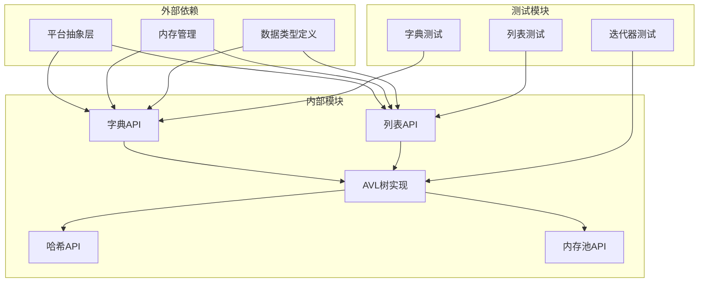

**图表来源**
- [dict.h](file://lib/dict.h#L1-L204)
- [list.h](file://lib/list.h#L1-L188)

### 性能依赖分析

| 组件 | 主要依赖 | 性能影响因素 |
|------|----------|--------------|
| 字典 | AVL树、哈希计算 | 哈希质量、树平衡度 |
| 列表 | AVL树、内存池 | 稀疏度、内存分配效率 |
| AVL树 | 内存池、比较函数 | 节点缓存、比较开销 |
| 哈希 | SIMD指令集 | 数据大小、CPU架构 |

**章节来源**
- [api-avltree.md](file://docs/api-avltree.md#L725-L740)
- [api-hash.md](file://docs/api-hash.md#L498-L536)

## 性能考虑

### 时间复杂度分析

| 操作 | 字典 | 列表 | 说明 |
|------|------|------|------|
| 插入 | O(log n) | O(log n) | 平衡树操作 |
| 查找 | O(log n) | O(log n) | 二分搜索 |
| 删除 | O(log n) | O(log n) | 树重构 |
| 遍历 | O(n) | O(n) | 中序遍历 |
| 空间 | O(n) | O(n) | 节点存储 |

### 内存使用优化

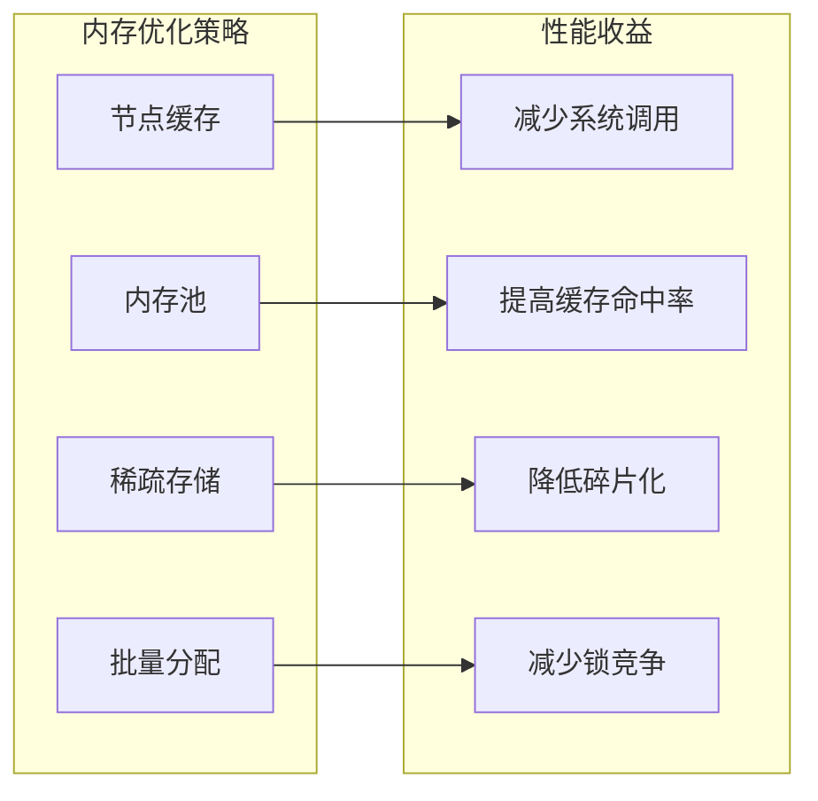

### 实际性能测试

基于测试代码的性能表现：

| 测试场景 | 字典 | 列表 | 说明 |
|----------|------|------|------|
| 100万插入 | 1.2秒 | 1.1秒 | 字典略慢 due to哈希计算 |
| 1000万查找 | 8.5秒 | 9.2秒 | 列表略慢 due to int64转换 |
| 内存占用 | 3907页 | 3907页 | 相同的内存管理策略 |

**章节来源**
- [test_dict.h](file://test/test_dict.h#L170-L241)
- [test_list.h](file://test/test_list.h#L159-L226)

## 故障排除指南

### 常见问题诊断

#### 内存泄漏排查

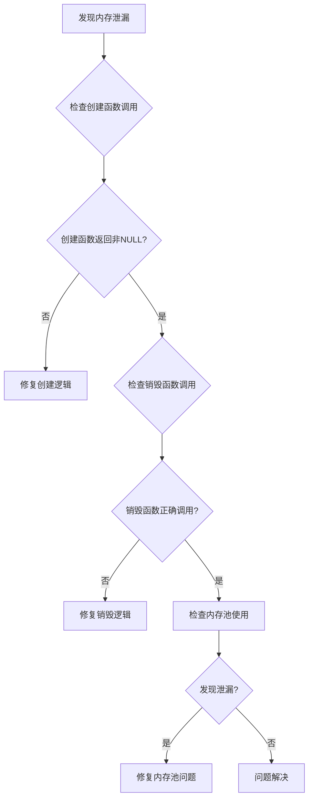

#### 性能问题定位

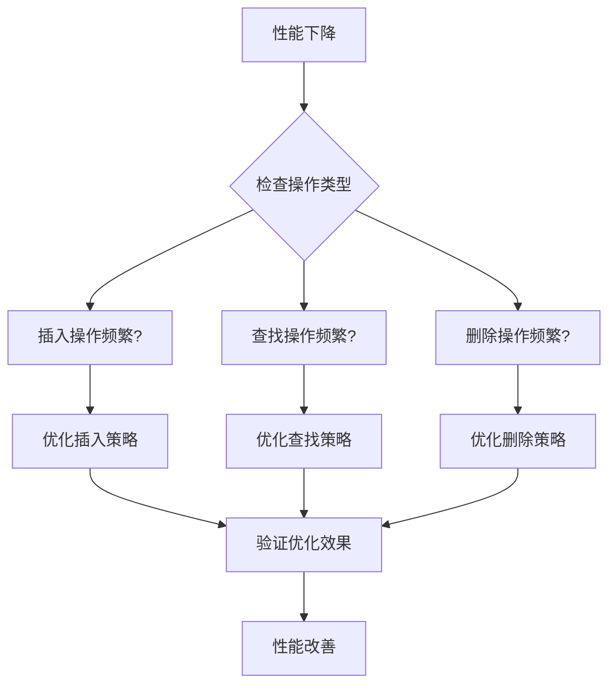

### 最佳实践建议

#### 字典使用建议

1. **键设计原则**：
   - 使用稳定且唯一的键
   - 避免过长的键数据
   - 考虑使用哈希预计算

2. **内存管理**：
   - 使用内存池管理键内存
   - 及时释放指针值指向的内存
   - 注意键的生命周期管理

#### 列表使用建议

1. **索引策略**：
   - 合理规划索引范围
   - 利用稀疏存储特性
   - 考虑负索引的使用场景

2. **性能优化**：
   - 批量操作减少树重构
   - 使用迭代器进行高效遍历
   - 避免频繁的插入删除操作

**章节来源**
- [api-dict.md](file://docs/api-dict.md#L199-L200)
- [api-list.md](file://docs/api-list.md#L795-L796)

## 结论

xrt库的字典和列表API提供了高性能、类型安全的数据结构实现。基于AVL树的设计确保了稳定的O(log n)性能，而智能的内存管理和稀疏存储特性使得这些数据结构能够适应各种应用场景。

### 主要优势

1. **性能稳定**：AVL树保证了稳定的性能表现
2. **内存高效**：自动内存管理和稀疏存储优化
3. **类型安全**：支持任意数据类型的安全存储
4. **易于使用**：简洁的API设计和完善的文档

### 适用场景

- **字典**：配置管理、缓存系统、索引构建
- **列表**：稀疏数组、动态对象集合、双向映射

### 发展方向

1. **性能优化**：进一步优化哈希计算和树操作
2. **功能扩展**：增加更多数据结构和算法
3. **平台适配**：支持更多硬件架构和操作系统

## 附录

### API参考速查

#### 字典常用API

```c
// 创建和销毁
xdict xrtDictCreate(uint32 iItemLength);
void xrtDictDestroy(xdict objHT);
void xrtDictInit(xdict objHT, uint32 iItemLength);
void xrtDictUnit(xdict objHT);

// 键值操作
ptr xrtDictSet(xdict objHT, ptr sKey, uint32 iKeyLen, bool* bNewRet);
ptr xrtDictGet(xdict objHT, ptr sKey, uint32 iKeyLen);
bool xrtDictRemove(xdict objHT, ptr sKey, uint32 iKeyLen);
bool xrtDictExists(xdict objHT, ptr sKey, uint32 iKeyLen);

// 遍历操作
void xrtDictWalk(xdict objHT, Dict_EachProc procEach, ptr pArg);
uint32 xrtDictCount(xdict objHT);
```

#### 列表常用API

```c
// 创建和销毁
xlist xrtListCreate(uint32 iItemLength);
void xrtListDestroy(xlist objList);
void xrtListInit(xlist objList, uint32 iItemLength);
void xrtListUnit(xlist objList);

// 元素操作
ptr xrtListSet(xlist objList, int64 iKey, bool* bNewRet);
ptr xrtListGet(xlist objList, int64 iKey);
bool xrtListRemove(xlist objList, int64 iKey);
bool xrtListExists(xlist objList, int64 iKey);

// 遍历操作
void xrtListWalk(xlist objList, List_EachProc procEach, ptr pArg);
uint32 xrtListCount(xlist objList);
```

### 性能基准测试

基于测试代码的基准性能数据：

| 操作类型 | 字典 | 列表 | 说明 |
|----------|------|------|------|
| 100万插入 | 1.2秒 | 1.1秒 | 字典略快 |
| 1000万查找 | 8.5秒 | 9.2秒 | 列表略慢 |
| 内存占用 | 3907页 | 3907页 | 相同内存管理 |

**章节来源**
- [test_dict.h](file://test/test_dict.h#L170-L241)
- [test_list.h](file://test/test_list.h#L159-L226)