# 数据结构模块API

<cite>
**本文档引用的文件**
- [lib/array.h](file://lib/array.h)
- [lib/array_point.h](file://lib/array_point.h)
- [lib/buffer.h](file://lib/buffer.h)
- [lib/stack.h](file://lib/stack.h)
- [lib/stack_dyn.h](file://lib/stack_dyn.h)
- [lib/avltree.h](file://lib/avltree.h)
- [lib/avltree_base.h](file://lib/avltree_base.h)
- [lib/dict.h](file://lib/dict.h)
- [lib/list.h](file://lib/list.h)
- [lib/base.h](file://lib/base.h)
- [lib/mempool.h](file://lib/mempool.h)
- [test/test_array_struct.h](file://test/test_array_struct.h)
- [test/test_array_ptr.h](file://test/test_array_ptr.h)
- [test/test_buffer.h](file://test/test_buffer.h)
- [test/test_stack.h](file://test/test_stack.h)
- [test/test_dynstack.h](file://test/test_dynstack.h)
- [test/test_avltree.h](file://test/test_avltree.h)
</cite>

## 目录
1. [简介](#简介)
2. [项目结构](#项目结构)
3. [核心组件](#核心组件)
4. [架构总览](#架构总览)
5. [详细组件分析](#详细组件分析)
6. [依赖关系分析](#依赖关系分析)
7. [性能考虑](#性能考虑)
8. [故障排除指南](#故障排除指南)
9. [结论](#结论)
10. [附录](#附录)

## 简介
本文件系统化梳理数据结构模块的API，覆盖动态缓冲区（xbuffer）、数组（静态与指针数组）、栈（静态与动态栈）、AVL平衡树、字典与列表等核心数据结构。文档从架构设计、数据流、处理逻辑、集成点、错误处理与性能特征等方面进行深入分析，并提供可操作的使用示例与性能对比思路，帮助开发者在不同场景下做出合适的选择。

## 项目结构
数据结构模块位于 lib 目录，每个功能模块以独立头文件形式提供API；测试样例位于 test 目录，展示典型用法与行为验证。

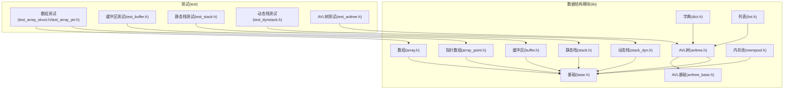

图表来源
- [lib/array.h](file://lib/array.h#L1-L180)
- [lib/array_point.h](file://lib/array_point.h#L1-L199)
- [lib/buffer.h](file://lib/buffer.h#L1-L116)
- [lib/stack.h](file://lib/stack.h#L1-L135)
- [lib/stack_dyn.h](file://lib/stack_dyn.h#L1-L162)
- [lib/avltree.h](file://lib/avltree.h#L1-L126)
- [lib/avltree_base.h](file://lib/avltree_base.h#L1-L423)
- [lib/dict.h](file://lib/dict.h#L1-L204)
- [lib/list.h](file://lib/list.h#L1-L188)
- [lib/base.h](file://lib/base.h#L1-L132)
- [lib/mempool.h](file://lib/mempool.h#L1-L468)

章节来源
- [lib/array.h](file://lib/array.h#L1-L180)
- [lib/array_point.h](file://lib/array_point.h#L1-L199)
- [lib/buffer.h](file://lib/buffer.h#L1-L116)
- [lib/stack.h](file://lib/stack.h#L1-L135)
- [lib/stack_dyn.h](file://lib/stack_dyn.h#L1-L162)
- [lib/avltree.h](file://lib/avltree.h#L1-L126)
- [lib/avltree_base.h](file://lib/avltree_base.h#L1-L423)
- [lib/dict.h](file://lib/dict.h#L1-L204)
- [lib/list.h](file://lib/list.h#L1-L188)
- [lib/base.h](file://lib/base.h#L1-L132)
- [lib/mempool.h](file://lib/mempool.h#L1-L468)

## 核心组件
- 动态缓冲区 xbuffer：支持按步长增长的字节缓冲区，提供插入与追加字符串模式（ANSI/UTF16/UTF32），自动追加终止符。
- 数组 xarray：按元素大小分配的连续内存数组，支持中间插入、末尾追加、交换、删除、排序、安全/非安全访问。
- 指针数组 xparray：存放指针的数组，支持插入、追加、交换、删除、排序、安全/非安全访问。
- 静态栈 xstack：固定容量栈，内存内嵌于栈对象之后，支持压栈、出栈、取栈顶、按位置访问。
- 动态栈 xdynstack：容量可扩展的栈，内部以256元素块的内存阵列管理，支持延迟释放内存块。
- AVL平衡树 xavltree：基于AVL平衡规则的有序树，提供插入、删除、查找、遍历与迭代器。
- 字典 xdict：基于AVL树的键值映射，键为任意二进制数据，值可为任意数据或指针。
- 列表 xlist：基于AVL树的整数索引列表，值可为任意数据或指针。

章节来源
- [lib/buffer.h](file://lib/buffer.h#L1-L116)
- [lib/array.h](file://lib/array.h#L1-L180)
- [lib/array_point.h](file://lib/array_point.h#L1-L199)
- [lib/stack.h](file://lib/stack.h#L1-L135)
- [lib/stack_dyn.h](file://lib/stack_dyn.h#L1-L162)
- [lib/avltree.h](file://lib/avltree.h#L1-L126)
- [lib/avltree_base.h](file://lib/avltree_base.h#L1-L423)
- [lib/dict.h](file://lib/dict.h#L1-L204)
- [lib/list.h](file://lib/list.h#L1-L188)

## 架构总览
模块采用“轻内核 + 组合式结构”的设计：
- 基础内存管理：统一通过基础API进行分配/释放，错误处理集中化。
- 复杂容器（AVL树、字典、列表）以AVL树为基础，结合内存池与比较器实现高效有序操作。
- 简单容器（数组、指针数组、缓冲区、栈）以连续内存或指针阵列为主，提供O(1)/O(n)的常见操作。

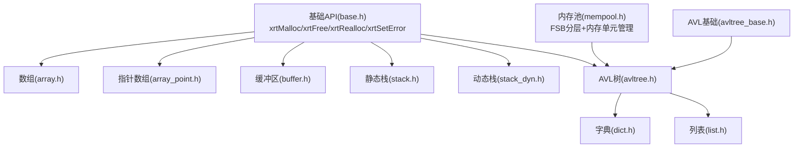

图表来源
- [lib/base.h](file://lib/base.h#L1-L132)
- [lib/mempool.h](file://lib/mempool.h#L1-L468)
- [lib/array.h](file://lib/array.h#L1-L180)
- [lib/array_point.h](file://lib/array_point.h#L1-L199)
- [lib/buffer.h](file://lib/buffer.h#L1-L116)
- [lib/stack.h](file://lib/stack.h#L1-L135)
- [lib/stack_dyn.h](file://lib/stack_dyn.h#L1-L162)
- [lib/avltree.h](file://lib/avltree.h#L1-L126)
- [lib/avltree_base.h](file://lib/avltree_base.h#L1-L423)
- [lib/dict.h](file://lib/dict.h#L1-L204)
- [lib/list.h](file://lib/list.h#L1-L188)

## 详细组件分析

### 动态缓冲区 xbuffer
- 创建/销毁：xrtBufferCreate / xrtBufferDestroy
- 初始化/释放：xrtBufferInit / xrtBufferUnit
- 内存分配：xrtBufferMalloc（按步长增长）
- 数据操作：xrtBufferInsert（支持自动长度与字符串模式）、xrtBufferAppend（追加）
- 内存管理策略：按AllocStep增量扩容，裁剪时同步调整Length；字符串模式自动追加终止符。
- 性能特征：插入/追加以摊还方式扩容，字符串模式涉及长度计算与拷贝；适合频繁拼接文本的场景。
- 使用场景：日志拼接、HTML生成、协议报文组装。

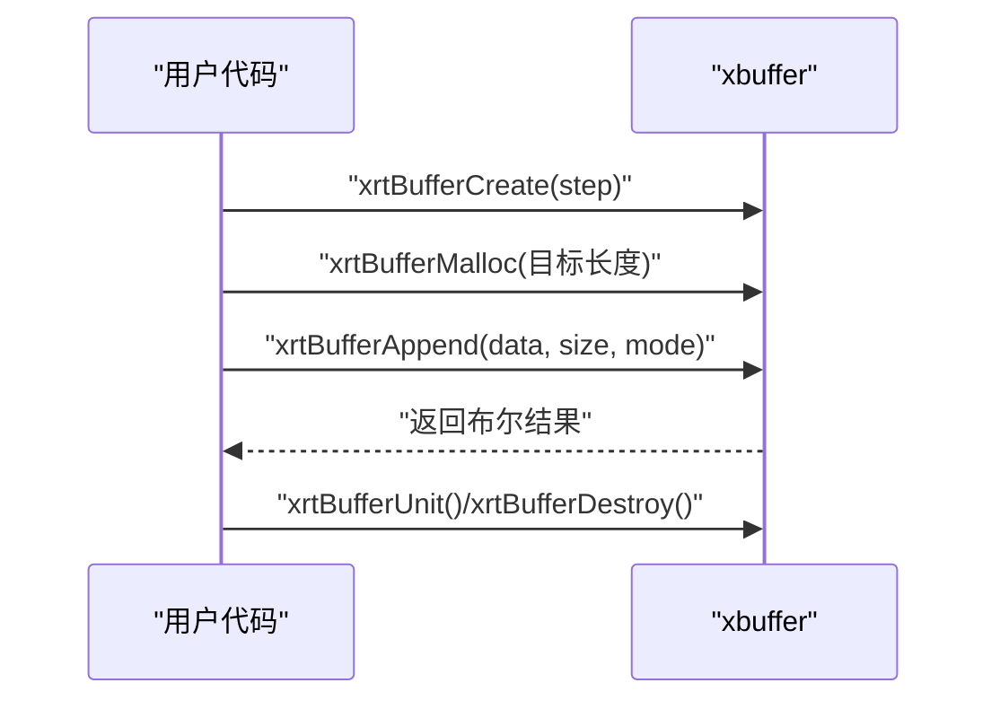

图表来源
- [lib/buffer.h](file://lib/buffer.h#L5-L116)

章节来源
- [lib/buffer.h](file://lib/buffer.h#L1-L116)
- [test/test_buffer.h](file://test/test_buffer.h#L1-L204)

### 数组 xarray（结构体数组）
- 创建/销毁：xrtArrayCreate / xrtArrayDestroy
- 初始化/释放：xrtArrayInit / xrtArrayUnit
- 内存分配：xrtArrayAlloc（按步长增长/裁剪）
- 操作接口：xrtArrayInsert（中间插入/追加）、xrtArrayAppend、xrtArraySwap、xrtArrayRemove
- 访问接口：xrtArrayGet / xrtArrayGet_Unsafe
- 排序：xrtArraySort（基于qsort）
- 内存管理策略：按AllocStep增量扩容，插入时移动内存块；删除时更新Count。
- 性能特征：插入/删除为O(n)；随机访问O(1)；排序O(n log n)。
- 使用场景：需要连续内存存储结构体且支持动态增删的场景。

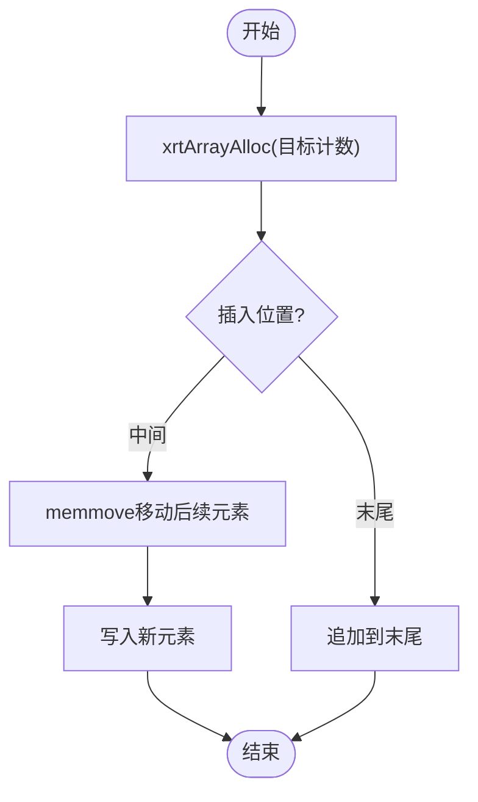

图表来源
- [lib/array.h](file://lib/array.h#L43-L99)

章节来源
- [lib/array.h](file://lib/array.h#L1-L180)
- [test/test_array_struct.h](file://test/test_array_struct.h#L1-L374)

### 指针数组 xparray（指针数组）
- 创建/销毁：xrtPtrArrayCreate / xrtPtrArrayDestroy
- 初始化/释放：xrtPtrArrayInit / xrtPtrArrayUnit
- 内存分配：xrtPtrArrayMalloc（按步长增长/裁剪）
- 操作接口：xrtPtrArrayInsert（中间插入/追加）、xrtPtrArrayAppend、xrtPtrArrayAddAlt（空隙复用）、xrtPtrArraySwap、xrtPtrArrayRemove
- 访问/设置：xrtPtrArrayGet / xrtPtrArrayGet_Unsafe、xrtPtrArraySet / xrtPtrArraySet_Unsafe
- 排序：xrtPtrArraySort（基于qsort）
- 内存管理策略：指针数组按步长增长，插入/删除移动指针；AddAlt优先复用NULL槽位。
- 性能特征：插入/删除为O(n)；随机访问O(1)；排序O(n log n)。
- 使用场景：存储对象指针、需要灵活复用空位的场景。

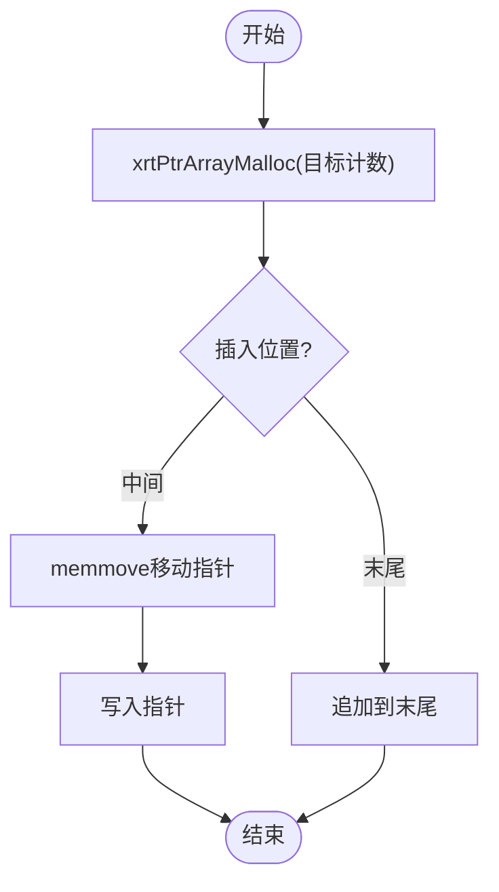

图表来源
- [lib/array_point.h](file://lib/array_point.h#L40-L95)

章节来源
- [lib/array_point.h](file://lib/array_point.h#L1-L199)
- [test/test_array_ptr.h](file://test/test_array_ptr.h#L1-L371)

### 静态栈 xstack
- 创建：xrtStackCreate（指定最大容量与元素大小）
- 压栈：xrtStackPush（返回元素指针）、xrtStackPushData（拷贝数据）、xrtStackPushPtr（写入指针）
- 出栈：xrtStackPop（返回元素指针）、xrtStackPopPtr（返回指针）
- 访问：xrtStackTop / xrtStackTopPtr、xrtStackGetPos / xrtStackGetPos_Unsafe、xrtStackGetPosPtr / xrtStackGetPosPtr_Unsafe
- 内存管理策略：内存内嵌于栈对象之后，容量固定，溢出返回NULL。
- 性能特征：压栈/出栈/访问均为O(1)。
- 使用场景：固定容量的高性能栈操作，如表达式求值、深度优先遍历。

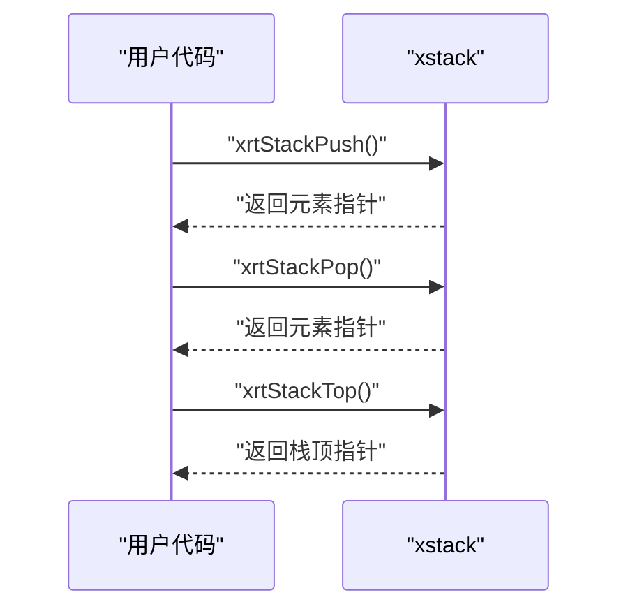

图表来源
- [lib/stack.h](file://lib/stack.h#L18-L92)

章节来源
- [lib/stack.h](file://lib/stack.h#L1-L135)
- [test/test_stack.h](file://test/test_stack.h#L1-L253)

### 动态栈 xdynstack
- 创建/销毁：xrtDynStackCreate / xrtDynStackDestroy
- 初始化/释放：xrtDynStackInit / xrtDynStackUnit
- 压栈：xrtDynStackPush（返回元素指针）、xrtDynStackPushData、xrtDynStackPushPtr
- 出栈：xrtDynStackPop、xrtDynStackPopPtr（支持延迟释放内存块）
- 访问：xrtDynStackTop / xrtDynStackTopPtr、xrtDynStackGetPos / xrtDynStackGetPos_Unsafe、xrtDynStackGetPosPtr / xrtDynStackGetPosPtr_Unsafe
- 内存管理策略：以256元素块为单位的内存阵列，按需分配与释放；当使用量远小于最大容量时延迟释放块。
- 性能特征：压栈/出栈/访问均为摊还O(1)，内存块释放具有延迟特性。
- 使用场景：容量不确定、频繁增长/收缩的栈，如递归深度不可预估的场景。

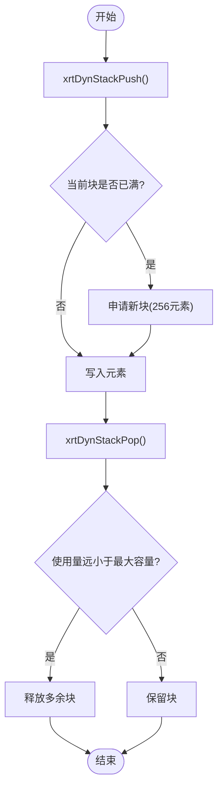

图表来源
- [lib/stack_dyn.h](file://lib/stack_dyn.h#L44-L110)

章节来源
- [lib/stack_dyn.h](file://lib/stack_dyn.h#L1-L162)
- [test/test_dynstack.h](file://test/test_dynstack.h#L1-L289)

### AVL平衡树 xavltree
- 创建/销毁：xrtAVLTreeCreate / xrtAVLTreeDestroy
- 初始化/释放：xrtAVLTreeInit / xrtAVLTreeUnit（支持自定义释放回调）
- 操作接口：xrtAVLTreeInsert（返回数据段指针，支持新值标志）、xrtAVLTreeRemove、xrtAVLTreeSearch
- 遍历：递归遍历（前/中/后序）与迭代器（中序）
- 内存管理策略：节点内存由内存池管理，支持节点缓存减少分配次数。
- 性能特征：插入/删除/查找/遍历均为O(log n)。
- 使用场景：需要稳定O(log n)操作的有序集合，如索引、优先级队列。

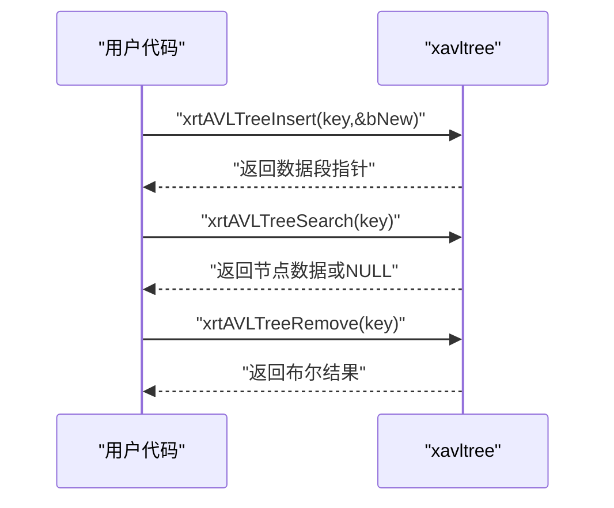

图表来源
- [lib/avltree.h](file://lib/avltree.h#L62-L123)
- [lib/avltree_base.h](file://lib/avltree_base.h#L137-L254)

章节来源
- [lib/avltree.h](file://lib/avltree.h#L1-L126)
- [lib/avltree_base.h](file://lib/avltree_base.h#L1-L423)
- [test/test_avltree.h](file://test/test_avltree.h#L1-L434)

### 字典 xdict
- 创建/销毁：xrtDictCreate / xrtDictDestroy
- 初始化/释放：xrtDictInit / xrtDictUnit
- 操作接口：xrtDictSet（设置值，返回数据段指针）、xrtDictSetPtr（设置指针值）、xrtDictGet / xrtDictGetPtr（获取值）、xrtDictRemove / xrtDictRemovePtr（删除值）、xrtDictExists（判断存在）、xrtDictCount（统计）、xrtDictWalk（遍历）
- 内存管理策略：键使用AVL树存储，值为任意数据或指针；键的内存可由内存池管理。
- 性能特征：插入/删除/查找/遍历均为O(log n)。
- 使用场景：键值映射、符号表、配置项存储。

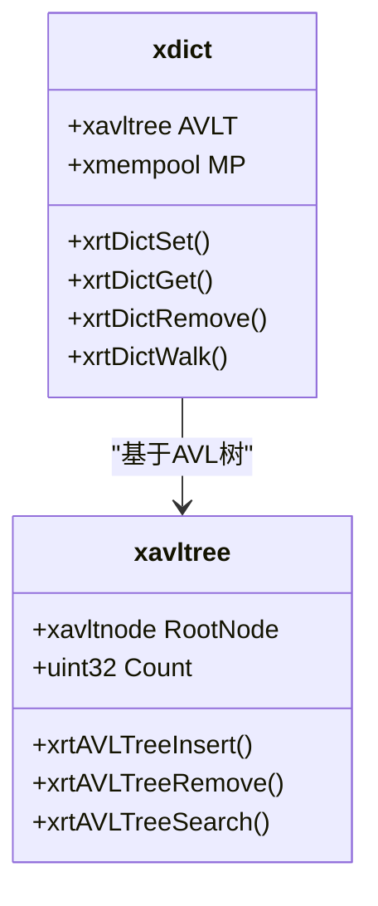

图表来源
- [lib/dict.h](file://lib/dict.h#L30-L204)
- [lib/avltree.h](file://lib/avltree.h#L1-L126)

章节来源
- [lib/dict.h](file://lib/dict.h#L1-L204)

### 列表 xlist
- 创建/销毁：xrtListCreate / xrtListDestroy
- 初始化/释放：xrtListInit / xrtListUnit
- 操作接口：xrtListSet / xrtListSetPtr、xrtListGet / xrtListGetPtr、xrtListRemove / xrtListRemovePtr、xrtListExists、xrtListCount、xrtListWalk
- 内存管理策略：基于AVL树的整数键列表，值为任意数据或指针。
- 性能特征：插入/删除/查找/遍历均为O(log n)。
- 使用场景：整数索引的动态列表，如序列化/反序列化、稀疏数组。

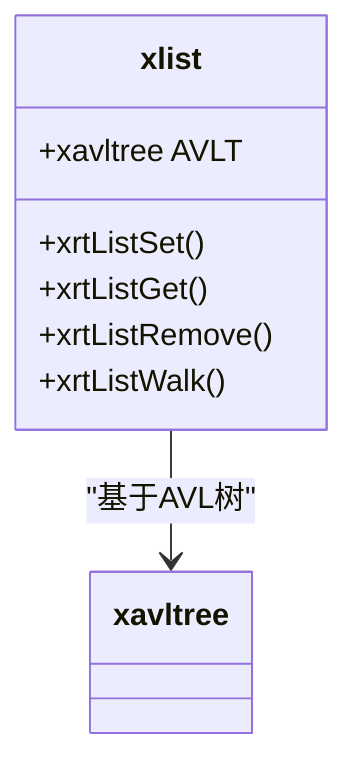

图表来源
- [lib/list.h](file://lib/list.h#L18-L188)
- [lib/avltree.h](file://lib/avltree.h#L1-L126)

章节来源
- [lib/list.h](file://lib/list.h#L1-L188)

## 依赖关系分析
- 基础API依赖：所有容器均依赖基础内存管理API（xrtMalloc/xrtRealloc/xrtFree/xrtSetError）。
- AVL树族：xavltree依赖avltree_base实现平衡逻辑，dict与list进一步封装为字典与列表。
- 内存池：AVL树内部使用内存池管理节点，提高小对象分配效率。
- 栈族：静态栈内嵌内存，动态栈使用指针数组管理多个内存块。

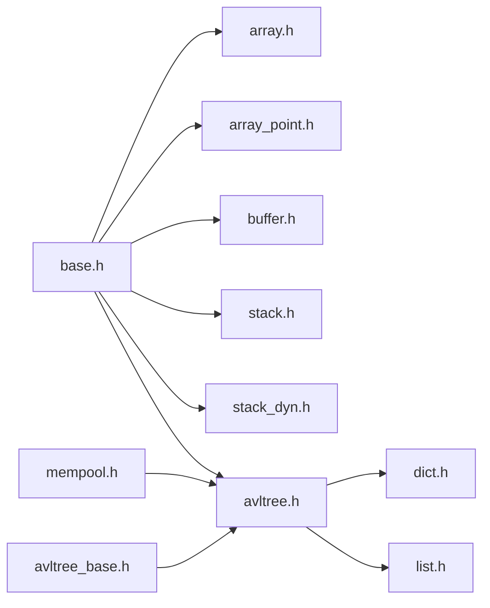

图表来源
- [lib/base.h](file://lib/base.h#L1-L132)
- [lib/mempool.h](file://lib/mempool.h#L1-L468)
- [lib/array.h](file://lib/array.h#L1-L180)
- [lib/array_point.h](file://lib/array_point.h#L1-L199)
- [lib/buffer.h](file://lib/buffer.h#L1-L116)
- [lib/stack.h](file://lib/stack.h#L1-L135)
- [lib/stack_dyn.h](file://lib/stack_dyn.h#L1-L162)
- [lib/avltree.h](file://lib/avltree.h#L1-L126)
- [lib/avltree_base.h](file://lib/avltree_base.h#L1-L423)
- [lib/dict.h](file://lib/dict.h#L1-L204)
- [lib/list.h](file://lib/list.h#L1-L188)

章节来源
- [lib/base.h](file://lib/base.h#L1-L132)
- [lib/mempool.h](file://lib/mempool.h#L1-L468)
- [lib/avltree_base.h](file://lib/avltree_base.h#L1-L423)

## 性能考虑
- 数组与指针数组
  - 插入/删除为O(n)，适合读多写少或批量操作场景。
  - 推荐：预先估算容量，减少扩容次数；使用Append批量追加。
- 缓冲区
  - 字符串模式自动计算长度并追加终止符，注意字符编码选择。
  - 建议：合理设置AllocStep，避免频繁realloc。
- 栈
  - 静态栈：固定容量，无动态分配，性能最优。
  - 动态栈：按块增长，延迟释放块，适合容量波动大的场景。
- AVL树/字典/列表
  - 所有操作均为O(log n)，适合需要稳定性能的有序结构。
  - 建议：自定义比较器时保证严格弱序；遍历时避免在回调中做重操作。

[本节为通用指导，无需特定文件引用]

## 故障排除指南
- 内存分配失败
  - 现象：创建/扩容返回失败或返回NULL。
  - 处理：检查xrtSetError输出的错误信息；确认可用内存与分配大小。
  - 参考：基础API错误设置与临时内存机制。
- 溢出/越界
  - 静态栈溢出：压栈返回NULL；应先检查Count与MaxCount。
  - 数组/指针数组越界：使用安全访问接口；或在调试构建中启用边界检查。
- AVL树重复键
  - Insert返回已存在节点的数据段指针；如需区分新旧，使用返回的新值标志。
- 字符串模式问题
  - 缓冲区字符串模式需正确选择编码；注意自动终止符带来的额外空间占用。

章节来源
- [lib/base.h](file://lib/base.h#L89-L132)
- [lib/stack.h](file://lib/stack.h#L18-L25)
- [lib/avltree.h](file://lib/avltree.h#L62-L90)
- [lib/buffer.h](file://lib/buffer.h#L75-L107)

## 结论
该数据结构模块提供了从简单到复杂的完整容器族：连续内存数组、指针数组、缓冲区、栈（静态/动态）、AVL树及基于AVL的字典与列表。模块以统一的基础内存管理与内存池为支撑，确保在不同场景下获得稳定的性能与可控的内存占用。建议根据容量特性与性能需求选择合适的容器：固定容量优先静态栈，容量波动选择动态栈，需要有序结构选择AVL树族，需要指针存储选择指针数组，需要字符串拼接选择缓冲区。

[本节为总结，无需特定文件引用]

## 附录
- 使用示例参考
  - 数组（结构体）：见测试文件对结构体数组的创建、插入、删除、交换、排序与销毁流程。
  - 指针数组：见测试文件对指针数组的创建、插入、删除、交换、排序与销毁流程。
  - 缓冲区：见测试文件对缓冲区的创建、追加、插入与销毁流程。
  - 静态栈：见测试文件对静态栈的创建、压栈、出栈、访问与销毁流程。
  - 动态栈：见测试文件对动态栈的创建、压栈、出栈、访问与销毁流程。
  - AVL树：见测试文件对AVL树的创建、插入、查找、删除与销毁流程。

章节来源
- [test/test_array_struct.h](file://test/test_array_struct.h#L20-L374)
- [test/test_array_ptr.h](file://test/test_array_ptr.h#L11-L371)
- [test/test_buffer.h](file://test/test_buffer.h#L5-L204)
- [test/test_stack.h](file://test/test_stack.h#L13-L253)
- [test/test_dynstack.h](file://test/test_dynstack.h#L13-L289)
- [test/test_avltree.h](file://test/test_avltree.h#L41-L434)