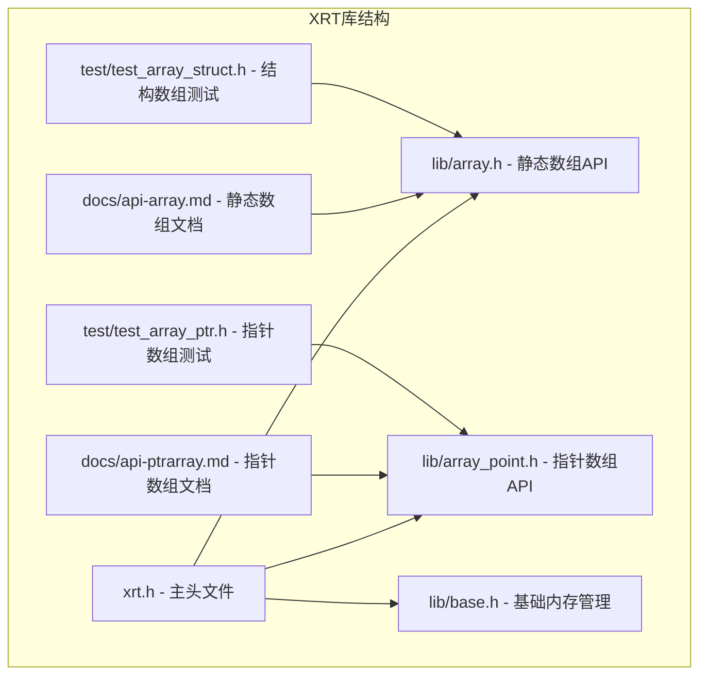
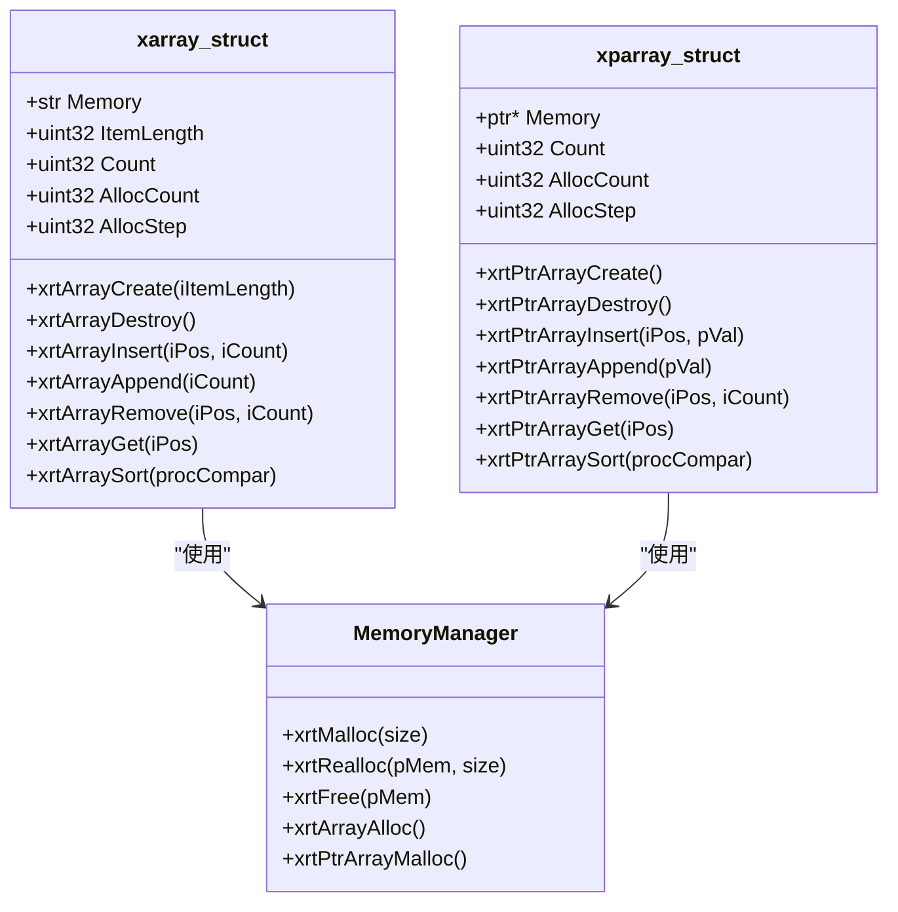
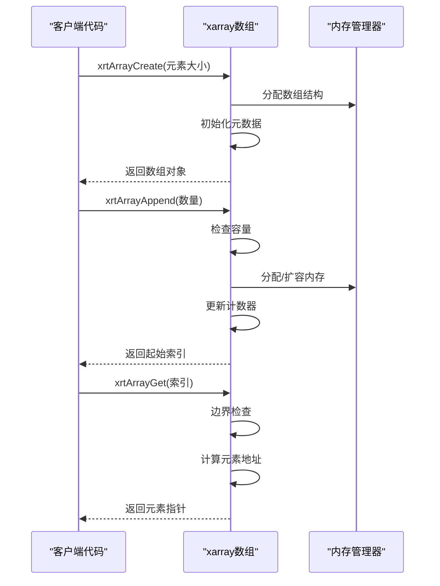
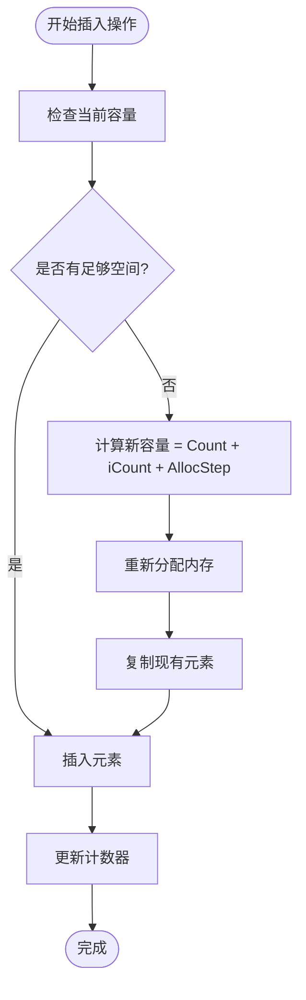
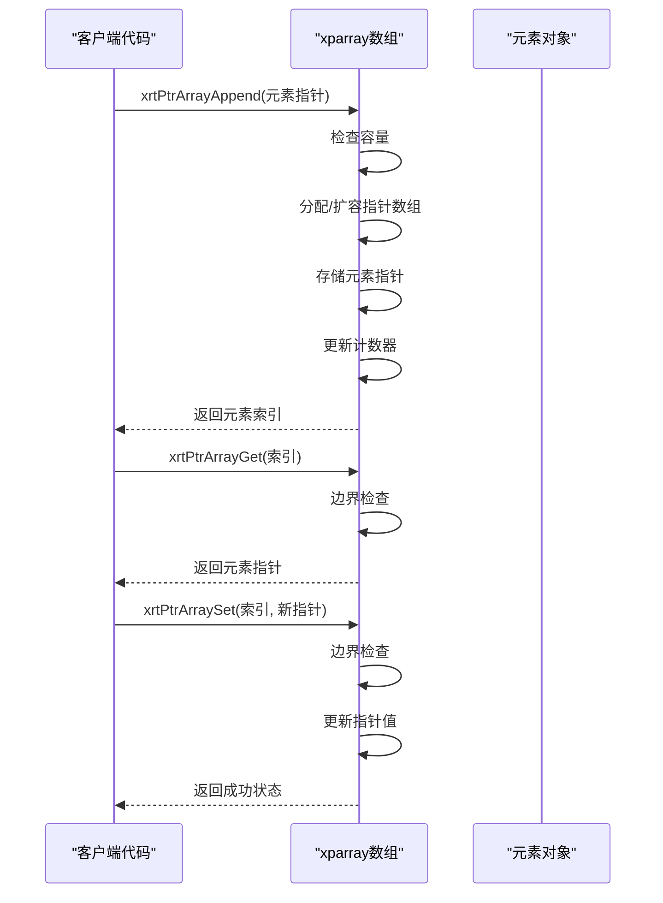
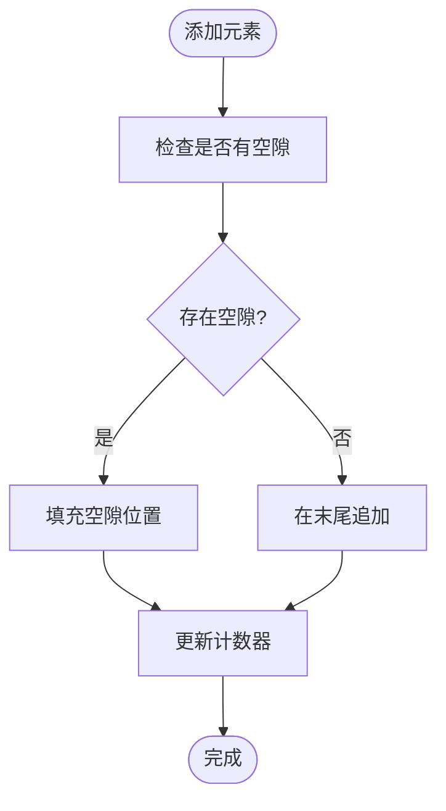
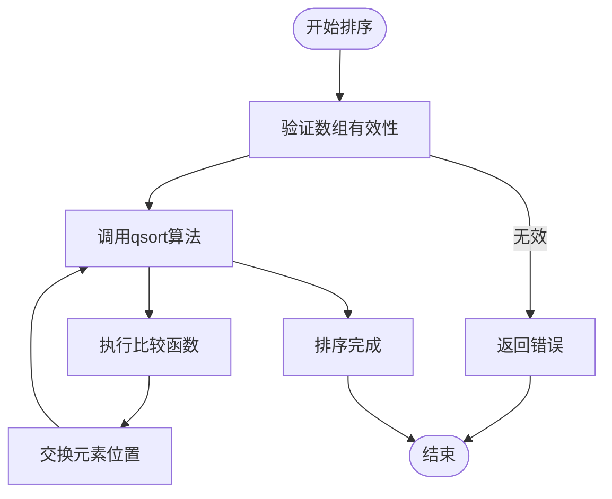
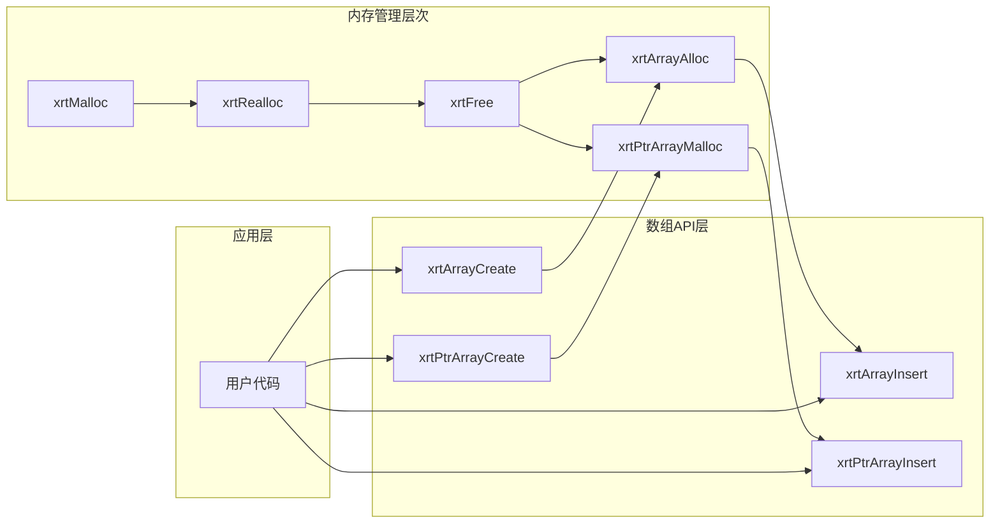

# 数组操作API

<cite>
**本文档引用的文件**
- [lib/array.h](file://lib/array.h)
- [lib/array_point.h](file://lib/array_point.h)
- [docs/api-array.md](file://docs/api-array.md)
- [docs/api-ptrarray.md](file://docs/api-ptrarray.md)
- [test/test_array_ptr.h](file://test/test_array_ptr.h)
- [test/test_array_struct.h](file://test/test_array_struct.h)
- [xrt.h](file://xrt.h)
- [lib/base.h](file://lib/base.h)
- [docs/README.md](file://docs/README.md)
- [docs/types.md](file://docs/types.md)
</cite>

## 目录
1. [简介](#简介)
2. [项目结构](#项目结构)
3. [核心组件](#核心组件)
4. [架构概览](#架构概览)
5. [详细组件分析](#详细组件分析)
6. [依赖关系分析](#依赖关系分析)
7. [性能考虑](#性能考虑)
8. [故障排除指南](#故障排除指南)
9. [结论](#结论)
10. [附录](#附录)

## 简介

XRT 数组操作API提供了两种类型的动态数组管理功能：静态数组（结构体数组）和指针数组。该API设计用于高效管理可变大小的数据集合，支持任意数据类型的元素存储，包括基本数据类型、结构体和指针。

静态数组适用于存储值类型数据，每个元素都是连续内存中的完整结构；指针数组则存储指向数据的指针，适合处理复杂对象和混合数据类型。

## 项目结构

XRT库采用模块化设计，数组功能位于独立的头文件中，提供完整的API接口和使用示例。



**图表来源**
- [xrt.h](file://xrt.h#L1060-L1196)
- [lib/array.h](file://lib/array.h#L1-L180)
- [lib/array_point.h](file://lib/array_point.h#L1-L199)

**章节来源**
- [docs/README.md](file://docs/README.md#L31-L48)
- [docs/types.md](file://docs/types.md#L80-L100)

## 核心组件

### 静态数组（xarray）

静态数组用于存储值类型数据，每个元素都是连续内存中的完整结构。其核心特点包括：

- **内存连续性**：元素存储在连续的内存块中
- **类型安全**：编译时确定元素大小
- **高效访问**：缓存友好，访问速度快
- **自动扩容**：支持预分配和动态扩容

### 指针数组（xparray）

指针数组用于存储指向数据的指针，适合处理复杂对象和混合数据类型：

- **灵活存储**：可以存储不同类型的数据
- **内存独立**：元素数据与数组结构分离
- **对象管理**：适合管理复杂对象生命周期
- **空隙复用**：支持自动查找空隙功能

**章节来源**
- [lib/array.h](file://lib/array.h#L47-L54)
- [lib/array_point.h](file://lib/array_point.h#L47-L53)

## 架构概览

XRT数组API采用统一的架构设计，两种数组类型共享相似的操作接口，但在内部实现上有显著差异。



**图表来源**
- [xrt.h](file://xrt.h#L1068-L1073)
- [xrt.h](file://xrt.h#L1145-L1151)
- [lib/base.h](file://lib/base.h#L5-L45)

## 详细组件分析

### 静态数组API详解

#### 基础操作

静态数组提供了完整的数组管理功能：



**图表来源**
- [lib/array.h](file://lib/array.h#L5-L13)
- [lib/array.h](file://lib/array.h#L102-L105)
- [lib/array.h](file://lib/array.h#L153-L162)

#### 内存管理机制

静态数组采用预分配策略，通过`AllocStep`参数控制扩容步长：

| 操作类型 | 时间复杂度 | 空间复杂度 | 说明 |
|---------|-----------|-----------|------|
| 创建 | O(1) | O(1) | 分配数组结构 |
| 插入 | O(n) | O(1) | 最坏情况需要移动元素 |
| 删除 | O(n) | O(1) | 最坏情况需要移动元素 |
| 访问 | O(1) | O(1) | 直接索引访问 |
| 扩容 | O(n) | O(n) | 分配新内存并复制 |

#### 自动扩容机制



**图表来源**
- [lib/array.h](file://lib/array.h#L82-L86)
- [lib/array.h](file://lib/array.h#L43-L74)

**章节来源**
- [lib/array.h](file://lib/array.h#L43-L74)
- [lib/array.h](file://lib/array.h#L77-L99)

### 指针数组API详解

#### 指针存储优势

指针数组的核心优势在于其灵活性：

- **类型无关**：可以存储任意类型的指针
- **内存独立**：元素数据与数组结构分离
- **对象管理**：便于管理复杂对象的生命周期
- **空隙复用**：支持`xrtPtrArrayAddAlt`功能

#### 指针操作流程



**图表来源**
- [lib/array_point.h](file://lib/array_point.h#L98-L101)
- [lib/array_point.h](file://lib/array_point.h#L155-L164)
- [lib/array_point.h](file://lib/array_point.h#L171-L181)

#### 空隙复用功能

指针数组提供了独特的空隙复用功能，允许在删除元素后自动复用被删除位置：



**图表来源**
- [lib/array_point.h](file://lib/array_point.h#L104-L113)

**章节来源**
- [lib/array_point.h](file://lib/array_point.h#L39-L71)
- [lib/array_point.h](file://lib/array_point.h#L74-L95)

### 排序算法实现

两种数组类型都支持自定义排序功能，使用标准库的快速排序算法：



**图表来源**
- [lib/array.h](file://lib/array.h#L169-L177)
- [lib/array_point.h](file://lib/array_point.h#L188-L196)

**章节来源**
- [lib/array.h](file://lib/array.h#L169-L177)
- [lib/array_point.h](file://lib/array_point.h#L188-L196)

## 依赖关系分析

### 内存管理依赖

XRT数组API依赖于基础内存管理功能：



**图表来源**
- [lib/base.h](file://lib/base.h#L5-L45)
- [lib/array.h](file://lib/array.h#L43-L47)
- [lib/array_point.h](file://lib/array_point.h#L40-L44)

### 错误处理机制

数组API提供了完善的错误处理机制：

| 错误类型 | 触发条件 | 处理方式 |
|---------|---------|---------|
| 内存分配失败 | `xrtMalloc`/`xrtRealloc`返回NULL | 设置错误状态，返回NULL或FALSE |
| 索引越界 | 访问不存在的元素 | 返回NULL或FALSE，不崩溃 |
| 参数无效 | 传入无效的参数值 | 返回FALSE，记录错误信息 |
| 空数组操作 | 对空数组执行操作 | 安全处理，返回适当结果 |

**章节来源**
- [lib/base.h](file://lib/base.h#L89-L101)
- [lib/array.h](file://lib/array.h#L8-L10)
- [lib/array_point.h](file://lib/array_point.h#L6-L9)

## 性能考虑

### 时间复杂度分析

| 操作 | 静态数组 | 指针数组 | 说明 |
|------|---------|---------|------|
| 访问元素 | O(1) | O(1) | 直接索引访问 |
| 插入元素 | O(n) | O(n) | 需要移动后续元素 |
| 删除元素 | O(n) | O(n) | 需要移动后续元素 |
| 扩容操作 | O(n) | O(n) | 分配新内存并复制 |
| 排序操作 | O(n log n) | O(n log n) | 使用qsort算法 |

### 空间复杂度分析

| 组件 | 空间复杂度 | 说明 |
|------|-----------|------|
| 数组结构 | O(1) | 固定大小的元数据结构 |
| 元素存储 | O(n*m) | n为元素数量，m为元素大小 |
| 指针数组 | O(n) | 每个指针占用固定空间 |
| 额外内存 | O(k) | k为预分配的额外空间 |

### 性能优化建议

1. **预分配策略**：对于已知大小的数据集，使用`xrtArrayAlloc`或`xrtPtrArrayMalloc`预分配内存
2. **批量操作**：使用`xrtArrayAppend`批量添加多个元素
3. **内联访问**：在高频访问场景使用`xrtArrayGet_Inline`或`xrtPtrArrayGet_Inline`
4. **避免频繁扩容**：合理估计数据规模，减少扩容次数

**章节来源**
- [docs/api-array.md](file://docs/api-array.md#L212-L265)
- [docs/api-ptrarray.md](file://docs/api-ptrarray.md#L166-L207)

## 故障排除指南

### 常见问题及解决方案

#### 内存泄漏问题

**问题**：数组销毁后仍有内存未释放

**原因分析**：
- 静态数组：元素数据与数组结构一起释放
- 指针数组：只释放指针数组，不释放指针指向的数据

**解决方案**：
```c
// 指针数组需要手动释放元素数据
for (int i = 1; i <= arr->Count; i++) {
    ElementType* element = xrtPtrArrayGet(arr, i);
    // 释放element指向的内存
    xrtFree(element);
}
xrtPtrArrayDestroy(arr);
```

#### 索引越界访问

**问题**：访问不存在的数组元素导致程序崩溃

**预防措施**：
- 使用安全版本的访问函数（带边界检查）
- 在访问前验证索引的有效性
- 使用`xrtArrayGet_Unsafe`或`xrtPtrArrayGet_Unsafe`时确保索引有效

#### 内存分配失败

**问题**：数组扩容或创建时内存分配失败

**处理方案**：
- 检查系统可用内存
- 实现适当的错误处理逻辑
- 考虑使用更小的预分配步长

**章节来源**
- [lib/array.h](file://lib/array.h#L153-L166)
- [lib/array_point.h](file://lib/array_point.h#L155-L168)

## 结论

XRT数组操作API提供了高效、灵活的动态数组管理功能。通过静态数组和指针数组的组合，开发者可以根据具体需求选择最适合的数据结构。

**主要优势**：
- 统一的API接口，易于学习和使用
- 完善的内存管理机制
- 高效的扩容策略
- 灵活的排序功能
- 丰富的使用示例和测试用例

**适用场景**：
- 需要频繁插入和删除操作的场景
- 大量数据的批处理操作
- 复杂对象的集合管理
- 需要自定义比较逻辑的数据排序

## 附录

### API参考表

#### 静态数组API

| 函数 | 参数 | 返回值 | 说明 |
|------|------|--------|------|
| `xrtArrayCreate` | `uint32 iItemLength` | `xarray` | 创建静态数组 |
| `xrtArrayDestroy` | `xarray pArr` | `void` | 销毁数组 |
| `xrtArrayAppend` | `xarray pArr, uint32 iCount` | `uint32` | 追加元素 |
| `xrtArrayInsert` | `xarray pArr, uint32 iPos, uint32 iCount` | `uint32` | 插入元素 |
| `xrtArrayRemove` | `xarray pArr, uint32 iPos, uint32 iCount` | `bool` | 删除元素 |
| `xrtArrayGet` | `xarray pArr, uint32 iPos` | `ptr` | 获取元素指针 |
| `xrtArraySort` | `xarray pArr, ptr procCompar` | `bool` | 排序数组 |

#### 指针数组API

| 函数 | 参数 | 返回值 | 说明 |
|------|------|--------|------|
| `xrtPtrArrayCreate` | `void` | `xparray` | 创建指针数组 |
| `xrtPtrArrayDestroy` | `xparray pObject` | `void` | 销毁数组 |
| `xrtPtrArrayAppend` | `xparray pObject, ptr pVal` | `uint32` | 追加元素 |
| `xrtPtrArrayInsert` | `xparray pObject, uint32 iPos, ptr pVal` | `uint32` | 插入元素 |
| `xrtPtrArrayRemove` | `xparray pObject, uint32 iPos, uint32 iCount` | `bool` | 删除元素 |
| `xrtPtrArrayGet` | `xparray pObject, uint32 iPos` | `ptr` | 获取元素指针 |
| `xrtPtrArraySet` | `xparray pObject, uint32 iPos, ptr pVal` | `bool` | 设置元素值 |
| `xrtPtrArraySort` | `xparray pObject, ptr procCompar` | `bool` | 排序数组 |

### 使用示例

#### 整数数组示例

```c
// 创建整数数组
xarray intArr = xrtArrayCreate(sizeof(int));
if (intArr) {
    // 添加元素
    for (int i = 0; i < 10; i++) {
        uint32 pos = xrtArrayAppend(intArr, 1);
        int* value = (int*)xrtArrayGet(intArr, pos);
        *value = i * i;
    }
    
    // 排序
    xrtArraySort(intArr, compareInt);
    
    // 销毁数组
    xrtArrayDestroy(intArr);
}
```

#### 字符串数组示例

```c
// 创建字符串数组
xparray strArr = xrtPtrArrayCreate();
if (strArr) {
    // 添加字符串
    for (int i = 0; i < 5; i++) {
        char* str = xrtMalloc(32);
        sprintf(str, "String %d", i);
        xrtPtrArrayAppend(strArr, str);
    }
    
    // 遍历数组
    for (int i = 1; i <= strArr->Count; i++) {
        char* str = (char*)xrtPtrArrayGet(strArr, i);
        printf("%s\n", str);
    }
    
    // 释放字符串内存
    for (int i = 1; i <= strArr->Count; i++) {
        char* str = (char*)xrtPtrArrayGet(strArr, i);
        xrtFree(str);
    }
    
    xrtPtrArrayDestroy(strArr);
}
```

#### 结构体数组示例

```c
typedef struct {
    int id;
    char name[32];
    double score;
} Student;

// 创建结构体数组
xarray studentArr = xrtArrayCreate(sizeof(Student));
if (studentArr) {
    // 添加学生数据
    for (int i = 0; i < 3; i++) {
        uint32 pos = xrtArrayAppend(studentArr, 1);
        Student* student = (Student*)xrtArrayGet(studentArr, pos);
        student->id = i + 1;
        sprintf(student->name, "Student %d", i + 1);
        student->score = 80.0 + i;
    }
    
    // 排序（按成绩降序）
    xrtArraySort(studentArr, compareStudent);
    
    xrtArrayDestroy(studentArr);
}
```

**章节来源**
- [docs/api-array.md](file://docs/api-array.md#L85-L114)
- [docs/api-ptrarray.md](file://docs/api-ptrarray.md#L80-L99)
- [test/test_array_ptr.h](file://test/test_array_ptr.h#L11-L371)
- [test/test_array_struct.h](file://test/test_array_struct.h#L20-L374)