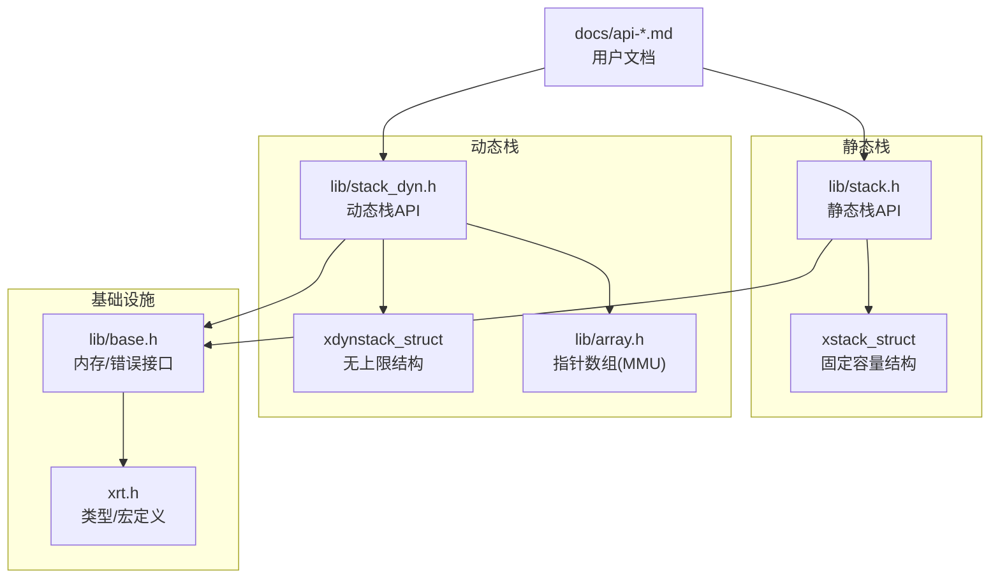
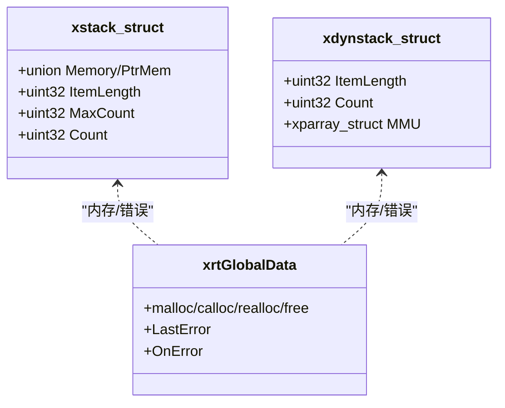
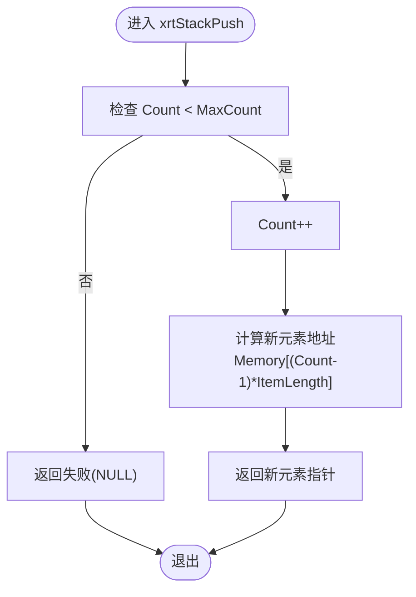
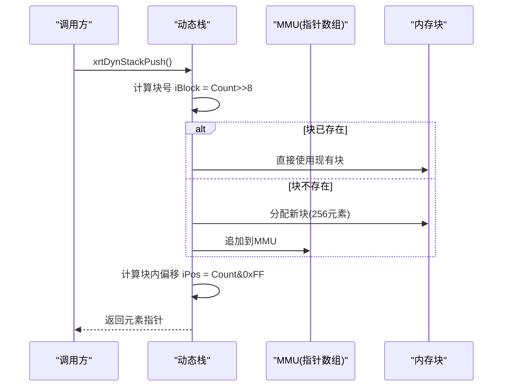
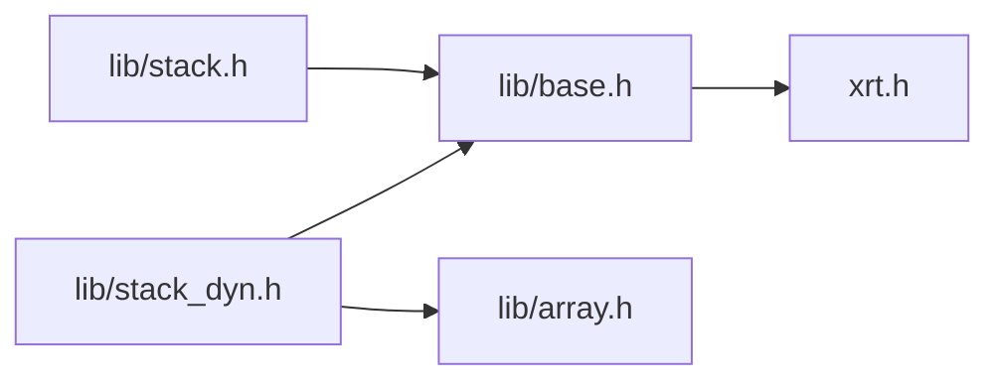

# 栈结构API

<cite>
**本文引用的文件**
- [lib/stack.h](file://lib/stack.h)
- [lib/stack_dyn.h](file://lib/stack_dyn.h)
- [docs/api-stack.md](file://docs/api-stack.md)
- [docs/api-dynstack.md](file://docs/api-dynstack.md)
- [test/test_stack.h](file://test/test_stack.h)
- [test/test_stack_ptr.h](file://test/test_stack_ptr.h)
- [test/test_dynstack.h](file://test/test_dynstack.h)
- [test/test_dynstack_ptr.h](file://test/test_dynstack_ptr.h)
- [lib/base.h](file://lib/base.h)
- [lib/array.h](file://lib/array.h)
- [xrt.h](file://xrt.h)
</cite>

## 目录
1. [简介](#简介)
2. [项目结构](#项目结构)
3. [核心组件](#核心组件)
4. [架构总览](#架构总览)
5. [详细组件分析](#详细组件分析)
6. [依赖关系分析](#依赖关系分析)
7. [性能考量](#性能考量)
8. [故障排查指南](#故障排查指南)
9. [结论](#结论)
10. [附录](#附录)

## 简介
本文件系统化梳理并说明静态栈与动态栈两类栈结构的API，覆盖创建、销毁、压栈/弹栈、栈顶访问、任意位置访问、遍历、判空等常用操作；阐述容量限制、动态扩容机制与内存管理策略；给出表达式求值、括号匹配、函数调用栈等典型应用场景；并提供性能分析与内存优化建议。

## 项目结构
- 静态栈API位于 lib/stack.h，提供固定容量的栈实现，支持结构体与指针两种模式。
- 动态栈API位于 lib/stack_dyn.h，提供无上限的动态栈，按块自动扩容，支持结构体与指针两种模式。
- 文档位于 docs/api-stack.md 与 docs/api-dynstack.md，包含详细的API说明、示例与对比。
- 测试位于 test/test_stack*.h，验证基本功能、溢出保护与指针模式行为。
- 内存管理与错误处理由 lib/base.h 提供统一接口，动态栈内部使用 lib/array.h 的指针数组作为内存块管理器。

图表来源
- [lib/stack.h](file://lib/stack.h#L1-L135)
- [lib/stack_dyn.h](file://lib/stack_dyn.h#L1-L162)
- [lib/array.h](file://lib/array.h#L1-L180)
- [lib/base.h](file://lib/base.h#L1-L132)
- [xrt.h](file://xrt.h#L1-L800)

章节来源
- [lib/stack.h](file://lib/stack.h#L1-L135)
- [lib/stack_dyn.h](file://lib/stack_dyn.h#L1-L162)
- [docs/api-stack.md](file://docs/api-stack.md#L1-L718)
- [docs/api-dynstack.md](file://docs/api-dynstack.md#L1-L887)

## 核心组件
- 静态栈
  - 创建：xrtStackCreate(iMaxCount, iItemLength)
  - 销毁：xrtStackDestroy（宏即xrtFree）
  - 压栈：xrtStackPush、xrtStackPushData、xrtStackPushPtr
  - 弹栈：xrtStackPop、xrtStackPopPtr
  - 栈顶：xrtStackTop、xrtStackTopPtr
  - 任意位置：xrtStackGetPos、xrtStackGetPos_Unsafe、xrtStackGetPosPtr、xrtStackGetPosPtr_Unsafe
- 动态栈
  - 创建/销毁：xrtDynStackCreate、xrtDynStackDestroy
  - 初始化/释放：xrtDynStackInit、xrtDynStackUnit
  - 压栈：xrtDynStackPush、xrtDynStackPushData、xrtDynStackPushPtr
  - 弹栈：xrtDynStackPop、xrtDynStackPopPtr
  - 栈顶：xrtDynStackTop、xrtDynStackTopPtr
  - 任意位置：xrtDynStackGetPos、xrtDynStackGetPos_Unsafe、xrtDynStackGetPosPtr、xrtDynStackGetPosPtr_Unsafe

章节来源
- [lib/stack.h](file://lib/stack.h#L5-L135)
- [lib/stack_dyn.h](file://lib/stack_dyn.h#L5-L162)
- [docs/api-stack.md](file://docs/api-stack.md#L60-L718)
- [docs/api-dynstack.md](file://docs/api-dynstack.md#L100-L887)

## 架构总览
静态栈采用“一次性分配 + 固定偏移”的设计，内存连续，访问速度快；动态栈采用“块管理器”（指针数组）按需分配内存块，支持无限深度，具备延迟释放策略以降低碎片化风险。

图表来源
- [lib/stack.h](file://lib/stack.h#L29-L37)
- [lib/stack_dyn.h](file://lib/stack_dyn.h#L74-L78)
- [lib/base.h](file://lib/base.h#L160-L165)
- [xrt.h](file://xrt.h#L131-L182)

## 详细组件分析

### 静态栈（固定容量）
- 数据结构
  - xstack_struct：联合体Memory/PtrMem用于结构体/指针两种模式；MaxCount为容量上限；Count为当前元素数。
- 容量与访问
  - 压栈/弹栈/栈顶访问均为O(1)；任意位置访问支持安全与不安全版本。
  - 溢出保护：压栈前检查Count < MaxCount，否则返回失败。
- 模式差异
  - 结构体模式：直接存储数据，ItemLength为结构体大小。
  - 指针模式：存储指针，ItemLength为sizeof(ptr)，适合管理外部对象。
- 内存管理
  - 一次性分配：xrtMalloc(sizeof(xstack_struct) + MaxCount*ItemLength)
  - 销毁：xrtStackDestroy宏即xrtFree，释放整块内存。

图表来源
- [lib/stack.h](file://lib/stack.h#L18-L34)

章节来源
- [lib/stack.h](file://lib/stack.h#L5-L135)
- [docs/api-stack.md](file://docs/api-stack.md#L21-L122)

### 动态栈（无上限）
- 数据结构
  - xdynstack_struct：ItemLength、Count；MMU为指针数组，每块存储256个元素。
- 扩容机制
  - 压栈时根据Count>>8定位块，若不存在则分配新块；块内偏移为Count&0xFF。
  - 出栈时采用延迟释放：当(块数<<8) > (Count+288)时，释放最后一个块，避免临界震荡。
- 模式差异
  - 结构体模式：直接存储数据。
  - 指针模式：存储指针值。
- 内存管理
  - 创建/销毁：xrtDynStackCreate/xrtDynStackDestroy
  - 初始化/释放：xrtDynStackInit/xrtDynStackUnit（用于栈上/嵌入式）

图表来源
- [lib/stack_dyn.h](file://lib/stack_dyn.h#L44-L68)

章节来源
- [lib/stack_dyn.h](file://lib/stack_dyn.h#L5-L162)
- [docs/api-dynstack.md](file://docs/api-dynstack.md#L66-L283)

### API一览与语义
- 静态栈
  - 创建/销毁：xrtStackCreate / xrtStackDestroy
  - 压栈：xrtStackPush(返回指针，需自行写入)、xrtStackPushData(复制数据)、xrtStackPushPtr(存储指针)
  - 弹栈：xrtStackPop(返回指针)、xrtStackPopPtr(返回指针值)
  - 栈顶：xrtStackTop / xrtStackTopPtr
  - 任意位置：xrtStackGetPos / xrtStackGetPos_Unsafe / xrtStackGetPosPtr / xrtStackGetPosPtr_Unsafe
- 动态栈
  - 创建/销毁：xrtDynStackCreate / xrtDynStackDestroy
  - 初始化/释放：xrtDynStackInit / xrtDynStackUnit
  - 压栈/弹栈/栈顶/任意位置：同静态栈对应函数族

章节来源
- [lib/stack.h](file://lib/stack.h#L5-L135)
- [lib/stack_dyn.h](file://lib/stack_dyn.h#L5-L162)
- [docs/api-stack.md](file://docs/api-stack.md#L60-L718)
- [docs/api-dynstack.md](file://docs/api-dynstack.md#L100-L887)

### 使用示例与场景
- 表达式求值（数字栈）
  - 使用静态栈或动态栈均可；动态栈适合未知深度的表达式。
- 括号匹配
  - 使用字符栈进行匹配校验，遇到左括号入栈，遇到右括号弹栈并比对。
- 函数调用栈
  - 使用结构体栈保存调用帧信息，压栈表示进入函数，弹栈表示返回。

章节来源
- [docs/api-stack.md](file://docs/api-stack.md#L485-L605)
- [docs/api-dynstack.md](file://docs/api-dynstack.md#L592-L634)

## 依赖关系分析
- 静态栈
  - 依赖内存分配接口（xrtMalloc/xrtFree），通过xrtStackDestroy释放整块内存。
- 动态栈
  - 依赖内存分配接口与指针数组（MMU）作为块管理器；出栈时可能释放块。
- 公共基础设施
  - 错误上报与内存管理统一由lib/base.h提供；类型/宏定义来自xrt.h。

图表来源
- [lib/stack.h](file://lib/stack.h#L7-L14)
- [lib/stack_dyn.h](file://lib/stack_dyn.h#L7-L30)
- [lib/base.h](file://lib/base.h#L5-L45)
- [lib/array.h](file://lib/array.h#L5-L40)
- [xrt.h](file://xrt.h#L114-L118)

章节来源
- [lib/stack.h](file://lib/stack.h#L1-L135)
- [lib/stack_dyn.h](file://lib/stack_dyn.h#L1-L162)
- [lib/base.h](file://lib/base.h#L1-L132)
- [lib/array.h](file://lib/array.h#L1-L180)
- [xrt.h](file://xrt.h#L1-L800)

## 性能考量
- 时间复杂度
  - 静态栈：压栈/弹栈/栈顶/任意位置访问均为O(1)。
  - 动态栈：压栈/弹栈/栈顶/任意位置访问均为O(1)，但涉及两级寻址（块号+块内偏移）。
- 空间复杂度
  - 静态栈：固定开销，无额外管理器。
  - 动态栈：MMU指针数组带来额外开销，但按需分配更节省空间。
- 扩容与释放策略
  - 静态栈：无扩容，溢出即失败。
  - 动态栈：按块扩容（256元素/块），延迟释放避免频繁分配/释放导致的抖动。
- 内存局部性
  - 静态栈内存连续，缓存命中率更高。
  - 动态栈块内连续，跨块访问可能产生缓存抖动。

章节来源
- [docs/api-dynstack.md](file://docs/api-dynstack.md#L27-L33)
- [lib/stack_dyn.h](file://lib/stack_dyn.h#L93-L98)

## 故障排查指南
- 栈满/越界
  - 静态栈：压栈前检查Count < MaxCount；越界将返回失败。
  - 动态栈：压栈不会失败（除非内存分配失败），但需关注Count增长。
- 悬挂指针
  - 静态栈：Pop返回的指针在下一次Push前有效；建议立即使用或复制。
- 内存泄漏
  - 静态栈：确保调用xrtStackDestroy释放整块内存。
  - 动态栈：使用xrtDynStackDestroy释放所有块；嵌入式使用需配合xrtDynStackUnit清理MMU。
- 错误处理
  - 内存分配失败时，底层会设置错误信息；可通过xrtSetError/xrtClearError查询与清理。

章节来源
- [docs/api-stack.md](file://docs/api-stack.md#L637-L700)
- [lib/stack.h](file://lib/stack.h#L18-L25)
- [lib/stack_dyn.h](file://lib/stack_dyn.h#L53-L62)
- [lib/base.h](file://lib/base.h#L89-L132)

## 结论
- 静态栈适用于深度已知、追求极致性能的场景；动态栈适用于深度未知、需要灵活扩展的场景。
- 两者均提供结构体与指针两种模式，满足不同数据组织需求。
- 在工程实践中，应结合业务特征选择合适类型，并遵循相应的内存管理与错误处理规范。

## 附录

### API速查表
- 静态栈
  - 创建：xrtStackCreate(iMaxCount, iItemLength)
  - 销毁：xrtStackDestroy
  - 压栈：xrtStackPush / xrtStackPushData / xrtStackPushPtr
  - 弹栈：xrtStackPop / xrtStackPopPtr
  - 栈顶：xrtStackTop / xrtStackTopPtr
  - 任意位置：xrtStackGetPos / xrtStackGetPos_Unsafe / xrtStackGetPosPtr / xrtStackGetPosPtr_Unsafe
- 动态栈
  - 创建/销毁：xrtDynStackCreate / xrtDynStackDestroy
  - 初始化/释放：xrtDynStackInit / xrtDynStackUnit
  - 压栈/弹栈/栈顶/任意位置：同静态栈对应函数族

章节来源
- [docs/api-stack.md](file://docs/api-stack.md#L60-L718)
- [docs/api-dynstack.md](file://docs/api-dynstack.md#L100-L887)