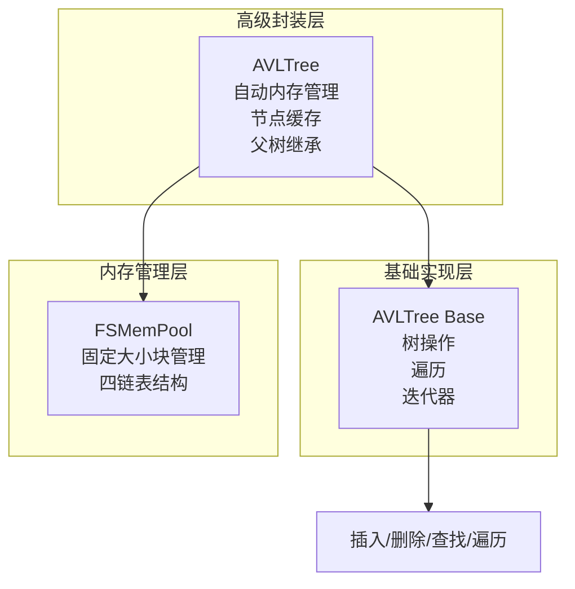
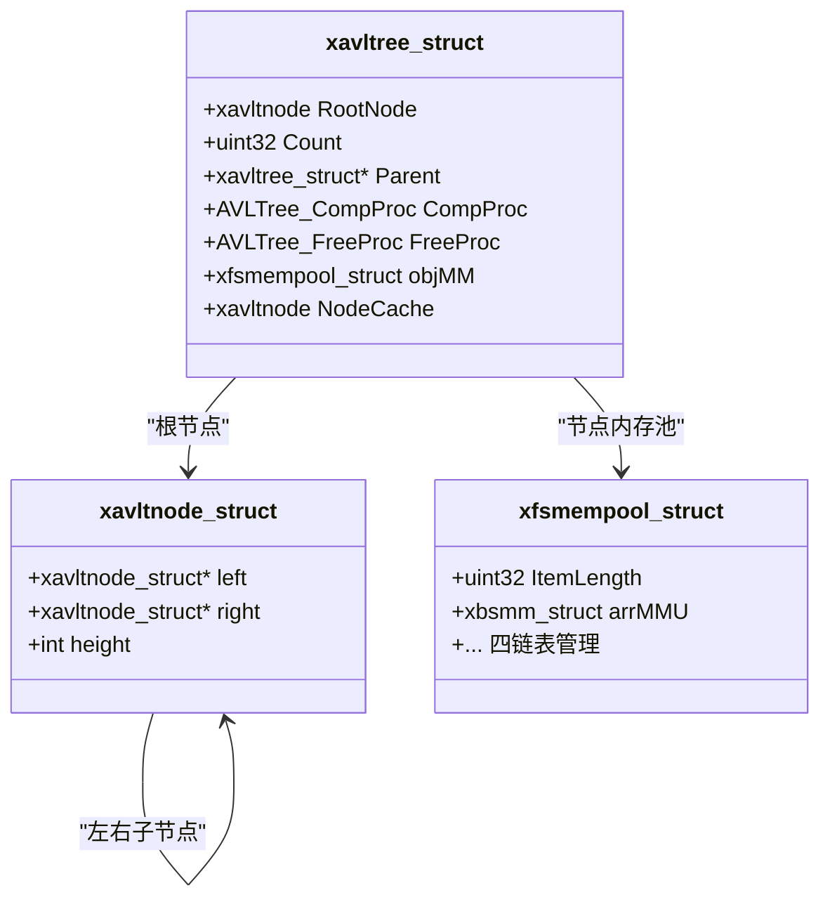
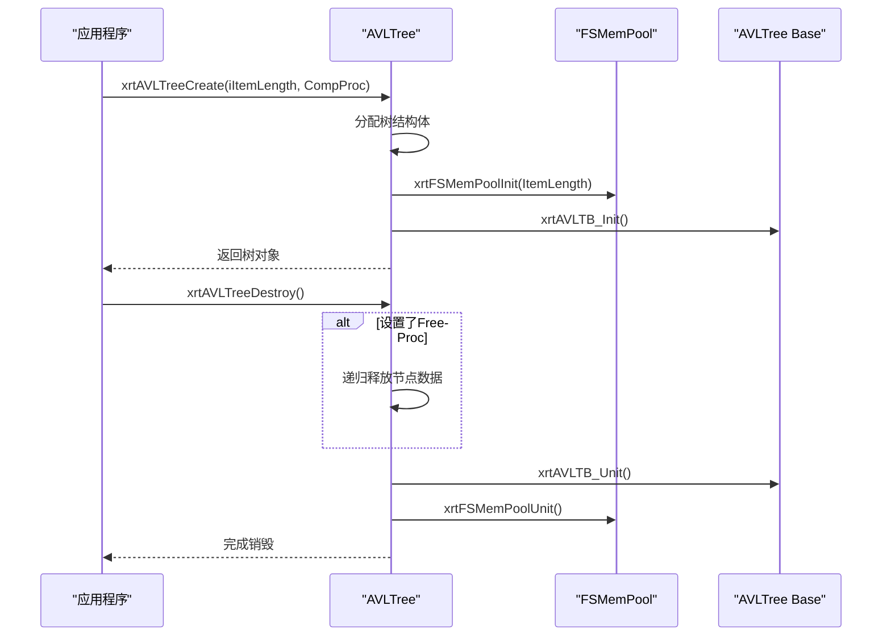
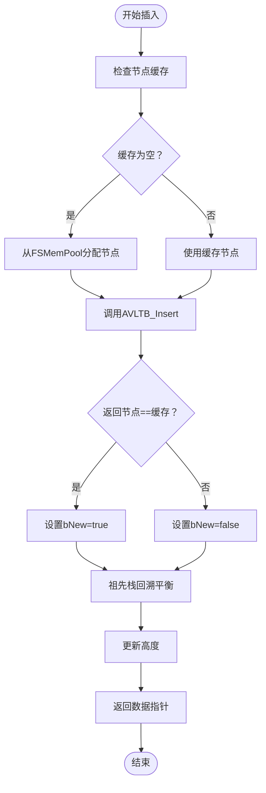
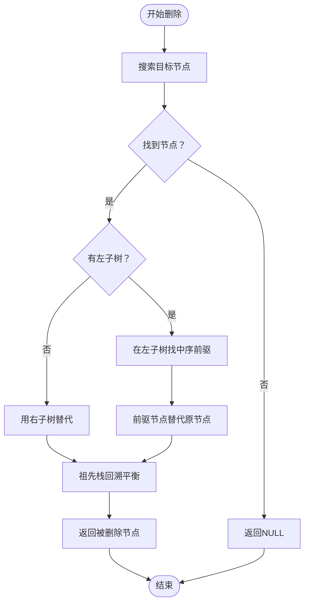
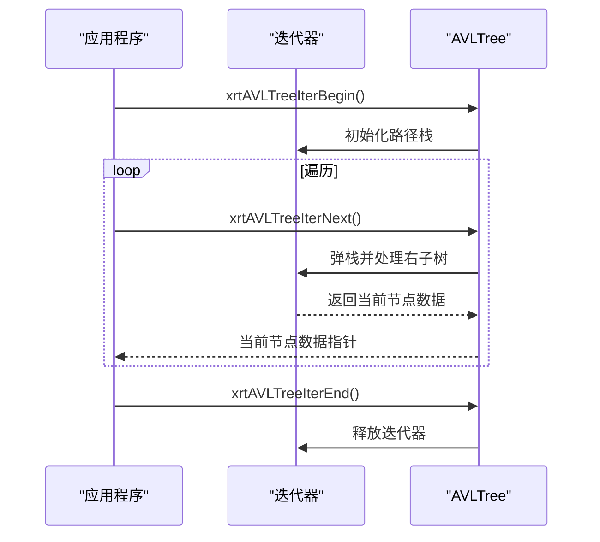
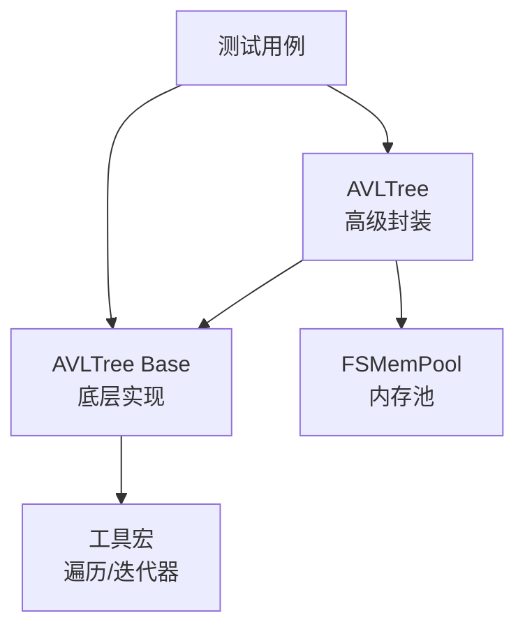

# 树结构API

<cite>
**本文档引用的文件**
- [lib/avltree.h](file://lib/avltree.h)
- [lib/avltree_base.h](file://lib/avltree_base.h)
- [docs/api-avltree.md](file://docs/api-avltree.md)
- [docs/api-avltree-base.md](file://docs/api-avltree-base.md)
- [test/test_avltree.h](file://test/test_avltree.h)
- [test/test_avltree_iterator.h](file://test/test_avltree_iterator.h)
- [xrt.h](file://xrt.h)
</cite>

## 目录
1. [简介](#简介)
2. [项目结构](#项目结构)
3. [核心组件](#核心组件)
4. [架构概览](#架构概览)
5. [详细组件分析](#详细组件分析)
6. [依赖分析](#依赖分析)
7. [性能考虑](#性能考虑)
8. [故障排除指南](#故障排除指南)
9. [结论](#结论)
10. [附录](#附录)

## 简介
本文件系统性地阐述AVL平衡树的API设计与实现，覆盖从基础数据结构到高级封装的完整能力边界。文档重点说明以下方面：
- 树的创建与销毁、初始化与资源释放流程
- 节点插入、删除、查找的核心算法与平衡维护机制
- 旋转操作的实现细节与时间复杂度
- 递归遍历与迭代器的使用方式
- 实际应用场景（字典实现、集合操作、范围查询）
- 性能分析、内存优化与FSMemPool集成建议

## 项目结构
AVLTree API由两层实现构成：
- AVLTree Base：提供底层树操作与遍历，用户负责节点内存管理
- AVLTree：在Base之上增加自动内存管理（FSMemPool）、节点缓存、父树继承查找等功能

**图表来源**
- [lib/avltree.h](file://lib/avltree.h#L5-L32)
- [lib/avltree_base.h](file://lib/avltree_base.h#L136-L254)

**章节来源**
- [lib/avltree.h](file://lib/avltree.h#L1-L126)
- [lib/avltree_base.h](file://lib/avltree_base.h#L1-L423)

## 核心组件
本节梳理AVLTree与AVLTree Base的关键API与数据结构。

### AVLTree 高级封装
- 树创建与销毁
  - xrtAVLTreeCreate：创建树实例，内部初始化FSMemPool
  - xrtAVLTreeDestroy：销毁树并释放所有节点
  - xrtAVLTreeInit/xrtAVLTreeUnit：栈上/嵌入式结构体的初始化与资源释放
- 节点操作
  - xrtAVLTreeInsert：插入节点，返回数据指针；支持bNew标识
  - xrtAVLTreeRemove：删除节点，自动释放节点内存
  - xrtAVLTreeSearch：查找节点，支持父树继承查找
- 遍历与迭代器
  - xrtAVLTreeWalk/WalkEx：回调遍历（前序/中序/后序）
  - 迭代器宏：AVLTREE_FOREACH、AVLTREE_FOREACH_TYPE、AVLTREE_BREAK

**章节来源**
- [lib/avltree.h](file://lib/avltree.h#L5-L126)
- [docs/api-avltree.md](file://docs/api-avltree.md#L167-L576)
- [xrt.h](file://xrt.h#L1620-L1625)

### AVLTree Base 底层实现
- 树操作
  - xrtAVLTB_Insert：插入节点（用户自行分配节点内存）
  - xrtAVLTB_Remove：删除节点（返回节点指针供用户释放）
  - xrtAVLTB_Search：查找节点
- 遍历与迭代器
  - xrtAVLTB_Walk/WalkEx：递归遍历
  - xrtAVLTB_IterBegin/IterNext/IterEnd：迭代器实现

**章节来源**
- [lib/avltree_base.h](file://lib/avltree_base.h#L136-L254)
- [lib/avltree_base.h](file://lib/avltree_base.h#L256-L423)
- [docs/api-avltree-base.md](file://docs/api-avltree-base.md#L260-L759)

## 架构概览
AVLTree在高层封装中引入FSMemPool进行节点内存管理，并提供节点缓存以优化连续插入性能。父树指针支持继承查找，FreeProc回调用于节点数据的自定义释放。

**图表来源**
- [docs/api-avltree.md](file://docs/api-avltree.md#L51-L81)
- [docs/api-avltree-base.md](file://docs/api-avltree-base.md#L76-L119)

**章节来源**
- [docs/api-avltree.md](file://docs/api-avltree.md#L51-L81)
- [docs/api-avltree-base.md](file://docs/api-avltree-base.md#L76-L119)

## 详细组件分析

### 树创建与销毁流程
- 创建流程要点
  - 分配树结构体并初始化
  - 初始化FSMemPool，ItemLength为节点结构体大小加数据区大小
  - 初始化父树指针、比较函数、释放回调、节点缓存
- 销毁流程要点
  - 若设置FreeProc，先递归遍历释放节点数据
  - 调用AVLTree Base Unit释放树结构
  - 销毁FSMemPool并清空缓存

**图表来源**
- [lib/avltree.h](file://lib/avltree.h#L5-L32)
- [lib/avltree.h](file://lib/avltree.h#L51-L59)

**章节来源**
- [lib/avltree.h](file://lib/avltree.h#L5-L59)
- [docs/api-avltree.md](file://docs/api-avltree.md#L167-L304)

### 节点插入与平衡维护
- 插入流程
  - 若无节点缓存则从FSMemPool分配
  - 调用AVLTree Base Insert执行BST插入
  - 根据返回节点判断是否新节点，更新bNew
  - 返回数据区指针（&node[1]）
- 平衡维护
  - 通过祖先栈记录路径，逐层回溯更新高度
  - 根据左右子树高度差执行LL/RR/LR/RL旋转
  - 旋转后更新子树根节点与高度

**图表来源**
- [lib/avltree.h](file://lib/avltree.h#L62-L90)
- [lib/avltree_base.h](file://lib/avltree_base.h#L5-L134)
- [lib/avltree_base.h](file://lib/avltree_base.h#L136-L170)

**章节来源**
- [lib/avltree.h](file://lib/avltree.h#L62-L90)
- [lib/avltree_base.h](file://lib/avltree_base.h#L5-L134)
- [lib/avltree_base.h](file://lib/avltree_base.h#L136-L170)

### 节点删除与旋转算法
- 删除流程
  - AVLTree Base Search定位节点
  - 根据是否有左子树采用不同策略：
    - 无左子树：直接用右子树替代
    - 有左子树：在左子树中找到最大节点（中序前驱）替代当前位置
  - 更新祖先栈并执行平衡
- 旋转类型
  - LL/RR：单旋转，对应左-左或右-右不平衡
  - LR/RL：双旋转，对应左-右或右-左不平衡

**图表来源**
- [lib/avltree.h](file://lib/avltree.h#L93-L105)
- [lib/avltree_base.h](file://lib/avltree_base.h#L173-L237)
- [lib/avltree_base.h](file://lib/avltree_base.h#L15-L134)

**章节来源**
- [lib/avltree.h](file://lib/avltree.h#L93-L105)
- [lib/avltree_base.h](file://lib/avltree_base.h#L173-L237)
- [lib/avltree_base.h](file://lib/avltree_base.h#L15-L134)

### 查找与继承树
- 基本查找：沿比较函数方向在左右子树中递归搜索
- 继承查找：若当前树未找到且设置Parent，则在父树中继续查找
- 时间复杂度：O(log n)，空间复杂度：递归O(log n)

**章节来源**
- [lib/avltree.h](file://lib/avltree.h#L108-L123)
- [lib/avltree_base.h](file://lib/avltree_base.h#L240-L254)

### 遍历方式与迭代器
- 遍历回调
  - 中序遍历（有序输出）：xrtAVLTB_Walk
  - 扩展遍历（前序/中序/后序）：xrtAVLTB_WalkEx
- 迭代器
  - 迭代器启动/前进/结束：xrtAVLTB_IterBegin/IterNext/IterEnd
  - 宏封装：AVLTREE_FOREACH、AVLTREE_FOREACH_TYPE、AVLTREE_BREAK

**图表来源**
- [lib/avltree_base.h](file://lib/avltree_base.h#L325-L420)
- [xrt.h](file://xrt.h#L1547-L1567)

**章节来源**
- [lib/avltree_base.h](file://lib/avltree_base.h#L256-L316)
- [lib/avltree_base.h](file://lib/avltree_base.h#L325-L420)
- [xrt.h](file://xrt.h#L1540-L1567)

### 使用示例与应用场景
- 字典实现
  - 使用AVLTree作为字典底层，Key为Dict_Key，Value为用户数据
  - 支持字符串键、整数键等
- 集合操作
  - 仅存储键，值区域用于标记存在性
- 范围查询
  - 通过中序遍历结合回调函数实现范围筛选

**章节来源**
- [docs/api-avltree.md](file://docs/api-avltree.md#L578-L721)
- [docs/api-avltree-base.md](file://docs/api-avltree-base.md#L620-L737)

## 依赖分析
AVLTree与AVLTree Base之间的依赖关系清晰：高级封装依赖底层实现的所有操作；FSMemPool为AVLTree提供内存管理能力；迭代器宏依赖底层迭代器实现。

**图表来源**
- [lib/avltree.h](file://lib/avltree.h#L5-L32)
- [lib/avltree_base.h](file://lib/avltree_base.h#L136-L254)
- [test/test_avltree.h](file://test/test_avltree.h#L41-L434)
- [test/test_avltree_iterator.h](file://test/test_avltree_iterator.h#L31-L177)

**章节来源**
- [lib/avltree.h](file://lib/avltree.h#L1-L126)
- [lib/avltree_base.h](file://lib/avltree_base.h#L1-L423)
- [test/test_avltree.h](file://test/test_avltree.h#L1-L434)
- [test/test_avltree_iterator.h](file://test/test_avltree_iterator.h#L1-L177)

## 性能考虑
- 时间复杂度
  - 插入/删除/查找：O(log n)
  - 遍历：O(n)
- 空间复杂度
  - 递归遍历：O(log n)栈空间
  - 迭代器：O(log n)栈空间
- 内存优化
  - 节点缓存：减少频繁分配带来的碎片化
  - FSMemPool：固定大小块管理，降低分配/释放开销
- 与FSMemPool集成建议
  - 合理设置ItemLength，避免过大浪费
  - 利用NodeCache减少连续插入的分配次数
  - 在大批量操作后调用Unit释放内部资源

**章节来源**
- [docs/api-avltree.md](file://docs/api-avltree.md#L27-L47)
- [lib/avltree.h](file://lib/avltree.h#L30-L31)
- [lib/avltree.h](file://lib/avltree.h#L65-L70)

## 故障排除指南
- 插入返回NULL
  - 可能原因：节点缓存分配失败或达到最大高度限制
  - 处理：检查FSMemPool状态，确认ItemLength设置正确
- 删除返回FALSE
  - 可能原因：键不存在
  - 处理：先Search确认存在性
- 迭代器异常
  - 可能原因：提前结束或空树
  - 处理：使用AVLTREE_BREAK宏或检查Count
- 父树查找无效
  - 可能原因：Parent指针未设置或比较函数不一致
  - 处理：确保Parent设置正确且比较函数一致

**章节来源**
- [lib/avltree.h](file://lib/avltree.h#L67-L69)
- [lib/avltree.h](file://lib/avltree.h#L102-L104)
- [lib/avltree_base.h](file://lib/avltree_base.h#L325-L420)
- [test/test_avltree_iterator.h](file://test/test_avltree_iterator.h#L119-L134)

## 结论
AVLTree提供了高性能、易用的平衡二叉搜索树实现，通过FSMemPool实现了自动内存管理，通过节点缓存优化了批量插入性能。其清晰的分层架构使得在一般应用中无需关注内存细节，同时保留了AVLTree Base的灵活性以满足特殊场景需求。配合完善的遍历与迭代器接口，能够胜任字典、集合、范围查询等多种实际应用场景。

## 附录
- API参考
  - 树操作：xrtAVLTreeCreate/xrtAVLTreeDestroy/xrtAVLTreeInit/xrtAVLTreeUnit
  - 节点操作：xrtAVLTreeInsert/xrtAVLTreeRemove/xrtAVLTreeSearch
  - 遍历：xrtAVLTreeWalk/WalkEx、迭代器宏
- 测试用例
  - 基础功能测试：test_avltree.h
  - 迭代器测试：test_avltree_iterator.h

**章节来源**
- [test/test_avltree.h](file://test/test_avltree.h#L41-L434)
- [test/test_avltree_iterator.h](file://test/test_avltree_iterator.h#L31-L177)