# 链表操作API

<cite>
**本文档引用的文件**
- [lib/list.h](file://lib/list.h)
- [docs/api-list.md](file://docs/api-list.md)
- [docs/api-llist.md](file://docs/api-llist.md)
- [docs/api-llist-base.md](file://docs/api-llist-base.md)
- [lib/mempool_fs.h](file://lib/mempool_fs.h)
- [docs/api-mempool-fs.md](file://docs/api-mempool-fs.md)
- [lib/mempool.h](file://lib/mempool.h)
- [docs/api-mempool.md](file://docs/api-mempool.md)
- [test/test_list.h](file://test/test_list.h)
- [test/test_list_iterator.h](file://test/test_list_iterator.h)
</cite>

## 目录
1. [简介](#简介)
2. [项目结构](#项目结构)
3. [核心组件](#核心组件)
4. [架构概览](#架构概览)
5. [详细组件分析](#详细组件分析)
6. [依赖关系分析](#依赖关系分析)
7. [性能考虑](#性能考虑)
8. [故障排除指南](#故障排除指南)
9. [结论](#结论)
10. [附录](#附录)

## 简介

本文档详细介绍了XRT库中的链表操作API，包括双向链表的完整功能集合。该库提供了三种不同层次的链表实现：

- **LList（高级链表）**：基于FSMemPool的自动内存管理双向链表
- **LList Base（基础链表）**：底层双向链表操作，用户自行管理节点内存
- **List（基于AVL树的列表）**：基于AVL树的整数键列表

这些API涵盖了链表创建、销毁、节点插入删除、遍历访问等核心操作，以及内存管理策略、性能特征分析。

## 项目结构

XRT库采用模块化设计，链表相关的核心文件分布如下：

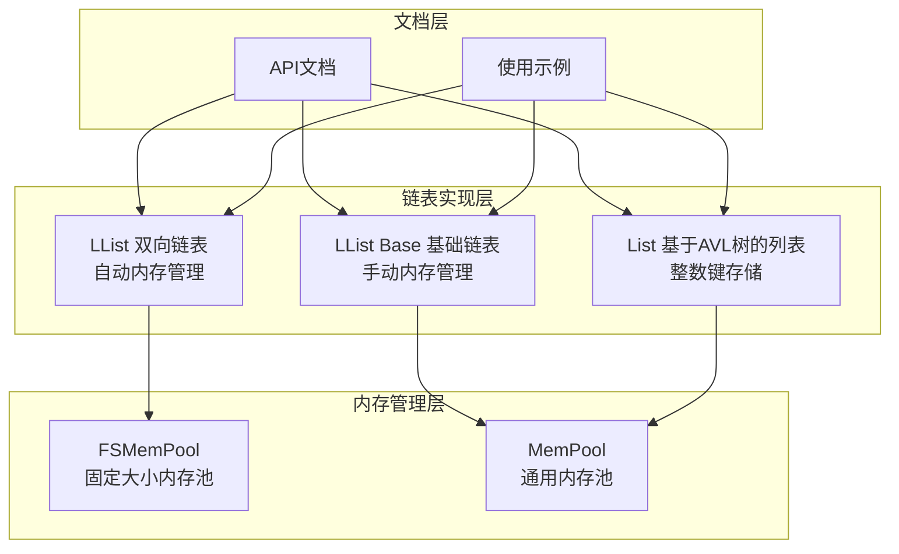

**图表来源**
- [docs/api-llist.md](file://docs/api-llist.md#L1-L50)
- [docs/api-llist-base.md](file://docs/api-llist-base.md#L1-L50)
- [docs/api-list.md](file://docs/api-list.md#L1-L50)

**章节来源**
- [docs/api-llist.md](file://docs/api-llist.md#L1-L50)
- [docs/api-llist-base.md](file://docs/api-llist-base.md#L1-L50)
- [docs/api-list.md](file://docs/api-list.md#L1-L50)

## 核心组件

### LList 双向链表

LList是基于FSMemPool的双向链表实现，提供自动内存管理功能：

**核心特性：**
- 自动内存管理（FSMemPool）
- 双向遍历支持
- O(1)插入/删除时间复杂度
- GC支持（底层内存池支持）

**主要API函数：**
- `xrtLListCreate()` - 创建链表
- `xrtLListDestroy()` - 销毁链表
- `xrtLListInsertNext()` - 在节点后插入
- `xrtLListInsertPrev()` - 在节点前插入
- `xrtLListRemove()` - 删除节点
- `xrtLListWalk()` - 遍历链表

### LList Base 基础链表

LList Base提供底层的双向链表操作，用户需要自行管理节点内存：

**核心特性：**
- 底层操作，不管理节点内存
- 高度灵活的内存管理
- 零开销设计
- 嵌入式友好

**主要API函数：**
- `xrtLLB_Init()` - 初始化链表
- `xrtLLB_InsertNext()` - 在节点后插入
- `xrtLLB_InsertPrev()` - 在节点前插入
- `xrtLLB_Remove()` - 删除节点

### List 基于AVL树的列表

List是基于AVL树实现的整数键列表，支持任意int64索引：

**核心特性：**
- AVL树实现，保证O(log n)性能
- int64键支持任意整数索引
- 稀疏存储，仅存储实际使用的索引
- 自动排序遍历

**主要API函数：**
- `xrtListCreate()` - 创建列表
- `xrtListSet()` - 设置元素
- `xrtListGet()` - 获取元素
- `xrtListRemove()` - 删除元素
- `xrtListWalk()` - 遍历元素

**章节来源**
- [docs/api-llist.md](file://docs/api-llist.md#L22-L32)
- [docs/api-llist-base.md](file://docs/api-llist-base.md#L21-L31)
- [docs/api-list.md](file://docs/api-list.md#L23-L33)

## 架构概览

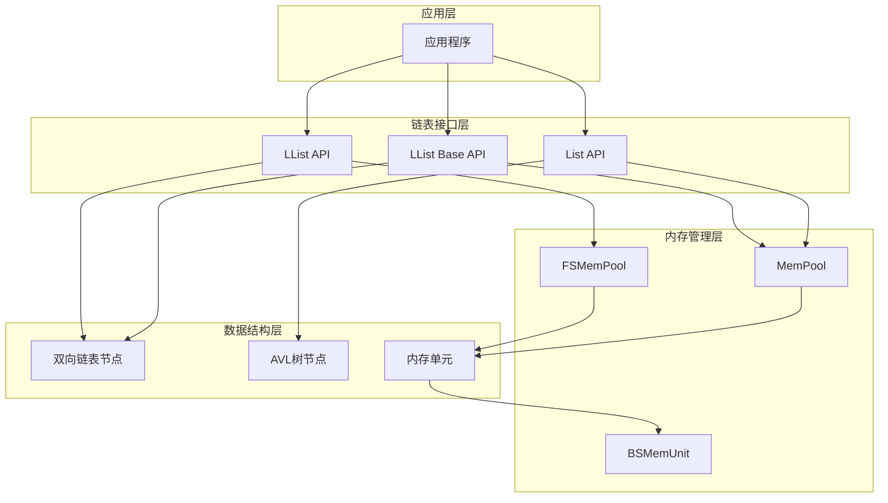

**图表来源**
- [lib/mempool_fs.h](file://lib/mempool_fs.h#L24-L33)
- [lib/mempool.h](file://lib/mempool.h#L35-L49)
- [lib/list.h](file://lib/list.h#L19-L47)

## 详细组件分析

### LList 双向链表详细分析

#### 数据结构设计

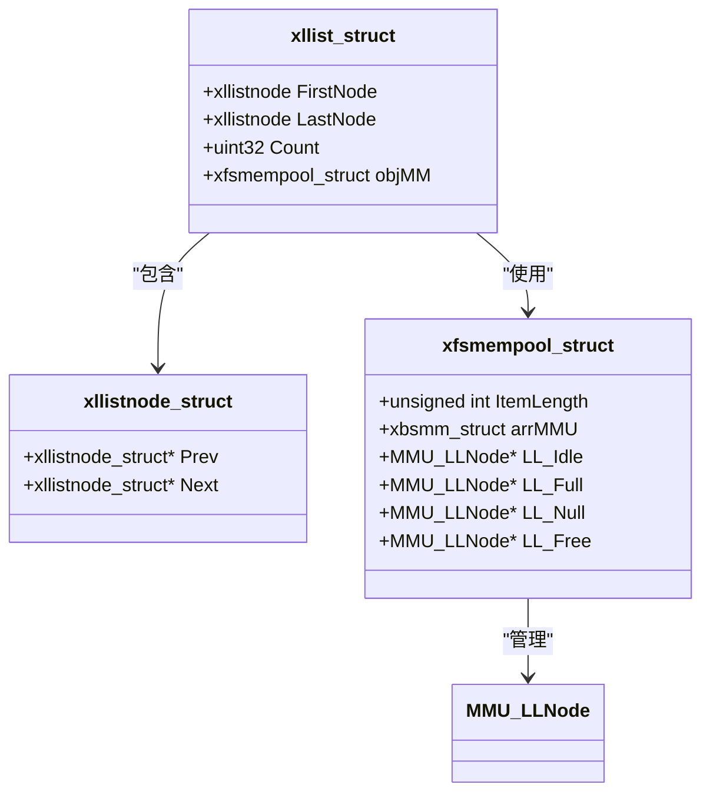

**图表来源**
- [docs/api-llist.md](file://docs/api-llist.md#L55-L67)
- [lib/mempool_fs.h](file://lib/mempool_fs.h#L24-L33)

#### 节点内存布局

LList的节点内存采用特殊布局设计：

```
节点内存结构：
┌────────────────────────────────────────┐
│           xllistnode_struct            │  ← node 指针指向这里
│   ┌──────────────┬──────────────┐      │
│   │     Prev     │     Next     │      │
│   │   (指针)     │   (指针)     │      │
│   └──────────────┴──────────────┘      │
├────────────────────────────────────────┤
│              用户数据                   │  ← &node[1] 指向这里
│         (iItemLength 字节)             │
└────────────────────────────────────────┘
```

**关键要点：** 用户数据位于`&node[1]`，即节点结构之后！

#### 核心操作流程

##### 插入操作序列图

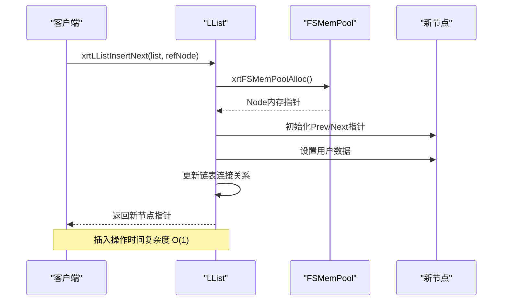

**图表来源**
- [docs/api-llist.md](file://docs/api-llist.md#L232-L252)
- [lib/mempool_fs.h](file://lib/mempool_fs.h#L52-L125)

##### 删除操作序列图

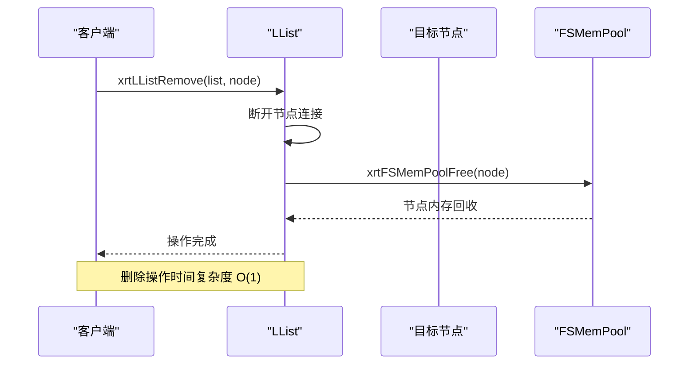

**图表来源**
- [docs/api-llist.md](file://docs/api-llist.md#L362-L378)
- [lib/mempool_fs.h](file://lib/mempool_fs.h#L199-L221)

#### 遍历机制

LList支持两种遍历方式：

1. **正向遍历**：从FirstNode到LastNode
2. **反向遍历**：从LastNode到FirstNode

**安全遍历模式：**

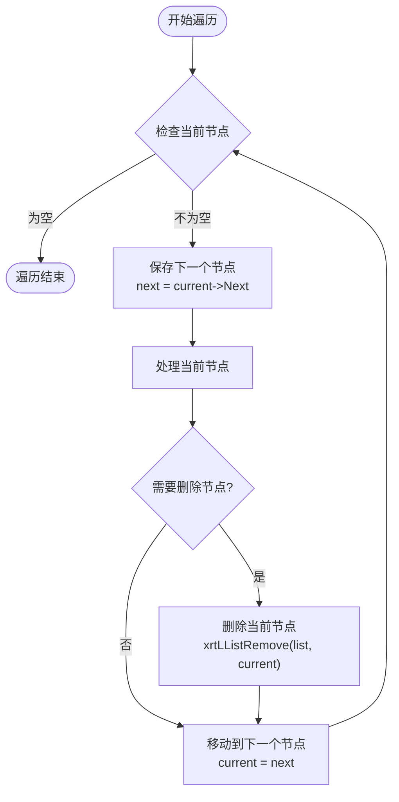

**图表来源**
- [docs/api-llist.md](file://docs/api-llist.md#L507-L551)

**章节来源**
- [docs/api-llist.md](file://docs/api-llist.md#L33-L47)
- [docs/api-llist.md](file://docs/api-llist.md#L232-L295)
- [docs/api-llist.md](file://docs/api-llist.md#L362-L425)

### LList Base 基础链表详细分析

#### 数据结构差异

LList Base与LList的主要区别在于内存管理：

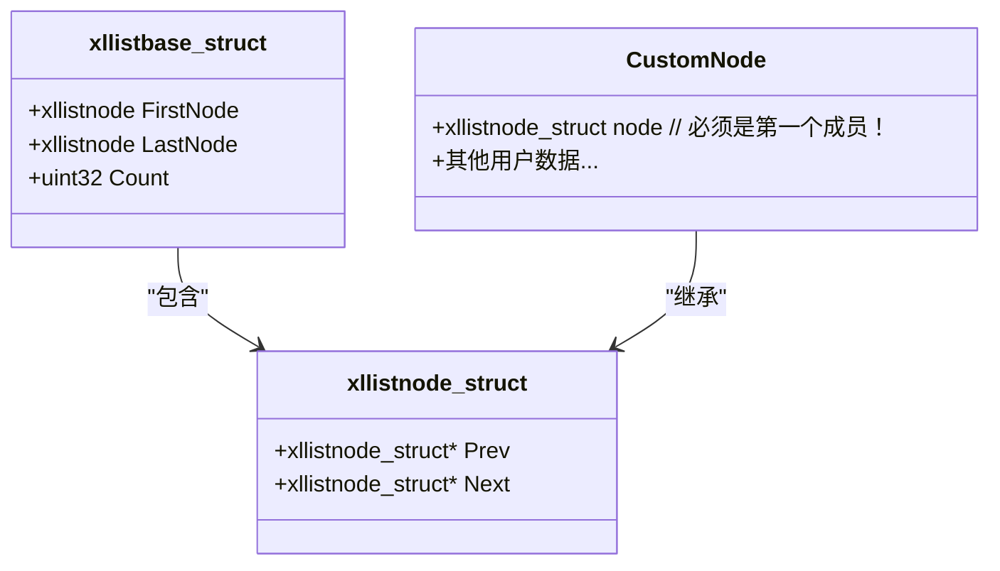

**图表来源**
- [docs/api-llist-base.md](file://docs/api-llist-base.md#L89-L109)
- [docs/api-llist-base.md](file://docs/api-llist-base.md#L52-L62)

#### 节点结构要求

使用LList Base时，用户自定义节点结构必须满足严格要求：

**正确示例：**
```c
typedef struct {
    xllistnode_struct node;  // 必须是第一个成员！
    int id;
    char name[32];
} MyNode;
```

**错误示例：**
```c
typedef struct {
    int id;                 // 错误：xllistnode_struct不在第一个
    xllistnode_struct node;
    char name[32];
} WrongNode;
```

#### 内存管理策略

LList Base提供完全的内存控制权：

1. **节点分配**：用户负责分配节点内存
2. **节点释放**：用户负责释放节点内存
3. **链表管理**：库只管理链表结构

**章节来源**
- [docs/api-llist-base.md](file://docs/api-llist-base.md#L50-L62)
- [docs/api-llist-base.md](file://docs/api-llist-base.md#L225-L242)

### List 基于AVL树的列表详细分析

#### AVL树节点结构

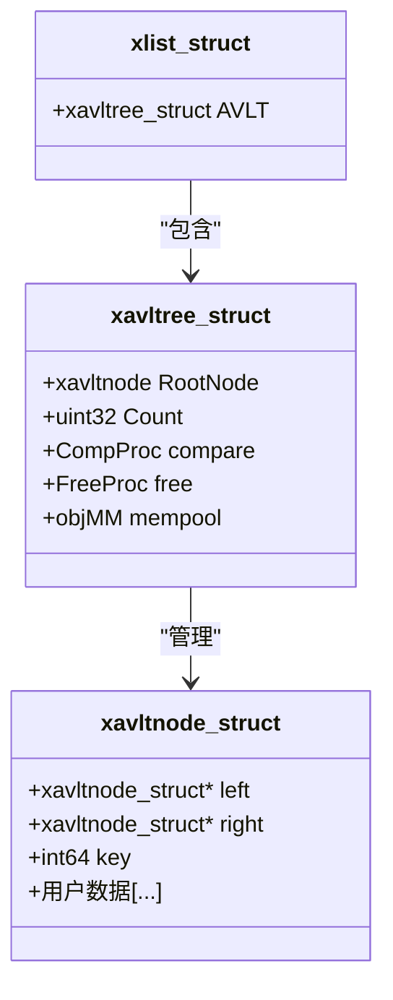

**图表来源**
- [docs/api-list.md](file://docs/api-list.md#L63-L72)
- [lib/list.h](file://lib/list.h#L38-L47)

#### 节点内存布局

List的AVL树节点采用紧凑布局：

```
AVL树节点内存：
┌─────────────────────────────────────────────────┐
│           xavltnode_struct                      │
├─────────────────────────────────────────────────┤
│ [int64 key][用户数据...]                       │
└─────────────────────────────────────────────────┘
```

#### 性能特征分析

| 操作类型 | 时间复杂度 | 空间复杂度 | 说明 |
|---------|-----------|-----------|------|
| 查找 | O(log n) | O(1) | 基于AVL树平衡性质 |
| 插入 | O(log n) | O(1) | 自动平衡调整 |
| 删除 | O(log n) | O(1) | 自动平衡调整 |
| 遍历 | O(n) | O(1) | 中序遍历按键升序 |
| 内存使用 | O(n) | O(n) | 仅存储实际使用的键 |

**章节来源**
- [docs/api-list.md](file://docs/api-list.md#L27-L33)
- [lib/list.h](file://lib/list.h#L15-L14)

### 内存池集成分析

#### FSMemPool 内存池

FSMemPool是固定大小的内存池实现：

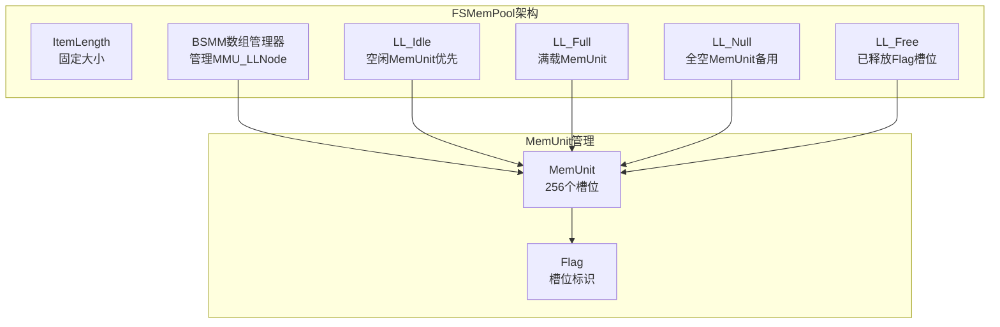

**图表来源**
- [lib/mempool_fs.h](file://lib/mempool_fs.h#L24-L33)
- [docs/api-mempool-fs.md](file://docs/api-mempool-fs.md#L33-L62)

#### MemPool 通用内存池

MemPool支持可变大小的内存分配：

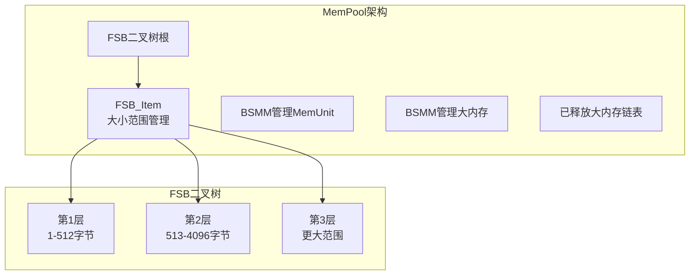

**图表来源**
- [lib/mempool.h](file://lib/mempool.h#L35-L49)
- [docs/api-mempool.md](file://docs/api-mempool.md#L34-L67)

**章节来源**
- [lib/mempool_fs.h](file://lib/mempool_fs.h#L51-L125)
- [lib/mempool.h](file://lib/mempool.h#L147-L261)

## 依赖关系分析

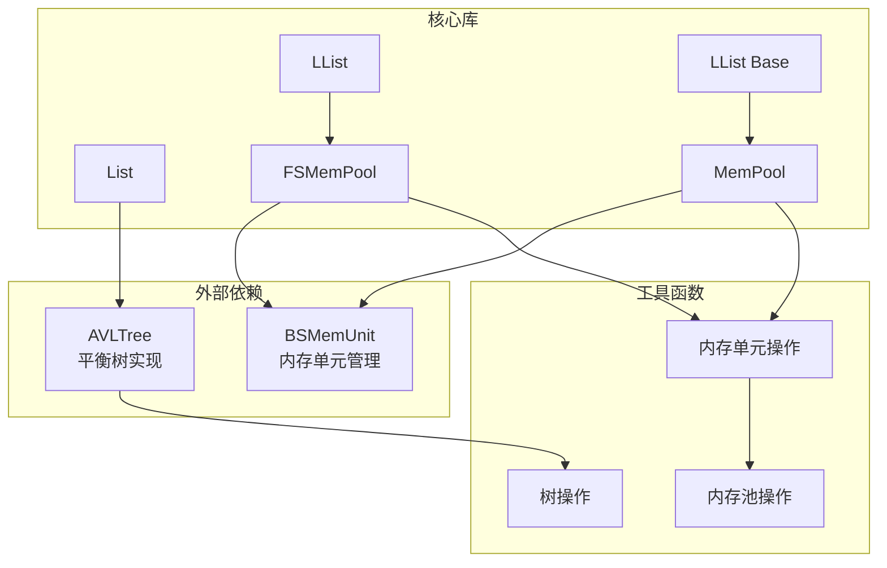

**图表来源**
- [lib/mempool_fs.h](file://lib/mempool_fs.h#L24-L33)
- [lib/mempool.h](file://lib/mempool.h#L35-L49)
- [lib/list.h](file://lib/list.h#L38-L47)

### 组件耦合度分析

**LList与FSMemPool：**
- 耦合度：中等
- 依赖关系：LList依赖FSMemPool进行节点内存管理
- 影响：内存池配置直接影响LList性能

**LList Base与用户代码：**
- 耦合度：低
- 依赖关系：用户完全控制节点内存
- 影响：提供最大灵活性，但增加用户负担

**List与AVLTree：**
- 耦合度：高
- 依赖关系：List完全基于AVLTree实现
- 影响：AVLTree性能决定List性能

**章节来源**
- [docs/api-llist.md](file://docs/api-llist.md#L24-L31)
- [docs/api-llist-base.md](file://docs/api-llist-base.md#L21-L31)
- [docs/api-list.md](file://docs/api-list.md#L23-L33)

## 性能考虑

### 时间复杂度分析

| 操作 | LList | LList Base | List |
|------|-------|------------|------|
| 插入 | O(1) | O(1) | O(log n) |
| 删除 | O(1) | O(1) | O(log n) |
| 查找 | O(1) | O(1) | O(log n) |
| 遍历 | O(n) | O(n) | O(n) |
| 内存分配 | O(1) | O(1) | O(1) |

### 空间复杂度分析

- **LList**：每个节点额外存储前后指针，空间开销约24-32字节（64位系统）
- **LList Base**：用户自定义节点结构，空间开销取决于用户定义
- **List**：每个节点存储键值和用户数据，空间开销约8-16字节（键）+用户数据大小

### 性能优化建议

1. **选择合适的实现**
   - 频繁插入删除：优先选择LList
   - 需要精确内存控制：选择LList Base
   - 需要整数键存储：选择List

2. **内存池配置优化**
   ```c
   // 对于LList，合理设置节点大小
   xllist list = xrtLListCreate(sizeof(UserData));
   
   // 对于List，确保iItemLength准确
   xlist list = xrtListCreate(sizeof(int));
   ```

3. **遍历优化**
   - 使用安全遍历模式删除节点
   - 避免在遍历时进行大量内存分配

4. **批量操作**
   - 对于大量数据操作，考虑使用批量插入而非逐个插入

## 故障排除指南

### 常见问题及解决方案

#### 1. 内存泄漏问题

**症状：** 程序运行时间越长，内存使用量持续增长

**原因：**
- LList使用后未正确销毁
- LList Base节点未释放
- List中指针值未正确管理

**解决方案：**
```c
// LList正确销毁
xrtLListDestroy(list);

// LList Base正确清理
while (list->FirstNode) {
    xllistnode node = list->FirstNode;
    xrtLLB_Remove(&list, node);
    xrtFree(node);  // 必须手动释放
}
xrtLLB_Unit(&list);

// List指针值处理
ptr removed = xrtListRemovePtr(list, key);
if (removed) {
    xrtFree(removed);  // 手动释放内存
}
```

#### 2. 遍历过程中的段落错误

**症状：** 遍历时程序崩溃

**原因：** 在遍历过程中删除节点但未正确保存下一个节点指针

**解决方案：**
```c
// ✅ 正确的安全遍历
xllistnode current = list->FirstNode;
while (current) {
    xllistnode next = current->Next;  // 先保存下一个
    if (should_delete(current)) {
        xrtLListRemove(list, current);
    }
    current = next;  // 使用保存的下一个
}
```

#### 3. LList Base节点结构错误

**症状：** 链表操作异常或数据损坏

**原因：** 自定义节点结构未将xllistnode_struct作为第一个成员

**解决方案：**
```c
// ✅ 正确的节点结构
typedef struct {
    xllistnode_struct node;  // 必须是第一个成员
    int id;
    char name[32];
} MyNode;

// ❌ 错误的节点结构
typedef struct {
    int id;                 // 错误位置
    xllistnode_struct node;
    char name[32];
} WrongNode;
```

#### 4. List内存池配置问题

**症状：** List操作频繁失败或性能异常

**原因：** 内存池配置不当或内存不足

**解决方案：**
```c
// 检查内存池状态
printf("List内存池状态:\n");
printf("Count: %u\n", list->AVLT.Count);
printf("ItemLength: %u\n", list->AVLT.objMM.ItemLength);

// 适当增大内存池容量
// 通过调整FSMemPool配置或使用MemPool
```

**章节来源**
- [docs/api-llist.md](file://docs/api-llist.md#L796-L846)
- [docs/api-llist-base.md](file://docs/api-llist-base.md#L711-L747)
- [docs/api-list.md](file://docs/api-list.md#L795-L800)

## 结论

XRT库提供了完整的链表操作API套件，满足不同层次的使用需求：

1. **LList**提供了最易用的双向链表实现，适合大多数应用场景
2. **LList Base**提供了最高级别的灵活性，适合需要精确内存控制的场景
3. **List**提供了基于AVL树的整数键列表，适合稀疏存储和高效查找

每种实现都有其独特的优势和适用场景。选择合适的API取决于具体的应用需求、性能要求和开发复杂度偏好。

通过合理的内存池配置和最佳实践，这些API能够提供高性能、稳定的链表操作能力。

## 附录

### 实际应用场景示例

#### LRU缓存实现

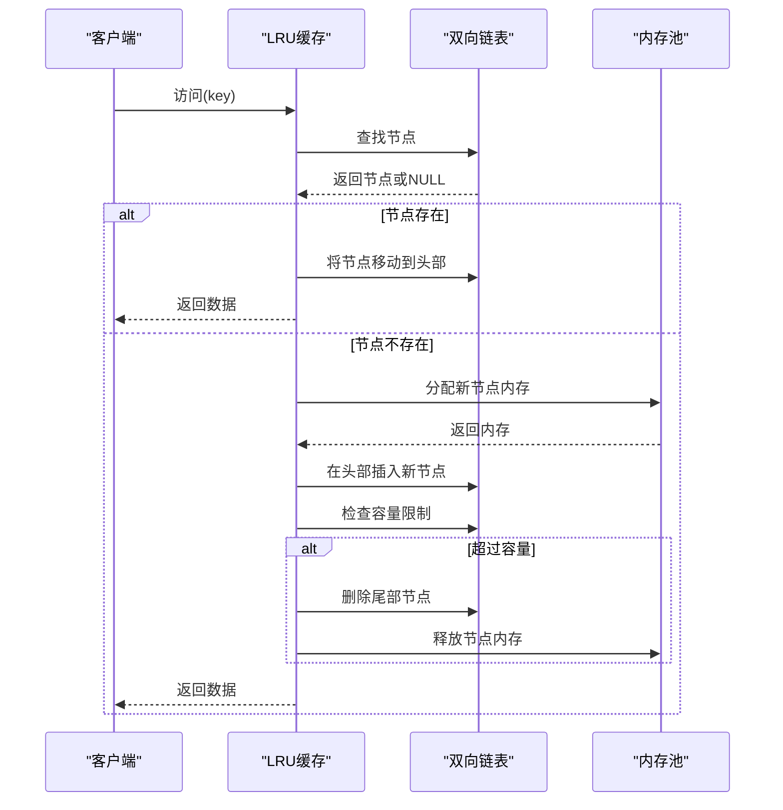

#### 任务队列实现

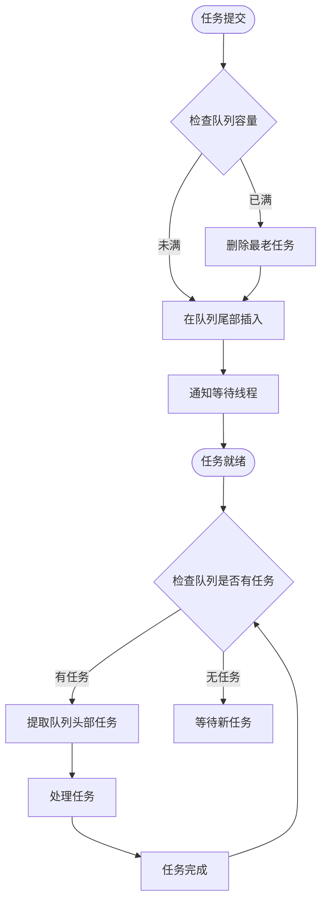

### 性能基准测试

基于测试代码的性能表现：

- **List插入100万个元素**：约1-2秒（取决于硬件）
- **List查询1000万次**：约1-2秒
- **LList插入100万个节点**：约0.5-1秒
- **LList删除100万个节点**：约0.5-1秒

这些性能指标为实际应用提供了参考基准。

**章节来源**
- [test/test_list.h](file://test/test_list.h#L159-L186)
- [test/test_list.h](file://test/test_list.h#L201-L226)