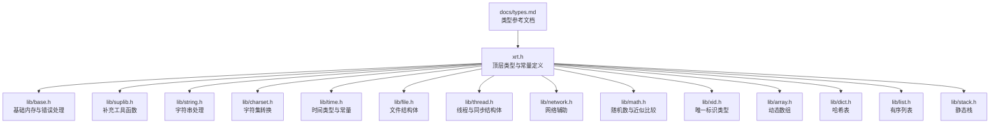
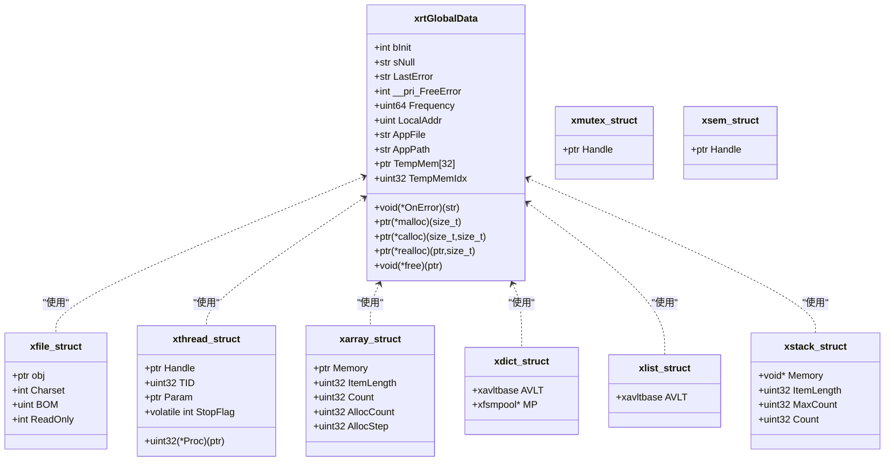
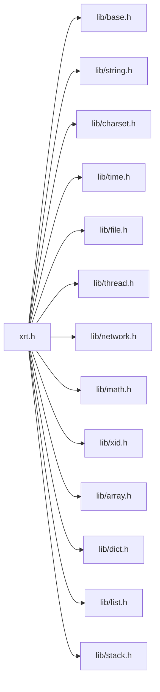

# 类型定义和常量

<cite>
**本文档引用的文件**
- [xrt.h](file://xrt.h)
- [xrt.c](file://xrt.c)
- [lib/base.h](file://lib/base.h)
- [lib/suplib.h](file://lib/suplib.h)
- [lib/string.h](file://lib/string.h)
- [lib/time.h](file://lib/time.h)
- [lib/file.h](file://lib/file.h)
- [lib/thread.h](file://lib/thread.h)
- [lib/network.h](file://lib/network.h)
- [lib/charset.h](file://lib/charset.h)
- [lib/math.h](file://lib/math.h)
- [lib/xid.h](file://lib/xid.h)
- [lib/array.h](file://lib/array.h)
- [lib/dict.h](file://lib/dict.h)
- [lib/list.h](file://lib/list.h)
- [lib/stack.h](file://lib/stack.h)
- [docs/types.md](file://docs/types.md)
</cite>

## 目录
1. [简介](#简介)
2. [项目结构](#项目结构)
3. [核心组件](#核心组件)
4. [架构总览](#架构总览)
5. [详细组件分析](#详细组件分析)
6. [依赖关系分析](#依赖关系分析)
7. [性能考虑](#性能考虑)
8. [故障排查指南](#故障排查指南)
9. [结论](#结论)
10. [附录](#附录)

## 简介
本文件面向XRT库的类型系统与常量定义，系统性梳理基础数据类型、字符串与字符集类型、结构体、枚举、宏常量、平台相关类型与编译器特定定义，并给出类型别名、转换规则、内存对齐与性能影响分析，帮助开发者快速定位与理解类型定义与使用规范。

## 项目结构
XRT类型体系主要集中在顶层头文件与各功能模块头文件中，配合文档目录下的类型参考文档，形成“类型定义 + 使用说明”的完整知识图谱。

**图表来源**
- [xrt.h](file://xrt.h#L53-L118)
- [lib/base.h](file://lib/base.h#L4-L132)
- [lib/suplib.h](file://lib/suplib.h#L4-L55)
- [lib/string.h](file://lib/string.h#L4-L200)
- [lib/charset.h](file://lib/charset.h#L18-L200)
- [lib/time.h](file://lib/time.h#L4-L200)
- [lib/file.h](file://lib/file.h#L16-L200)
- [lib/thread.h](file://lib/thread.h#L37-L200)
- [lib/network.h](file://lib/network.h#L4-L200)
- [lib/math.h](file://lib/math.h#L44-L175)
- [lib/xid.h](file://lib/xid.h#L5-L75)
- [lib/array.h](file://lib/array.h#L5-L180)
- [lib/dict.h](file://lib/dict.h#L30-L200)
- [lib/list.h](file://lib/list.h#L19-L188)
- [lib/stack.h](file://lib/stack.h#L5-L135)
- [docs/types.md](file://docs/types.md#L24-L725)

**章节来源**
- [xrt.h](file://xrt.h#L53-L118)
- [docs/types.md](file://docs/types.md#L24-L725)

## 核心组件
- 基础类型与别名：涵盖i8/u8、i16/u16、i32/u32、i64/u64、f32/f64、指针类型、平台相关整数、货币与时间类型等。
- 字符串与字符集类型：u8str、u16str、u32str、binary、str及其长度函数。
- 结构体：xrtGlobalData、xfile_struct、xthread_struct、xmutex_struct、xsem_struct、xarray_struct、xdict_struct、xlist_struct、xstack_struct等。
- 常量与宏：布尔常量、API导出宏、字符集编码常量、时间单位常量、线程状态常量、文件游标常量等。
- 平台与编译器检测宏：操作系统、编译器、架构检测。
- 类型转换与工具：字符集转换、字符串长度、临时内存、错误处理等。

**章节来源**
- [xrt.h](file://xrt.h#L53-L118)
- [docs/types.md](file://docs/types.md#L80-L582)

## 架构总览
XRT类型系统采用“顶层统一定义 + 功能模块细化”的组织方式。顶层头文件集中定义基础类型、结构体、常量与导出宏；各功能模块在各自头文件中实现具体API，同时复用顶层类型与常量。

**图表来源**
- [xrt.h](file://xrt.h#L124-L181)
- [lib/file.h](file://lib/file.h#L652-L660)
- [lib/thread.h](file://lib/thread.h#L784-L790)
- [lib/array.h](file://lib/array.h#L5-L13)
- [lib/dict.h](file://lib/dict.h#L30-L36)
- [lib/list.h](file://lib/list.h#L19-L25)
- [lib/stack.h](file://lib/stack.h#L5-L15)

**章节来源**
- [xrt.h](file://xrt.h#L124-L181)
- [lib/file.h](file://lib/file.h#L652-L660)
- [lib/thread.h](file://lib/thread.h#L784-L790)
- [lib/array.h](file://lib/array.h#L5-L13)
- [lib/dict.h](file://lib/dict.h#L30-L36)
- [lib/list.h](file://lib/list.h#L19-L25)
- [lib/stack.h](file://lib/stack.h#L5-L15)

## 详细组件分析

### 基础类型与别名
- 整数类型：i8/int8、u8/uint8、i16/int16、u16/uint16、i32/int32、u32/uint32、uint、i64/int64、u64/uint64、long/ulong。
- 浮点类型：f32/float32、f64/float64。
- 指针类型：ptr、intptr、uintptr。
- 特殊类型：curr（货币）、xtime（时间）。
- 字符串类型：u8str（UTF-8指针）、u16str（UTF-16指针）、u32str（UTF-32指针）、binary（二进制指针）、str（默认UTF-8字符串别名）。

使用建议与注意：
- 优先使用XRT提供的类型别名，提升可移植性与一致性。
- xtime为64位整数，单位为秒，用于时间运算与比较。
- curr为64位整数，适合高精度货币表示。

**章节来源**
- [xrt.h](file://xrt.h#L60-L89)
- [docs/types.md](file://docs/types.md#L120-L243)

### 字符串与字符集类型
- 字符串指针类型：u8str、u16str、u32str、binary、str。
- 长度函数：u16len、u32len。
- 字符集转换：UTF-8↔UTF-16/UTF-32双向转换、端序转换、任意编码转换、编码检测、字符大小查询。
- 字符串工具：复制、比较、大小写转换、查找、修剪、过滤、格式化、替换、分割、随机字符串、HEX/Base64编解码、整数/浮点格式化、相似度计算。

转换规则要点：
- UTF-8到UTF-16/UTF-32：遵循UTF规则，四字节及以上的UTF-8字符在UTF-16中以代理对表示，超出范围的字符替换为替代码点。
- 端序转换：提供小端与大端序互转。
- 编码检测：优先识别BOM，其次判断UTF-8合法性，再依据零字节分布推测UTF-32/UTF-16/OEM，否则视为二进制。

**章节来源**
- [xrt.h](file://xrt.h#L54-L58)
- [lib/suplib.h](file://lib/suplib.h#L36-L52)
- [lib/charset.h](file://lib/charset.h#L18-L200)
- [lib/string.h](file://lib/string.h#L4-L200)

### 结构体定义
- 全局数据：xrtGlobalData，包含初始化状态、全局常量、临时返回值、错误处理、高精度时钟、应用信息、环形临时内存、可自定义内存函数等。
- 文件对象：xfile_struct，封装平台差异的文件句柄、字符集、BOM、只读标志。
- 线程对象：xthread_struct，封装线程句柄、线程ID、回调、参数、停止标志。
- 同步对象：xmutex_struct、xsem_struct。
- 容器结构：xarray_struct（动态数组）、xdict_struct（哈希表）、xlist_struct（有序列表）、xstack_struct（静态栈）。

使用注意：
- 全局数据通过xrtInit初始化，xrtUnit释放；避免重复初始化。
- 文件对象使用完毕需调用xrtClose关闭。
- 线程对象销毁仅释放管理结构，不终止线程。

**章节来源**
- [xrt.h](file://xrt.h#L124-L181)
- [lib/file.h](file://lib/file.h#L652-L660)
- [lib/thread.h](file://lib/thread.h#L784-L790)
- [lib/array.h](file://lib/array.h#L5-L13)
- [lib/dict.h](file://lib/dict.h#L30-L36)
- [lib/list.h](file://lib/list.h#L19-L25)
- [lib/stack.h](file://lib/stack.h#L5-L15)

### 常量与宏
- 布尔常量：TRUE、FALSE、null。
- API导出宏：XXAPI，用于DLL导出控制。
- 字符集常量：XRT_CP_AUTO、XRT_CP_BINARY、XRT_CP_OEM、XRT_CP_UTF8、XRT_CP_UTF16、XRT_CP_UTF16_BE、XRT_CP_UTF32、XRT_CP_UTF32_BE、BOM掩码与标志。
- 时间常量：XRT_TIME_MINUTE、XRT_TIME_HOUR、XRT_TIME_DAY、XRT_TIME_YEAR、XRT_TIME_LEAPYEAR、XRT_TIME_400YEAR、XRT_TIME_19700101、时间间隔类型、时间格式。
- 线程常量：线程状态、等待超时返回值。
- 文件常量：游标常量XRT_SEEK_SET/CUR/END。
- 平台检测宏：操作系统、编译器、架构检测。

**章节来源**
- [xrt.h](file://xrt.h#L104-L118)
- [lib/charset.h](file://lib/charset.h#L241-L287)
- [lib/time.h](file://lib/time.h#L458-L486)
- [lib/file.h](file://lib/file.h#L662-L666)
- [lib/thread.h](file://lib/thread.h#L773-L782)
- [docs/types.md](file://docs/types.md#L541-L582)

### 平台与编译器相关定义
- 平台检测：Windows、Linux/Unix、macOS、Android。
- 编译器检测：TCC、GCC、Clang、MSVC。
- 架构检测：x86_64、i386。
- 条件编译：Windows下引入Winsock、Windows API、IPHLPAPI等；POSIX下引入fcntl、sys/stat、net/if、sys/ioctl、dirent、sys/wait等。

**章节来源**
- [xrt.c](file://xrt.c#L8-L38)
- [docs/types.md](file://docs/types.md#L541-L582)

### 类型转换规则与工具
- 字符集转换：UTF-8↔UTF-16/UTF-32、端序转换、任意编码转换、编码检测、字符大小查询。
- 字符串处理：复制、比较（大小写可选）、大小写转换（UTF-8多字节安全）、查找、修剪、过滤、格式化、替换、分割、随机字符串、HEX/Base64编解码、整数/浮点格式化、相似度计算。
- 时间转换：构建时间/日期、获取时间分量、格式化/解析、区间计算、季度、周数、UTC与本地时间互转。
- 文件处理：打开/关闭、游标定位、读写、BOM处理、编码自动识别、属性与目录操作。
- 线程与同步：跨平台线程创建/等待/停止/强制终止、互斥体/信号量封装。
- 随机数与近似比较：PCG随机数、整数/浮点近似比较（差值/百分比模式）。

**章节来源**
- [lib/charset.h](file://lib/charset.h#L18-L200)
- [lib/string.h](file://lib/string.h#L4-L200)
- [lib/time.h](file://lib/time.h#L4-L200)
- [lib/file.h](file://lib/file.h#L16-L200)
- [lib/thread.h](file://lib/thread.h#L37-L200)
- [lib/math.h](file://lib/math.h#L44-L175)

### 内存对齐与性能影响
- 内存分配：统一通过xrtMalloc/xrtCalloc/xrtRealloc/xrtFree管理，支持自定义分配器替换。
- 临时内存：环形32槽位临时内存，自动管理生命周期，减少频繁分配/释放带来的碎片与开销。
- 字符串与字符集转换：UTF-8多字节字符处理需逐字节解析，转换时需预估目标长度以减少多次分配。
- 时间与文件操作：跨平台实现采用条件编译，避免不必要的系统调用；文件BOM检测与编码识别限制读取范围以平衡准确性和性能。
- 线程与同步：跨平台封装尽量使用原生API，避免额外抽象层开销；TCC兼容性处理通过条件编译实现最小侵入。

**章节来源**
- [lib/base.h](file://lib/base.h#L4-L132)
- [lib/suplib.h](file://lib/suplib.h#L4-L55)
- [lib/file.h](file://lib/file.h#L41-L143)
- [lib/thread.h](file://lib/thread.h#L11-L30)

## 依赖关系分析
XRT类型系统与各功能模块之间呈现“低耦合、高内聚”的关系：顶层头文件提供统一类型与常量，各模块在自身头文件中实现API，同时共享这些类型与常量。

**图表来源**
- [xrt.h](file://xrt.h#L53-L118)
- [lib/base.h](file://lib/base.h#L4-L132)
- [lib/string.h](file://lib/string.h#L4-L200)
- [lib/charset.h](file://lib/charset.h#L18-L200)
- [lib/time.h](file://lib/time.h#L4-L200)
- [lib/file.h](file://lib/file.h#L16-L200)
- [lib/thread.h](file://lib/thread.h#L37-L200)
- [lib/network.h](file://lib/network.h#L4-L200)
- [lib/math.h](file://lib/math.h#L44-L175)
- [lib/xid.h](file://lib/xid.h#L5-L75)
- [lib/array.h](file://lib/array.h#L5-L180)
- [lib/dict.h](file://lib/dict.h#L30-L200)
- [lib/list.h](file://lib/list.h#L19-L188)
- [lib/stack.h](file://lib/stack.h#L5-L135)

**章节来源**
- [xrt.h](file://xrt.h#L53-L118)
- [lib/base.h](file://lib/base.h#L4-L132)
- [lib/string.h](file://lib/string.h#L4-L200)
- [lib/charset.h](file://lib/charset.h#L18-L200)
- [lib/time.h](file://lib/time.h#L4-L200)
- [lib/file.h](file://lib/file.h#L16-L200)
- [lib/thread.h](file://lib/thread.h#L37-L200)
- [lib/network.h](file://lib/network.h#L4-L200)
- [lib/math.h](file://lib/math.h#L44-L175)
- [lib/xid.h](file://lib/xid.h#L5-L75)
- [lib/array.h](file://lib/array.h#L5-L180)
- [lib/dict.h](file://lib/dict.h#L30-L200)
- [lib/list.h](file://lib/list.h#L19-L188)
- [lib/stack.h](file://lib/stack.h#L5-L135)

## 性能考虑
- 统一内存管理：通过xrtMalloc/xrtFree统一入口，便于替换为高性能分配器或调试工具。
- 临时内存环：32槽位环形临时内存，适合短期、频繁分配的场景，降低碎片与GC压力。
- 跨平台优化：条件编译屏蔽不必要的系统调用，针对不同平台选择最优实现。
- 字符串与字符集：UTF-8多字节处理需遍历，建议在批量转换时预估长度并一次性分配。
- 时间与文件：BOM检测与编码识别限制读取范围，避免全文件扫描；文件操作尽量批量读写。
- 线程与同步：跨平台封装尽量使用原生API，TCC兼容性处理最小化。

[本节为通用指导，不直接分析具体文件]

## 故障排查指南
- 初始化问题：若xCore未初始化，调用API可能返回空指针或错误。可通过xrtInit确保初始化，或检查xCore.bInit状态。
- 内存泄漏：确保所有通过xrtMalloc分配的内存最终由xrtFree释放；临时内存无需手动释放。
- 字符串与编码：UTF-8多字节字符处理需谨慎，避免在中间截断导致乱码；必要时使用xrtUTF8to16/32进行转换。
- 文件BOM：手动指定编码时需确保BOM正确，否则会触发BOM错误；AUTO模式下会自动检测并跳过BOM。
- 线程安全：全局随机数状态线程不安全，使用Ex版本API或自行加锁；线程停止信号通过StopFlag检查。
- 时间与时区：UTC与本地时间转换需考虑时区偏移；格式化/解析时注意占位符与输入格式匹配。

**章节来源**
- [lib/base.h](file://lib/base.h#L88-L132)
- [lib/file.h](file://lib/file.h#L41-L143)
- [lib/thread.h](file://lib/thread.h#L161-L178)
- [lib/time.h](file://lib/time.h#L588-L629)

## 结论
XRT类型系统以统一的类型别名、清晰的结构体定义与完善的常量宏为核心，结合各功能模块的API实现，形成了跨平台、可移植且易于使用的类型体系。通过遵循本文档的类型使用规范、转换规则与性能建议，开发者可以高效、安全地使用XRT库完成各类任务。

[本节为总结性内容，不直接分析具体文件]

## 附录
- 类型使用索引与交叉引用：
  - 基础类型与别名：见“基础类型与别名”章节。
  - 字符串与字符集：见“字符串与字符集类型”章节。
  - 结构体：见“结构体定义”章节。
  - 常量与宏：见“常量与宏”章节。
  - 平台与编译器：见“平台与编译器相关定义”章节。
  - 类型转换与工具：见“类型转换规则与工具”章节。
  - 性能与内存：见“内存对齐与性能影响”章节。

**章节来源**
- [docs/types.md](file://docs/types.md#L9-L22)