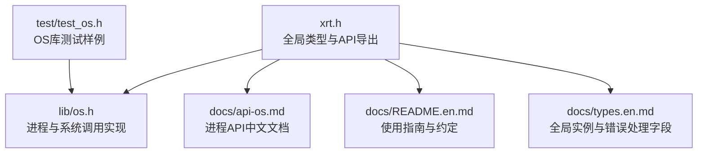
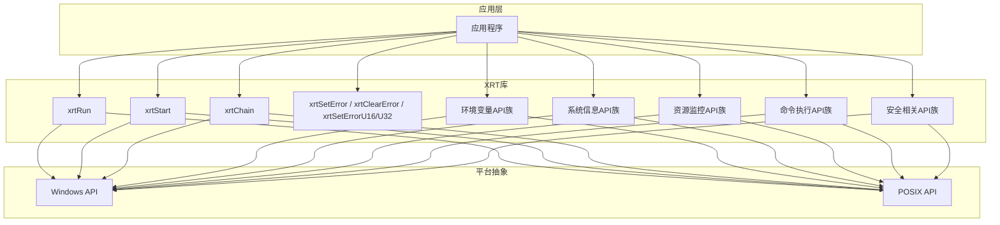
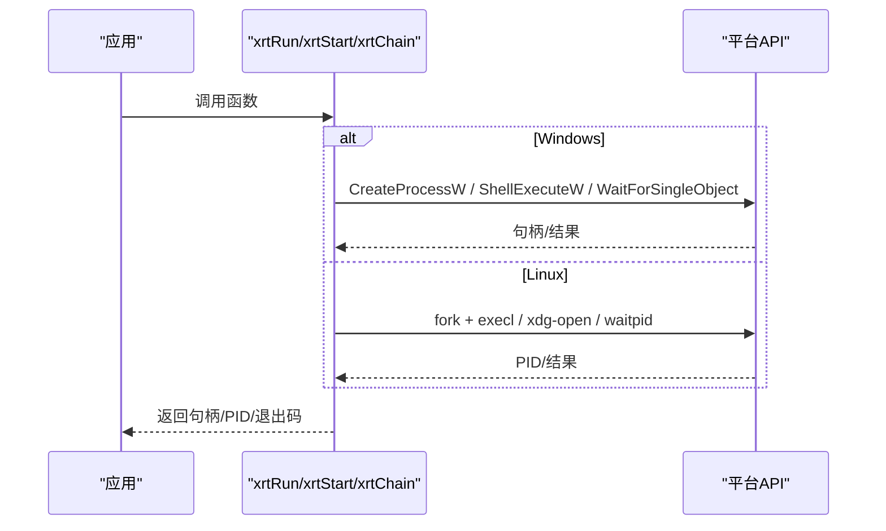
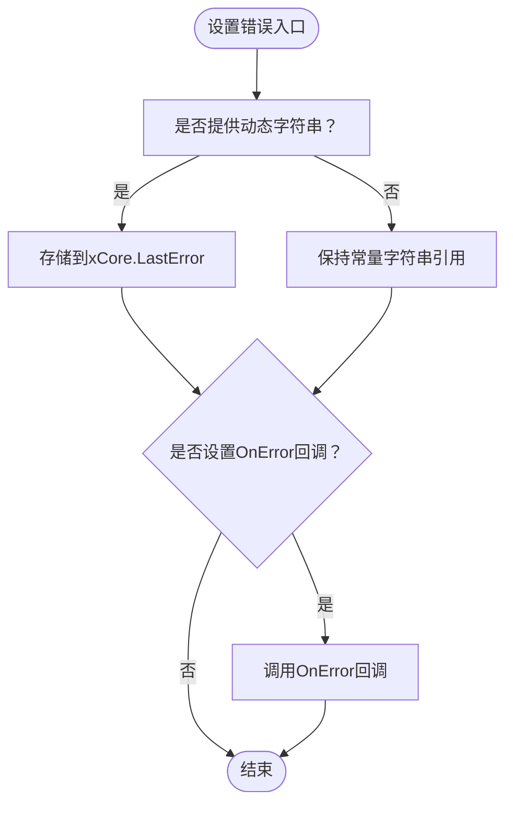
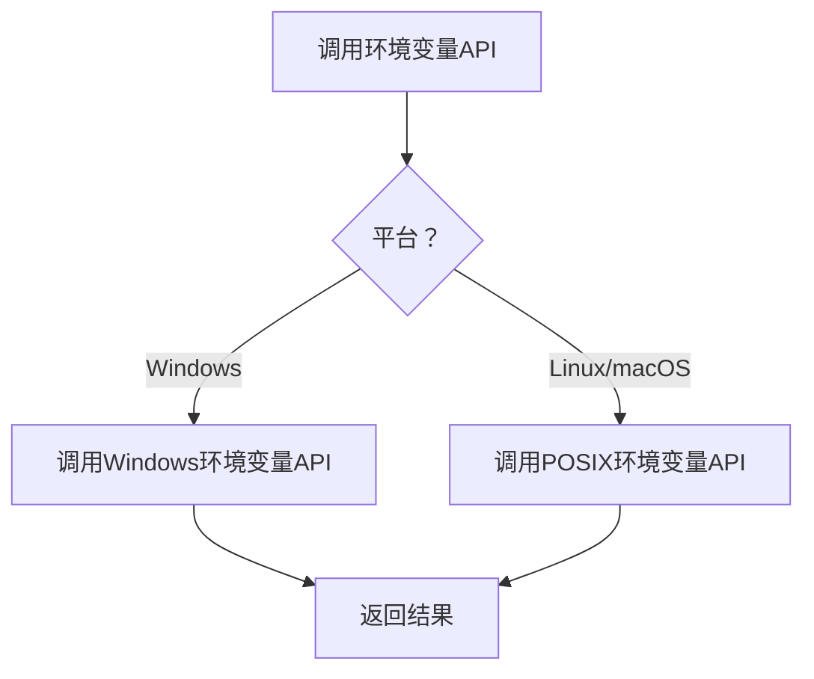
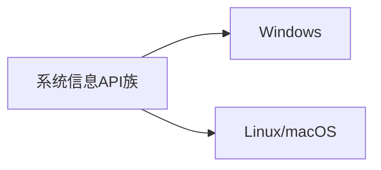
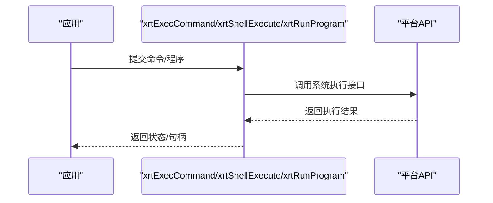
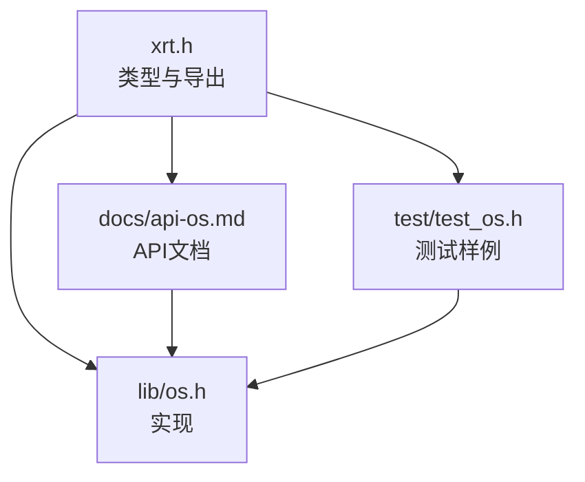

# 操作系统接口API

<cite>
**本文引用的文件**
- [xrt.h](file://xrt.h)
- [lib/os.h](file://lib/os.h)
- [docs/api-os.md](file://docs/api-os.md)
- [docs/README.en.md](file://docs/README.en.md)
- [docs/types.en.md](file://docs/types.en.md)
- [test/test_os.h](file://test/test_os.h)
</cite>

## 目录
1. [简介](#简介)
2. [项目结构](#项目结构)
3. [核心组件](#核心组件)
4. [架构总览](#架构总览)
5. [详细组件分析](#详细组件分析)
6. [依赖关系分析](#依赖关系分析)
7. [性能考量](#性能考量)
8. [故障排查指南](#故障排查指南)
9. [结论](#结论)
10. [附录](#附录)

## 简介
本文件面向操作系统接口API，聚焦以下能力域：
- 进程管理：xrtRun（异步启动）、xrtStart（系统默认程序打开）、xrtChain（同步执行并等待）
- 系统调用与错误处理：xrtSetError、xrtClearError、xrtSetErrorU16、xrtSetErrorU32（错误消息设置与清理）
- 环境变量：xrtGetEnv、xrtSetEnv、xrtUnsetEnv、xrtEnumEnv（环境变量的获取、设置、删除与枚举）
- 系统信息：xrtGetSystemInfo、xrtGetCPUInfo、xrtGetMemoryInfo、xrtGetDiskInfo、xrtGetOSVersion（系统与硬件信息）
- 系统资源监控：xrtGetResourceUsage、xrtGetLoadAverage、xrtGetUptime（资源使用、负载与运行时长）
- 系统命令执行：xrtExecCommand、xrtShellExecute、xrtRunProgram（命令执行与程序运行）
- 安全相关：xrtGetUserName、xrtGetUserHome、xrtGetTempDir、xrtGetAppDataDir（用户与目录信息）

上述API提供跨平台抽象，统一错误处理模型，覆盖权限与安全注意事项。

## 项目结构
该仓库采用“头文件声明 + 文档 + 示例测试”的组织方式：
- 头文件与类型定义集中在顶层头文件中，包含全局状态、基础类型与API导出宏
- 实现集中在lib/os.h等模块中，提供进程与系统调用相关功能
- 文档位于docs目录，包含中文与英文API文档、使用指南与最佳实践
- 测试位于test目录，包含针对OS库的单元测试样例

**图表来源**
- [xrt.h](file://xrt.h#L120-L193)
- [lib/os.h](file://lib/os.h#L1-L90)
- [docs/api-os.md](file://docs/api-os.md#L1-L80)
- [docs/README.en.md](file://docs/README.en.md#L157-L232)
- [docs/types.en.md](file://docs/types.en.md#L330-L408)
- [test/test_os.h](file://test/test_os.h#L1-L52)

**章节来源**
- [xrt.h](file://xrt.h#L120-L193)
- [docs/api-os.md](file://docs/api-os.md#L1-L80)
- [docs/README.en.md](file://docs/README.en.md#L157-L232)
- [docs/types.en.md](file://docs/types.en.md#L330-L408)
- [test/test_os.h](file://test/test_os.h#L1-L52)

## 核心组件
- 全局实例与错误处理：xCore（全局状态、LastError、OnError回调、AppPath/AppFile等）
- 进程执行族：xrtRun（异步）、xrtStart（系统默认程序）、xrtChain（同步等待）
- 系统调用与错误：xrtSetError、xrtClearError、xrtSetErrorU16/U32（多编码错误消息设置）
- 环境变量族：xrtGetEnv、xrtSetEnv、xrtUnsetEnv、xrtEnumEnv
- 系统信息族：xrtGetSystemInfo、xrtGetCPUInfo、xrtGetMemoryInfo、xrtGetDiskInfo、xrtGetOSVersion
- 资源监控族：xrtGetResourceUsage、xrtGetLoadAverage、xrtGetUptime
- 命令执行族：xrtExecCommand、xrtShellExecute、xrtRunProgram
- 安全相关：xrtGetUserName、xrtGetUserHome、xrtGetTempDir、xrtGetAppDataDir

**章节来源**
- [xrt.h](file://xrt.h#L120-L193)
- [docs/api-os.md](file://docs/api-os.md#L1-L80)
- [docs/types.en.md](file://docs/types.en.md#L330-L408)

## 架构总览
下图展示进程执行与系统调用在跨平台上的交互关系：

**图表来源**
- [lib/os.h](file://lib/os.h#L1-L90)
- [docs/api-os.md](file://docs/api-os.md#L1-L80)
- [docs/types.en.md](file://docs/types.en.md#L330-L408)

## 详细组件分析

### 进程管理API族
- xrtRun（异步启动）
  - 参数：sPath（命令或程序路径）、iSize（长度，0表示自动）
  - 返回：Windows返回进程句柄；Linux返回pid_t转换为指针
  - 说明：立即返回，适合后台任务；返回值可用于后续等待/终止
  - 平台差异：Windows使用CreateProcessW；Linux使用fork+execl
- xrtStart（系统默认程序打开）
  - 参数：sPath（文件或URL）
  - 返回：Windows返回ShellExecute结果（>32为成功）；Linux返回进程ID或NULL
  - 说明：跨平台打开文件/URL；Windows支持mailto/file等协议
- xrtChain（同步执行并等待）
  - 参数：sPath（命令或程序路径）
  - 返回：退出码；Linux异常退出返回-1
  - 说明：阻塞当前线程直到子进程结束

**图表来源**
- [lib/os.h](file://lib/os.h#L5-L90)
- [docs/api-os.md](file://docs/api-os.md#L19-L221)

**章节来源**
- [lib/os.h](file://lib/os.h#L5-L90)
- [docs/api-os.md](file://docs/api-os.md#L19-L221)
- [test/test_os.h](file://test/test_os.h#L9-L48)

### 系统调用与错误处理
- xrtSetError（设置错误消息，UTF-8）
- xrtSetErrorU16/U32（设置错误消息，分别接受UTF-16/UTF-32，内部自动转UTF-8）
- xrtClearError（清空错误消息）
- 全局实例xCore包含LastError与OnError回调，便于集中错误处理

**图表来源**
- [docs/types.en.md](file://docs/types.en.md#L330-L408)
- [docs/api-base.en.md](file://docs/api-base.en.md#L600-L683)

**章节来源**
- [docs/types.en.md](file://docs/types.en.md#L330-L408)
- [docs/api-base.en.md](file://docs/api-base.en.md#L600-L683)

### 环境变量API族
- xrtGetEnv（获取环境变量）
- xrtSetEnv（设置环境变量）
- xrtUnsetEnv（删除环境变量）
- xrtEnumEnv（枚举所有环境变量）
- 跨平台实现：Windows使用系统API，Linux/macOS使用标准环境变量接口

**图表来源**
- [docs/api-os.md](file://docs/api-os.md#L1-L80)

**章节来源**
- [docs/api-os.md](file://docs/api-os.md#L1-L80)

### 系统信息获取API族
- xrtGetSystemInfo（系统总体信息）
- xrtGetCPUInfo（CPU信息）
- xrtGetMemoryInfo（内存信息）
- xrtGetDiskInfo（磁盘信息）
- xrtGetOSVersion（操作系统版本）
- 跨平台实现：Windows使用系统API，Linux/macOS通过/proc/sys等接口或系统调用

**图表来源**
- [docs/api-os.md](file://docs/api-os.md#L1-L80)

**章节来源**
- [docs/api-os.md](file://docs/api-os.md#L1-L80)

### 系统资源监控API族
- xrtGetResourceUsage（资源使用情况）
- xrtGetLoadAverage（系统平均负载）
- xrtGetUptime（系统运行时长）
- 跨平台实现：Windows使用性能计数器或系统API，Linux/macOS通过/proc/stat、uptime等

**图表来源**
- [docs/api-os.md](file://docs/api-os.md#L1-L80)

**章节来源**
- [docs/api-os.md](file://docs/api-os.md#L1-L80)

### 系统命令执行API族
- xrtExecCommand（执行命令）
- xrtShellExecute（Shell执行）
- xrtRunProgram（运行程序）
- 跨平台实现：Windows使用CreateProcessW/ShellExecuteW，Linux/macOS使用fork+exec系列

**图表来源**
- [lib/os.h](file://lib/os.h#L5-L90)
- [docs/api-os.md](file://docs/api-os.md#L1-L80)

**章节来源**
- [lib/os.h](file://lib/os.h#L5-L90)
- [docs/api-os.md](file://docs/api-os.md#L1-L80)

### 安全相关API族
- xrtGetUserName（获取用户名）
- xrtGetUserHome（获取用户主目录）
- xrtGetTempDir（获取临时目录）
- xrtGetAppDataDir（获取应用数据目录）
- 跨平台实现：Windows使用系统API，Linux/macOS通过环境变量与系统调用

**图表来源**
- [docs/api-os.md](file://docs/api-os.md#L1-L80)

**章节来源**
- [docs/api-os.md](file://docs/api-os.md#L1-L80)

## 依赖关系分析
- 头文件xrt.h定义全局实例xCore、基础类型与API导出宏，是所有API的契约基础
- lib/os.h提供进程与系统调用的具体实现，依赖平台API
- 文档docs/api-os.md提供API行为、参数与示例，指导跨平台使用
- 测试test/test_os.h验证各平台行为

**图表来源**
- [xrt.h](file://xrt.h#L120-L193)
- [lib/os.h](file://lib/os.h#L1-L90)
- [docs/api-os.md](file://docs/api-os.md#L1-L80)
- [test/test_os.h](file://test/test_os.h#L1-L52)

**章节来源**
- [xrt.h](file://xrt.h#L120-L193)
- [lib/os.h](file://lib/os.h#L1-L90)
- [docs/api-os.md](file://docs/api-os.md#L1-L80)
- [test/test_os.h](file://test/test_os.h#L1-L52)

## 性能考量
- 异步执行优先：xrtRun适合后台任务，避免阻塞主线程
- 同步等待谨慎：xrtChain会阻塞当前线程，建议在独立线程或事件循环中使用
- 跨平台差异：Windows与Linux的系统调用开销不同，应结合业务场景选择合适API
- 错误处理成本：频繁设置错误消息会带来额外开销，建议在关键路径上进行优化

## 故障排查指南
- 初始化与清理：确保先调用xrtInit再使用API，最后调用xrtUnit释放资源
- 错误检查：通过xCore.LastError或OnError回调获取最近错误
- 路径与权限：确认可执行文件存在且具备执行权限；Windows需正确扩展名
- 命令注入：对用户输入进行严格校验与转义，避免危险命令拼接
- 工作目录：必要时在命令中显式指定工作目录

**章节来源**
- [docs/README.en.md](file://docs/README.en.md#L157-L232)
- [docs/types.en.md](file://docs/types.en.md#L330-L408)
- [docs/api-os.md](file://docs/api-os.md#L615-L744)

## 结论
该API族提供了统一的跨平台操作系统接口，覆盖进程管理、系统调用、环境变量、系统信息、资源监控与安全相关能力。通过清晰的错误处理模型与丰富的使用示例，开发者可在Windows与Linux/macOS平台上一致地构建系统级功能。建议在生产环境中重视安全与权限控制，并根据性能需求选择合适的执行策略。

## 附录
- 使用前必读：库初始化、内存管理与字符集约定
- 最佳实践：跨平台统一用法、命令参数转义、异步执行管理与安全防护

**章节来源**
- [docs/README.en.md](file://docs/README.en.md#L157-L232)
- [docs/api-os.md](file://docs/api-os.md#L420-L542)