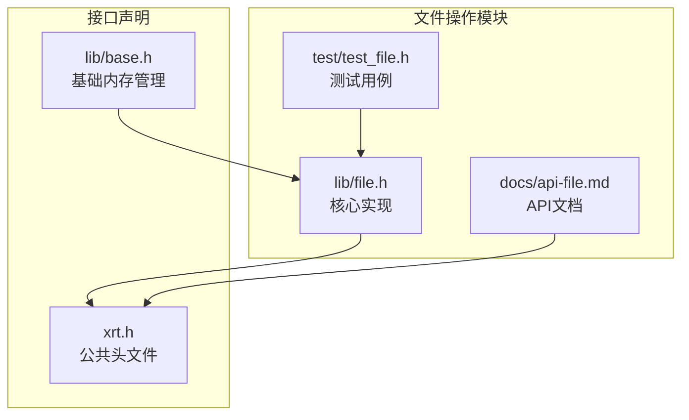
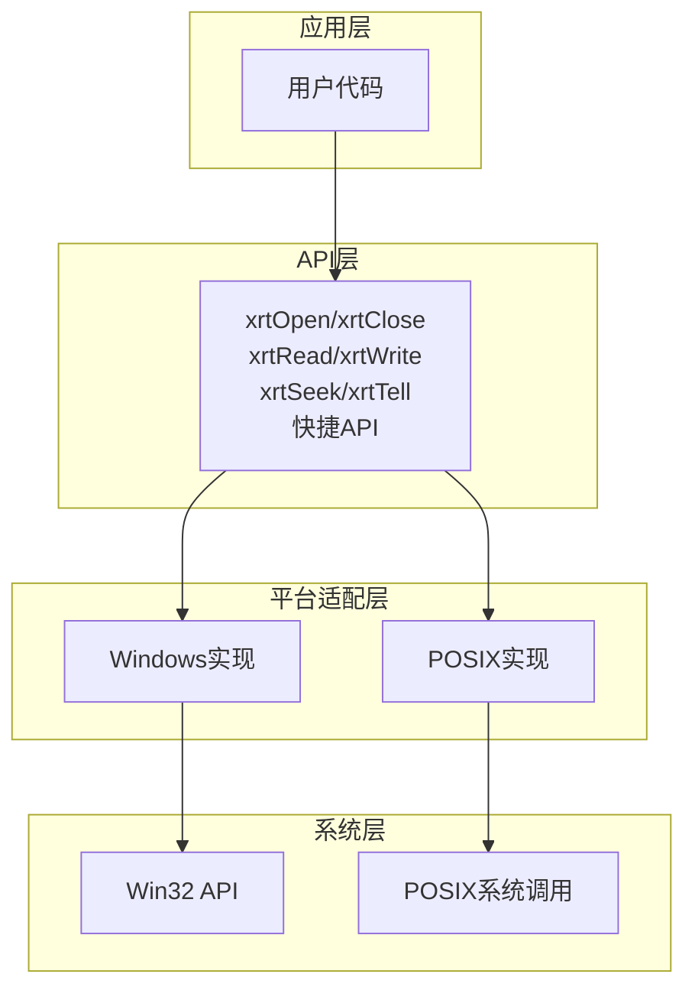
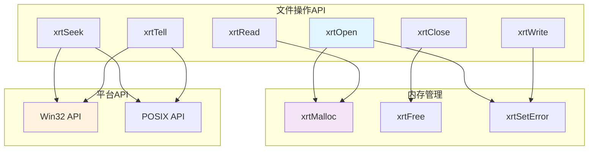

# 文件操作API

<cite>
**本文引用的文件**
- [lib/file.h](file://lib/file.h)
- [docs/api-file.md](file://docs/api-file.md)
- [test/test_file.h](file://test/test_file.h)
- [xrt.h](file://xrt.h)
- [lib/base.h](file://lib/base.h)
</cite>

## 目录
1. [简介](#简介)
2. [项目结构](#项目结构)
3. [核心组件](#核心组件)
4. [架构概览](#架构概览)
5. [详细组件分析](#详细组件分析)
6. [依赖关系分析](#依赖关系分析)
7. [性能考虑](#性能考虑)
8. [故障排除指南](#故障排除指南)
9. [结论](#结论)
10. [附录](#附录)

## 简介
本文档详细介绍了 xrt 库中的文件操作API，涵盖文件打开与关闭、文件定位、文件读写、快捷读写、文件信息、文件操作、目录操作等完整功能。文档基于仓库中的实际实现，提供参数规范、返回值含义、内存管理要求、使用示例以及跨平台兼容性说明。

## 项目结构
文件操作API主要位于以下位置：
- 核心实现：lib/file.h
- 文档说明：docs/api-file.md
- 测试用例：test/test_file.h
- 头文件声明：xrt.h
- 基础内存管理：lib/base.h



**图表来源**
- [lib/file.h](file://lib/file.h#L1-L50)
- [docs/api-file.md](file://docs/api-file.md#L1-L30)
- [test/test_file.h](file://test/test_file.h#L1-L30)
- [xrt.h](file://xrt.h#L690-L720)

**章节来源**
- [lib/file.h](file://lib/file.h#L1-L100)
- [docs/api-file.md](file://docs/api-file.md#L1-L50)

## 核心组件
文件操作API围绕以下核心概念构建：

### 数据类型
- **xfile**：文件句柄类型，跨平台抽象
- **xfile_struct**：文件对象结构体，包含平台特定的句柄和元数据
- **字符集常量**：支持自动检测、UTF-8、UTF-16、UTF-32等编码

### 平台兼容性
- Windows：使用 Win32 API（CreateFile、ReadFile、WriteFile等）
- POSIX系统：使用标准C库函数（open、read、write、lseek等）

**章节来源**
- [lib/file.h](file://lib/file.h#L38-L61)
- [docs/api-file.md](file://docs/api-file.md#L36-L62)

## 架构概览
文件操作API采用分层设计，提供统一的跨平台接口：



**图表来源**
- [lib/file.h](file://lib/file.h#L17-L278)
- [lib/file.h](file://lib/file.h#L315-L471)

## 详细组件分析

### 文件打开与关闭

#### xrtOpen - 打开文件
**函数原型：**
```c
xfile xrtOpen(str sPath, int bReadOnly, int iCharset);
```

**参数规范：**
- `sPath`：文件路径（UTF-8编码）
- `bReadOnly`：只读标志（TRUE/FALSE）
- `iCharset`：字符集设置（XRT_CP_AUTO、XRT_CP_UTF8等）

**返回值：**
- 成功：文件对象指针
- 失败：NULL（错误信息存储在xCore.LastError）

**内存管理：**
- 成功时返回的xfile对象由内部管理
- 需要通过xrtClose释放

**实现细节：**
- 自动检测空文件编码为UTF-8
- 支持BOM自动处理
- 最多读取64KB数据进行编码推测

**章节来源**
- [lib/file.h](file://lib/file.h#L17-L149)
- [docs/api-file.md](file://docs/api-file.md#L66-L125)

#### xrtClose - 关闭文件
**函数原型：**
```c
void xrtClose(xfile objFile);
```

**参数规范：**
- `objFile`：文件对象指针

**行为特性：**
- 传入NULL安全
- 自动刷新缓冲区（非只读模式）
- 释放内部内存

**章节来源**
- [lib/file.h](file://lib/file.h#L283-L310)
- [docs/api-file.md](file://docs/api-file.md#L128-L162)

### 文件定位

#### xrtSeek - 设置文件游标
**函数原型：**
```c
size_t xrtSeek(xfile objFile, long iOffset, int iMoveMethod);
```

**参数规范：**
- `iMoveMethod`：移动方式
  - XRT_SEEK_SET (0)：从文件开头
  - XRT_SEEK_CUR (1)：从当前位置
  - XRT_SEEK_END (2)：从文件末尾

**返回值：**
- 新的游标位置（字节偏移）

**章节来源**
- [lib/file.h](file://lib/file.h#L315-L357)
- [docs/api-file.md](file://docs/api-file.md#L167-L216)

#### xrtTell - 获取当前游标位置
**函数原型：**
```c
size_t xrtTell(xfile objFile);
```

**返回值：**
- 当前游标位置（字节偏移）

**章节来源**
- [lib/file.h](file://lib/file.h#L362-L384)
- [docs/api-file.md](file://docs/api-file.md#L219-L234)

#### xrtGetEOF - 获取文件大小
**函数原型：**
```c
size_t xrtGetEOF(xfile objFile);
```

**返回值：**
- 文件大小（字节）

**章节来源**
- [lib/file.h](file://lib/file.h#L389-L412)
- [docs/api-file.md](file://docs/api-file.md#L236-L250)

#### xrtEOF - 检查文件末尾
**函数原型：**
```c
bool xrtEOF(xfile objFile);
```

**返回值：**
- TRUE：已到达文件末尾
- FALSE：未到达文件末尾

**章节来源**
- [lib/file.h](file://lib/file.h#L417-L440)
- [docs/api-file.md](file://docs/api-file.md#L253-L292)

#### xrtSetEOF - 设置文件末尾
**函数原型：**
```c
bool xrtSetEOF(xfile objFile);
```

**功能：**
- 截断文件到当前游标位置

**返回值：**
- TRUE：成功
- FALSE：失败

**章节来源**
- [lib/file.h](file://lib/file.h#L445-L471)
- [docs/api-file.md](file://docs/api-file.md#L296-L334)

### 文件读写

#### xrtRead - 文本读取
**函数原型：**
```c
str xrtRead(xfile objFile, size_t iSize, size_t* iRetSize);
```

**内存管理：**
- 返回的字符串需要使用xrtFree释放
- 内部保留4字节用于字符串结尾

**字符集处理：**
- 自动转换为UTF-8编码
- 支持UTF-32编码的特殊处理

**章节来源**
- [lib/file.h](file://lib/file.h#L476-L559)
- [docs/api-file.md](file://docs/api-file.md#L340-L387)

#### xrtWrite - 文本写入
**函数原型：**
```c
size_t xrtWrite(xfile objFile, str sText, size_t iSize);
```

**参数规范：**
- `sText`：UTF-8编码字符串
- `iSize`：字节数（0表示自动计算）

**返回值：**
- 实际写入的字节数

**字符集处理：**
- 输入必须是UTF-8，自动转换为目标文件编码

**章节来源**
- [lib/file.h](file://lib/file.h#L564-L633)
- [docs/api-file.md](file://docs/api-file.md#L390-L429)

#### xrtGet - 二进制读取
**函数原型：**
```c
ptr xrtGet(xfile objFile, size_t iSize, size_t* iRetSize);
```

**内存管理：**
- 返回的二进制数据需要使用xrtFree释放

**用途：**
- 读取二进制文件
- 不进行字符集转换

**章节来源**
- [lib/file.h](file://lib/file.h#L638-L691)
- [docs/api-file.md](file://docs/api-file.md#L432-L478)

#### xrtPut - 二进制写入
**函数原型：**
```c
int xrtPut(xfile objFile, ptr pBuff, size_t iSize);
```

**返回值：**
- 实际写入的字节数

**章节来源**
- [lib/file.h](file://lib/file.h#L696-L731)
- [docs/api-file.md](file://docs/api-file.md#L481-L519)

### 快捷读写

#### xrtFileReadAll - 读取整个文件
**函数原型：**
```c
str xrtFileReadAll(str sPath, int iCharset, size_t* iRetSize);
```

**内存管理：**
- 返回的字符串需要使用xrtFree释放

**章节来源**
- [lib/file.h](file://lib/file.h#L772-L791)
- [docs/api-file.md](file://docs/api-file.md#L524-L566)

#### xrtFileWriteAll - 写入并覆盖文件
**函数原型：**
```c
int xrtFileWriteAll(str sPath, str sText, size_t iSize, int iCharset);
```

**返回值：**
- 成功：写入字节数
- 失败：0

**章节来源**
- [lib/file.h](file://lib/file.h#L754-L767)
- [docs/api-file.md](file://docs/api-file.md#L569-L606)

#### xrtFileAppend - 追加写入
**函数原型：**
```c
int xrtFileAppend(str sPath, str sText, size_t iSize, int iCharset);
```

**返回值：**
- 成功：写入字节数
- 失败：0

**章节来源**
- [lib/file.h](file://lib/file.h#L736-L749)
- [docs/api-file.md](file://docs/api-file.md#L609-L649)

#### xrtFileGetAll - 二进制读取
**函数原型：**
```c
ptr xrtFileGetAll(str sPath, size_t* iRetSize);
```

**内存管理：**
- 返回的二进制数据需要使用xrtFree释放

**章节来源**
- [lib/file.h](file://lib/file.h#L845-L919)
- [docs/api-file.md](file://docs/api-file.md#L653-L691)

#### xrtFilePutAll - 二进制写入
**函数原型：**
```c
int xrtFilePutAll(str sPath, ptr pBuff, size_t iSize);
```

**返回值：**
- 成功：写入字节数
- 失败：0

**章节来源**
- [lib/file.h](file://lib/file.h#L796-L840)
- [docs/api-file.md](file://docs/api-file.md#L694-L727)

### 文件信息

#### xrtPathExists - 路径存在性检查
**函数原型：**
```c
bool xrtPathExists(str sPath);
```

**返回值：**
- TRUE：路径存在
- FALSE：路径不存在

**章节来源**
- [lib/file.h](file://lib/file.h#L924-L940)
- [docs/api-file.md](file://docs/api-file.md#L731-L748)

#### xrtFileExists - 文件存在性检查
**函数原型：**
```c
bool xrtFileExists(str sPath);
```

**返回值：**
- TRUE：文件存在
- FALSE：文件不存在或不是文件

**章节来源**
- [lib/file.h](file://lib/file.h#L945-L975)
- [docs/api-file.md](file://docs/api-file.md#L751-L784)

#### xrtDirExists - 目录存在性检查
**函数原型：**
```c
bool xrtDirExists(str sPath);
```

**返回值：**
- TRUE：目录存在
- FALSE：目录不存在或不是目录

**章节来源**
- [lib/file.h](file://lib/file.h#L980-L1010)
- [docs/api-file.md](file://docs/api-file.md#L788-L803)

#### 其他文件信息函数
- `xrtFileGetSize`：获取文件大小
- `xrtFileSetSize`：设置文件大小
- `xrtFileGetAttr`：获取文件属性
- `xrtFileSetAttr`：设置文件属性
- `xrtFileGetAccessTime`：获取最后访问时间
- `xrtFileGetChangeTime`：获取修改时间

**章节来源**
- [lib/file.h](file://lib/file.h#L1015-L1174)
- [docs/api-file.md](file://docs/api-file.md#L806-L951)

### 文件操作

#### xrtFileCopy - 复制文件
**函数原型：**
```c
bool xrtFileCopy(str sSrc, str sDst, bool bReWrite);
```

**参数规范：**
- `bReWrite`：是否覆盖已存在文件

**返回值：**
- TRUE：成功
- FALSE：失败

**章节来源**
- [lib/file.h](file://lib/file.h#L1179-L1242)
- [docs/api-file.md](file://docs/api-file.md#L957-L991)

#### xrtFileMove - 移动/重命名文件
**函数原型：**
```c
bool xrtFileMove(str sSrc, str sDst, bool bReWrite);
```

**功能：**
- 跨分区移动时自动使用复制+删除实现

**返回值：**
- TRUE：成功
- FALSE：失败

**章节来源**
- [lib/file.h](file://lib/file.h#L1247-L1289)
- [docs/api-file.md](file://docs/api-file.md#L994-L1014)

#### xrtFileDelete - 删除文件
**函数原型：**
```c
bool xrtFileDelete(str sPath);
```

**返回值：**
- TRUE：成功
- FALSE：失败

**章节来源**
- [lib/file.h](file://lib/file.h#L1294-L1315)
- [docs/api-file.md](file://docs/api-file.md#L1017-L1049)

### 目录操作

#### xrtDirScan - 扫描目录
**函数原型：**
```c
int xrtDirScan(str sPath, int bRecu, ptr pProc, ptr Param);
```

**回调函数原型：**
```c
int callback(str sPath, size_t iSize, int bDir, ptr pData, ptr Param);
```

**回调参数：**
- `bDir`：类型标识
  - 0：文件
  - 1：目录（进入时）
  - 2：目录（离开时）

**返回值：**
- 扫描到的文件数量

**章节来源**
- [lib/file.h](file://lib/file.h#L1320-L1452)
- [docs/api-file.md](file://docs/api-file.md#L1055-L1117)

#### 目录创建和删除
- `xrtDirCreate`：创建单级目录
- `xrtDirCreateAll`：创建多级目录
- `xrtDirCopy`：复制目录
- `xrtDirMove`：移动目录
- `xrtDirDelete`：删除目录（递归）

**章节来源**
- [lib/file.h](file://lib/file.h#L1457-L1740)
- [docs/api-file.md](file://docs/api-file.md#L1120-L1262)

## 依赖关系分析



**图表来源**
- [lib/file.h](file://lib/file.h#L17-L310)
- [lib/base.h](file://lib/base.h#L5-L101)

### 关键依赖关系
1. **内存管理依赖**：所有返回数据都需要xrtFree释放
2. **平台依赖**：Windows和POSIX系统调用分离实现
3. **错误处理依赖**：统一的错误设置机制
4. **字符集转换依赖**：编码检测和转换功能

**章节来源**
- [lib/file.h](file://lib/file.h#L1-L12)
- [lib/base.h](file://lib/base.h#L42-L101)

## 性能考虑

### 内存管理优化
- **批量读取**：使用xrtFileReadAll一次性读取整个文件
- **内存池**：利用临时内存机制减少频繁分配
- **BOM处理**：自动跳过BOM，避免重复处理

### I/O优化
- **缓冲区管理**：平台原生缓冲区提高读写效率
- **编码转换**：仅在必要时进行字符集转换
- **文件大小预估**：使用xrtGetEOF获取文件大小

### 平台差异
- **Windows**：使用CreateFileW等宽字符API
- **POSIX**：使用open/read/write等标准函数
- **性能差异**：不同平台的I/O性能可能有差异

## 故障排除指南

### 常见错误类型
1. **文件打开失败**：检查路径是否存在，权限是否足够
2. **读写失败**：检查磁盘空间，文件是否被其他进程占用
3. **编码错误**：确认文件实际编码与期望编码一致
4. **内存分配失败**：检查系统内存，避免过大内存分配

### 错误处理机制
- 所有API失败时设置xCore.LastError
- 使用xrtSetError设置自定义错误信息
- 提供详细的错误描述字符串

### 调试建议
1. **检查返回值**：始终验证API返回值
2. **内存泄漏**：确保所有返回的字符串都使用xrtFree释放
3. **路径问题**：使用绝对路径避免相对路径问题
4. **权限问题**：检查文件和目录的读写权限

**章节来源**
- [lib/file.h](file://lib/file.h#L4-L12)
- [lib/base.h](file://lib/base.h#L89-L132)

## 结论
xrt文件操作API提供了完整的跨平台文件处理能力，具有以下特点：

1. **统一接口**：提供一致的API接口，屏蔽平台差异
2. **内存安全**：严格的内存管理要求，避免内存泄漏
3. **编码支持**：全面的字符集支持和自动检测
4. **错误处理**：完善的错误处理和诊断机制
5. **性能优化**：针对不同平台的优化实现

建议在使用时遵循内存管理规范，正确处理错误情况，并根据具体需求选择合适的API函数。

## 附录

### API使用示例
参考测试文件中的实际使用示例：
- 编码自动识别测试
- 文件读写操作演示
- 目录遍历和操作
- 文件复制、移动、删除

### 最佳实践
1. **始终检查返回值**：验证所有文件操作的结果
2. **正确管理内存**：及时释放返回的字符串和缓冲区
3. **处理错误情况**：使用xCore.LastError获取详细错误信息
4. **选择合适API**：根据需求选择同步或异步操作
5. **注意平台差异**：在不同平台上测试兼容性

**章节来源**
- [test/test_file.h](file://test/test_file.h#L19-L255)
- [docs/api-file.md](file://docs/api-file.md#L1265-L1552)