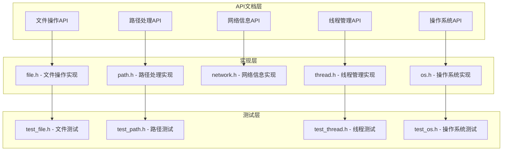
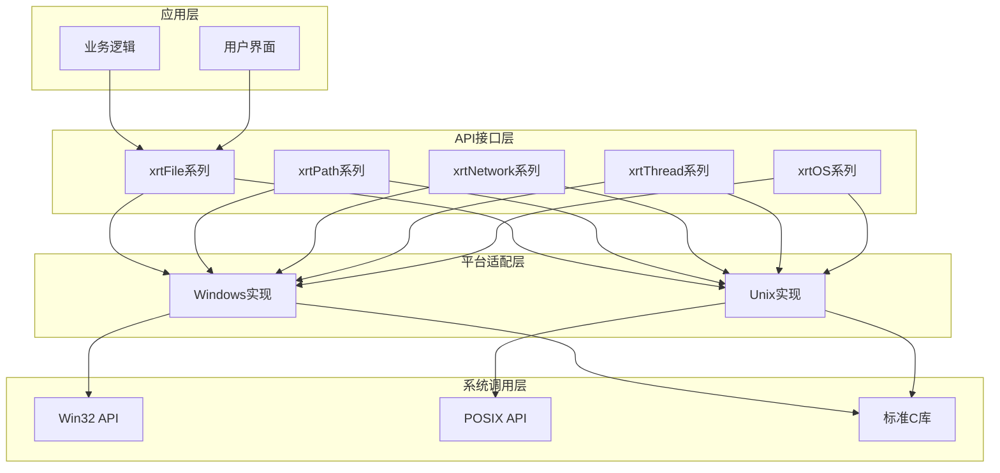
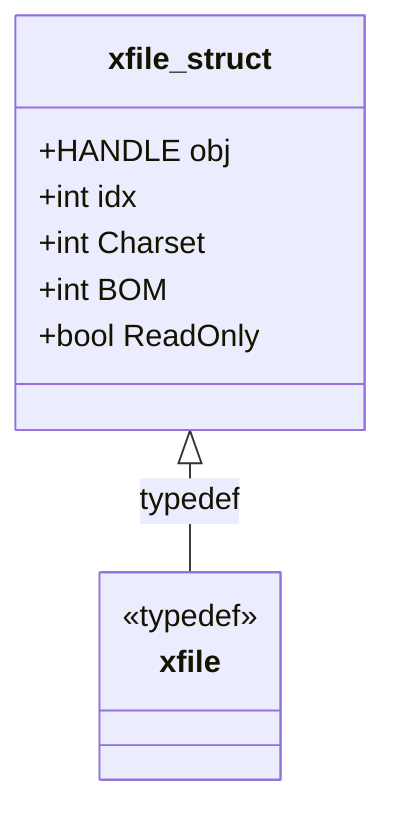
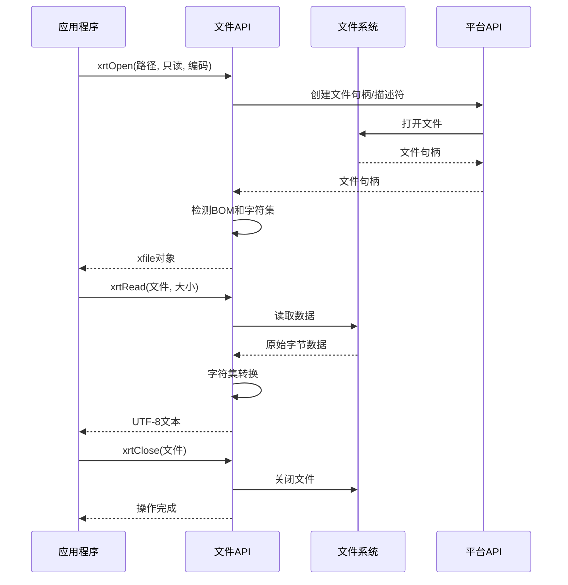
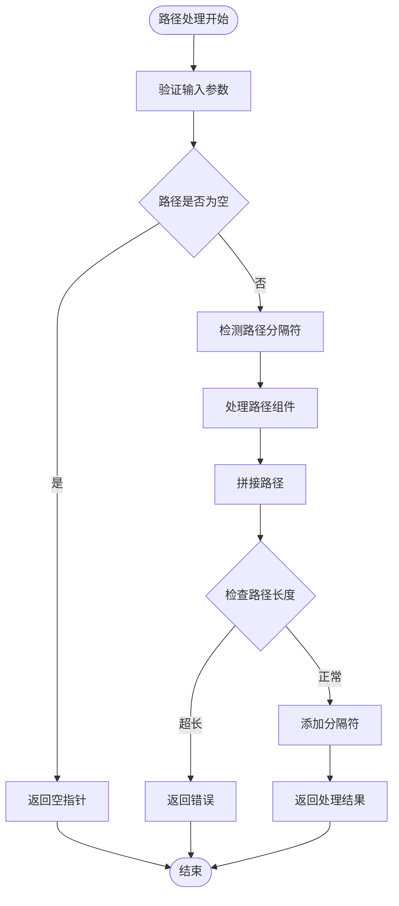
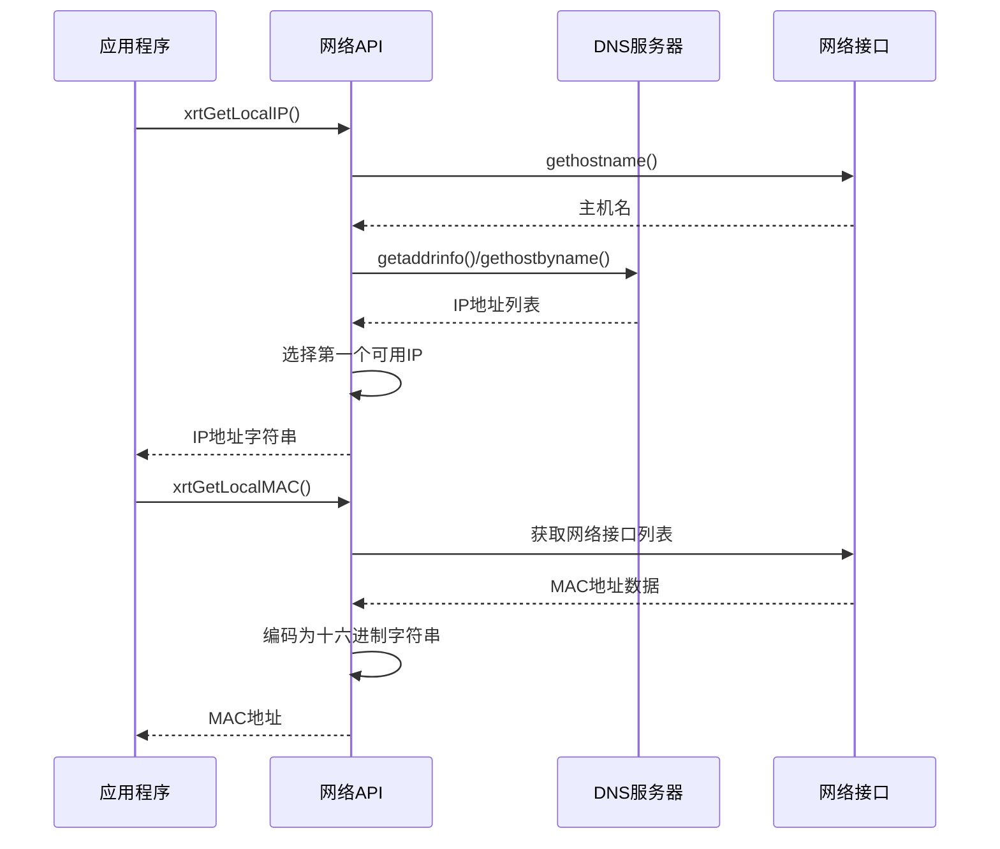
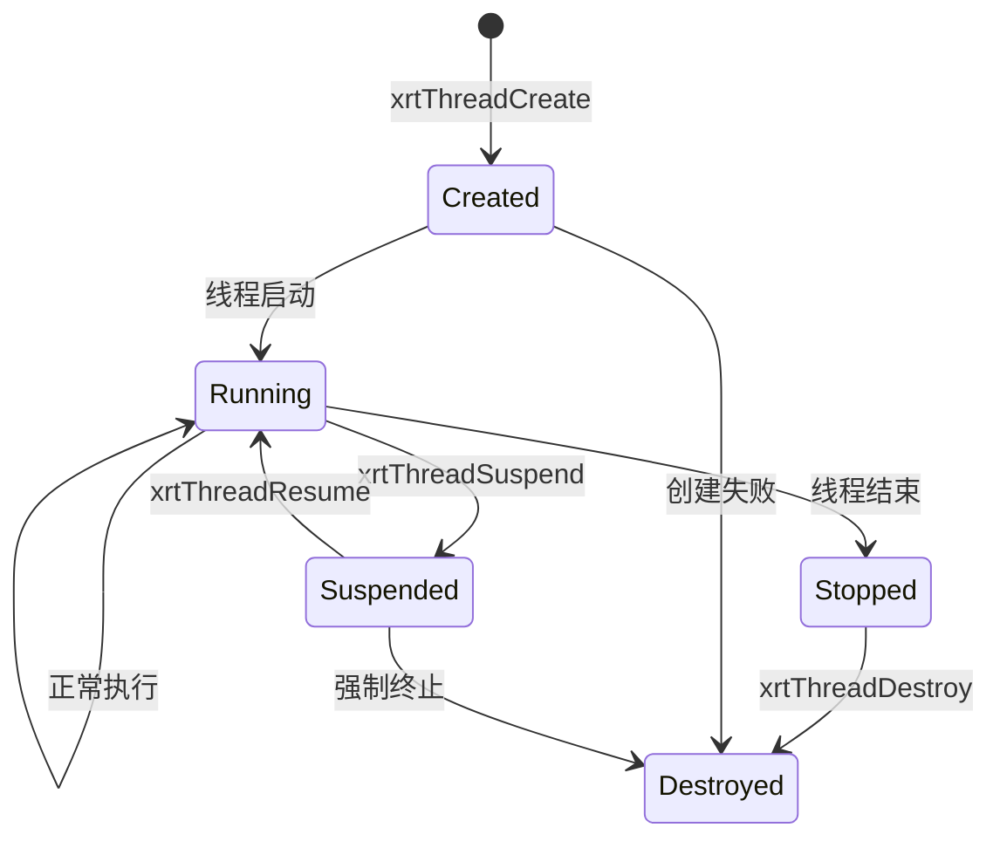
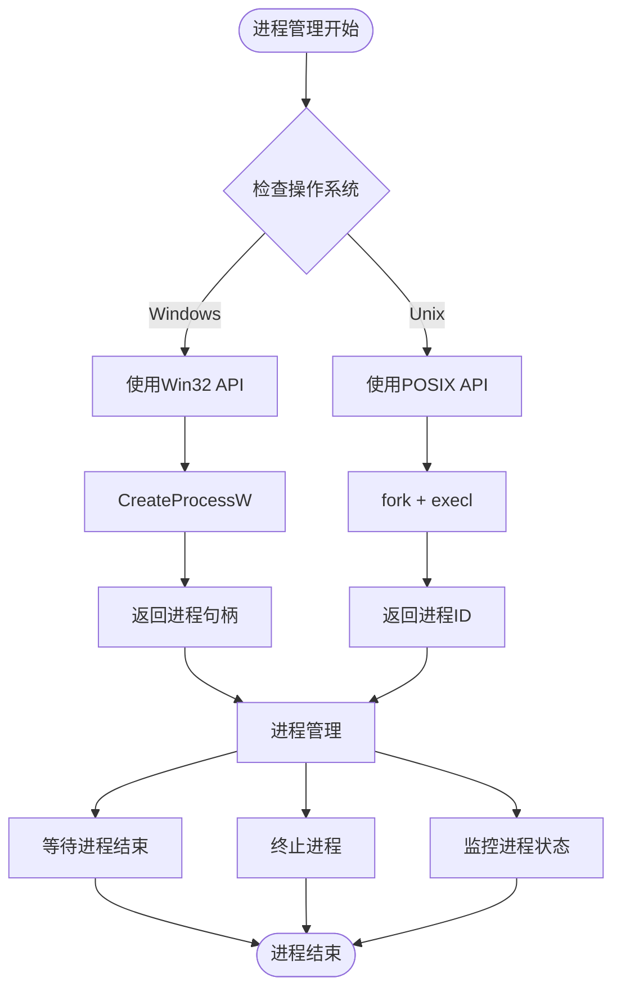
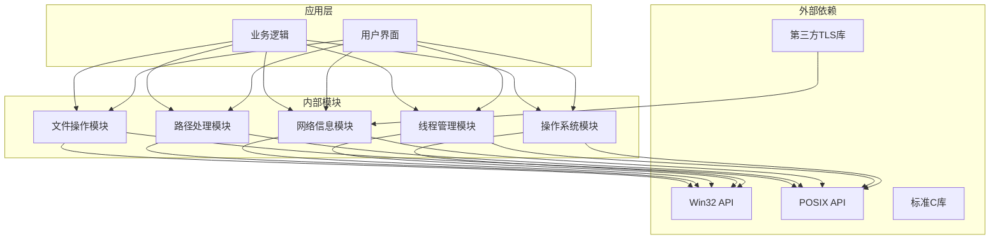

# 系统交互模块API

<cite>
**本文档引用的文件**
- [api-file.md](file://docs/api-file.md)
- [api-path.md](file://docs/api-path.md)
- [api-network.md](file://docs/api-network.md)
- [api-thread.md](file://docs/api-thread.md)
- [api-os.md](file://docs/api-os.md)
- [file.h](file://lib/file.h)
- [path.h](file://lib/path.h)
- [network.h](file://lib/network.h)
- [thread.h](file://lib/thread.h)
- [os.h](file://lib/os.h)
- [test_file.h](file://test/test_file.h)
- [test_path.h](file://test/test_path.h)
- [test_thread.h](file://test/test_thread.h)
- [test_os.h](file://test/test_os.h)
</cite>

## 目录
1. [简介](#简介)
2. [项目结构](#项目结构)
3. [核心组件](#核心组件)
4. [架构概览](#架构概览)
5. [详细组件分析](#详细组件分析)
6. [依赖关系分析](#依赖关系分析)
7. [性能考虑](#性能考虑)
8. [故障排除指南](#故障排除指南)
9. [结论](#结论)
10. [附录](#附录)

## 简介

系统交互模块API是一套跨平台的系统级编程接口，提供文件操作、路径处理、网络信息获取、线程管理、进程管理等核心功能。该模块采用统一的API设计，通过条件编译实现Windows和Unix-like系统的无缝兼容。

本模块的主要特性包括：
- 跨平台兼容性：统一的API接口，自动适配不同操作系统
- 编码支持：完整的多语言字符集支持，包括UTF-8、GBK、UTF-16等
- 线程安全：提供互斥体、信号量、条件变量等同步原语
- 网络集成：获取本机IP、MAC地址、主机名等网络信息
- 进程管理：启动外部程序、打开文件和URL、执行系统命令

## 项目结构

系统交互模块采用模块化设计，每个功能领域都有独立的API文档和实现：



**图表来源**
- [api-file.md](file://docs/api-file.md#L1-L800)
- [api-path.md](file://docs/api-path.md#L1-L621)
- [api-network.md](file://docs/api-network.md#L1-L423)
- [api-thread.md](file://docs/api-thread.md#L1-L779)
- [api-os.md](file://docs/api-os.md#L1-L859)

**章节来源**
- [api-file.md](file://docs/api-file.md#L1-L800)
- [api-path.md](file://docs/api-path.md#L1-L621)
- [api-network.md](file://docs/api-network.md#L1-L423)
- [api-thread.md](file://docs/api-thread.md#L1-L779)
- [api-os.md](file://docs/api-os.md#L1-L859)

## 核心组件

系统交互模块包含以下核心组件：

### 文件操作组件
提供完整的文件读写、目录管理、文件属性操作功能，支持多种字符集和编码格式。

### 路径处理组件  
实现跨平台的路径解析、拼接、标准化功能，自动处理不同操作系统的路径分隔符差异。

### 网络信息组件
获取本机网络信息，包括IP地址、MAC地址、主机名等，支持多网卡环境的处理。

### 线程管理组件
提供完整的多线程编程支持，包括线程创建、同步原语、线程池管理等功能。

### 操作系统组件
封装进程管理功能，支持启动外部程序、打开文件和URL、执行系统命令等操作。

**章节来源**
- [file.h](file://lib/file.h#L1-L800)
- [path.h](file://lib/path.h#L1-L190)
- [network.h](file://lib/network.h#L1-L214)
- [thread.h](file://lib/thread.h#L1-L749)
- [os.h](file://lib/os.h#L1-L90)

## 架构概览

系统交互模块采用分层架构设计，确保各组件之间的松耦合和高内聚：



**图表来源**
- [file.h](file://lib/file.h#L17-L278)
- [thread.h](file://lib/thread.h#L36-L74)
- [os.h](file://lib/os.h#L4-L28)

## 详细组件分析

### 文件操作API

文件操作模块提供了完整的文件读写功能，支持多种字符集和编码格式：

#### 核心数据结构



**图表来源**
- [file.h](file://lib/file.h#L44-L55)

#### 文件操作流程



**图表来源**
- [file.h](file://lib/file.h#L17-L278)
- [file.h](file://lib/file.h#L476-L559)

#### 文件操作API详解

**文件打开 (xrtOpen)**
- 参数规范：路径字符串、只读标志、字符集标识
- 返回值：文件对象指针或NULL
- 平台差异：Windows使用HANDLE，Unix使用文件描述符
- 性能特点：自动检测BOM，支持编码转换

**文件读写 (xrtRead/xrtWrite)**
- 文本读取：自动字符集转换为UTF-8
- 二进制读取：直接返回原始字节数据
- 写入操作：根据目标文件字符集进行转换

**文件定位 (xrtSeek/xrtTell)**
- 支持三种定位方式：文件开头、当前位置、文件末尾
- 返回新的文件指针位置
- 跨平台一致性保证

**使用示例**
```c
// 基本文件操作示例
xfile f = xrtOpen("test.txt", TRUE, XRT_CP_AUTO);
if (f) {
    str content = xrtRead(f, xrtGetEOF(f), NULL);
    xrtClose(f);
}
```

**平台差异说明**
- Windows：使用Wide字符API，支持Unicode路径
- Linux/macOS：使用UTF-8路径，支持多字节字符
- 字符集处理：自动检测和转换，支持BOM处理

**章节来源**
- [file.h](file://lib/file.h#L17-L278)
- [file.h](file://lib/file.h#L476-L559)
- [file.h](file://lib/file.h#L800-L919)
- [api-file.md](file://docs/api-file.md#L66-L125)

### 路径处理API

路径处理模块提供跨平台的路径解析和拼接功能：

#### 路径处理算法



**图表来源**
- [path.h](file://lib/path.h#L142-L187)

#### 路径处理功能

**路径解析 (xrtPathGetNameExt/xrtPathGetName/xrtPathGetExt)**
- 提取文件名、扩展名、目录路径
- 支持Windows和Unix风格路径
- 自动处理边界情况

**路径判断 (xrtPathIsAbs)**
- 判断路径是否为绝对路径
- Windows：检查驱动器字母或网络路径
- Unix：检查是否以斜杠开头

**路径拼接 (xrtPathJoin)**
- 自动添加适当的路径分隔符
- 支持可变参数列表
- 最大路径长度限制4094字符

**随机路径 (xrtPathRandom)**
- 生成随机文件名
- 支持前缀和后缀
- 使用字母数字字符集

**使用示例**
```c
// 路径处理示例
str fileName = xrtPathGetNameExt("C:\\folder\\file.txt", 0);
str dir = xrtPathGetDir("C:\\folder\\file.txt", 0);
str fullPath = xrtPathJoin(3, xCore.AppPath, "config", "app.ini");
```

**平台差异说明**
- 分隔符处理：Windows使用`\`，Unix使用`/`
- 绝对路径判断：Windows支持驱动器字母，Unix支持根目录
- 路径长度限制：统一限制为4094字符

**章节来源**
- [path.h](file://lib/path.h#L4-L137)
- [api-path.md](file://docs/api-path.md#L21-L364)

### 网络信息API

网络信息模块提供本机网络信息获取功能：

#### 网络信息获取流程



**图表来源**
- [network.h](file://lib/network.h#L4-L139)

#### 网络信息功能

**IP地址获取 (xrtGetLocalIP/xrtGetLocalRawIP)**
- 获取本机IPv4地址
- 支持字符串和原始整数格式
- 自动处理多网卡环境

**MAC地址获取 (xrtGetLocalMAC)**
- 获取第一个网络接口的MAC地址
- 返回12位十六进制字符串
- 支持Windows和Unix系统

**主机名获取 (xrtGetLocalName)**
- 获取本机主机名
- 支持最大260字符限制

**平台差异**
- Windows：使用GetAdaptersInfo API获取MAC地址
- Linux：使用ioctl(SIOCGIFHWADDR)系统调用
- DNS解析：Windows使用gethostbyname，Unix使用getaddrinfo

**使用示例**
```c
// 网络信息获取示例
str ip = xrtGetLocalIP();
str mac = xrtGetLocalMAC();
str name = xrtGetLocalName();

if (ip != xCore.sNull) {
    printf("本机IP: %s\n", ip);
    xrtFree(ip);
}
```

**章节来源**
- [network.h](file://lib/network.h#L4-L139)
- [api-network.md](file://docs/api-network.md#L24-L171)

### 线程管理API

线程管理模块提供完整的多线程编程支持：

#### 线程生命周期管理



**图表来源**
- [thread.h](file://lib/thread.h#L36-L74)
- [thread.h](file://lib/thread.h#L161-L178)

#### 线程同步原语

**互斥体 (xmutex)**
- 提供线程间互斥访问
- 支持锁定、尝试锁定、解锁操作
- 跨平台一致性保证

**信号量 (xsem)**
- 控制对有限资源的访问
- 支持计数信号量和二值信号量
- 提供超时等待功能

**条件变量 (xcond)**
- 实现线程间的条件等待和通知
- 支持单个唤醒和广播唤醒
- 与互斥体配合使用

**线程管理功能**

**线程创建和销毁**
- 支持自定义栈大小
- 跨平台线程ID获取
- 线程资源自动清理

**线程同步**
- 停止信号机制
- 超时等待功能
- 线程状态查询

**使用示例**
```c
// 线程管理示例
xmutex mutex = xrtMutexCreate();
xsem semaphore = xrtSemCreate(1, 1);
xcond condition = xrtCondCreate();

xthread thread = xrtThreadCreate(workerFunction, NULL, 0);
xrtThreadWait(thread);
xrtThreadDestroy(thread);

xrtMutexDestroy(mutex);
xrtSemDestroy(semaphore);
xrtCondDestroy(condition);
```

**平台差异**
- Windows：使用CreateThread/SuspendThread等API
- Unix：使用pthread库函数
- 条件变量：Windows使用CONDITION_VARIABLE，Unix使用pthread_cond_t

**章节来源**
- [thread.h](file://lib/thread.h#L36-L749)
- [api-thread.md](file://docs/api-thread.md#L92-L180)

### 操作系统API

操作系统模块封装进程管理功能：

#### 进程管理流程



**图表来源**
- [os.h](file://lib/os.h#L4-L90)

#### 进程管理功能

**进程启动 (xrtRun)**
- 异步启动外部程序
- 返回进程句柄或进程ID
- 支持命令行参数

**文件打开 (xrtStart)**
- 使用系统默认程序打开文件
- 支持URL和文件路径
- 跨平台文件关联

**同步执行 (xrtChain)**
- 等待程序执行完成
- 返回程序退出码
- 统一跨平台行为

**平台差异**
- Windows：使用CreateProcessW启动程序
- Unix：使用fork + execl组合
- 文件关联：Windows使用ShellExecuteW，Unix使用xdg-open

**使用示例**
```c
// 进程管理示例
#if defined(_WIN32) || defined(_WIN64)
    ptr handle = xrtRun("notepad.exe", 0);
    int exitCode = xrtChain("cmd.exe /c dir", 0);
    ptr result = xrtStart("https://www.example.com", 0);
#else
    ptr pid = xrtRun("ls -la", 0);
    int result = xrtChain("echo Hello", 0);
    ptr pid2 = xrtStart("/etc", 0);
#endif
```

**章节来源**
- [os.h](file://lib/os.h#L4-L90)
- [api-os.md](file://docs/api-os.md#L19-L221)

## 依赖关系分析

系统交互模块的依赖关系呈现清晰的层次结构：



**图表来源**
- [file.h](file://lib/file.h#L1-L10)
- [thread.h](file://lib/thread.h#L5-L9)
- [network.h](file://lib/network.h#L1-L10)

**依赖特点**
- 松耦合设计：各模块相互独立，减少依赖传播
- 条件编译：通过预处理器实现平台特定功能
- 接口稳定：对外API保持向后兼容性
- 可测试性：提供完整的测试用例覆盖

**章节来源**
- [file.h](file://lib/file.h#L1-L10)
- [thread.h](file://lib/thread.h#L5-L9)
- [network.h](file://lib/network.h#L1-L10)

## 性能考虑

系统交互模块在设计时充分考虑了性能优化：

### 内存管理优化
- **智能内存分配**：根据数据大小动态分配内存
- **内存池技术**：复用临时缓冲区，减少频繁分配
- **延迟释放**：支持批量内存释放操作

### I/O操作优化
- **缓冲策略**：文件读写使用适当缓冲大小
- **零拷贝技术**：在可能的情况下避免数据复制
- **异步I/O**：支持非阻塞文件操作

### 线程性能优化
- **线程池模式**：复用线程资源，减少创建销毁开销
- **无锁数据结构**：在高并发场景下使用无锁队列
- **CPU亲和性**：可选的线程绑定到特定CPU核心

### 编译时优化
- **内联函数**：关键API标记为内联函数
- **分支预测**：优化常见路径的分支结构
- **SIMD指令**：在支持的平台上使用向量化操作

### 运行时优化
- **缓存友好**：数据结构设计考虑CPU缓存特性
- **内存对齐**：关键数据结构按CPU字长对齐
- **减少系统调用**：合并多次I/O操作

## 故障排除指南

### 常见问题及解决方案

**文件操作错误**
- **错误现象**：文件打开失败，返回NULL
- **可能原因**：权限不足、路径不存在、磁盘空间不足
- **解决方法**：检查文件权限，验证路径有效性，清理磁盘空间

**编码转换问题**
- **错误现象**：中文显示乱码
- **可能原因**：字符集检测错误、BOM处理不当
- **解决方法**：明确指定字符集，检查文件BOM标记

**线程同步问题**
- **错误现象**：死锁或竞态条件
- **可能原因**：互斥体使用不当、条件变量等待超时
- **解决方法**：检查锁的获取和释放顺序，合理设置超时时间

**网络连接问题**
- **错误现象**：无法获取IP地址或MAC地址
- **可能原因**：网络接口禁用、权限不足、防火墙阻止
- **解决方法**：启用网络接口，提升程序权限，检查防火墙设置

### 调试技巧

**日志记录**
- 使用xCore.LastError获取详细错误信息
- 记录关键API调用的参数和返回值
- 跟踪内存分配和释放情况

**性能分析**
- 监控文件I/O操作的吞吐量
- 分析线程的CPU使用率
- 检查网络连接的延迟和带宽

**内存泄漏检测**
- 使用内存分配跟踪工具
- 检查所有xrtMalloc调用对应的xrtFree
- 验证文件句柄和网络连接的正确关闭

**章节来源**
- [file.h](file://lib/file.h#L5-L12)
- [thread.h](file://lib/thread.h#L161-L178)
- [network.h](file://lib/network.h#L107-L137)

## 结论

系统交互模块API提供了一套完整、高效、跨平台的系统级编程接口。通过精心设计的架构和实现，该模块能够满足各种系统交互需求，包括文件操作、路径处理、网络信息获取、线程管理、进程管理等核心功能。

### 主要优势
- **跨平台兼容**：统一的API接口，自动适配不同操作系统
- **功能完整**：覆盖系统交互的所有重要方面
- **性能优化**：采用多种优化技术提升执行效率
- **易于使用**：简洁的API设计，降低学习成本
- **稳定可靠**：完善的错误处理和调试支持

### 技术特色
- **条件编译**：通过预处理器实现平台特定功能
- **智能内存管理**：自动处理内存分配和释放
- **统一错误处理**：集中式的错误信息管理
- **丰富的测试覆盖**：完整的单元测试和集成测试

该模块为开发者提供了一个强大而易用的系统交互基础，适用于各种类型的系统级应用程序开发。

## 附录

### API参考速查表

| 模块 | 主要API | 功能描述 |
|------|---------|----------|
| 文件操作 | xrtOpen/xrtClose | 文件打开和关闭 |
| 文件操作 | xrtRead/xrtWrite | 文本读写操作 |
| 文件操作 | xrtGet/xrtPut | 二进制读写操作 |
| 路径处理 | xrtPathJoin | 路径拼接 |
| 路径处理 | xrtPathGetName | 获取文件名 |
| 路径处理 | xrtPathIsAbs | 判断绝对路径 |
| 网络信息 | xrtGetLocalIP | 获取本机IP |
| 网络信息 | xrtGetLocalMAC | 获取MAC地址 |
| 线程管理 | xrtThreadCreate | 创建线程 |
| 线程管理 | xrtMutexLock | 互斥锁定 |
| 线程管理 | xrtSemWait | 信号量等待 |
| 操作系统 | xrtRun | 启动程序 |
| 操作系统 | xrtStart | 打开文件 |
| 操作系统 | xrtChain | 同步执行 |

### 最佳实践建议

**文件操作**
- 始终检查API返回值
- 及时释放文件句柄和内存
- 明确指定字符集以避免编码问题

**路径处理**
- 使用xrtPathJoin替代手动字符串拼接
- 验证路径的有效性和安全性
- 处理跨平台路径差异

**线程编程**
- 使用RAII模式管理线程资源
- 避免死锁，遵循一致的锁获取顺序
- 合理设置超时时间防止无限等待

**网络编程**
- 处理网络异常和超时情况
- 验证网络接口状态
- 考虑防火墙和安全策略影响

**进程管理**
- 监控子进程状态和资源使用
- 处理进程间通信和同步
- 实现优雅的进程终止机制