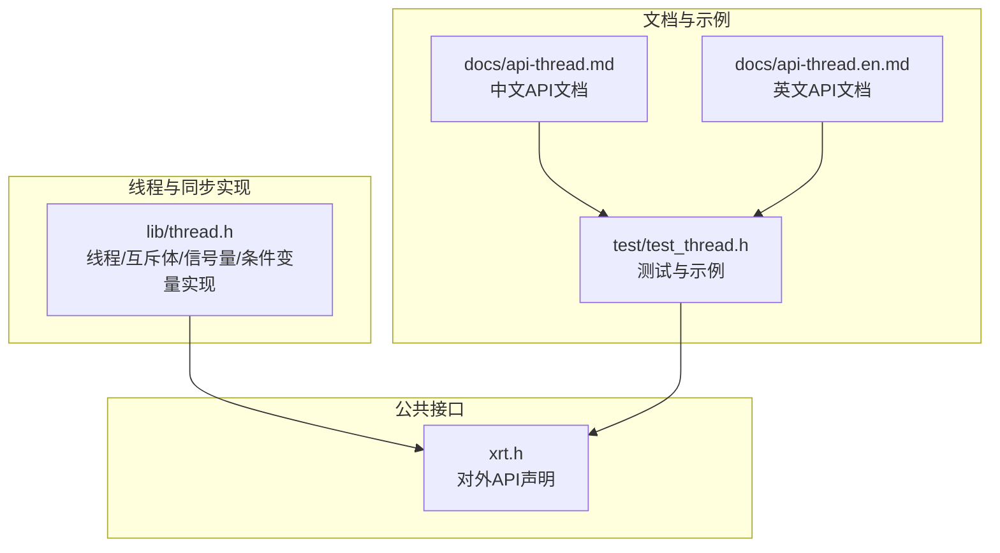
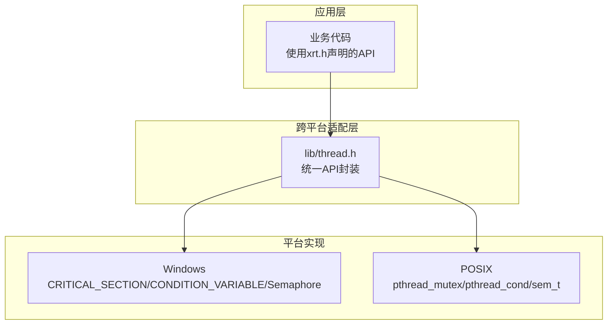
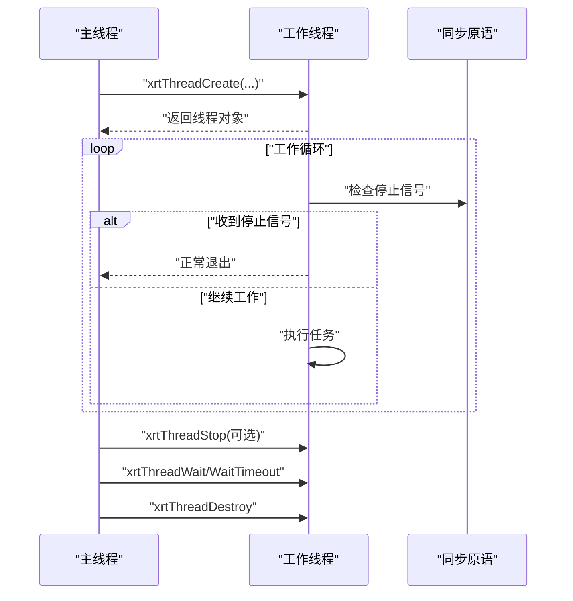
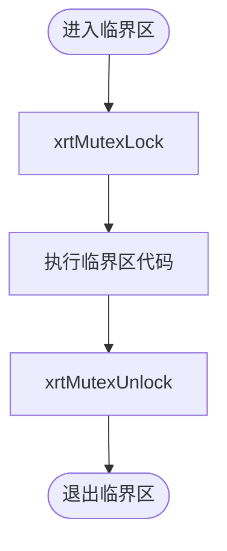
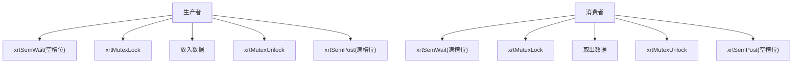
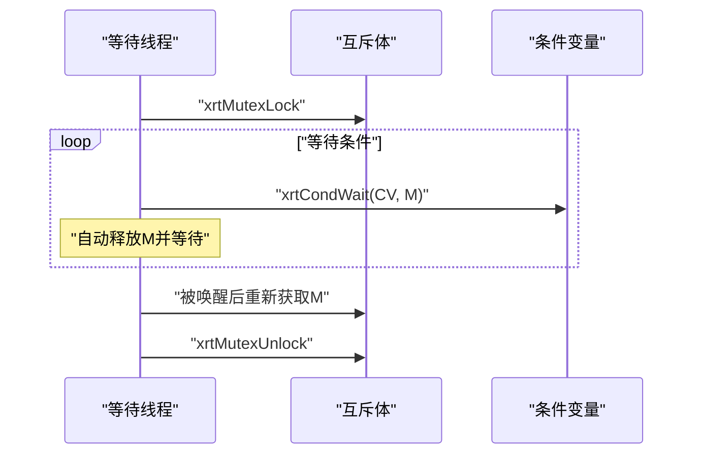
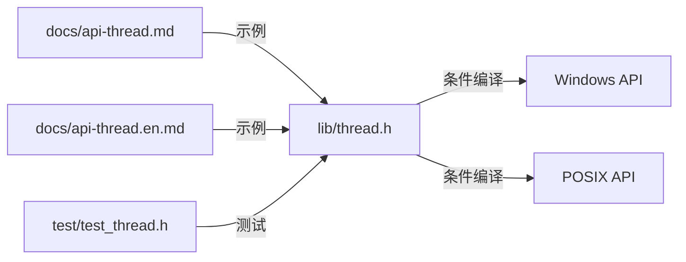

# 线程管理API

<cite>
**本文引用的文件**
- [lib/thread.h](file://lib/thread.h)
- [docs/api-thread.md](file://docs/api-thread.md)
- [docs/api-thread.en.md](file://docs/api-thread.en.md)
- [test/test_thread.h](file://test/test_thread.h)
- [xrt.h](file://xrt.h)
</cite>

## 目录
1. [简介](#简介)
2. [项目结构](#项目结构)
3. [核心组件](#核心组件)
4. [架构总览](#架构总览)
5. [详细组件分析](#详细组件分析)
6. [依赖关系分析](#依赖关系分析)
7. [性能考量](#性能考量)
8. [故障排查指南](#故障排查指南)
9. [结论](#结论)
10. [附录](#附录)

## 简介
本文件系统化梳理线程管理API，覆盖线程生命周期与控制、同步原语（互斥体、信号量、条件变量、读写锁）、线程本地存储（TLS）以及线程池管理与调度等能力。文档基于仓库中的线程实现与配套文档进行整理，提供参数规范、返回值语义、使用示例与跨平台差异说明，并给出死锁避免策略、性能优化建议与最佳实践。

## 项目结构
线程相关能力主要由以下模块构成：
- 线程与同步原语实现：lib/thread.h
- API文档与示例：docs/api-thread.md、docs/api-thread.en.md
- 测试用例与使用范式：test/test_thread.h
- 头文件导出声明：xrt.h

图表来源
- [lib/thread.h](file://lib/thread.h#L34-L749)
- [docs/api-thread.md](file://docs/api-thread.md#L1-L779)
- [docs/api-thread.en.md](file://docs/api-thread.en.md#L90-L768)
- [test/test_thread.h](file://test/test_thread.h#L1-L276)
- [xrt.h](file://xrt.h#L840-L925)

章节来源
- [lib/thread.h](file://lib/thread.h#L34-L749)
- [docs/api-thread.md](file://docs/api-thread.md#L1-L779)
- [docs/api-thread.en.md](file://docs/api-thread.en.md#L90-L768)
- [test/test_thread.h](file://test/test_thread.h#L1-L276)
- [xrt.h](file://xrt.h#L840-L925)

## 核心组件
- 线程管理：创建、等待、停止、强制终止、挂起/恢复、状态查询、当前线程ID、让出时间片
- 互斥体：创建/销毁、初始化/释放、锁定/尝试锁定/解锁
- 信号量：创建/销毁、等待/尝试等待/带超时等待、释放/批量释放
- 条件变量：创建/销毁、等待/带超时等待、单播/广播
- 读写锁：创建/销毁、读写锁定/尝试、降级/升级、调试辅助
- 线程本地存储（TLS）：分配/设置/获取/释放（声明于头文件，具体实现需参考对应模块）
- 线程池管理与调度：（声明于头文件，具体实现需参考对应模块）

章节来源
- [xrt.h](file://xrt.h#L840-L925)
- [lib/thread.h](file://lib/thread.h#L305-L749)
- [docs/api-thread.md](file://docs/api-thread.md#L22-L86)

## 架构总览
线程与同步原语在Windows与POSIX平台上分别映射到原生API（如CRITICAL_SECTION、pthread_*、CONDITION_VARIABLE、sem_t等），并通过统一的结构体包装对外暴露一致的API。

图表来源
- [lib/thread.h](file://lib/thread.h#L4-L30)
- [lib/thread.h](file://lib/thread.h#L305-L749)
- [xrt.h](file://xrt.h#L840-L925)

## 详细组件分析

### 线程管理
- 创建线程：xrtThreadCreate
  - 参数：线程函数指针、传入参数、栈大小（0表示使用系统默认）
  - 返回：线程对象指针；失败返回NULL
  - 跨平台：Windows使用CreateThread；POSIX使用pthread_create
- 等待线程结束：xrtThreadWait、xrtThreadWaitTimeout
  - 阻塞等待或带超时等待（毫秒）
  - 返回：等待结果枚举（成功/超时/错误）
- 停止与强制终止：xrtThreadStop、xrtThreadShouldStop、xrtThreadKill
  - 停止信号：线程内定期检查xrtThreadShouldStop
  - 强制终止：危险操作，可能导致资源泄漏
- 挂起/恢复：xrtThreadSuspend、xrtThreadResume
  - 仅Windows支持；Linux/macOS返回失败
- 状态与退出码：xrtThreadGetState、xrtThreadGetExitCode
- 当前线程ID：xrtThreadGetCurrentId
- 让出时间片：xrtThreadYield
- 销毁线程对象：xrtThreadDestroy（不终止线程，仅释放管理结构）

图表来源
- [lib/thread.h](file://lib/thread.h#L36-L192)
- [test/test_thread.h](file://test/test_thread.h#L105-L180)

章节来源
- [lib/thread.h](file://lib/thread.h#L36-L292)
- [docs/api-thread.md](file://docs/api-thread.md#L90-L244)
- [docs/api-thread.en.md](file://docs/api-thread.en.md#L90-L241)
- [test/test_thread.h](file://test/test_thread.h#L105-L180)

### 互斥体
- 创建/销毁：xrtMutexCreate、xrtMutexDestroy
- 初始化/释放：xrtMutexInit、xrtMutexUnit
- 锁定/尝试锁定/解锁：xrtMutexLock、xrtMutexTryLock、xrtMutexUnlock

图表来源
- [lib/thread.h](file://lib/thread.h#L307-L420)
- [docs/api-thread.md](file://docs/api-thread.md#L248-L312)

章节来源
- [lib/thread.h](file://lib/thread.h#L307-L420)
- [docs/api-thread.md](file://docs/api-thread.md#L248-L312)
- [docs/api-thread.en.md](file://docs/api-thread.en.md#L245-L309)

### 信号量
- 创建/销毁：xrtSemCreate、xrtSemDestroy
- 初始化/释放：xrtSemInit、xrtSemUnit
- 等待/尝试等待/带超时等待：xrtSemWait、xrtSemTryWait、xrtSemWaitTimeout
- 释放/批量释放：xrtSemPost、xrtSemPostMultiple

图表来源
- [lib/thread.h](file://lib/thread.h#L426-L590)
- [docs/api-thread.md](file://docs/api-thread.md#L315-L404)

章节来源
- [lib/thread.h](file://lib/thread.h#L426-L590)
- [docs/api-thread.md](file://docs/api-thread.md#L315-L404)
- [docs/api-thread.en.md](file://docs/api-thread.en.md#L312-L394)

### 条件变量
- 创建/销毁：xrtCondCreate、xrtCondDestroy
- 初始化/释放：xrtCondInit、xrtCondUnit
- 等待/带超时等待：xrtCondWait、xrtCondWaitTimeout
- 单播/广播：xrtCondSignal、xrtCondBroadcast

图表来源
- [lib/thread.h](file://lib/thread.h#L596-L746)
- [docs/api-thread.md](file://docs/api-thread.md#L406-L476)

章节来源
- [lib/thread.h](file://lib/thread.h#L596-L746)
- [docs/api-thread.md](file://docs/api-thread.md#L406-L476)
- [docs/api-thread.en.md](file://docs/api-thread.en.md#L406-L472)

### 读写锁
- 创建/销毁：xrtRWLockCreate、xrtRWLockDestroy
- 初始化/释放：xrtRWLockInit、xrtRWLockUnit
- 读写锁定/尝试：xrtRWLockReadLock、xrtRWLockTryReadLock、xrtRWLockWriteLock、xrtRWLockTryWriteLock
- 降级/升级：xrtRWLockDowngrade、xrtRWLockUpgrade
- 调试辅助：读/写锁状态检查与等待队列统计

章节来源
- [dev/rwlock_api.h](file://dev/rwlock_api.h#L1-L93)
- [dev/rwlock_impl.c](file://dev/rwlock_impl.c#L221-L425)

### 线程本地存储（TLS）
- 分配/设置/获取/释放：xrtTLSAlloc、xrtTLSSet、xrtTLSGet、xrtTLSFree
- 说明：该组API在头文件中声明，具体实现需参考对应模块

章节来源
- [xrt.h](file://xrt.h#L840-L925)

### 线程池管理与调度
- 线程池创建/提交/销毁：xrtThreadPoolCreate、xrtThreadPoolSubmit、xrtThreadPoolDestroy
- 线程睡眠/让出/优先级：xrtThreadSleep、xrtThreadYield、xrtThreadPriority
- 说明：该组API在头文件中声明，具体实现需参考对应模块

章节来源
- [xrt.h](file://xrt.h#L840-L925)

## 依赖关系分析
- 线程实现依赖跨平台头文件（Windows与POSIX）进行条件编译
- 同步原语在Windows上使用CRITICAL_SECTION/CONDITION_VARIABLE/Win32 Semaphore，在POSIX上使用pthread与sem_t
- 文档与测试用例共同验证API行为与使用范式

图表来源
- [lib/thread.h](file://lib/thread.h#L4-L30)
- [docs/api-thread.md](file://docs/api-thread.md#L1-L779)
- [docs/api-thread.en.md](file://docs/api-thread.en.md#L90-L768)
- [test/test_thread.h](file://test/test_thread.h#L1-L276)

章节来源
- [lib/thread.h](file://lib/thread.h#L4-L30)
- [docs/api-thread.md](file://docs/api-thread.md#L1-L779)
- [docs/api-thread.en.md](file://docs/api-thread.en.md#L90-L768)
- [test/test_thread.h](file://test/test_thread.h#L1-L276)

## 性能考量
- 选择合适的同步原语
  - 读多写少场景优先考虑读写锁，减少写者饥饿
  - 严格互斥访问使用互斥体
  - 生产者-消费者使用信号量，避免忙等
- 避免忙等与过度轮询
  - 使用带超时的等待（如xrtThreadWaitTimeout、xrtSemWaitTimeout、xrtCondWaitTimeout）
  - 在轮询场景中适当让出CPU（xrtThreadYield）
- 栈大小与线程数量
  - 合理设置线程栈大小，避免过大造成内存浪费
  - 控制并发线程数量，避免上下文切换开销过大
- 跨平台差异
  - Windows支持线程挂起/恢复；POSIX不支持，需通过信号量/条件变量模拟
  - POSIX部分平台对带超时的线程等待支持有限，需回退轮询策略

## 故障排查指南
- 线程无法结束
  - 检查是否正确发送停止信号并在线程内周期性检查xrtThreadShouldStop
  - 确保等待顺序：先xrtThreadWait，再xrtThreadDestroy
- 强制终止风险
  - 避免使用xrtThreadKill；如确需终止，确保资源已清理且无共享状态
- 死锁排查
  - 互斥体/读写锁必须成对出现，避免重复锁定与反向加锁
  - 条件变量等待前必须持有互斥体，等待后在退出前释放
- 超时与平台差异
  - 在POSIX平台使用带超时等待时，注意glibc版本差异与回退策略
- 资源泄漏
  - 确保互斥体、信号量、条件变量、线程对象均正确销毁

章节来源
- [docs/api-thread.md](file://docs/api-thread.md#L691-L779)
- [docs/api-thread.en.md](file://docs/api-thread.en.md#L703-L768)
- [lib/thread.h](file://lib/thread.h#L112-L157)

## 结论
本线程管理API提供了跨平台的一致抽象，覆盖线程生命周期、同步原语与常用并发模式。遵循“停止信号优于强制终止”“成对加解锁”“合理使用超时等待”的原则，可在保证正确性的前提下获得良好性能。结合测试用例与文档示例，可快速构建稳定可靠的多线程应用。

## 附录
- 常量定义与数据结构
  - 线程状态与等待返回值常量
  - 线程/互斥体/信号量/条件变量数据结构定义
- 使用场景与最佳实践
  - 基本线程使用、互斥体保护共享数据、生产者-消费者、条件变量等待通知
  - 停止线程的正确方式、资源释放顺序、平台差异与编译链接要求

章节来源
- [docs/api-thread.md](file://docs/api-thread.md#L22-L86)
- [docs/api-thread.md](file://docs/api-thread.md#L479-L779)
- [docs/api-thread.en.md](file://docs/api-thread.en.md#L90-L768)