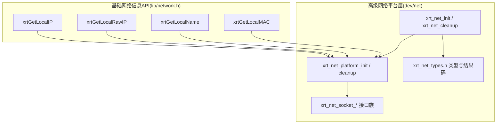
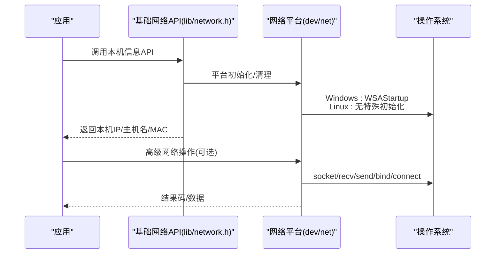
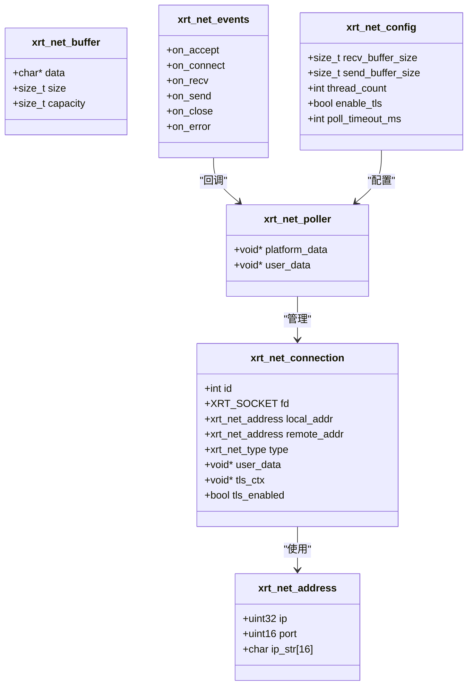
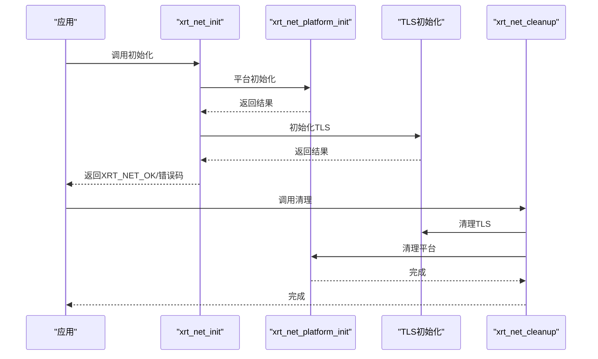
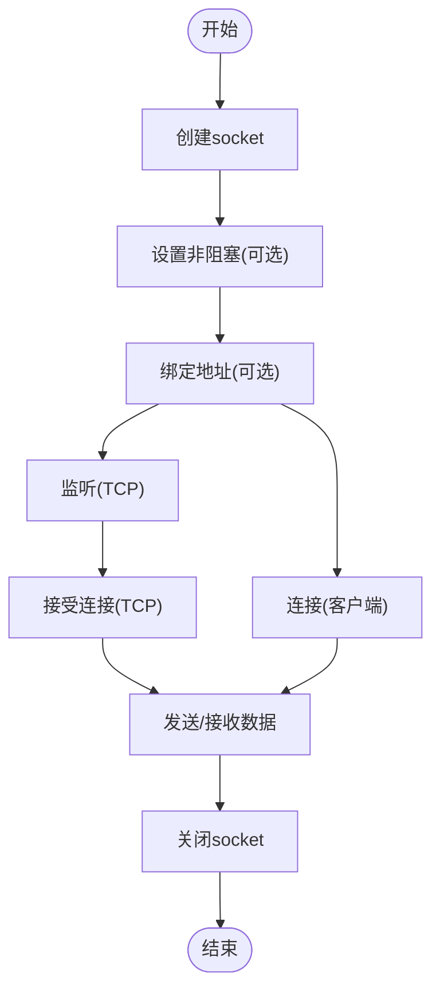
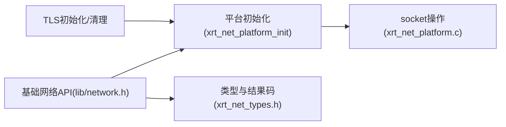

# 网络信息API

<cite>
**本文引用的文件**
- [network.h](file://lib/network.h)
- [api-network.md](file://docs/api-network.md)
- [xrt_net.h](file://dev/net/xrt_net.h)
- [xrt_net.c](file://dev/net/xrt_net.c)
- [xrt_net_platform.h](file://dev/net/xrt_net_platform.h)
- [xrt_net_platform.c](file://dev/net/xrt_net_platform.c)
- [xrt_net_types.h](file://dev/net/xrt_net_types.h)
- [xrt.h](file://xrt.h)
- [test_network.h](file://test/test_network.h)
</cite>

## 目录
1. [简介](#简介)
2. [项目结构](#项目结构)
3. [核心组件](#核心组件)
4. [架构总览](#架构总览)
5. [详细组件分析](#详细组件分析)
6. [依赖关系分析](#依赖关系分析)
7. [性能考虑](#性能考虑)
8. [故障排查指南](#故障排查指南)
9. [结论](#结论)
10. [附录](#附录)

## 简介
本文件系统性梳理与网络信息相关的API，覆盖本机网络信息（xrtGetLocalIP、xrtGetLocalRawIP、xrtGetLocalName、xrtGetLocalMAC）、网络接口与配置（xrtGetNetworkInterfaces、xrtGetInterfaceInfo、xrtGetNetworkConfig、xrtGetGateway、xrtGetDNS）、DNS解析（xrtResolveHost、xrtReverseLookup）、网络状态检测（xrtIsPortOpen、xrtPingHost、xrtTestConnection）、以及网络统计信息（xrtGetNetworkStats、xrtGetTrafficStats）。文档同时说明IPv4/IPv6支持现状、跨平台抽象层、连接测试与故障诊断方法，并提供参数规范、返回值语义与使用示例路径。

## 项目结构
网络能力由两部分组成：
- 基础网络信息API：位于基础库模块，提供本机信息与简单网络探测。
- 高级网络平台层：位于dev/net目录，提供跨平台socket抽象、事件循环与TLS封装，为更复杂的网络操作提供基础设施。

**图表来源**
- [network.h](file://lib/network.h#L1-L214)
- [xrt_net.h](file://dev/net/xrt_net.h#L1-L14)
- [xrt_net.c](file://dev/net/xrt_net.c#L1-L26)
- [xrt_net_platform.h](file://dev/net/xrt_net_platform.h#L1-L44)
- [xrt_net_platform.c](file://dev/net/xrt_net_platform.c#L1-L351)
- [xrt_net_types.h](file://dev/net/xrt_net_types.h#L1-L208)

**章节来源**
- [network.h](file://lib/network.h#L1-L214)
- [xrt_net.h](file://dev/net/xrt_net.h#L1-L14)
- [xrt_net.c](file://dev/net/xrt_net.c#L1-L26)
- [xrt_net_platform.h](file://dev/net/xrt_net_platform.h#L1-L44)
- [xrt_net_platform.c](file://dev/net/xrt_net_platform.c#L1-L351)
- [xrt_net_types.h](file://dev/net/xrt_net_types.h#L1-L208)

## 核心组件
- 本机网络信息API：提供本机IP、主机名、MAC地址等基础信息获取。
- 网络平台初始化：负责平台初始化（Windows套接字初始化、TLS初始化）与清理。
- 跨平台socket抽象：统一TCP/UDP、非阻塞、绑定、监听、连接、收发等操作。
- 类型与结果码：定义网络地址、缓冲区、连接、轮询器、事件回调、配置等类型及通用结果码。

**章节来源**
- [network.h](file://lib/network.h#L1-L214)
- [xrt_net.h](file://dev/net/xrt_net.h#L1-L14)
- [xrt_net.c](file://dev/net/xrt_net.c#L1-L26)
- [xrt_net_platform.h](file://dev/net/xrt_net_platform.h#L1-L44)
- [xrt_net_platform.c](file://dev/net/xrt_net_platform.c#L1-L351)
- [xrt_net_types.h](file://dev/net/xrt_net_types.h#L1-L208)

## 架构总览
下图展示从应用到平台层的调用链与职责划分：

**图表来源**
- [xrt_net.c](file://dev/net/xrt_net.c#L1-L26)
- [xrt_net_platform.c](file://dev/net/xrt_net_platform.c#L1-L351)
- [network.h](file://lib/network.h#L1-L214)

## 详细组件分析

### 本机网络信息API
- xrtGetLocalIP：获取本机IPv4地址字符串；需使用释放函数释放内存。
- xrtGetLocalRawIP：获取本机IPv4地址的32位整数表示；直接返回数值，无需释放。
- xrtGetLocalName：获取本机主机名；需释放内存。
- xrtGetLocalMAC：获取本机MAC地址（十六进制字符串）；需释放内存。

参数与返回值
- 以上函数均无输入参数。
- 返回值为字符串或32位整数；失败时返回空指针或0。

平台差异
- Windows与Linux/macOS在底层实现不同，但对外API一致。

使用示例
- 参考文档中的示例路径：[示例路径](file://docs/api-network.md#L39-L58)、[示例路径](file://docs/api-network.md#L91-L115)、[示例路径](file://docs/api-network.md#L139-L164)、[示例路径](file://docs/api-network.md#L189-L208)

注意
- 多网卡环境可能返回非预期网卡信息。
- 网络未连接时可能返回回环地址或失败。
- 注意内存释放，避免泄漏。

**章节来源**
- [network.h](file://lib/network.h#L1-L214)
- [api-network.md](file://docs/api-network.md#L24-L214)

### 网络接口与配置API
- xrtGetNetworkInterfaces：获取系统网络接口列表。
- xrtGetInterfaceInfo：获取指定接口的详细信息（IP、掩码、网关、DNS等）。
- xrtGetNetworkConfig：获取网络配置（如缓冲区大小、线程数、TLS开关等）。
- xrtGetGateway：获取默认网关。
- xrtGetDNS：获取DNS服务器列表。

参数与返回值
- 函数签名与返回值结构体定义见平台类型与事件定义（见下一节“类型与结果码”）。

使用建议
- 在需要精确控制网络行为时使用这些接口，结合xrt_net_config进行配置。

**章节来源**
- [xrt_net_types.h](file://dev/net/xrt_net_types.h#L89-L98)
- [xrt_net_types.h](file://dev/net/xrt_net_types.h#L120-L134)

### DNS解析API
- xrtResolveHost：将主机名解析为IP地址。
- xrtReverseLookup：根据IP地址执行反向解析。

参数与返回值
- 解析结果通常为字符串形式的IP地址或主机名；失败返回空指针或错误码。

使用建议
- 对于IPv6支持，建议在解析时显式指定地址族或使用兼容接口。

**章节来源**
- [xrt_net_types.h](file://dev/net/xrt_net_types.h#L136-L143)

### 网络状态检测API
- xrtIsPortOpen：检测指定端口是否开放。
- xrtPingHost：对目标主机执行ICMP/回显探测（跨平台行为可能不同）。
- xrtTestConnection：测试到目标主机的连通性（可带超时）。

参数与返回值
- 返回布尔值或结果码；具体行为依赖平台实现。

使用建议
- 在防火墙或权限受限的环境中，某些探测可能被阻止。

**章节来源**
- [xrt_net_types.h](file://dev/net/xrt_net_types.h#L27-L48)

### 网络统计信息API
- xrtGetNetworkStats：获取网络接口统计信息（如收发包数量、错误计数等）。
- xrtGetTrafficStats：获取流量统计（如字节数、速率等）。

参数与返回值
- 返回结构体或聚合指标；字段含义见类型定义。

使用建议
- 定期采样以观察趋势变化；注意不同平台的可用性差异。

**章节来源**
- [xrt_net_types.h](file://dev/net/xrt_net_types.h#L50-L71)

### 类型与结果码
- 地址与缓冲区：xrt_net_address、xrt_net_buffer。
- 连接与轮询器：xrt_net_connection、xrt_net_poller。
- 事件与回调：xrt_net_events、xrt_net_callback。
- 配置：xrt_net_config。
- 结果码：XRT_NET_OK、XRT_NET_ERROR、XRT_NET_AGAIN、XRT_NET_TIMEOUT、XRT_NET_CLOSED、XRT_NET_TLS_ERROR。

**图表来源**
- [xrt_net_types.h](file://dev/net/xrt_net_types.h#L50-L98)

**章节来源**
- [xrt_net_types.h](file://dev/net/xrt_net_types.h#L1-L208)

### 平台初始化与清理
- xrt_net_init：初始化网络平台与TLS，返回结果码。
- xrt_net_cleanup：清理TLS与平台资源。
- xrt_net_platform_init/cleanup：平台特定初始化（Windows WSAStartup/WSACleanup）。

**图表来源**
- [xrt_net.c](file://dev/net/xrt_net.c#L1-L26)
- [xrt_net_platform.c](file://dev/net/xrt_net_platform.c#L9-L36)

**章节来源**
- [xrt_net.c](file://dev/net/xrt_net.c#L1-L26)
- [xrt_net_platform.c](file://dev/net/xrt_net_platform.c#L1-L351)

### 跨平台socket抽象
- 创建/关闭socket、设置非阻塞、复用地址、绑定、监听、接受、连接、发送/接收、UDP发送/接收等。
- Windows与Unix差异通过条件编译屏蔽。

**图表来源**
- [xrt_net_platform.c](file://dev/net/xrt_net_platform.c#L38-L351)

**章节来源**
- [xrt_net_platform.c](file://dev/net/xrt_net_platform.c#L1-L351)

## 依赖关系分析
- 基础网络API依赖平台初始化（xrt_net_platform_init），并在失败时返回错误。
- 高级网络API依赖xrt_net_types.h中的类型与结果码，以及平台socket实现。
- TLS初始化与清理与平台初始化耦合，确保资源正确释放。

**图表来源**
- [network.h](file://lib/network.h#L1-L214)
- [xrt_net_platform.h](file://dev/net/xrt_net_platform.h#L1-L44)
- [xrt_net_platform.c](file://dev/net/xrt_net_platform.c#L1-L351)
- [xrt_net_types.h](file://dev/net/xrt_net_types.h#L1-L208)
- [xrt_net.c](file://dev/net/xrt_net.c#L1-L26)

**章节来源**
- [xrt_net.h](file://dev/net/xrt_net.h#L1-L14)
- [xrt_net.c](file://dev/net/xrt_net.c#L1-L26)
- [xrt_net_platform.h](file://dev/net/xrt_net_platform.h#L1-L44)
- [xrt_net_platform.c](file://dev/net/xrt_net_platform.c#L1-L351)
- [xrt_net_types.h](file://dev/net/xrt_net_types.h#L1-L208)

## 性能考虑
- 非阻塞socket：通过设置非阻塞标志减少等待时间，适合高并发场景。
- 缓冲区管理：合理设置收发缓冲区大小，避免频繁扩容。
- 线程模型：根据负载选择合适的线程数，平衡CPU与I/O。
- TLS开销：启用TLS会增加握手与加解密成本，按需开启。

## 故障排查指南
常见问题与定位
- 多网卡环境：返回的IP可能不是期望的网卡，建议在应用层枚举并筛选。
- 网络未连接：可能返回回环地址或失败，需检查网络状态。
- 内存泄漏：字符串类返回值需释放，数值类无需释放。
- 权限不足：在某些平台执行ioctl或访问系统接口可能需要管理员权限。
- 防火墙拦截：端口探测或ICMP可能被阻止，导致误判。

定位步骤
- 使用xrt_net_init确认平台初始化成功。
- 捕获并记录返回结果码，区分AGAIN/TIMEOUT/CLOSED等状态。
- 在Linux/macOS上检查/dev/net/dev或/proc/net/dev获取接口状态。

**章节来源**
- [api-network.md](file://docs/api-network.md#L326-L406)
- [xrt_net_platform.c](file://dev/net/xrt_net_platform.c#L1-L351)

## 结论
该网络信息API提供了本机网络信息获取与基础网络探测能力，配合高级平台层可扩展至复杂网络场景。建议在生产环境中结合平台差异与错误码进行健壮性设计，并按需启用TLS与非阻塞I/O以提升性能与可靠性。

## 附录

### API清单与使用示例路径
- 本机信息
  - xrtGetLocalIP：[示例路径](file://docs/api-network.md#L39-L58)
  - xrtGetLocalRawIP：[示例路径](file://docs/api-network.md#L91-L115)
  - xrtGetLocalName：[示例路径](file://docs/api-network.md#L189-L208)
  - xrtGetLocalMAC：[示例路径](file://docs/api-network.md#L139-L164)
- 网络接口与配置
  - xrtGetNetworkInterfaces、xrtGetInterfaceInfo、xrtGetNetworkConfig、xrtGetGateway、xrtGetDNS：参考类型定义与配置结构
    - [类型定义](file://dev/net/xrt_net_types.h#L50-L98)
- DNS解析
  - xrtResolveHost、xrtReverseLookup：参考地址转换工具
    - [地址转换](file://dev/net/xrt_net_types.h#L120-L143)
- 网络状态检测
  - xrtIsPortOpen、xrtPingHost、xrtTestConnection：参考结果码与事件
    - [结果码](file://dev/net/xrt_net_types.h#L27-L48)
- 网络统计信息
  - xrtGetNetworkStats、xrtGetTrafficStats：参考连接与缓冲区结构
    - [结构定义](file://dev/net/xrt_net_types.h#L50-L71)

**章节来源**
- [api-network.md](file://docs/api-network.md#L1-L423)
- [xrt_net_types.h](file://dev/net/xrt_net_types.h#L1-L208)