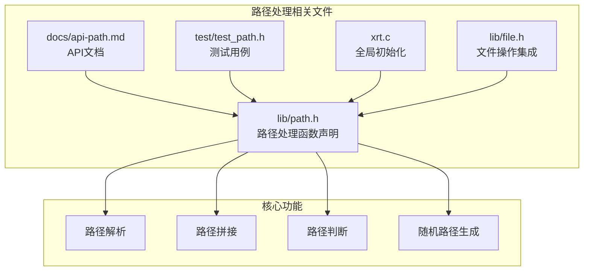
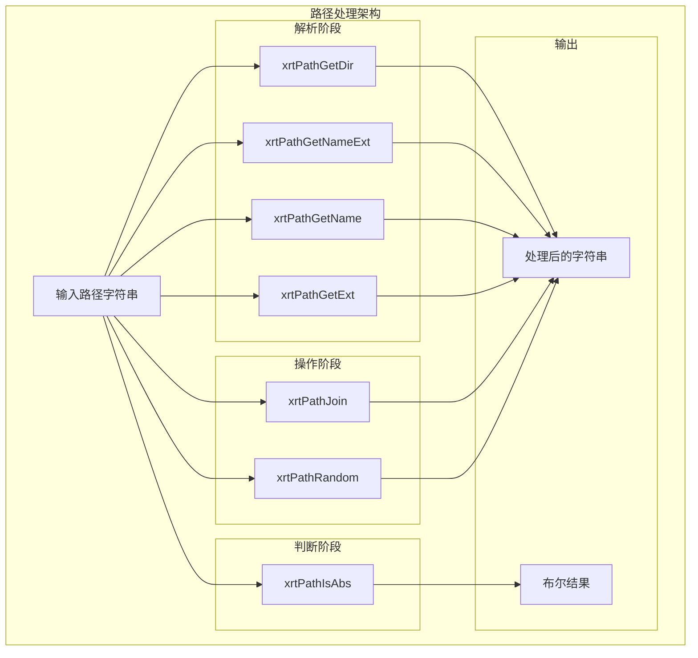
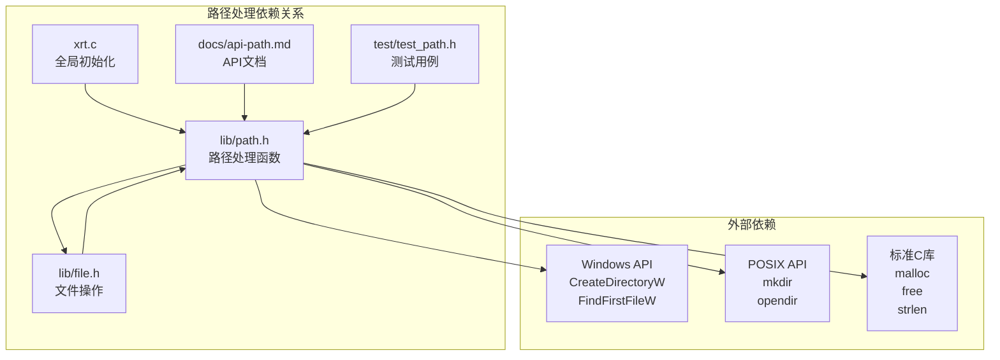

# 路径处理API

<cite>
**本文档引用的文件**
- [lib/path.h](file://lib/path.h)
- [docs/api-path.md](file://docs/api-path.md)
- [test/test_path.h](file://test/test_path.h)
- [xrt.c](file://xrt.c)
- [lib/file.h](file://lib/file.h)
</cite>

## 目录
1. [简介](#简介)
2. [项目结构](#项目结构)
3. [核心组件](#核心组件)
4. [架构概览](#架构概览)
5. [详细组件分析](#详细组件分析)
6. [依赖关系分析](#依赖关系分析)
7. [性能考虑](#性能考虑)
8. [故障排除指南](#故障排除指南)
9. [结论](#结论)

## 简介

本文档详细介绍了xrt库中的路径处理API。这些API提供了跨平台的文件路径解析、拼接、判断和生成功能，支持Windows和Unix风格的路径格式。所有路径处理函数都遵循统一的内存管理约定，返回的字符串都需要使用`xrtFree`进行释放。

## 项目结构

路径处理功能主要位于以下文件中：



**图表来源**
- [lib/path.h](file://lib/path.h#L1-L190)
- [docs/api-path.md](file://docs/api-path.md#L1-L621)
- [test/test_path.h](file://test/test_path.h#L1-L19)

**章节来源**
- [lib/path.h](file://lib/path.h#L1-L190)
- [docs/api-path.md](file://docs/api-path.md#L1-L621)

## 核心组件

当前版本的路径处理API包含以下核心函数：

### 路径信息提取函数
- `xrtPathGetDir` - 提取路径的目录部分
- `xrtPathGetNameExt` - 获取文件名（含扩展名）
- `xrtPathGetName` - 获取文件名（不含扩展名）
- `xrtPathGetExt` - 获取文件扩展名

### 路径判断函数
- `xrtPathIsAbs` - 判断路径是否为绝对路径

### 路径操作函数
- `xrtPathJoin` - 拼接多个路径段
- `xrtPathRandom` - 生成随机路径字符串

**章节来源**
- [lib/path.h](file://lib/path.h#L4-L190)
- [docs/api-path.md](file://docs/api-path.md#L19-L422)

## 架构概览



**图表来源**
- [lib/path.h](file://lib/path.h#L65-L190)

## 详细组件分析

### 路径信息提取组件

#### xrtPathGetDir - 目录提取
从给定路径中提取目录部分，不包含末尾分隔符。

**函数原型**
```c
XXAPI str xrtPathGetDir(str sPath, size_t iSize)
```

**参数规范**
- `sPath`: 输入的文件路径字符串
- `iSize`: 路径长度，0表示自动计算

**返回值**
- 成功：目录路径字符串（不含末尾分隔符）
- 失败：`xCore.sNull`（当路径中没有目录分隔符时）

**内存管理**
- 需要使用`xrtFree`释放返回的内存
- 返回值长度存储在`xCore.iRet`中

**使用示例**
```c
str dir = xrtPathGetDir((str)"C:\\folder\\file.txt", 0);
// 结果: "C:\\folder"
// 长度: 9
xrtFree(dir);
```

#### xrtPathGetNameExt - 获取完整文件名
提取文件名（包含扩展名），不包含目录路径。

**函数原型**
```c
XXAPI str xrtPathGetNameExt(str sPath, size_t iSize)
```

**参数规范**
- `sPath`: 输入的文件路径
- `iSize`: 路径长度（0表示自动计算）

**返回值**
- 成功：文件名字符串（含扩展名）
- 失败：`xCore.sNull`（当路径以分隔符结尾时）

**内存管理**
- 需要使用`xrtFree`释放返回内存
- 文件名长度存储在`xCore.iRet`中

**使用示例**
```c
str fileName = xrtPathGetNameExt((str)"C:\\folder\\file.txt", 0);
// 结果: "file.txt"
// 长度: 8
xrtFree(fileName);
```

#### xrtPathGetName - 获取文件名（不含扩展名）
提取文件名，去除最后一个点号及其后的扩展名。

**函数原型**
```c
XXAPI str xrtPathGetName(str sPath, size_t iSize)
```

**参数规范**
- `sPath`: 输入的文件路径
- `iSize`: 路径长度（0表示自动计算）

**返回值**
- 成功：文件名字符串（不含扩展名）
- 失败：`xCore.sNull`

**内存管理**
- 需要使用`xrtFree`释放返回内存
- 文件名长度存储在`xCore.iRet`中

**使用示例**
```c
str name = xrtPathGetName((str)"C:\\folder\\file.txt", 0);
// 结果: "file"
// 长度: 4
xrtFree(name);
```

#### xrtPathGetExt - 获取文件扩展名
提取文件扩展名，不包含前导点号。

**函数原型**
```c
XXAPI str xrtPathGetExt(str sPath, size_t iSize)
```

**参数规范**
- `sPath`: 输入的文件路径
- `iSize`: 路径长度（0表示自动计算）

**返回值**
- 成功：扩展名字符串（不含点号）
- 失败：`xCore.sNull`（当无扩展名时）

**内存管理**
- 需要使用`xrtFree`释放返回内存
- 扩展名长度存储在`xCore.iRet`中

**使用示例**
```c
str ext = xrtPathGetExt((str)"file.txt", 0);
// 结果: "txt"
// 长度: 3
xrtFree(ext);
```

**章节来源**
- [lib/path.h](file://lib/path.h#L6-L81)
- [docs/api-path.md](file://docs/api-path.md#L21-L245)

### 路径判断组件

#### xrtPathIsAbs - 绝对路径判断
判断给定路径是否为绝对路径，支持跨平台判断。

**函数原型**
```c
XXAPI bool xrtPathIsAbs(str sPath, size_t iSize)
```

**参数规范**
- `sPath`: 输入的文件路径
- `iSize`: 路径长度（0表示自动计算）

**返回值**
- `TRUE`: 绝对路径
- `FALSE`: 相对路径

**判断规则**
- Linux/macOS：以`/`开头的路径为绝对路径
- Windows：包含`:`的路径为绝对路径（如`C:\`）

**使用示例**
```c
bool isAbs = xrtPathIsAbs((str)"C:\\folder", 0);
// 结果: TRUE
```

**章节来源**
- [lib/path.h](file://lib/path.h#L85-L100)
- [docs/api-path.md](file://docs/api-path.md#L248-L296)

### 路径操作组件

#### xrtPathJoin - 路径拼接
拼接多个路径段，自动处理平台特定的路径分隔符。

**函数原型**
```c
XXAPI str xrtPathJoin(uint iCount, ...)
```

**参数规范**
- `iCount`: 路径段数量
- `...`: 可变参数，传入多个路径段（str类型）

**返回值**
- 成功：拼接后的完整路径
- 失败：`xCore.sNull`（当路径超过4094字符时）

**内存管理**
- 需要使用`xrtFree`释放返回内存
- 路径长度存储在`xCore.iRet`中

**特殊行为**
- 自动在路径段之间添加分隔符（Windows用`\`，Linux用`/`）
- 如果路径段已以分隔符结尾，不会重复添加
- NULL或空字符串的路径段会被跳过
- 最大支持4094字符的路径

**使用示例**
```c
str path = xrtPathJoin(3, xCore.AppPath, (str)"config", (str)"app.ini");
// 结果: "{AppPath}\\config\\app.ini"（Windows）
xrtFree(path);
```

#### xrtPathRandom - 随机路径生成
生成随机路径字符串，常用于临时文件名生成。

**函数原型**
```c
XXAPI str xrtPathRandom(str sHead, size_t iHeadSize, str sFoot, size_t iFootSize, size_t iLen)
```

**参数规范**
- `sHead`: 路径前缀（可为NULL）
- `iHeadSize`: 前缀长度（0表示自动计算）
- `sFoot`: 路径后缀（通常为扩展名，可为NULL）
- `iFootSize`: 后缀长度（0表示自动计算）
- `iLen`: 随机部分的长度

**返回值**
- 成功：格式为`{sHead}{random}{sFoot}`的路径字符串
- 失败：`xCore.sNull`

**内存管理**
- 需要使用`xrtFree`释放返回内存
- 路径长度存储在`xCore.iRet`中

**特殊行为**
- 随机部分使用字母数字（A-Z, a-z, 0-9），不含特殊字符
- 常用于生成临时文件名、缓存文件名等
- 不会检查文件是否已存在，需要调用者自行检查

**使用示例**
```c
str tempFile = xrtPathRandom((str)"/tmp/", 0, (str)".tmp", 0, 8);
// 结果: "/tmp/A3xK9mPq.tmp"
xrtFree(tempFile);
```

**章节来源**
- [lib/path.h](file://lib/path.h#L141-L190)
- [docs/api-path.md](file://docs/api-path.md#L303-L422)

## 依赖关系分析



**图表来源**
- [xrt.c](file://xrt.c#L60-L84)
- [lib/path.h](file://lib/path.h#L1-L190)
- [lib/file.h](file://lib/file.h#L1320-L1434)

**章节来源**
- [xrt.c](file://xrt.c#L60-L84)
- [lib/file.h](file://lib/file.h#L1320-L1434)

## 性能考虑

### 内存管理
- 所有返回字符串的内存都由调用者负责释放
- 建议使用`xrtFree`而非`free`进行统一管理
- 避免重复释放同一块内存

### 字符串处理效率
- `iSize`参数为0时会触发`strlen`调用，建议预先计算长度
- 对于频繁使用的路径，考虑缓存计算结果
- 避免在循环中重复调用相同的路径处理函数

### 跨平台性能
- Windows分支使用宽字符API，可能有额外的编码转换开销
- POSIX分支直接使用UTF-8字符串，性能更优
- 路径拼接函数有固定的4094字符限制，避免超长路径

## 故障排除指南

### 常见问题及解决方案

#### 1. 返回值检查
**问题**: 忽略了返回值检查导致内存泄漏
**解决方案**: 始终检查返回值，成功时释放内存

```c
str dir = xrtPathGetDir(path, 0);
if (dir != xCore.sNull) {
    // 使用dir
    xrtFree(dir);
} else {
    // 处理错误情况
}
```

#### 2. 路径长度限制
**问题**: 路径过长导致函数失败
**解决方案**: 检查返回值，必要时分段处理

#### 3. 跨平台兼容性
**问题**: 在不同平台间路径格式不一致
**解决方案**: 使用`xrtPathJoin`自动处理分隔符

#### 4. 内存泄漏
**问题**: 忘记释放返回的字符串
**解决方案**: 建立统一的释放机制

**章节来源**
- [docs/api-path.md](file://docs/api-path.md#L552-L604)

## 结论

xrt库的路径处理API提供了完整的跨平台文件路径操作功能，包括路径解析、拼接、判断和生成。虽然当前版本的功能相对简洁，但已经涵盖了大多数常见的路径处理需求。

### 主要优势
- 完全跨平台支持（Windows和Unix风格路径）
- 统一的内存管理约定
- 简洁易用的API设计
- 详细的文档和示例

### 使用建议
- 始终检查返回值并正确释放内存
- 使用`xrtPathJoin`替代手动字符串拼接
- 在跨平台开发中充分利用内置的路径处理功能
- 对于复杂的路径操作需求，考虑组合多个API函数

### 扩展方向
当前版本缺少一些高级路径处理功能（如路径规范化、通配符匹配等），未来版本可以考虑添加这些功能以满足更复杂的应用场景。