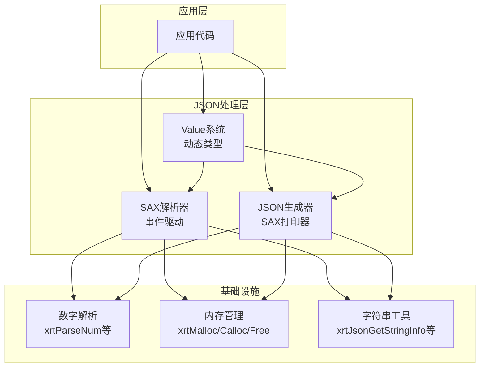
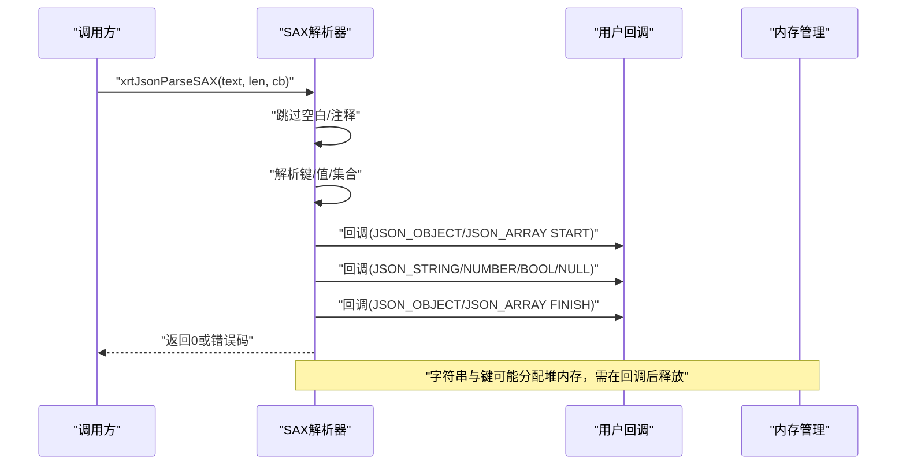
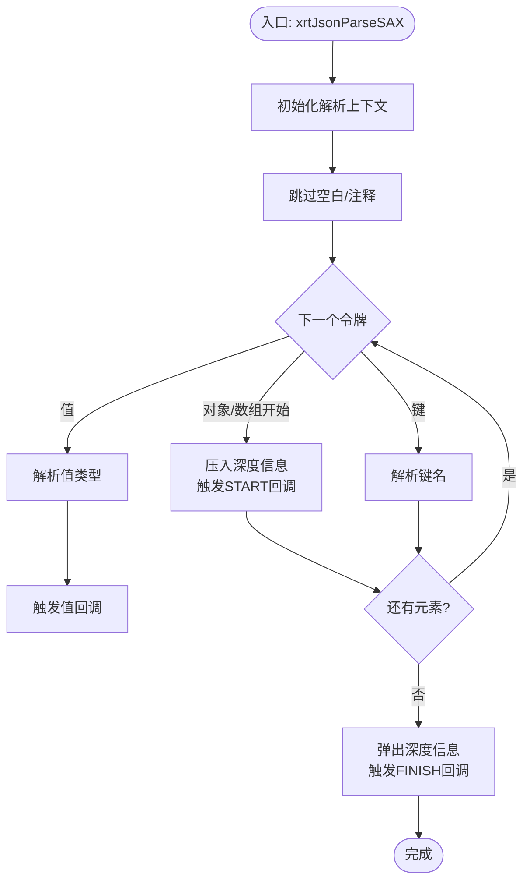
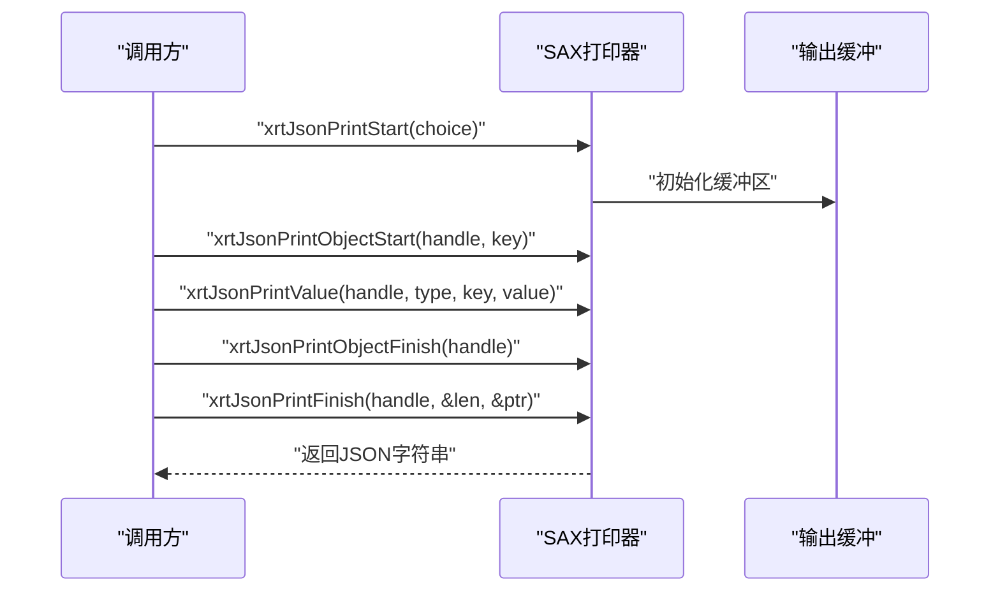
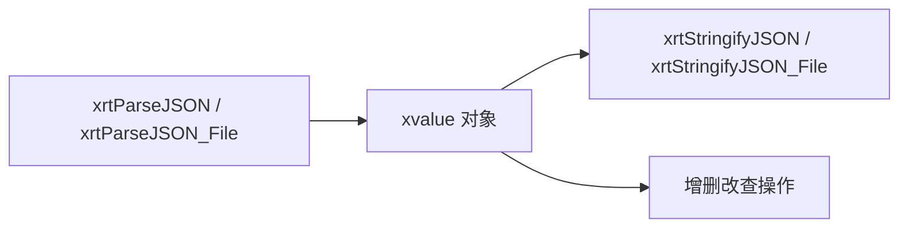
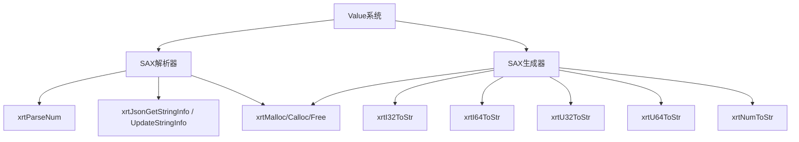

# JSON处理API

<cite>
**本文引用的文件**
- [lib/json.h](file://lib/json.h)
- [docs/api-json.md](file://docs/api-json.md)
- [xrt.h](file://xrt.h)
- [test/test_json.h](file://test/test_json.h)
</cite>

## 目录
1. [简介](#简介)
2. [项目结构](#项目结构)
3. [核心组件](#核心组件)
4. [架构总览](#架构总览)
5. [详细组件分析](#详细组件分析)
6. [依赖关系分析](#依赖关系分析)
7. [性能考量](#性能考量)
8. [故障排查指南](#故障排查指南)
9. [结论](#结论)
10. [附录](#附录)

## 简介
本文件面向使用者与开发者，系统性阐述本仓库中的JSON处理API，重点覆盖：
- SAX模式解析的优势与实现原理：事件驱动、无DOM开销、低内存占用、高吞吐
- JSON解析器API：解析函数、事件回调机制、错误处理
- JSON生成器API：数据序列化、格式化输出、性能优化
- 完整使用示例：复杂结构、嵌套对象与数组
- 性能对比分析、内存使用优化、错误诊断与调试技巧
- 与传统DOM解析方式的区别与优势

## 项目结构
JSON处理API位于库头文件与文档中，配合Value系统提供两种使用路径：
- 底层SAX API：适合高性能、流式处理、内存敏感场景
- Value系统：推荐日常使用，提供类JSON的数据结构与简单API

图表来源
- [lib/json.h](file://lib/json.h#L1557-L1596)
- [lib/json.h](file://lib/json.h#L562-L790)
- [lib/json.h](file://lib/json.h#L1823-L1860)
- [lib/json.h](file://lib/json.h#L1925-L1966)

章节来源
- [lib/json.h](file://lib/json.h#L1557-L1596)
- [lib/json.h](file://lib/json.h#L562-L790)
- [lib/json.h](file://lib/json.h#L1823-L1860)
- [lib/json.h](file://lib/json.h#L1925-L1966)

## 核心组件
- SAX解析器：事件驱动，逐令牌触发回调，避免构建完整DOM树
- SAX生成器：按事件顺序输出JSON，支持格式化与压缩
- Value系统：基于SAX解析与生成，提供更易用的动态类型API
- 错误处理：统一的错误打印宏，便于定位问题

章节来源
- [docs/api-json.md](file://docs/api-json.md#L82-L174)
- [docs/api-json.md](file://docs/api-json.md#L177-L297)
- [docs/api-json.md](file://docs/api-json.md#L301-L435)

## 架构总览
SAX解析与生成的核心流程如下：

图表来源
- [lib/json.h](file://lib/json.h#L1557-L1596)
- [lib/json.h](file://lib/json.h#L1383-L1537)

章节来源
- [lib/json.h](file://lib/json.h#L1557-L1596)
- [lib/json.h](file://lib/json.h#L1383-L1537)

## 详细组件分析

### SAX解析器（事件驱动，无DOM开销）
- 事件模型：遇到对象/数组开始与结束分别触发回调；遇到字符串、数字、布尔、null则传入对应值
- 状态机：维护深度数组，记录父级类型与键名，保证层级正确性
- 内存策略：字符串与键在必要时分配堆内存，解析完成后由上层释放
- 错误处理：统一错误打印宏，定位解析位置

图表来源
- [lib/json.h](file://lib/json.h#L1557-L1596)
- [lib/json.h](file://lib/json.h#L1383-L1537)

章节来源
- [lib/json.h](file://lib/json.h#L1557-L1596)
- [lib/json.h](file://lib/json.h#L1383-L1537)

### JSON生成器（SAX打印器）
- 启动/结束：先启动打印器，再按事件顺序输出，最后收尾获取结果
- 格式化控制：支持格式化输出与压缩输出，自动处理逗号、缩进、换行
- 性能优化：按项估算容量，动态扩容，减少realloc次数
- 辅助宏：提供数组/对象的开始与结束便捷宏

图表来源
- [lib/json.h](file://lib/json.h#L741-L790)
- [lib/json.h](file://lib/json.h#L562-L740)

章节来源
- [lib/json.h](file://lib/json.h#L741-L790)
- [lib/json.h](file://lib/json.h#L562-L740)

### Value系统（推荐日常使用）
- 解析：从字符串或文件解析为Value对象
- 序列化：将Value对象序列化为JSON字符串或写入文件
- 嵌套结构：支持对象与数组的嵌套访问与修改
- 示例：文档提供了完整的解析、修改、序列化与文件IO示例

图表来源
- [lib/json.h](file://lib/json.h#L1823-L1860)
- [lib/json.h](file://lib/json.h#L1925-L1966)
- [docs/api-json.md](file://docs/api-json.md#L301-L435)

章节来源
- [lib/json.h](file://lib/json.h#L1823-L1860)
- [lib/json.h](file://lib/json.h#L1925-L1966)
- [docs/api-json.md](file://docs/api-json.md#L301-L435)

## 依赖关系分析
- SAX解析器依赖：
  - 数字解析：xrtParseNum
  - 字符串工具：xrtJsonGetStringInfo、xrtJsonUpdateStringInfo
  - 内存管理：xrtMalloc/xrtCalloc/xrtFree
- SAX生成器依赖：
  - 数字转字符串：xrtI32ToStr/xrtI64ToStr/xrtU32ToStr/xrtU64ToStr/xrtNumToStr
  - 内存管理：同上
- Value系统：
  - 基于SAX解析与生成，封装为更易用的API

图表来源
- [lib/json.h](file://lib/json.h#L1557-L1596)
- [lib/json.h](file://lib/json.h#L562-L790)
- [lib/json.h](file://lib/json.h#L1823-L1860)
- [lib/json.h](file://lib/json.h#L1925-L1966)

章节来源
- [lib/json.h](file://lib/json.h#L1557-L1596)
- [lib/json.h](file://lib/json.h#L562-L790)
- [lib/json.h](file://lib/json.h#L1823-L1860)
- [lib/json.h](file://lib/json.h#L1925-L1966)

## 性能考量
- SAX模式优势
  - 事件驱动：边解析边回调，无需构建完整DOM树，内存占用低
  - 无DOM开销：避免对象图构建与遍历成本，吞吐更高
  - 适合大文件与流式场景：可分片解析，降低峰值内存
- 生成器优化
  - 预估容量：通过item_total、item_size、plus_size控制初始缓冲与扩容步长
  - 动态扩容：按需增长，减少realloc次数
  - 格式化与压缩：根据format_flag选择输出形态
- Value系统
  - 在易用性与性能之间折中，适合大多数业务场景
  - 复杂嵌套结构建议结合SAX生成器进行定制化输出

章节来源
- [docs/api-json.md](file://docs/api-json.md#L177-L297)
- [lib/json.h](file://lib/json.h#L507-L541)
- [lib/json.h](file://lib/json.h#L741-L790)

## 故障排查指南
- 错误打印
  - 使用统一错误宏，可在解析失败时打印上下文片段，便于定位问题
- 常见错误
  - 非法字符：检查输入是否包含标准JSON不支持的特殊字符
  - 未闭合对象/数组：确保所有{[都有对应的]}
  - 逗号规则：根据配置允许末尾逗号与否
  - 字符串转义：确保字符串内的转义序列合法
- 调试技巧
  - 使用Value系统先验证数据结构正确性
  - 分段解析：对超大JSON采用分块策略
  - 逐步缩小范围：定位到具体键或数组索引后再深入

章节来源
- [lib/json.h](file://lib/json.h#L142-L163)
- [lib/json.h](file://lib/json.h#L1557-L1596)
- [lib/json.h](file://lib/json.h#L1383-L1537)

## 结论
- SAX模式适合高性能、内存敏感、流式处理场景
- Value系统提供更易用的API，适合日常开发
- 两者互为补充：底层SAX用于极致性能，上层Value用于快速迭代
- 建议在生产环境中优先使用Value系统，仅在极端性能需求时采用SAX

## 附录

### API参考与示例路径
- SAX解析
  - 函数：xrtJsonParseSAX
  - 类型：json_sax_parser_t、json_sax_value_t、json_sax_cmd_t、json_sax_ret_t、json_sax_cb_t
  - 示例：参见文档中的回调示例与使用方法
- JSON生成
  - 函数：xrtJsonPrintStart、xrtJsonPrintValue、xrtJsonPrintFinish
  - 类型：json_print_choice_t、json_print_ptr_t
  - 示例：参见文档中的生成示例
- Value系统
  - 函数：xrtParseJSON、xrtParseJSON_File、xrtStringifyJSON、xrtStringifyJSON_File
  - 示例：参见文档中的解析、修改、序列化与文件IO示例

章节来源
- [docs/api-json.md](file://docs/api-json.md#L118-L174)
- [docs/api-json.md](file://docs/api-json.md#L199-L297)
- [docs/api-json.md](file://docs/api-json.md#L301-L435)