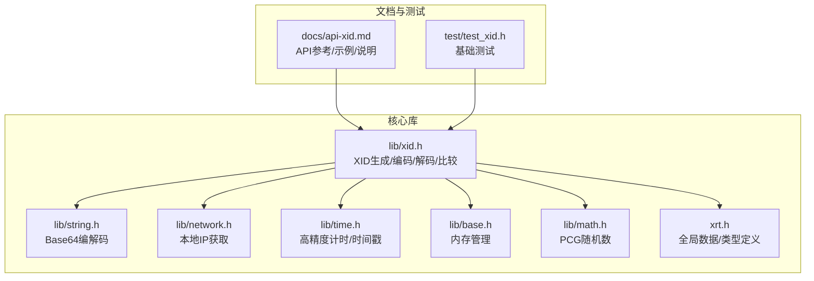
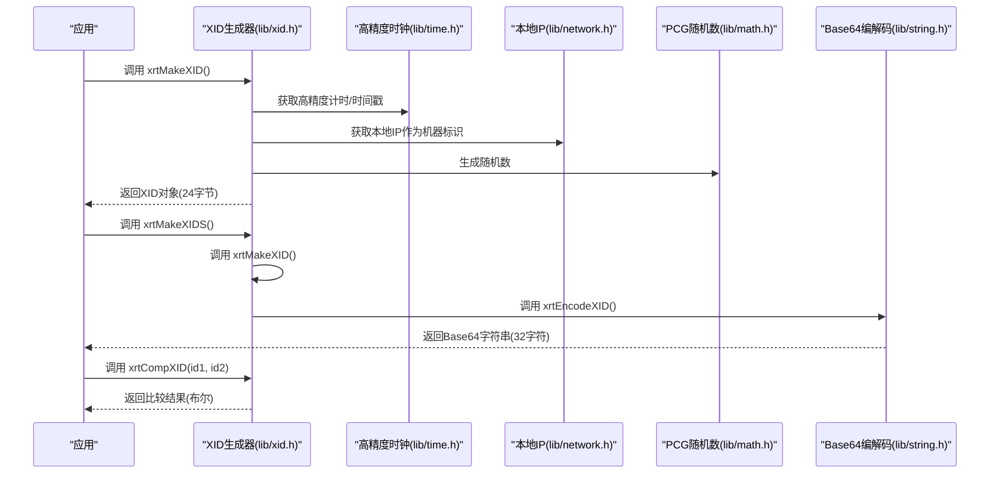
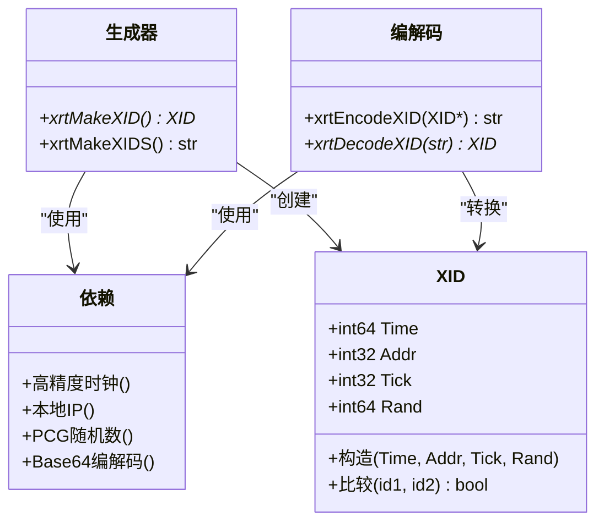
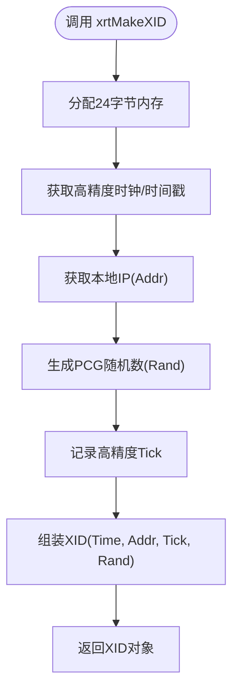
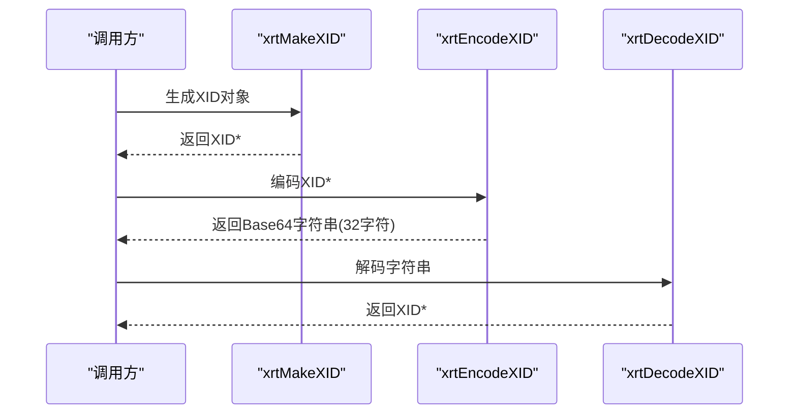
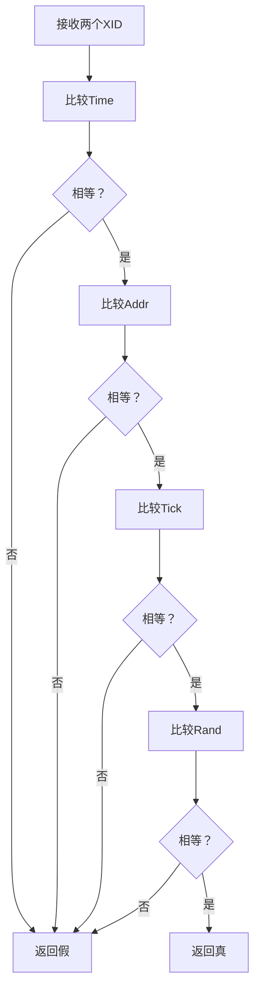
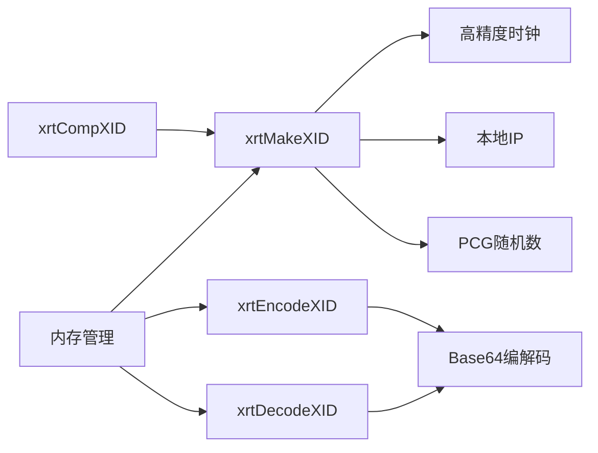

# 分布式ID生成API

<cite>
**本文引用的文件**
- [lib/xid.h](file://lib/xid.h)
- [docs/api-xid.md](file://docs/api-xid.md)
- [lib/string.h](file://lib/string.h)
- [lib/network.h](file://lib/network.h)
- [lib/time.h](file://lib/time.h)
- [lib/base.h](file://lib/base.h)
- [lib/math.h](file://lib/math.h)
- [xrt.h](file://xrt.h)
- [test/test_xid.h](file://test/test_xid.h)
</cite>

## 目录
1. [简介](#简介)
2. [项目结构](#项目结构)
3. [核心组件](#核心组件)
4. [架构总览](#架构总览)
5. [组件详解](#组件详解)
6. [依赖关系分析](#依赖关系分析)
7. [性能与排序特性](#性能与排序特性)
8. [故障排查指南](#故障排查指南)
9. [结论](#结论)
10. [附录](#附录)

## 简介
本文件面向分布式系统工程师与开发者，系统化阐述XID分布式唯一ID生成API的设计与实现。XID为192位（24字节）唯一ID，具备时间有序、机器标识、高并发安全与可解析性强等特性，适用于分布式数据库主键、分布式追踪ID、订单号、消息ID等场景。本文覆盖ID结构设计、生成流程、编码/解码、比较函数、排序与索引优化建议、使用示例、性能与对比分析以及最佳实践。

## 项目结构
围绕XID能力，相关源文件分布如下：
- 核心API与实现：lib/xid.h
- 文档与示例：docs/api-xid.md
- 字符串与Base64编解码：lib/string.h
- 网络与本地IP获取：lib/network.h
- 时间与时钟：lib/time.h
- 内存管理：lib/base.h
- 随机数（PCG）：lib/math.h
- 全局数据与类型：xrt.h
- 基础测试：test/test_xid.h

**图表来源**
- [lib/xid.h](file://lib/xid.h#L1-L75)
- [docs/api-xid.md](file://docs/api-xid.md#L1-L541)
- [lib/string.h](file://lib/string.h#L981-L1063)
- [lib/network.h](file://lib/network.h#L1-L200)
- [lib/time.h](file://lib/time.h#L1-L200)
- [lib/base.h](file://lib/base.h#L1-L132)
- [lib/math.h](file://lib/math.h#L1-L42)
- [xrt.h](file://xrt.h#L120-L185)
- [test/test_xid.h](file://test/test_xid.h#L1-L23)

**章节来源**
- [lib/xid.h](file://lib/xid.h#L1-L75)
- [docs/api-xid.md](file://docs/api-xid.md#L1-L541)
- [lib/string.h](file://lib/string.h#L981-L1063)
- [lib/network.h](file://lib/network.h#L1-L200)
- [lib/time.h](file://lib/time.h#L1-L200)
- [lib/base.h](file://lib/base.h#L1-L132)
- [lib/math.h](file://lib/math.h#L1-L42)
- [xrt.h](file://xrt.h#L120-L185)
- [test/test_xid.h](file://test/test_xid.h#L1-L23)

## 核心组件
- XID结构体：包含时间戳、机器标识、高精度计时器、随机数四部分，共192位。
- ID生成函数：xrtMakeXID、xrtMakeXIDS（便捷字符串版）。
- ID转换函数：xrtEncodeXID（对象→字符串）、xrtDecodeXID（字符串→对象）。
- ID比较函数：xrtCompXID（逐字段比较）。
- 依赖能力：高精度时钟、本地IP、PCG随机数、Base64编解码、内存管理。

**章节来源**
- [lib/xid.h](file://lib/xid.h#L24-L47)
- [docs/api-xid.md](file://docs/api-xid.md#L20-L62)
- [lib/string.h](file://lib/string.h#L981-L1063)
- [lib/network.h](file://lib/network.h#L39-L70)
- [lib/time.h](file://lib/time.h#L4-L22)
- [lib/math.h](file://lib/math.h#L1-L42)
- [lib/base.h](file://lib/base.h#L4-L45)

## 架构总览
XID生成的端到端流程如下：

**图表来源**
- [lib/xid.h](file://lib/xid.h#L20-L60)
- [lib/time.h](file://lib/time.h#L4-L22)
- [lib/network.h](file://lib/network.h#L39-L70)
- [lib/math.h](file://lib/math.h#L1-L42)
- [lib/string.h](file://lib/string.h#L981-L1063)

## 组件详解

### XID结构与组成
- 结构体字段与大小：
  - Time：64位时间戳（秒级），用于全局时间有序与排序。
  - Addr：32位本地IP（网络序），用于机器标识与溯源。
  - Tick：32位高精度计时器（纳秒/高分辨计数），用于同一秒内去重。
  - Rand：64位PCG随机数，用于进一步去重与熵增强。
- 总计192位（24字节），优于UUID（128位）的碰撞概率。
- 生成顺序：Time → Addr → Tick → Rand，天然具备时间有序性。

**图表来源**
- [lib/xid.h](file://lib/xid.h#L24-L47)
- [docs/api-xid.md](file://docs/api-xid.md#L20-L62)
- [lib/string.h](file://lib/string.h#L981-L1063)
- [lib/network.h](file://lib/network.h#L39-L70)
- [lib/time.h](file://lib/time.h#L4-L22)
- [lib/math.h](file://lib/math.h#L1-L42)

**章节来源**
- [docs/api-xid.md](file://docs/api-xid.md#L20-L62)
- [lib/xid.h](file://lib/xid.h#L24-L47)

### ID生成函数
- xrtMakeXID()
  - 作用：生成XID对象（24字节），需调用方释放。
  - 实现要点：采集高精度时钟、获取本地IP、生成随机数。
- xrtMakeXIDS()
  - 作用：一步生成Base64字符串（32字符），内部调用xrtMakeXID与xrtEncodeXID。
  - 适用：直接需要字符串ID的场景，避免中间对象。

**图表来源**
- [lib/xid.h](file://lib/xid.h#L20-L48)

**章节来源**
- [lib/xid.h](file://lib/xid.h#L20-L60)
- [docs/api-xid.md](file://docs/api-xid.md#L67-L160)

### ID转换函数
- xrtEncodeXID()
  - 输入：XID对象指针。
  - 输出：Base64编码字符串（32字符），使用自定义字符集，URL/文件名安全。
  - 释放：需调用方释放返回字符串。
- xrtDecodeXID()
  - 输入：32字符Base64字符串。
  - 输出：XID对象指针，需调用方释放。
  - 校验：输入长度必须为4的倍数，字符集合法。

**图表来源**
- [lib/xid.h](file://lib/xid.h#L4-L16)
- [lib/string.h](file://lib/string.h#L981-L1063)

**章节来源**
- [lib/xid.h](file://lib/xid.h#L4-L16)
- [docs/api-xid.md](file://docs/api-xid.md#L163-L266)

### ID比较函数
- xrtCompXID()
  - 逐字段比较：Time、Addr、Tick、Rand。
  - 仅当全部字段相等时返回真；否则返回假。
  - 用途：校验两个ID是否完全一致，或用于去重。

**图表来源**
- [lib/xid.h](file://lib/xid.h#L64-L72)

**章节来源**
- [lib/xid.h](file://lib/xid.h#L64-L72)
- [docs/api-xid.md](file://docs/api-xid.md#L269-L323)

### API参考清单
- xrtMakeXID()
  - 返回：XID对象指针（需释放）
  - 依赖：高精度时钟、本地IP、PCG随机数
- xrtMakeXIDS()
  - 返回：Base64字符串（32字符，需释放）
  - 依赖：xrtMakeXID、xrtEncodeXID
- xrtEncodeXID()
  - 输入：XID对象
  - 输出：Base64字符串（32字符）
- xrtDecodeXID()
  - 输入：Base64字符串（32字符）
  - 输出：XID对象
- xrtCompXID()
  - 输入：两个XID对象
  - 输出：布尔（是否完全相等）

**章节来源**
- [lib/xid.h](file://lib/xid.h#L4-L72)
- [docs/api-xid.md](file://docs/api-xid.md#L67-L323)

## 依赖关系分析
- 生成阶段依赖
  - 高精度时钟：Windows使用高性能计数器，Linux使用单调时钟。
  - 本地IP：通过网络模块获取，存储于全局结构中供XID使用。
  - PCG随机数：提供高质量、高速、长周期的随机数。
- 编解码依赖
  - Base64：自定义字符表，确保URL/文件名安全。
- 内存管理
  - 所有返回的字符串与对象均需调用方释放，遵循统一的内存管理API。

**图表来源**
- [lib/xid.h](file://lib/xid.h#L20-L48)
- [lib/time.h](file://lib/time.h#L4-L22)
- [lib/network.h](file://lib/network.h#L39-L70)
- [lib/math.h](file://lib/math.h#L1-L42)
- [lib/string.h](file://lib/string.h#L981-L1063)
- [lib/base.h](file://lib/base.h#L4-L45)

**章节来源**
- [lib/xid.h](file://lib/xid.h#L20-L48)
- [lib/time.h](file://lib/time.h#L4-L22)
- [lib/network.h](file://lib/network.h#L39-L70)
- [lib/math.h](file://lib/math.h#L1-L42)
- [lib/string.h](file://lib/string.h#L981-L1063)
- [lib/base.h](file://lib/base.h#L4-L45)

## 性能与排序特性

### 排序特性与数据库索引优化
- 时间有序性：Time字段为64位秒级时间戳，天然支持按时间排序。
- 唯一性保障：
  - 同一秒内通过Tick（高精度计时）与Rand（PCG随机数）消除冲突。
  - 机器标识Addr（本地IP）确保跨节点唯一。
- 索引建议：
  - MySQL/PostgreSQL：建议将Time作为前缀索引，或组合索引(Time, Addr, Tick)提升排序与过滤效率。
  - MongoDB：可建立复合索引，如 {Time: 1, Addr: 1, Tick: 1}。
  - 注意：由于Time占高位，按时间范围查询与分页友好；若频繁按Addr过滤，可在Addr上单独建立索引。

### 性能测试与基准
- 本仓库未提供XID专用的性能测试脚本。可基于以下思路自行评估：
  - 生成速率：循环调用xrtMakeXIDS，统计每秒生成数量。
  - 内存开销：持续生成并释放，观察内存峰值与碎片。
  - 编解码成本：对大量ID进行编码/解码，测量CPU占用。
- 参考实现思路（概念性，非仓库内容）：
  - 使用高精度计时器测量批量生成耗时。
  - 使用内存池减少频繁分配带来的开销。
  - 在多线程下评估PCG随机数的线程安全性（全局状态非线程安全，需谨慎使用）。

**章节来源**
- [docs/api-xid.md](file://docs/api-xid.md#L55-L62)
- [lib/xid.h](file://lib/xid.h#L20-L48)
- [lib/time.h](file://lib/time.h#L4-L22)
- [lib/math.h](file://lib/math.h#L1-L42)

## 故障排查指南
- 内存泄漏
  - 症状：持续运行后内存增长。
  - 排查：确认所有xrtMakeXID、xrtMakeXIDS、xrtEncodeXID返回值均已释放。
- IP未获取
  - 症状：Addr为0，ID仍可用但机器标识缺失。
  - 排查：检查网络初始化是否成功；在无网络环境或容器中可能出现此情况。
- Base64解码失败
  - 症状：xrtDecodeXID返回空或报错。
  - 排查：确认输入为32字符且字符集合法；长度需为4的倍数。
- 比较结果异常
  - 症状：两个语义相同的ID被判定不相等。
  - 排查：确认是否对同一对象进行比较；注意Tick与Rand的高精度差异。

**章节来源**
- [docs/api-xid.md](file://docs/api-xid.md#L465-L522)
- [lib/base.h](file://lib/base.h#L41-L45)
- [lib/string.h](file://lib/string.h#L1009-L1063)
- [lib/network.h](file://lib/network.h#L39-L70)

## 结论
XID以192位结构实现了高可靠、高有序性的分布式唯一ID生成，结合高精度时钟、本地IP与PCG随机数，满足分布式系统在可读性、可排序性与唯一性方面的综合需求。配合合理的数据库索引策略与内存管理规范，可在高并发场景稳定运行。建议在多网卡或容器环境中提前验证IP获取逻辑，并在多线程场景下谨慎使用全局随机数状态。

## 附录

### 使用示例（摘自官方文档）
- 生成并打印XID字段
- 生成字符串形式的XID
- 编码/解码互操作与一致性校验
- 比较两个XID是否相同
- 典型业务场景：订单号、分布式追踪ID、数据库主键、临时文件名

**章节来源**
- [docs/api-xid.md](file://docs/api-xid.md#L82-L390)

### 与其他ID方案对比（概念性说明）
- UUID v1/v6：含时间戳，但碰撞概率高于XID；字符串较长（128位）。
- Snowflake：时间戳+机器标识+序列号，序列号需中心化或协调，易产生热点。
- XID：时间戳+机器标识+高精度计时+随机数，无需中心协调，全局唯一且有序，适合高并发与分布式场景。

[本节为通用对比说明，不直接分析具体文件，故不附加“章节来源”]