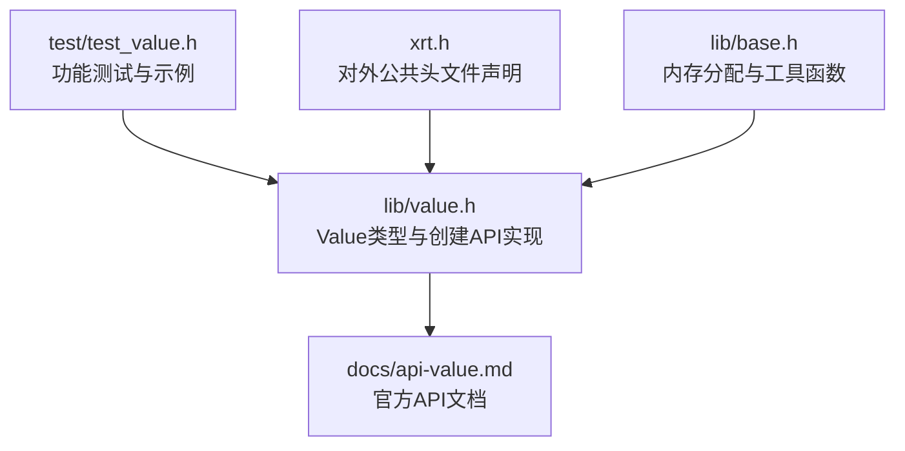
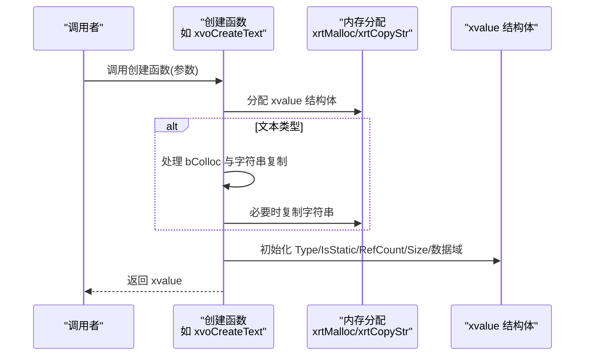
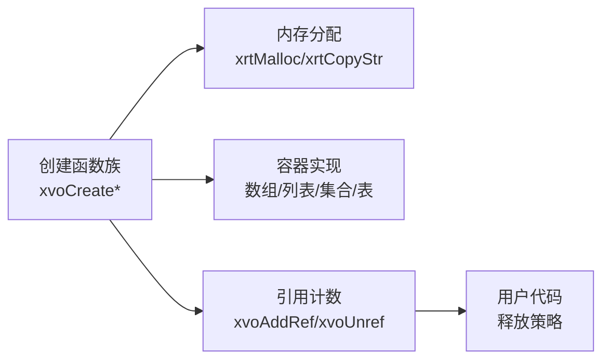

# 创建Value对象

<cite>
**本文档引用的文件**
- [lib/value.h](file://lib/value.h)
- [docs/api-value.md](file://docs/api-value.md)
- [test/test_value.h](file://test/test_value.h)
- [xrt.h](file://xrt.h)
- [lib/base.h](file://lib/base.h)
</cite>

## 目录
1. [简介](#简介)
2. [项目结构](#项目结构)
3. [核心组件](#核心组件)
4. [架构总览](#架构总览)
5. [详细组件分析](#详细组件分析)
6. [依赖关系分析](#依赖关系分析)
7. [性能考量](#性能考量)
8. [故障排查指南](#故障排查指南)
9. [结论](#结论)
10. [附录](#附录)

## 简介
本章节面向使用者与开发者，系统性介绍 Value 动态类型系统的“创建 Value 对象”能力，覆盖以下创建函数：
- xvoCreateNull
- xvoCreateBool
- xvoCreateInt
- xvoCreateFloat
- xvoCreateText
- xvoCreateTime
- xvoCreatePoint
- xvoCreateFunc
- xvoCreateArray
- xvoCreateList
- xvoCreateColl
- xvoCreateTable
- xvoCreateClass
- xvoCreateCustom

重点说明每个函数的参数、返回值、典型使用场景、注意事项，并深入解析 bColloc 参数的语义与最佳实践。同时提供完整示例路径，帮助快速上手。

## 项目结构
Value 对象创建API位于核心库中，文档与测试分别在 docs 与 test 目录下，便于查阅与验证。

图表来源
- [lib/value.h](file://lib/value.h#L101-L316)
- [docs/api-value.md](file://docs/api-value.md#L123-L358)
- [test/test_value.h](file://test/test_value.h#L1-L200)
- [xrt.h](file://xrt.h#L1955-L1966)

章节来源
- [lib/value.h](file://lib/value.h#L101-L316)
- [docs/api-value.md](file://docs/api-value.md#L123-L358)
- [test/test_value.h](file://test/test_value.h#L1-L200)
- [xrt.h](file://xrt.h#L1955-L1966)
- [lib/base.h](file://lib/base.h#L1-L132)

## 核心组件
- Value 类型系统：包含 16 种基础与复合类型，统一以 xvalue 结构体表示，内部含类型、引用计数、大小与联合体存储域。
- 创建函数族：针对每种类型提供创建接口，返回对应类型的 xvalue；部分类型返回静态单例（null/true/false）。
- 引用计数与释放：创建出的 Value 需要遵循“谁创建谁负责释放”的原则；容器类型在释放时会递归释放其子元素。
- bColloc 参数：控制容器写入子元素时的“托管策略”，决定是否增加引用计数或直接托管外部对象。

章节来源
- [lib/value.h](file://lib/value.h#L49-L74)
- [docs/api-value.md](file://docs/api-value.md#L78-L121)

## 架构总览
Value 对象创建API的调用流程如下：

图表来源
- [lib/value.h](file://lib/value.h#L137-L167)
- [lib/base.h](file://lib/base.h#L5-L13)

## 详细组件分析

### xvoCreateNull
- 作用：创建 null 类型的 Value。
- 原型：XXAPI xvalue xvoCreateNull();
- 返回值：静态单例（无需释放）。
- 使用场景：占位、默认值、条件分支中的空值表达。
- 注意事项：返回静态单例，不要调用释放函数。

章节来源
- [lib/value.h](file://lib/value.h#L101-L104)
- [docs/api-value.md](file://docs/api-value.md#L125-L138)

### xvoCreateBool
- 作用：创建布尔类型的 Value。
- 原型：XXAPI xvalue xvoCreateBool(bool bVal);
- 返回值：静态单例（true/false）。
- 使用场景：逻辑开关、条件判断。
- 注意事项：返回静态单例，无需释放。

章节来源
- [lib/value.h](file://lib/value.h#L105-L112)
- [docs/api-value.md](file://docs/api-value.md#L141-L151)

### xvoCreateInt
- 作用：创建整数类型的 Value。
- 原型：XXAPI xvalue xvoCreateInt(int64 iVal);
- 返回值：新分配的 xvalue；需调用释放函数。
- 使用场景：数值计算、计数、标识符。
- 注意事项：创建后必须释放；避免泄漏。

章节来源
- [lib/value.h](file://lib/value.h#L113-L124)
- [docs/api-value.md](file://docs/api-value.md#L154-L164)

### xvoCreateFloat
- 作用：创建浮点数类型的 Value。
- 原型：XXAPI xvalue xvoCreateFloat(double fVal);
- 返回值：新分配的 xvalue；需调用释放函数。
- 使用场景：科学计算、比例、精度需求。
- 注意事项：创建后必须释放；注意精度损失。

章节来源
- [lib/value.h](file://lib/value.h#L125-L136)
- [docs/api-value.md](file://docs/api-value.md#L167-L176)

### xvoCreateText
- 作用：创建文本类型的 Value。
- 原型：XXAPI xvalue xvoCreateText(ptr sVal, uint32 iSize, bool bColloc);
- 参数：
  - sVal：字符串指针；可为 NULL。
  - iSize：字符串长度；0 表示自动计算。
  - bColloc：托管模式。
    - TRUE：直接托管字符串指针，不复制，释放时不释放字符串。
    - FALSE：复制字符串内容，释放时释放复制的字符串。
- 返回值：新分配的 xvalue；需调用释放函数。
- 使用场景：日志、配置、消息传递。
- 注意事项：谨慎选择 bColloc，避免悬挂指针或重复释放；NULL 输入会被规范化为空字符串。

章节来源
- [lib/value.h](file://lib/value.h#L137-L167)
- [docs/api-value.md](file://docs/api-value.md#L178-L206)

### xvoCreateTime
- 作用：创建时间类型的 Value。
- 原型：XXAPI xvalue xvoCreateTime(xtime tVal);
- 返回值：新分配的 xvalue；需调用释放函数。
- 使用场景：时间戳、定时任务、日志时间。
- 注意事项：创建后必须释放。

章节来源
- [lib/value.h](file://lib/value.h#L168-L179)
- [docs/api-value.md](file://docs/api-value.md#L209-L217)

### xvoCreateTimeSerial
- 作用：通过年月日时分秒创建时间类型的 Value。
- 原型：XXAPI xvalue xvoCreateTimeSerial(int64 iYear, int iMonth, int iDay, int iHour, int iMinute, int iSecond);
- 返回值：新分配的 xvalue；需调用释放函数。
- 使用场景：构造特定时间点。
- 注意事项：创建后必须释放。

章节来源
- [lib/value.h](file://lib/value.h#L180-L191)
- [docs/api-value.md](file://docs/api-value.md#L220-L234)

### xvoCreatePoint
- 作用：创建指针类型的 Value。
- 原型：XXAPI xvalue xvoCreatePoint(ptr point);
- 返回值：新分配的 xvalue；需调用释放函数。
- 使用场景：存储裸指针、句柄包装。
- 注意事项：创建后必须释放；确保指针生命周期安全。

章节来源
- [lib/value.h](file://lib/value.h#L192-L203)
- [docs/api-value.md](file://docs/api-value.md#L238-L246)

### xvoCreateFunc
- 作用：创建函数引用类型的 Value。
- 原型：XXAPI xvalue xvoCreateFunc(xfunction pFunc);
- 返回值：新分配的 xvalue；需调用释放函数。
- 使用场景：回调机制、函数表、插件接口。
- 注意事项：创建后必须释放；确保函数签名匹配。

章节来源
- [lib/value.h](file://lib/value.h#L204-L215)
- [docs/api-value.md](file://docs/api-value.md#L249-L259)

### xvoCreateArray
- 作用：创建空数组类型的 Value。
- 原型：XXAPI xvalue xvoCreateArray();
- 返回值：新分配的 xvalue；需调用释放函数。
- 使用场景：动态序列、列表容器。
- 注意事项：创建后必须释放；数组元素的 bColloc 影响引用计数策略。

章节来源
- [lib/value.h](file://lib/value.h#L216-L232)
- [docs/api-value.md](file://docs/api-value.md#L262-L272)

### xvoCreateList
- 作用：创建空列表类型的 Value。
- 原型：XXAPI xvalue xvoCreateList();
- 返回值：新分配的 xvalue；需调用释放函数。
- 使用场景：稀疏索引、键值映射。
- 注意事项：创建后必须释放；列表元素的 bColloc 影响引用计数策略。

章节来源
- [lib/value.h](file://lib/value.h#L233-L249)
- [docs/api-value.md](file://docs/api-value.md#L275-L285)

### xvoCreateColl
- 作用：创建空集合类型的 Value。
- 原型：XXAPI xvalue xvoCreateColl();
- 返回值：新分配的 xvalue；需调用释放函数。
- 使用场景：去重集合、排序集合。
- 注意事项：创建后必须释放；集合元素的 bColloc 影响引用计数策略。

章节来源
- [lib/value.h](file://lib/value.h#L250-L267)
- [docs/api-value.md](file://docs/api-value.md#L288-L298)

### xvoCreateTable
- 作用：创建空表（字典）类型的 Value。
- 原型：XXAPI xvalue xvoCreateTable();
- 返回值：新分配的 xvalue；需调用释放函数。
- 使用场景：键值存储、配置项、映射。
- 注意事项：创建后必须释放；表元素的 bColloc 影响引用计数策略。

章节来源
- [lib/value.h](file://lib/value.h#L268-L284)
- [docs/api-value.md](file://docs/api-value.md#L301-L311)

### xvoCreateClass
- 作用：创建类容器（结构体容器）类型的 Value。
- 原型：XXAPI xvalue xvoCreateClass(uint32 iSize);
- 参数：iSize 为结构体大小（字节），不可为 0。
- 返回值：成功返回 xvalue，失败返回 NULL。
- 使用场景：封装自定义结构体数据。
- 注意事项：创建后必须释放；通过获取函数访问内部结构体指针。

章节来源
- [lib/value.h](file://lib/value.h#L285-L304)
- [docs/api-value.md](file://docs/api-value.md#L314-L345)

### xvoCreateCustom
- 作用：创建自定义类型的 Value。
- 原型：XXAPI xvalue xvoCreateCustom(ptr pObj);
- 返回值：新分配的 xvalue；需调用释放函数。
- 使用场景：第三方对象包装、扩展类型。
- 注意事项：创建后必须释放；pObj 生命周期由调用者保证。

章节来源
- [lib/value.h](file://lib/value.h#L305-L316)
- [docs/api-value.md](file://docs/api-value.md#L349-L358)

### bColloc 参数详解与最佳实践
- 语义：控制容器写入子元素时的“托管策略”。
  - TRUE：直接托管外部对象，不增加引用计数；适合“移交所有权”的场景。
  - FALSE：复制/接管对象并增加引用计数；适合“共享所有权”的场景。
- 典型用法：
  - 容器写入宏通常默认 bColloc=TRUE，例如数组追加、列表设置、集合添加、表设置等。
  - 若希望将已创建的 Value 纳入容器并保持其独立生命周期，应传入 bColloc=FALSE。
- 性能建议：
  - 常量字符串使用托管模式（bColloc=TRUE）可避免复制开销。
  - 预分配容器容量可降低扩容成本。
- 风险提示：
  - 不当的 bColloc 会导致悬挂指针或重复释放。
  - 避免循环引用，容器释放时会递归释放子元素。

章节来源
- [docs/api-value.md](file://docs/api-value.md#L194-L197)
- [docs/api-value.md](file://docs/api-value.md#L595-L611)
- [docs/api-value.md](file://docs/api-value.md#L739-L745)
- [docs/api-value.md](file://docs/api-value.md#L800-L811)
- [docs/api-value.md](file://docs/api-value.md#L935-L951)
- [docs/api-value.md](file://docs/api-value.md#L1166-L1218)

## 依赖关系分析
- 创建函数依赖内存分配器（xrtMalloc/xrtCopyStr）与底层容器实现（数组/列表/集合/表）。
- 引用计数管理贯穿整个 Value 生命周期，释放函数会根据类型进行递归清理。
- bColloc 在容器写入路径中影响引用计数与所有权模型。

图表来源
- [lib/value.h](file://lib/value.h#L115-L164)
- [lib/base.h](file://lib/base.h#L5-L13)
- [docs/api-value.md](file://docs/api-value.md#L78-L121)

章节来源
- [lib/value.h](file://lib/value.h#L33-L96)
- [lib/base.h](file://lib/base.h#L5-L13)
- [docs/api-value.md](file://docs/api-value.md#L78-L121)

## 性能考量
- 静态单例：null/true/false 使用静态单例，避免分配与释放开销。
- 文本托管：常量字符串采用托管模式（bColloc=TRUE）可避免复制。
- 预分配：容器写入前预估容量，减少扩容次数。
- 引用计数：合理使用 bColloc，避免不必要的引用计数增减。

章节来源
- [docs/api-value.md](file://docs/api-value.md#L137-L138)
- [docs/api-value.md](file://docs/api-value.md#L194-L197)
- [docs/api-value.md](file://docs/api-value.md#L1202-L1218)

## 故障排查指南
- 内存泄漏：未调用释放函数或错误地忽略静态单例。
- 悬挂指针：bColloc=TRUE 时托管了外部字符串或对象，后续释放造成悬挂。
- 重复释放：对同一对象多次释放。
- 循环引用：容器之间互相持有引用导致无法释放。
- 类型不匹配：将非容器类型误当作容器处理。

章节来源
- [docs/api-value.md](file://docs/api-value.md#L1166-L1218)

## 结论
Value 对象创建API提供了统一、灵活且高性能的动态类型支持。理解每种创建函数的语义、返回值与释放规则，以及 bColloc 的托管策略，是正确使用该API的关键。结合官方文档与测试用例，可快速构建健壮的数据结构与业务逻辑。

## 附录
- 示例路径（参考测试文件）：
  - [Null/Bool/Int/Float/Text/Time/Point/Func 示例](file://test/test_value.h#L29-L134)
  - [Array/Insert/Set 示例](file://test/test_value.h#L138-L177)
  - [List/设置示例](file://test/test_value.h#L183-L198)
  - [Coll/设置示例](file://test/test_value.h#L204-L221)
  - [Table/设置示例](file://test/test_value.h#L225-L240)
- API声明（参考公共头文件）：
  - [创建函数声明](file://xrt.h#L1955-L1966)