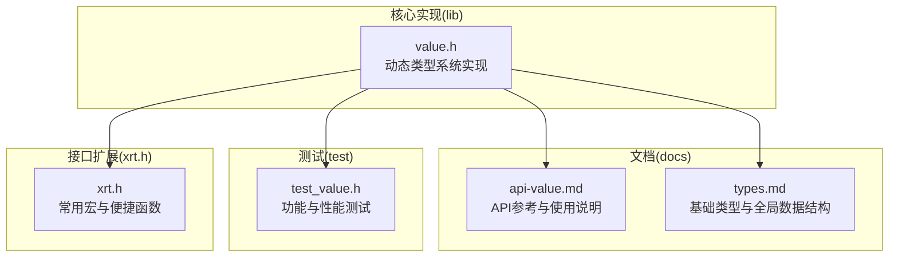
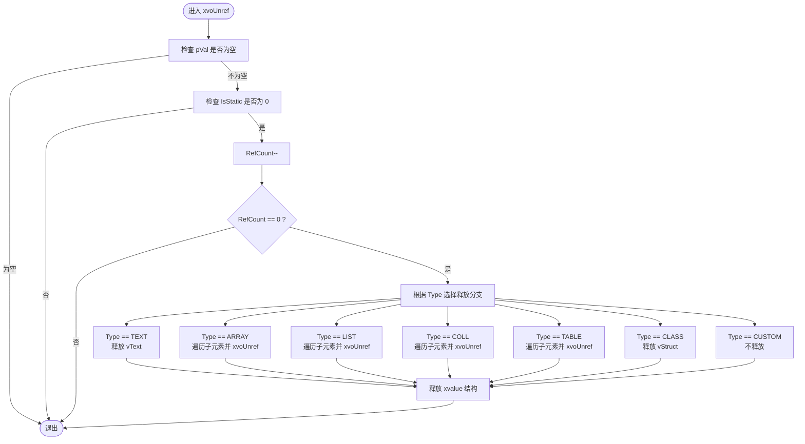
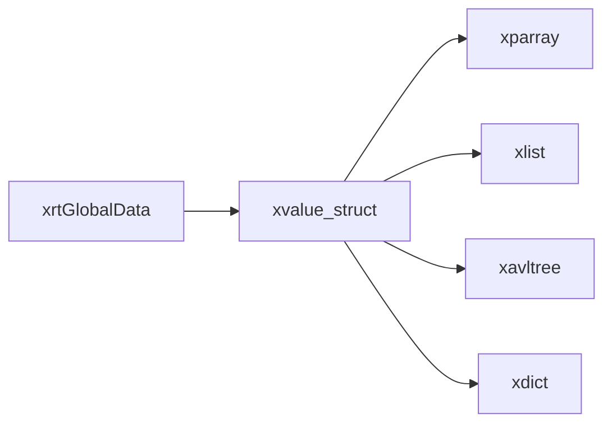

# 动态类型系统API

<cite>
**本文档引用的文件**
- [lib/value.h](file://lib/value.h)
- [docs/api-value.md](file://docs/api-value.md)
- [docs/types.md](file://docs/types.md)
- [test/test_value.h](file://test/test_value.h)
- [xrt.h](file://xrt.h)
</cite>

## 目录
1. [简介](#简介)
2. [项目结构](#项目结构)
3. [核心组件](#核心组件)
4. [架构总览](#架构总览)
5. [详细组件分析](#详细组件分析)
6. [依赖关系分析](#依赖关系分析)
7. [性能考量](#性能考量)
8. [故障排查指南](#故障排查指南)
9. [结论](#结论)
10. [附录](#附录)

## 简介
本文件系统化梳理动态类型系统API，覆盖16种数据类型定义与使用、引用计数机制（26位引用计数，最大67108863）、静态值优化、内存管理策略，并提供完整的API参考、容器操作、使用示例与最佳实践。目标读者既包括需要快速上手的开发者，也包括希望深入理解实现细节的高级用户。

## 项目结构
动态类型系统位于lib/value.h，配套文档在docs/api-value.md，类型定义与全局数据结构在docs/types.md，测试用例在test/test_value.h，部分宏扩展在xrt.h中。

图表来源
- [lib/value.h](file://lib/value.h#L1-L1640)
- [docs/api-value.md](file://docs/api-value.md#L1-L1238)
- [docs/types.md](file://docs/types.md#L1-L725)
- [test/test_value.h](file://test/test_value.h#L1-L1004)
- [xrt.h](file://xrt.h#L2000-L2150)

章节来源
- [lib/value.h](file://lib/value.h#L1-L1640)
- [docs/api-value.md](file://docs/api-value.md#L1-L1238)
- [docs/types.md](file://docs/types.md#L1-L725)
- [test/test_value.h](file://test/test_value.h#L1-L1004)
- [xrt.h](file://xrt.h#L2000-L2150)

## 核心组件
- 动态类型系统主体：xvalue结构与16种数据类型常量、创建/读取/类型判断/容器操作API
- 引用计数与内存管理：xvoAddRef/xvoUnref、静态值优化、容器递归释放
- 容器实现：数组(xparray)、列表(xlist)、集合(xavltree)、表(xdict)
- 辅助工具：浅拷贝/深拷贝、打印调试、类型转换

章节来源
- [lib/value.h](file://lib/value.h#L1-L1640)
- [docs/api-value.md](file://docs/api-value.md#L1-L1238)

## 架构总览
动态类型系统围绕xvalue结构展开，统一管理类型、大小、引用计数与数据联合体；容器类型在销毁时递归释放子元素；静态值（NULL/TRUE/FALSE）避免频繁分配与释放。

```mermaid
classDiagram
class xvalue_struct {
+uint32 Type
+uint32 Reserve
+uint32 IsStatic
+uint32 RefCount
+uint32 Size
+union v
}
class xvalue {
<<typedef xvalue_struct*>>
}
class xfunction {
<<typedef xvalue(*)(xvalue, xvalue)>>
}
class xvoAddRef {
+void xvoAddRef(xvalue)
}
class xvoUnref {
+void xvoUnref(xvalue)
}
class xvoCreateNull
class xvoCreateBool
class xvoCreateInt
class xvoCreateFloat
class xvoCreateText
class xvoCreateTime
class xvoCreatePoint
class xvoCreateFunc
class xvoCreateArray
class xvoCreateList
class xvoCreateColl
class xvoCreateTable
class xvoCreateClass
class xvoCreateCustom
class xvoGetBool
class xvoGetInt
class xvoGetFloat
class xvoGetText
class xvoGetTime
class xvoGetPoint
class xvoGetFunc
class xvoGetArray
class xvoGetList
class xvoGetColl
class xvoGetTable
class xvoGetClass
class xvoGetCustom
class xvoArrayGetValue
class xvoListGetValue
class xvoTableGetValue
xvalue --> xvoAddRef : "使用"
xvalue --> xvoUnref : "使用"
xvalue --> xvoCreateNull : "创建"
xvalue --> xvoCreateBool : "创建"
xvalue --> xvoCreateInt : "创建"
xvalue --> xvoCreateFloat : "创建"
xvalue --> xvoCreateText : "创建"
xvalue --> xvoCreateTime : "创建"
xvalue --> xvoCreatePoint : "创建"
xvalue --> xvoCreateFunc : "创建"
xvalue --> xvoCreateArray : "创建"
xvalue --> xvoCreateList : "创建"
xvalue --> xvoCreateColl : "创建"
xvalue --> xvoCreateTable : "创建"
xvalue --> xvoCreateClass : "创建"
xvalue --> xvoCreateCustom : "创建"
xvalue --> xvoGetBool : "读取"
xvalue --> xvoGetInt : "读取"
xvalue --> xvoGetFloat : "读取"
xvalue --> xvoGetText : "读取"
xvalue --> xvoGetTime : "读取"
xvalue --> xvoGetPoint : "读取"
xvalue --> xvoGetFunc : "读取"
xvalue --> xvoGetArray : "读取"
xvalue --> xvoGetList : "读取"
xvalue --> xvoGetColl : "读取"
xvalue --> xvoGetTable : "读取"
xvalue --> xvoGetClass : "读取"
xvalue --> xvoGetCustom : "读取"
xvalue --> xvoArrayGetValue : "容器读取"
xvalue --> xvoListGetValue : "容器读取"
xvalue --> xvoTableGetValue : "容器读取"
```

图表来源
- [lib/value.h](file://lib/value.h#L49-L74)
- [lib/value.h](file://lib/value.h#L101-L316)
- [lib/value.h](file://lib/value.h#L321-L517)
- [lib/value.h](file://lib/value.h#L522-L700)
- [lib/value.h](file://lib/value.h#L704-L857)
- [lib/value.h](file://lib/value.h#L1114-L1286)

章节来源
- [lib/value.h](file://lib/value.h#L1-L1640)

## 详细组件分析

### 数据类型系统与静态值优化
- 16种数据类型常量：XVO_DT_NULL、XVO_DT_BOOL、XVO_DT_INT、XVO_DT_FLOAT、XVO_DT_TEXT、XVO_DT_TIME、XVO_DT_POINT、XVO_DT_FUNC、XVO_DT_ARRAY、XVO_DT_LIST、XVO_DT_COLL、XVO_DT_TABLE、XVO_DT_CLASS、XVO_DT_CUSTOM
- 静态值优化：NULL/TRUE/FALSE使用静态单例，无需释放；创建函数返回静态单例，提升性能并减少碎片
- xvalue结构字段：
  - Type（4位）：类型标识
  - Reserve（1位）：保留位
  - IsStatic（1位）：是否静态值
  - RefCount（26位）：引用计数，最大值为0x3FFFFFF（67108863）
  - Size：数据大小
  - v：联合体，按类型存放具体值或指针

章节来源
- [docs/api-value.md](file://docs/api-value.md#L25-L74)
- [lib/value.h](file://lib/value.h#L4-L28)
- [lib/value.h](file://lib/value.h#L49-L74)

### 引用计数机制与内存管理
- 引用计数操作
  - xvoAddRef：引用计数+1；当达到最大值时自动转为静态值
  - xvoUnref：引用计数-1；计数为0且非静态时自动释放；容器类型递归释放子元素
- 静态值与托管模式
  - 静态值（IsStatic=1）不参与释放流程
  - 字符串托管模式（bColloc）决定是否复制字符串内容
- 容器递归释放
  - TEXT：释放字符串指针
  - ARRAY：遍历子元素并逐个Unref
  - LIST：遍历并逐个Unref
  - COLL：遍历并逐个Unref
  - TABLE：遍历并逐个Unref
  - CLASS：释放结构体数据
  - CUSTOM：保留位，不释放

图表来源
- [lib/value.h](file://lib/value.h#L59-L96)
- [lib/value.h](file://lib/value.h#L67-L87)

章节来源
- [lib/value.h](file://lib/value.h#L33-L43)
- [lib/value.h](file://lib/value.h#L59-L96)

### 创建函数（16种类型）
- NULL/BOOL：xvoCreateNull、xvoCreateBool（返回静态单例）
- 数值：xvoCreateInt、xvoCreateFloat
- 文本：xvoCreateText（支持托管模式）
- 时间：xvoCreateTime、xvoCreateTimeSerial
- 指针/函数：xvoCreatePoint、xvoCreateFunc
- 容器：xvoCreateArray、xvoCreateList、xvoCreateColl、xvoCreateTable、xvoCreateClass、xvoCreateCustom

章节来源
- [lib/value.h](file://lib/value.h#L101-L316)
- [docs/api-value.md](file://docs/api-value.md#L123-L358)

### 读取函数（16种类型）
- 基础类型：xvoGetBool、xvoGetInt、xvoGetFloat、xvoGetText、xvoGetTime、xvoGetPoint、xvoGetFunc
- 容器类型：xvoGetArray、xvoGetList、xvoGetColl、xvoGetTable、xvoGetClass、xvoGetCustom
- 类型转换：不同类型的自动转换规则（如INT/BOOL/TEXT到BOOL，INT/FLOAT/TEXT到INT/Float）

章节来源
- [lib/value.h](file://lib/value.h#L321-L517)
- [docs/api-value.md](file://docs/api-value.md#L360-L468)

### 类型判断与元信息
- xvoIsNull：判断是否为NULL
- xvoType：获取类型常量
- xvoGetSize：获取数据大小（TEXT返回长度，CLASS返回结构体大小）

章节来源
- [lib/value.h](file://lib/value.h#L1291-L1320)
- [docs/api-value.md](file://docs/api-value.md#L472-L523)

### 容器操作（数组/列表/集合/表）
- 数组（ARRAY）
  - 读取：xvoArrayGetValue
  - 写入：xvoArrayAppendValue、xvoArrayInsertValue、xvoArraySetValue
  - 合并：xvoArrayMerge
  - 交换/删除/清空/预分配/排序：xvoArraySwap、xvoArrayRemove、xvoArrayClear、xvoArrayAlloc、xvoArraySort
  - 元素数量：xvoArrayItemCount
- 列表（LIST）
  - 读取：xvoListGetValue
  - 写入：xvoListSetValue
  - 合并：xvoListMerge（支持覆盖与跳过两种策略）
  - 存在性/删除/清空/数量/设置父列表：xvoListExists、xvoListRemove、xvoListClear、xvoListItemCount、xvoListSetParent
- 集合（COLL）
  - 写入：xvoCollSetValue
  - 运算：差集、对称差集、交集、并集、合并
  - 存在性/删除/清空/数量/设置父集合：xvoCollExists、xvoCollRemove、xvoCollClear、xvoCollItemCount、xvoCollSetParent
- 表（TABLE）
  - 读取：xvoTableGetValue
  - 写入：xvoTableSetValue
  - 合并：xvoTableMerge（支持覆盖与跳过两种策略）
  - 存在性/删除/清空/数量/设置父表：xvoTableExists、xvoTableRemove、xvoTableClear、xvoTableItemCount、xvoTableSetParent

章节来源
- [lib/value.h](file://lib/value.h#L522-L700)
- [lib/value.h](file://lib/value.h#L704-L857)
- [lib/value.h](file://lib/value.h#L861-L1035)
- [lib/value.h](file://lib/value.h#L1114-L1286)
- [docs/api-value.md](file://docs/api-value.md#L541-L997)

### 拷贝与调试
- 拷贝：xvoCopy（浅拷贝）、xvoDeepCopy（深拷贝）
- 调试：xvoPrintValue（递归打印结构与值）

章节来源
- [lib/value.h](file://lib/value.h#L1370-L1498)
- [lib/value.h](file://lib/value.h#L1518-L1599)
- [docs/api-value.md](file://docs/api-value.md#L1001-L1090)

### 使用示例与最佳实践
- JSON风格数据：嵌套数组/表，键值访问
- 配置系统：表存储配置项，读取转换
- 动态容器：结构体成员可存储任意类型，注意引用计数管理
- 最佳实践：托管模式用于常量字符串；预分配容量减少扩容成本；避免循环引用；正确释放

章节来源
- [docs/api-value.md](file://docs/api-value.md#L1094-L1218)
- [test/test_value.h](file://test/test_value.h#L14-L262)

## 依赖关系分析
- xvalue结构依赖底层容器实现（xparray、xlist、xavltree、xdict）
- 容器操作依赖底层库提供的遍历、插入、删除、计数等函数
- 全局数据结构xrtGlobalData提供临时内存与错误处理等基础设施

图表来源
- [lib/value.h](file://lib/value.h#L220-L282)
- [docs/types.md](file://docs/types.md#L286-L328)

章节来源
- [lib/value.h](file://lib/value.h#L1-L1640)
- [docs/types.md](file://docs/types.md#L286-L328)

## 性能考量
- 静态值优化：NULL/TRUE/FALSE使用静态单例，避免分配与释放开销
- 引用计数上限：26位引用计数，最大67108863，超过阈值自动转为静态值，降低频繁分配成本
- 托管模式：字符串托管（bColloc=TRUE）避免复制，适合常量字符串
- 预分配：数组预分配容量减少多次扩容带来的内存与拷贝成本
- 递归释放：容器类型在销毁时自动释放子元素，避免遗漏释放

章节来源
- [docs/api-value.md](file://docs/api-value.md#L1166-L1218)
- [lib/value.h](file://lib/value.h#L33-L43)
- [lib/value.h](file://lib/value.h#L131-L135)

## 故障排查指南
- 常见问题
  - 忘记释放：确保每次创建的非静态值最终调用xvoUnref
  - 循环引用：避免容器相互引用导致无法释放
  - 错误类型：容器操作要求正确的类型（如List合并只接受List）
  - 空指针：API对空参数有保护，但调用者仍需保证传入的xvalue类型正确
- 调试技巧
  - 使用xvoPrintValue递归打印结构，定位问题
  - 检查xvoType与xvoGetSize确认数据类型与大小
  - 使用xvoCopy/xvoDeepCopy验证共享与独立性

章节来源
- [lib/value.h](file://lib/value.h#L1518-L1599)
- [test/test_value.h](file://test/test_value.h#L267-L564)

## 结论
动态类型系统通过统一的xvalue结构与16种数据类型，结合26位引用计数与静态值优化，在保证易用性的同时兼顾性能。容器操作完善、内存管理自动化，配合丰富的API与测试用例，能够满足复杂数据建模与运行时类型转换需求。遵循最佳实践（托管模式、预分配、避免循环引用）可进一步提升稳定性与性能。

## 附录

### API参考速查
- 创建函数
  - xvoCreateNull、xvoCreateBool、xvoCreateInt、xvoCreateFloat、xvoCreateText、xvoCreateTime、xvoCreateTimeSerial、xvoCreatePoint、xvoCreateFunc、xvoCreateArray、xvoCreateList、xvoCreateColl、xvoCreateTable、xvoCreateClass、xvoCreateCustom
- 读取函数
  - xvoGetBool、xvoGetInt、xvoGetFloat、xvoGetText、xvoGetTime、xvoGetPoint、xvoGetFunc、xvoGetArray、xvoGetList、xvoGetColl、xvoGetTable、xvoGetClass、xvoGetCustom
- 类型判断
  - xvoIsNull、xvoType、xvoGetSize
- 容器操作
  - 数组：xvoArrayGetValue、xvoArrayAppendValue、xvoArrayInsertValue、xvoArraySetValue、xvoArrayMerge、xvoArraySwap、xvoArrayRemove、xvoArrayItemCount、xvoArrayClear、xvoArrayAlloc、xvoArraySort
  - 列表：xvoListGetValue、xvoListSetValue、xvoListMerge、xvoListExists、xvoListRemove、xvoListItemCount、xvoListClear、xvoListSetParent
  - 集合：xvoCollSetValue、xvoCollDifference、xvoCollSymmetricDifference、xvoCollIntersection、xvoCollUnion、xvoCollMerge、xvoCollExists、xvoCollRemove、xvoCollItemCount、xvoCollClear、xvoCollSetParent
  - 表：xvoTableGetValue、xvoTableSetValue、xvoTableMerge、xvoTableExists、xvoTableRemove、xvoTableItemCount、xvoTableClear、xvoTableSetParent
- 拷贝与调试
  - xvoCopy、xvoDeepCopy、xvoPrintValue

章节来源
- [lib/value.h](file://lib/value.h#L101-L316)
- [lib/value.h](file://lib/value.h#L321-L517)
- [lib/value.h](file://lib/value.h#L522-L700)
- [lib/value.h](file://lib/value.h#L704-L857)
- [lib/value.h](file://lib/value.h#L861-L1035)
- [lib/value.h](file://lib/value.h#L1114-L1286)
- [lib/value.h](file://lib/value.h#L1370-L1498)
- [lib/value.h](file://lib/value.h#L1518-L1599)