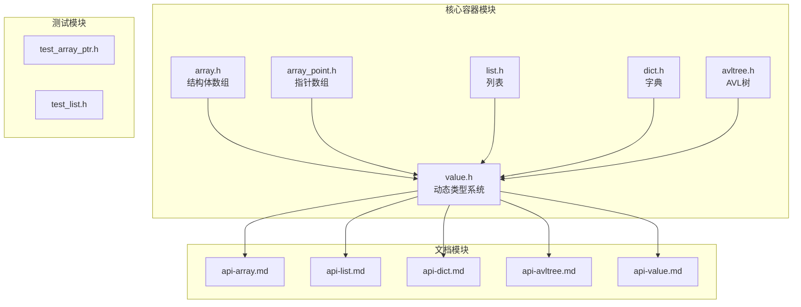
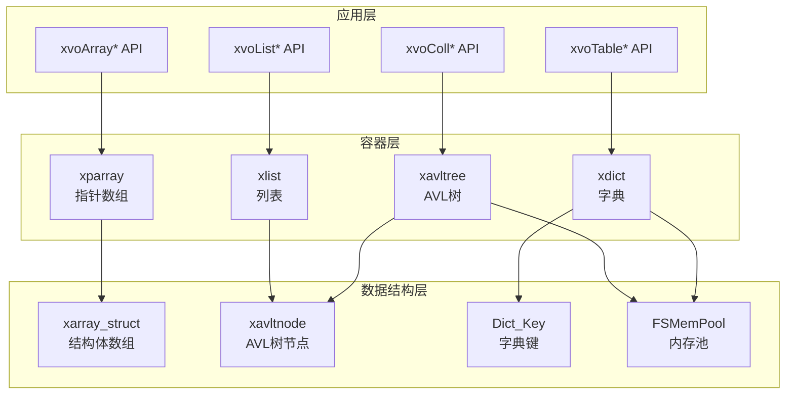
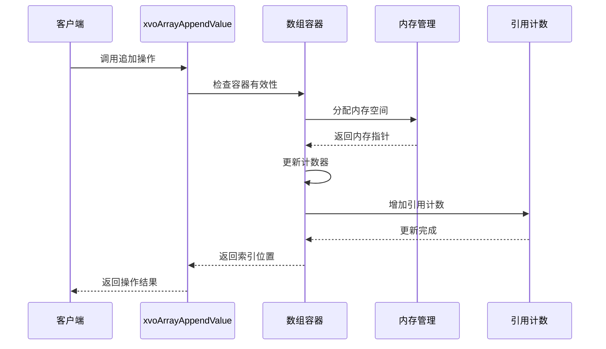
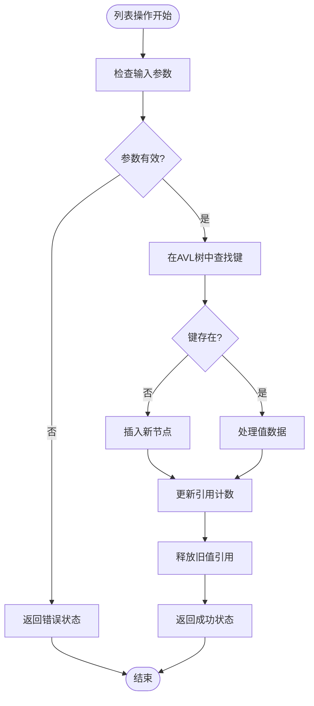
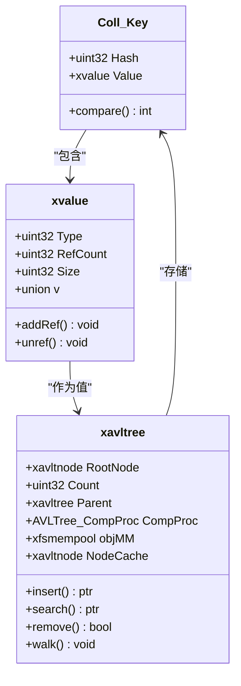
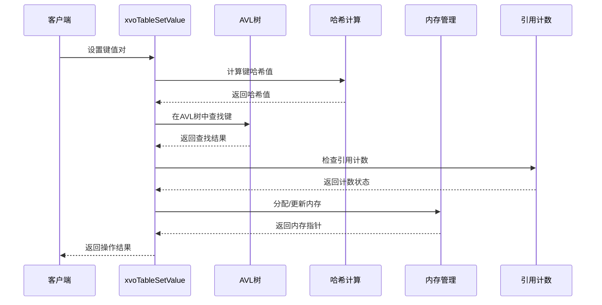
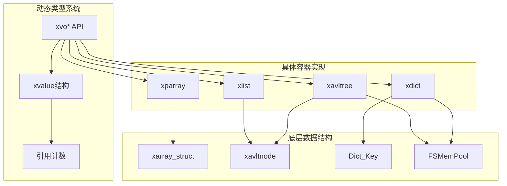

# 容器操作

<cite>
**本文档引用的文件**
- [lib/array.h](file://lib/array.h)
- [lib/array_point.h](file://lib/array_point.h)
- [lib/list.h](file://lib/list.h)
- [lib/dict.h](file://lib/dict.h)
- [lib/avltree.h](file://lib/avltree.h)
- [lib/value.h](file://lib/value.h)
- [docs/api-array.md](file://docs/api-array.md)
- [docs/api-list.md](file://docs/api-list.md)
- [docs/api-dict.md](file://docs/api-dict.md)
- [docs/api-avltree.md](file://docs/api-avltree.md)
- [docs/api-value.md](file://docs/api-value.md)
- [test/test_array_ptr.h](file://test/test_array_ptr.h)
- [test/test_list.h](file://test/test_list.h)
</cite>

## 目录
1. [简介](#简介)
2. [项目结构](#项目结构)
3. [核心组件](#核心组件)
4. [架构概览](#架构概览)
5. [详细组件分析](#详细组件分析)
6. [依赖关系分析](#依赖关系分析)
7. [性能考虑](#性能考虑)
8. [故障排除指南](#故障排除指南)
9. [结论](#结论)
10. [附录](#附录)

## 简介

本文档详细介绍了 xrt 库中的容器操作API，涵盖数组、列表、集合、表格等复合类型的完整操作接口。这些API提供了统一的动态类型系统，支持16种数据类型，包括基础类型（null、bool、int、float、text、time、point、func）和复合类型（array、list、coll、table、class、custom）。

容器操作API基于引用计数机制实现自动内存管理，支持容器的嵌套使用和复杂的层次结构。每个容器类型都有其特定的数据结构和操作特性，适用于不同的使用场景。

## 项目结构

项目采用模块化设计，主要包含以下核心模块：



**图表来源**
- [lib/array.h](file://lib/array.h#L1-L180)
- [lib/value.h](file://lib/value.h#L1-L1640)

**章节来源**
- [lib/array.h](file://lib/array.h#L1-L180)
- [lib/array_point.h](file://lib/array_point.h#L1-L199)
- [lib/list.h](file://lib/list.h#L1-L188)
- [lib/dict.h](file://lib/dict.h#L1-L204)
- [lib/avltree.h](file://lib/avltree.h#L1-L126)
- [lib/value.h](file://lib/value.h#L1-L1640)

## 核心组件

### 数组容器（Array）

数组容器提供连续内存存储的动态数组实现，支持任意大小的结构体元素。主要特性包括：

- **动态扩容**：自动预分配内存，避免频繁重新分配
- **索引访问**：1基索引，支持范围检查
- **内存管理**：自动内存分配和释放
- **性能优化**：批量操作支持

### 列表容器（List）

列表容器基于AVL树实现，使用int64作为键，支持稀疏存储和高效查找：

- **稀疏存储**：只存储实际使用的索引
- **AVL平衡**：保证O(log n)的查找、插入、删除性能
- **负索引支持**：支持负数索引
- **跳跃索引**：支持非连续索引

### 集合容器（Coll）

集合容器基于AVL树实现，提供自动去重和排序功能：

- **自动去重**：相同元素只存储一次
- **排序存储**：元素按特定规则排序
- **集合运算**：支持并集、交集、差集等操作
- **高效查找**：O(log n)时间复杂度

### 表格容器（Table）

表格容器基于AVL树实现的字典结构，支持任意二进制键：

- **任意键类型**：支持字符串、数字、结构体等
- **灵活值存储**：支持存储值或直接存储指针
- **内存池支持**：可选的内存池管理
- **哈希优化**：键的哈希值加速比较

**章节来源**
- [lib/value.h](file://lib/value.h#L216-L284)
- [docs/api-value.md](file://docs/api-value.md#L25-L44)

## 架构概览

容器操作API采用分层架构设计，从底层数据结构到高层抽象接口：



**图表来源**
- [lib/value.h](file://lib/value.h#L522-L1286)
- [lib/array_point.h](file://lib/array_point.h#L4-L37)
- [lib/list.h](file://lib/list.h#L19-L47)
- [lib/dict.h](file://lib/dict.h#L30-L62)

## 详细组件分析

### 数组操作API

#### 基础数组操作

| API名称 | 功能描述 | 时间复杂度 | 空间复杂度 |
|---------|----------|------------|------------|
| xrtArrayCreate | 创建结构体数组 | O(1) | O(1) |
| xrtArrayDestroy | 销毁数组 | O(1) | O(1) |
| xrtArrayAlloc | 预分配内存 | O(n) | O(1) |
| xrtArrayInsert | 插入元素 | O(n) | O(1) |
| xrtArrayAppend | 追加元素 | O(1)摊销 | O(1) |
| xrtArrayRemove | 删除元素 | O(n) | O(1) |
| xrtArraySwap | 交换元素 | O(1) | O(1) |
| xrtArraySort | 排序 | O(n log n) | O(1) |

#### 动态类型数组操作

| API名称 | 功能描述 | 时间复杂度 | 说明 |
|---------|----------|------------|------|
| xvoArrayGetValue | 获取元素 | O(1) | 0基索引 |
| xvoArrayAppendValue | 追加元素 | O(1)摊销 | 支持引用计数 |
| xvoArrayInsertValue | 插入元素 | O(n) | 支持引用计数 |
| xvoArraySetValue | 设置元素 | O(1) | 自动释放旧值 |
| xvoArrayMerge | 合并数组 | O(n) | 逐元素转移 |
| xvoArrayRemove | 删除元素 | O(n) | 释放引用计数 |
| xvoArraySwap | 交换元素 | O(1) | 交换引用计数 |
| xvoArrayItemCount | 获取数量 | O(1) | 直接返回计数 |
| xvoArrayClear | 清空数组 | O(n) | 释放所有元素 |
| xvoArrayAlloc | 预分配 | O(n) | 批量内存调整 |
| xvoArraySort | 排序 | O(n log n) | qsort封装 |



**图表来源**
- [lib/value.h](file://lib/value.h#L541-L557)
- [lib/array_point.h](file://lib/array_point.h#L98-L101)

**章节来源**
- [lib/array.h](file://lib/array.h#L43-L74)
- [lib/array_point.h](file://lib/array_point.h#L39-L71)
- [lib/value.h](file://lib/value.h#L541-L699)
- [docs/api-array.md](file://docs/api-array.md#L65-L586)

### 列表操作API

#### 列表基础操作

| API名称 | 功能描述 | 时间复杂度 | 空间复杂度 |
|---------|----------|------------|------------|
| xrtListCreate | 创建列表 | O(1) | O(1) |
| xrtListDestroy | 销毁列表 | O(1) | O(1) |
| xrtListSet | 设置元素 | O(log n) | O(1) |
| xrtListGet | 获取元素 | O(log n) | O(1) |
| xrtListRemove | 删除元素 | O(log n) | O(1) |
| xrtListExists | 检查存在 | O(log n) | O(1) |
| xrtListCount | 获取数量 | O(1) | O(1) |
| xrtListWalk | 遍历列表 | O(n) | O(1) |

#### 动态类型列表操作

| API名称 | 功能描述 | 时间复杂度 | 说明 |
|---------|----------|------------|------|
| xvoListGetValue | 获取元素 | O(log n) | 支持任意int64键 |
| xvoListSetValue | 设置元素 | O(log n) | 支持引用计数 |
| xvoListMerge | 合并列表 | O(n log m) | n为源列表，m为目标树节点数 |
| xvoListExists | 检查存在 | O(log n) | 键存在性检查 |
| xvoListRemove | 删除元素 | O(log n) | 删除并释放引用 |
| xvoListItemCount | 获取数量 | O(1) | 直接返回节点数 |
| xvoListClear | 清空列表 | O(n) | 释放所有节点 |
| xvoListSetParent | 设置父列表 | O(1) | 继承查找支持 |



**图表来源**
- [lib/value.h](file://lib/value.h#L704-L821)
- [lib/list.h](file://lib/list.h#L49-L121)

**章节来源**
- [lib/list.h](file://lib/list.h#L19-L47)
- [lib/value.h](file://lib/value.h#L704-L821)
- [docs/api-list.md](file://docs/api-list.md#L114-L535)

### 集合操作API

#### 集合基础操作

| API名称 | 功能描述 | 时间复杂度 | 空间复杂度 |
|---------|----------|------------|------------|
| xrtAVLTreeCreate | 创建AVL树 | O(1) | O(1) |
| xrtAVLTreeDestroy | 销毁树 | O(n) | O(1) |
| xrtAVLTreeInsert | 插入节点 | O(log n) | O(1) |
| xrtAVLTreeSearch | 查找节点 | O(log n) | O(1) |
| xrtAVLTreeRemove | 删除节点 | O(log n) | O(1) |
| xrtAVLTreeWalk | 遍历树 | O(n) | O(1) |

#### 集合操作扩展

| API名称 | 功能描述 | 时间复杂度 | 说明 |
|---------|----------|------------|------|
| xvoCollSetValue | 添加元素 | O(log n) | 自动去重 |
| xvoCollExists | 检查存在 | O(log n) | 元素存在性 |
| xvoCollRemove | 删除元素 | O(log n) | 删除并释放 |
| xvoCollMerge | 合并集合 | O(n log m) | n为源集合，m为当前树节点数 |
| xvoCollUnion | 并集运算 | O(n log m) | 合并去重 |
| xvoCollIntersection | 交集运算 | O(n log m) | 共同元素 |
| xvoCollDifference | 差集运算 | O(n log m) | 差异元素 |
| xvoCollItemCount | 获取数量 | O(1) | 直接返回节点数 |
| xvoCollClear | 清空集合 | O(n) | 释放所有节点 |
| xvoCollSetParent | 设置父集合 | O(1) | 继承查找支持 |



**图表来源**
- [lib/value.h](file://lib/value.h#L862-L894)
- [lib/avltree.h](file://lib/avltree.h#L5-L32)

**章节来源**
- [lib/avltree.h](file://lib/avltree.h#L5-L126)
- [lib/value.h](file://lib/value.h#L862-L1095)
- [docs/api-avltree.md](file://docs/api-avltree.md#L169-L497)

### 表格操作API

#### 表格基础操作

| API名称 | 功能描述 | 时间复杂度 | 空间复杂度 |
|---------|----------|------------|------------|
| xrtDictCreate | 创建字典 | O(1) | O(1) |
| xrtDictDestroy | 销毁字典 | O(n) | O(1) |
| xrtDictSet | 设置键值 | O(log n) | O(1) |
| xrtDictGet | 获取值 | O(log n) | O(1) |
| xrtDictRemove | 删除键值 | O(log n) | O(1) |
| xrtDictExists | 检查存在 | O(log n) | O(1) |
| xrtDictCount | 获取数量 | O(1) | O(1) |
| xrtDictWalk | 遍历字典 | O(n) | O(1) |

#### 动态类型表格操作

| API名称 | 功能描述 | 时间复杂度 | 说明 |
|---------|----------|------------|------|
| xvoTableGetValue | 获取值 | O(log n) | 支持任意键 |
| xvoTableSetValue | 设置值 | O(log n) | 支持引用计数 |
| xvoTableMerge | 合并表格 | O(n log m) | n为源表格，m为当前树节点数 |
| xvoTableExists | 检查存在 | O(log n) | 键存在性检查 |
| xvoTableRemove | 删除键值 | O(log n) | 删除并释放引用 |
| xvoTableItemCount | 获取数量 | O(1) | 直接返回节点数 |
| xvoTableClear | 清空表格 | O(n) | 释放所有节点 |
| xvoTableSetParent | 设置父表格 | O(1) | 继承查找支持 |



**图表来源**
- [lib/value.h](file://lib/value.h#L1139-L1165)
- [lib/dict.h](file://lib/dict.h#L71-L103)

**章节来源**
- [lib/dict.h](file://lib/dict.h#L30-L68)
- [lib/value.h](file://lib/value.h#L1114-L1286)
- [docs/api-dict.md](file://docs/api-dict.md#L152-L543)

## 依赖关系分析

容器操作API之间的依赖关系体现了清晰的分层架构：



**图表来源**
- [lib/value.h](file://lib/value.h#L1-L1640)
- [lib/array_point.h](file://lib/array_point.h#L1-L199)
- [lib/list.h](file://lib/list.h#L1-L188)
- [lib/avltree.h](file://lib/avltree.h#L1-L126)
- [lib/dict.h](file://lib/dict.h#L1-L204)

### 关键依赖链

1. **动态类型到具体容器**：xvo* API函数依赖于具体的容器实现
2. **容器到数据结构**：具体容器实现依赖于底层数据结构
3. **内存管理**：所有容器都依赖于FSMemPool进行内存管理
4. **引用计数**：动态类型系统提供统一的引用计数机制

**章节来源**
- [lib/value.h](file://lib/value.h#L33-L96)
- [lib/avltree.h](file://lib/avltree.h#L24-L59)
- [lib/dict.h](file://lib/dict.h#L49-L68)

## 性能考虑

### 时间复杂度分析

| 操作类型 | 数组 | 列表 | 集合 | 表格 |
|----------|------|------|------|------|
| 访问/查找 | O(1) | O(log n) | O(log n) | O(log n) |
| 插入/设置 | O(1)摊销 | O(log n) | O(log n) | O(log n) |
| 删除 | O(n) | O(log n) | O(log n) | O(log n) |
| 遍历 | O(n) | O(n) | O(n) | O(n) |

### 内存管理优化

1. **预分配策略**：数组采用预分配步长避免频繁重新分配
2. **引用计数**：自动内存管理减少内存泄漏风险
3. **内存池**：AVL树使用FSMemPool提高内存分配效率
4. **稀疏存储**：列表和字典只存储实际使用的键值对

### 性能最佳实践

1. **批量操作**：使用xvoArrayAlloc预分配大量元素
2. **选择合适容器**：根据使用场景选择最适合的容器类型
3. **避免频繁转换**：尽量保持数据类型一致，减少类型转换开销
4. **合理使用引用计数**：在需要共享数据时使用引用计数而非复制

## 故障排除指南

### 常见问题及解决方案

#### 内存相关问题

**问题**：内存泄漏或访问已释放内存
**解决方案**：
- 确保正确使用xvoUnref释放引用计数
- 避免循环引用导致的内存泄漏
- 使用调试工具检测内存问题

**问题**：数组越界访问
**解决方案**：
- 使用xvoArrayGetValue进行安全访问
- 检查索引范围（0到Count-1）
- 使用xvoArrayItemCount获取准确数量

#### 性能相关问题

**问题**：容器操作性能下降
**解决方案**：
- 使用xvoArrayAlloc预分配内存
- 避免频繁的插入和删除操作
- 考虑使用合适的容器类型

**问题**：内存使用过高
**解决方案**：
- 及时调用xvoArrayClear或xvoListClear清理容器
- 避免存储不必要的大型对象
- 使用xvoTableRemove及时删除不需要的键值对

**章节来源**
- [lib/value.h](file://lib/value.h#L59-L96)
- [lib/array_point.h](file://lib/array_point.h#L155-L168)

## 结论

xrt库的容器操作API提供了强大而灵活的数据结构支持，具有以下优势：

1. **统一接口**：所有容器类型都遵循相同的API模式
2. **自动内存管理**：基于引用计数的自动内存管理机制
3. **高性能实现**：基于AVL树的平衡树结构保证O(log n)性能
4. **类型安全**：动态类型系统提供运行时类型检查
5. **扩展性强**：支持容器嵌套和复杂的层次结构

通过合理选择和使用这些容器操作API，开发者可以构建高效、可靠的应用程序。建议在实际开发中根据具体使用场景选择最适合的容器类型，并遵循最佳实践以获得最佳性能。

## 附录

### 使用示例

#### 数组操作示例

```c
// 创建数组并添加元素
xvalue arr = xvoCreateArray();
xvoArrayAppendInt(arr, 1);
xvoArrayAppendInt(arr, 2);
xvoArrayAppendText(arr, "hello", 0, TRUE);

// 访问元素
uint32 count = xvoArrayItemCount(arr);
int64 first = xvoArrayGetInt(arr, 0);

// 排序
xvoArraySort(arr, compareFunction);

xvoUnref(arr);
```

#### 列表操作示例

```c
// 创建列表并设置稀疏索引
xvalue list = xvoCreateList();
xvoListSetInt(list, 100, 1);    // 键100 = 1
xvoListSetInt(list, -50, 2);    // 键-50 = 2
xvoListSetInt(list, 1000, 3);   // 键1000 = 3

// 遍历列表
xvoListWalk(list, printCallback, NULL);

xvoUnref(list);
```

#### 集合操作示例

```c
// 创建集合并添加元素
xvalue coll = xvoCreateColl();
xvoCollSetValue(coll, xvoCreateInt(1), TRUE);
xvoCollSetValue(coll, xvoCreateInt(2), TRUE);
xvoCollSetValue(coll, xvoCreateInt(3), TRUE);

// 集合运算
xvalue unionResult = xvoCollUnion(coll, anotherColl);
xvalue intersection = xvoCollIntersection(coll, anotherColl);

xvoUnref(coll);
xvoUnref(unionResult);
xvoUnref(intersection);
```

#### 表格操作示例

```c
// 创建表格并设置键值对
xvalue table = xvoCreateTable();
xvoTableSetValue(table, "name", 4, xvoCreateText("Alice", 0, TRUE), TRUE);
xvoTableSetValue(table, "age", 3, xvoCreateInt(25), TRUE);

// 获取值
xvalue name = xvoTableGetValue(table, "name", 4);
str nameStr = xvoGetText(name);

xvoUnref(table);
```

### 性能基准测试

项目包含完整的测试套件，验证各种容器操作的性能表现：

- **数组测试**：验证批量操作、排序、内存管理
- **列表测试**：验证稀疏存储、大规模数据处理
- **字典测试**：验证键值对存储、哈希性能
- **集合测试**：验证自动去重、集合运算

**章节来源**
- [test/test_array_ptr.h](file://test/test_array_ptr.h#L11-L371)
- [test/test_list.h](file://test/test_list.h#L21-L274)