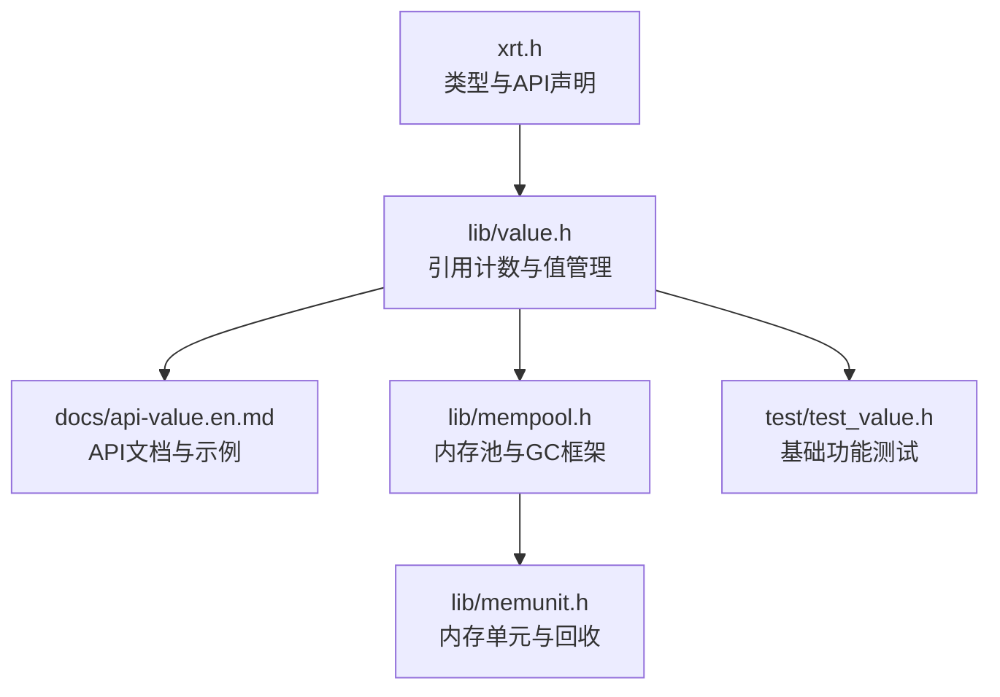
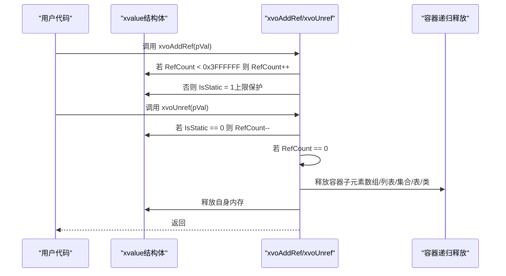
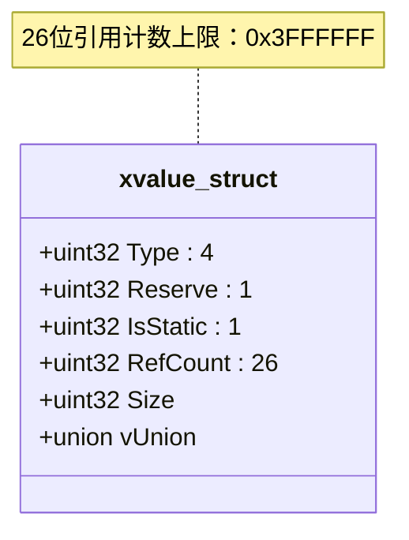
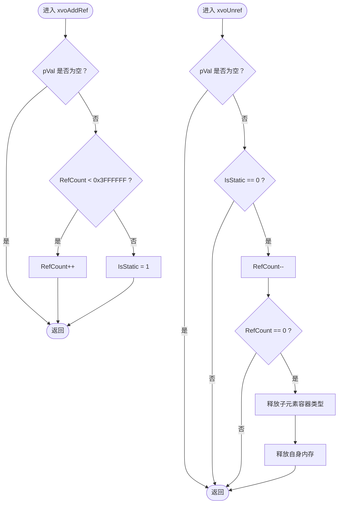
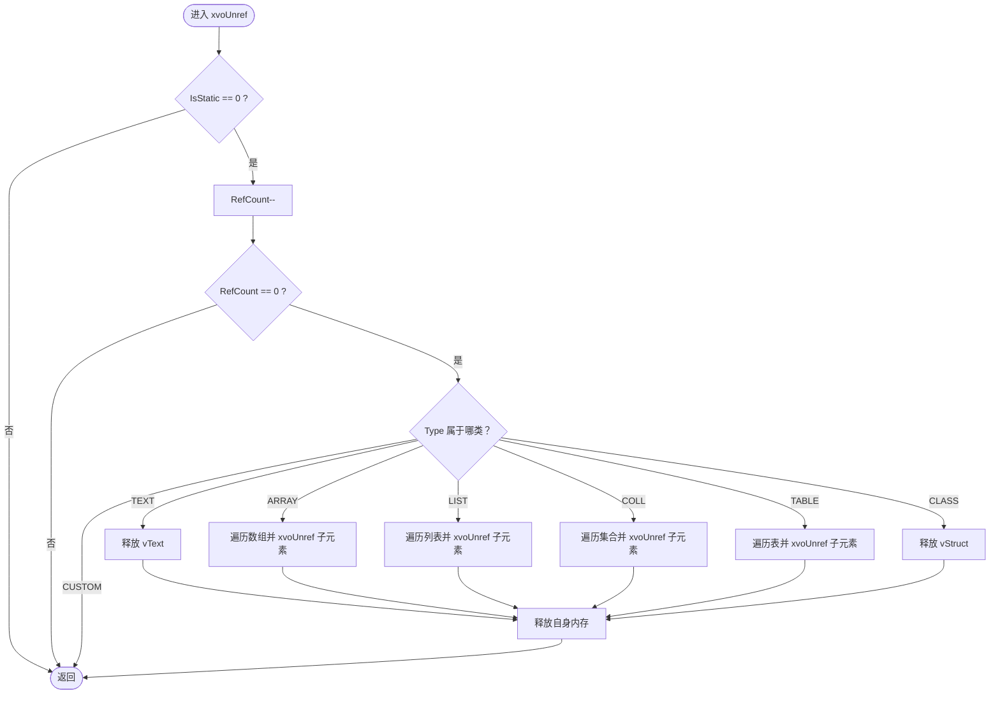
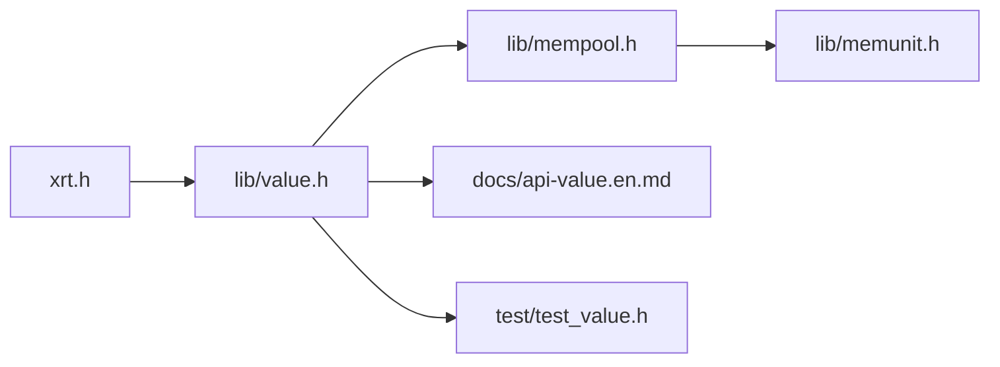

# 引用计数机制

<cite>
**本文引用的文件**
- [xrt.h](file://xrt.h)
- [value.h](file://lib/value.h)
- [api-value.en.md](file://docs/api-value.en.md)
- [mempool.h](file://lib/mempool.h)
- [memunit.h](file://lib/memunit.h)
- [test_value.h](file://test/test_value.h)
</cite>

## 目录
1. [简介](#简介)
2. [项目结构](#项目结构)
3. [核心组件](#核心组件)
4. [架构总览](#架构总览)
5. [详细组件分析](#详细组件分析)
6. [依赖关系分析](#依赖关系分析)
7. [性能考量](#性能考量)
8. [故障排查指南](#故障排查指南)
9. [结论](#结论)
10. [附录](#附录)

## 简介
本文件系统性阐述该代码库中的引用计数机制，重点覆盖：
- 26位引用计数系统（最大值67,108,863）的设计与实现
- xvoAddRef 与 xvoUnref 的工作原理与边界行为
- 静态值优化机制：当引用计数达到上限时自动转换为静态值
- 内存管理策略：自动释放、容器级递归释放、批量回收与GC配合
- 最佳实践：正确的引用传递、避免循环引用、资源清理时机
- 性能优化建议与调试技巧

## 项目结构
围绕引用计数与内存管理的关键文件与职责如下：
- 头文件定义与API声明：xrt.h
- 值类型与引用计数实现：lib/value.h
- 文档化API与示例：docs/api-value.en.md
- 内存池与GC基础能力：lib/mempool.h、lib/memunit.h
- 基础功能测试：test/test_value.h

图表来源
- [xrt.h](file://xrt.h#L1910-L1957)
- [value.h](file://lib/value.h#L33-L96)
- [api-value.en.md](file://docs/api-value.en.md#L46-L1221)
- [mempool.h](file://lib/mempool.h#L1-L200)
- [memunit.h](file://lib/memunit.h#L95-L142)
- [test_value.h](file://test/test_value.h#L1-L200)

章节来源
- [xrt.h](file://xrt.h#L1910-L1957)
- [value.h](file://lib/value.h#L33-L96)
- [api-value.en.md](file://docs/api-value.en.md#L46-L1221)
- [mempool.h](file://lib/mempool.h#L1-L200)
- [memunit.h](file://lib/memunit.h#L95-L142)
- [test_value.h](file://test/test_value.h#L1-L200)

## 核心组件
- xvalue 结构体：包含类型、是否静态、引用计数、大小与联合体存储，其中引用计数字段占26位，上限为0x3FFFFFF（即67,108,863）
- xvoAddRef/xvoUnref：引用计数增减与自动释放逻辑
- xvoAddRef_Inline：内联版本，当计数达到上限时自动将IsStatic置1，避免继续溢出
- 容器类型（数组、列表、集合、表、类）在释放时会递归释放其子元素
- 静态值（null/true/false）不参与引用计数，无需手动释放

章节来源
- [xrt.h](file://xrt.h#L1910-L1957)
- [value.h](file://lib/value.h#L33-L96)
- [api-value.en.md](file://docs/api-value.en.md#L46-L1221)

## 架构总览
引用计数与内存管理的整体流程如下：
- 创建值时初始化IsStatic=0，RefCount=1
- 使用方通过xvoAddRef增加引用；当引用计数达到上限（0x3FFFFFF）时，自动将IsStatic置1，不再增长
- 使用方通过xvoUnref减少引用；当引用计数降至0且IsStatic=0时，释放该值及其子元素（容器类型）
- 静态值（IsStatic=1）不释放，始终存在

图表来源
- [value.h](file://lib/value.h#L33-L96)
- [xrt.h](file://xrt.h#L1946-L1957)

## 详细组件分析

### xvalue 结构与26位引用计数
- 关键字段：Type（4位）、Reserve（1位）、IsStatic（1位）、RefCount（26位）、Size、联合体vXxx
- 26位引用计数上限：0x3FFFFFF（67,108,863），超过此值自动转为静态值
- 静态值：null、true、false，IsStatic=1，不释放

图表来源
- [xrt.h](file://xrt.h#L1910-L1931)

章节来源
- [xrt.h](file://xrt.h#L1910-L1931)

### xvoAddRef 与 xvoUnref 工作原理
- xvoAddRef：若pVal非空，先检查是否已达上限（0x3FFFFFF），若未达则RefCount++；若已达则IsStatic=1
- xvoUnref：若pVal非空且IsStatic==0，则RefCount--；若RefCount==0则释放该值及子元素（文本、数组、列表、集合、表、类、自定义等），最后释放自身内存

图表来源
- [value.h](file://lib/value.h#L33-L96)
- [xrt.h](file://xrt.h#L1946-L1957)

章节来源
- [value.h](file://lib/value.h#L33-L96)
- [xrt.h](file://xrt.h#L1946-L1957)

### 静态值优化机制
- 当引用计数达到上限（0x3FFFFFF）时，xvoAddRef_Inline会将IsStatic置为1，使该值不再参与后续引用计数增长
- 静态值（null/true/false）由全局单例持有，无需手动释放
- 这种设计避免了极端高并发场景下的计数溢出风险，并降低频繁计数更新带来的开销

章节来源
- [value.h](file://lib/value.h#L33-L43)
- [xrt.h](file://xrt.h#L1946-L1957)
- [api-value.en.md](file://docs/api-value.en.md#L46-L1221)

### 容器类型的内存管理与递归释放
- 数组：释放前会遍历元素并调用xvoUnref，确保子元素也被正确释放
- 列表/集合/表：通过遍历回调统一释放子元素
- 类：释放vStruct指向的实例数据
- 文本：释放vText指向的字符串内容
- 自定义：保留扩展空间，按需释放

图表来源
- [value.h](file://lib/value.h#L59-L96)

章节来源
- [value.h](file://lib/value.h#L59-L96)

### 内存池与GC配合（批量回收优化）
- 内存池提供多级FSB（Free Segment Bucket）组织，支持大/小内存块的高效分配与回收
- GC阶段可对被标记的内存进行批量回收，未被标记的内存则恢复状态或直接回收
- 该机制与引用计数相辅相成：引用计数负责即时释放，GC负责周期性批量回收，降低碎片与提升吞吐

章节来源
- [mempool.h](file://lib/mempool.h#L389-L467)
- [memunit.h](file://lib/memunit.h#L95-L142)

### 基础功能测试与使用示例
- 测试覆盖了null/bool/int/float/text/time/point/func/array/list/table/class/custom等类型的创建、访问与释放
- 通过测试可验证引用计数在不同场景下的行为，如数组追加/插入/设置/合并/清空等操作对子元素引用的影响

章节来源
- [test_value.h](file://test/test_value.h#L1-L200)

## 依赖关系分析
- xrt.h 定义了xvalue结构体与API原型，value.h 实现具体逻辑
- 容器类型（数组/列表/集合/表/类）在value.h中通过回调与遍历接口释放子元素
- mempool.h 提供底层内存池与GC框架，memunit.h 提供内存单元级回收能力
- api-value.en.md 提供API文档与最佳实践示例

图表来源
- [xrt.h](file://xrt.h#L1910-L1957)
- [value.h](file://lib/value.h#L33-L96)
- [mempool.h](file://lib/mempool.h#L1-L200)
- [memunit.h](file://lib/memunit.h#L95-L142)
- [api-value.en.md](file://docs/api-value.en.md#L46-L1221)
- [test_value.h](file://test/test_value.h#L1-L200)

章节来源
- [xrt.h](file://xrt.h#L1910-L1957)
- [value.h](file://lib/value.h#L33-L96)
- [mempool.h](file://lib/mempool.h#L1-L200)
- [memunit.h](file://lib/memunit.h#L95-L142)
- [api-value.en.md](file://docs/api-value.en.md#L46-L1221)
- [test_value.h](file://test/test_value.h#L1-L200)

## 性能考量
- 26位引用计数上限（约6700万）足以应对绝大多数高并发场景，避免计数溢出导致的异常
- 静态值优化：当引用计数达到上限时自动转为静态值，减少后续计数更新的CPU开销
- 容器级递归释放：在容器销毁时一次性释放所有子元素，避免逐个释放的重复成本
- 批量回收与GC：结合内存池的FSB组织与GC标记-清扫，降低碎片与提升整体吞吐
- 预分配容量：如数组预分配容量可显著减少扩容与复制成本

章节来源
- [xrt.h](file://xrt.h#L1946-L1957)
- [value.h](file://lib/value.h#L59-L96)
- [mempool.h](file://lib/mempool.h#L389-L467)
- [memunit.h](file://lib/memunit.h#L95-L142)
- [api-value.en.md](file://docs/api-value.en.md#L1202-L1218)

## 故障排查指南
- 引用计数未释放导致泄漏
  - 症状：对象无法被释放，内存持续增长
  - 排查：确认每次xvoAddRef都有对应xvoUnref；容器类型在销毁时会递归释放子元素，但需确保容器本身最终被释放
- 静态值误用
  - 症状：对静态值调用xvoUnref无效
  - 排查：null/true/false属于静态值，无需释放；仅对动态创建的对象调用xvoUnref
- 循环引用
  - 症状：两个或多个对象互相持有引用，导致彼此无法释放
  - 排查：避免容器间互相持有强引用；必要时采用弱引用或重新设计数据结构
- 计数溢出风险
  - 症状：极端高并发下计数异常
  - 排查：26位上限已自动保护，当达到上限时会转为静态值；如仍出现异常，检查是否存在异常的引用传递或共享逻辑

章节来源
- [value.h](file://lib/value.h#L33-L96)
- [api-value.en.md](file://docs/api-value.en.md#L1189-L1198)

## 结论
该引用计数机制以26位计数为核心，结合静态值优化与容器级递归释放，提供了高效、稳定且易用的内存管理模型。配合内存池与GC框架，可在高并发与大数据场景下保持良好的性能与稳定性。遵循最佳实践（正确的引用传递、避免循环引用、及时清理资源）是保证系统长期健康运行的关键。

## 附录
- 最佳实践清单
  - 正确的引用传递：每次复制/传递引用时调用xvoAddRef，使用完毕后调用xvoUnref
  - 避免循环引用：容器之间不要互相持有强引用
  - 资源清理时机：容器销毁时会递归释放子元素，但容器本身最终需要被释放
  - 性能优化：使用collocation模式减少拷贝；预分配容器容量；利用静态值优化常量字符串
- 调试技巧
  - 使用测试用例验证基本类型创建/访问/释放流程
  - 观察容器操作（追加/插入/设置/合并/清空）对子元素引用的影响
  - 在DEBUG模式下启用内存跟踪输出，定位异常释放

章节来源
- [api-value.en.md](file://docs/api-value.en.md#L1166-L1221)
- [test_value.h](file://test/test_value.h#L1-L200)