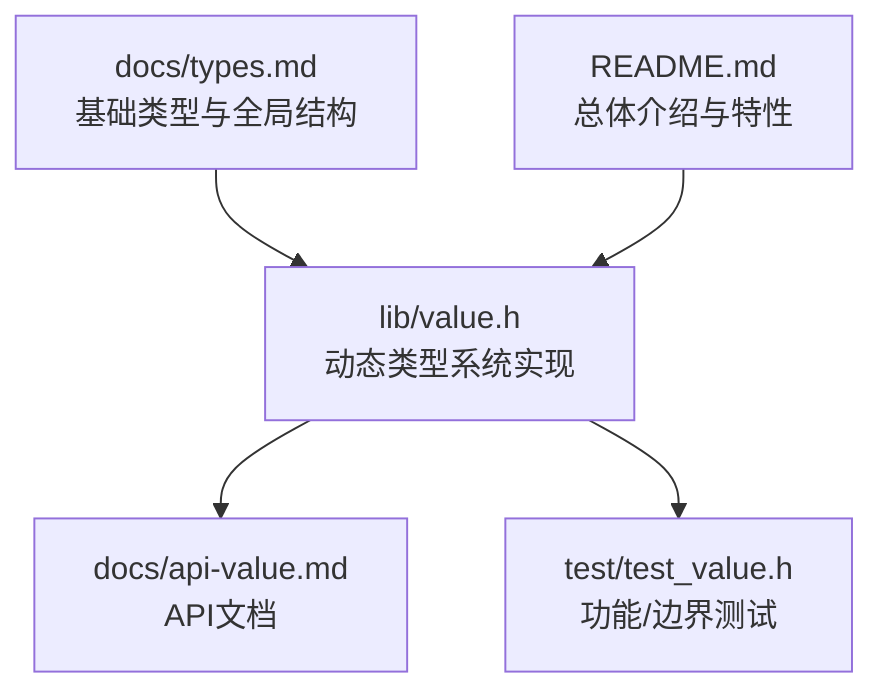
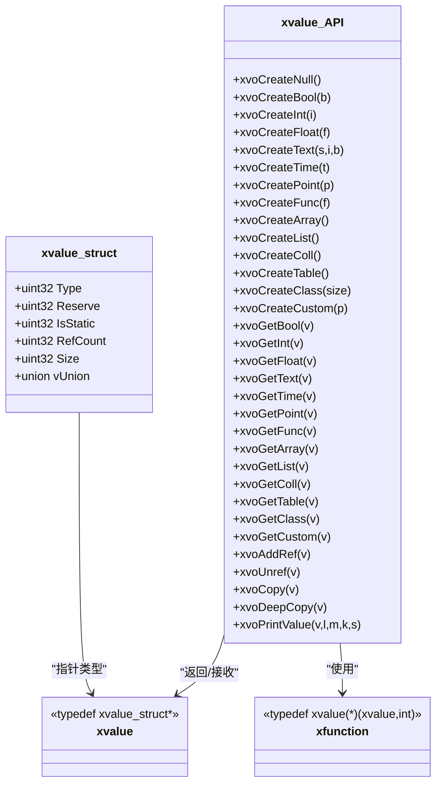
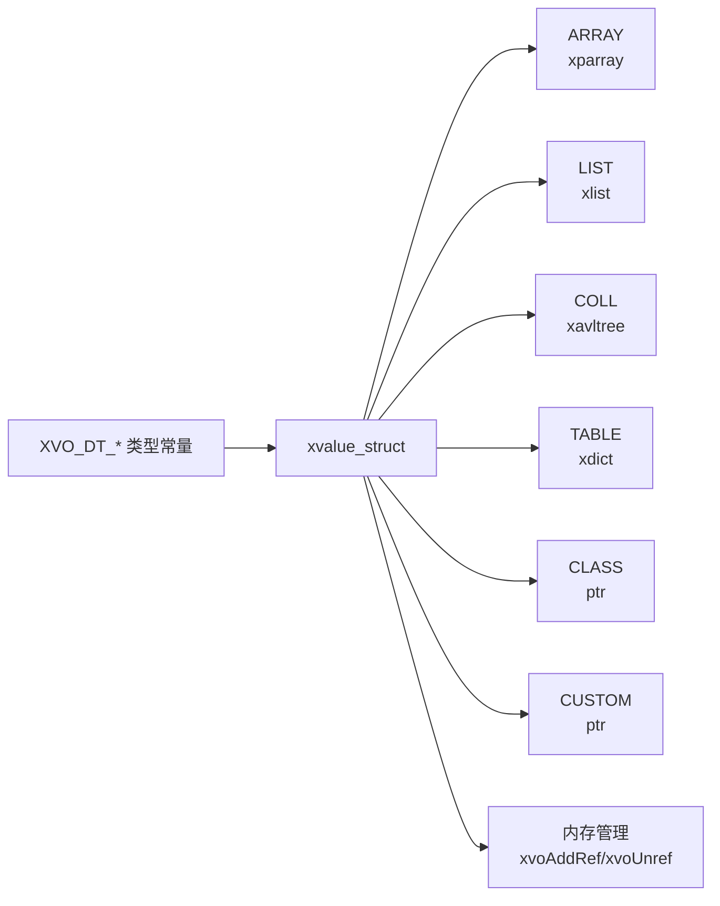

# 数据类型概览

<cite>
**本文档引用的文件**
- [lib/value.h](file://lib/value.h)
- [docs/api-value.md](file://docs/api-value.md)
- [docs/types.md](file://docs/types.md)
- [test/test_value.h](file://test/test_value.h)
- [README.md](file://README.md)
</cite>

## 目录
1. [简介](#简介)
2. [项目结构](#项目结构)
3. [核心组件](#核心组件)
4. [架构总览](#架构总览)
5. [详细组件分析](#详细组件分析)
6. [依赖关系分析](#依赖关系分析)
7. [性能考量](#性能考量)
8. [故障排查指南](#故障排查指南)
9. [结论](#结论)

## 简介
本文件面向XRT动态类型系统，系统性梳理其16种数据类型：NULL空值、BOOL布尔值、INT整数、FLOAT浮点数、TEXT文本、TIME时间、POINT指针、FUNC函数、ARRAY数组、LIST列表、COLL集合、TABLE表格、CLASS类、CUSTOM自定义类型。文档重点阐述：
- 每种类型的用途、特点与适用场景
- 类型系统设计理念：静态值优化、引用计数与内存管理策略
- 类型转换规则与兼容性
- 类型判断函数的使用方法与最佳实践

## 项目结构
围绕动态类型系统的关键文件与职责如下：
- lib/value.h：动态类型系统实现，包含值结构、创建/读取/引用管理、容器操作、拷贝与调试等
- docs/api-value.md：动态类型系统API文档，涵盖类型常量、结构、创建/读取、类型判断、容器操作、拷贝与调试
- docs/types.md：基础类型与全局数据结构，辅助理解XRT类型体系
- test/test_value.h：类型系统功能与边界测试样例，验证各类型行为与内存管理
- README.md：总体介绍，包含动态类型系统特性说明

图表来源
- [lib/value.h](file://lib/value.h#L49-L74)
- [docs/api-value.md](file://docs/api-value.md#L25-L74)
- [docs/types.md](file://docs/types.md#L285-L328)
- [README.md](file://README.md#L135-L157)

章节来源
- [lib/value.h](file://lib/value.h#L49-L74)
- [docs/api-value.md](file://docs/api-value.md#L25-L74)
- [docs/types.md](file://docs/types.md#L285-L328)
- [README.md](file://README.md#L135-L157)

## 核心组件
- 值结构与类型常量
  - 值结构xvalue_struct包含类型标识、静态标志、引用计数、数据大小与联合体vUnion，覆盖16种类型
  - 类型常量XVO_DT_NULL..XVO_DT_CUSTOM定义了16种类型编号
- 静态值优化
  - NULL/TRUE/FALSE采用静态单例，避免重复分配与释放
- 引用计数与内存管理
  - 引用计数字段占26位，上限约6700万；超过阈值自动转为静态值
  - 释放时按类型递归释放容器内元素，避免内存泄漏
- 类型判断与读取
  - 提供xvoIsNull、xvoType、xvoGetSize等判断函数
  - 提供xvoGetBool/Int/Float/Text/Time/Point/Func/容器获取等读取函数
- 容器与拷贝
  - 容器类型支持浅拷贝与深拷贝，复杂类型采用引用或递归复制策略
- 调试与输出
  - 提供xvoPrintValue递归打印结构与值，便于调试

章节来源
- [lib/value.h](file://lib/value.h#L49-L74)
- [lib/value.h](file://lib/value.h#L101-L316)
- [lib/value.h](file://lib/value.h#L321-L517)
- [lib/value.h](file://lib/value.h#L1291-L1320)
- [lib/value.h](file://lib/value.h#L1370-L1498)
- [lib/value.h](file://lib/value.h#L1518-L1599)
- [docs/api-value.md](file://docs/api-value.md#L25-L74)
- [docs/api-value.md](file://docs/api-value.md#L472-L537)
- [docs/api-value.md](file://docs/api-value.md#L1052-L1090)

## 架构总览
XRT动态类型系统以统一的xvalue结构为核心，通过类型常量区分16种类型，并以静态值优化与引用计数实现高效内存管理。容器类型（ARRAY/LIST/COLL/TABLE）内部持有底层数据结构指针，实现嵌套与递归释放。

图表来源
- [lib/value.h](file://lib/value.h#L49-L74)
- [lib/value.h](file://lib/value.h#L101-L316)
- [lib/value.h](file://lib/value.h#L321-L517)
- [lib/value.h](file://lib/value.h#L1370-L1498)
- [lib/value.h](file://lib/value.h#L1518-L1599)

## 详细组件分析

### NULL空值
- 用途：表示“不存在”的数据或占位值
- 特点：静态单例，无需释放；xvoIsNull可快速判断
- 适用场景：初始化占位、条件分支中的“空”状态
- 设计要点：NULL属于静态值，IsStatic=1，RefCount不参与计数

章节来源
- [lib/value.h](file://lib/value.h#L101-L104)
- [lib/value.h](file://lib/value.h#L1291-L1300)
- [docs/api-value.md](file://docs/api-value.md#L125-L137)

### BOOL布尔值
- 用途：逻辑真/假
- 特点：静态单例（TRUE/FALSE），xvoGetBool支持多类型转换
- 适用场景：条件判断、开关控制
- 转换规则：NULL→FALSE；INT/FLOAT非0→TRUE；TEXT解析；其他→TRUE

章节来源
- [lib/value.h](file://lib/value.h#L105-L112)
- [lib/value.h](file://lib/value.h#L321-L334)
- [docs/api-value.md](file://docs/api-value.md#L362-L377)

### INT整数
- 用途：64位整数
- 特点：动态分配，支持引用计数；xvoGetInt支持多类型转换
- 适用场景：计数、索引、ID
- 转换规则：NULL→0；BOOL→1/0；FLOAT→截断；TEXT→解析；其他→0

章节来源
- [lib/value.h](file://lib/value.h#L113-L124)
- [lib/value.h](file://lib/value.h#L335-L350)
- [docs/api-value.md](file://docs/api-value.md#L380-L396)

### FLOAT浮点数
- 用途：双精度浮点数
- 特点：动态分配；xvoGetFloat支持多类型转换
- 适用场景：科学计算、比率、坐标
- 转换规则：NULL→0.0；BOOL→1.0/0.0；INT→整数；TEXT→解析；其他→0.0

章节来源
- [lib/value.h](file://lib/value.h#L125-L136)
- [lib/value.h](file://lib/value.h#L351-L366)
- [docs/api-value.md](file://docs/api-value.md#L399-L407)

### TEXT文本
- 用途：字符串
- 特点：支持托管与复制两种模式；xvoGetText可将非TEXT类型转为临时字符串
- 适用场景：消息、路径、配置项
- 转换规则：NULL→空串；INT/Float→格式化；BOOL→"true"/"false"；TIME→格式化时间；其他→"[type:ptr]"；CLASS→"[class:ptr]"；CUSTOM→"[custom:ptr]"

章节来源
- [lib/value.h](file://lib/value.h#L137-L167)
- [lib/value.h](file://lib/value.h#L367-L425)
- [docs/api-value.md](file://docs/api-value.md#L410-L421)

### TIME时间
- 用途：时间戳（秒）
- 特点：动态分配；xvoGetTime返回xtime；xvoGetText将时间格式化为字符串
- 适用场景：日志、定时任务、事件序列
- 转换规则：NULL/其他→0；TEXT→未来支持解析（当前返回0）

章节来源
- [lib/value.h](file://lib/value.h#L168-L191)
- [lib/value.h](file://lib/value.h#L426-L437)
- [docs/api-value.md](file://docs/api-value.md#L423-L432)

### POINT指针
- 用途：通用指针
- 特点：动态分配；xvoGetPoint返回原始指针
- 适用场景：数据缓冲区、资源句柄
- 注意：仅保存指针，不负责释放目标资源

章节来源
- [lib/value.h](file://lib/value.h#L192-L203)
- [lib/value.h](file://lib/value.h#L438-L447)
- [docs/api-value.md](file://docs/api-value.md#L434-L442)

### FUNC函数
- 用途：函数指针
- 特点：动态分配；xvoGetFunc返回函数指针
- 适用场景：回调、插件接口
- 注意：需确保函数签名与调用方一致

章节来源
- [lib/value.h](file://lib/value.h#L204-L215)
- [lib/value.h](file://lib/value.h#L448-L457)
- [docs/api-value.md](file://docs/api-value.md#L445-L453)

### ARRAY数组
- 用途：动态索引数组
- 特点：基于指针数组实现；支持追加、插入、设置、交换、删除、清空、排序等
- 适用场景：列表、队列、缓存
- 内存管理：容器释放时递归Unref子元素；bColloc参数控制是否托管引用

章节来源
- [lib/value.h](file://lib/value.h#L216-L232)
- [lib/value.h](file://lib/value.h#L522-L700)
- [docs/api-value.md](file://docs/api-value.md#L541-L704)

### LIST列表
- 用途：整数索引的稀疏列表
- 特点：键为int64，支持父级继承查找；支持合并、存在性检查、删除、清空
- 适用场景：稀疏数据、配置映射
- 内存管理：容器释放时递归Unref子元素；支持父列表设置

章节来源
- [lib/value.h](file://lib/value.h#L233-L249)
- [lib/value.h](file://lib/value.h#L704-L857)
- [docs/api-value.md](file://docs/api-value.md#L707-L784)

### COLL集合
- 用途：去重有序集合（基于AVL树）
- 特点：自动去重与排序；支持差集、交集、并集、对称差集运算
- 适用场景：唯一性约束、数学集合运算
- 内存管理：容器释放时递归Unref子元素；支持父集合设置

章节来源
- [lib/value.h](file://lib/value.h#L250-L267)
- [lib/value.h](file://lib/value.h#L862-L1035)
- [docs/api-value.md](file://docs/api-value.md#L815-L884)

### TABLE表格
- 用途：字符串键值字典
- 特点：基于字典实现；支持合并（保留/覆盖）、存在性检查、删除、清空
- 适用场景：配置、对象属性、JSON风格数据
- 内存管理：容器释放时递归Unref子元素；支持父表设置

章节来源
- [lib/value.h](file://lib/value.h#L268-L284)
- [lib/value.h](file://lib/value.h#L1113-L1286)
- [docs/api-value.md](file://docs/api-value.md#L887-L998)

### CLASS类
- 用途：结构体容器
- 特点：分配固定大小内存块；通过xvoGetClass获取原始指针
- 适用场景：封装结构体数据、跨模块传递
- 注意：CLASS类型不参与浅/深拷贝；需自行管理生命周期

章节来源
- [lib/value.h](file://lib/value.h#L285-L304)
- [lib/value.h](file://lib/value.h#L498-L507)
- [docs/api-value.md](file://docs/api-value.md#L314-L345)

### CUSTOM自定义类型
- 用途：任意自定义对象
- 特点：存储任意指针；不参与浅/深拷贝
- 适用场景：第三方库对象、系统资源句柄
- 注意：生命周期由使用者负责

章节来源
- [lib/value.h](file://lib/value.h#L305-L316)
- [lib/value.h](file://lib/value.h#L508-L517)
- [docs/api-value.md](file://docs/api-value.md#L349-L357)

## 依赖关系分析
- 类型系统依赖基础类型与全局数据结构
- 容器类型依赖底层数据结构（指针数组、链表、AVL树、字典）
- 引用计数与释放流程贯穿所有容器类型

图表来源
- [docs/api-value.md](file://docs/api-value.md#L27-L44)
- [lib/value.h](file://lib/value.h#L49-L74)
- [lib/value.h](file://lib/value.h#L319-L340)

章节来源
- [docs/api-value.md](file://docs/api-value.md#L27-L44)
- [lib/value.h](file://lib/value.h#L319-L340)

## 性能考量
- 静态值优化：NULL/TRUE/FALSE采用静态单例，避免频繁分配与释放
- 引用计数上限：26位计数上限约6700万，超限自动转为静态值，防止溢出
- 容器预分配：ARRAY支持预分配容量，减少扩容成本
- 托管模式：TEXT创建时可选择托管模式，避免不必要的字符串复制
- 递归释放：容器释放时自动递归Unref子元素，降低内存泄漏风险

章节来源
- [lib/value.h](file://lib/value.h#L33-L43)
- [lib/value.h](file://lib/value.h#L59-L96)
- [docs/api-value.md](file://docs/api-value.md#L1202-L1218)

## 故障排查指南
- 引用计数异常
  - 症状：内存无法释放或提前释放
  - 排查：确认bColloc参数使用是否正确；容器操作后是否正确Unref
- 循环引用
  - 症状：容器间互相引用导致泄漏
  - 排查：避免容器A引用容器B且容器B又引用容器A
- 类型不匹配
  - 症状：容器操作返回FALSE或崩溃
  - 排查：确认容器类型与操作对象类型一致（如List仅接受List）
- 空指针访问
  - 症状：读取/写入NULL值引发异常
  - 排查：使用xvoIsNull或xvoType进行判空与类型检查

章节来源
- [docs/api-value.md](file://docs/api-value.md#L1189-L1218)
- [test/test_value.h](file://test/test_value.h#L272-L531)

## 结论
XRT动态类型系统以统一的xvalue结构为基础，结合静态值优化与26位引用计数，实现了高效、安全的内存管理。16种类型覆盖了从基础标量到复杂容器的广泛需求，配合完善的类型判断、转换与容器操作API，既保证了易用性，又兼顾了性能与安全性。建议在实际开发中遵循引用计数管理规范、合理使用托管模式与预分配策略，并通过类型判断与调试输出工具提升代码稳定性。