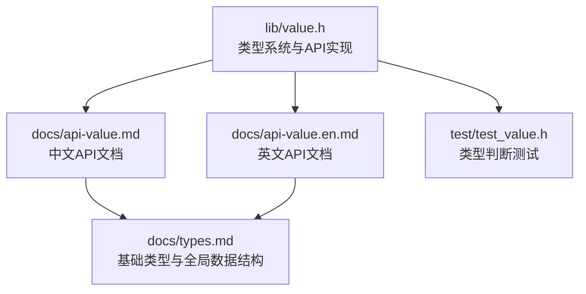
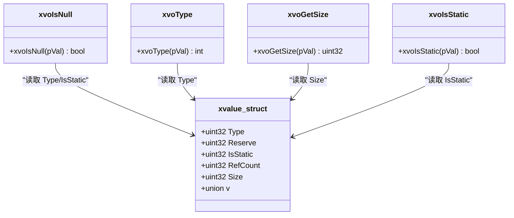
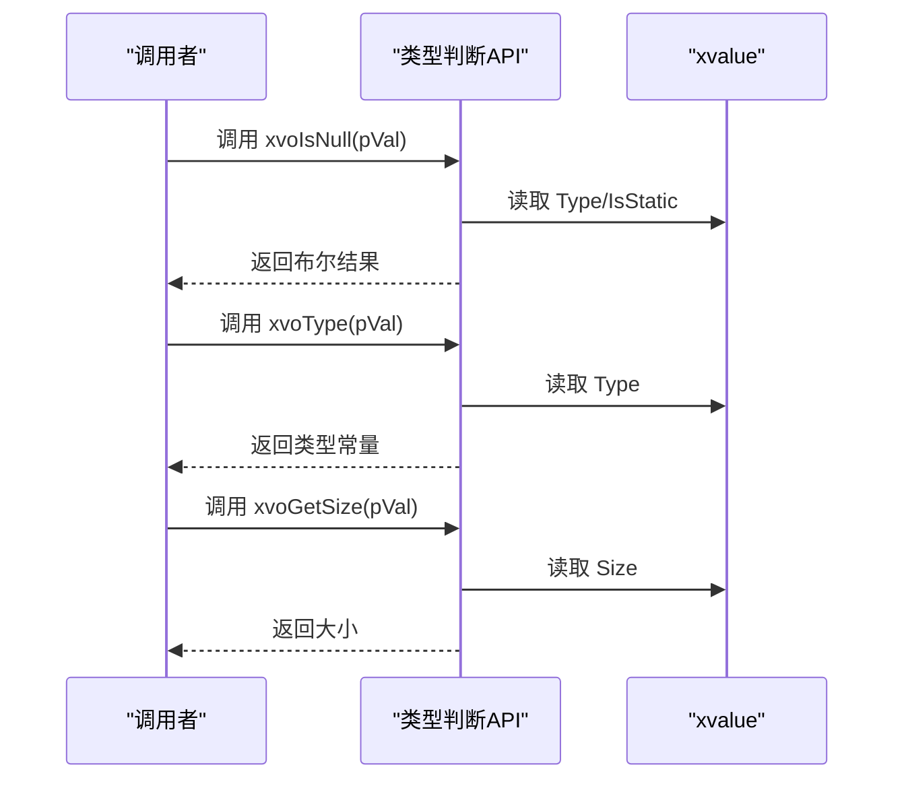
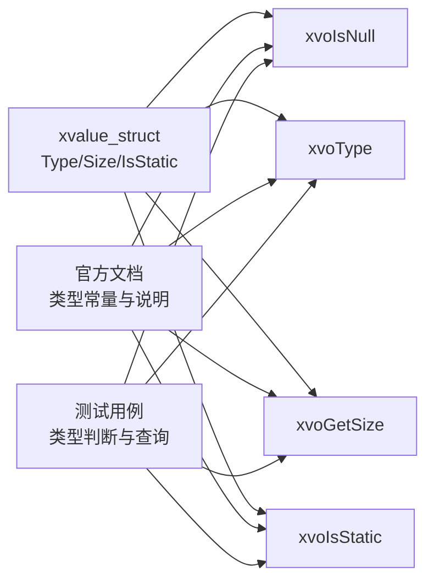

# 类型判断和查询

<cite>
**本文档引用的文件**
- [lib/value.h](file://lib/value.h)
- [docs/api-value.md](file://docs/api-value.md)
- [docs/api-value.en.md](file://docs/api-value.en.md)
- [test/test_value.h](file://test/test_value.h)
- [docs/types.md](file://docs/types.md)
</cite>

## 目录
1. [简介](#简介)
2. [项目结构](#项目结构)
3. [核心组件](#核心组件)
4. [架构总览](#架构总览)
5. [详细组件分析](#详细组件分析)
6. [依赖关系分析](#依赖关系分析)
7. [性能考量](#性能考量)
8. [故障排查指南](#故障排查指南)
9. [结论](#结论)
10. [附录](#附录)

## 简介
本章节面向“类型判断与查询”API，聚焦于以下函数：
- xvoIsNull：判断值是否为 NULL
- xvoType：获取值的类型常量
- xvoGetSize：获取值的数据大小
- xvoIsStatic：判断值是否为静态值（存在性验证）

同时，我们将系统阐述类型枚举常量的定义与含义，并给出在动态类型系统中进行类型检查的最佳实践与使用技巧，帮助开发者在进行类型转换前进行安全检查，避免运行时错误与资源泄漏。

## 项目结构
围绕类型判断与查询API，主要涉及以下文件：
- lib/value.h：类型系统与API实现（含类型判断与查询）
- docs/api-value.md / docs/api-value.en.md：官方API文档（含类型常量、使用示例与最佳实践）
- test/test_value.h：类型判断与查询的测试用例
- docs/types.md：基础类型与全局数据结构说明（辅助理解类型系统）

图表来源
- [lib/value.h](file://lib/value.h#L1290-L1320)
- [docs/api-value.md](file://docs/api-value.md#L25-L74)
- [docs/api-value.en.md](file://docs/api-value.en.md#L25-L74)
- [test/test_value.h](file://test/test_value.h#L573-L686)
- [docs/types.md](file://docs/types.md#L285-L328)

章节来源
- [lib/value.h](file://lib/value.h#L1290-L1320)
- [docs/api-value.md](file://docs/api-value.md#L25-L74)
- [docs/api-value.en.md](file://docs/api-value.en.md#L25-L74)
- [test/test_value.h](file://test/test_value.h#L573-L686)
- [docs/types.md](file://docs/types.md#L285-L328)

## 核心组件
本节概述类型判断与查询API的核心能力与职责：
- 类型判断函数
  - xvoIsNull：判断值是否为 NULL（空指针或类型为 NULL）
  - xvoType：返回值的类型常量（XVO_DT_*）
  - xvoGetSize：返回值的数据大小（TEXT返回字符串长度；CLASS返回结构体大小；其他类型返回固定大小）
  - xvoIsStatic：判断值是否为静态值（IsStatic标志）
- 类型枚举常量
  - XVO_DT_NULL、XVO_DT_BOOL、XVO_DT_INT、XVO_DT_FLOAT、XVO_DT_TEXT、XVO_DT_TIME、XVO_DT_POINT、XVO_DT_FUNC、XVO_DT_ARRAY、XVO_DT_LIST、XVO_DT_COLL、XVO_DT_TABLE、XVO_DT_CLASS、XVO_DT_CUSTOM
- 容器元素类型判断宏
  - xvoArrayItemType / xvoListItemType / xvoTableItemType
  - xvoArrayItemSize / xvoListItemSize / xvoTableItemSize

章节来源
- [lib/value.h](file://lib/value.h#L1290-L1320)
- [docs/api-value.md](file://docs/api-value.md#L27-L44)
- [docs/api-value.en.md](file://docs/api-value.en.md#L27-L44)
- [docs/api-value.md](file://docs/api-value.md#L525-L537)
- [docs/api-value.en.md](file://docs/api-value.en.md#L525-L537)

## 架构总览
类型系统以 xvalue 为核心载体，内部包含类型、静态标志、引用计数、大小与联合体数据域。类型判断与查询API围绕该结构展开，提供统一的类型识别与安全访问接口。

图表来源
- [lib/value.h](file://lib/value.h#L48-L70)
- [lib/value.h](file://lib/value.h#L1290-L1320)

章节来源
- [lib/value.h](file://lib/value.h#L48-L70)
- [lib/value.h](file://lib/value.h#L1290-L1320)

## 详细组件分析

### xvoIsNull：空值判断
- 用途：判断传入值是否为 NULL 或类型为 NULL
- 返回值：布尔值（TRUE/FALSE）
- 使用场景：
  - 在读取容器元素或函数返回值前进行安全检查
  - 避免对空值执行后续操作导致崩溃
- 示例参考：官方文档与测试用例均展示了其典型用法

章节来源
- [lib/value.h](file://lib/value.h#L1291-L1300)
- [docs/api-value.md](file://docs/api-value.md#L474-L484)
- [docs/api-value.en.md](file://docs/api-value.en.md#L474-L484)
- [test/test_value.h](file://test/test_value.h#L578-L586)

### xvoType：类型查询
- 用途：获取值的类型常量（XVO_DT_*）
- 返回值：类型常量（整数）
- 使用场景：
  - 在进行类型转换前，先确认目标类型
  - 在容器中遍历时，按元素类型分别处理
- 示例参考：官方文档提供了基本使用示例

章节来源
- [lib/value.h](file://lib/value.h#L1301-L1308)
- [docs/api-value.md](file://docs/api-value.md#L487-L505)
- [docs/api-value.en.md](file://docs/api-value.en.md#L487-L505)
- [test/test_value.h](file://test/test_value.h#L579-L686)

### xvoGetSize：数据大小查询
- 用途：获取值的数据大小
- 返回值：无符号32位整数
- 规则：
  - TEXT：返回字符串长度
  - CLASS：返回结构体大小
  - 其他类型：返回固定大小
- 使用场景：
  - 文本处理时获取长度
  - 类型为 CLASS 时了解结构体大小
  - 作为类型转换与内存管理的依据

章节来源
- [lib/value.h](file://lib/value.h#L1313-L1320)
- [docs/api-value.md](file://docs/api-value.md#L509-L522)
- [docs/api-value.en.md](file://docs/api-value.en.md#L509-L522)
- [test/test_value.h](file://test/test_value.h#L633-L635)
- [test/test_value.h](file://test/test_value.h#L676-L678)

### xvoIsStatic：静态值判断
- 用途：判断值是否为静态值（IsStatic标志）
- 返回值：布尔值（TRUE/FALSE）
- 使用场景：
  - 避免对静态值进行不必要的引用计数增减或释放
  - 在拷贝/深拷贝策略中区分基础类型与复杂类型
- 注意：该函数在仓库中存在，但官方文档未提供具体说明。建议结合 IsStatic 字段语义与静态值（如 NULL、BOOL）的特性使用

章节来源
- [lib/value.h](file://lib/value.h#L1290-L1320)
- [docs/api-value.md](file://docs/api-value.md#L48-L70)
- [docs/types.md](file://docs/types.md#L285-L328)

### 类型枚举常量定义与含义
- 常量定义（摘自官方文档）：
  - XVO_DT_NULL、XVO_DT_BOOL、XVO_DT_INT、XVO_DT_FLOAT、XVO_DT_TEXT、XVO_DT_TIME、XVO_DT_POINT、XVO_DT_FUNC、XVO_DT_ARRAY、XVO_DT_LIST、XVO_DT_COLL、XVO_DT_TABLE、XVO_DT_CLASS、XVO_DT_CUSTOM
- 含义要点：
  - NULL/BOOL 属于静态值，无需释放
  - TEXT/CLASS 的 Size 含义特殊（字符串长度/结构体大小）
  - 容器类型（ARRAY/LIST/COLL/TABLE）为复杂类型，需注意引用计数与拷贝策略

章节来源
- [docs/api-value.md](file://docs/api-value.md#L27-L44)
- [docs/api-value.en.md](file://docs/api-value.en.md#L27-L44)
- [docs/api-value.md](file://docs/api-value.md#L48-L70)
- [docs/types.md](file://docs/types.md#L285-L328)

### 容器元素类型判断宏
- 宏定义：
  - xvoArrayItemType / xvoListItemType / xvoTableItemType
  - xvoArrayItemSize / xvoListItemSize / xvoTableItemSize
- 用途：在容器中按元素索引或键获取元素值后，快速判断其类型与大小
- 使用场景：动态解析容器内容、类型分支处理、安全访问

章节来源
- [docs/api-value.md](file://docs/api-value.md#L525-L537)
- [docs/api-value.en.md](file://docs/api-value.en.md#L525-L537)

### 类型判断与查询的调用序列（示例）

图表来源
- [lib/value.h](file://lib/value.h#L1291-L1320)

## 依赖关系分析
- xvalue 结构体字段与类型判断API的耦合度高，xvoIsNull/xvoType/xvoGetSize/xvoIsStatic均直接读取 Type/Size/IsStatic
- 官方文档与测试用例共同验证了 API 的行为与预期
- 静态值（NULL/BOOL）与复杂类型（容器/CLASS/CUSTOM）在引用计数与释放策略上存在差异，类型判断是选择合适策略的关键

图表来源
- [lib/value.h](file://lib/value.h#L48-L70)
- [lib/value.h](file://lib/value.h#L1290-L1320)
- [docs/api-value.md](file://docs/api-value.md#L27-L44)
- [test/test_value.h](file://test/test_value.h#L573-L686)

章节来源
- [lib/value.h](file://lib/value.h#L48-L70)
- [lib/value.h](file://lib/value.h#L1290-L1320)
- [docs/api-value.md](file://docs/api-value.md#L27-L44)
- [test/test_value.h](file://test/test_value.h#L573-L686)

## 性能考量
- 类型判断与查询均为 O(1) 操作，直接读取结构体字段
- 静态值（NULL/BOOL）无需释放，可减少内存管理开销
- TEXT/CLASS 的 Size 查询在字符串与结构体场景下具有明确语义，有助于避免额外的字符串扫描或结构体遍历

## 故障排查指南
- 常见问题
  - 忘记在类型转换前进行类型判断，导致访问错误或崩溃
  - 对静态值执行不必要的引用计数增减或释放
  - 忽略容器元素的类型变化，导致运行时异常
- 排查步骤
  - 使用 xvoIsNull 进行空值检查
  - 使用 xvoType 确认类型，必要时配合容器元素类型宏
  - 使用 xvoGetSize 获取长度或结构体大小，辅助边界检查
  - 对静态值（IsStatic=TRUE）避免释放
- 参考测试用例
  - 测试覆盖了 NULL/BOOL/INT/FLOAT/TEXT/TIME/POINT/FUNC/CLASS/CUSTOM 等类型的基本判断与查询

章节来源
- [test/test_value.h](file://test/test_value.h#L573-L686)
- [docs/api-value.md](file://docs/api-value.md#L472-L537)

## 结论
类型判断与查询API是动态类型系统安全使用的基础。通过 xvoIsNull、xvoType、xvoGetSize、xvoIsStatic，开发者可以在类型转换前进行安全检查，避免运行时错误与资源泄漏。结合官方文档与测试用例，建议在实际开发中：
- 始终在访问前进行空值与类型检查
- 明确静态值与复杂类型的处理策略
- 在容器场景中使用元素类型宏进行快速判断
- 根据 Size 信息进行边界与内存管理决策

## 附录
- 类型枚举常量一览（摘自官方文档）
  - XVO_DT_NULL、XVO_DT_BOOL、XVO_DT_INT、XVO_DT_FLOAT、XVO_DT_TEXT、XVO_DT_TIME、XVO_DT_POINT、XVO_DT_FUNC、XVO_DT_ARRAY、XVO_DT_LIST、XVO_DT_COLL、XVO_DT_TABLE、XVO_DT_CLASS、XVO_DT_CUSTOM
- 官方示例与最佳实践
  - 参考官方文档中的示例与最佳实践章节，了解在动态数据容器中如何正确管理引用与类型转换

章节来源
- [docs/api-value.md](file://docs/api-value.md#L27-L44)
- [docs/api-value.en.md](file://docs/api-value.en.md#L27-L44)
- [docs/api-value.md](file://docs/api-value.md#L1166-L1221)