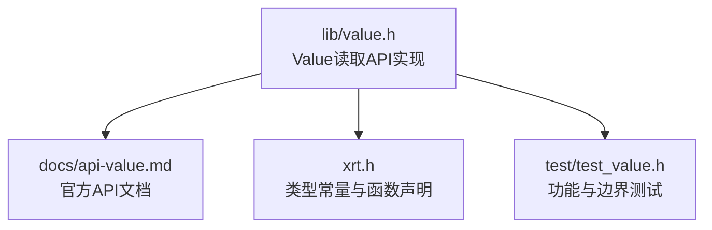
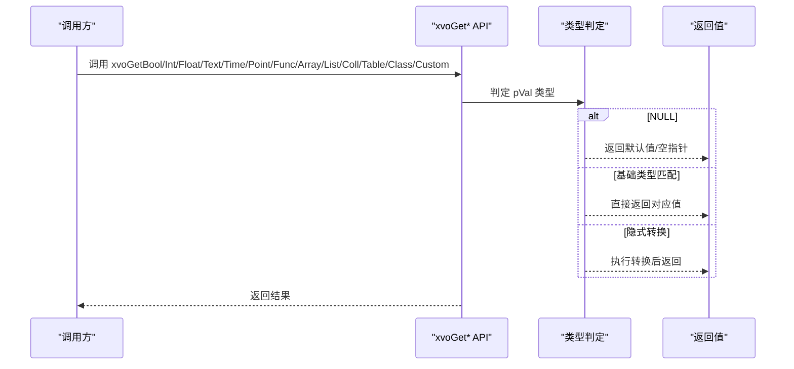
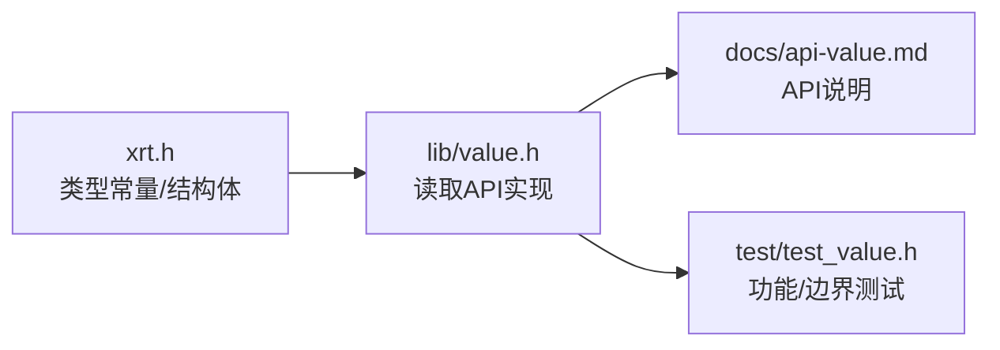

# 读取Value值

<cite>
**本文档引用的文件**
- [lib/value.h](file://lib/value.h)
- [docs/api-value.md](file://docs/api-value.md)
- [xrt.h](file://xrt.h)
- [test/test_value.h](file://test/test_value.h)
</cite>

## 目录
1. [简介](#简介)
2. [项目结构](#项目结构)
3. [核心组件](#核心组件)
4. [架构总览](#架构总览)
5. [详细组件分析](#详细组件分析)
6. [依赖关系分析](#依赖关系分析)
7. [性能考量](#性能考量)
8. [故障排查指南](#故障排查指南)
9. [结论](#结论)
10. [附录](#附录)

## 简介
本文件聚焦于Value动态类型系统的“读取Value值”API，系统性梳理以下读取函数：
- xvoGetBool、xvoGetInt、xvoGetFloat、xvoGetText、xvoGetTime、xvoGetPoint、xvoGetFunc
- xvoGetArray、xvoGetList、xvoGetColl、xvoGetTable、xvoGetClass、xvoGetCustom

内容涵盖：返回值类型、参数要求、类型转换规则、类型安全读取方法、错误处理策略、常见使用场景与最佳实践，以及隐式类型转换的行为与限制。

## 项目结构
Value系统位于lib/value.h，配套文档在docs/api-value.md，类型常量定义在xrt.h中，测试用例在test/test_value.h中。

图表来源
- [lib/value.h](file://lib/value.h#L320-L517)
- [docs/api-value.md](file://docs/api-value.md#L360-L470)
- [xrt.h](file://xrt.h#L1894-L1997)
- [test/test_value.h](file://test/test_value.h#L568-L687)

章节来源
- [lib/value.h](file://lib/value.h#L320-L517)
- [docs/api-value.md](file://docs/api-value.md#L360-L470)
- [xrt.h](file://xrt.h#L1894-L1997)

## 核心组件
- Value类型系统：16字节紧凑结构，包含类型标识、引用计数、静态标记、数据大小与联合体存储。
- 读取API：针对基础类型与容器类型分别提供读取函数，支持隐式类型转换与安全返回。

章节来源
- [docs/api-value.md](file://docs/api-value.md#L25-L74)
- [xrt.h](file://xrt.h#L1894-L1997)

## 架构总览
Value读取API采用“统一入口 + 条件分支”的设计，按输入值的类型执行相应读取逻辑，并在必要时进行隐式转换。对于容器类型，返回其底层数据结构指针；对于基础类型，返回对应C语言基本类型或字符串视图。

图表来源
- [lib/value.h](file://lib/value.h#L320-L517)

## 详细组件分析

### xvoGetBool
- 返回值类型：bool
- 参数要求：xvalue pVal（可为NULL）
- 类型转换规则：
  - NULL → FALSE
  - BOOL → 返回原值
  - INT → 非0为TRUE
  - FLOAT → 非0.0为TRUE
  - 其他类型 → TRUE
- 类型安全要点：
  - NULL输入不会崩溃，返回确定性默认值
  - 非BOOL类型隐式转换为布尔语义（非零即真）
- 错误处理策略：
  - 不抛异常，返回合理默认值
- 常见使用场景：
  - 配置开关、条件判断、状态查询
- 最佳实践：
  - 明确区分“显式false”与“默认false”，必要时先用xvoIsNull/xvoType确认

章节来源
- [lib/value.h](file://lib/value.h#L321-L334)
- [docs/api-value.md](file://docs/api-value.md#L362-L377)

### xvoGetInt
- 返回值类型：int64
- 参数要求：xvalue pVal（可为NULL）
- 类型转换规则：
  - NULL → 0
  - BOOL → 1 或 0
  - INT → 返回原值
  - FLOAT → 截断为整数
  - TEXT → 解析字符串
  - 其他 → 0
- 类型安全要点：
  - 浮点截断可能丢失精度
  - 文本解析失败返回0
- 错误处理策略：
  - 输入为空或无法解析时返回0
- 常见使用场景：
  - ID、计数、索引、标志位
- 最佳实践：
  - 对可能的浮点输入，考虑先用xvoGetFloat再做四舍五入
  - 对文本输入，建议先校验xvoType为TEXT

章节来源
- [lib/value.h](file://lib/value.h#L335-L350)
- [docs/api-value.md](file://docs/api-value.md#L380-L396)

### xvoGetFloat
- 返回值类型：double
- 参数要求：xvalue pVal（可为NULL）
- 类型转换规则：
  - NULL → 0.0
  - BOOL → 1.0 或 0.0
  - INT → 转换为浮点
  - FLOAT → 返回原值
  - TEXT → 解析字符串
  - 其他 → 0.0
- 类型安全要点：
  - 文本解析失败返回0.0
- 错误处理策略：
  - 输入为空或无法解析时返回0.0
- 常见使用场景：
  - 百分比、比率、科学计算
- 最佳实践：
  - 对可能的整数输入，注意精度范围
  - 对文本输入，建议先校验xvoType为TEXT

章节来源
- [lib/value.h](file://lib/value.h#L351-L366)
- [docs/api-value.md](file://docs/api-value.md#L399-L407)

### xvoGetText
- 返回值类型：字符串视图（非拥有）
- 参数要求：xvalue pVal（可为NULL）
- 类型转换规则：
  - NULL → 空字符串视图
  - TEXT → 返回原字符串视图
  - INT → 转换为十进制字符串
  - FLOAT → 转换为浮点字符串
  - BOOL → "true"/"false"
  - TIME → 格式化为"YYYY-MM-DD HH:MM:SS"
  - POINT/FUNC/ARRAY/LIST/COLL/TABLE/CLASS/CUSTOM → "[type:地址]"形式的描述字符串
  - 其他 → 空字符串视图
- 类型安全要点：
  - 非TEXT类型返回临时缓冲区中的字符串，无需释放
- 错误处理策略：
  - 输入为空或未知类型时返回空字符串视图
- 常见使用场景：
  - 日志输出、调试打印、UI显示
- 最佳实践：
  - 如需持久化字符串，使用xvoCreateText复制后再使用

章节来源
- [lib/value.h](file://lib/value.h#L367-L425)
- [docs/api-value.md](file://docs/api-value.md#L410-L420)

### xvoGetTime
- 返回值类型：xtime（时间类型）
- 参数要求：xvalue pVal（可为NULL）
- 类型转换规则：
  - NULL → 0
  - TIME → 返回原时间值
  - TEXT → 保留位（未来支持字符串到时间的转换）
  - 其他 → 0
- 类型安全要点：
  - 当前不支持TEXT到xtime的隐式转换
- 错误处理策略：
  - 输入为空或非TIME类型时返回0
- 常见使用场景：
  - 时间戳读取、时间格式化输出
- 最佳实践：
  - 若需从字符串解析时间，请使用专门的时间解析函数，再封装为xtime

章节来源
- [lib/value.h](file://lib/value.h#L426-L437)
- [docs/api-value.md](file://docs/api-value.md#L423-L431)

### xvoGetPoint
- 返回值类型：void*
- 参数要求：xvalue pVal（可为NULL）
- 类型转换规则：
  - NULL → NULL
  - POINT → 返回原指针
  - 其他 → NULL
- 类型安全要点：
  - 仅对POINT类型返回有效指针
- 错误处理策略：
  - 输入为空或非POINT类型时返回NULL
- 常见使用场景：
  - 回调参数传递、资源句柄访问
- 最佳实践：
  - 使用前务必用xvoType确认类型

章节来源
- [lib/value.h](file://lib/value.h#L438-L447)
- [docs/api-value.md](file://docs/api-value.md#L434-L442)

### xvoGetFunc
- 返回值类型：函数指针（xfunction）
- 参数要求：xvalue pVal（可为NULL）
- 类型转换规则：
  - NULL → NULL
  - FUNC → 返回原函数指针
  - 其他 → NULL
- 类型安全要点：
  - 仅对FUNC类型返回有效函数指针
- 错误处理策略：
  - 输入为空或非FUNC类型时返回NULL
- 常见使用场景：
  - 回调注册、事件处理
- 最佳实践：
  - 使用前务必用xvoType确认类型

章节来源
- [lib/value.h](file://lib/value.h#L448-L457)
- [docs/api-value.md](file://docs/api-value.md#L445-L453)

### xvoGetArray
- 返回值类型：xparray（数组底层结构）
- 参数要求：xvalue pVal（可为NULL）
- 类型转换规则：
  - NULL → NULL
  - ARRAY → 返回底层数组指针
  - 其他 → NULL
- 类型安全要点：
  - 返回底层容器指针，需谨慎使用
- 错误处理策略：
  - 输入为空或非ARRAY类型时返回NULL
- 常见使用场景：
  - 直接访问底层数组，避免逐项封装
- 最佳实践：
  - 优先使用xvoArrayGetValue等封装API，除非性能敏感

章节来源
- [lib/value.h](file://lib/value.h#L458-L467)
- [docs/api-value.md](file://docs/api-value.md#L456-L468)

### xvoGetList
- 返回值类型：xlist（列表底层结构）
- 参数要求：xvalue pVal（可为NULL）
- 类型转换规则：
  - NULL → NULL
  - LIST → 返回底层列表指针
  - 其他 → NULL
- 类型安全要点：
  - 返回底层容器指针，需谨慎使用
- 错误处理策略：
  - 输入为空或非LIST类型时返回NULL
- 常见使用场景：
  - 直接访问底层列表，避免逐项封装
- 最佳实践：
  - 优先使用xvoListGetValue等封装API，除非性能敏感

章节来源
- [lib/value.h](file://lib/value.h#L468-L477)
- [docs/api-value.md](file://docs/api-value.md#L456-L468)

### xvoGetColl
- 返回值类型：xavltree（集合底层结构）
- 参数要求：xvalue pVal（可为NULL）
- 类型转换规则：
  - NULL → NULL
  - COLL → 返回底层集合指针
  - 其他 → NULL
- 类型安全要点：
  - 返回底层容器指针，需谨慎使用
- 错误处理策略：
  - 输入为空或非COLL类型时返回NULL
- 常见使用场景：
  - 直接访问底层集合，避免逐项封装
- 最佳实践：
  - 优先使用集合专用API，除非性能敏感

章节来源
- [lib/value.h](file://lib/value.h#L478-L487)
- [docs/api-value.md](file://docs/api-value.md#L456-L468)

### xvoGetTable
- 返回值类型：xdict（表底层结构）
- 参数要求：xvalue pVal（可为NULL）
- 类型转换规则：
  - NULL → NULL
  - TABLE → 返回底层表指针
  - 其他 → NULL
- 类型安全要点：
  - 返回底层容器指针，需谨慎使用
- 错误处理策略：
  - 输入为空或非TABLE类型时返回NULL
- 常见使用场景：
  - 直接访问底层表，避免逐项封装
- 最佳实践：
  - 优先使用xvoTableGetValue等封装API，除非性能敏感

章节来源
- [lib/value.h](file://lib/value.h#L488-L497)
- [docs/api-value.md](file://docs/api-value.md#L456-L468)

### xvoGetClass
- 返回值类型：void*（类实例数据指针）
- 参数要求：xvalue pVal（可为NULL）
- 类型转换规则：
  - NULL → NULL
  - CLASS → 返回结构体数据指针
  - 其他 → NULL
- 类型安全要点：
  - 返回底层结构体数据指针，需配合已知结构体布局使用
- 错误处理策略：
  - 输入为空或非CLASS类型时返回NULL
- 常见使用场景：
  - 访问自定义结构体实例
- 最佳实践：
  - 使用前务必用xvoType确认类型，并确保结构体大小一致

章节来源
- [lib/value.h](file://lib/value.h#L498-L507)
- [docs/api-value.md](file://docs/api-value.md#L456-L468)

### xvoGetCustom
- 返回值类型：void*（自定义数据指针）
- 参数要求：xvalue pVal（可为NULL）
- 类型转换规则：
  - NULL → NULL
  - CUSTOM → 返回自定义数据指针
  - 其他 → NULL
- 类型安全要点：
  - 返回底层自定义数据指针，需配合已知数据布局使用
- 错误处理策略：
  - 输入为空或非CUSTOM类型时返回NULL
- 常见使用场景：
  - 访问自定义业务对象
- 最佳实践：
  - 使用前务必用xvoType确认类型，并确保数据生命周期

章节来源
- [lib/value.h](file://lib/value.h#L508-L517)
- [docs/api-value.md](file://docs/api-value.md#L456-L468)

## 依赖关系分析
- 类型常量与结构体定义：xrt.h提供XVO_DT_*类型常量与xvalue_struct结构体定义，是所有读取API的基础契约。
- 读取API实现：lib/value.h提供具体实现，严格遵循类型常量与结构体定义。
- 文档与测试：docs/api-value.md提供API说明与示例，test/test_value.h提供功能与边界测试，验证转换规则与错误处理。

图表来源
- [xrt.h](file://xrt.h#L1894-L1997)
- [lib/value.h](file://lib/value.h#L320-L517)
- [docs/api-value.md](file://docs/api-value.md#L360-L470)
- [test/test_value.h](file://test/test_value.h#L568-L687)

章节来源
- [xrt.h](file://xrt.h#L1894-L1997)
- [lib/value.h](file://lib/value.h#L320-L517)
- [docs/api-value.md](file://docs/api-value.md#L360-L470)
- [test/test_value.h](file://test/test_value.h#L568-L687)

## 性能考量
- 隐式转换成本：
  - xvoGetText对非TEXT类型进行格式化，涉及临时缓冲与格式化开销
  - xvoGetInt/xvoGetFloat对TEXT进行解析，涉及字符串解析开销
- 容器读取：
  - xvoGetArray/List/Coll/Table返回底层指针，避免额外封装，适合高性能路径
- 内存管理：
  - xvoGetText返回临时字符串视图，无需释放；其他返回值均为只读视图或指针
- 建议：
  - 对频繁读取且性能敏感的场景，优先使用底层指针访问
  - 对跨模块共享的字符串，使用xvoCreateText复制后使用

[本节为通用指导，不直接分析具体文件]

## 故障排查指南
- 常见问题与对策：
  - 读取结果不符合预期：检查xvoType确认类型，避免误用隐式转换
  - NULL输入导致的默认值：明确需求，必要时先用xvoIsNull/xvoType判断
  - 浮点截断与精度丢失：使用xvoGetFloat后自行处理精度
  - 文本解析失败：确认输入为TEXT类型，或先转换为TEXT
  - 容器指针使用不当：确保容器生命周期与引用计数管理
- 调试技巧：
  - 使用xvoPrintValue打印结构，快速定位类型与值
  - 使用xvoType/xvoGetSize辅助诊断

章节来源
- [docs/api-value.md](file://docs/api-value.md#L1052-L1090)
- [test/test_value.h](file://test/test_value.h#L568-L687)

## 结论
Value读取API提供了统一、安全且灵活的类型读取能力。通过明确的类型转换规则与完善的错误处理策略，开发者可以在保证类型安全的前提下，高效地从动态类型Value中提取所需数据。建议在实际开发中结合类型常量与底层容器指针，选择合适的读取路径，并遵循引用计数与生命周期管理的最佳实践。

[本节为总结性内容，不直接分析具体文件]

## 附录

### 类型转换规则速查
- xvoGetBool：NULL→FALSE；INT/BOOL→原值；FLOAT→非0.0即真；其他→TRUE
- xvoGetInt：NULL→0；BOOL→1/0；INT→原值；FLOAT→截断；TEXT→解析；其他→0
- xvoGetFloat：NULL→0.0；BOOL→1.0/0.0；INT→转换；FLOAT→原值；TEXT→解析；其他→0.0
- xvoGetText：NULL→空字符串；TEXT→原值；INT/BOOL/FLOAT→格式化；TIME→YYYY-MM-DD HH:MM:SS；POINT/FUNC/ARRAY/LIST/COLL/TABLE/CLASS/CUSTOM→"[type:地址]"
- xvoGetTime：NULL→0；TIME→原值；TEXT→保留（未来支持）；其他→0
- xvoGetPoint/Func/Array/List/Coll/Table/Class/Custom：仅对应类型返回有效指针，其他→NULL

章节来源
- [lib/value.h](file://lib/value.h#L321-L517)
- [docs/api-value.md](file://docs/api-value.md#L362-L431)