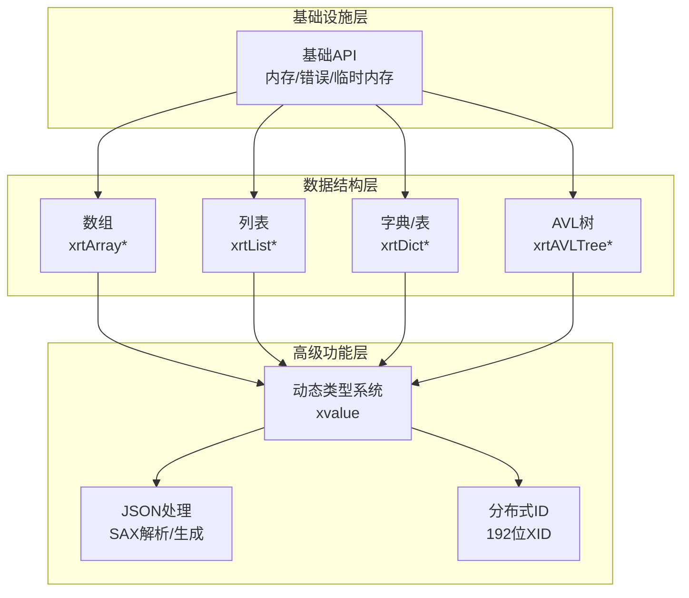
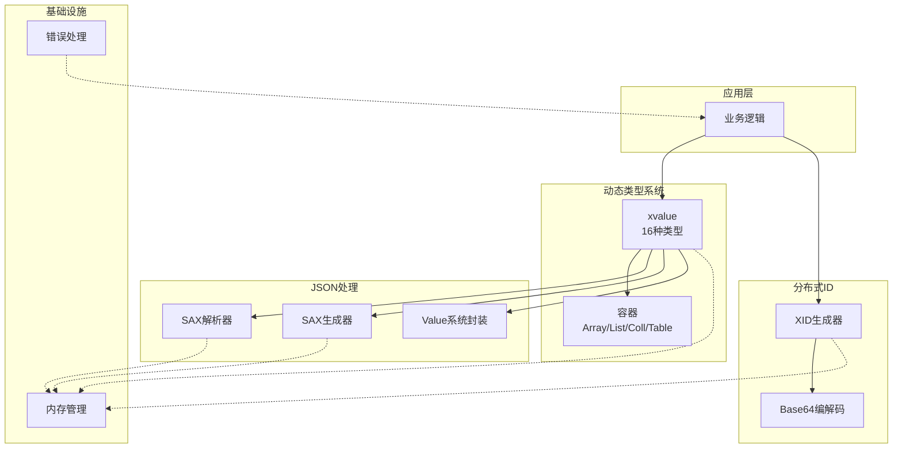
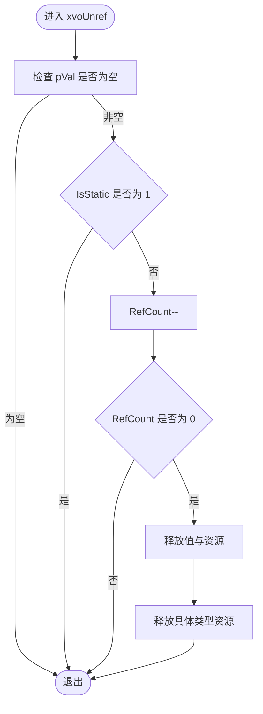
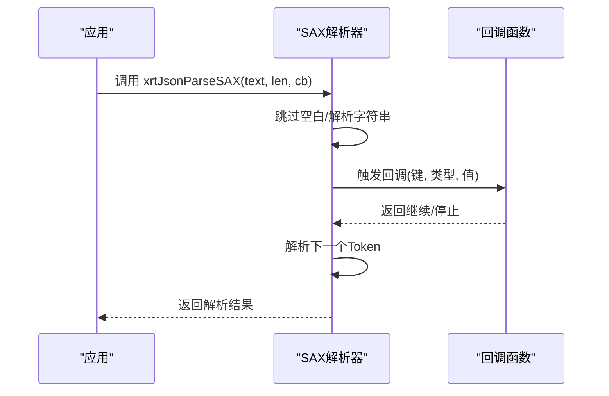
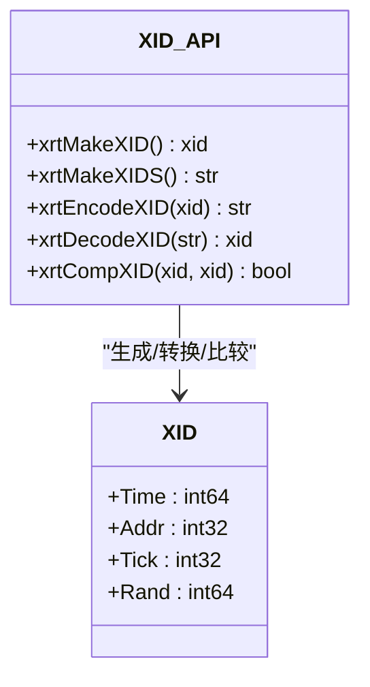
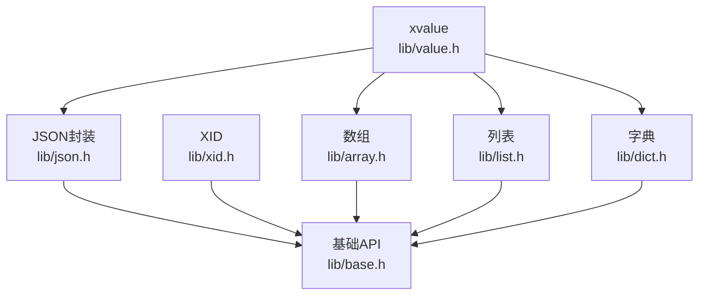

# 高级功能模块API

<cite>
**本文档引用的文件**
- [lib/value.h](file://lib/value.h)
- [lib/json.h](file://lib/json.h)
- [lib/xid.h](file://lib/xid.h)
- [docs/api-value.md](file://docs/api-value.md)
- [docs/api-json.md](file://docs/api-json.md)
- [docs/api-xid.md](file://docs/api-xid.md)
- [lib/base.h](file://lib/base.h)
- [lib/array.h](file://lib/array.h)
- [lib/dict.h](file://lib/dict.h)
- [lib/list.h](file://lib/list.h)
- [test/test_value.h](file://test/test_value.h)
- [test/test_json.h](file://test/test_json.h)
- [test/test_xid.h](file://test/test_xid.h)
</cite>

## 目录
1. [简介](#简介)
2. [项目结构](#项目结构)
3. [核心组件](#核心组件)
4. [架构概览](#架构概览)
5. [详细组件分析](#详细组件分析)
6. [依赖关系分析](#依赖关系分析)
7. [性能考量](#性能考量)
8. [故障排查指南](#故障排查指南)
9. [结论](#结论)
10. [附录](#附录)

## 简介
本文件面向高级功能模块API，重点覆盖以下三大核心能力：
- 动态类型系统（xvalue）：16种数据类型、引用计数机制、类型转换规则
- JSON处理（SAX模式解析）：事件驱动模式、无DOM开销优势、性能优化策略
- 分布式ID生成：192位设计、时间戳生成、IP地址集成、随机数生成机制

文档同时提供完整使用示例与最佳实践，帮助开发者在高性能与易用性之间取得平衡。

## 项目结构
该项目采用模块化设计，核心功能分布在以下层次：
- 基础设施层：内存管理、错误处理、平台抽象
- 数据结构层：数组、列表、字典、AVL树等容器
- 高级功能层：动态类型系统、JSON处理、分布式ID
- 文档与测试：官方API文档与单元测试样例

图表来源
- [lib/base.h](file://lib/base.h#L1-L132)
- [lib/array.h](file://lib/array.h#L1-L180)
- [lib/list.h](file://lib/list.h#L1-L188)
- [lib/dict.h](file://lib/dict.h#L1-L200)
- [lib/value.h](file://lib/value.h#L1-L800)
- [lib/json.h](file://lib/json.h#L1-L800)
- [lib/xid.h](file://lib/xid.h#L1-L75)

章节来源
- [lib/base.h](file://lib/base.h#L1-L132)
- [lib/array.h](file://lib/array.h#L1-L180)
- [lib/list.h](file://lib/list.h#L1-L188)
- [lib/dict.h](file://lib/dict.h#L1-L200)

## 核心组件
本节概述三大核心模块的功能定位与交互关系。

- 动态类型系统（xvalue）
  - 支持16种数据类型，统一的值包装与容器嵌套
  - 引用计数自动管理，避免内存泄漏
  - 提供丰富的类型转换与容器操作API

- JSON处理（SAX模式）
  - 事件驱动解析，无DOM开销，适合大文件与高性能场景
  - 提供SAX解析与生成器，以及基于Value系统的高层封装
  - 内置内存池与批量分配策略，降低碎片化

- 分布式ID（XID）
  - 192位（24字节）唯一ID，包含时间戳、IP地址、高精度计时与随机数
  - 支持Base64编码字符串形式，便于传输与存储
  - 无需中心协调，各节点独立生成，天然具备分布式安全性

章节来源
- [docs/api-value.md](file://docs/api-value.md#L1-L1238)
- [docs/api-json.md](file://docs/api-json.md#L1-L452)
- [docs/api-xid.md](file://docs/api-xid.md#L1-L541)

## 架构概览
下图展示了高级功能模块之间的架构关系与数据流向。

图表来源
- [lib/value.h](file://lib/value.h#L1-L800)
- [lib/json.h](file://lib/json.h#L1-L800)
- [lib/xid.h](file://lib/xid.h#L1-L75)
- [lib/base.h](file://lib/base.h#L1-L132)

## 详细组件分析

### 动态类型系统（xvalue）

#### 16种数据类型
- 基本类型：NULL、布尔、整数（int64）、浮点（double）、文本、时间
- 指针与函数：指针、函数指针
- 容器类型：数组、列表、集合（AVL树）、表（字典）、类（结构体容器）
- 自定义类型：保留用于扩展

类型系统设计要点：
- 统一的值包装结构，包含类型标识、引用计数、大小与联合体存储
- 静态单例管理：NULL、TRUE、FALSE，避免重复分配
- 容器类型支持嵌套，形成复合数据结构

章节来源
- [docs/api-value.md](file://docs/api-value.md#L25-L75)
- [lib/value.h](file://lib/value.h#L1-L120)

#### 引用计数机制
- 增加引用：xvoAddRef，内联版本性能更优
- 减少引用：xvoUnref，计数为0时自动释放
- 静态值（IsStatic=1）不会被释放
- 容器类型在销毁时递归释放子元素

图表来源
- [lib/value.h](file://lib/value.h#L59-L96)

章节来源
- [docs/api-value.md](file://docs/api-value.md#L78-L121)
- [lib/value.h](file://lib/value.h#L32-L96)

#### 类型转换规则
- 布尔转换：NULL→FALSE；BOOL→原值；INT/FLT非0→TRUE；其他→TRUE
- 整数转换：NULL→0；BOOL→1/0；INT→原值；FLT→截断；TEXT→解析
- 浮点转换：NULL→0.0；BOOL→1.0/0.0；INT→整数；TEXT→解析
- 文本转换：非TEXT类型返回临时字符串，无需释放

章节来源
- [docs/api-value.md](file://docs/api-value.md#L360-L470)
- [lib/value.h](file://lib/value.h#L321-L425)

#### 容器操作
- 数组（Array）：基于指针数组实现，支持动态扩容、插入、删除、排序
- 列表（List）：基于AVL树，键为int64，支持稀疏存储
- 集合（Coll）：基于AVL树，元素自动去重与排序
- 表（Table）：基于哈希表+AVL树，字符串键，支持快速查找

章节来源
- [docs/api-value.md](file://docs/api-value.md#L541-L800)
- [lib/array.h](file://lib/array.h#L1-L180)
- [lib/list.h](file://lib/list.h#L1-L188)
- [lib/dict.h](file://lib/dict.h#L1-L200)

#### 使用示例与最佳实践
- 使用便捷宏进行数组/列表/表操作，减少样板代码
- 在容器中存放xvalue时，注意托管模式（bColloc）与引用计数
- 对于大文本，优先使用托管模式以避免复制开销
- 容器销毁时会自动释放子元素，确保正确释放顺序

章节来源
- [docs/api-value.md](file://docs/api-value.md#L541-L800)
- [test/test_value.h](file://test/test_value.h#L1-L200)

### JSON处理（SAX模式解析）

#### SAX解析流程
- 输入：JSON字符串与长度
- 解析器：逐字符扫描，识别类型与边界
- 回调：遇到值或集合开始/结束时触发回调
- 输出：通过回调传递当前键、类型与值

图表来源
- [lib/json.h](file://lib/json.h#L118-L174)

章节来源
- [docs/api-json.md](file://docs/api-json.md#L82-L175)
- [lib/json.h](file://lib/json.h#L219-L236)

#### SAX生成器
- 打印器：维护栈结构跟踪数组/对象深度
- 值输出：根据类型输出null/bool/int/double/string/array/object
- 格式化控制：支持格式化与压缩输出
- 内存管理：内置内存池与增量扩容策略

章节来源
- [docs/api-json.md](file://docs/api-json.md#L177-L298)
- [lib/json.h](file://lib/json.h#L547-L791)

#### 无DOM开销优势
- 事件驱动：边解析边消费，无需构建完整DOM树
- 低内存占用：仅在当前节点上分配必要空间
- 高性能：避免二次遍历与大量中间对象

章节来源
- [docs/api-json.md](file://docs/api-json.md#L19-L26)

#### 性能优化策略
- 内存池：块内存节点统一申请与释放，减少碎片
- 手动展开循环：针对热点路径进行循环展开
- 字符转义表：快速判断与转义字符，减少分支
- 批量扩容：按需增长，避免过度分配

章节来源
- [lib/json.h](file://lib/json.h#L1-L136)
- [lib/json.h](file://lib/json.h#L295-L324)
- [lib/json.h](file://lib/json.h#L326-L358)

#### 使用示例与最佳实践
- 大文件解析：优先使用SAX解析，避免一次性加载
- 压缩输出：生产环境建议使用压缩输出以节省带宽
- 字符串处理：使用xrtJsonUpdateStringInfo自动计算长度与转义标记
- 错误处理：回调返回JSON_SAX_PARSE_STOP可提前终止解析

章节来源
- [docs/api-json.md](file://docs/api-json.md#L177-L298)
- [test/test_json.h](file://test/test_json.h#L1-L105)

### 分布式ID（XID）

#### 192位设计
- 结构组成：时间戳（64位）、IP地址（32位）、高精度计时（32位）、随机数（64位）
- 唯一性保障：时间+IP+计时+随机数四要素组合
- 时间有序：包含精确时间戳，天然支持排序
- URL安全：Base64编码字符集包含URL安全字符

图表来源
- [lib/xid.h](file://lib/xid.h#L24-L75)
- [docs/api-xid.md](file://docs/api-xid.md#L20-L62)

章节来源
- [docs/api-xid.md](file://docs/api-xid.md#L20-L62)
- [lib/xid.h](file://lib/xid.h#L1-L75)

#### 时间戳生成与IP地址集成
- 时间戳：使用xrtNow获取秒级时间
- 高精度计时：Windows使用QueryPerformanceCounter，Linux使用clock_gettime
- IP地址：通过xCore.LocalAddr获取本机IP（网络初始化时填充）

章节来源
- [lib/xid.h](file://lib/xid.h#L27-L47)
- [docs/api-xid.md](file://docs/api-xid.md#L105-L109)

#### 随机数生成机制
- 随机数：使用xrtRand64生成64位随机数
- 编码：Base64编码字符集包含数字、字母与特殊字符，输出32字符
- 安全性：结合时间戳与IP，碰撞概率极低

章节来源
- [lib/xid.h](file://lib/xid.h#L4-L8)
- [docs/api-xid.md](file://docs/api-xid.md#L205-L209)

#### 使用示例与最佳实践
- 订单号生成：直接使用xrtMakeXIDS生成32字符字符串
- 分布式追踪：为每个请求生成trace_id与span_id
- 数据库主键：作为表主键，天然具备全局唯一性
- 临时文件名：结合格式化函数生成唯一文件名

章节来源
- [docs/api-xid.md](file://docs/api-xid.md#L326-L462)
- [test/test_xid.h](file://test/test_xid.h#L1-L23)

## 依赖关系分析

图表来源
- [lib/value.h](file://lib/value.h#L1-L800)
- [lib/json.h](file://lib/json.h#L1-L800)
- [lib/xid.h](file://lib/xid.h#L1-L75)
- [lib/base.h](file://lib/base.h#L1-L132)
- [lib/array.h](file://lib/array.h#L1-L180)
- [lib/list.h](file://lib/list.h#L1-L188)
- [lib/dict.h](file://lib/dict.h#L1-L200)

章节来源
- [lib/value.h](file://lib/value.h#L1-L800)
- [lib/json.h](file://lib/json.h#L1-L800)
- [lib/xid.h](file://lib/xid.h#L1-L75)

## 性能考量
- 动态类型系统
  - 引用计数避免GC开销，但需注意正确的引用管理
  - 容器类型采用紧凑布局，减少指针间接访问
  - 静态单例（NULL/TRUE/FALSE）避免重复分配

- JSON处理
  - SAX模式无DOM开销，适合大文件与流式处理
  - 内存池与批量分配降低碎片化与系统调用次数
  - 手动循环展开与字符转义表提升解析速度

- 分布式ID
  - 192位设计显著降低碰撞概率
  - 高精度计时与随机数增强唯一性
  - Base64编码便于传输与存储

## 故障排查指南
- 内存泄漏
  - 确认所有xvalue在使用完毕后调用xvoUnref
  - 容器销毁时会自动释放子元素，但需确保引用计数正确

- JSON解析错误
  - 检查回调返回值，确保在错误情况下返回JSON_SAX_PARSE_STOP
  - 使用xrtJsonUpdateStringInfo更新字符串信息，避免转义问题

- XID生成异常
  - 确保已调用xrtInit初始化网络与随机数
  - 若xCore.LocalAddr为0，Addr字段将为0，影响唯一性

章节来源
- [lib/base.h](file://lib/base.h#L88-L132)
- [lib/json.h](file://lib/json.h#L144-L163)
- [docs/api-xid.md](file://docs/api-xid.md#L499-L522)

## 结论
本高级功能模块API提供了：
- 高效且易用的动态类型系统，支持复杂数据结构与自动内存管理
- 面向性能的JSON SAX处理，满足大文件与实时场景需求
- 安全可靠的分布式ID生成，适用于订单号、追踪ID、数据库主键等场景

通过合理的API选择与最佳实践，可在保证性能的同时提升开发效率与系统稳定性。

## 附录
- 官方文档索引
  - [Value 动态类型系统](docs/api-value.md)
  - [JSON 处理库](docs/api-json.md)
  - [XID 分布式ID库](docs/api-xid.md)

- 测试参考
  - [Value 测试样例](test/test_value.h)
  - [JSON 测试样例](test/test_json.h)
  - [XID 测试样例](test/test_xid.h)