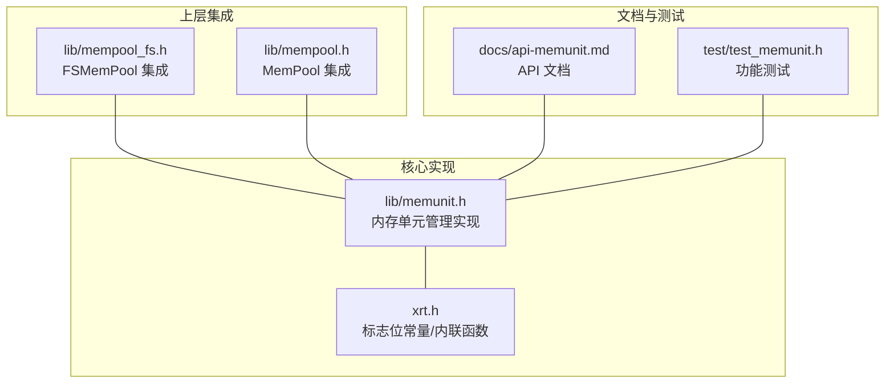
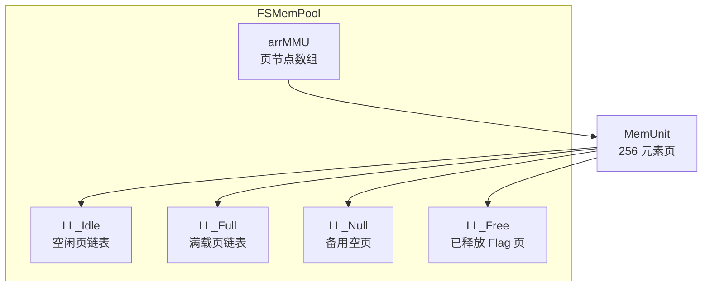
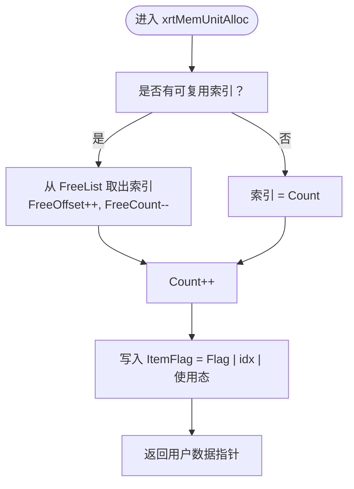
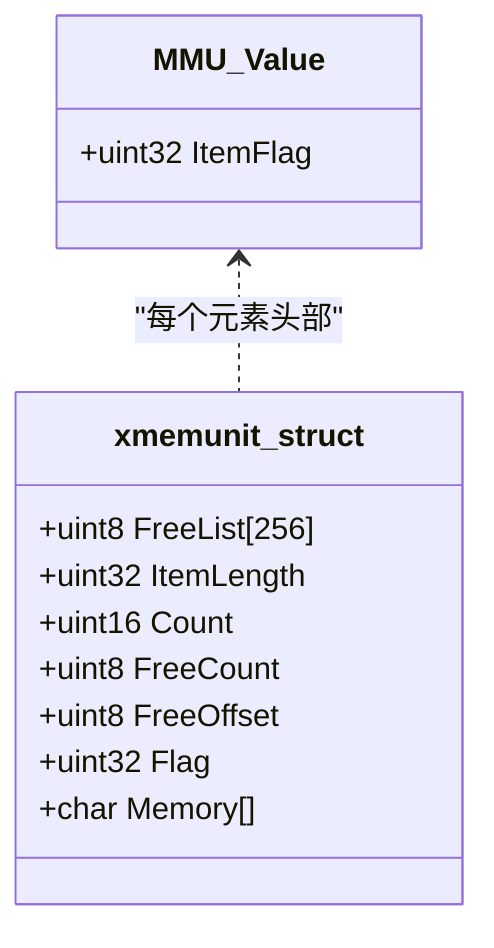
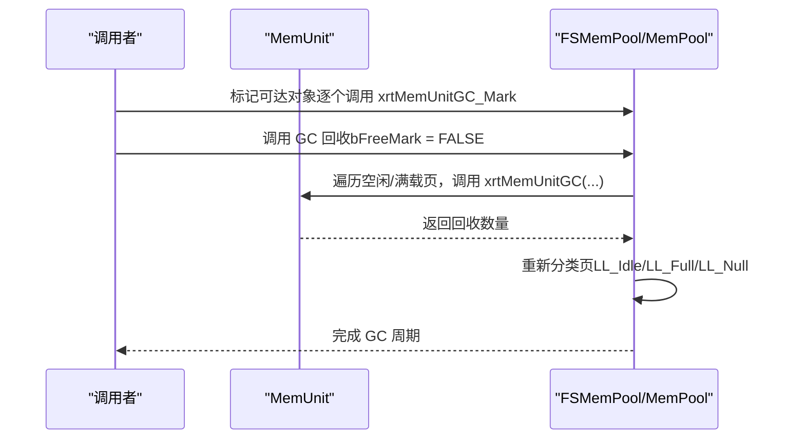
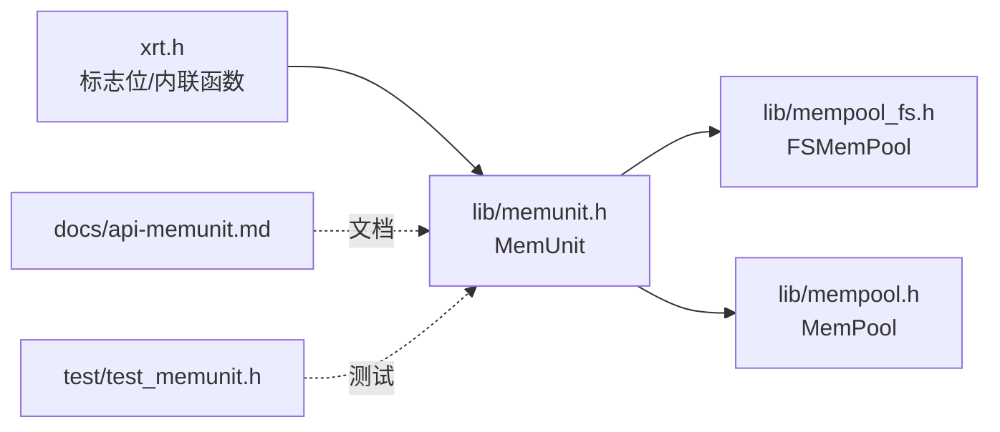

# 内存单元管理

<cite>
**本文引用的文件**
- [lib/memunit.h](file://lib/memunit.h)
- [docs/api-memunit.md](file://docs/api-memunit.md)
- [xrt.h](file://xrt.h)
- [lib/mempool_fs.h](file://lib/mempool_fs.h)
- [lib/mempool.h](file://lib/mempool.h)
- [test/test_memunit.h](file://test/test_memunit.h)
</cite>

## 目录
1. [简介](#简介)
2. [项目结构](#项目结构)
3. [核心组件](#核心组件)
4. [架构总览](#架构总览)
5. [详细组件分析](#详细组件分析)
6. [依赖关系分析](#依赖关系分析)
7. [性能考量](#性能考量)
8. [故障排查指南](#故障排查指南)
9. [结论](#结论)
10. [附录](#附录)

## 简介
本文件系统化阐述 MemUnit 内存单元管理模块的设计与实现，重点覆盖：
- 256 元素固定页的内存单元划分与组织方式
- 标志位字段（包含使用态、GC 标记、索引）的布局与作用
- GC 标记-清除流程与批量回收策略
- 性能特性（时间复杂度、内存利用率、碎片化控制）
- 引用计数系统的使用注意事项与最佳实践

MemUnit 是 FSMemPool 与 MemPool 的底层基础组件，每个单元管理 256 个固定大小元素，提供 O(1) 的分配与释放，并内置 GC 支持以实现标记-清除回收。

## 项目结构
围绕 MemUnit 的相关代码与文档分布如下：
- 核心实现与接口定义：lib/memunit.h
- API 文档与设计说明：docs/api-memunit.md
- 标志位常量与内联函数声明：xrt.h
- 上层集成（FSMemPool）：lib/mempool_fs.h
- 上层集成（MemPool）：lib/mempool.h
- 单元测试：test/test_memunit.h

图表来源
- [lib/memunit.h](file://lib/memunit.h#L1-L143)
- [xrt.h](file://xrt.h#L1263-L1287)
- [lib/mempool_fs.h](file://lib/mempool_fs.h#L1-L257)
- [lib/mempool.h](file://lib/mempool.h#L1-L468)
- [docs/api-memunit.md](file://docs/api-memunit.md#L1-L662)
- [test/test_memunit.h](file://test/test_memunit.h#L1-L253)

章节来源
- [lib/memunit.h](file://lib/memunit.h#L1-L143)
- [docs/api-memunit.md](file://docs/api-memunit.md#L1-L662)

## 核心组件
- 内存单元结构（xmemunit_struct）：包含环形空闲列表、元素长度、计数、Flag 前缀与连续内存块。
- 标志位结构（MMU_Value）：每个元素头部 4 字节，承载使用态、GC 标记与索引。
- 关键 API：
  - 创建/销毁：xrtMemUnitCreate/xrtMemUnitDestroy
  - 分配/释放：xrtMemUnitAlloc/xrtMemUnitFree/xrtMemUnitFreeIdx
  - GC：xrtMemUnitGC（标记-清除）、xrtMemUnitGC_Mark（标记）

章节来源
- [lib/memunit.h](file://lib/memunit.h#L5-L143)
- [xrt.h](file://xrt.h#L1263-L1287)
- [docs/api-memunit.md](file://docs/api-memunit.md#L82-L130)

## 架构总览
MemUnit 作为“页”级容器，每页 256 个元素；FSMemPool/MemPool 通过链表管理多个 MemUnit 页，实现更大规模的对象池化与 GC 协调。

图表来源
- [lib/mempool_fs.h](file://lib/mempool_fs.h#L1342-L1357)
- [lib/mempool.h](file://lib/mempool.h#L1-L145)

章节来源
- [lib/mempool_fs.h](file://lib/mempool_fs.h#L1342-L1357)
- [lib/mempool.h](file://lib/mempool.h#L1-L145)

## 详细组件分析

### 256 元素页管理机制
- 每个 MemUnit 管理 256 个元素，元素大小为“用户请求长度 + 4 字节标志位”。
- 内存布局：
  - 头部：FreeList[256]、ItemLength、Count、FreeCount、FreeOffset、Flag
  - 数据区：Memory[]，按 ItemLength 步长存放 256 个元素
- 分配策略：
  - 优先复用 FreeList 中的已释放索引，否则在 Count 位置分配新元素
  - 分配后在元素头部写入标志位：Flag 前缀 | 索引 | 使用态
- 释放策略：
  - 将索引写入 FreeList（环形队列），更新 FreeCount/FreeOffset
  - 若 Count 归零，重置 FreeCount/FreeOffset，便于后续快速复用

图表来源
- [lib/memunit.h](file://lib/memunit.h#L22-L41)

章节来源
- [lib/memunit.h](file://lib/memunit.h#L5-L143)
- [docs/api-memunit.md](file://docs/api-memunit.md#L34-L52)

### 标志位与索引布局
- ItemFlag（32 位）：
  - 使用态位（最高位）：标识元素是否正在使用
  - GC 标记位（次高位）：GC 标记/清除阶段使用
  - 索引域（低 8 位）：元素在页内的索引（0-255）
  - Flag 前缀（中间位段）：由上层管理器下发，用于定位页与去重
- 访问索引：通过 ItemFlag & 0xFF 获取
- 标记宏：xrtMemUnitGC_Mark(p) 设置 GC 标记位

图表来源
- [xrt.h](file://xrt.h#L1263-L1287)
- [docs/api-memunit.md](file://docs/api-memunit.md#L60-L78)

章节来源
- [xrt.h](file://xrt.h#L1263-L1287)
- [docs/api-memunit.md](file://docs/api-memunit.md#L60-L78)

### GC 标记-清除算法
- 标记阶段：遍历可达对象，对每个对象调用 xrtMemUnitGC_Mark(p)，设置 GC 标记位
- 清除阶段：调用 xrtMemUnitGC(objUnit, FALSE) 回收未标记元素，同时清除保留元素的 GC 标记
- 批量回收优化：
  - MemPool/FSMemPool 对空闲与满载页统一遍历，减少重复扫描
  - 清理后重新分类：空页进入 LL_Null，非空页进入 LL_Idle/LL_Full

图表来源
- [lib/mempool_fs.h](file://lib/mempool_fs.h#L224-L254)
- [lib/mempool.h](file://lib/mempool.h#L430-L465)
- [lib/memunit.h](file://lib/memunit.h#L88-L140)

章节来源
- [lib/memunit.h](file://lib/memunit.h#L88-L140)
- [lib/mempool_fs.h](file://lib/mempool_fs.h#L224-L254)
- [lib/mempool.h](file://lib/mempool.h#L430-L465)
- [docs/api-memunit.md](file://docs/api-memunit.md#L378-L437)

### 引用计数系统与使用注意事项
- 仓库未实现基于引用计数的自动回收，仅提供 GC 标记 API 与流程。因此：
  - 不要将“引用计数”与“GC 标记”混为一谈
  - 引用计数通常用于跟踪对象生命周期，而 MemUnit 的 GC 是显式标记-清除
- 使用建议：
  - 明确 GC 周期边界，集中标记后再统一回收
  - 释放对象时确保不再持有其指针，避免悬挂引用
  - 对于需要跨页共享的对象，谨慎使用 Flag 前缀，避免冲突
  - 在高并发场景下，尽量减少跨页遍历 GC 的频率

章节来源
- [docs/api-memunit.md](file://docs/api-memunit.md#L525-L632)
- [xrt.h](file://xrt.h#L1275-L1276)

## 依赖关系分析
- MemUnit 依赖：
  - 标志位常量与内联函数：xrt.h
  - 上层池化管理器：FSMemPool、MemPool
- 上层依赖：
  - FSMemPool：通过链表管理页，统一触发 GC 并做页分类
  - MemPool：在大内存块层面也采用类似的 GC 标记-清除策略

图表来源
- [xrt.h](file://xrt.h#L1263-L1287)
- [lib/memunit.h](file://lib/memunit.h#L1-L143)
- [lib/mempool_fs.h](file://lib/mempool_fs.h#L1-L257)
- [lib/mempool.h](file://lib/mempool.h#L1-L468)
- [docs/api-memunit.md](file://docs/api-memunit.md#L1-L662)
- [test/test_memunit.h](file://test/test_memunit.h#L1-L253)

章节来源
- [lib/mempool_fs.h](file://lib/mempool_fs.h#L1-L257)
- [lib/mempool.h](file://lib/mempool.h#L1-L468)

## 性能考量
- 时间复杂度
  - 分配/释放：O(1)，基于环形空闲列表与计数器
  - GC：对单页 O(N)（N=256），上层池化管理器统一遍历所有页
- 内存利用率
  - 每元素固定 4 字节头部，适合小对象池化
  - 通过复用已释放索引降低碎片化
- 碎片化控制
  - 256 元素页内连续存储，天然避免内部碎片
  - 页粒度的空闲页与满载页分类，减少跨页碎片
- 批量回收优化
  - 上层统一触发 GC，减少多次遍历带来的开销
  - 清理后立即重分类，保持页状态稳定

章节来源
- [docs/api-memunit.md](file://docs/api-memunit.md#L26-L32)
- [lib/mempool_fs.h](file://lib/mempool_fs.h#L224-L254)
- [lib/mempool.h](file://lib/mempool.h#L430-L465)

## 故障排查指南
- 常见问题与定位
  - 分配失败：检查 Count 是否已达 256，或传入的 objUnit 是否为 NULL
  - 释放失败：确认元素确实处于使用态（使用态位），且指针有效
  - GC 未回收：确认是否正确标记，以及是否在正确的 GC 周期内调用
  - 索引错误：通过 ItemFlag & 0xFF 获取索引，避免手动计算
- 单元测试参考
  - 测试覆盖了创建、分配、释放、复用、满载等关键路径，可对照验证行为

章节来源
- [lib/memunit.h](file://lib/memunit.h#L22-L140)
- [test/test_memunit.h](file://test/test_memunit.h#L12-L253)

## 结论
MemUnit 提供了高效、稳定的 256 元素页级内存管理能力，具备 O(1) 的分配/释放与完善的 GC 支持。通过上层池化管理器的统一调度与批量回收，整体在小对象池化场景下具有良好的吞吐与稳定性。需要注意的是，该模块不包含自动引用计数机制，GC 依赖显式标记-清除流程，应在业务层明确生命周期与标记策略。

## 附录
- API 速查
  - 创建/销毁：xrtMemUnitCreate/xrtMemUnitDestroy
  - 分配/释放：xrtMemUnitAlloc/xrtMemUnitFree/xrtMemUnitFreeIdx
  - GC：xrtMemUnitGC（标记-清除）、xrtMemUnitGC_Mark（标记）
- 相关文档与测试
  - API 文档：docs/api-memunit.md
  - 单元测试：test/test_memunit.h