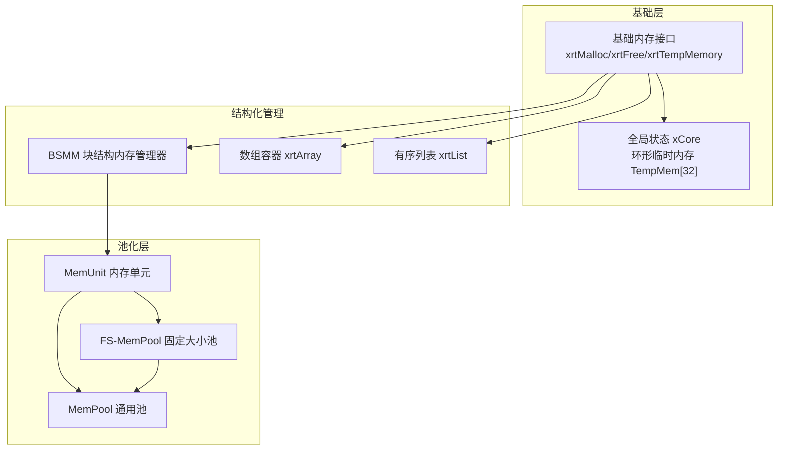
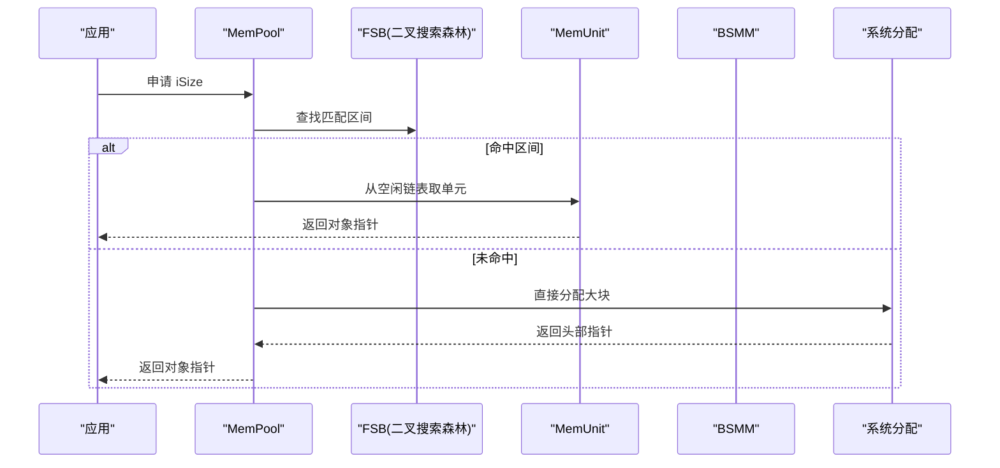
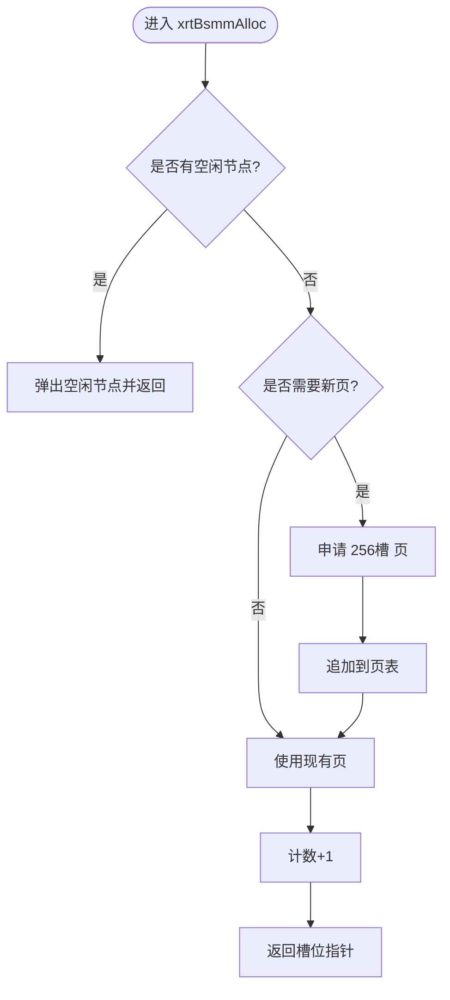
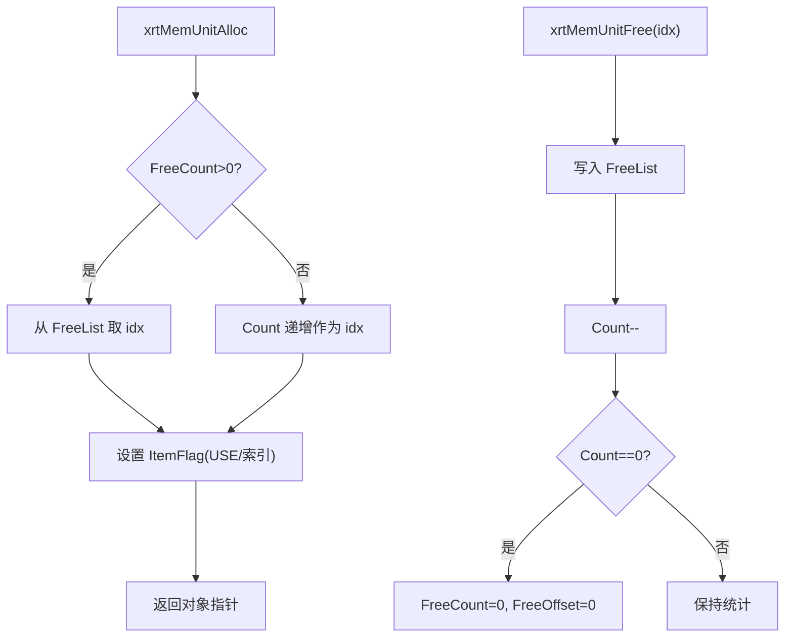
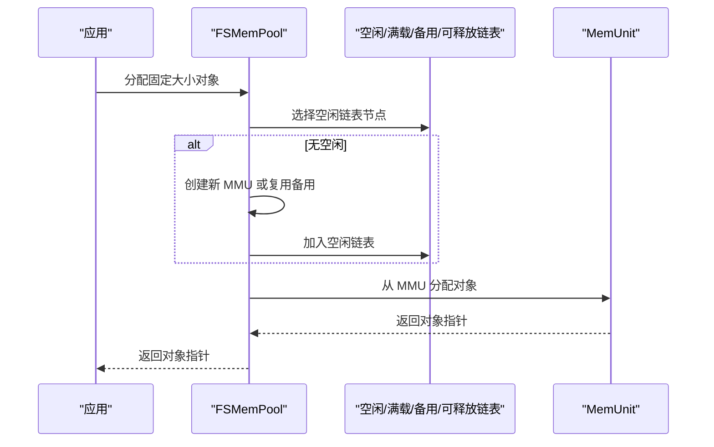
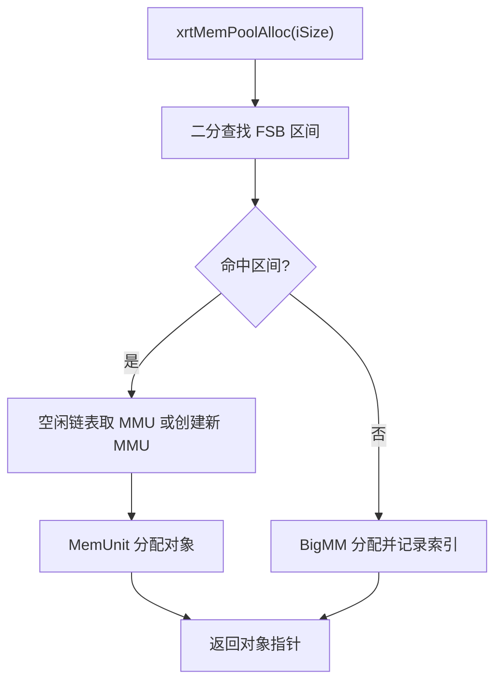
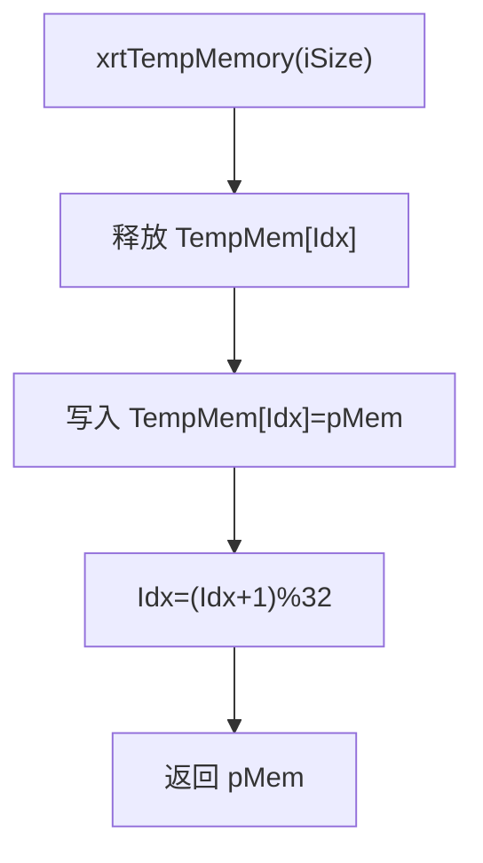
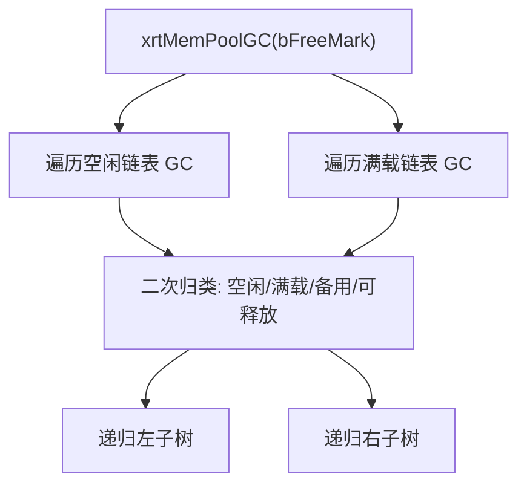
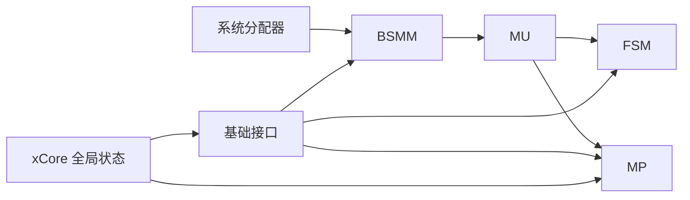

# 内存管理

<cite>
**本文档引用的文件**
- [lib/memunit.h](file://lib/memunit.h)
- [lib/mempool.h](file://lib/mempool.h)
- [lib/mempool_fs.h](file://lib/mempool_fs.h)
- [lib/bsmm.h](file://lib/bsmm.h)
- [lib/base.h](file://lib/base.h)
- [lib/xid.h](file://lib/xid.h)
- [lib/array.h](file://lib/array.h)
- [lib/list.h](file://lib/list.h)
- [xrt.h](file://xrt.h)
- [test/test_memunit.h](file://test/test_memunit.h)
- [test/test_mempool.h](file://test/test_mempool.h)
- [test/test_mempool_fs.h](file://test/test_mempool_fs.h)
- [test/test_bsmm.h](file://test/test_bsmm.h)
</cite>

## 目录
1. [简介](#简介)
2. [项目结构](#项目结构)
3. [核心组件](#核心组件)
4. [架构总览](#架构总览)
5. [详细组件分析](#详细组件分析)
6. [依赖关系分析](#依赖关系分析)
7. [性能考量](#性能考量)
8. [故障排查指南](#故障排查指南)
9. [结论](#结论)
10. [附录](#附录)

## 简介
本文件系统性梳理 XRT 内存管理子系统，重点阐述多级内存池架构的设计理念与实现细节，涵盖：
- BSMM 块结构内存管理
- MemUnit 内存单元管理
- FS-MemPool 固定大小内存池
- MemPool 通用内存池的协同工作机制
- 32 槽位环形临时内存的自动释放机制
- 26 位引用计数的内存管理策略
- GC 标记回收的垃圾收集算法
- 内存分配与释放最佳实践、性能优化技巧与内存泄漏预防
- 内存使用模式分析与调试工具使用指南

## 项目结构
XRT 内存管理相关模块主要位于 lib 目录，配合基础内存接口与全局状态，形成“底层分配 → 结构化管理 → 池化复用 → 标记回收”的完整闭环。

图表来源
- [lib/base.h](file://lib/base.h#L5-L84)
- [xrt.h](file://xrt.h#L156-L181)
- [lib/bsmm.h](file://lib/bsmm.h#L5-L94)
- [lib/array.h](file://lib/array.h#L5-L40)
- [lib/list.h](file://lib/list.h#L19-L47)
- [lib/memunit.h](file://lib/memunit.h#L5-L143)
- [lib/mempool_fs.h](file://lib/mempool_fs.h#L5-L50)
- [lib/mempool.h](file://lib/mempool.h#L5-L40)

章节来源
- [lib/base.h](file://lib/base.h#L5-L84)
- [xrt.h](file://xrt.h#L156-L181)
- [lib/bsmm.h](file://lib/bsmm.h#L5-L94)
- [lib/array.h](file://lib/array.h#L5-L40)
- [lib/list.h](file://lib/list.h#L19-L47)
- [lib/memunit.h](file://lib/memunit.h#L5-L143)
- [lib/mempool_fs.h](file://lib/mempool_fs.h#L5-L50)
- [lib/mempool.h](file://lib/mempool.h#L5-L40)

## 核心组件
- 基础内存接口与全局状态
  - 提供统一的内存分配/释放入口，并内置 32 槽位环形临时内存，按索引轮转释放过期内存。
- BSMM 块结构内存管理器
  - 以固定块大小批量分配，支持空闲节点链表复用，适合频繁创建/销毁的小对象。
- MemUnit 内存单元
  - 在固定大小块内进一步细分为最多 256 个槽位，带自由列表与回收机制，支持 GC 标记回收。
- FS-MemPool 固定大小内存池
  - 面向固定尺寸对象的池化分配，内部以 BSMM 管理 MMU 链表，空闲/满载/备用/可释放链表协同。
- MemPool 通用内存池
  - 面向可变尺寸对象，采用二叉搜索森林（FSB）+ BSMM + MemUnit 的多级组织，兼顾小/大块场景。
- 标记回收与引用计数
  - 通过 26 位标志位承载“使用/标记/GC/扩展”等状态，结合 GC 遍历与链表迁移实现高效回收。

章节来源
- [lib/base.h](file://lib/base.h#L5-L84)
- [lib/bsmm.h](file://lib/bsmm.h#L5-L94)
- [lib/memunit.h](file://lib/memunit.h#L5-L143)
- [lib/mempool_fs.h](file://lib/mempool_fs.h#L5-L50)
- [lib/mempool.h](file://lib/mempool.h#L5-L40)

## 架构总览
XRT 内存管理采用“块结构 → 单元 → 池 → 回收”的分层设计，确保小对象高频分配的低开销与大对象的稳定管理。

图表来源
- [lib/mempool.h](file://lib/mempool.h#L148-L261)
- [lib/mempool_fs.h](file://lib/mempool_fs.h#L52-L125)
- [lib/bsmm.h](file://lib/bsmm.h#L52-L82)

章节来源
- [lib/mempool.h](file://lib/mempool.h#L148-L261)
- [lib/mempool_fs.h](file://lib/mempool_fs.h#L52-L125)
- [lib/bsmm.h](file://lib/bsmm.h#L52-L82)

## 详细组件分析

### BSMM 块结构内存管理器
- 设计要点
  - 以 256 个槽位为一页的连续内存块，通过数组页表管理，减少碎片。
  - 空闲节点链表复用，避免频繁系统调用。
- 关键流程
  - 分配：优先从空闲链表取节点；若无空闲且页表未满，则申请新页。
  - 释放：将节点加入空闲链表，延迟真正释放。
- 性能特征
  - O(1) 分配/释放均摊复杂度；页表增长步长可控，降低扩容次数。

图表来源
- [lib/bsmm.h](file://lib/bsmm.h#L52-L82)

章节来源
- [lib/bsmm.h](file://lib/bsmm.h#L5-L94)

### MemUnit 内存单元
- 设计要点
  - 将固定大小块划分为最多 256 个槽位，每个槽位前部附加 4 字节元数据（含使用/标记/索引）。
  - 自由列表（FreeList）按环形队列管理，优先复用已释放槽位。
- 关键流程
  - 分配：优先从 FreeList 取最小可用索引；否则按顺序分配。
  - 释放：写入槽位元数据，加入 FreeList，必要时清空/复位统计。
  - GC：按标记位回收“被标记/未标记”的槽位，支持两阶段回收与链表重分类。
- 性能特征
  - 256 槽上限简化了边界管理；环形自由列表避免频繁扫描。

图表来源
- [lib/memunit.h](file://lib/memunit.h#L22-L86)
- [lib/memunit.h](file://lib/memunit.h#L89-L140)

章节来源
- [lib/memunit.h](file://lib/memunit.h#L5-L143)

### FS-MemPool 固定大小内存池
- 设计要点
  - 面向固定尺寸对象，内部以 BSMM 管理 MMU 链表，维护空闲/满载/备用/可释放四类链表。
  - 分配优先使用空闲单元；接近满载时迁移到满载链表；清空时可进入备用或可释放链表。
- 关键流程
  - 分配：从空闲链表取 MMU，再从 MemUnit 分配对象。
  - 释放：定位 MMU 与槽位索引，写入标志，必要时迁移链表。
  - GC：遍历空闲/满载链表，按标记位回收并重分类。

图表来源
- [lib/mempool_fs.h](file://lib/mempool_fs.h#L52-L125)
- [lib/mempool_fs.h](file://lib/mempool_fs.h#L128-L221)
- [lib/mempool_fs.h](file://lib/mempool_fs.h#L224-L254)

章节来源
- [lib/mempool_fs.h](file://lib/mempool_fs.h#L5-L257)

### MemPool 通用内存池
- 设计要点
  - 采用二叉搜索森林（FSB）组织区间，按请求大小选择最合适的区间，再由对应 MemUnit 提供槽位。
  - 对超出区间的大对象，使用扩展位与独立 BigMM 列表管理，支持复用与回收。
- 关键流程
  - 分配：二分查找区间 → 选择/创建 MMU → MemUnit 分配 → 大对象走扩展路径。
  - 释放：根据标志位判断路径，回收至 MemUnit 或 BigMM 的可释放链表。
  - GC：递归遍历 FSB 下所有空闲/满载 MMU，按标记位回收；随后对 BigMM 执行相同逻辑。

图表来源
- [lib/mempool.h](file://lib/mempool.h#L148-L261)
- [lib/mempool.h](file://lib/mempool.h#L335-L385)
- [lib/mempool.h](file://lib/mempool.h#L427-L465)

章节来源
- [lib/mempool.h](file://lib/mempool.h#L5-L468)

### 32 槽位环形临时内存与自动释放机制
- 设计要点
  - 全局 xCore.TempMem[32] 作为环形缓冲，每次 xrtTempMemory 会先释放当前槽位的旧内存，再写入新指针并推进索引。
  - xrtFreeTempMemory 一次性清空所有槽位。
- 使用建议
  - 适用于短期临时数据，避免长期持有导致内存占用膨胀。
  - 注意线程不安全，多线程需自行同步。

图表来源
- [lib/base.h](file://lib/base.h#L50-L84)
- [xrt.h](file://xrt.h#L156-L158)

章节来源
- [lib/base.h](file://lib/base.h#L50-L84)
- [xrt.h](file://xrt.h#L156-L158)

### 26 位引用计数与内存管理策略
- 设计要点
  - 通过 4 字节元数据的高位承载“使用/标记/GC/扩展”等标志位，低位承载槽位索引与单元标识。
  - 标志位掩码用于快速判断对象类型与状态，避免额外查询。
- 实践建议
  - 将“扩展位”用于区分大对象路径，减少分支判断成本。
  - 合理利用“标记位”进行 GC 回收，避免误删活跃对象。

章节来源
- [lib/mempool.h](file://lib/mempool.h#L335-L385)
- [lib/mempool_fs.h](file://lib/mempool_fs.h#L199-L221)
- [lib/memunit.h](file://lib/memunit.h#L38-L40)

### GC 标记回收算法
- 设计要点
  - 遍历空闲/满载链表，按“回收被标记/未标记”的策略清理对象。
  - 清理后对链表进行二次归类，将清空单元移入备用或可释放链表，或将满载单元迁回空闲。
- 性能特征
  - 递归遍历 FSB，时间复杂度与单元数量线性相关；通过链表迁移减少后续分配压力。

图表来源
- [lib/mempool.h](file://lib/mempool.h#L427-L465)
- [lib/mempool_fs.h](file://lib/mempool_fs.h#L224-L254)

章节来源
- [lib/mempool.h](file://lib/mempool.h#L387-L465)
- [lib/mempool_fs.h](file://lib/mempool_fs.h#L224-L254)

## 依赖关系分析
- 组件耦合
  - MemPool/FSMemPool 依赖 BSMM 提供页级分配与空闲节点复用。
  - MemUnit 依赖 BSMM 的页表与空闲链表，实现槽位级分配。
  - 基础接口 xrtMalloc/xrtFree/xrtTempMemory 为上层提供统一入口。
- 外部依赖
  - 系统分配器（malloc/calloc/realloc/free）作为最终落点。
  - 全局 xCore 提供错误回调与临时内存管理。

图表来源
- [lib/base.h](file://lib/base.h#L5-L45)
- [xrt.h](file://xrt.h#L156-L181)
- [lib/bsmm.h](file://lib/bsmm.h#L5-L94)
- [lib/memunit.h](file://lib/memunit.h#L5-L143)
- [lib/mempool_fs.h](file://lib/mempool_fs.h#L5-L50)
- [lib/mempool.h](file://lib/mempool.h#L5-L40)

章节来源
- [lib/base.h](file://lib/base.h#L5-L45)
- [xrt.h](file://xrt.h#L156-L181)
- [lib/bsmm.h](file://lib/bsmm.h#L5-L94)
- [lib/memunit.h](file://lib/memunit.h#L5-L143)
- [lib/mempool_fs.h](file://lib/mempool_fs.h#L5-L50)
- [lib/mempool.h](file://lib/mempool.h#L5-L40)

## 性能考量
- 分配路径优化
  - 优先使用空闲链表与自由列表，避免系统分配。
  - MemUnit 槽位上限与环形自由列表减少扫描成本。
- 大对象处理
  - 通过扩展位与 BigMM 列表复用，避免频繁系统调用。
- GC 策略
  - 两阶段回收（遍历+归类）降低后续分配的碎片风险。
- 临时内存
  - 32 槽位环形释放避免长期驻留，适合短生命周期数据。

[本节为通用指导，无需列出具体文件来源]

## 故障排查指南
- 常见问题
  - 分配失败：检查系统内存与错误回调；确认池化链表是否异常。
  - 释放错误：核对标志位与索引一致性；确保未重复释放。
  - GC 误删：确认标记位设置与回收策略；避免提前释放被标记对象。
- 调试工具
  - 测试用例提供了完整的分配/释放/回收流程验证，可对照观察链表状态与计数变化。
  - 使用全局错误接口查看最近一次错误信息。

章节来源
- [lib/base.h](file://lib/base.h#L89-L132)
- [test/test_memunit.h](file://test/test_memunit.h#L12-L253)
- [test/test_mempool.h](file://test/test_mempool.h#L25-L187)
- [test/test_mempool_fs.h](file://test/test_mempool_fs.h#L12-L832)
- [test/test_bsmm.h](file://test/test_bsmm.h#L12-L434)

## 结论
XRT 内存管理通过“块结构 → 单元 → 池 → 回收”的分层设计，在保证小对象高频分配低开销的同时，兼顾大对象的稳定管理与回收效率。32 槽位环形临时内存与 26 位标志位策略进一步提升了易用性与性能。遵循本文最佳实践与调试方法，可在多数场景下获得稳定、高效的内存使用体验。

[本节为总结性内容，无需列出具体文件来源]

## 附录

### 最佳实践与注意事项
- 优先使用池化接口（FSMemPool/MemPool）管理固定/可变尺寸对象。
- 避免长期持有临时内存；及时调用释放或等待下一次轮转覆盖。
- 合理设置 GC 标记，避免误删活跃对象；定期执行 GC 降低碎片。
- 控制对象生命周期，防止跨作用域误用已释放指针。

[本节为通用指导，无需列出具体文件来源]