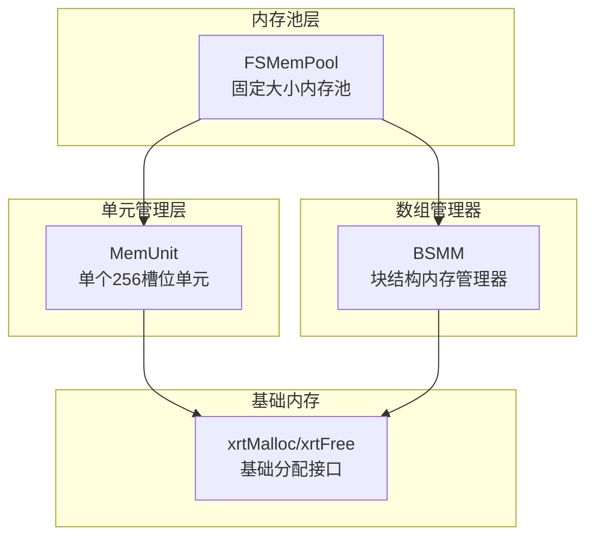
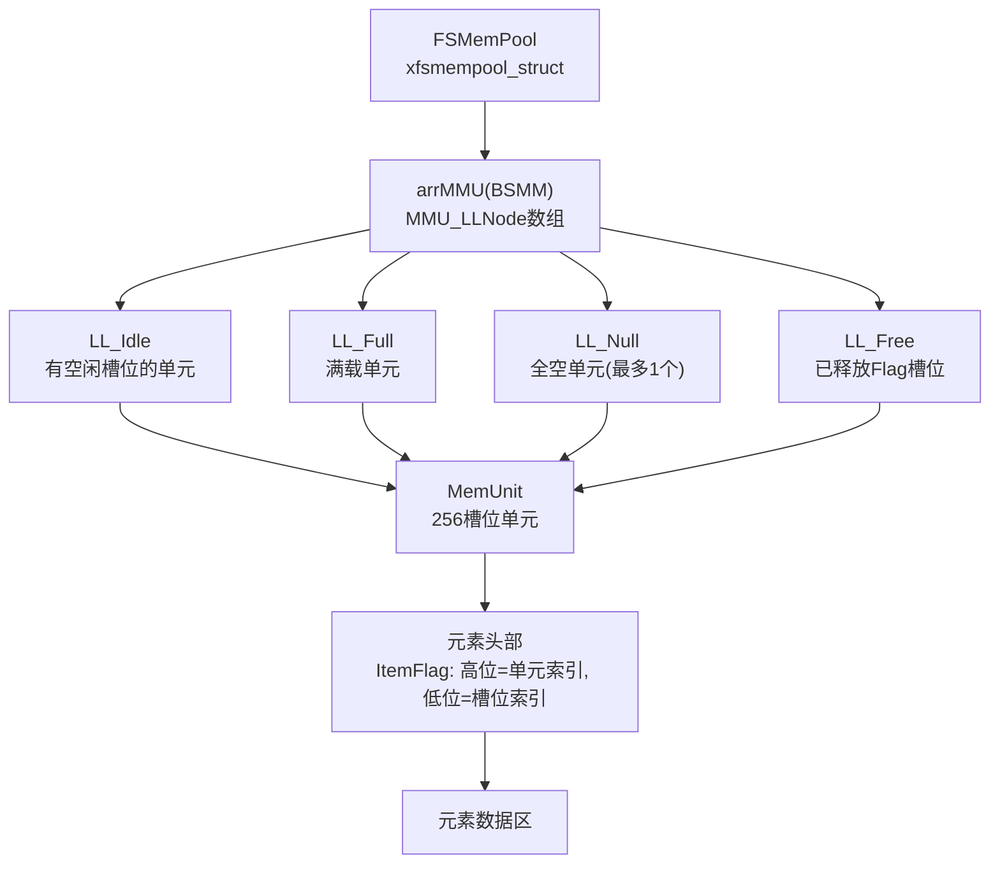
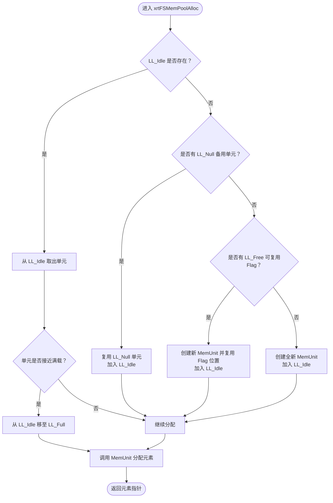
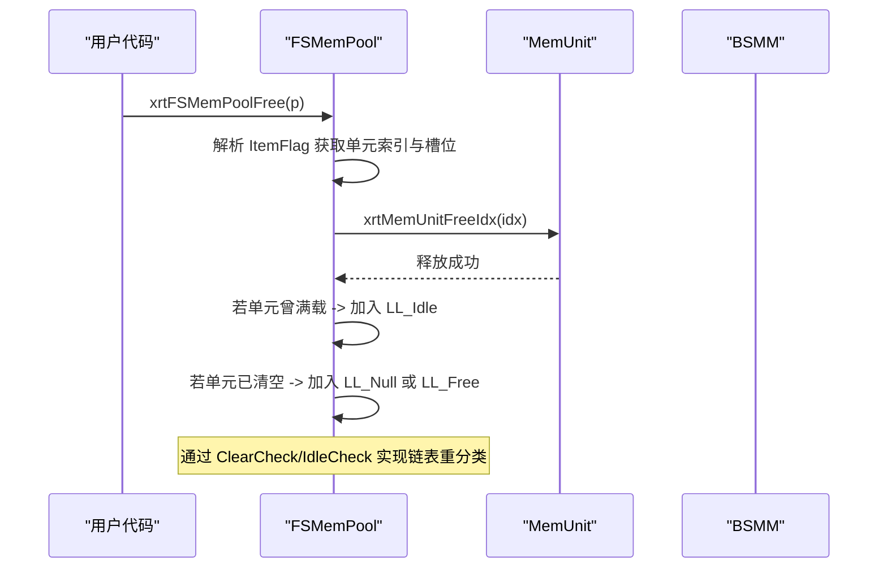
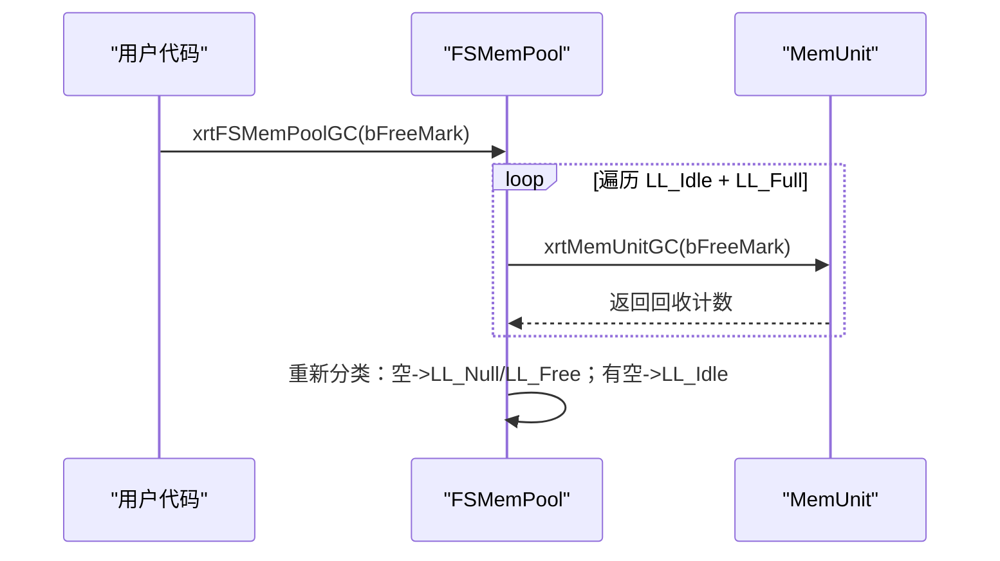
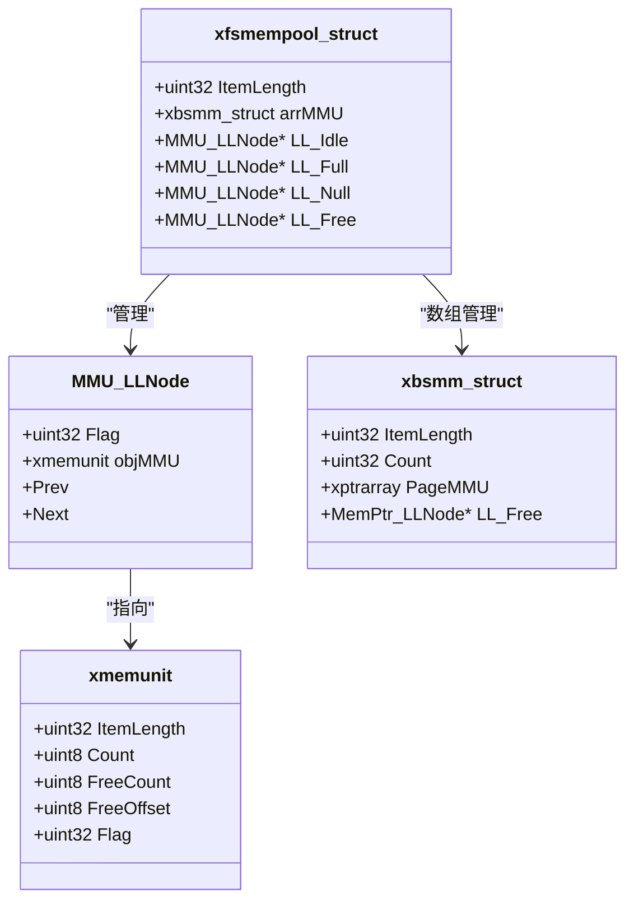
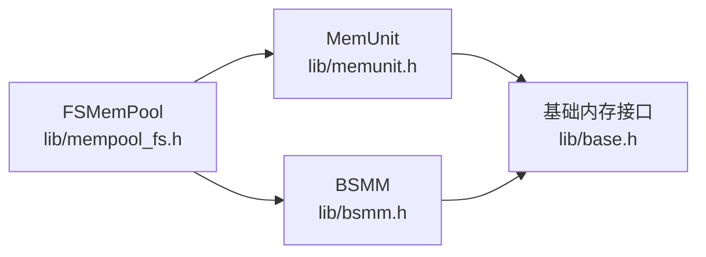

# 固定大小内存池(FSMemPool)

<cite>
**本文档引用的文件**
- [lib/mempool_fs.h](file://lib/mempool_fs.h)
- [lib/memunit.h](file://lib/memunit.h)
- [lib/bsmm.h](file://lib/bsmm.h)
- [lib/base.h](file://lib/base.h)
- [docs/api-mempool-fs.md](file://docs/api-mempool-fs.md)
- [test/test_mempool_fs.h](file://test/test_mempool_fs.h)
</cite>

## 目录
1. [简介](#简介)
2. [项目结构](#项目结构)
3. [核心组件](#核心组件)
4. [架构总览](#架构总览)
5. [详细组件分析](#详细组件分析)
6. [依赖关系分析](#依赖关系分析)
7. [性能考量](#性能考量)
8. [故障排查指南](#故障排查指南)
9. [结论](#结论)
10. [附录](#附录)

## 简介
FSMemPool 是基于 MemUnit 的高性能固定大小对象内存池，专为“频繁分配/释放、对象大小固定”的场景设计，具备以下关键特性：
- 无限容量：通过 BSMM 动态扩展，无 256 限制
- 四链表分组：Idle/Full/Null/Free 分类管理 MemUnit，提升分配效率
- O(1) 分配：大多数情况下常数时间分配
- 智能复用：空单元缓存，避免临界状态抖动
- GC 支持：支持标记-清除垃圾回收

## 项目结构
FSMemPool 的实现位于 lib 目录，配合 MemUnit、BSMM、基础内存接口等模块协同工作。

**图表来源**
- [lib/mempool_fs.h](file://lib/mempool_fs.h#L1-L257)
- [lib/memunit.h](file://lib/memunit.h#L1-L143)
- [lib/bsmm.h](file://lib/bsmm.h#L1-L94)
- [lib/base.h](file://lib/base.h#L1-L132)

**章节来源**
- [lib/mempool_fs.h](file://lib/mempool_fs.h#L1-L257)
- [lib/memunit.h](file://lib/memunit.h#L1-L143)
- [lib/bsmm.h](file://lib/bsmm.h#L1-L94)
- [lib/base.h](file://lib/base.h#L1-L132)

## 核心组件
- xfsmempool_struct：FSMemPool 的核心结构，包含：
  - ItemLength：元素大小
  - arrMMU：MMU_LLNode 数组管理器（由 BSMM 提供）
  - LL_Idle/LL_Full/LL_Null/LL_Free：四类 MemUnit 链表
- MMU_LLNode：MemUnit 的链表节点，保存 Flag、objMMU 指针及双向链接
- MemUnit：单个 256 槽位的内存单元，负责具体元素的分配/释放
- BSMM：块结构内存管理器，按需分配内存页并管理空闲块

**章节来源**
- [lib/mempool_fs.h](file://lib/mempool_fs.h#L97-L123)
- [lib/memunit.h](file://lib/memunit.h#L77-L89)
- [lib/bsmm.h](file://lib/bsmm.h#L24-L30)

## 架构总览
FSMemPool 的整体架构围绕“四链表 + MemUnit + BSMM”展开，通过 Flag 位域在元素头部存储所属单元与槽位索引，实现 O(1) 快速定位与释放。

**图表来源**
- [lib/mempool_fs.h](file://lib/mempool_fs.h#L24-L33)
- [lib/memunit.h](file://lib/memunit.h#L38-L41)
- [lib/bsmm.h](file://lib/bsmm.h#L52-L82)

## 详细组件分析

### 分配算法与四链表策略
FSMemPool 的分配遵循“优先空闲、其次备用、最后新建”的策略，并在满载/清空前进行链表重分类，以维持高效访问。

**图表来源**
- [lib/mempool_fs.h](file://lib/mempool_fs.h#L52-L125)

**章节来源**
- [lib/mempool_fs.h](file://lib/mempool_fs.h#L52-L125)

### 释放与回收机制
释放时通过元素头部的 ItemFlag 快速定位所属 MemUnit 与槽位索引，随后调用 MemUnit 的释放逻辑，并根据单元状态将其移动到 Idle/Null/Free 链表。

**图表来源**
- [lib/mempool_fs.h](file://lib/mempool_fs.h#L199-L221)
- [lib/memunit.h](file://lib/memunit.h#L44-L86)

**章节来源**
- [lib/mempool_fs.h](file://lib/mempool_fs.h#L199-L221)
- [lib/memunit.h](file://lib/memunit.h#L44-L86)

### GC 回收流程
FSMemPool 支持 GC 标记-清除，遍历 Idle/Full 链表对 MemUnit 执行 GC，再根据单元剩余计数进行链表重分类。

**图表来源**
- [lib/mempool_fs.h](file://lib/mempool_fs.h#L224-L254)
- [lib/memunit.h](file://lib/memunit.h#L89-L140)

**章节来源**
- [lib/mempool_fs.h](file://lib/mempool_fs.h#L224-L254)
- [lib/memunit.h](file://lib/memunit.h#L89-L140)

### 内存块预分配与池大小确定
- MemUnit 预分配：每个 MemUnit 固定 256 个槽位，元素头部额外 4 字节用于 ItemFlag
- BSMM 扩展：当 arrMMU 的可用槽位不足时，BSMM 按步长 64 申请新的内存页
- 池大小上限：理论上无上限，受系统内存限制

**图表来源**
- [lib/mempool_fs.h](file://lib/mempool_fs.h#L97-L123)
- [lib/memunit.h](file://lib/memunit.h#L5-L19)
- [lib/bsmm.h](file://lib/bsmm.h#L24-L30)

**章节来源**
- [lib/mempool_fs.h](file://lib/mempool_fs.h#L24-L33)
- [lib/memunit.h](file://lib/memunit.h#L5-L19)
- [lib/bsmm.h](file://lib/bsmm.h#L24-L30)

### 适用场景与参数调优
- 适用场景
  - 高频对象分配与释放（如消息、事件、链表节点）
  - 对象大小固定且数量可能超过 256
  - 需要 GC 支持的“对象堆”
- 参数调优建议
  - 初始池大小：根据峰值并发对象数估算，确保 LL_Idle 链表足够长
  - 预热：在业务启动阶段批量分配/释放一次，减少运行期扩展
  - GC 频率：结合业务生命周期，定期执行 GC 回收未使用对象
  - 注意事项：避免跨池释放同一对象，防止未定义行为

**章节来源**
- [docs/api-mempool-fs.md](file://docs/api-mempool-fs.md#L438-L632)

## 依赖关系分析
FSMemPool 的依赖关系清晰，职责分离明确：

**图表来源**
- [lib/mempool_fs.h](file://lib/mempool_fs.h#L1-L257)
- [lib/memunit.h](file://lib/memunit.h#L1-L143)
- [lib/bsmm.h](file://lib/bsmm.h#L1-L94)
- [lib/base.h](file://lib/base.h#L1-L132)

**章节来源**
- [lib/mempool_fs.h](file://lib/mempool_fs.h#L1-L257)
- [lib/memunit.h](file://lib/memunit.h#L1-L143)
- [lib/bsmm.h](file://lib/bsmm.h#L1-L94)
- [lib/base.h](file://lib/base.h#L1-L132)

## 性能考量
- 时间复杂度
  - 分配/释放：O(1)，主要为链表操作与数组索引
  - GC：O(N)（N 为当前活跃 MemUnit 数），但仅在必要时触发
- 空间复杂度
  - 每个 MemUnit 固定 256 槽位，元素头部 4 字节 ItemFlag
  - BSMM 按需扩展，步长 64，平衡内存与扩展成本
- 优化建议
  - 预分配：在高负载前批量预热，降低运行期扩展次数
  - 批量释放：尽量顺序释放，减少链表重分类开销
  - GC 频率控制：结合业务特征，避免过于频繁的 GC

[本节为通用性能讨论，无需特定文件分析]

## 故障排查指南
- 常见问题
  - 跨池释放：释放到错误的池导致未定义行为
  - 重复释放：同一元素多次释放
  - 未初始化：未正确创建/初始化池
- 排查步骤
  - 检查释放指针是否来自同一池
  - 使用 GC 标记辅助定位泄漏对象
  - 观察 LL_Idle/LL_Full/LL_Null/LL_Free 的变化趋势
- 相关接口
  - xrtFSMemPoolCreate/xrtFSMemPoolDestroy：池生命周期管理
  - xrtFSMemPoolAlloc/xrtFSMemPoolFree：分配/释放
  - xrtFSMemPoolGC：GC 回收

**章节来源**
- [lib/mempool_fs.h](file://lib/mempool_fs.h#L5-L21)
- [lib/mempool_fs.h](file://lib/mempool_fs.h#L199-L221)
- [lib/mempool_fs.h](file://lib/mempool_fs.h#L224-L254)

## 结论
FSMemPool 通过“四链表 + MemUnit + BSMM”的组合，在固定大小对象的高频分配场景下实现了 O(1) 的分配性能与良好的内存局部性。其无限容量扩展能力与 GC 支持使其适用于需要长期运行、对象规模较大的系统。合理调参与预热可进一步提升稳定性与吞吐。

[本节为总结性内容，无需特定文件分析]

## 附录

### 使用示例与最佳实践
- 基本使用
  - 创建池：指定元素大小
  - 分配/释放：循环批量操作
  - 销毁池：释放所有资源
- 最佳实践
  - 保持对象大小一致
  - 避免跨池释放
  - 合理安排 GC 周期
  - 预热与监控链表状态

**章节来源**
- [docs/api-mempool-fs.md](file://docs/api-mempool-fs.md#L128-L347)
- [docs/api-mempool-fs.md](file://docs/api-mempool-fs.md#L602-L702)