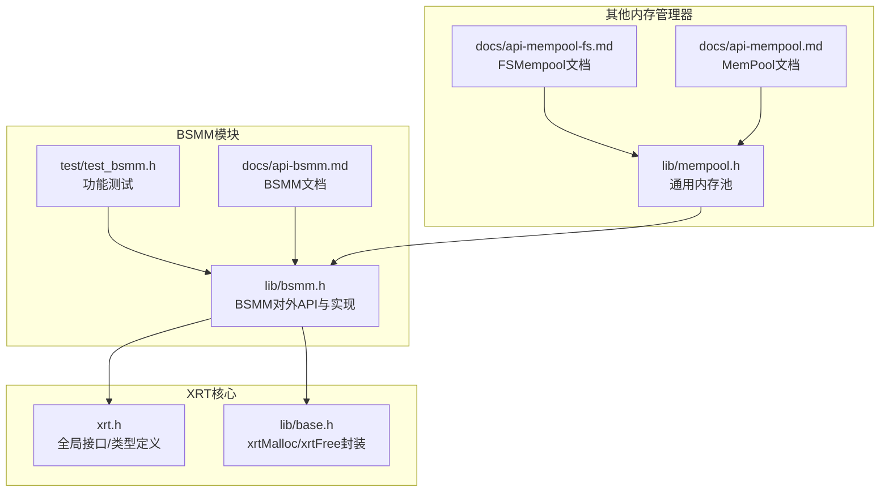
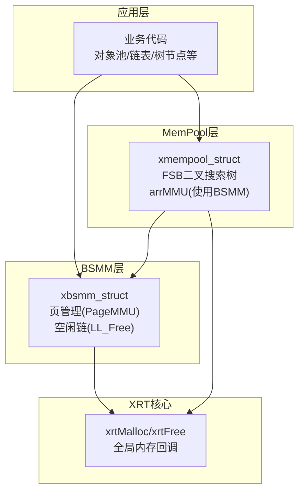
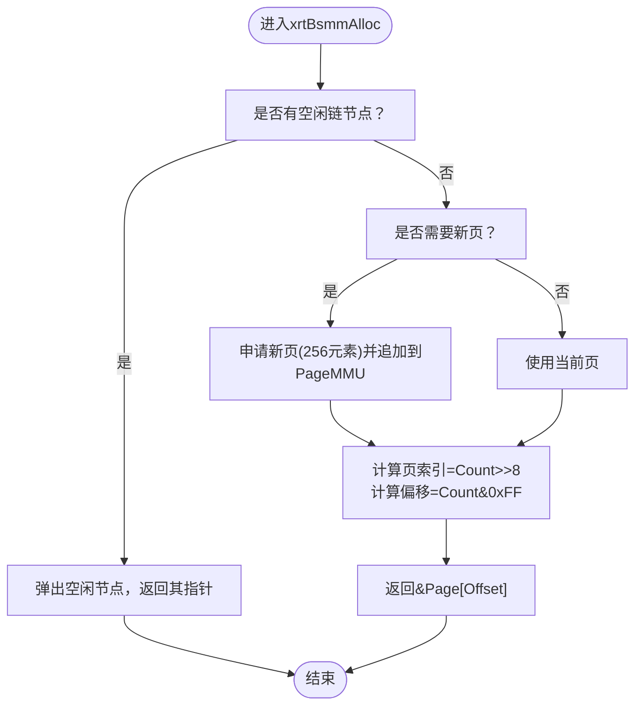
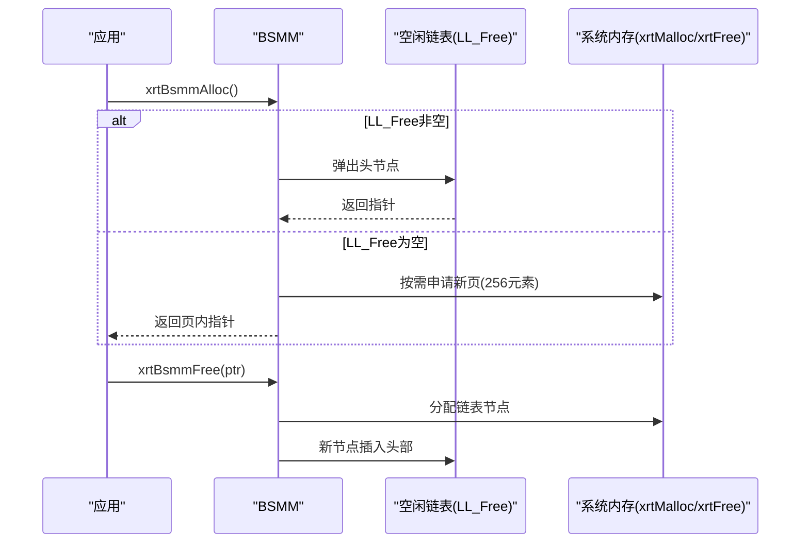
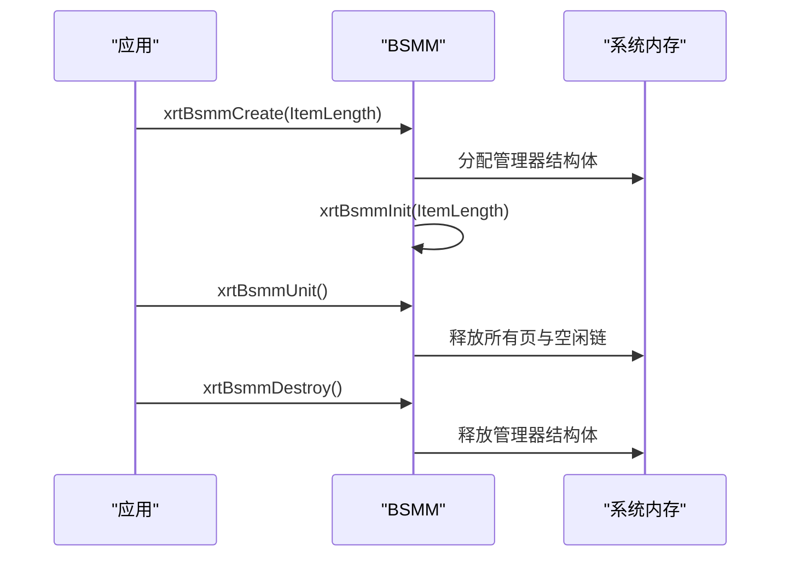
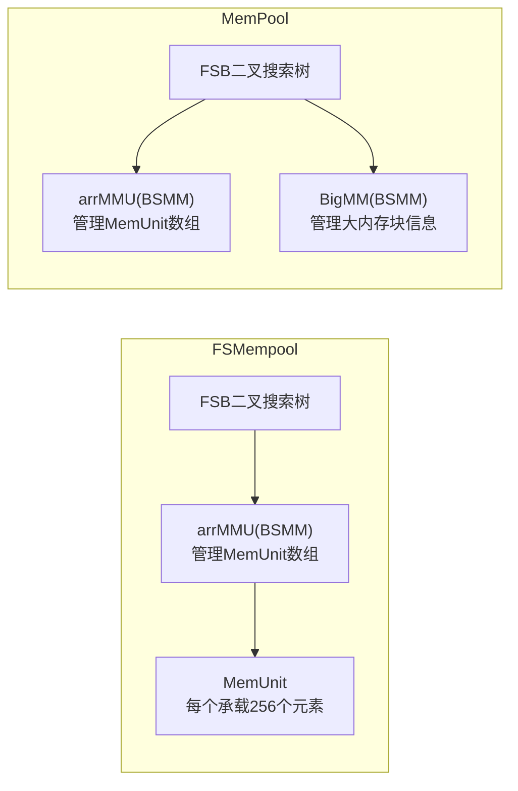
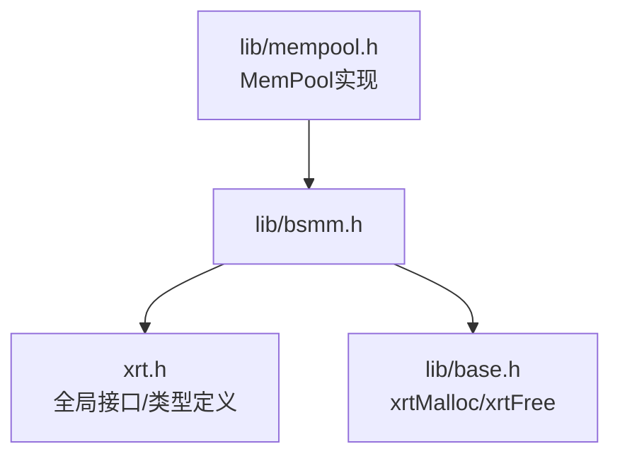

# 块结构内存管理(BSMM)

<cite>
**本文引用的文件列表**
- [lib/bsmm.h](file://lib/bsmm.h)
- [test/test_bsmm.h](file://test/test_bsmm.h)
- [docs/api-bsmm.md](file://docs/api-bsmm.md)
- [xrt.h](file://xrt.h)
- [lib/base.h](file://lib/base.h)
- [lib/mempool.h](file://lib/mempool.h)
- [docs/api-mempool-fs.md](file://docs/api-mempool-fs.md)
- [docs/api-mempool.md](file://docs/api-mempool.md)
</cite>

## 目录
1. [简介](#简介)
2. [项目结构](#项目结构)
3. [核心组件](#核心组件)
4. [架构总览](#架构总览)
5. [详细组件分析](#详细组件分析)
6. [依赖关系分析](#依赖关系分析)
7. [性能考量](#性能考量)
8. [故障排查指南](#故障排查指南)
9. [结论](#结论)
10. [附录](#附录)

## 简介
BSMM（Blocks Struct Memory Management）是XRT库提供的块结构内存管理器，专为“固定大小结构体”的频繁分配与释放而设计。其核心特性包括：
- 每页固定容纳256个元素，按需分配新页
- 释放的内存通过空闲链表进行复用，提升分配效率
- 分配与释放均为O(1)时间复杂度
- 所有分配大小一致，避免内存碎片

BSMM在XRT内存管理架构中扮演“轻量级对象池”的角色，常与通用内存池（MemPool）配合使用：BSMM负责小对象的高效分配，MemPool负责更大范围的内存尺寸管理与二叉搜索树（FSB）组织。

## 项目结构
围绕BSMM的关键文件与职责如下：
- lib/bsmm.h：BSMM对外API与实现主体（创建、销毁、初始化、单元化、分配、释放等）
- test/test_bsmm.h：BSMM功能与流程测试样例（创建、分配、释放、复用、销毁）
- docs/api-bsmm.md：BSMM官方文档，包含数据结构、API说明、使用场景与对比
- xrt.h：XRT全局接口与基础类型定义（内存回调、全局数据结构等）
- lib/base.h：xrtMalloc/xrtFree等基础内存封装
- lib/mempool.h：通用内存池实现，其中使用BSMM作为底层页管理器
- docs/api-mempool-fs.md：固定大小内存池文档，展示BSMM在FSMempool中的角色
- docs/api-mempool.md：通用内存池文档，展示BSMM在MemPool中的角色

图表来源
- [lib/bsmm.h](file://lib/bsmm.h#L1-L94)
- [test/test_bsmm.h](file://test/test_bsmm.h#L1-L434)
- [docs/api-bsmm.md](file://docs/api-bsmm.md#L1-L666)
- [xrt.h](file://xrt.h#L1065-L1106)
- [lib/base.h](file://lib/base.h#L1-L132)
- [lib/mempool.h](file://lib/mempool.h#L1-L200)
- [docs/api-mempool-fs.md](file://docs/api-mempool-fs.md#L33-L62)
- [docs/api-mempool.md](file://docs/api-mempool.md#L34-L68)

章节来源
- [lib/bsmm.h](file://lib/bsmm.h#L1-L94)
- [docs/api-bsmm.md](file://docs/api-bsmm.md#L1-L666)

## 核心组件
- xbsmm_struct：BSMM管理器主体，包含以下关键字段
  - ItemLength：每个元素的字节数
  - Count：已分配元素总数（含已释放）
  - PageMMU：内存页指针数组（每页256个元素），用于承载元素
  - LL_Free：空闲内存块链表，用于释放后的复用
- MemPtr_LLNode：空闲链表节点，保存已释放元素的指针

这些组件共同实现了“按页分配+空闲复用”的高效内存管理策略。

章节来源
- [docs/api-bsmm.md](file://docs/api-bsmm.md#L64-L83)
- [lib/bsmm.h](file://lib/bsmm.h#L24-L49)

## 架构总览
BSMM在XRT内存管理架构中的定位与协作关系如下：
- 作为“小对象池”：为固定大小结构体提供O(1)分配与复用
- 与MemPool协作：MemPool通过FSB（二叉搜索树）按尺寸范围组织，内部使用BSMM管理具体页
- 与通用内存池（MemPool）配合：MemPool负责大范围尺寸的组织与分配，BSMM负责每一页内的元素分配

图表来源
- [lib/mempool.h](file://lib/mempool.h#L35-L145)
- [docs/api-mempool-fs.md](file://docs/api-mempool-fs.md#L33-L62)
- [docs/api-mempool.md](file://docs/api-mempool.md#L34-L68)
- [lib/bsmm.h](file://lib/bsmm.h#L1-L94)

## 详细组件分析

### 组件A：内存页管理与索引（PageMMU）
- 设计要点
  - 每页固定256个元素，通过PageMMU（指针数组）动态增长
  - 通过位运算快速计算元素所在页与页内偏移：页索引由高位移位得到，页内偏移由低位掩码得到
- 关键流程
  - 当Count达到当前页容量上限时，申请新页（256个元素），并将其追加到PageMMU
  - 从PageMMU中按页索引与偏移直接取地址，实现O(1)访问

图表来源
- [lib/bsmm.h](file://lib/bsmm.h#L52-L82)

章节来源
- [lib/bsmm.h](file://lib/bsmm.h#L52-L82)
- [docs/api-bsmm.md](file://docs/api-bsmm.md#L226-L281)

### 组件B：空闲链表复用（LL_Free）
- 设计要点
  - 释放时将指针包装为链表节点，插入LL_Free头部
  - 分配时优先从LL_Free取节点，避免系统内存分配
- 行为特征
  - 释放即复用，不立即归还系统内存
  - 销毁管理器时才统一释放所有页与链表

图表来源
- [lib/bsmm.h](file://lib/bsmm.h#L52-L91)
- [lib/base.h](file://lib/base.h#L5-L45)

章节来源
- [lib/bsmm.h](file://lib/bsmm.h#L84-L91)
- [lib/base.h](file://lib/base.h#L5-L45)

### 组件C：管理器生命周期（创建/初始化/单元化/销毁）
- xrtBsmmCreate：创建并初始化BSMM
- xrtBsmmInit：对内嵌结构体进行初始化（不申请外部内存）
- xrtBsmmUnit：释放内部数据（页与空闲链），保留管理器结构体
- xrtBsmmDestroy：销毁管理器，释放所有资源

图表来源
- [lib/bsmm.h](file://lib/bsmm.h#L5-L21)
- [lib/bsmm.h](file://lib/bsmm.h#L24-L49)
- [lib/bsmm.h](file://lib/bsmm.h#L15-L21)

章节来源
- [lib/bsmm.h](file://lib/bsmm.h#L5-L21)
- [lib/bsmm.h](file://lib/bsmm.h#L24-L49)
- [docs/api-bsmm.md](file://docs/api-bsmm.md#L86-L224)

### 组件D：在XRT内存管理架构中的协作
- 在FSMempool中：FSMempool内部使用BSMM管理MemUnit数组，每个MemUnit承载256个元素，从而形成“页内元素+页外单元”的两级管理
- 在MemPool中：MemPool通过FSB二叉搜索树按尺寸范围组织，内部使用BSMM管理arrMMU（MemUnit数组），并使用另一个BSMM管理大内存块信息

图表来源
- [docs/api-mempool-fs.md](file://docs/api-mempool-fs.md#L33-L62)
- [docs/api-mempool.md](file://docs/api-mempool.md#L34-L68)
- [lib/mempool.h](file://lib/mempool.h#L35-L145)

章节来源
- [docs/api-mempool-fs.md](file://docs/api-mempool-fs.md#L33-L62)
- [docs/api-mempool.md](file://docs/api-mempool.md#L34-L68)
- [lib/mempool.h](file://lib/mempool.h#L35-L145)

## 依赖关系分析
- 内部依赖
  - xbsmm_struct依赖PageMMU（指针数组）与LL_Free（单向链表）
  - PageMMU基于指针数组（xparray）实现，具有预分配步长与扩容能力
- 外部依赖
  - 通过xrtMalloc/xrtFree进行系统内存分配与释放
  - 与MemPool紧密协作，作为其底层页管理器

图表来源
- [lib/bsmm.h](file://lib/bsmm.h#L1-L94)
- [xrt.h](file://xrt.h#L1065-L1106)
- [lib/base.h](file://lib/base.h#L1-L132)
- [lib/mempool.h](file://lib/mempool.h#L1-L200)

章节来源
- [lib/bsmm.h](file://lib/bsmm.h#L1-L94)
- [lib/base.h](file://lib/base.h#L1-L132)
- [lib/mempool.h](file://lib/mempool.h#L1-L200)

## 性能考量
- 时间复杂度
  - 分配与释放均为O(1)，得益于空闲链表与页内索引
- 空间复杂度
  - 每页固定256个元素，按需增长；空闲链表节点开销较小
- 适用场景
  - 频繁创建/销毁的固定大小结构体（如对象池、链表节点、树节点）
  - 对分配速度敏感且可接受“释放即复用”的内存管理模式
- 限制
  - 仅适用于固定大小结构体，无法处理变长内存
  - 释放的内存不会立即归还系统，适合长期运行的稳定内存池

章节来源
- [docs/api-bsmm.md](file://docs/api-bsmm.md#L21-L31)
- [docs/api-bsmm.md](file://docs/api-bsmm.md#L572-L583)

## 故障排查指南
- 常见问题
  - 悬挂指针：释放后继续使用原指针会导致未定义行为，应将指针置空
  - 内存泄漏：仅调用xrtBsmmUnit而不销毁管理器，会导致管理器结构体泄漏
  - 分配失败：当系统内存不足或PageMMU扩容失败时，分配返回NULL
- 排查步骤
  - 检查释放后是否置空指针
  - 确认是否正确调用xrtBsmmDestroy释放所有资源
  - 在分配前检查返回值，必要时回退到其他分配策略
- 相关API参考
  - xrtBsmmAlloc/xrtBsmmFree：分配与释放
  - xrtBsmmUnit/xrtBsmmDestroy：单元化与销毁
  - xrtBsmmGetPtr_Inline：内联按索引访问（不推荐常规使用）

章节来源
- [docs/api-bsmm.md](file://docs/api-bsmm.md#L284-L340)
- [docs/api-bsmm.md](file://docs/api-bsmm.md#L207-L224)
- [docs/api-bsmm.md](file://docs/api-bsmm.md#L343-L372)

## 结论
BSMM以“每页256元素+空闲链表复用”为核心设计，为固定大小结构体提供了极高的分配与复用效率。它在XRT内存管理架构中承担“小对象池”的角色，与MemPool形成互补：BSMM专注页内高效分配，MemPool负责按尺寸范围的组织与调度。对于高频创建/销毁的小对象，BSMM是理想选择；结合MemPool可构建覆盖全尺寸范围的高性能内存管理方案。

## 附录
- 使用示例路径
  - 创建与销毁：参见[docs/api-bsmm.md](file://docs/api-bsmm.md#L88-L155)
  - 分配与释放：参见[docs/api-bsmm.md](file://docs/api-bsmm.md#L228-L340)
  - 对象池模式：参见[docs/api-bsmm.md](file://docs/api-bsmm.md#L374-L447)
  - 链表/树节点分配：参见[docs/api-bsmm.md](file://docs/api-bsmm.md#L450-L568)
- 实现细节路径
  - 分配流程：参见[lib/bsmm.h](file://lib/bsmm.h#L52-L82)
  - 释放流程：参见[lib/bsmm.h](file://lib/bsmm.h#L84-L91)
  - 生命周期：参见[lib/bsmm.h](file://lib/bsmm.h#L5-L21), [lib/bsmm.h](file://lib/bsmm.h#L24-L49)
- 测试用例路径
  - 功能测试：参见[test/test_bsmm.h](file://test/test_bsmm.h#L12-L434)