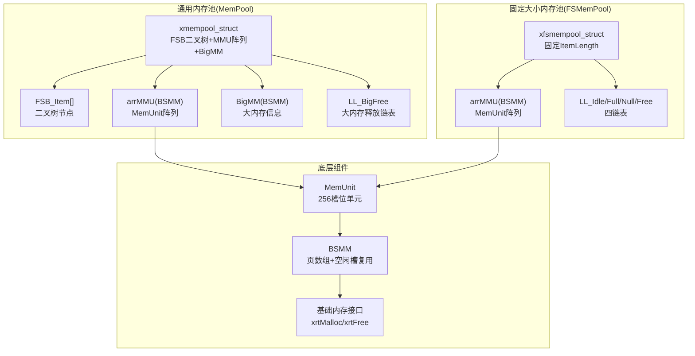
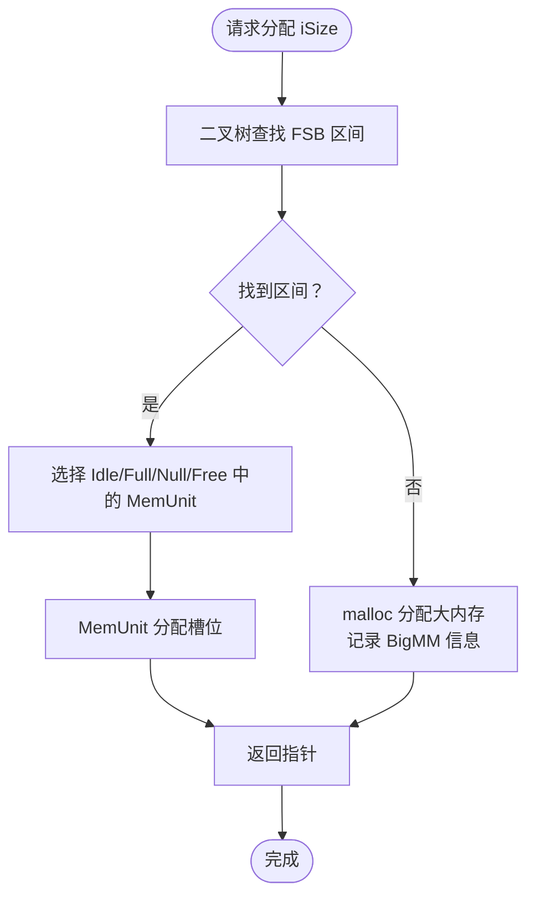
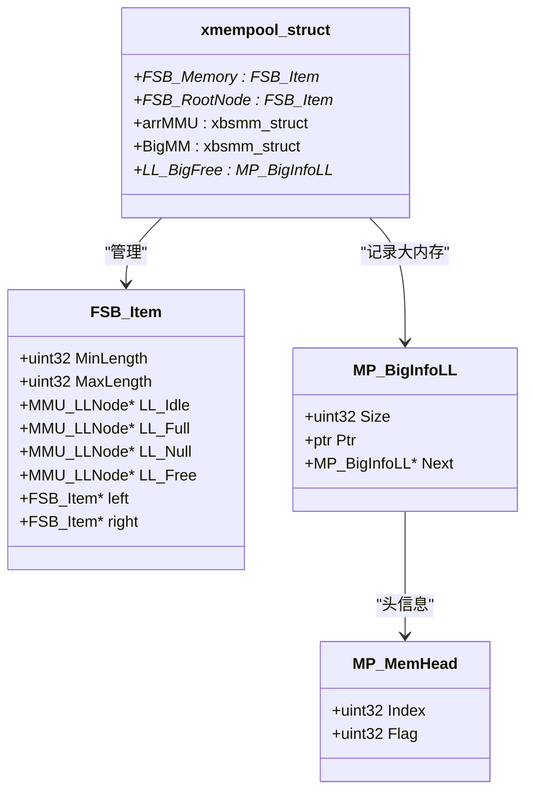
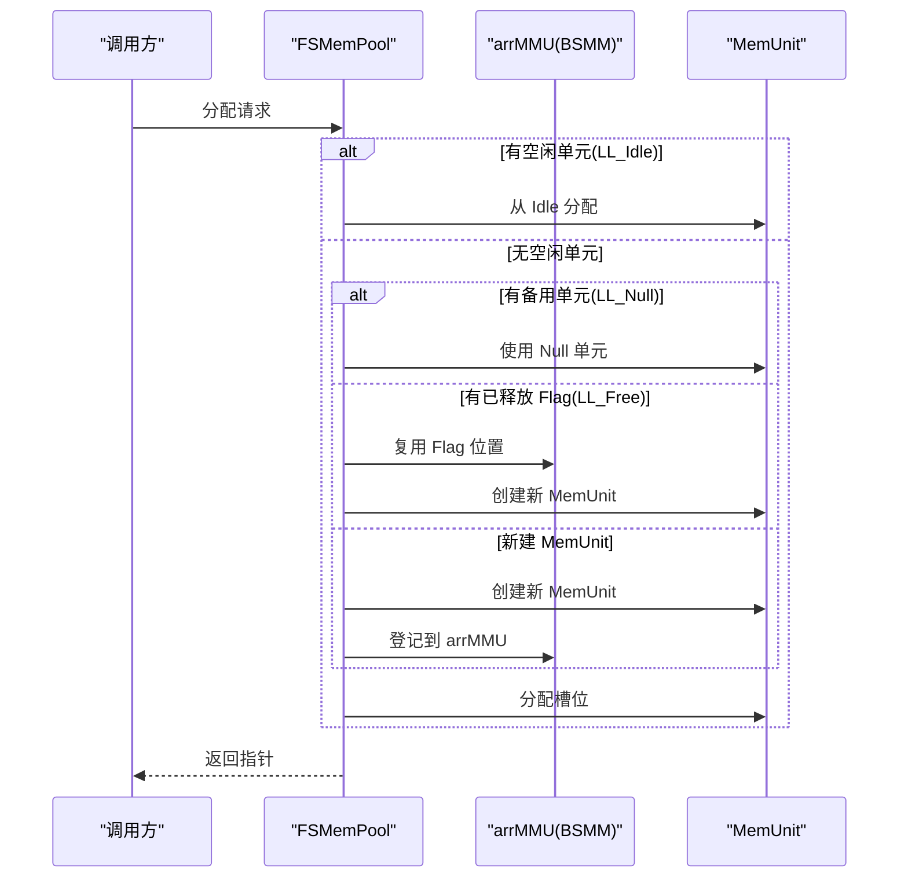
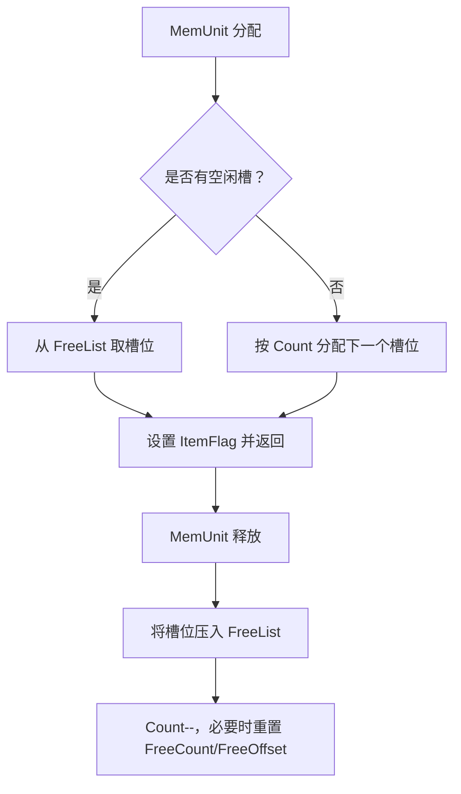
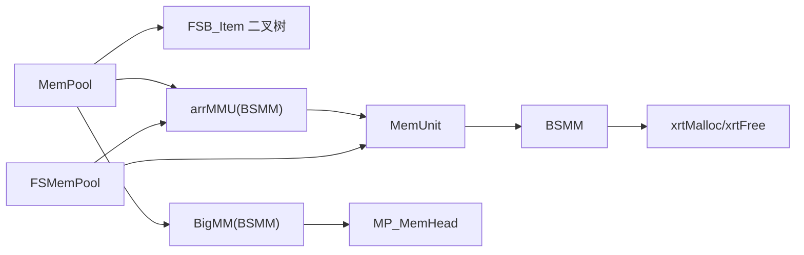

# 通用内存池

<cite>
**本文档引用的文件**
- [lib/mempool.h](file://lib/mempool.h)
- [lib/mempool_fs.h](file://lib/mempool_fs.h)
- [lib/memunit.h](file://lib/memunit.h)
- [lib/bsmm.h](file://lib/bsmm.h)
- [lib/base.h](file://lib/base.h)
- [docs/api-mempool.md](file://docs/api-mempool.md)
- [docs/api-mempool-fs.md](file://docs/api-mempool-fs.md)
- [test/test_mempool.h](file://test/test_mempool.h)
- [test/test_mempool_fs.h](file://test/test_mempool_fs.h)
- [xrt.h](file://xrt.h)
</cite>

## 目录
1. [简介](#简介)
2. [项目结构](#项目结构)
3. [核心组件](#核心组件)
4. [架构总览](#架构总览)
5. [详细组件分析](#详细组件分析)
6. [依赖关系分析](#依赖关系分析)
7. [性能考量](#性能考量)
8. [故障排查指南](#故障排查指南)
9. [结论](#结论)
10. [附录](#附录)

## 简介
本文件系统性阐述通用内存池（MemPool）的实现与使用，重点解析其“二叉树索引 FSB（Fixed-Size Block）机制”，涵盖内存块索引策略、查找算法、分配优化、多级分块管理（小块分割与大块兜底）、碎片化控制、自适应分配策略、性能分析与调优建议。同时给出与固定大小内存池（FSMemPool）的对比，帮助读者在不同场景下做出合适的选择。

## 项目结构
- 通用内存池（MemPool）位于 lib/mempool.h，提供可变大小内存分配与 GC 支持。
- 固定大小内存池（FSMemPool）位于 lib/mempool_fs.h，提供固定大小对象的高效分配与 GC 支持。
- 内存单元（MemUnit）位于 lib/memunit.h，负责单个 256 槽位内存块的分配与回收。
- 块结构内存管理器（BSMM）位于 lib/bsmm.h，负责动态扩展的内存页数组与空闲槽位复用。
- 基础内存接口（xrtMalloc/xrtFree）位于 lib/base.h，作为底层内存分配入口。
- 文档位于 docs/api-mempool.md 与 docs/api-mempool-fs.md，提供 API 说明、数据结构与使用示例。
- 测试位于 test/test_mempool.h 与 test/test_mempool_fs.h，覆盖树结构打印、分配/释放、GC 等场景。

图表来源
- [lib/mempool.h](file://lib/mempool.h#L148-L261)
- [lib/mempool_fs.h](file://lib/mempool_fs.h#L24-L49)
- [lib/memunit.h](file://lib/memunit.h#L5-L19)
- [lib/bsmm.h](file://lib/bsmm.h#L24-L82)
- [lib/base.h](file://lib/base.h#L5-L45)

章节来源
- [lib/mempool.h](file://lib/mempool.h#L35-L119)
- [lib/mempool_fs.h](file://lib/mempool_fs.h#L24-L49)
- [docs/api-mempool.md](file://docs/api-mempool.md#L22-L33)
- [docs/api-mempool-fs.md](file://docs/api-mempool-fs.md#L21-L32)

## 核心组件
- 通用内存池（MemPool）
  - 二叉树索引 FSB：按请求大小 O(log n) 快速定位适合的 MemUnit 区间。
  - 大内存兜底：超出 FSB 范围使用 malloc，并记录 BigMM 信息以便统一回收。
  - 四链表管理：Idle/Full/Null/Free，避免临界状态反复创建/销毁，提升吞吐。
  - GC 支持：标记-清除回收，配合上层业务进行周期性清理。
- 固定大小内存池（FSMemPool）
  - 固定 ItemLength，无 256 限制，自动扩展。
  - 四链表管理，O(1) 分配概率高，适合高频小对象。
  - GC 支持，便于构建带 GC 的对象堆。
- 内存单元（MemUnit）
  - 单元内 256 个槽位，按需复用空闲槽，减少碎片。
  - 支持 GC 标记回收策略。
- 块结构内存管理器（BSMM）
  - 动态页数组，按需申请 256 个槽位的内存块。
  - 空闲槽位链表复用，降低分配成本。

章节来源
- [lib/mempool.h](file://lib/mempool.h#L148-L261)
- [lib/mempool_fs.h](file://lib/mempool_fs.h#L52-L125)
- [lib/memunit.h](file://lib/memunit.h#L22-L86)
- [lib/bsmm.h](file://lib/bsmm.h#L52-L91)
- [docs/api-mempool.md](file://docs/api-mempool.md#L26-L32)
- [docs/api-mempool-fs.md](file://docs/api-mempool-fs.md#L25-L31)

## 架构总览
通用内存池采用“二叉树索引 + 多级分块”的混合架构：
- 小块内存：通过 FSB 二叉树定位区间，从对应 MemUnit 分配；若 MemUnit 即将满载则迁移到 Full 链表，空闲则回到 Idle 链表。
- 大块内存：直接 malloc 分配，记录 BigMM 信息，统一由 GC 或销毁时回收。
- 备用与复用：LL_Null（最多1个备用全空单元）避免临界状态抖动；LL_Free 复用已释放的 Flag 槽位，避免冲突。
- GC：遍历 Idle/Full 链表，按标记策略回收未使用槽位，再重新分类。

图表来源
- [lib/mempool.h](file://lib/mempool.h#L148-L261)
- [lib/mempool_fs.h](file://lib/mempool_fs.h#L52-L125)

章节来源
- [lib/mempool.h](file://lib/mempool.h#L148-L261)
- [lib/mempool_fs.h](file://lib/mempool_fs.h#L52-L125)

## 详细组件分析

### 组件一：通用内存池（MemPool）——二叉树索引 FSB 机制
- FSB 二叉树构建
  - 预设两套配置：iCustom=1（4层树，1-512B，15个区间）、iCustom=2（5层树，1-4096B，31个区间）。
  - 二叉树按插入顺序构建，避免旋转带来的额外开销，保证 O(log n) 查找。
- 内存块索引策略
  - 每个 FSB_Item 维护区间 [MinLength, MaxLength]，并维护四条链表：LL_Idle、LL_Full、LL_Null、LL_Free。
  - 通过请求大小 iSize 在二叉树中二分查找，命中后从对应区间链表分配。
- 查找算法
  - 从根节点开始，若 iSize < MinLength 则走左子树，若 iSize > MaxLength 则走右子树，否则命中。
- 分配优化
  - 优先使用 LL_Idle；若无空闲则尝试 LL_Null 或复用 LL_Free 的位置；最后创建新 MemUnit 并登记到 arrMMU。
  - 当 MemUnit 即将满载（Count>=255）时迁移到 LL_Full；空闲时回到 LL_Idle。
  - 若 MemUnit 清空，则进入 LL_Null（若有备用）或 LL_Free（无备用）。
- 大块内存兜底
  - 超出 FSB 范围时，使用 malloc 分配，记录 MP_MemHead 与 MP_BigInfoLL，统一回收。
- GC 回收
  - 遍历 FSB 树所有 Idle/Full MemUnit，按标记策略回收；随后重新分类。

图表来源
- [lib/mempool.h](file://lib/mempool.h#L148-L155)
- [lib/mempool.h](file://lib/mempool.h#L119-L145)
- [docs/api-mempool.md](file://docs/api-mempool.md#L84-L110)

章节来源
- [lib/mempool.h](file://lib/mempool.h#L24-L119)
- [lib/mempool.h](file://lib/mempool.h#L148-L261)
- [docs/api-mempool.md](file://docs/api-mempool.md#L113-L166)

### 组件二：固定大小内存池（FSMemPool）——四链表管理
- 结构组成
  - ItemLength：每个元素大小（不含头部4字节）。
  - arrMMU（BSMM）：管理 MMU_LLNode 数组，间接管理 MemUnit。
  - 四链表：LL_Idle（空闲）、LL_Full（满载）、LL_Null（备用全空，最多1个）、LL_Free（已释放 Flag 槽位）。
- 分配策略
  - 优先从 LL_Idle 头部分配；若无则尝试 LL_Null 或复用 LL_Free 的 Flag 位置创建新 MemUnit；最后新建 MemUnit 并登记。
  - 分配后若 MemUnit 满载（Count>=255）迁移到 LL_Full。
- 释放与复用
  - 通过指针前4字节的 ItemFlag 定位所属 MemUnit 与槽位索引，释放后按策略回到 Idle/Null/Free。
- GC 回收
  - 遍历 Idle/Full，按标记策略回收未使用槽位，再重新分类。

图表来源
- [lib/mempool_fs.h](file://lib/mempool_fs.h#L52-L125)
- [lib/memunit.h](file://lib/memunit.h#L22-L41)
- [lib/bsmm.h](file://lib/bsmm.h#L52-L82)

章节来源
- [lib/mempool_fs.h](file://lib/mempool_fs.h#L24-L125)
- [lib/mempool_fs.h](file://lib/mempool_fs.h#L199-L221)
- [docs/api-mempool-fs.md](file://docs/api-mempool-fs.md#L76-L123)

### 组件三：内存单元（MemUnit）与块结构内存管理器（BSMM）
- MemUnit
  - 单元内 256 个槽位，头部 4 字节保存 ItemFlag（含所属单元编号与槽位索引）。
  - 分配时优先复用 FreeList 中的空闲槽，释放时将槽位压入 FreeList。
  - GC 时按标记策略回收未使用槽位。
- BSMM
  - 动态页数组，每页 256 个槽位，按需申请内存块。
  - 空闲槽位链表复用，避免频繁系统调用。
  - 支持从 arrMMU 中复用已释放的 MMU_LLNode 位置，降低碎片与分配成本。

图表来源
- [lib/memunit.h](file://lib/memunit.h#L22-L86)
- [lib/bsmm.h](file://lib/bsmm.h#L52-L91)

章节来源
- [lib/memunit.h](file://lib/memunit.h#L5-L143)
- [lib/bsmm.h](file://lib/bsmm.h#L24-L91)

### 组件四：自适应分配策略与多级分块管理
- 自适应策略
  - 小块内存：通过 FSB 二叉树 O(log n) 定位区间，从 MemUnit 分配，满足高频小对象需求。
  - 大块内存：直接 malloc，记录 BigMM 信息，避免小块池碎片化。
- 多级分块
  - 小块：按区间划分，每个区间维护独立链表，便于快速定位与复用。
  - 大块：统一管理，支持 GC 回收与销毁时统一释放。
- 碎片化控制
  - 小块：通过 256 槽位单元与空闲槽复用，降低内部碎片。
  - 大块：集中管理，避免细粒度碎片；GC 可回收未使用大块。

章节来源
- [lib/mempool.h](file://lib/mempool.h#L148-L261)
- [lib/mempool_fs.h](file://lib/mempool_fs.h#L52-L125)
- [docs/api-mempool.md](file://docs/api-mempool.md#L69-L79)
- [docs/api-mempool-fs.md](file://docs/api-mempool-fs.md#L64-L72)

## 依赖关系分析
- MemPool 依赖
  - FSB 二叉树（FSB_Item）与四链表（LL_Idle/Full/Null/Free）组织 MemUnit。
  - arrMMU（BSMM）管理 MemUnit 阵列，BigMM（BSMM）管理大内存信息。
  - MemUnit 提供 256 槽位分配与 GC 能力。
- FSMemPool 依赖
  - 与 MemUnit 类似，但无 256 限制，通过 BSMM 动态扩展。
- 底层依赖
  - xrtMalloc/xrtFree 提供系统内存分配与错误处理。

图表来源
- [lib/mempool.h](file://lib/mempool.h#L35-L119)
- [lib/mempool_fs.h](file://lib/mempool_fs.h#L24-L49)
- [lib/memunit.h](file://lib/memunit.h#L5-L19)
- [lib/bsmm.h](file://lib/bsmm.h#L24-L30)
- [lib/base.h](file://lib/base.h#L5-L45)

章节来源
- [lib/mempool.h](file://lib/mempool.h#L35-L119)
- [lib/mempool_fs.h](file://lib/mempool_fs.h#L24-L49)
- [lib/bsmm.h](file://lib/bsmm.h#L24-L30)
- [lib/base.h](file://lib/base.h#L5-L45)

## 性能考量
- 内存利用率
  - 小块：256 槽位单元 + 空闲槽复用，内部碎片低；FSB 区间划分减少跨区间浪费。
  - 大块：集中管理，GC 可回收未使用大块，避免细碎碎片。
- 分配速度
  - MemPool：二叉树查找 O(log n)，分配 O(1)；FSMemPool：分配 O(1)。
  - 通过 LL_Idle/Null/Free 复用，避免频繁系统调用。
- 碎片化程度
  - 小块：极低内部碎片；大块：集中管理，外部碎片可控。
- GC 成本
  - 遍历 Idle/Full 链表，按标记策略回收；可按需调用，平衡吞吐与内存占用。
- 调优建议
  - 选择合适预设：iCustom=1（1-512B）或 iCustom=2（1-4096B），减少二叉树深度。
  - 控制对象生命周期：定期执行 GC，回收未使用内存。
  - 大量小对象：优先使用 FSMemPool，获得更稳定的 O(1) 分配。
  - 大对象或超大对象：使用 MemPool 的大块兜底，避免小块池碎片化。

章节来源
- [docs/api-mempool.md](file://docs/api-mempool.md#L69-L79)
- [docs/api-mempool-fs.md](file://docs/api-mempool-fs.md#L64-L72)
- [docs/api-mempool.md](file://docs/api-mempool.md#L708-L717)

## 故障排查指南
- 常见问题
  - 无法分配：检查 iSize 是否超出 FSB 范围；确认 LL_Idle/LL_Null/LL_Free 是否可用。
  - 释放异常：确认指针来自同一池，且未越界；检查 ItemFlag 是否正确。
  - GC 后指针失效：GC 会清除标记，需重新标记后再使用。
- 排查步骤
  - 打印二叉树结构：参考测试用例中的树打印函数，验证 FSB 树构建是否正确。
  - 观察链表状态：检查 LL_Idle/Full/Null/Free 的变化，确认 MemUnit 状态迁移是否符合预期。
  - 错误日志：通过 xrtSetError 获取底层错误信息，定位失败原因。

章节来源
- [test/test_mempool.h](file://test/test_mempool.h#L5-L20)
- [test/test_mempool_fs.h](file://test/test_mempool_fs.h#L18-L74)
- [lib/base.h](file://lib/base.h#L89-L132)

## 结论
通用内存池（MemPool）通过“二叉树索引 FSB + 多级分块 + 四链表复用 + GC”实现了对可变大小内存的高效管理；固定大小内存池（FSMemPool）则在固定大小对象场景下提供极致的 O(1) 分配性能。两者结合，既能满足高频小对象的稳定吞吐，也能应对大对象与超大对象的灵活分配需求。合理选择预设、控制生命周期与定期 GC，是获得优异性能与低碎片的关键。

## 附录

### API 与数据结构概览
- 通用内存池（MemPool）
  - 创建/销毁/初始化：xrtMemPoolCreate/xrtMemPoolDestroy/xrtMemPoolInit/xrtMemPoolUnit
  - 分配/释放：xrtMemPoolAlloc/xrtMemPoolFree
  - GC：xrtMemPoolGC（配合 xrtMemPoolGC_Mark 标记）
- 固定大小内存池（FSMemPool）
  - 创建/销毁/初始化：xrtFSMemPoolCreate/xrtFSMemPoolDestroy/xrtFSMemPoolInit/xrtFSMemPoolUnit
  - 分配/释放：xrtFSMemPoolAlloc/xrtFSMemPoolFree
  - GC：xrtFSMemPoolGC（配合 xrtFSMemPoolGC_Mark 标记）

章节来源
- [docs/api-mempool.md](file://docs/api-mempool.md#L171-L231)
- [docs/api-mempool.md](file://docs/api-mempool.md#L410-L461)
- [docs/api-mempool.md](file://docs/api-mempool.md#L490-L546)
- [docs/api-mempool-fs.md](file://docs/api-mempool-fs.md#L128-L187)
- [docs/api-mempool-fs.md](file://docs/api-mempool-fs.md#L303-L354)
- [docs/api-mempool-fs.md](file://docs/api-mempool-fs.md#L373-L435)