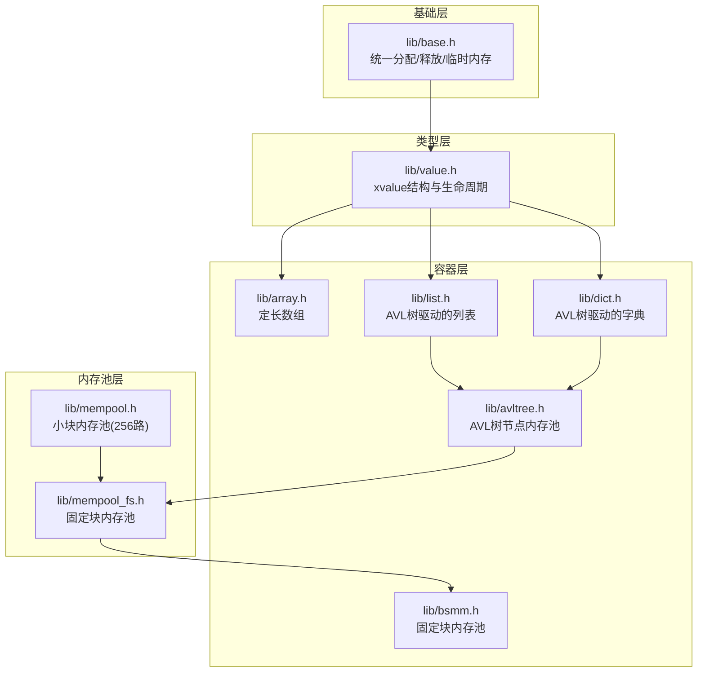
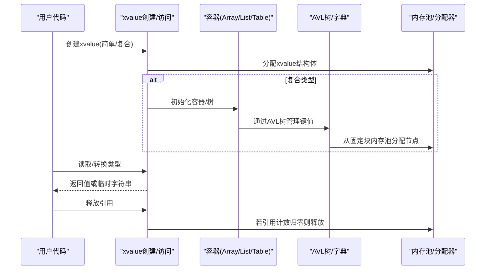
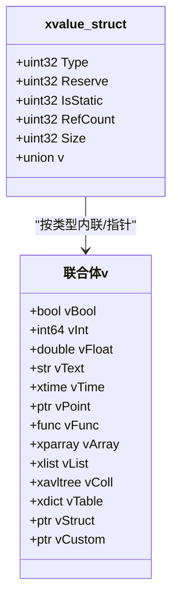
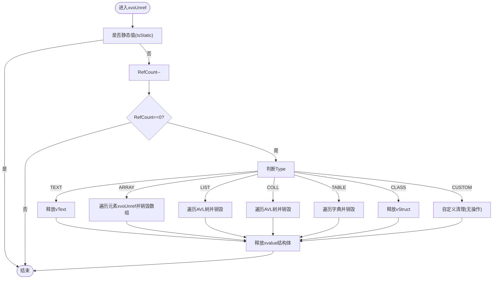
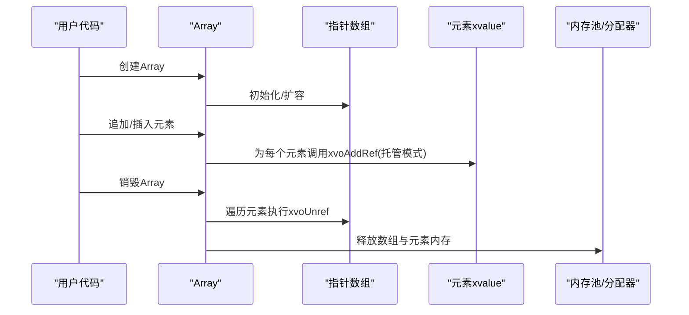
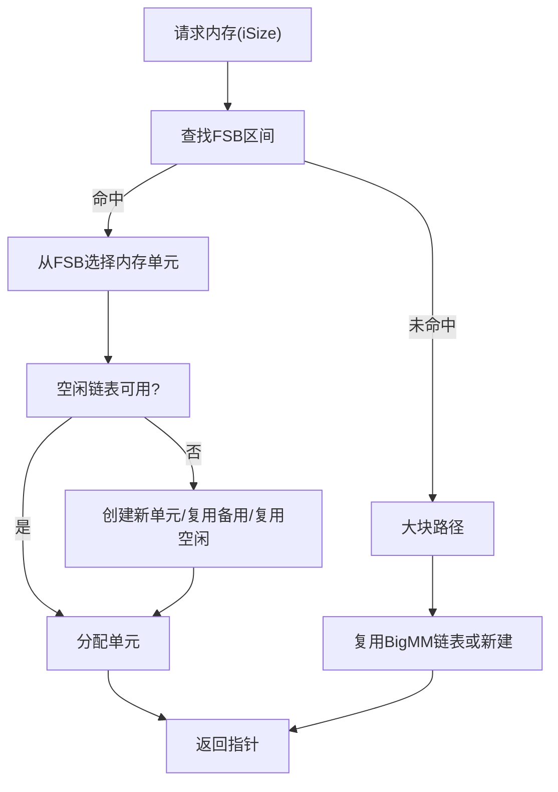
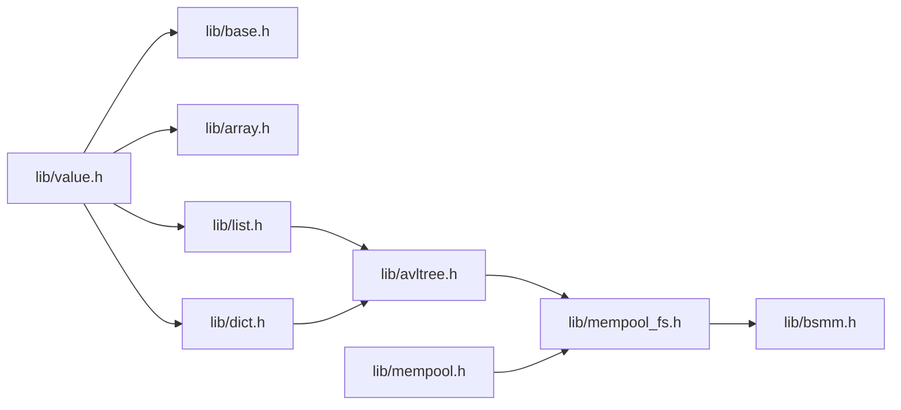

# 内存管理策略

<cite>
**本文档引用的文件**
- [lib/value.h](file://lib/value.h)
- [lib/mempool.h](file://lib/mempool.h)
- [lib/string.h](file://lib/string.h)
- [lib/array.h](file://lib/array.h)
- [lib/list.h](file://lib/list.h)
- [lib/dict.h](file://lib/dict.h)
- [lib/bsmm.h](file://lib/bsmm.h)
- [lib/base.h](file://lib/base.h)
- [lib/avltree.h](file://lib/avltree.h)
- [lib/mempool_fs.h](file://lib/mempool_fs.h)
- [test/test_value.h](file://test/test_value.h)
- [test/test_mempool.h](file://test/test_mempool.h)
- [xrt.h](file://xrt.h)
</cite>

## 目录
1. [简介](#简介)
2. [项目结构](#项目结构)
3. [核心组件](#核心组件)
4. [架构总览](#架构总览)
5. [详细组件分析](#详细组件分析)
6. [依赖关系分析](#依赖关系分析)
7. [性能考量](#性能考量)
8. [故障排查指南](#故障排查指南)
9. [结论](#结论)
10. [附录](#附录)

## 简介
本文件系统性解析XRT动态类型系统（Value）的内存管理策略，围绕xvalue结构体的内存布局、分配与回收机制展开，覆盖简单类型（Int、Float、Bool）的内联存储、复合类型（Array、List、Table）的堆内存管理、文本类型的共享与复制策略，并深入说明内存池集成、碎片处理、GC回收、泄漏预防、监控与性能优化建议。

## 项目结构
XRT将内存管理分为三层：
- 基础层：统一的内存分配接口与临时内存环（lib/base.h）
- 类型层：动态类型值的生命周期管理（lib/value.h）
- 容器层：集合与容器的内存管理（lib/array.h、lib/list.h、lib/dict.h、lib/avltree.h）
- 内存池层：小/大块内存的高效分配与回收（lib/mempool.h、lib/mempool_fs.h、lib/bsmm.h）

图表来源
- [lib/base.h](file://lib/base.h#L5-L45)
- [lib/value.h](file://lib/value.h#L101-L316)
- [lib/array.h](file://lib/array.h#L5-L74)
- [lib/list.h](file://lib/list.h#L19-L47)
- [lib/dict.h](file://lib/dict.h#L30-L62)
- [lib/avltree.h](file://lib/avltree.h#L5-L32)
- [lib/bsmm.h](file://lib/bsmm.h#L24-L49)
- [lib/mempool.h](file://lib/mempool.h#L5-L35)
- [lib/mempool_fs.h](file://lib/mempool_fs.h#L24-L49)

章节来源
- [lib/base.h](file://lib/base.h#L5-L45)
- [lib/value.h](file://lib/value.h#L101-L316)
- [lib/array.h](file://lib/array.h#L5-L74)
- [lib/list.h](file://lib/list.h#L19-L47)
- [lib/dict.h](file://lib/dict.h#L30-L62)
- [lib/avltree.h](file://lib/avltree.h#L5-L32)
- [lib/bsmm.h](file://lib/bsmm.h#L24-L49)
- [lib/mempool.h](file://lib/mempool.h#L5-L35)
- [lib/mempool_fs.h](file://lib/mempool_fs.h#L24-L49)

## 核心组件
- xvalue结构体：统一的动态类型容器，包含类型标识、引用计数、静态标志、大小字段与联合体存储。
- 引用计数与静态值：通过IsStatic与RefCount控制对象生命周期；静态值（如布尔常量）不参与引用计数。
- 文本类型策略：支持托管（共享）与复制两种模式，减少重复分配。
- 容器内存管理：Array使用连续内存块；List/Dict基于AVL树，节点由固定块内存池分配；Table内部键名可由内存池或标准分配器管理。
- 内存池：小块内存采用256路平衡树组织的FSB区间，大块内存走独立路径；提供GC与空闲单元复用。

章节来源
- [lib/value.h](file://lib/value.h#L33-L96)
- [lib/value.h](file://lib/value.h#L137-L167)
- [lib/value.h](file://lib/value.h#L216-L284)
- [lib/mempool.h](file://lib/mempool.h#L148-L261)
- [lib/mempool_fs.h](file://lib/mempool_fs.h#L52-L125)
- [lib/bsmm.h](file://lib/bsmm.h#L52-L91)
- [lib/avltree.h](file://lib/avltree.h#L24-L59)

## 架构总览
XRT的内存管理遵循“按类型分层、按容器细分、按池化优化”的设计原则。xvalue作为顶层抽象，承载简单类型内联与复合类型指针；复合类型内部通过AVL树与固定块内存池实现高效节点分配；内存池层提供小块与大块内存的统一调度，降低碎片并提升吞吐。

图表来源
- [lib/value.h](file://lib/value.h#L101-L316)
- [lib/array.h](file://lib/array.h#L5-L74)
- [lib/list.h](file://lib/list.h#L19-L47)
- [lib/dict.h](file://lib/dict.h#L30-L62)
- [lib/avltree.h](file://lib/avltree.h#L24-L59)
- [lib/mempool_fs.h](file://lib/mempool_fs.h#L52-L125)

## 详细组件分析

### xvalue结构与内存布局
- 关键字段
  - Type：类型标识（Null、Bool、Int、Float、Text、Time、Point、Func、Array、List、Coll、Table、Class、Custom）
  - IsStatic：是否为静态值（静态值不参与引用计数）
  - RefCount：引用计数（上限保护，超限时转为静态）
  - Size：实际数据大小（用于调试与统计）
  - 联合体vXxx：按类型内联存储或指针存储
- 内存布局
  - 简单类型（Int/Float/Bool）直接内联存储于xvalue结构体
  - 复合类型（Array/List/Coll/Table/Class/Custom）存储指向容器或结构体的指针
  - Text类型支持托管（共享）与复制（复制到堆）

图表来源
- [xrt.h](file://xrt.h#L1909-L1929)

章节来源
- [xrt.h](file://xrt.h#L1909-L1929)
- [lib/value.h](file://lib/value.h#L101-L124)
- [lib/value.h](file://lib/value.h#L125-L136)
- [lib/value.h](file://lib/value.h#L137-L167)
- [lib/value.h](file://lib/value.h#L168-L191)
- [lib/value.h](file://lib/value.h#L192-L215)
- [lib/value.h](file://lib/value.h#L216-L284)
- [lib/value.h](file://lib/value.h#L285-L316)

### 引用计数与生命周期管理
- 增加引用：xvoAddRef对非静态对象递增引用计数；超过阈值自动转为静态
- 释放引用：xvoUnref在计数归零时触发销毁流程
- 销毁流程（简化）
  - Text：释放vText指向的堆内存
  - Array：遍历元素执行xvoUnref，销毁内部指针数组
  - List/Coll：遍历AVL树节点，逐个释放
  - Table：遍历字典项，逐个释放
  - Class/Custom：释放对应结构体或自定义对象
  - 最终释放xvalue结构体自身

图表来源
- [lib/value.h](file://lib/value.h#L33-L43)
- [lib/value.h](file://lib/value.h#L59-L96)

章节来源
- [lib/value.h](file://lib/value.h#L33-L43)
- [lib/value.h](file://lib/value.h#L59-L96)

### 简单类型（Int/Float/Bool）的内联存储
- 内存布局：直接存储于xvalue结构体的联合体字段
- 生命周期：随xvalue释放而释放；静态值（如布尔常量）不参与引用计数
- 访问与转换：提供统一的Get/Set接口，支持类型间隐式转换

章节来源
- [lib/value.h](file://lib/value.h#L101-L124)
- [lib/value.h](file://lib/value.h#L125-L136)
- [lib/value.h](file://lib/value.h#L321-L366)

### 文本类型（Text）的共享与复制
- 托管模式（bColloc=TRUE）：直接使用传入字符串指针，不复制
- 复制模式（bColloc=FALSE）：通过xrtCopyStr复制到堆内存
- 释放策略：托管模式不释放；复制模式在xvoUnref时释放vText

章节来源
- [lib/value.h](file://lib/value.h#L137-L167)
- [lib/string.h](file://lib/string.h#L5-L15)

### 复合类型（Array/List/Coll/Table）的堆内存管理
- Array
  - 内存模型：连续内存块，支持预分配与扩容
  - 生命周期：销毁时遍历元素执行xvoUnref，再销毁数组结构
- List
  - 内存模型：基于AVL树，节点由固定块内存池分配
  - 生命周期：销毁时遍历树节点，逐个释放并回收节点内存
- Coll/Table
  - 内存模型：基于AVL树，键名长度与哈希值存储于节点
  - 生命周期：销毁时遍历树节点，释放键名（可能来自内存池或标准分配器）

图表来源
- [lib/value.h](file://lib/value.h#L216-L232)
- [lib/value.h](file://lib/value.h#L541-L557)
- [lib/value.h](file://lib/value.h#L665-L679)
- [lib/array.h](file://lib/array.h#L5-L74)

章节来源
- [lib/value.h](file://lib/value.h#L216-L232)
- [lib/value.h](file://lib/value.h#L541-L557)
- [lib/value.h](file://lib/value.h#L665-L679)
- [lib/array.h](file://lib/array.h#L5-L74)
- [lib/list.h](file://lib/list.h#L19-L47)
- [lib/dict.h](file://lib/dict.h#L30-L62)
- [lib/avltree.h](file://lib/avltree.h#L24-L59)

### 内存池集成与碎片处理
- 小块内存池（mempool）
  - 256路平衡树（FSB）按区间组织，快速定位适合的内存单元
  - 空闲/满载/备用链表管理，避免频繁创建/销毁内存单元
  - 支持GC：标记回收未使用的节点，再重新分类到合适链表
- 固定块内存池（mempool_fs）
  - 专用于固定大小节点（如AVL树节点），提供更高效的分配/回收
- 大块内存
  - 超出FSB范围的请求走独立路径，使用链表复用已释放的大块

图表来源
- [lib/mempool.h](file://lib/mempool.h#L148-L261)
- [lib/mempool_fs.h](file://lib/mempool_fs.h#L52-L125)
- [lib/bsmm.h](file://lib/bsmm.h#L52-L91)

章节来源
- [lib/mempool.h](file://lib/mempool.h#L148-L261)
- [lib/mempool_fs.h](file://lib/mempool_fs.h#L52-L125)
- [lib/bsmm.h](file://lib/bsmm.h#L52-L91)

### GC与泄漏预防
- GC机制
  - 小块池：遍历空闲/满载单元，按标记回收未使用块，再重新分类
  - 大块池：按标记回收被标记的块，未标记的块保留
- 泄漏预防
  - 引用计数上限保护：超过阈值自动转为静态，避免计数溢出
  - 静态值：布尔常量等静态对象不参与引用计数
  - 容器销毁：确保容器内部元素逐一释放，防止悬挂引用

章节来源
- [lib/value.h](file://lib/value.h#L33-L43)
- [lib/mempool.h](file://lib/mempool.h#L388-L465)
- [lib/mempool_fs.h](file://lib/mempool_fs.h#L224-L254)

### 内存使用监控与性能分析
- 监控手段
  - Size字段：记录实际数据大小，便于统计与诊断
  - 临时内存环：xrtTempMemory提供短期使用内存，自动释放过期内容
  - 错误上报：xrtSetError记录分配失败等错误
- 性能优化建议
  - 文本托管：常量字符串使用托管模式，避免复制
  - 预分配：Array使用xvoArrayAlloc预估容量，减少扩容次数
  - 引用管理：bColloc=TRUE减少引用计数开销；bColloc=FALSE时注意成对释放
  - 内存池：优先使用内存池分配小块对象，降低碎片

章节来源
- [lib/value.h](file://lib/value.h#L137-L167)
- [lib/value.h](file://lib/value.h#L680-L689)
- [lib/base.h](file://lib/base.h#L49-L84)
- [lib/base.h](file://lib/base.h#L88-L131)

## 依赖关系分析
- xvalue依赖基础分配器（xrtMalloc/xrtFree）与临时内存环
- 复合类型依赖容器实现（Array/List/Dict/AVLTree）
- AVLTree节点分配依赖固定块内存池
- 内存池依赖BSMM与小块内存单元管理

图表来源
- [lib/value.h](file://lib/value.h#L101-L316)
- [lib/array.h](file://lib/array.h#L5-L74)
- [lib/list.h](file://lib/list.h#L19-L47)
- [lib/dict.h](file://lib/dict.h#L30-L62)
- [lib/avltree.h](file://lib/avltree.h#L24-L59)
- [lib/mempool_fs.h](file://lib/mempool_fs.h#L24-L49)
- [lib/bsmm.h](file://lib/bsmm.h#L24-L49)
- [lib/mempool.h](file://lib/mempool.h#L5-L35)

章节来源
- [lib/value.h](file://lib/value.h#L101-L316)
- [lib/array.h](file://lib/array.h#L5-L74)
- [lib/list.h](file://lib/list.h#L19-L47)
- [lib/dict.h](file://lib/dict.h#L30-L62)
- [lib/avltree.h](file://lib/avltree.h#L24-L59)
- [lib/mempool_fs.h](file://lib/mempool_fs.h#L24-L49)
- [lib/bsmm.h](file://lib/bsmm.h#L24-L49)
- [lib/mempool.h](file://lib/mempool.h#L5-L35)

## 性能考量
- 分配路径选择
  - 小块：优先内存池，减少系统调用与碎片
  - 大块：独立路径，避免污染小块池
- 节点复用
  - 空闲/满载/备用链表减少频繁创建/销毁
  - 固定块池降低对齐与元数据开销
- 访问模式
  - 内联存储的简单类型避免指针间接访问
  - 文本托管减少复制成本
- GC频率
  - 定期GC回收未使用块，保持池活跃度

## 故障排查指南
- 常见问题
  - 内存泄漏：检查是否遗漏xvoUnref；确认bColloc参数使用是否正确
  - 重复释放：避免对同一对象多次xvoUnref
  - 错误上报：关注xrtSetError输出的分配失败信息
- 排查步骤
  - 使用测试用例验证Array/List/Table的增删改查与销毁流程
  - 观察内存池状态（单元数量、空闲链表长度）
  - 临时内存环：确认短期对象未长期占用

章节来源
- [test/test_value.h](file://test/test_value.h#L313-L344)
- [test/test_value.h](file://test/test_value.h#L532-L553)
- [test/test_mempool.h](file://test/test_mempool.h#L116-L154)
- [lib/base.h](file://lib/base.h#L88-L131)

## 结论
XRT的动态类型系统通过xvalue统一抽象，结合内存池与固定块分配，实现了简单类型内联存储与复合类型高效堆管理的平衡。完善的引用计数与GC机制确保生命周期可控，同时提供托管文本与预分配等优化策略，满足高并发与低延迟场景下的内存管理需求。

## 附录
- API参考
  - xvalue创建/销毁与类型转换：参见lib/value.h中的创建与Get系列函数
  - 容器操作：Array/List/Table的增删改查与销毁
  - 内存池：小块/固定块池的创建、分配、释放与GC

章节来源
- [lib/value.h](file://lib/value.h#L101-L316)
- [lib/value.h](file://lib/value.h#L522-L700)
- [lib/mempool.h](file://lib/mempool.h#L5-L35)
- [lib/mempool_fs.h](file://lib/mempool_fs.h#L5-L33)